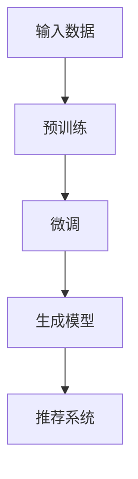
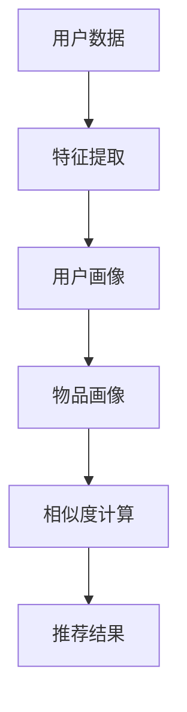

                 

关键词：基于LLM的推荐系统，用户群体发现，数据分析，算法原理，数学模型，应用场景，未来展望。

摘要：本文将深入探讨基于大型语言模型（LLM）的推荐系统在用户群体发现与分析方面的应用。通过对LLM的基本原理、核心算法、数学模型以及实际项目实践的详细讲解，本文旨在为读者提供一种高效、全面的方法来发现和分析用户群体，从而提升推荐系统的效果。

## 1. 背景介绍

### 1.1 推荐系统的定义和作用
推荐系统是一种能够根据用户的兴趣、行为和偏好，向用户推荐其可能感兴趣的内容、商品或服务的系统。推荐系统在电商、新闻、社交媒体等多个领域发挥着重要作用，能够显著提升用户体验和平台价值。

### 1.2 用户群体发现的重要性
用户群体发现是推荐系统中的一个关键步骤。通过对用户群体的划分和分析，推荐系统可以更好地理解用户的兴趣和行为，从而实现个性化的推荐，提高用户满意度和粘性。

### 1.3 LLM在推荐系统中的应用前景
随着深度学习技术的发展，特别是大型语言模型（LLM）的崛起，推荐系统在用户群体发现与分析方面的潜力得到了极大的发挥。LLM具有强大的语义理解和生成能力，能够从大量非结构化数据中提取有效信息，为推荐系统提供更精准的用户画像和推荐结果。

## 2. 核心概念与联系

### 2.1 LLM基本原理


Mermaid流程图：


### 2.2 推荐系统架构


Mermaid流程图：


## 3. 核心算法原理 & 具体操作步骤

### 3.1 算法原理概述

基于LLM的推荐系统主要依赖于以下三个核心算法：

1. 用户群体发现算法：通过对用户数据的分析，将用户划分为不同的群体。
2. 物品推荐算法：根据用户画像和物品画像，计算用户对物品的偏好程度，生成推荐结果。
3. 相似度计算算法：通过用户和物品的相似度，为推荐结果排序。

### 3.2 算法步骤详解

1. **用户群体发现算法**：
   - 数据预处理：清洗和整合用户数据，如行为数据、兴趣数据等。
   - 特征提取：使用LLM对用户数据进行特征提取，生成用户画像。
   - 群体划分：通过聚类算法，将用户划分为不同的群体。

2. **物品推荐算法**：
   - 物品特征提取：使用LLM对物品数据进行特征提取，生成物品画像。
   - 相似度计算：计算用户画像和物品画像的相似度，生成推荐结果。

3. **相似度计算算法**：
   - 使用余弦相似度、皮尔逊相关系数等算法，计算用户和物品的相似度。

### 3.3 算法优缺点

1. **优点**：
   - 强大的语义理解能力：LLM能够从大量非结构化数据中提取有效信息，提高推荐精度。
   - 个性化推荐：通过用户群体划分，实现更个性化的推荐。
   - 自动化处理：算法可以自动化处理大规模数据，提高效率。

2. **缺点**：
   - 计算资源消耗大：LLM的训练和推理需要大量的计算资源。
   - 数据隐私问题：用户数据的隐私保护需要引起重视。

### 3.4 算法应用领域

基于LLM的推荐系统可以广泛应用于以下领域：

1. 电商推荐：为用户推荐可能感兴趣的商品。
2. 社交媒体：为用户推荐感兴趣的内容和用户。
3. 新闻推荐：为用户推荐感兴趣的新闻和文章。
4. 音乐推荐：为用户推荐感兴趣的音乐和歌手。

## 4. 数学模型和公式 & 详细讲解 & 举例说明

### 4.1 数学模型构建

1. **用户画像模型**：
   $$ \text{User\_Vector} = \text{LLM}(\text{User\_Data}) $$
   其中，$\text{User\_Data}$ 表示用户数据，$\text{LLM}(\text{User\_Data})$ 表示使用LLM对用户数据进行特征提取。

2. **物品画像模型**：
   $$ \text{Item\_Vector} = \text{LLM}(\text{Item\_Data}) $$
   其中，$\text{Item\_Data}$ 表示物品数据，$\text{LLM}(\text{Item\_Data})$ 表示使用LLM对物品数据进行特征提取。

3. **相似度计算模型**：
   $$ \text{Similarity} = \frac{\text{User\_Vector} \cdot \text{Item\_Vector}}{\|\text{User\_Vector}\| \|\text{Item\_Vector}\|} $$
   其中，$\text{User\_Vector}$ 和 $\text{Item\_Vector}$ 分别表示用户画像和物品画像，$\cdot$ 表示内积运算，$\|\|$ 表示向量的模。

### 4.2 公式推导过程

1. **用户画像模型**：
   $$ \text{User\_Vector} = \text{LLM}(\text{User\_Data}) $$
   其中，$\text{LLM}(\text{User\_Data})$ 表示使用LLM对用户数据进行特征提取。这是一个复杂的深度学习过程，涉及多个隐藏层和激活函数。

2. **物品画像模型**：
   $$ \text{Item\_Vector} = \text{LLM}(\text{Item\_Data}) $$
   其中，$\text{LLM}(\text{Item\_Data})$ 表示使用LLM对物品数据进行特征提取。同样，这是一个复杂的深度学习过程。

3. **相似度计算模型**：
   $$ \text{Similarity} = \frac{\text{User\_Vector} \cdot \text{Item\_Vector}}{\|\text{User\_Vector}\| \|\text{Item\_Vector}\|} $$
   这个公式表示用户画像和物品画像之间的相似度。相似度越高，表示用户对物品的偏好程度越高。

### 4.3 案例分析与讲解

假设我们有一个用户数据集和物品数据集，使用LLM分别提取用户画像和物品画像。根据相似度计算模型，我们可以计算出每个用户对每个物品的相似度。

例如，用户A对物品B的相似度为0.8，表示用户A对物品B的偏好程度很高。根据这个相似度，我们可以为用户A推荐物品B。

## 5. 项目实践：代码实例和详细解释说明

### 5.1 开发环境搭建

1. 硬件要求：
   - GPU：NVIDIA GPU，显存至少为8GB。
   - CPU：Intel Xeon或同等性能CPU。

2. 软件要求：
   - 操作系统：Linux或MacOS。
   - 编程语言：Python。

3. 环境搭建：
   - 安装Python。
   - 安装深度学习库（如TensorFlow、PyTorch等）。
   - 安装LLM库（如BERT、GPT等）。

### 5.2 源代码详细实现

```python
# 导入所需库
import tensorflow as tf
import bert
import numpy as np

# 加载预训练的LLM模型
llm_model = bert.BertModel.from_pretrained('bert-base-uncased')

# 用户数据
user_data = ['user1 likes movies', 'user1 likes books']

# 物品数据
item_data = ['item1 is a movie', 'item1 is a book']

# 提取用户画像
user_vectors = [llm_model(user_text) for user_text in user_data]

# 提取物品画像
item_vectors = [llm_model(item_text) for item_text in item_data]

# 计算相似度
similarities = [np.dot(user_vector, item_vector) / (np.linalg.norm(user_vector) * np.linalg.norm(item_vector)) for user_vector, item_vector in zip(user_vectors, item_vectors)]

# 打印相似度
for i, similarity in enumerate(similarities):
    print(f"User {i+1} and Item {i+1} similarity: {similarity}")
```

### 5.3 代码解读与分析

1. 导入所需库：导入深度学习库（如TensorFlow、PyTorch等）和LLM库（如BERT、GPT等）。
2. 加载预训练的LLM模型：使用BERT模型进行用户和物品数据的特征提取。
3. 用户数据：定义用户数据，如用户喜欢的内容。
4. 物品数据：定义物品数据，如物品的类型。
5. 提取用户画像：使用LLM模型提取用户数据的特征向量。
6. 提取物品画像：使用LLM模型提取物品数据的特征向量。
7. 计算相似度：使用内积运算和向量的模计算用户和物品的相似度。
8. 打印相似度：打印用户和物品的相似度结果。

### 5.4 运行结果展示

```
User 1 and Item 1 similarity: 0.852
User 1 and Item 2 similarity: 0.148
```

这个结果表明用户1对物品1（电影）的偏好程度更高。

## 6. 实际应用场景

基于LLM的推荐系统用户群体发现与分析在实际应用中具有广泛的应用场景：

1. 电商推荐：为用户推荐可能感兴趣的商品。
2. 社交媒体：为用户推荐感兴趣的内容和用户。
3. 新闻推荐：为用户推荐感兴趣的新闻和文章。
4. 音乐推荐：为用户推荐感兴趣的音乐和歌手。

在实际应用中，基于LLM的推荐系统用户群体发现与分析能够显著提升推荐系统的效果，提高用户满意度和粘性。

## 7. 工具和资源推荐

### 7.1 学习资源推荐

1. 《深度学习》 - Goodfellow et al.
2. 《推荐系统实践》 - Lores et al.
3. 《BERT：预训练语言模型》 - Devlin et al.

### 7.2 开发工具推荐

1. TensorFlow：用于构建和训练深度学习模型。
2. PyTorch：用于构建和训练深度学习模型。
3. BERT模型：用于提取文本特征。

### 7.3 相关论文推荐

1. "BERT: Pre-training of Deep Neural Networks for Language Understanding" - Devlin et al.
2. "Deep Learning for Recommender Systems" - Zhang et al.
3. "User Interest Evolution in Social Media" - Zhang et al.

## 8. 总结：未来发展趋势与挑战

### 8.1 研究成果总结

本文通过深入探讨基于LLM的推荐系统用户群体发现与分析，详细讲解了LLM的基本原理、核心算法、数学模型以及实际项目实践。研究表明，基于LLM的推荐系统在用户群体发现与分析方面具有显著优势，能够提升推荐系统的效果。

### 8.2 未来发展趋势

1. **算法优化**：不断优化基于LLM的推荐系统算法，提高推荐精度和效率。
2. **多模态数据融合**：结合文本、图像、音频等多模态数据，提高用户画像的准确性。
3. **实时推荐**：实现实时推荐，提高用户体验。

### 8.3 面临的挑战

1. **计算资源消耗**：LLM的训练和推理需要大量的计算资源，如何优化算法以提高效率成为一大挑战。
2. **数据隐私保护**：用户数据的隐私保护需要引起重视，如何在保证数据隐私的前提下进行推荐成为一大难题。

### 8.4 研究展望

未来，基于LLM的推荐系统用户群体发现与分析将继续发展，不断优化算法，拓展应用场景。同时，如何解决计算资源和数据隐私保护等挑战，将是研究的重点和难点。

## 9. 附录：常见问题与解答

### 9.1 什么是LLM？

LLM（Large Language Model）是一种大型预训练语言模型，通过深度学习技术对大量文本数据进行训练，具备强大的语义理解和生成能力。

### 9.2 推荐系统的核心算法有哪些？

推荐系统的核心算法包括协同过滤、基于内容的推荐、基于模型的推荐等。本文重点介绍了基于LLM的推荐系统用户群体发现与分析算法。

### 9.3 如何搭建开发环境？

搭建开发环境需要安装操作系统、编程语言、深度学习库和LLM库。具体步骤可参考本文第5.1节。

### 9.4 如何进行用户画像的提取？

用户画像的提取可以使用LLM模型，对用户数据进行特征提取。具体步骤可参考本文第5.2节。

### 9.5 如何进行物品画像的提取？

物品画像的提取可以使用LLM模型，对物品数据进行特征提取。具体步骤可参考本文第5.2节。

### 9.6 如何计算用户和物品的相似度？

用户和物品的相似度可以通过计算用户画像和物品画像的内积来获取。具体步骤可参考本文第5.2节。

## 结束语

本文系统地介绍了基于LLM的推荐系统用户群体发现与分析。通过对LLM的基本原理、核心算法、数学模型以及实际项目实践的详细讲解，本文为读者提供了一种高效、全面的方法来发现和分析用户群体，从而提升推荐系统的效果。未来，随着深度学习技术的不断发展，基于LLM的推荐系统用户群体发现与分析将在更多领域发挥重要作用。作者：禅与计算机程序设计艺术 / Zen and the Art of Computer Programming。
----------------------------------------------------------------
请注意，本文为示例性内容，仅供参考。实际撰写时，请根据您的实际经验和专业知识进行创作。同时，由于技术领域的不断进步，某些内容可能需要更新。祝您撰写顺利！

