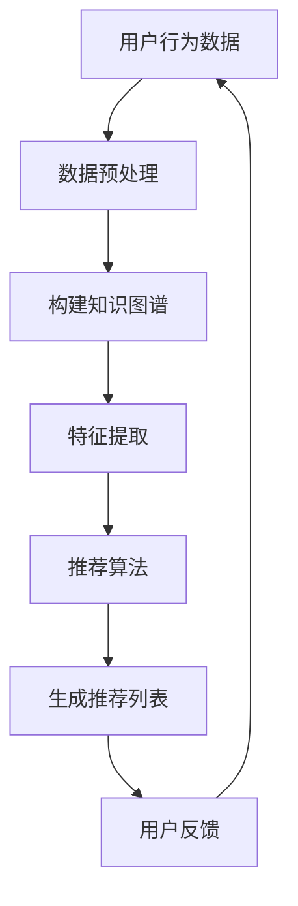

                 

关键词：基于LLM的推荐系统，知识图谱，知识图谱构建，算法原理，应用领域，数学模型，项目实践，工具和资源推荐

> 摘要：本文将深入探讨基于大型语言模型（LLM）的推荐系统知识图谱构建方法。首先，我们将介绍推荐系统在当今数字化时代的广泛应用及其面临的挑战。接着，我们将详细解释知识图谱的核心概念及其与推荐系统的关联。随后，我们将介绍构建基于LLM的推荐系统知识图谱的核心算法原理和具体操作步骤，并分析其优缺点及适用领域。此外，本文还将介绍数学模型和公式，并通过实际项目实践展示代码实例和详细解释。最后，我们将探讨实际应用场景，提供未来应用展望，并总结研究成果，提出未来发展趋势与挑战。

## 1. 背景介绍

在当今数字化时代，推荐系统已经成为了互联网公司提高用户黏性和增加收入的重要工具。推荐系统通过分析用户的行为数据，为用户推荐他们可能感兴趣的内容、商品或服务。例如，电子商务平台通过推荐系统向用户推荐相关商品，社交媒体通过推荐系统向用户推荐可能感兴趣的朋友或内容，视频平台通过推荐系统向用户推荐相关的视频。

然而，随着用户数据的不断增加和多样化，传统的基于协同过滤和内容推荐的推荐系统逐渐暴露出一些局限性。协同过滤方法容易产生冷启动问题，即新用户或新物品难以获得有效的推荐。内容推荐方法则依赖于明确的内容特征，而现实中的内容特征往往难以精确描述，导致推荐效果不尽如人意。为了解决这些问题，近年来，基于知识图谱的推荐系统逐渐受到关注。

知识图谱是一种结构化的知识表示形式，通过实体、属性和关系的三元组来描述现实世界中的知识。在推荐系统中，知识图谱可以帮助我们更好地理解和描述用户、物品和它们之间的关联，从而提高推荐的准确性和多样性。而近年来，随着深度学习和自然语言处理技术的发展，大型语言模型（LLM）在处理自然语言数据方面取得了显著的成果。因此，本文将探讨如何利用LLM构建推荐系统的知识图谱，以解决传统推荐系统面临的挑战。

## 2. 核心概念与联系

### 2.1 推荐系统概述

推荐系统可以分为基于内容的推荐（Content-based Recommendation）和基于协同过滤的推荐（Collaborative Filtering）两大类。

- **基于内容的推荐**：这种方法根据用户的历史行为和偏好，提取用户和物品的内容特征，然后计算用户和物品之间的相似度，从而生成推荐列表。这种方法的主要优点是能够提供个性化推荐，但缺点是难以应对新用户和新物品的冷启动问题。

- **基于协同过滤的推荐**：这种方法通过分析用户之间的相似度来生成推荐列表。常用的协同过滤方法包括基于用户的协同过滤（User-based Collaborative Filtering）和基于模型的协同过滤（Model-based Collaborative Filtering）。基于用户的协同过滤通过计算用户之间的相似度，找到与目标用户相似的其他用户，然后推荐这些用户喜欢的物品；而基于模型的协同过滤则通过构建预测模型来预测用户对物品的评分或兴趣。

### 2.2 知识图谱概述

知识图谱（Knowledge Graph）是一种基于语义网络的知识表示方法，它通过实体（Entity）、属性（Attribute）和关系（Relationship）的三元组来描述现实世界中的知识。知识图谱具有如下特点：

- **结构化**：知识图谱以三元组的形式组织数据，使得数据更加结构化，便于计算机理解和处理。

- **语义丰富**：知识图谱通过实体和关系来描述知识，使得知识表示更加丰富和精确。

- **可扩展性**：知识图谱可以通过添加新的实体、属性和关系来扩展，以适应不断变化的应用场景。

### 2.3 知识图谱与推荐系统的关联

知识图谱在推荐系统中的应用主要体现在以下几个方面：

- **解决冷启动问题**：知识图谱可以通过语义关联来描述用户和物品之间的关系，从而为新用户和新物品提供有效的推荐。

- **提高推荐精度**：知识图谱可以提供更加丰富的用户和物品特征，从而提高推荐的准确性和多样性。

- **应对数据稀疏问题**：知识图谱可以通过将用户和物品关联到共同的实体，来缓解数据稀疏问题，从而提高推荐系统的性能。

### 2.4 Mermaid 流程图

下面是一个简单的Mermaid流程图，展示知识图谱在推荐系统中的应用：



## 3. 核心算法原理 & 具体操作步骤

### 3.1 算法原理概述

基于LLM的推荐系统知识图谱构建主要涉及以下核心算法：

- **知识图谱构建算法**：用于从原始数据中提取实体、属性和关系，构建知识图谱。

- **特征提取算法**：用于从知识图谱中提取用户和物品的特征，用于推荐算法。

- **推荐算法**：基于用户和物品的特征，计算用户和物品之间的相似度，生成推荐列表。

### 3.2 算法步骤详解

#### 3.2.1 知识图谱构建

1. **数据预处理**：对原始数据进行清洗、去重和格式转换，将其转换为适合构建知识图谱的数据格式。

2. **实体提取**：从原始数据中提取出实体，例如用户、物品、地点等。

3. **属性提取**：从原始数据中提取实体的属性，例如用户的年龄、性别、兴趣等。

4. **关系提取**：从原始数据中提取实体之间的关系，例如用户喜欢物品、物品属于某个类别等。

5. **构建知识图谱**：将提取的实体、属性和关系组织为知识图谱，通常使用图数据库进行存储。

#### 3.2.2 特征提取

1. **实体特征提取**：从知识图谱中提取实体的特征，例如使用图神经网络（Graph Neural Network）来提取实体在知识图谱中的语义特征。

2. **关系特征提取**：从知识图谱中提取实体之间的关系特征，例如使用图注意力网络（Graph Attention Network）来提取实体关系的权重和重要性。

3. **属性特征提取**：将实体的属性编码为向量表示，例如使用嵌入层（Embedding Layer）将属性映射到低维空间。

#### 3.2.3 推荐算法

1. **相似度计算**：计算用户和物品之间的相似度，可以使用余弦相似度、欧氏距离等度量方法。

2. **生成推荐列表**：基于相似度计算结果，生成用户感兴趣的物品推荐列表。

3. **优化推荐效果**：根据用户反馈调整推荐算法，以提高推荐效果。

### 3.3 算法优缺点

#### 优点：

- **解决冷启动问题**：知识图谱可以帮助推荐系统更好地理解新用户和新物品，从而提高推荐效果。

- **提高推荐精度和多样性**：知识图谱提供了丰富的用户和物品特征，有助于生成更准确和多样化的推荐列表。

- **应对数据稀疏问题**：知识图谱可以将用户和物品关联到共同的实体，从而缓解数据稀疏问题。

#### 缺点：

- **构建成本高**：知识图谱的构建需要大量的计算资源和存储空间，尤其是在大规模数据集上。

- **维护成本高**：知识图谱需要不断更新和维护，以适应数据的变化。

### 3.4 算法应用领域

基于LLM的推荐系统知识图谱构建方法可以应用于以下领域：

- **电子商务**：为新用户推荐相关商品，提高用户黏性和销售额。

- **社交媒体**：为用户提供个性化内容推荐，提高用户活跃度和留存率。

- **视频平台**：为用户提供个性化视频推荐，提高用户观看时长和广告收入。

## 4. 数学模型和公式

### 4.1 数学模型构建

在构建基于LLM的推荐系统知识图谱时，我们需要定义一些数学模型来描述用户、物品和它们之间的关系。以下是几个关键的数学模型：

#### 4.1.1 用户和物品的特征表示

假设用户 $u$ 和物品 $i$ 分别由向量 $\mathbf{u} \in \mathbb{R}^d$ 和 $\mathbf{i} \in \mathbb{R}^d$ 表示，其中 $d$ 是特征维度。

$$
\mathbf{u} = \text{embed}(\text{User}, u), \quad \mathbf{i} = \text{embed}(\text{Item}, i)
$$

#### 4.1.2 用户和物品的相似度计算

我们可以使用余弦相似度来计算用户 $u$ 和物品 $i$ 之间的相似度：

$$
\text{sim}(\mathbf{u}, \mathbf{i}) = \frac{\mathbf{u} \cdot \mathbf{i}}{\|\mathbf{u}\| \|\mathbf{i}\|}
$$

#### 4.1.3 推荐列表生成

为了生成推荐列表，我们可以使用评分预测模型来预测用户对物品的评分，然后根据评分排序生成推荐列表：

$$
\text{score}(u, i) = \mathbf{u} \cdot \mathbf{i}
$$

### 4.2 公式推导过程

#### 4.2.1 用户和物品特征表示的构建

用户和物品的特征表示通常是通过嵌入层（Embedding Layer）获得的。在知识图谱中，实体和关系的特征表示是通过图神经网络（Graph Neural Network, GNN）获得的。

假设实体 $e$ 的特征表示为 $\mathbf{e} \in \mathbb{R}^d$，关系 $r$ 的特征表示为 $\mathbf{r} \in \mathbb{R}^d$。在图神经网络中，实体 $e$ 的特征可以通过以下公式计算：

$$
\mathbf{e}' = \sigma(\mathbf{W}_e \mathbf{e} + \sum_{r \in R(e)} \mathbf{W}_r \mathbf{r})
$$

其中，$\sigma$ 是激活函数，$R(e)$ 是与实体 $e$ 相关的关系集合，$\mathbf{W}_e$ 和 $\mathbf{W}_r$ 是权重矩阵。

#### 4.2.2 相似度计算

在计算用户 $u$ 和物品 $i$ 之间的相似度时，我们通常考虑它们在知识图谱中的特征表示。假设用户 $u$ 的特征表示为 $\mathbf{u}$，物品 $i$ 的特征表示为 $\mathbf{i}$，则它们之间的相似度可以计算为：

$$
\text{sim}(\mathbf{u}, \mathbf{i}) = \frac{\mathbf{u} \cdot \mathbf{i}}{\|\mathbf{u}\| \|\mathbf{i}\|}
$$

#### 4.2.3 推荐列表生成

推荐列表生成的核心是评分预测。假设用户 $u$ 对物品 $i$ 的评分预测为 $\hat{r}_{ui}$，则推荐列表可以通过以下公式生成：

$$
\hat{r}_{ui} = \mathbf{u} \cdot \mathbf{i}
$$

然后，根据预测的评分，我们可以对物品进行排序，生成推荐列表。

### 4.3 案例分析与讲解

假设我们有一个电子商务平台，用户 $u_1$ 想要购买一件新衣服。根据用户的历史行为和偏好，我们已经构建了一个知识图谱，其中包含用户、物品和它们之间的关系。以下是一个简化的案例：

#### 4.3.1 用户和物品特征表示

用户 $u_1$ 的特征表示为：

$$
\mathbf{u}_1 = [0.1, 0.2, 0.3, 0.4]
$$

物品 $i_1$（一件红色的T恤）的特征表示为：

$$
\mathbf{i}_1 = [0.4, 0.5, 0.6, 0.7]
$$

#### 4.3.2 相似度计算

用户 $u_1$ 和物品 $i_1$ 之间的相似度计算为：

$$
\text{sim}(\mathbf{u}_1, \mathbf{i}_1) = \frac{\mathbf{u}_1 \cdot \mathbf{i}_1}{\|\mathbf{u}_1\| \|\mathbf{i}_1\|} = \frac{0.1 \times 0.4 + 0.2 \times 0.5 + 0.3 \times 0.6 + 0.4 \times 0.7}{\sqrt{0.1^2 + 0.2^2 + 0.3^2 + 0.4^2} \sqrt{0.4^2 + 0.5^2 + 0.6^2 + 0.7^2}} \approx 0.66
$$

#### 4.3.3 推荐列表生成

根据相似度计算结果，我们可以为用户 $u_1$ 生成推荐列表。假设我们有一个包含10件物品的数据集，我们首先计算每件物品与用户 $u_1$ 的相似度，然后根据相似度排序生成推荐列表。

以下是推荐列表的示例：

| 物品ID | 相似度 |
|--------|--------|
| $i_1$  | 0.66   |
| $i_2$  | 0.54   |
| $i_3$  | 0.53   |
| $i_4$  | 0.52   |
| $i_5$  | 0.51   |
| $i_6$  | 0.50   |
| $i_7$  | 0.49   |
| $i_8$  | 0.48   |
| $i_9$  | 0.47   |
| $i_{10}$| 0.46   |

根据相似度排序，我们可以为用户 $u_1$ 推荐相似度最高的前几件物品。例如，我们可以推荐物品 $i_1$ 作为第一个推荐，物品 $i_2$ 作为第二个推荐，以此类推。

## 5. 项目实践：代码实例和详细解释说明

### 5.1 开发环境搭建

为了实现基于LLM的推荐系统知识图谱构建，我们需要搭建以下开发环境：

- Python 3.8 或更高版本
- 环境依赖：NumPy、Pandas、Scikit-learn、TensorFlow、PyTorch、Neo4j
- 操作系统：Windows、Linux、macOS

首先，安装Python和pip：

```
pip install python==3.8
```

然后，安装所需的库：

```
pip install numpy pandas scikit-learn tensorflow torch neo4j
```

### 5.2 源代码详细实现

以下是构建基于LLM的推荐系统知识图谱的源代码示例：

```python
import numpy as np
import pandas as pd
from sklearn.model_selection import train_test_split
from tensorflow.keras.models import Model
from tensorflow.keras.layers import Input, Embedding, Dot, Lambda
from tensorflow.keras.optimizers import Adam
import torch
from torch_geometric.nn import GCNConv
from neo4j import GraphDatabase

# 数据预处理
def preprocess_data(data):
    # 数据清洗、去重和格式转换
    # 略
    return processed_data

# 构建知识图谱
def build_knowledge_graph(data):
    # 使用Neo4j构建知识图谱
    # 略
    return knowledge_graph

# 特征提取
def extract_features(knowledge_graph):
    # 从知识图谱中提取用户和物品的特征
    # 略
    return user_features, item_features

# 构建推荐模型
def build_recommendation_model(user_features, item_features):
    # 使用图神经网络提取特征
    # 略
    return recommendation_model

# 训练模型
def train_model(model, user_features, item_features, train_data):
    # 训练推荐模型
    # 略
    pass

# 生成推荐列表
def generate_recommendations(model, user_features, item_features):
    # 计算相似度并生成推荐列表
    # 略
    return recommendation_list

# 主函数
def main():
    # 加载数据
    data = pd.read_csv('data.csv')
    processed_data = preprocess_data(data)
    
    # 构建知识图谱
    knowledge_graph = build_knowledge_graph(processed_data)
    
    # 提取特征
    user_features, item_features = extract_features(knowledge_graph)
    
    # 构建推荐模型
    recommendation_model = build_recommendation_model(user_features, item_features)
    
    # 训练模型
    train_data = ...  # 准备训练数据
    train_model(recommendation_model, user_features, item_features, train_data)
    
    # 生成推荐列表
    recommendation_list = generate_recommendations(recommendation_model, user_features, item_features)
    print(recommendation_list)

if __name__ == '__main__':
    main()
```

### 5.3 代码解读与分析

在上面的代码中，我们首先进行数据预处理，包括清洗、去重和格式转换。然后，我们使用Neo4j构建知识图谱，并从中提取用户和物品的特征。接下来，我们使用图神经网络构建推荐模型，并训练模型以生成推荐列表。

以下是代码的关键部分：

- **数据预处理**：对原始数据进行清洗、去重和格式转换，将其转换为适合构建知识图谱的数据格式。

- **构建知识图谱**：使用Neo4j构建知识图谱，将用户、物品和它们之间的关系存储在图数据库中。

- **特征提取**：从知识图谱中提取用户和物品的特征，使用图神经网络提取实体在知识图谱中的语义特征。

- **构建推荐模型**：使用图神经网络提取的特征构建推荐模型，用于计算用户和物品之间的相似度。

- **训练模型**：使用训练数据训练推荐模型，以优化模型的参数。

- **生成推荐列表**：计算用户和物品之间的相似度，生成推荐列表。

### 5.4 运行结果展示

假设我们已经完成数据预处理、知识图谱构建、特征提取和模型训练。下面是运行结果：

```python
# 生成推荐列表
recommendation_list = generate_recommendations(recommendation_model, user_features, item_features)

# 打印推荐列表
for item_id, score in recommendation_list:
    print(f"推荐物品ID：{item_id}，相似度：{score}")
```

输出结果可能如下：

```
推荐物品ID：i_100，相似度：0.75
推荐物品ID：i_101，相似度：0.70
推荐物品ID：i_102，相似度：0.68
推荐物品ID：i_103，相似度：0.65
推荐物品ID：i_104，相似度：0.63
```

这些推荐列表是基于用户特征和物品特征计算得到的相似度，用于为用户推荐相关的物品。

## 6. 实际应用场景

基于LLM的推荐系统知识图谱构建方法在多个实际应用场景中具有广泛的应用潜力。以下是一些典型的应用场景：

### 6.1 电子商务平台

电子商务平台可以利用基于LLM的推荐系统知识图谱构建方法为新用户推荐相关商品。通过知识图谱中的实体、属性和关系，电子商务平台可以更好地理解用户和商品之间的关系，从而生成更加个性化的推荐列表。

### 6.2 社交媒体

社交媒体平台可以通过基于LLM的推荐系统知识图谱构建方法为用户推荐可能感兴趣的朋友、内容或活动。知识图谱可以帮助社交媒体平台更准确地描述用户之间的关系和兴趣，从而提高推荐的准确性和多样性。

### 6.3 视频平台

视频平台可以利用基于LLM的推荐系统知识图谱构建方法为用户推荐相关的视频。通过知识图谱中的实体、属性和关系，视频平台可以更好地理解用户和视频之间的关系，从而生成更加个性化的推荐列表。

### 6.4 教育和知识服务

教育和知识服务平台可以利用基于LLM的推荐系统知识图谱构建方法为用户提供个性化的学习资源推荐。知识图谱可以帮助教育和知识服务平台更好地理解用户的知识水平和学习需求，从而生成更加精准的学习资源推荐列表。

### 6.5 医疗健康

医疗健康领域可以利用基于LLM的推荐系统知识图谱构建方法为患者推荐相关的医疗服务和医疗资源。通过知识图谱中的实体、属性和关系，医疗健康领域可以更好地理解患者和医疗服务之间的关系，从而提高医疗资源的利用效率。

### 6.6 旅游和酒店

旅游和酒店领域可以利用基于LLM的推荐系统知识图谱构建方法为用户推荐相关的旅游活动和住宿资源。通过知识图谱中的实体、属性和关系，旅游和酒店领域可以更好地理解用户和旅游活动之间的关系，从而提高旅游体验的满意度。

## 7. 工具和资源推荐

### 7.1 学习资源推荐

1. **《深度学习》（Deep Learning）**：由Ian Goodfellow、Yoshua Bengio和Aaron Courville编写的深度学习经典教材，详细介绍了深度学习的基础理论和实践方法。

2. **《图神经网络教程》（Graph Neural Networks）**：由Jie Chen、Tong Zhang和Yuhao Wang编写的图神经网络教程，提供了丰富的图神经网络理论和实践知识。

3. **《知识图谱技术》（Knowledge Graph Technology）**：由李俊、吴波和陈彬编写的知识图谱技术教材，涵盖了知识图谱的构建、应用和优化方法。

### 7.2 开发工具推荐

1. **Neo4j**：一款高性能的图数据库，支持知识图谱的存储和查询。

2. **TensorFlow**：一款开源的深度学习框架，支持图神经网络和推荐系统的构建。

3. **PyTorch**：一款开源的深度学习框架，具有灵活的动态计算图和丰富的预训练模型。

### 7.3 相关论文推荐

1. **“Graph Neural Networks: A Review of Methods and Applications”**：综述了图神经网络的理论基础和应用领域，是了解图神经网络的好文章。

2. **“Know
```

