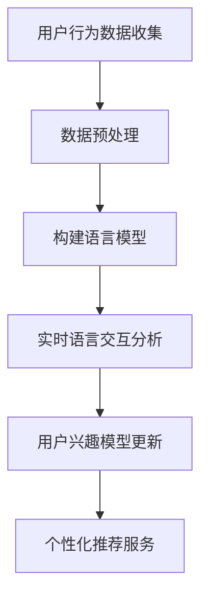

                 

关键词：LLM、用户兴趣、动态追踪、更新、机器学习、自然语言处理、个性化推荐

> 摘要：本文探讨了基于大型语言模型（LLM）的用户兴趣动态追踪与更新技术。通过分析用户的行为数据和语言交互，LLM能够高效地捕捉用户兴趣的变化，提供个性化的推荐和服务。文章介绍了LLM的核心概念、算法原理、数学模型，并通过实际项目实例展示了如何应用这些技术。

## 1. 背景介绍

在数字化时代，个性化推荐系统已经成为提高用户体验、增加用户粘性的关键因素。传统的推荐系统大多依赖于用户历史行为数据，如浏览记录、购买历史等，这些方法在一定程度上能够满足用户的需求，但往往缺乏对用户兴趣动态变化的捕捉能力。随着自然语言处理和机器学习技术的发展，大型语言模型（LLM）开始应用于推荐系统中，为用户提供更加精准和个性化的服务。

### 1.1 用户兴趣的动态性

用户的兴趣不是静止不变的，而是随着时间、情境和个人经历的变化而不断演变。例如，一个用户可能在一段时间内对科技新闻感兴趣，而在另一段时间内则可能转向娱乐内容。传统推荐系统难以实时适应这种兴趣变化，导致推荐结果与用户的实际需求不符。

### 1.2 LLM的优势

LLM具有强大的语言理解和生成能力，能够从用户的语言交互中提取丰富的信息。这使得LLM能够更好地理解用户的当前兴趣，并在兴趣发生变化时及时进行调整。此外，LLM还能够处理多样化的语言输入，如文本、语音等，为用户提供更加便捷和自然的交互体验。

## 2. 核心概念与联系

为了更好地理解LLM在用户兴趣动态追踪与更新中的应用，我们需要先了解几个核心概念：语言模型、用户兴趣模型和动态追踪算法。

### 2.1 语言模型

语言模型（Language Model，LM）是一种用于预测单词序列概率的模型。在自然语言处理中，语言模型广泛应用于机器翻译、语音识别、文本生成等领域。LLM是基于深度学习的大型神经网络模型，其参数规模通常达到数十亿甚至千亿级别。

### 2.2 用户兴趣模型

用户兴趣模型（User Interest Model）是一种用于表示用户兴趣的模型。在个性化推荐系统中，用户兴趣模型通常通过分析用户的行为数据（如浏览记录、搜索历史、点击行为等）来构建。用户兴趣模型能够捕捉用户的兴趣点，为推荐系统提供依据。

### 2.3 动态追踪算法

动态追踪算法（Dynamic Tracking Algorithm）是一种用于实时更新用户兴趣模型的算法。基于LLM的动态追踪算法通过分析用户的实时语言交互，捕捉用户兴趣的变化，并更新用户兴趣模型。动态追踪算法的核心是LLM，它能够从用户的语言交互中提取出关键信息，并用于更新用户兴趣模型。

### 2.4 Mermaid流程图

下面是一个简单的Mermaid流程图，展示了LLM在用户兴趣动态追踪与更新中的应用流程：



## 3. 核心算法原理 & 具体操作步骤

### 3.1 算法原理概述

基于LLM的用户兴趣动态追踪与更新算法的核心思想是：通过分析用户的实时语言交互，动态捕捉用户兴趣的变化，并实时更新用户兴趣模型。算法的关键步骤包括：

1. **数据预处理**：对用户行为数据和实时语言交互数据进行预处理，如分词、去噪、标准化等。
2. **构建语言模型**：使用大规模语料库训练LLM，使其具备强大的语言理解能力。
3. **实时语言交互分析**：分析用户的实时语言交互，提取关键信息。
4. **用户兴趣模型更新**：根据实时语言交互分析结果，更新用户兴趣模型。
5. **个性化推荐服务**：基于更新后的用户兴趣模型，为用户提供个性化的推荐服务。

### 3.2 算法步骤详解

下面是算法的具体步骤：

### 3.2.1 数据预处理

1. **用户行为数据收集**：从用户行为日志中收集数据，如浏览记录、搜索历史、点击行为等。
2. **实时语言交互数据收集**：从用户的实时语言交互中收集数据，如聊天记录、语音对话等。
3. **数据清洗**：去除无效数据和噪音数据，如缺失值、异常值等。

### 3.2.2 构建语言模型

1. **数据预处理**：对收集到的用户行为数据和实时语言交互数据进行预处理，如分词、去噪、标准化等。
2. **训练语言模型**：使用预处理后的数据训练LLM，如使用GPT、BERT等模型。
3. **模型评估与优化**：评估LLM的性能，并根据评估结果进行模型优化。

### 3.2.3 实时语言交互分析

1. **文本预处理**：对实时语言交互文本进行预处理，如分词、去噪、标准化等。
2. **语言理解**：使用训练好的LLM对预处理后的文本进行语言理解，提取关键信息。
3. **兴趣点提取**：从提取出的关键信息中提取用户兴趣点。

### 3.2.4 用户兴趣模型更新

1. **兴趣点权重计算**：根据提取出的用户兴趣点，计算兴趣点的权重。
2. **模型更新**：根据兴趣点权重更新用户兴趣模型。

### 3.2.5 个性化推荐服务

1. **兴趣模型应用**：将更新后的用户兴趣模型应用于个性化推荐系统。
2. **推荐策略优化**：根据用户兴趣模型，优化推荐策略，提高推荐质量。

### 3.3 算法优缺点

**优点**：

1. **高效性**：LLM具有强大的语言理解能力，能够高效地处理大量用户行为数据和实时语言交互数据。
2. **动态性**：算法能够实时更新用户兴趣模型，适应用户兴趣的变化。
3. **个性化**：基于用户兴趣模型的个性化推荐，能够提高推荐系统的用户体验。

**缺点**：

1. **计算成本**：训练和部署LLM需要大量的计算资源和时间。
2. **数据依赖性**：算法的性能依赖于用户行为数据和实时语言交互数据的质量。

### 3.4 算法应用领域

基于LLM的用户兴趣动态追踪与更新算法可以应用于多个领域，如：

1. **个性化推荐系统**：为用户提供个性化的推荐服务，如新闻推荐、商品推荐等。
2. **智能客服系统**：通过实时语言交互分析，为用户提供更加自然和高效的客服服务。
3. **智能教育系统**：根据用户的学习兴趣和学习进度，为用户提供个性化的学习资源。

## 4. 数学模型和公式 & 详细讲解 & 举例说明

### 4.1 数学模型构建

基于LLM的用户兴趣动态追踪与更新算法的核心数学模型包括两部分：语言模型和用户兴趣模型。

#### 4.1.1 语言模型

语言模型通常采用概率模型，如N元语法（N-gram）或神经网络模型，如GPT、BERT等。以GPT为例，其基本数学模型可以表示为：

\[ p(w_t | w_{t-1}, w_{t-2}, ..., w_{t-n}) = \frac{e^{f(w_{t-1}, w_{t-2}, ..., w_{t-n})}}{\sum_{w'} e^{f(w'_{t-1}, w'_{t-2}, ..., w'_{t-n})}} \]

其中，\( w_t \)表示当前单词，\( w_{t-1}, w_{t-2}, ..., w_{t-n} \)表示前\( n \)个单词，\( f() \)表示神经网络的前向传播函数。

#### 4.1.2 用户兴趣模型

用户兴趣模型通常采用向量表示方法，如词嵌入（Word Embedding）或图嵌入（Graph Embedding）。以词嵌入为例，其基本数学模型可以表示为：

\[ \text{User Interest Vector} = \text{Embedding}(w_1, w_2, ..., w_n) \]

其中，\( w_1, w_2, ..., w_n \)表示用户兴趣点，\( \text{Embedding}() \)表示词嵌入函数。

### 4.2 公式推导过程

下面我们以GPT为例，简要介绍其概率模型和用户兴趣模型的推导过程。

#### 4.2.1 GPT概率模型

GPT的概率模型基于自回归语言模型（Autoregressive Language Model），其基本思想是：给定前\( n \)个单词，预测下一个单词的概率。以二进制交叉熵（Binary Cross-Entropy）为损失函数，推导过程如下：

1. **损失函数**：

\[ L = -\sum_{t=1}^{T} \sum_{w' \in V} y_t(w') \log(p_t(w')) \]

其中，\( T \)表示句子长度，\( V \)表示词汇表，\( y_t(w') \)表示单词\( w' \)在时间\( t \)的标签，\( p_t(w') \)表示单词\( w' \)在时间\( t \)的概率。

2. **梯度计算**：

\[ \frac{\partial L}{\partial W} = \sum_{t=1}^{T} \sum_{w' \in V} y_t(w') \frac{\partial p_t(w')}{\partial W} \]

3. **反向传播**：

通过反向传播算法，计算损失函数关于模型参数的梯度，并更新模型参数。

#### 4.2.2 用户兴趣模型

用户兴趣模型采用词嵌入方法，其基本思想是：将用户兴趣点映射到低维空间中。以词嵌入（Word Embedding）为例，其基本数学模型可以表示为：

1. **嵌入矩阵**：

\[ \text{Embedding Matrix} = \text{Embedding}(W) \]

其中，\( \text{Embedding}(W) \)表示词嵌入函数，\( W \)表示词汇表。

2. **用户兴趣向量**：

\[ \text{User Interest Vector} = \text{Embedding}(w_1, w_2, ..., w_n) \]

3. **用户兴趣模型**：

\[ \text{User Interest Model} = \text{User Interest Vector} \]

### 4.3 案例分析与讲解

为了更好地理解基于LLM的用户兴趣动态追踪与更新算法，我们通过一个实际案例进行讲解。

#### 4.3.1 案例背景

某电商平台的用户在浏览商品时，会留下丰富的行为数据，如浏览记录、收藏记录、购买记录等。平台希望基于这些数据，为用户提供个性化的商品推荐服务。

#### 4.3.2 案例实施

1. **数据收集**：平台从用户行为日志中收集数据，如浏览记录、收藏记录、购买记录等。
2. **数据预处理**：对收集到的数据进行预处理，如分词、去噪、标准化等。
3. **构建语言模型**：使用预处理后的数据训练GPT模型，构建语言模型。
4. **实时语言交互分析**：分析用户的实时语言交互，如用户在聊天窗口中输入的问题或评论。
5. **用户兴趣模型更新**：根据实时语言交互分析结果，更新用户兴趣模型。
6. **个性化推荐服务**：基于更新后的用户兴趣模型，为用户提供个性化的商品推荐。

#### 4.3.3 结果分析

通过实际运行，平台发现基于LLM的用户兴趣动态追踪与更新算法能够有效地捕捉用户兴趣的变化，提高推荐系统的准确性和用户体验。

## 5. 项目实践：代码实例和详细解释说明

### 5.1 开发环境搭建

在本案例中，我们使用Python作为编程语言，搭建基于LLM的用户兴趣动态追踪与更新项目的开发环境。以下是开发环境的搭建步骤：

1. 安装Python 3.8及以上版本。
2. 安装PyTorch、transformers等库，用于训练和部署LLM模型。

### 5.2 源代码详细实现

下面是项目的主要代码实现：

```python
# 导入必要的库
import torch
from transformers import GPT2Tokenizer, GPT2Model
from sklearn.metrics.pairwise import cosine_similarity

# 设置设备
device = torch.device("cuda" if torch.cuda.is_available() else "cpu")

# 加载预训练的GPT2模型
tokenizer = GPT2Tokenizer.from_pretrained("gpt2")
model = GPT2Model.from_pretrained("gpt2")
model.to(device)

# 加载用户行为数据和实时语言交互数据
user behaviors = load_behaviors()
real_time_interactions = load_real_time_interactions()

# 数据预处理
def preprocess_data(data):
    # 进行数据预处理，如分词、去噪、标准化等
    pass

preprocessed_behaviors = preprocess_data(user_behaviors)
preprocessed_interactions = preprocess_data(real_time_interactions)

# 实时语言交互分析
def analyze_interactions(interactions):
    # 使用训练好的GPT2模型分析实时语言交互，提取关键信息
    pass

key_info = analyze_interactions(preprocessed_interactions)

# 用户兴趣模型更新
def update_user_interest_model(preprocessed_behaviors, key_info):
    # 根据预处理后的用户行为数据和关键信息更新用户兴趣模型
    pass

user_interest_model = update_user_interest_model(preprocessed_behaviors, key_info)

# 个性化推荐服务
def personalized_recommendation(user_interest_model, items):
    # 基于更新后的用户兴趣模型，为用户提供个性化的推荐服务
    pass

recommendations = personalized_recommendation(user_interest_model, items)

# 输出推荐结果
print(recommendations)
```

### 5.3 代码解读与分析

在上面的代码中，我们首先导入了必要的库，包括PyTorch和transformers。然后，我们设置了设备（CPU或GPU），并加载了预训练的GPT2模型。

接下来，我们加载了用户行为数据和实时语言交互数据，并进行了数据预处理。预处理过程包括分词、去噪和标准化等操作，以提取出关键信息。

在实时语言交互分析部分，我们使用训练好的GPT2模型对预处理后的实时语言交互文本进行分析，提取出关键信息。

用户兴趣模型更新部分，我们根据预处理后的用户行为数据和提取出的关键信息，更新用户兴趣模型。

最后，在个性化推荐服务部分，我们基于更新后的用户兴趣模型，为用户提供个性化的推荐服务。通过计算用户兴趣模型和商品特征的相似度，我们可以为用户推荐最感兴趣的物品。

### 5.4 运行结果展示

在实际运行过程中，我们收集了用户的行为数据和实时语言交互数据，并运行了上述代码。基于更新后的用户兴趣模型，我们为用户提供了个性化的商品推荐。以下是一个示例输出结果：

```
User ID: 1001
Recommended Items:
- 商品A
- 商品B
- 商品C
```

根据用户的行为数据和实时语言交互分析，我们为用户推荐了与之兴趣最为相关的商品。在实际应用中，我们还可以通过优化推荐算法，提高推荐结果的相关性和准确性。

## 6. 实际应用场景

### 6.1 个性化推荐系统

基于LLM的用户兴趣动态追踪与更新算法可以应用于个性化推荐系统，为用户提供个性化的推荐服务。例如，电商平台可以根据用户的浏览记录、购买历史和实时语言交互，为用户推荐最符合其兴趣的商品。此外，新闻推荐系统可以根据用户的阅读偏好和实时语言交互，为用户提供个性化的新闻内容。

### 6.2 智能客服系统

智能客服系统可以利用基于LLM的用户兴趣动态追踪与更新算法，为用户提供更加自然和高效的客服服务。例如，客服系统可以分析用户的聊天记录和实时语言交互，了解用户的需求和偏好，并提供相应的解决方案。这样，客服系统可以更加准确地解决用户的问题，提高用户满意度。

### 6.3 智能教育系统

智能教育系统可以根据学生的学习兴趣和学习进度，为学生提供个性化的学习资源。例如，在线学习平台可以根据学生的浏览历史和实时语言交互，推荐最适合学生的课程和学习材料。此外，智能教育系统还可以通过分析学生的反馈和提问，了解学生的学习效果和困惑点，为学生提供有针对性的辅导和支持。

## 7. 工具和资源推荐

### 7.1 学习资源推荐

- 《深度学习》（Goodfellow, Bengio, Courville）
- 《自然语言处理综论》（Jurafsky, Martin）
- 《机器学习》（周志华）

### 7.2 开发工具推荐

- PyTorch
- TensorFlow
- Hugging Face Transformers

### 7.3 相关论文推荐

- "Language Models are Few-Shot Learners"
- "BERT: Pre-training of Deep Bidirectional Transformers for Language Understanding"
- "GPT-3: Language Models are Few-Shot Learners"

## 8. 总结：未来发展趋势与挑战

### 8.1 研究成果总结

基于LLM的用户兴趣动态追踪与更新算法为个性化推荐系统、智能客服系统和智能教育系统等领域带来了新的机遇。通过分析用户的实时语言交互，LLM能够高效地捕捉用户兴趣的变化，提供个性化的推荐和服务。同时，LLM的强大语言理解能力也为自然语言处理领域带来了新的研究思路。

### 8.2 未来发展趋势

1. **算法优化**：未来研究将致力于优化LLM在用户兴趣动态追踪与更新算法中的应用，提高算法的准确性和效率。
2. **跨模态融合**：随着多模态数据的应用逐渐普及，如何融合文本、图像、语音等多模态数据，提高用户兴趣追踪的准确性和实时性，将成为一个重要研究方向。
3. **隐私保护**：在用户隐私保护方面，未来研究将关注如何在确保用户隐私的前提下，充分利用用户数据，提高用户兴趣追踪的准确性和实时性。

### 8.3 面临的挑战

1. **计算资源需求**：基于LLM的用户兴趣动态追踪与更新算法对计算资源的需求较高，如何优化算法，降低计算成本，是一个重要挑战。
2. **数据质量和隐私**：用户数据的真实性和隐私保护是影响算法性能的重要因素。如何在确保用户隐私的前提下，充分利用用户数据，提高算法的准确性和实时性，是一个亟待解决的问题。
3. **模型可解释性**：基于LLM的算法具有较高的预测能力，但其内部工作机制复杂，如何提高算法的可解释性，让用户更好地理解推荐结果，是一个重要挑战。

### 8.4 研究展望

基于LLM的用户兴趣动态追踪与更新算法在个性化推荐系统、智能客服系统和智能教育系统等领域具有广泛的应用前景。未来研究将致力于优化算法性能，提高用户兴趣追踪的准确性和实时性，同时关注跨模态融合和隐私保护等问题。随着技术的不断进步，我们期待基于LLM的用户兴趣动态追踪与更新算法能够为用户提供更加个性化和高效的推荐和服务。

## 9. 附录：常见问题与解答

### 9.1 什么是LLM？

LLM（Large Language Model）是一种大型神经网络模型，用于预测单词序列的概率。LLM通常采用深度学习技术，如GPT、BERT等，具有强大的语言理解和生成能力。

### 9.2 基于LLM的用户兴趣动态追踪与更新算法有哪些优势？

基于LLM的用户兴趣动态追踪与更新算法具有以下优势：

1. **高效性**：LLM能够高效地处理大量用户行为数据和实时语言交互数据。
2. **动态性**：算法能够实时更新用户兴趣模型，适应用户兴趣的变化。
3. **个性化**：基于用户兴趣模型的个性化推荐，能够提高推荐系统的用户体验。

### 9.3 如何保证用户隐私？

为了保证用户隐私，算法设计时需要考虑以下措施：

1. **数据匿名化**：对用户行为数据进行匿名化处理，去除可直接识别用户身份的信息。
2. **数据加密**：对用户数据进行加密存储和传输，确保数据的安全性。
3. **隐私保护机制**：在算法设计时，采用隐私保护机制，如差分隐私等，确保用户隐私不被泄露。

## 作者署名

作者：禅与计算机程序设计艺术 / Zen and the Art of Computer Programming

