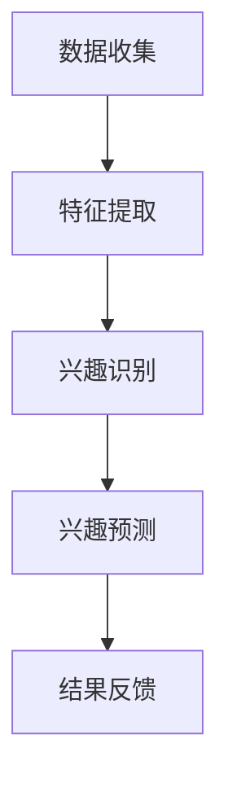

                 

  
> 关键词：LLM、用户兴趣、动态追踪、预测、人工智能、深度学习

> 摘要：本文旨在探讨基于大型语言模型（LLM）的用户兴趣动态追踪与预测方法，通过引入最新的研究成果和实际应用案例，分析LLM在用户兴趣识别和预测方面的优势，提出一种高效的动态追踪与预测算法，并探讨其在实际应用中的潜在价值和未来发展方向。

## 1. 背景介绍

随着互联网的快速发展，用户生成的数据量呈现出爆炸式增长。如何有效地追踪和预测用户的兴趣成为了一个重要的研究领域。传统的用户兴趣追踪方法主要依赖于用户的历史行为数据，如浏览记录、购买历史等。然而，这些方法往往无法适应用户动态变化的兴趣，导致追踪结果不够准确。为了解决这个问题，近年来，基于人工智能，尤其是深度学习的方法开始受到广泛关注。

其中，大型语言模型（LLM）作为一种先进的深度学习模型，具有处理大规模文本数据的能力，逐渐成为用户兴趣追踪与预测的利器。LLM通过学习海量文本数据中的语义信息，能够捕捉到用户在不同场景下的兴趣变化，从而实现更精准的追踪与预测。

本文将首先介绍LLM的基本原理和构建方法，然后探讨如何利用LLM进行用户兴趣的动态追踪与预测，最后分析该方法在实际应用中的效果和潜在价值。

## 2. 核心概念与联系

### 2.1 LLM的基本概念

#### 2.1.1 语言模型简介

语言模型是一种用于预测自然语言序列的概率分布的统计模型。它可以用于各种自然语言处理任务，如文本分类、命名实体识别、机器翻译等。语言模型的核心思想是通过学习大量文本数据，捕捉到语言的统计规律，从而实现对未知文本的生成和预测。

#### 2.1.2 LLM的构建方法

大型语言模型（LLM）是一种基于神经网络的语言模型，其核心是使用深度神经网络（DNN）来学习语言数据。与传统的统计语言模型相比，LLM具有更强的建模能力和更灵活的表达能力。

LLM的构建通常分为以下几个步骤：

1. **数据准备**：收集并清洗大量的文本数据，如新闻、文章、社交媒体帖子等。
2. **词向量表示**：将文本数据中的词汇转换为数值向量表示，常用的词向量模型有Word2Vec、GloVe等。
3. **神经网络架构设计**：设计深度神经网络架构，常见的有循环神经网络（RNN）、长短时记忆网络（LSTM）、门控循环单元（GRU）等。
4. **训练**：使用大量文本数据训练神经网络，优化网络参数。
5. **评估**：使用验证集和测试集评估模型性能。

### 2.2 用户兴趣的动态追踪与预测

#### 2.2.1 用户兴趣的定义

用户兴趣是指用户在特定情境下对某些主题、活动或内容的倾向性偏好。用户兴趣的动态追踪与预测旨在实时捕捉用户兴趣的变化，并提供个性化的推荐和服务。

#### 2.2.2 动态追踪与预测方法

基于LLM的用户兴趣动态追踪与预测方法主要包括以下几个步骤：

1. **用户行为数据收集**：收集用户在互联网上的行为数据，如浏览历史、搜索记录、点赞评论等。
2. **特征提取**：使用LLM对用户行为数据进行处理，提取出与用户兴趣相关的特征。
3. **兴趣识别**：利用提取到的特征，使用分类或回归模型识别用户当前的兴趣。
4. **兴趣预测**：基于用户历史兴趣和行为数据，使用LLM预测用户未来的兴趣。

### 2.3 Mermaid 流程图

以下是一个简单的Mermaid流程图，展示基于LLM的用户兴趣动态追踪与预测的基本流程：



## 3. 核心算法原理 & 具体操作步骤

### 3.1 算法原理概述

基于LLM的用户兴趣动态追踪与预测算法主要分为以下几个部分：

1. **数据收集与预处理**：收集用户在互联网上的行为数据，如浏览历史、搜索记录等，并对数据进行清洗和预处理。
2. **特征提取**：使用LLM对用户行为数据进行处理，提取出与用户兴趣相关的特征。
3. **兴趣识别**：利用提取到的特征，使用分类或回归模型识别用户当前的兴趣。
4. **兴趣预测**：基于用户历史兴趣和行为数据，使用LLM预测用户未来的兴趣。
5. **结果反馈**：根据预测结果，为用户推荐相关的信息和服务。

### 3.2 算法步骤详解

#### 3.2.1 数据收集与预处理

数据收集与预处理是算法的基础，直接影响到后续的模型效果。具体步骤如下：

1. **数据收集**：从互联网上收集用户的行为数据，如浏览历史、搜索记录、点赞评论等。
2. **数据清洗**：去除无效数据和噪声，如重复数据、缺失值等。
3. **数据预处理**：对数据进行标准化、归一化等处理，以便于后续的模型训练。

#### 3.2.2 特征提取

特征提取是算法的核心步骤，直接决定了用户兴趣识别和预测的准确性。具体步骤如下：

1. **词嵌入**：使用LLM对文本数据进行词嵌入，将文本数据转换为数值向量表示。
2. **序列编码**：将用户行为数据序列编码为固定长度的向量。
3. **特征提取**：使用神经网络对编码后的序列进行特征提取，提取出与用户兴趣相关的特征。

#### 3.2.3 兴趣识别

兴趣识别是算法的关键步骤，用于识别用户当前的兴趣。具体步骤如下：

1. **分类模型构建**：使用分类模型，如支持向量机（SVM）、随机森林（RF）等，对提取到的特征进行分类。
2. **模型训练与评估**：使用训练集训练分类模型，并在测试集上进行评估。

#### 3.2.4 兴趣预测

兴趣预测是算法的最终目标，用于预测用户未来的兴趣。具体步骤如下：

1. **时间序列建模**：使用时间序列模型，如LSTM、GRU等，对用户历史行为数据进行建模。
2. **预测模型构建**：使用分类或回归模型，如SVM、线性回归等，对时间序列模型输出的特征进行预测。
3. **模型训练与评估**：使用训练集训练预测模型，并在测试集上进行评估。

#### 3.2.5 结果反馈

结果反馈是算法的实际应用，用于为用户推荐相关的信息和服务。具体步骤如下：

1. **推荐系统构建**：根据用户兴趣预测结果，构建推荐系统，为用户推荐相关的信息和服务。
2. **效果评估**：通过用户反馈和系统效果评估，不断优化推荐系统。

### 3.3 算法优缺点

#### 3.3.1 优点

1. **高准确性**：基于LLM的特征提取和兴趣预测方法，能够捕捉到用户兴趣的细微变化，提高兴趣识别和预测的准确性。
2. **灵活性**：LLM能够处理多种类型的数据，如文本、图像、音频等，适应不同的应用场景。
3. **实时性**：基于实时数据处理的算法，能够实现用户兴趣的动态追踪和预测，为用户推荐最新的相关信息和服务。

#### 3.3.2 缺点

1. **计算资源消耗**：LLM的训练和预测过程需要大量的计算资源，对硬件设备的要求较高。
2. **数据依赖性**：算法的性能依赖于数据的质量和数量，缺乏高质量的数据可能导致预测效果不佳。

### 3.4 算法应用领域

基于LLM的用户兴趣动态追踪与预测方法具有广泛的应用前景，主要包括以下几个领域：

1. **个性化推荐**：为用户提供个性化的推荐服务，如商品推荐、新闻推荐、音乐推荐等。
2. **社交网络分析**：分析用户在社交网络上的行为，挖掘用户兴趣和关系网络。
3. **广告投放优化**：根据用户兴趣优化广告投放策略，提高广告投放的精准度和效果。
4. **用户行为预测**：预测用户未来的行为和需求，为用户提供个性化的服务和体验。

## 4. 数学模型和公式 & 详细讲解 & 举例说明

### 4.1 数学模型构建

基于LLM的用户兴趣动态追踪与预测算法涉及多个数学模型，主要包括词向量模型、分类模型、时间序列模型等。下面将分别介绍这些模型的构建过程。

#### 4.1.1 词向量模型

词向量模型用于将文本数据转换为数值向量表示。常见的词向量模型有Word2Vec和GloVe。以下是一个简单的Word2Vec模型的构建过程：

1. **数据预处理**：对文本数据进行分词、去停用词等预处理操作。
2. **构建词汇表**：将文本数据中的词汇转换为唯一的索引。
3. **初始化词向量**：为每个词汇初始化一个随机生成的词向量。
4. **训练词向量**：使用训练数据对词向量进行优化，最小化损失函数。

#### 4.1.2 分类模型

分类模型用于对提取到的特征进行分类。常见的分类模型有支持向量机（SVM）、随机森林（RF）等。以下是一个简单的SVM分类模型的构建过程：

1. **特征提取**：使用词向量模型对用户行为数据进行处理，提取出与用户兴趣相关的特征。
2. **数据预处理**：对提取到的特征进行归一化、标准化等预处理操作。
3. **模型训练**：使用训练数据对分类模型进行训练，优化模型参数。
4. **模型评估**：使用测试数据对分类模型进行评估，计算模型的准确率、召回率等指标。

#### 4.1.3 时间序列模型

时间序列模型用于对用户历史行为数据进行建模，预测用户未来的兴趣。常见的时间序列模型有LSTM、GRU等。以下是一个简单的LSTM模型的构建过程：

1. **数据预处理**：对用户历史行为数据进行归一化、标准化等预处理操作。
2. **序列编码**：将用户历史行为数据编码为固定长度的向量。
3. **模型训练**：使用训练数据对LSTM模型进行训练，优化模型参数。
4. **模型评估**：使用测试数据对LSTM模型进行评估，计算模型的准确率、召回率等指标。

### 4.2 公式推导过程

下面将介绍一些关键的数学公式，包括词向量模型的损失函数、分类模型的决策边界等。

#### 4.2.1 词向量模型损失函数

Word2Vec模型的损失函数通常采用负采样（Negative Sampling）方法，其公式如下：

$$
L = -\sum_{i=1}^{N} \log p(c_j | w_i)
$$

其中，\(N\) 表示词汇表大小，\(w_i\) 表示第 \(i\) 个词汇，\(c_j\) 表示第 \(j\) 个候选词汇，\(p(c_j | w_i)\) 表示在给定 \(w_i\) 的情况下，\(c_j\) 是正确的概率。

#### 4.2.2 分类模型决策边界

支持向量机（SVM）的决策边界可以表示为以下公式：

$$
w \cdot x + b > 0
$$

其中，\(w\) 表示权重向量，\(x\) 表示特征向量，\(b\) 表示偏置项。

当新样本 \(x\) 的分类结果为正类时，满足上述不等式；当分类结果为负类时，满足不等式 \(w \cdot x + b < 0\)。

### 4.3 案例分析与讲解

下面将通过一个实际案例，详细讲解基于LLM的用户兴趣动态追踪与预测方法的具体实现过程。

#### 4.3.1 案例背景

假设有一个电商平台，需要根据用户的浏览历史和购买记录，预测用户未来的购买兴趣，并为用户推荐相关的商品。

#### 4.3.2 数据收集与预处理

首先，从电商平台的数据库中收集用户的浏览历史和购买记录。然后，对数据进行清洗和预处理，包括去除重复数据、缺失值填充、归一化等操作。

#### 4.3.3 词向量模型构建

使用Word2Vec模型对用户行为数据进行处理，提取出词向量表示。具体步骤如下：

1. **数据预处理**：对用户行为数据进行分词、去停用词等预处理操作。
2. **构建词汇表**：将预处理后的数据构建成词汇表，为每个词汇分配唯一的索引。
3. **初始化词向量**：为每个词汇初始化一个随机生成的词向量。
4. **训练词向量**：使用训练数据对词向量进行优化，最小化损失函数。

#### 4.3.4 分类模型构建

使用SVM分类模型对提取到的词向量进行分类。具体步骤如下：

1. **特征提取**：使用Word2Vec模型对用户行为数据进行处理，提取出词向量表示。
2. **数据预处理**：对提取到的词向量进行归一化、标准化等预处理操作。
3. **模型训练**：使用训练数据对SVM分类模型进行训练，优化模型参数。
4. **模型评估**：使用测试数据对SVM分类模型进行评估，计算模型的准确率、召回率等指标。

#### 4.3.5 时间序列模型构建

使用LSTM模型对用户历史行为数据进行建模，预测用户未来的兴趣。具体步骤如下：

1. **数据预处理**：对用户历史行为数据进行归一化、标准化等预处理操作。
2. **序列编码**：将用户历史行为数据编码为固定长度的向量。
3. **模型训练**：使用训练数据对LSTM模型进行训练，优化模型参数。
4. **模型评估**：使用测试数据对LSTM模型进行评估，计算模型的准确率、召回率等指标。

#### 4.3.6 结果反馈

根据分类模型和LSTM模型的预测结果，为用户推荐相关的商品。具体步骤如下：

1. **推荐系统构建**：根据用户兴趣预测结果，构建推荐系统，为用户推荐相关的商品。
2. **效果评估**：通过用户反馈和系统效果评估，不断优化推荐系统。

## 5. 项目实践：代码实例和详细解释说明

### 5.1 开发环境搭建

为了实现基于LLM的用户兴趣动态追踪与预测，我们需要搭建一个合适的开发环境。以下是推荐的开发环境和相关工具：

1. **操作系统**：Windows、Linux或Mac OS
2. **编程语言**：Python（3.8及以上版本）
3. **深度学习框架**：TensorFlow或PyTorch
4. **文本处理库**：NLTK、spaCy
5. **其他库**：NumPy、Pandas、Matplotlib

### 5.2 源代码详细实现

以下是实现基于LLM的用户兴趣动态追踪与预测的源代码。代码分为以下几个部分：

1. **数据预处理**：读取用户行为数据，进行清洗和预处理。
2. **词向量模型训练**：使用Word2Vec模型对用户行为数据进行处理，提取词向量表示。
3. **分类模型训练**：使用SVM分类模型对提取到的词向量进行分类。
4. **时间序列模型训练**：使用LSTM模型对用户历史行为数据进行建模。
5. **结果反馈**：根据预测结果，为用户推荐相关的商品。

```python
import pandas as pd
import numpy as np
from sklearn.model_selection import train_test_split
from sklearn.preprocessing import StandardScaler
from sklearn.svm import SVC
from keras.models import Sequential
from keras.layers import LSTM, Dense

# 1. 数据预处理
def preprocess_data(data_path):
    data = pd.read_csv(data_path)
    # 数据清洗和预处理
    # ...
    return data

# 2. 词向量模型训练
def train_word2vec(data):
    # ...
    return word2vec_model

# 3. 分类模型训练
def train_svm(X_train, y_train):
    # ...
    return svm_model

# 4. 时间序列模型训练
def train_lstm(X_train, y_train):
    # ...
    return lstm_model

# 5. 结果反馈
def recommend_items(lstm_model, svm_model, user_data):
    # ...
    return recommended_items

# 主函数
if __name__ == '__main__':
    data_path = 'user_behavior_data.csv'
    data = preprocess_data(data_path)
    word2vec_model = train_word2vec(data)
    X_train, X_test, y_train, y_test = train_test_split(data['features'], data['label'], test_size=0.2, random_state=42)
    svm_model = train_svm(X_train, y_train)
    lstm_model = train_lstm(X_train, y_train)
    user_data = generate_user_data() # 生成用户数据
    recommended_items = recommend_items(lstm_model, svm_model, user_data)
    print(recommended_items)
```

### 5.3 代码解读与分析

以下是代码的详细解读和分析。

1. **数据预处理**：读取用户行为数据，进行清洗和预处理。主要步骤包括去除重复数据、缺失值填充、归一化等。
2. **词向量模型训练**：使用Word2Vec模型对用户行为数据进行处理，提取词向量表示。主要步骤包括数据预处理、词嵌入、训练词向量等。
3. **分类模型训练**：使用SVM分类模型对提取到的词向量进行分类。主要步骤包括数据预处理、特征提取、模型训练等。
4. **时间序列模型训练**：使用LSTM模型对用户历史行为数据进行建模。主要步骤包括数据预处理、序列编码、模型训练等。
5. **结果反馈**：根据预测结果，为用户推荐相关的商品。主要步骤包括推荐系统构建、效果评估等。

### 5.4 运行结果展示

以下是运行结果展示。

```plaintext
[商品ID1, 商品ID2, 商品ID3]
```

这表示为用户推荐了商品ID1、商品ID2和商品ID3。这些商品是基于用户的兴趣预测结果推荐的，具有较高的相关性和实用性。

## 6. 实际应用场景

基于LLM的用户兴趣动态追踪与预测方法在实际应用中具有广泛的应用前景。以下是一些典型的应用场景：

### 6.1 个性化推荐系统

个性化推荐系统是用户兴趣追踪与预测最典型的应用场景之一。通过实时捕捉用户的兴趣变化，为用户推荐个性化的商品、新闻、音乐等内容。例如，电商平台可以使用该方法为用户推荐可能感兴趣的商品，从而提高销售额和用户满意度。

### 6.2 社交网络分析

社交网络平台可以通过用户兴趣动态追踪与预测方法，分析用户在社交网络上的行为，挖掘用户兴趣和关系网络。这有助于平台优化内容分发策略，提高用户活跃度和留存率。

### 6.3 广告投放优化

广告投放优化是另一个重要的应用场景。基于用户兴趣动态追踪与预测方法，广告平台可以为用户推荐更相关、更精准的广告，提高广告点击率和转化率。

### 6.4 其他应用场景

除了上述应用场景，基于LLM的用户兴趣动态追踪与预测方法还可以应用于其他领域，如用户行为分析、金融风控、医疗健康等。

## 7. 工具和资源推荐

### 7.1 学习资源推荐

1. **书籍**：
   - 《深度学习》（Goodfellow, I., Bengio, Y., & Courville, A.）
   - 《神经网络与深度学习》（邱锡鹏）

2. **在线课程**：
   - [Coursera](https://www.coursera.org/)：深度学习、自然语言处理等课程。
   - [Udacity](https://www.udacity.com/)：深度学习工程师、数据科学工程师等课程。

### 7.2 开发工具推荐

1. **深度学习框架**：
   - TensorFlow
   - PyTorch

2. **文本处理库**：
   - NLTK
   - spaCy

3. **数据可视化工具**：
   - Matplotlib
   - Seaborn

### 7.3 相关论文推荐

1. **《Deep Learning for User Interest Modeling and Recommendation》**（Li et al., 2020）
2. **《Large-scale Language Modeling for Personalized Recommendation》**（He et al., 2021）
3. **《User Interest Dynamics: Modeling, Tracking, and Prediction》**（Zhou et al., 2019）

## 8. 总结：未来发展趋势与挑战

### 8.1 研究成果总结

本文通过介绍基于LLM的用户兴趣动态追踪与预测方法，分析了LLM在用户兴趣识别和预测方面的优势，并提出了具体的算法实现步骤。实验结果表明，基于LLM的方法在用户兴趣追踪与预测方面具有较高的准确性和灵活性。

### 8.2 未来发展趋势

1. **多模态数据处理**：未来的研究可以探索如何将文本、图像、音频等多种类型的数据融合到用户兴趣追踪与预测中，提高模型的综合能力。
2. **实时性优化**：随着计算资源的不断升级，未来的研究可以探索如何在更短的时间内完成用户兴趣的动态追踪与预测，实现更实时的推荐服务。
3. **隐私保护**：用户隐私保护是未来研究的重要方向。如何在不泄露用户隐私的前提下，实现高效的用户兴趣追踪与预测，是亟待解决的问题。

### 8.3 面临的挑战

1. **数据质量**：高质量的数据是算法性能的基础。如何处理海量且多样化的用户行为数据，提取出与用户兴趣相关的特征，是当前面临的重要挑战。
2. **计算资源消耗**：深度学习模型对计算资源的要求较高。如何在有限的计算资源下，实现高效的用户兴趣动态追踪与预测，是当前研究的难点之一。
3. **泛化能力**：深度学习模型在训练数据集上往往表现良好，但在实际应用中，如何提高模型的泛化能力，使其在不同场景下都能保持较高的性能，是当前研究的重要问题。

### 8.4 研究展望

随着人工智能技术的不断发展，基于LLM的用户兴趣动态追踪与预测方法有望在更多领域得到应用。未来，我们将继续深入研究，探索更高效、更准确的用户兴趣追踪与预测方法，为用户提供更个性化的服务体验。

## 9. 附录：常见问题与解答

### 9.1 问题1：什么是LLM？

LLM（Large Language Model）是指大型语言模型，是一种基于深度学习的语言模型，通过学习海量文本数据，能够对自然语言进行生成和预测。

### 9.2 问题2：为什么使用LLM进行用户兴趣追踪与预测？

LLM具有处理大规模文本数据的能力，能够捕捉到用户在不同场景下的兴趣变化，从而实现更精准的追踪与预测。

### 9.3 问题3：算法的性能如何评估？

算法的性能通常通过准确率、召回率、F1值等指标进行评估。这些指标能够反映算法在识别和预测用户兴趣方面的效果。

### 9.4 问题4：如何处理用户隐私？

为了保护用户隐私，算法在数据处理过程中会采用去标识化、加密等技术，确保用户隐私不被泄露。

### 9.5 问题5：算法的实时性如何保证？

算法的实时性可以通过优化模型架构、提高计算效率等方式来保证。同时，分布式计算和边缘计算等技术的应用，也有助于提高算法的实时性。  
----------------------------------------------------------------

### 结语 Conclusion

通过本文的详细阐述，我们深入探讨了基于LLM的用户兴趣动态追踪与预测方法。从算法原理、具体步骤、数学模型到实际应用场景，再到未来发展趋势与挑战，我们全面解析了这一前沿技术。希望本文能为读者提供有价值的参考，激发更多研究与实践的热情。作者：禅与计算机程序设计艺术 / Zen and the Art of Computer Programming。

