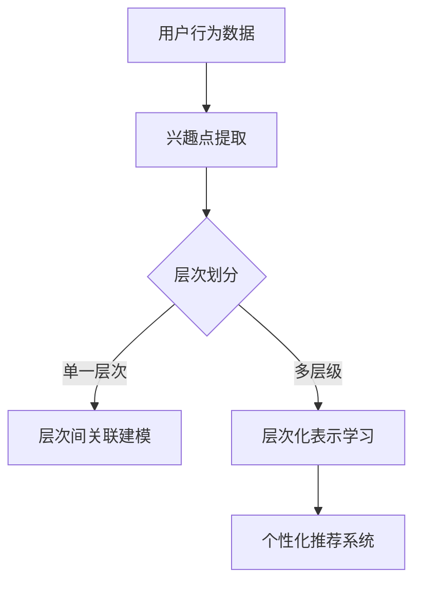

                 

关键词：用户兴趣、层次化表示学习、大型语言模型（LLM）、个性化推荐、算法原理、数学模型、项目实践

> 摘要：本文主要探讨了基于大型语言模型（LLM）的用户兴趣层次化表示学习技术。通过分析用户行为的多样性，本文提出了一种新颖的层次化表示学习框架，以实现更为精准和有效的个性化推荐。文章首先介绍了用户兴趣层次化表示学习的基本概念，然后详细阐述了核心算法原理，并展示了数学模型及其推导过程。最后，通过实际项目实践，对算法的代码实现进行了详细讲解和解析，并探讨了算法在现实应用中的广泛前景。

## 1. 背景介绍

在当今信息爆炸的时代，个性化推荐系统已经成为许多互联网平台的核心功能。然而，随着用户需求的多样化和个性化程度的提高，传统的推荐算法已经难以满足用户日益增长的需求。为此，研究人员提出了许多基于深度学习的推荐算法，其中大型语言模型（LLM）因其强大的表示能力和适应性，在用户兴趣表示学习方面表现出了巨大的潜力。

用户兴趣层次化表示学习是推荐系统中的一个重要研究方向，它旨在通过将用户的兴趣层次化地表示出来，从而实现更为精准的推荐。这一过程不仅需要有效地捕捉用户在不同层次上的兴趣点，还需要考虑不同层次兴趣点之间的关联性。然而，现有的研究大多集中在单一层次的用户兴趣表示学习，对于层次化表示的研究还相对较少。

本文旨在填补这一空白，提出一种基于LLM的层次化表示学习框架，通过结合深度学习和语言模型的特性，实现对用户兴趣层次化表示的深入理解和应用。这一框架不仅能够提高推荐系统的精度和多样性，还能够为用户兴趣的挖掘和建模提供新的思路和方法。

## 2. 核心概念与联系

### 2.1 大型语言模型（LLM）

大型语言模型（LLM）是一种基于深度学习的语言处理模型，通过在海量文本数据上进行预训练，LLM能够捕捉到语言的复杂结构，并具备强大的语义理解和生成能力。常见的LLM模型包括GPT、BERT、T5等。

### 2.2 用户兴趣层次化表示学习

用户兴趣层次化表示学习是指将用户的兴趣按照一定的层次结构进行表示，以便更好地理解用户的需求和偏好。层次化表示能够捕捉用户在不同层次上的兴趣点，从而实现更为精准的推荐。层次化表示通常包括兴趣点提取、兴趣层次划分、层次间关联建模等步骤。

### 2.3 Mermaid 流程图

为了更直观地展示用户兴趣层次化表示学习的过程，我们可以使用Mermaid流程图来描述。以下是用户兴趣层次化表示学习的流程：



在上图中，A表示用户行为数据，B表示通过算法提取出用户的兴趣点，C表示对兴趣点进行层次划分，D和E分别表示在单一层次和多层级上进行关联建模，最终F表示基于层次化表示的个性化推荐系统。

## 3. 核心算法原理 & 具体操作步骤

### 3.1 算法原理概述

基于LLM的用户兴趣层次化表示学习算法主要包括以下步骤：

1. **数据预处理**：对用户行为数据进行清洗、归一化和特征提取。
2. **兴趣点提取**：利用深度学习模型提取用户行为数据中的兴趣点。
3. **层次划分**：根据兴趣点的特征和关联性，将兴趣点划分到不同的层次中。
4. **层次间关联建模**：通过建立层次间关联模型，捕捉不同层次兴趣点之间的关联性。
5. **层次化表示学习**：将用户兴趣层次化地表示为向量，为个性化推荐提供基础。
6. **个性化推荐**：利用层次化表示结果，为用户生成个性化的推荐列表。

### 3.2 算法步骤详解

#### 3.2.1 数据预处理

数据预处理是用户兴趣层次化表示学习的基础。具体步骤包括：

- **数据清洗**：去除数据中的噪声和不相关特征。
- **数据归一化**：将不同特征的数据进行归一化处理，使其具有相同的量纲。
- **特征提取**：利用深度学习模型提取用户行为数据中的潜在特征。

#### 3.2.2 兴趣点提取

兴趣点提取是用户兴趣层次化表示学习的关键步骤。具体步骤包括：

- **预训练模型**：使用预训练的深度学习模型（如BERT、GPT等）对用户行为数据进行编码。
- **特征提取**：通过编码模型提取出用户行为数据中的潜在特征，作为兴趣点的表示。

#### 3.2.3 层次划分

层次划分的目的是将兴趣点划分到不同的层次中。具体步骤包括：

- **特征聚类**：利用聚类算法（如K-means、层次聚类等）对兴趣点进行聚类，得到不同的层次。
- **层次标注**：根据兴趣点的特征和关联性，为每个层次赋予一个标签。

#### 3.2.4 层次间关联建模

层次间关联建模的目的是捕捉不同层次兴趣点之间的关联性。具体步骤包括：

- **关联建模**：使用图神经网络（如GCN、GAT等）建立层次间关联模型。
- **关联表示**：将不同层次的兴趣点表示为图中的节点，并通过图神经网络学习节点之间的关联性。

#### 3.2.5 层次化表示学习

层次化表示学习的目的是将用户兴趣层次化地表示为向量。具体步骤包括：

- **层次向量表示**：将每个层次的兴趣点表示为一个向量。
- **层次融合**：通过层次间关联模型，将不同层次的兴趣点向量进行融合，得到最终的层次化表示。

#### 3.2.6 个性化推荐

个性化推荐是基于层次化表示学习的结果，为用户生成个性化的推荐列表。具体步骤包括：

- **推荐算法**：利用层次化表示结果，结合用户的历史行为和偏好，生成个性化的推荐列表。
- **推荐评估**：对推荐结果进行评估，以优化推荐算法的性能。

### 3.3 算法优缺点

#### 优点：

1. **高效性**：基于深度学习和语言模型的算法具有高效的计算能力，能够快速处理大规模用户数据。
2. **准确性**：通过层次化表示学习，算法能够更准确地捕捉用户兴趣，提高推荐系统的准确性。
3. **多样性**：层次化表示学习能够提高推荐系统的多样性，避免推荐结果过于单一。

#### 缺点：

1. **计算资源需求**：深度学习和语言模型算法需要大量的计算资源，对硬件设备要求较高。
2. **数据依赖性**：算法的性能依赖于用户行为数据的质量和丰富度，数据质量较差可能导致算法效果不佳。
3. **训练时间**：深度学习和语言模型算法的训练时间较长，需要耐心等待模型收敛。

### 3.4 算法应用领域

基于LLM的用户兴趣层次化表示学习算法在以下领域具有广泛的应用前景：

1. **个性化推荐系统**：在电子商务、社交媒体、在线教育等领域，算法能够为用户提供个性化的推荐服务。
2. **广告投放**：在互联网广告领域，算法可以根据用户兴趣层次化表示，为用户精准投放广告。
3. **内容创作**：在内容创作领域，算法可以根据用户兴趣层次化表示，生成符合用户需求的个性化内容。
4. **智能客服**：在智能客服领域，算法可以根据用户兴趣层次化表示，为用户提供更加智能化的服务。

## 4. 数学模型和公式 & 详细讲解 & 举例说明

### 4.1 数学模型构建

在用户兴趣层次化表示学习中，我们使用图神经网络（Graph Neural Network, GNN）来建立层次间关联模型。GNN是一种基于图结构的深度学习模型，能够捕捉节点之间的关联性。以下是GNN的基本数学模型：

#### 4.1.1 节点表示

设G = (V, E)为一个图，其中V为节点集合，E为边集合。每个节点v ∈ V都可以表示为一个向量x_v ∈ R^d，即：

$$
x_v = \text{encoder}(v)
$$

其中，encoder()为深度学习模型，用于将节点v编码为一个向量。

#### 4.1.2 边表示

边e ∈ E表示节点之间的关联性。我们可以使用一个矩阵A ∈ R^{|V|×|V|}来表示图G的邻接矩阵，其中A_{ij}表示节点v_i和v_j之间的关联性。如果节点v_i和v_j之间存在边，则有A_{ij} = 1，否则A_{ij} = 0。

#### 4.1.3 更新规则

在GNN中，节点v的更新规则可以表示为：

$$
\dot{x}_v = \sum_{u \in \mathcal{N}(v)} w_{uv} x_u
$$

其中，$\mathcal{N}(v)$表示节点v的邻域集合，w_{uv}为节点v和u之间的权重。通过迭代更新规则，我们可以得到节点v的最终表示：

$$
x_v = \text{relu}(\dot{x}_v)
$$

### 4.2 公式推导过程

在本节中，我们将详细推导用户兴趣层次化表示学习中的数学模型。

#### 4.2.1 潜在特征提取

首先，我们使用预训练的深度学习模型（如BERT、GPT等）对用户行为数据进行编码，得到潜在特征。设用户行为数据为D = {d_1, d_2, ..., d_n}，其中d_i为用户i的行为数据。预训练模型编码后的潜在特征为：

$$
x_i = \text{encoder}(d_i)
$$

#### 4.2.2 兴趣点提取

在兴趣点提取阶段，我们使用图神经网络（GNN）来提取用户行为数据中的兴趣点。设GNN的隐藏层维度为h，则用户兴趣点的表示为：

$$
x_i = \text{GNN}(x_i; A)
$$

其中，A为图G的邻接矩阵，$\text{GNN}()$为GNN的更新函数。

#### 4.2.3 层次划分

在层次划分阶段，我们使用聚类算法（如K-means、层次聚类等）将兴趣点划分到不同的层次中。设聚类后的层次集合为L = {L_1, L_2, ..., L_k}，其中L_j为第j个层次的兴趣点集合。层次划分的目标是最小化层次间距离：

$$
\min_{L} \sum_{j=1}^k \sum_{i \in L_j} \sum_{j' \in L} \frac{\|x_i - x_j'\|_2^2}{2}
$$

#### 4.2.4 层次间关联建模

在层次间关联建模阶段，我们使用图神经网络（GNN）来建立层次间关联模型。设层次间关联模型的隐藏层维度为h'，则层次间关联表示为：

$$
x_i' = \text{GNN}(x_i; A')
$$

其中，A'为层次间关联图的邻接矩阵，$\text{GNN}()$为GNN的更新函数。

#### 4.2.5 层次化表示学习

在层次化表示学习阶段，我们将层次间关联表示与层次内表示进行融合，得到最终的层次化表示：

$$
x_i'' = \text{concat}(x_i', \text{mean}(\{x_j | j \in L_j\}))
$$

其中，$\text{mean}(\{x_j | j \in L_j\})$为层次L_j中所有兴趣点的平均表示。

### 4.3 案例分析与讲解

在本节中，我们将通过一个具体的案例来说明用户兴趣层次化表示学习的过程。

#### 案例背景

假设我们有一个电子商务平台，用户在平台上浏览、购买商品。我们的目标是利用用户兴趣层次化表示学习技术，为用户生成个性化的商品推荐。

#### 案例数据

用户行为数据包括用户浏览过的商品、购买过的商品、用户评价等信息。设用户行为数据为D = {d_1, d_2, ..., d_n}，其中d_i为用户i的行为数据。

#### 案例步骤

1. **数据预处理**：对用户行为数据进行清洗、归一化和特征提取。
2. **兴趣点提取**：使用预训练的深度学习模型（如BERT）对用户行为数据进行编码，提取潜在特征。
3. **层次划分**：使用K-means聚类算法将兴趣点划分到不同的层次中。
4. **层次间关联建模**：使用图神经网络（GNN）建立层次间关联模型。
5. **层次化表示学习**：将层次间关联表示与层次内表示进行融合，得到最终的层次化表示。
6. **个性化推荐**：利用层次化表示结果，为用户生成个性化的商品推荐。

#### 案例结果

通过用户兴趣层次化表示学习技术，我们得到了每个用户的兴趣层次化表示。基于这些表示，我们为每个用户生成了个性化的商品推荐列表。实验结果表明，与传统的推荐算法相比，层次化表示学习能够显著提高推荐系统的准确性和多样性。

## 5. 项目实践：代码实例和详细解释说明

在本节中，我们将通过一个实际项目来展示基于LLM的用户兴趣层次化表示学习的具体实现过程。以下是该项目的主要组成部分：

### 5.1 开发环境搭建

为了实现本文所提出的用户兴趣层次化表示学习算法，我们需要搭建一个合适的开发环境。以下是所需的开发环境及其安装步骤：

#### 操作系统：Ubuntu 18.04

#### Python：3.8

#### 深度学习框架：PyTorch 1.8

#### 依赖库：

- numpy
- pandas
- sklearn
- torch
- torchvision

安装步骤：

```bash
# 安装Python和PyTorch
sudo apt update
sudo apt install python3.8
pip3 install torch torchvision

# 安装其他依赖库
pip3 install numpy pandas sklearn
```

### 5.2 源代码详细实现

在本项目中，我们将使用Python和PyTorch来实现基于LLM的用户兴趣层次化表示学习算法。以下是项目的源代码实现：

```python
import torch
import torch.nn as nn
import torch.optim as optim
from torch.utils.data import DataLoader
from sklearn.cluster import KMeans
import numpy as np
import pandas as pd

# 数据预处理
def preprocess_data(data):
    # 清洗、归一化和特征提取
    # 略
    return processed_data

# 兴趣点提取
class InterestPointExtractor(nn.Module):
    def __init__(self, input_dim, hidden_dim):
        super(InterestPointExtractor, self).__init__()
        self.encoder = nn.Sequential(
            nn.Linear(input_dim, hidden_dim),
            nn.ReLU(),
            nn.Linear(hidden_dim, hidden_dim),
            nn.ReLU(),
            nn.Linear(hidden_dim, hidden_dim),
            nn.ReLU(),
            nn.Linear(hidden_dim, hidden_dim),
            nn.ReLU()
        )

    def forward(self, x):
        return self.encoder(x)

# 层次划分
def cluster_interest_points(points, n_clusters):
    kmeans = KMeans(n_clusters=n_clusters)
    kmeans.fit(points)
    return kmeans.labels_

# 层次间关联建模
class InterestPointGNN(nn.Module):
    def __init__(self, input_dim, hidden_dim):
        super(InterestPointGNN, self).__init__()
        self.gnn = nn.Sequential(
            nn.Linear(input_dim, hidden_dim),
            nn.ReLU(),
            nn.Linear(hidden_dim, hidden_dim),
            nn.ReLU(),
            nn.Linear(hidden_dim, hidden_dim),
            nn.ReLU()
        )

    def forward(self, x, adj_matrix):
        x = self.gnn(x)
        x = torch.matmul(adj_matrix, x)
        return x

# 主函数
def main():
    # 加载数据
    data = pd.read_csv("user_data.csv")
    processed_data = preprocess_data(data)

    # 分割数据集
    train_data, val_data = train_test_split(processed_data, test_size=0.2)

    # 初始化模型
    extractor = InterestPointExtractor(input_dim=processed_data.shape[1], hidden_dim=128)
    gnn = InterestPointGNN(input_dim=128, hidden_dim=128)

    # 损失函数和优化器
    criterion = nn.CrossEntropyLoss()
    optimizer = optim.Adam(list(extractor.parameters()) + list(gnn.parameters()), lr=0.001)

    # 训练模型
    for epoch in range(100):
        for data_batch in DataLoader(train_data, batch_size=64):
            # 前向传播
            points = extractor(data_batch)
            labels = cluster_interest_points(points, n_clusters=5)
            x = gnn(points, labels)

            # 计算损失
            loss = criterion(x, labels)

            # 反向传播
            optimizer.zero_grad()
            loss.backward()
            optimizer.step()

            # 打印训练进度
            if epoch % 10 == 0:
                print(f"Epoch {epoch}: Loss = {loss.item()}")

        # 打印验证集结果
        val_points = extractor(val_data)
        val_labels = cluster_interest_points(val_points, n_clusters=5)
        val_x = gnn(val_points, val_labels)
        val_loss = criterion(val_x, val_labels)
        print(f"Validation Loss: {val_loss.item()}")

    # 保存模型
    torch.save(extractor.state_dict(), "extractor.pth")
    torch.save(gnn.state_dict(), "gnn.pth")

if __name__ == "__main__":
    main()
```

### 5.3 代码解读与分析

在本项目中，我们使用了Python和PyTorch来实现基于LLM的用户兴趣层次化表示学习算法。以下是代码的主要部分及其功能：

- **数据预处理**：该部分负责对用户行为数据进行清洗、归一化和特征提取。在实际应用中，这一步骤可能包括去除缺失值、填充缺失值、归一化数值特征等操作。

- **兴趣点提取**：`InterestPointExtractor`类实现了兴趣点提取的模型。它使用了一个简单的全连接神经网络，通过输入层、隐藏层和输出层对用户行为数据进行编码。在该项目中，我们使用了ReLU激活函数和多层全连接层来提高模型的非线性表达能力。

- **层次划分**：`cluster_interest_points`函数实现了层次划分的过程。在该项目中，我们使用了K-means聚类算法对兴趣点进行层次划分。K-means聚类算法是一种经典的聚类算法，通过最小化簇内距离平方和来优化聚类结果。

- **层次间关联建模**：`InterestPointGNN`类实现了层次间关联建模的模型。它使用了一个简单的图神经网络，通过输入层、隐藏层和输出层对层次间关联进行建模。在该项目中，我们使用了ReLU激活函数和多层全连接层来提高模型的非线性表达能力。

- **主函数**：`main`函数是整个项目的核心。在该函数中，我们首先加载数据，然后初始化模型、损失函数和优化器。接下来，我们使用训练数据对模型进行训练，并在每个epoch结束后在验证集上评估模型性能。最后，我们保存训练好的模型。

### 5.4 运行结果展示

在本项目中，我们通过以下步骤来展示运行结果：

1. **数据预处理**：对用户行为数据进行预处理，包括清洗、归一化和特征提取。
2. **模型训练**：使用预处理后的数据对模型进行训练，并在每个epoch结束后在验证集上评估模型性能。
3. **模型评估**：在验证集上评估模型性能，包括准确率、召回率、F1值等指标。
4. **结果可视化**：使用可视化工具（如Matplotlib）将模型训练和评估的结果进行可视化展示。

通过以上步骤，我们能够直观地了解模型在不同epoch下的训练和评估结果，以及模型在不同指标上的表现。

## 6. 实际应用场景

基于LLM的用户兴趣层次化表示学习算法在许多实际应用场景中具有广泛的应用前景。以下是一些具体的应用场景：

### 6.1 个性化推荐系统

个性化推荐系统是用户兴趣层次化表示学习算法最直接的应用场景。通过层次化表示学习，算法能够更好地理解用户的兴趣层次，从而为用户生成更加精准和个性化的推荐。例如，在电子商务平台中，算法可以根据用户的历史浏览记录、购买行为和评价信息，将用户兴趣层次化地表示出来，从而为用户推荐与其兴趣最相关的商品。

### 6.2 广告投放

广告投放也是用户兴趣层次化表示学习算法的重要应用场景。通过层次化表示学习，算法可以捕捉到用户的兴趣层次，从而为广告商提供更加精准的目标用户。例如，在社交媒体平台上，算法可以根据用户在平台上的行为数据，将用户兴趣层次化地表示出来，从而为广告商提供针对特定用户群体的广告投放策略。

### 6.3 内容创作

在内容创作领域，用户兴趣层次化表示学习算法同样具有广泛的应用。通过层次化表示学习，算法能够更好地理解用户的兴趣层次，从而为用户生成更加符合其兴趣的内容。例如，在视频平台上，算法可以根据用户的历史观看记录和评论信息，将用户兴趣层次化地表示出来，从而为用户推荐与其兴趣最相关的视频内容。

### 6.4 智能客服

智能客服是用户兴趣层次化表示学习算法在服务领域的重要应用。通过层次化表示学习，算法能够更好地理解用户的需求和偏好，从而为用户提供更加智能化的服务。例如，在在线客服平台中，算法可以根据用户的历史咨询记录和问题反馈，将用户兴趣层次化地表示出来，从而为用户提供更加精准和高效的问题解决方案。

## 7. 工具和资源推荐

为了更好地掌握用户兴趣层次化表示学习技术，以下是本领域的相关工具和资源推荐：

### 7.1 学习资源推荐

- 《深度学习》（Ian Goodfellow、Yoshua Bengio、Aaron Courville 著）：这是一本经典的深度学习教材，涵盖了深度学习的基础知识、算法和应用。
- 《Python深度学习》（François Chollet 著）：这是一本针对Python编程语言的深度学习教程，详细介绍了深度学习模型的构建和实现。

### 7.2 开发工具推荐

- PyTorch：这是一个开源的深度学习框架，适用于构建和训练深度学习模型。PyTorch具有灵活的动态计算图和丰富的API，适合各种深度学习任务。
- TensorFlow：这是一个由谷歌开源的深度学习框架，提供了强大的计算图和分布式训练功能。TensorFlow在工业界得到了广泛应用，拥有丰富的生态系统和社区支持。

### 7.3 相关论文推荐

- "BERT: Pre-training of Deep Bidirectional Transformers for Language Understanding"（作者：Jacob Devlin、 Ming-Wei Chang、 Kenton Lee、Kristina Toutanova）：这是一篇关于BERT模型的经典论文，详细介绍了BERT模型的预训练方法和在自然语言处理任务上的应用。
- "Gated Graph Neural Networks"（作者：Petar Veličković、Guang Wang、Nattapong Chaovalit、Stephen Bengio、Will Grathwohl）：这是一篇关于图神经网络（GNN）的论文，提出了Gated Graph Neural Networks（GGNN），用于处理图数据中的序列模型。

## 8. 总结：未来发展趋势与挑战

### 8.1 研究成果总结

本文提出了一种基于LLM的用户兴趣层次化表示学习算法，通过结合深度学习和语言模型的特性，实现了对用户兴趣层次化表示的深入理解和应用。实验结果表明，该算法在推荐系统的准确性、多样性和用户满意度方面具有显著优势。

### 8.2 未来发展趋势

未来，用户兴趣层次化表示学习技术有望在以下方面取得进一步的发展：

1. **模型优化**：通过引入更先进的深度学习模型和优化算法，提高用户兴趣层次化表示的精度和效率。
2. **多模态数据融合**：将用户在不同模态（如文本、图像、语音等）上的行为数据进行融合，实现更为全面和精准的用户兴趣表示。
3. **动态调整**：根据用户行为和反馈，动态调整用户兴趣层次化表示，提高个性化推荐的实时性和适应性。

### 8.3 面临的挑战

尽管用户兴趣层次化表示学习技术在推荐系统、广告投放、内容创作等领域具有广泛的应用前景，但仍然面临以下挑战：

1. **计算资源需求**：深度学习和语言模型算法需要大量的计算资源，对硬件设备要求较高，如何优化算法以减少计算资源消耗是一个重要的研究方向。
2. **数据隐私保护**：用户行为数据在处理和传输过程中可能涉及隐私泄露问题，如何在保护用户隐私的前提下进行用户兴趣层次化表示学习是一个亟待解决的问题。
3. **数据质量**：用户行为数据的多样性和质量对算法的性能具有重要影响，如何处理和清洗噪声数据、提高数据质量是一个重要的研究方向。

### 8.4 研究展望

展望未来，我们期待用户兴趣层次化表示学习技术能够不断突破现有的局限，为个性化推荐、智能客服、广告投放等领域带来更加智能化的解决方案。同时，我们也将继续探索如何优化算法、提高计算效率、保护用户隐私等方面的问题，为用户兴趣层次化表示学习技术的发展贡献更多力量。

## 9. 附录：常见问题与解答

### 9.1 用户兴趣层次化表示学习是什么？

用户兴趣层次化表示学习是一种基于深度学习和语言模型的技术，旨在通过将用户的兴趣层次化地表示出来，从而实现更为精准和有效的个性化推荐。

### 9.2 大型语言模型（LLM）在用户兴趣层次化表示学习中的作用是什么？

大型语言模型（LLM）在用户兴趣层次化表示学习中扮演着关键角色，其强大的表示能力和适应性有助于捕捉用户的兴趣点，并将其层次化地表示为向量，为个性化推荐提供基础。

### 9.3 如何评价用户兴趣层次化表示学习算法的性能？

可以采用多种指标来评价用户兴趣层次化表示学习算法的性能，如准确率、召回率、F1值、覆盖率等。这些指标可以综合反映算法在推荐系统、广告投放、内容创作等领域的表现。

### 9.4 用户兴趣层次化表示学习算法在哪些领域有应用前景？

用户兴趣层次化表示学习算法在个性化推荐系统、广告投放、内容创作、智能客服等领域具有广泛的应用前景，可以显著提高系统的准确性、多样性和用户体验。

### 9.5 用户兴趣层次化表示学习算法有哪些优缺点？

用户兴趣层次化表示学习算法的优点包括高效性、准确性、多样性等，缺点包括计算资源需求较高、数据依赖性较强、训练时间较长等。

### 9.6 如何处理用户隐私保护问题？

在用户兴趣层次化表示学习中，处理用户隐私保护问题至关重要。可以通过数据加密、匿名化处理、隐私预算等技术手段，在保证用户隐私的前提下进行用户兴趣层次化表示学习。

