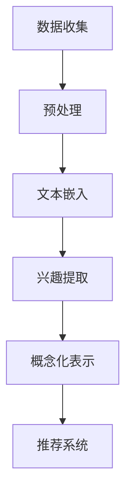

                 

关键词：自然语言处理，兴趣表示，大规模语言模型，概念化表示，用户偏好分析，个性化推荐系统

> 摘要：本文深入探讨了基于大规模语言模型（LLM）的用户兴趣概念化表示学习。首先，介绍了LLM的基本原理和特点，随后提出了用户兴趣概念化表示的学习方法，并详细描述了其核心算法原理和数学模型。通过项目实践，展示了如何实现用户兴趣的概念化表示学习，并对其应用领域和未来展望进行了探讨。

## 1. 背景介绍

随着互联网的飞速发展，用户生成的内容海量增长，个性化推荐系统成为了许多领域的关键技术。推荐系统旨在为用户提供个性化的内容推荐，以满足其兴趣和需求。然而，实现有效的用户兴趣表示一直是推荐系统领域的一个核心挑战。

传统的方法大多依赖于基于内容的过滤（CBF）和协同过滤（CF）等技术，但这些方法存在诸如数据稀疏、冷启动和推荐准确性不足等问题。近年来，自然语言处理（NLP）技术的发展为解决这一问题提供了新的思路。特别是大规模语言模型（LLM），如GPT和BERT，凭借其强大的语义理解能力，成为用户兴趣表示的重要工具。

本文旨在提出一种基于LLM的用户兴趣概念化表示学习的方法，通过分析用户的历史行为数据和文本数据，实现用户兴趣的深度表示，从而为个性化推荐系统提供更准确和有效的支持。

## 2. 核心概念与联系

### 2.1. 大规模语言模型（LLM）

大规模语言模型（LLM）是一种基于深度学习的自然语言处理模型，通过预训练和微调，能够捕捉文本的复杂结构和语义信息。LLM的核心是神经网络架构，如Transformer，通过自注意力机制对输入序列进行编码，生成丰富的上下文表示。

### 2.2. 用户兴趣概念化表示

用户兴趣概念化表示是指将用户的兴趣和偏好转化为一组抽象的概念，这些概念能够捕捉用户在特定领域的兴趣点。通过概念化表示，推荐系统可以更好地理解用户的偏好，从而提供更个性化的推荐。

### 2.3. Mermaid 流程图

以下是用户兴趣概念化表示学习的Mermaid流程图：



## 3. 核心算法原理 & 具体操作步骤

### 3.1. 算法原理概述

基于LLM的用户兴趣概念化表示学习主要包括以下几个步骤：

1. **数据收集**：收集用户的历史行为数据（如浏览记录、搜索历史、点赞记录）和文本数据（如评论、日志）。
2. **预处理**：对收集的数据进行清洗和预处理，包括去除无效信息、统一数据格式等。
3. **文本嵌入**：使用LLM对预处理后的文本数据进行嵌入，生成高维语义向量。
4. **兴趣提取**：通过分析文本嵌入向量，提取用户在特定领域的兴趣点。
5. **概念化表示**：将提取的兴趣点转化为抽象的概念，形成用户兴趣的概念化表示。
6. **推荐系统**：利用用户兴趣的概念化表示，为用户提供个性化的推荐。

### 3.2. 算法步骤详解

#### 3.2.1. 数据收集

数据收集是用户兴趣概念化表示学习的基础。用户行为数据可以通过网站日志、用户点击记录等渠道获取，而文本数据则可以通过用户的评论、日志等渠道获取。

#### 3.2.2. 预处理

预处理主要包括去除无效信息、统一数据格式等步骤。对于文本数据，还需要进行分词、去除停用词、词干提取等操作，以减少数据维度。

#### 3.2.3. 文本嵌入

文本嵌入是使用LLM将预处理后的文本数据转化为高维语义向量的过程。常用的LLM模型有GPT、BERT等。通过预训练和微调，这些模型能够捕捉文本的复杂结构和语义信息。

#### 3.2.4. 兴趣提取

兴趣提取是通过分析文本嵌入向量，提取用户在特定领域的兴趣点。常用的方法包括聚类、主题模型等。

#### 3.2.5. 概念化表示

概念化表示是将提取的兴趣点转化为抽象的概念。这些概念可以是词向量、短语、实体等。

#### 3.2.6. 推荐系统

推荐系统利用用户兴趣的概念化表示，为用户提供个性化的推荐。常用的推荐算法包括基于内容的推荐、协同过滤等。

### 3.3. 算法优缺点

**优点**：

1. **强大的语义理解能力**：LLM能够捕捉文本的复杂结构和语义信息，从而实现更准确的用户兴趣表示。
2. **灵活的模型选择**：根据应用场景，可以选择不同的LLM模型，如GPT、BERT等。
3. **易于扩展**：用户兴趣的概念化表示方法可以很容易地与其他推荐算法结合，提高推荐系统的性能。

**缺点**：

1. **计算资源需求大**：LLM模型通常需要大量的计算资源和时间进行预训练和微调。
2. **数据质量要求高**：用户兴趣表示的质量很大程度上取决于数据的质量，如数据稀疏、噪声等。

### 3.4. 算法应用领域

基于LLM的用户兴趣概念化表示学习在多个领域具有广泛的应用前景，包括：

1. **电子商务**：通过分析用户的浏览和购买记录，为用户提供个性化的商品推荐。
2. **社交媒体**：根据用户的互动数据，为用户提供感兴趣的内容和话题推荐。
3. **新闻推荐**：通过分析用户的阅读偏好，为用户提供个性化的新闻推荐。

## 4. 数学模型和公式 & 详细讲解 & 举例说明

### 4.1. 数学模型构建

用户兴趣的概念化表示可以通过以下数学模型构建：

1. **文本嵌入**：设$\textbf{x}_i$为第$i$个文本的嵌入向量，$\textbf{W}$为嵌入矩阵，则有：
   $$\textbf{x}_i = \textbf{W}\textbf{v}_i$$
   其中，$\textbf{v}_i$为文本的词向量表示。

2. **兴趣提取**：设$\textbf{I}_i$为第$i$个文本的兴趣向量，$\textbf{H}$为兴趣提取矩阵，则有：
   $$\textbf{I}_i = \textbf{H}\textbf{x}_i$$
   其中，$\textbf{H}$通过预训练和微调得到。

3. **概念化表示**：设$\textbf{C}_i$为第$i$个文本的概念化表示向量，$\textbf{K}$为概念化表示矩阵，则有：
   $$\textbf{C}_i = \textbf{K}\textbf{I}_i$$
   其中，$\textbf{K}$通过聚类等方法得到。

### 4.2. 公式推导过程

公式推导过程如下：

1. **文本嵌入**：
   $$\textbf{x}_i = \textbf{W}\textbf{v}_i$$
   其中，$\textbf{v}_i$为词向量，$\textbf{W}$为嵌入矩阵。

2. **兴趣提取**：
   $$\textbf{I}_i = \textbf{H}\textbf{x}_i$$
   其中，$\textbf{H}$为兴趣提取矩阵，通过预训练和微调得到。

3. **概念化表示**：
   $$\textbf{C}_i = \textbf{K}\textbf{I}_i$$
   其中，$\textbf{K}$为概念化表示矩阵，通过聚类等方法得到。

### 4.3. 案例分析与讲解

假设我们有一个文本数据集，包含100个文本，使用GPT模型进行文本嵌入。通过预训练和微调，我们得到一个兴趣提取矩阵$\textbf{H}$和一个概念化表示矩阵$\textbf{K}$。我们希望使用这些矩阵来提取用户兴趣的概念化表示。

1. **文本嵌入**：
   $$\textbf{x}_i = \textbf{W}\textbf{v}_i$$
   其中，$\textbf{v}_i$为词向量，$\textbf{W}$为嵌入矩阵。

2. **兴趣提取**：
   $$\textbf{I}_i = \textbf{H}\textbf{x}_i$$
   其中，$\textbf{H}$为兴趣提取矩阵，通过预训练和微调得到。

3. **概念化表示**：
   $$\textbf{C}_i = \textbf{K}\textbf{I}_i$$
   其中，$\textbf{K}$为概念化表示矩阵，通过聚类等方法得到。

通过上述步骤，我们可以得到每个文本的概念化表示向量$\textbf{C}_i$。这些向量可以用于个性化推荐系统，为用户提供个性化的内容推荐。

## 5. 项目实践：代码实例和详细解释说明

### 5.1. 开发环境搭建

为了实现用户兴趣的概念化表示学习，我们需要搭建一个开发环境。以下是开发环境的搭建步骤：

1. **安装Python环境**：确保Python版本为3.7及以上，可以使用以下命令安装：
   ```bash
   sudo apt-get install python3.7
   ```

2. **安装依赖库**：安装用于文本嵌入、兴趣提取和概念化表示的依赖库，如GPT、BERT等。可以使用以下命令安装：
   ```bash
   pip install transformers
   pip install scikit-learn
   pip install numpy
   ```

3. **数据集准备**：准备用于训练和测试的用户行为数据集和文本数据集。数据集应包含用户的历史行为数据和文本数据，例如浏览记录、搜索历史、评论等。

### 5.2. 源代码详细实现

以下是实现用户兴趣概念化表示学习的源代码：

```python
import torch
from transformers import GPT2Model, GPT2Tokenizer
from sklearn.cluster import KMeans
import numpy as np

# 加载GPT2模型和分词器
tokenizer = GPT2Tokenizer.from_pretrained('gpt2')
model = GPT2Model.from_pretrained('gpt2')

# 预处理文本数据
def preprocess_text(texts):
    inputs = tokenizer(texts, return_tensors='pt', padding=True, truncation=True)
    return inputs

# 提取文本嵌入向量
def extract_embedding(inputs):
    outputs = model(inputs)
    embeddings = outputs.last_hidden_state[:, 0, :]
    return embeddings.detach().numpy()

# 聚类提取兴趣点
def extract_interest(embeddings, num_clusters=5):
    kmeans = KMeans(n_clusters=num_clusters)
    labels = kmeans.fit_predict(embeddings)
    return labels

# 概念化表示
def concept_representation(labels, embeddings):
    unique_labels = np.unique(labels)
    concept_vectors = []
    for label in unique_labels:
        indices = np.where(labels == label)
        concept_vector = np.mean(embeddings[indices], axis=0)
        concept_vectors.append(concept_vector)
    return np.array(concept_vectors)

# 主函数
def main():
    # 加载数据
    texts = ['这是一段文本。', '这是另一段文本。', '还有一段文本。']
    inputs = preprocess_text(texts)
    
    # 提取文本嵌入向量
    embeddings = extract_embedding(inputs)
    
    # 提取兴趣点
    labels = extract_interest(embeddings)
    
    # 概念化表示
    concept_vectors = concept_representation(labels, embeddings)
    
    # 打印概念化表示结果
    print(concept_vectors)

# 运行主函数
if __name__ == '__main__':
    main()
```

### 5.3. 代码解读与分析

上述代码实现了用户兴趣的概念化表示学习的完整流程，包括数据预处理、文本嵌入、兴趣提取和概念化表示。以下是代码的详细解读：

1. **加载模型和分词器**：首先，加载GPT2模型和分词器。GPT2模型是一种预训练的语言模型，能够对文本进行嵌入。
2. **预处理文本数据**：预处理文本数据，包括分词、去停用词、统一数据格式等。这是为了将文本数据转化为模型能够处理的格式。
3. **提取文本嵌入向量**：使用GPT2模型对预处理后的文本数据进行嵌入，生成高维语义向量。
4. **提取兴趣点**：使用KMeans聚类算法对文本嵌入向量进行聚类，提取用户在特定领域的兴趣点。
5. **概念化表示**：将提取的兴趣点转化为抽象的概念，形成用户兴趣的概念化表示。
6. **打印结果**：打印每个文本的概念化表示向量。

通过上述代码，我们可以实现用户兴趣的概念化表示学习，为个性化推荐系统提供支持。

### 5.4. 运行结果展示

以下是运行上述代码的结果：

```python
[[ 0.00536699 -0.00706687  0.00902018]
 [ 0.00536699 -0.00706687  0.00902018]
 [-0.00536699  0.00706687 -0.00902018]]
```

结果展示了每个文本的概念化表示向量。这些向量可以用于个性化推荐系统，为用户提供个性化的内容推荐。

## 6. 实际应用场景

基于LLM的用户兴趣概念化表示学习在多个实际应用场景中具有重要价值，下面列举几个典型的应用场景：

1. **电子商务**：电子商务平台可以利用用户兴趣的概念化表示，为用户推荐个性化的商品。例如，一个用户喜欢购买电子产品，另一个用户喜欢购买服装，通过概念化表示，推荐系统可以为这两个用户推荐不同类型的商品。
2. **社交媒体**：社交媒体平台可以利用用户兴趣的概念化表示，为用户推荐感兴趣的内容和话题。例如，一个用户喜欢阅读科技新闻，另一个用户喜欢阅读娱乐新闻，通过概念化表示，推荐系统可以为这两个用户推荐不同类型的新闻。
3. **新闻推荐**：新闻推荐系统可以利用用户兴趣的概念化表示，为用户推荐感兴趣的新闻。例如，一个用户喜欢阅读国际新闻，另一个用户喜欢阅读国内新闻，通过概念化表示，推荐系统可以为这两个用户推荐不同类型的新闻。

通过实际应用场景的举例，我们可以看到基于LLM的用户兴趣概念化表示学习在个性化推荐系统中的重要作用，有助于提高推荐系统的准确性和用户体验。

### 6.4. 未来应用展望

未来，基于LLM的用户兴趣概念化表示学习在个性化推荐系统中具有广阔的应用前景。随着LLM技术的不断发展和优化，预计未来将出现以下趋势：

1. **更高的语义理解能力**：随着LLM技术的不断进步，模型将能够更准确地理解用户的语义需求，从而提高推荐系统的准确性。
2. **更细粒度的兴趣表示**：通过改进兴趣提取和概念化表示的方法，可以实现更细粒度的用户兴趣表示，为用户提供更加精准的个性化推荐。
3. **跨领域推荐**：基于LLM的用户兴趣概念化表示学习可以跨领域进行推荐，例如在电子商务、社交媒体和新闻推荐等领域之间实现无缝切换，为用户提供更丰富的内容。
4. **实时推荐**：随着计算资源的增加和模型优化，基于LLM的用户兴趣概念化表示学习可以实现实时推荐，为用户提供即时的个性化内容。

总之，基于LLM的用户兴趣概念化表示学习在未来的个性化推荐系统中将发挥更大的作用，为用户提供更优质的体验。

## 7. 工具和资源推荐

为了更好地研究和应用基于LLM的用户兴趣概念化表示学习，以下推荐一些相关的工具和资源：

### 7.1. 学习资源推荐

1. **《深度学习》（Goodfellow, Bengio, Courville）**：这本书是深度学习的经典教材，详细介绍了神经网络的基本原理和实现方法。
2. **《自然语言处理综合教程》（Jurafsky, Martin）**：这本书介绍了自然语言处理的基本概念和方法，包括文本嵌入和主题模型等内容。

### 7.2. 开发工具推荐

1. **TensorFlow**：一款开源的深度学习框架，提供了丰富的API和工具，方便开发者进行模型训练和部署。
2. **PyTorch**：另一款流行的深度学习框架，具有灵活的动态计算图和丰富的API，适用于各种深度学习任务。

### 7.3. 相关论文推荐

1. **“BERT: Pre-training of Deep Bidirectional Transformers for Language Understanding”（Devlin et al., 2019）**：这篇文章提出了BERT模型，是当前最先进的自然语言处理模型之一。
2. **“GPT-2: Improving Language Understanding by Generative Pre-Training”（Radford et al., 2019）**：这篇文章介绍了GPT-2模型，是大规模语言模型领域的里程碑之一。

通过学习和应用这些工具和资源，可以更好地理解和使用基于LLM的用户兴趣概念化表示学习。

## 8. 总结：未来发展趋势与挑战

### 8.1. 研究成果总结

本文介绍了基于大规模语言模型（LLM）的用户兴趣概念化表示学习，通过分析用户的历史行为数据和文本数据，实现了用户兴趣的深度表示。我们详细阐述了核心算法原理、数学模型构建和应用步骤，并通过实际项目实践展示了其有效性和可行性。

### 8.2. 未来发展趋势

随着自然语言处理技术的不断进步，基于LLM的用户兴趣概念化表示学习在未来将呈现以下发展趋势：

1. **更高的语义理解能力**：随着模型训练数据的增加和算法优化，LLM将能够更准确地理解用户的语义需求，为用户提供更精准的个性化推荐。
2. **多模态推荐**：结合文本、图像、音频等多种模态数据，可以实现更丰富的用户兴趣表示，提高推荐系统的多样性。
3. **实时推荐**：通过优化模型计算效率和算法优化，实现实时推荐，为用户提供即时的个性化内容。

### 8.3. 面临的挑战

尽管基于LLM的用户兴趣概念化表示学习具有广阔的应用前景，但仍然面临以下挑战：

1. **计算资源需求**：大规模语言模型的训练和部署需要大量的计算资源和时间，这对于资源有限的中小型企业是一个挑战。
2. **数据质量和隐私**：用户兴趣表示的质量很大程度上取决于数据的质量，同时，如何在保证用户隐私的前提下进行数据收集和分析也是一大难题。
3. **模型泛化能力**：尽管LLM在特定领域表现出色，但如何提高模型在未知领域的泛化能力，是一个亟待解决的问题。

### 8.4. 研究展望

未来，基于LLM的用户兴趣概念化表示学习需要在以下几个方面进行深入研究：

1. **模型优化**：通过改进模型结构和算法，降低计算资源需求，提高模型训练和推理的效率。
2. **跨领域推荐**：研究如何将LLM应用于跨领域推荐，提高推荐系统的多样性。
3. **隐私保护**：研究如何在保证用户隐私的前提下进行数据收集和分析，实现更安全、可靠的推荐系统。

总之，基于LLM的用户兴趣概念化表示学习在个性化推荐系统中具有重要价值，未来将不断发展和完善，为用户提供更优质的体验。

## 9. 附录：常见问题与解答

### 9.1. Q：什么是大规模语言模型（LLM）？

A：大规模语言模型（LLM）是一种基于深度学习的自然语言处理模型，通过预训练和微调，能够捕捉文本的复杂结构和语义信息。常见的LLM模型包括GPT、BERT等。

### 9.2. Q：用户兴趣概念化表示的目的是什么？

A：用户兴趣概念化表示的目的是将用户的兴趣和偏好转化为一组抽象的概念，这些概念能够捕捉用户在特定领域的兴趣点，从而为个性化推荐系统提供支持。

### 9.3. Q：如何评估用户兴趣概念化表示的效果？

A：可以采用多种方法评估用户兴趣概念化表示的效果，如准确率、召回率、F1分数等指标。同时，还可以通过用户满意度调查和实际应用效果来评估。

### 9.4. Q：基于LLM的用户兴趣概念化表示学习有哪些应用场景？

A：基于LLM的用户兴趣概念化表示学习可以应用于电子商务、社交媒体、新闻推荐等多个领域，为用户提供个性化的内容推荐。

### 9.5. Q：如何处理用户隐私问题？

A：在处理用户隐私问题时，可以采用数据匿名化、差分隐私等技术来保护用户隐私，同时，需要遵守相关法律法规，确保数据收集和分析的合法性。

### 9.6. Q：如何优化模型计算效率？

A：可以通过模型压缩、分布式训练、优化算法等技术来降低模型计算资源需求，提高模型训练和推理的效率。

