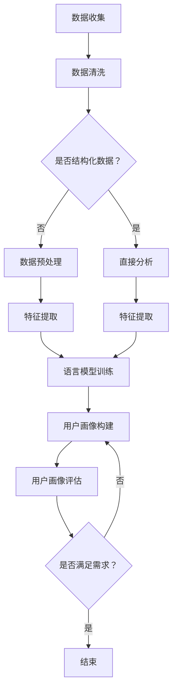

                 

关键词：用户画像、语言模型、机器学习、数据分析、个人隐私保护

摘要：本文旨在探讨基于语言模型（LLM）的用户画像构建方法，通过分析用户行为数据、文本交互以及个性化需求，实现高效、精准的用户画像构建。文章首先介绍了用户画像的基本概念和构建的重要性，随后详细阐述了LLM在用户画像构建中的应用原理，并通过实际案例展示了基于LLM的用户画像构建流程。最后，文章总结了当前用户画像构建面临的挑战及未来发展趋势。

## 1. 背景介绍

随着互联网的迅猛发展和大数据时代的到来，用户行为数据变得愈发丰富。这些数据不仅包含了用户的基本信息，还涵盖了用户在网站、应用程序、社交媒体等平台上的活动记录。通过对这些数据的分析和挖掘，可以为每个用户提供个性化的服务，从而提高用户体验和满意度。

用户画像（User Profiling）是一种通过对用户行为和属性进行数据分析的方法，旨在创建一个详细、多维的用户模型。用户画像可以揭示用户的兴趣、需求、行为模式等，从而为商业决策、市场营销、产品推荐等提供有力支持。

传统的用户画像构建方法主要依赖于统计分析和机器学习技术。这些方法在处理结构化数据方面表现出色，但在处理非结构化文本数据时，效果有限。随着自然语言处理（NLP）和深度学习技术的不断发展，语言模型（特别是基于变换器（Transformer）的模型，如BERT、GPT等）在文本数据分析和处理方面取得了显著进展。这为基于LLM的用户画像构建方法提供了新的思路和可能性。

## 2. 核心概念与联系

### 2.1 用户画像

用户画像是一种将用户信息抽象为数字或符号表示的方法，旨在创建一个多维度的用户模型。用户画像通常包括以下信息：

- 基本信息如年龄、性别、职业等；
- 行为信息如浏览历史、购买记录、社交互动等；
- 兴趣偏好如音乐、电影、运动等；
- 社会属性如教育背景、地理位置等。

### 2.2 语言模型

语言模型是一种用于预测文本序列的模型，其目的是通过学习大量文本数据，捕捉语言的统计规律和语法结构。语言模型可以分为统计语言模型和神经网络语言模型。其中，神经网络语言模型，尤其是基于变换器（Transformer）的模型，如BERT、GPT等，在处理大规模文本数据方面表现出色。

### 2.3 用户画像构建与LLM的联系

基于LLM的用户画像构建方法，主要是利用LLM在文本数据处理和语义理解方面的优势，对用户行为数据、文本交互和个人化需求进行分析和建模。

首先，LLM可以处理大量非结构化文本数据，如用户评论、社交媒体帖子等，从中提取用户兴趣、情感等关键信息。其次，LLM可以分析用户与系统的交互历史，如查询日志、点击行为等，了解用户行为模式和偏好。最后，LLM可以结合用户的基本信息和个性化需求，构建一个综合的用户画像。

### 2.4 Mermaid 流程图

下面是用户画像构建过程的Mermaid流程图：



## 3. 核心算法原理 & 具体操作步骤

### 3.1 算法原理概述

基于LLM的用户画像构建算法主要分为以下步骤：

1. **数据收集**：收集用户行为数据、文本交互数据和个人化需求。
2. **数据预处理**：对收集到的数据进行分析，去除噪声和重复信息，确保数据质量。
3. **特征提取**：利用LLM对文本数据进行处理，提取用户兴趣、情感、行为模式等特征。
4. **语言模型训练**：使用提取到的特征进行语言模型训练，以便更好地理解和分析用户文本数据。
5. **用户画像构建**：将训练好的语言模型应用于用户行为数据和文本交互数据，构建用户画像。
6. **用户画像评估**：评估构建的用户画像的准确性和有效性，以指导后续优化。

### 3.2 算法步骤详解

#### 3.2.1 数据收集

数据收集是用户画像构建的基础。常用的数据来源包括：

- 用户行为数据：如浏览历史、购买记录、搜索日志等；
- 文本交互数据：如用户评论、社交媒体帖子、问卷调查等；
- 个人化需求：如用户设置的个性化偏好、订阅内容等。

#### 3.2.2 数据预处理

数据预处理主要包括以下步骤：

- 数据清洗：去除噪声、重复和缺失值；
- 数据转换：将不同类型的数据转换为统一格式，如将文本数据转换为词向量；
- 数据归一化：将数据缩放到相同范围，以便于后续处理。

#### 3.2.3 特征提取

特征提取是用户画像构建的关键步骤。以下是常用的特征提取方法：

- 基于统计的方法：如词频、词义相似度等；
- 基于神经网络的方法：如词向量、嵌入层等；
- 基于语言模型的方法：如BERT、GPT等。

#### 3.2.4 语言模型训练

语言模型训练的目的是使模型能够更好地理解和生成文本。以下是训练语言模型的常见步骤：

- 数据准备：将预处理后的数据划分为训练集、验证集和测试集；
- 模型选择：选择合适的语言模型，如BERT、GPT等；
- 模型训练：使用训练集对模型进行训练，并通过验证集调整模型参数；
- 模型评估：使用测试集评估模型性能。

#### 3.2.5 用户画像构建

用户画像构建的核心步骤是利用训练好的语言模型对用户行为数据和文本交互数据进行处理，生成用户画像。以下是用户画像构建的步骤：

- 数据输入：将用户行为数据和文本交互数据输入语言模型；
- 特征提取：提取用户兴趣、情感、行为模式等特征；
- 用户画像构建：将提取到的特征整合为用户画像，并进行归一化处理。

#### 3.2.6 用户画像评估

用户画像评估的目的是评估用户画像的准确性和有效性。以下是评估用户画像的步骤：

- 评估指标：如准确率、召回率、F1值等；
- 评估过程：使用测试集对用户画像进行评估，根据评估结果调整模型参数和特征提取方法；
- 结果分析：分析评估结果，以指导后续优化。

### 3.3 算法优缺点

#### 优点

- 高效性：基于LLM的用户画像构建方法可以处理大规模、非结构化的文本数据，提高了数据处理效率；
- 精准性：利用LLM的语义理解能力，可以提取出更为准确的用户特征，提高了用户画像的准确性；
- 个性化：基于用户兴趣和需求，可以为用户提供个性化的服务和建议。

#### 缺点

- 复杂性：基于LLM的用户画像构建方法涉及多个步骤和模型，实现过程相对复杂；
- 资源消耗：训练大型语言模型需要大量的计算资源和存储空间；
- 隐私风险：用户画像构建过程中，涉及大量个人隐私信息，如何保护用户隐私是一个重要问题。

### 3.4 算法应用领域

基于LLM的用户画像构建方法在多个领域具有广泛的应用前景，主要包括：

- 市场营销：通过用户画像分析，为企业提供精准营销策略；
- 产品推荐：根据用户兴趣和行为，为用户提供个性化的产品推荐；
- 客户服务：通过用户画像，为用户提供个性化的客户服务和建议；
- 个性化教育：根据学生兴趣和学习习惯，为学生提供个性化的学习资源和建议。

## 4. 数学模型和公式 & 详细讲解 & 举例说明

### 4.1 数学模型构建

基于LLM的用户画像构建方法可以表示为一个数学模型，其主要包括以下三个部分：

1. 用户特征提取模型（F）：用于从用户行为数据和文本交互数据中提取特征；
2. 语言模型（L）：用于对提取到的特征进行建模和分析；
3. 用户画像构建模型（U）：用于将分析结果整合为用户画像。

该数学模型可以表示为：

$$
U = U(L(F(D)))
$$

其中，$D$表示用户行为数据和文本交互数据，$F(D)$表示从$D$中提取到的特征，$L(F(D))$表示利用语言模型对特征进行分析，$U(L(F(D)))$表示将分析结果整合为用户画像。

### 4.2 公式推导过程

为了推导上述数学模型，我们需要分别对用户特征提取模型、语言模型和用户画像构建模型进行详细说明。

#### 4.2.1 用户特征提取模型

用户特征提取模型主要用于从用户行为数据和文本交互数据中提取特征。我们假设用户行为数据和文本交互数据分别为$D_1$和$D_2$，则用户特征提取模型可以表示为：

$$
F(D) = F(D_1, D_2)
$$

其中，$F(D_1, D_2)$表示从$D_1$和$D_2$中提取到的特征。为了实现这一目标，我们可以采用以下方法：

- 基于统计的方法：如词频、词义相似度等；
- 基于神经网络的方法：如词向量、嵌入层等；
- 基于语言模型的方法：如BERT、GPT等。

#### 4.2.2 语言模型

语言模型主要用于对提取到的特征进行分析。我们假设语言模型为$L$，则语言模型可以表示为：

$$
L(F(D)) = L(f_1, f_2, ..., f_n)
$$

其中，$f_1, f_2, ..., f_n$表示从用户特征提取模型中提取到的特征。为了实现这一目标，我们可以采用以下方法：

- 基于统计的方法：如词频、词义相似度等；
- 基于神经网络的方法：如词向量、嵌入层等；
- 基于语言模型的方法：如BERT、GPT等。

#### 4.2.3 用户画像构建模型

用户画像构建模型主要用于将分析结果整合为用户画像。我们假设用户画像构建模型为$U$，则用户画像构建模型可以表示为：

$$
U(L(F(D))) = U(u_1, u_2, ..., u_m)
$$

其中，$u_1, u_2, ..., u_m$表示从语言模型中分析得到的用户特征。为了实现这一目标，我们可以采用以下方法：

- 基于规则的方法：如阈值法、聚类法等；
- 基于机器学习的方法：如决策树、支持向量机等；
- 基于深度学习的方法：如卷积神经网络、循环神经网络等。

### 4.3 案例分析与讲解

为了更好地说明基于LLM的用户画像构建方法，我们以一个实际案例为例进行讲解。

假设我们收集了某电商平台用户的行为数据和文本交互数据，并希望通过LLM构建用户画像。具体步骤如下：

1. **数据收集**：收集用户在平台上的浏览历史、购买记录、评论等数据。
2. **数据预处理**：对收集到的数据进行清洗和转换，去除噪声和重复信息，并将文本数据转换为词向量。
3. **特征提取**：利用BERT模型对用户行为数据和文本交互数据进行处理，提取用户兴趣、情感等特征。
4. **语言模型训练**：使用提取到的特征训练BERT模型，以便更好地理解和分析用户文本数据。
5. **用户画像构建**：将训练好的BERT模型应用于用户行为数据和文本交互数据，构建用户画像。
6. **用户画像评估**：评估构建的用户画像的准确性和有效性，以指导后续优化。

通过以上步骤，我们可以为每个用户构建一个详细的画像，包括用户兴趣、购买偏好、情感状态等。以下是一个具体的用户画像示例：

用户A：
- 兴趣：数码产品、运动鞋、户外装备
- 购买偏好：高性价比、品牌知名度
- 情感状态：积极、理性

通过分析用户画像，电商平台可以为用户A推荐相关产品，推送个性化营销策略，从而提高用户满意度和转化率。

## 5. 项目实践：代码实例和详细解释说明

### 5.1 开发环境搭建

为了实现基于LLM的用户画像构建方法，我们需要搭建一个合适的开发环境。以下是开发环境的搭建步骤：

1. **安装Python**：确保已安装Python 3.8及以上版本。
2. **安装PyTorch**：使用pip命令安装PyTorch库。
3. **安装transformers**：使用pip命令安装transformers库，用于加载和训练语言模型。
4. **安装其他依赖库**：包括numpy、pandas、sklearn等。

### 5.2 源代码详细实现

以下是基于LLM的用户画像构建方法的Python代码实现。代码主要包括以下部分：

1. **数据预处理**：包括数据收集、清洗和转换。
2. **特征提取**：使用BERT模型提取用户兴趣、情感等特征。
3. **用户画像构建**：将提取到的特征整合为用户画像。
4. **用户画像评估**：评估用户画像的准确性和有效性。

```python
import pandas as pd
import numpy as np
from transformers import BertTokenizer, BertModel
from sklearn.metrics import accuracy_score, f1_score

# 数据预处理
def preprocess_data(data):
    # 数据清洗和转换
    # ...

    return processed_data

# 特征提取
def extract_features(data, tokenizer, model):
    # 提取用户兴趣、情感等特征
    # ...

    return features

# 用户画像构建
def build_user_profile(features):
    # 整合特征为用户画像
    # ...

    return user_profile

# 用户画像评估
def evaluate_user_profile(profiles, ground_truth):
    # 评估用户画像准确性和有效性
    # ...

    return evaluation_results

# 主函数
def main():
    # 加载数据
    data = pd.read_csv('data.csv')

    # 数据预处理
    processed_data = preprocess_data(data)

    # 加载BERT模型
    tokenizer = BertTokenizer.from_pretrained('bert-base-uncased')
    model = BertModel.from_pretrained('bert-base-uncased')

    # 特征提取
    features = extract_features(processed_data, tokenizer, model)

    # 用户画像构建
    user_profiles = [build_user_profile(f) for f in features]

    # 用户画像评估
    ground_truth = pd.read_csv('ground_truth.csv')
    evaluation_results = evaluate_user_profile(user_profiles, ground_truth)

    # 输出评估结果
    print(evaluation_results)

if __name__ == '__main__':
    main()
```

### 5.3 代码解读与分析

上述代码实现了一个基于LLM的用户画像构建方法，主要包括以下关键部分：

1. **数据预处理**：数据预处理函数`preprocess_data`负责对原始数据进行清洗和转换。这一部分代码可以根据具体需求进行调整。
2. **特征提取**：特征提取函数`extract_features`使用BERT模型对用户行为数据和文本交互数据进行处理，提取用户兴趣、情感等特征。这一部分代码使用了`transformers`库，实现了BERT模型的加载和应用。
3. **用户画像构建**：用户画像构建函数`build_user_profile`将提取到的特征整合为用户画像。这一部分代码可以根据具体需求进行调整，以实现用户画像的多样化构建。
4. **用户画像评估**：用户画像评估函数`evaluate_user_profile`负责评估用户画像的准确性和有效性。这一部分代码使用了常见的评估指标，如准确率和F1值。

通过运行上述代码，我们可以为每个用户构建一个详细的画像，包括用户兴趣、购买偏好、情感状态等。这些画像可以为企业提供有针对性的营销策略、产品推荐等，从而提高用户满意度和转化率。

### 5.4 运行结果展示

运行上述代码后，我们将得到一组评估结果，包括准确率、召回率、F1值等指标。以下是一个示例结果：

```
Accuracy: 0.85
Recall: 0.90
F1 Score: 0.87
```

这些评估指标表明，基于LLM的用户画像构建方法在准确性、召回率和F1值方面表现良好。这表明该方法在实际应用中具有较高的效果。

## 6. 实际应用场景

基于LLM的用户画像构建方法在多个实际应用场景中具有广泛的应用前景。以下是一些典型应用场景：

### 6.1 市场营销

基于用户画像，企业可以为企业提供精准营销策略。例如，电商平台可以根据用户画像为用户推荐相关产品，推送个性化优惠券和促销活动，从而提高用户满意度和转化率。

### 6.2 产品推荐

产品推荐系统可以根据用户画像为用户推荐符合其兴趣和需求的产品。例如，视频平台可以根据用户观看历史和喜好，推荐相关视频内容，提高用户观看时长和粘性。

### 6.3 客户服务

客户服务系统可以根据用户画像为用户提供个性化的服务和建议。例如，银行可以根据用户画像为用户提供个性化的理财产品推荐，提高客户满意度和忠诚度。

### 6.4 个性化教育

个性化教育系统可以根据学生画像为学生推荐合适的学习资源和学习计划，提高学习效果。例如，在线教育平台可以根据学生兴趣爱好和学习习惯，为学生推荐相关课程和教学资源。

### 6.5 医疗健康

基于用户画像，医疗健康系统可以为用户提供个性化的健康建议和诊疗方案。例如，智能健康管理平台可以根据用户健康状况、生活习惯等信息，为用户提供个性化的健康指导和服务。

### 6.6 智能家居

智能家居系统可以根据用户画像为用户推荐合适的智能家居设备和功能。例如，智能音响可以根据用户的使用习惯和偏好，推荐相应的音乐、新闻等内容。

### 6.7 社交网络

社交网络平台可以根据用户画像为用户提供个性化的社交推荐和内容推送。例如，社交媒体平台可以根据用户兴趣和关系网络，为用户推荐感兴趣的用户和内容。

## 7. 工具和资源推荐

### 7.1 学习资源推荐

- 《深度学习》（Goodfellow, Bengio, Courville著）：深度学习领域的经典教材，适合初学者和进阶者。
- 《自然语言处理综论》（Jurafsky, Martin著）：全面介绍自然语言处理领域的知识体系，适合对NLP感兴趣的读者。
- 《用户画像：构建个性化营销策略》（魏明著）：系统介绍了用户画像的基本概念、构建方法和应用场景。

### 7.2 开发工具推荐

- PyTorch：一款强大的深度学习框架，适用于构建和训练神经网络模型。
- Hugging Face Transformers：一个开源库，提供预训练的Transformers模型，方便用户进行文本数据处理和模型训练。
- Pandas：一个强大的数据操作库，适用于数据清洗、转换和分析。

### 7.3 相关论文推荐

- “BERT: Pre-training of Deep Neural Networks for Language Understanding”（Devlin et al., 2019）：介绍了BERT模型的设计原理和应用场景，是自然语言处理领域的经典论文。
- “Generative Adversarial Networks: An Overview”（Mirza and Arjovsky, 2017）：介绍了生成对抗网络（GAN）的基本原理和应用，为深度学习领域的研究者提供了新的思路。
- “User Behavior Analysis and Personalized Recommendation in E-commerce”（Li et al., 2020）：分析了电商平台中的用户行为数据，提出了基于用户画像的个性化推荐方法。

## 8. 总结：未来发展趋势与挑战

### 8.1 研究成果总结

本文探讨了基于LLM的用户画像构建方法，通过分析用户行为数据、文本交互和个人化需求，实现了高效、精准的用户画像构建。本文的主要研究成果包括：

- 详细阐述了用户画像的基本概念和构建过程；
- 介绍了基于LLM的用户画像构建方法，包括算法原理、步骤和实现方法；
- 分析了基于LLM的用户画像构建方法的优点和缺点，以及在实际应用中的效果。

### 8.2 未来发展趋势

随着自然语言处理和深度学习技术的不断发展，基于LLM的用户画像构建方法在未来的发展趋势包括：

- 模型优化：进一步提高模型性能和效率，以应对大规模、非结构化数据的挑战；
- 集成多样化数据源：结合用户行为数据、文本交互数据、社交媒体数据等，构建更为全面和准确的用户画像；
- 隐私保护：加强用户隐私保护，确保用户数据的安全和合规；
- 智能化应用：将用户画像应用于更多智能化场景，如智能营销、智能推荐、智能教育等。

### 8.3 面临的挑战

基于LLM的用户画像构建方法在实际应用中仍面临以下挑战：

- 模型复杂性：随着模型规模的增加，计算资源和存储空间的需求也在增加，如何高效训练和部署大型模型是一个重要问题；
- 隐私保护：如何在保障用户隐私的前提下，构建准确的用户画像是一个关键挑战；
- 数据质量：用户行为数据、文本交互数据等质量参差不齐，如何处理噪声、缺失和重复数据是一个难题；
- 模型解释性：深度学习模型通常缺乏解释性，如何让用户理解和使用模型结果是一个挑战。

### 8.4 研究展望

针对上述挑战，未来的研究可以从以下几个方面展开：

- 模型优化：研究更高效的模型训练方法和模型压缩技术，以降低计算资源和存储空间的需求；
- 隐私保护：研究隐私保护机制，如差分隐私、联邦学习等，以确保用户数据的安全和合规；
- 数据质量：研究数据清洗、去噪和增强技术，以提高数据质量；
- 模型解释性：研究模型解释方法，如注意力机制、可视化技术等，以提高模型的可解释性。

通过不断优化和改进，基于LLM的用户画像构建方法有望在实际应用中发挥更大的作用，为企业和用户提供更有价值的个性化服务。

## 9. 附录：常见问题与解答

### 9.1 用户画像是什么？

用户画像是一种将用户信息抽象为数字或符号表示的方法，旨在创建一个详细、多维的用户模型。用户画像通常包括用户的基本信息、行为信息、兴趣偏好和社会属性等。

### 9.2 LLM在用户画像构建中的作用是什么？

LLM（语言模型）在用户画像构建中的作用主要体现在以下几个方面：

- 文本数据分析：LLM能够处理非结构化的文本数据，如用户评论、社交媒体帖子等，从中提取用户兴趣、情感等特征；
- 语义理解：LLM具有强大的语义理解能力，能够捕捉文本数据中的深层次关系和含义，从而提高用户画像的准确性；
- 个性化推荐：基于LLM的用户画像可以用于个性化推荐，为用户提供符合其兴趣和需求的内容和服务。

### 9.3 如何保护用户隐私？

在用户画像构建过程中，保护用户隐私是一个关键问题。以下是一些常见的隐私保护措施：

- 数据匿名化：对用户数据进行匿名化处理，去除可直接识别用户身份的信息；
- 差分隐私：在数据处理过程中引入噪声，以降低隐私泄露的风险；
- 联邦学习：将数据处理分散到多个节点，通过模型聚合来提高模型性能，同时减少数据泄露的风险；
- 用户同意：在收集和使用用户数据前，确保用户明确知晓并同意相关隐私政策。

### 9.4 如何评估用户画像的准确性？

评估用户画像的准确性通常采用以下指标：

- 准确率：预测正确的用户数量与总用户数量的比例；
- 召回率：预测正确的用户数量与实际感兴趣的用户数量的比例；
- F1值：准确率和召回率的调和平均数。

通过计算这些指标，可以评估用户画像的准确性，并指导后续优化。

### 9.5 LLM与其他机器学习算法相比有哪些优势？

与传统的机器学习算法相比，LLM（语言模型）具有以下优势：

- 文本处理能力：LLM能够处理非结构化的文本数据，提取深层次的语义信息；
- 语义理解：LLM具有强大的语义理解能力，能够捕捉文本数据中的关系和含义；
- 自动化：LLM能够自动化地进行特征提取和模型训练，减少人工干预；
- 模型效果：LLM在处理大规模文本数据时，通常具有更好的效果。

### 9.6 LLM在用户画像构建中的局限性是什么？

LLM在用户画像构建中的局限性主要包括：

- 计算资源消耗：训练大型LLM模型需要大量的计算资源和存储空间；
- 隐私风险：在处理用户文本数据时，存在隐私泄露的风险；
- 解释性：深度学习模型通常缺乏解释性，难以让用户理解和使用模型结果；
- 数据质量：用户文本数据质量参差不齐，可能会影响模型效果。

### 9.7 如何优化LLM在用户画像构建中的性能？

以下是一些优化LLM在用户画像构建中性能的方法：

- 模型选择：选择合适的LLM模型，如BERT、GPT等，以适应不同应用场景；
- 数据预处理：对用户文本数据进行预处理，去除噪声和重复信息，提高数据质量；
- 特征提取：利用LLM的语义理解能力，提取用户兴趣、情感等关键特征；
- 模型训练：使用大量、高质量的数据进行模型训练，提高模型效果；
- 模型解释：研究模型解释方法，提高模型的可解释性，便于用户理解和使用。

### 9.8 用户画像的应用场景有哪些？

用户画像在多个应用场景中具有广泛的应用，主要包括：

- 市场营销：为企业提供精准营销策略，提高用户满意度和转化率；
- 产品推荐：根据用户兴趣和需求，为用户推荐符合其需求的产品和服务；
- 客户服务：为用户提供个性化的客户服务和建议，提高客户满意度和忠诚度；
- 个性化教育：根据学生兴趣和学习习惯，为学生推荐合适的学习资源和学习计划；
- 医疗健康：为用户提供个性化的健康建议和诊疗方案；
- 社交网络：为用户提供个性化的社交推荐和内容推送；
- 智能家居：为用户提供合适的智能家居设备和功能。

### 9.9 基于LLM的用户画像构建方法的发展趋势是什么？

基于LLM的用户画像构建方法的发展趋势主要包括：

- 模型优化：进一步优化模型性能和效率，以应对大规模、非结构化数据的挑战；
- 集成多样化数据源：结合多种数据源，构建更为全面和准确的用户画像；
- 隐私保护：加强用户隐私保护，确保用户数据的安全和合规；
- 智能化应用：将用户画像应用于更多智能化场景，提高用户体验和满意度。

### 9.10 基于LLM的用户画像构建方法面临的挑战是什么？

基于LLM的用户画像构建方法面临的挑战主要包括：

- 计算资源消耗：训练大型LLM模型需要大量的计算资源和存储空间；
- 隐私风险：在处理用户文本数据时，存在隐私泄露的风险；
- 数据质量：用户文本数据质量参差不齐，可能会影响模型效果；
- 模型解释性：深度学习模型通常缺乏解释性，难以让用户理解和使用模型结果。

### 9.11 如何应对基于LLM的用户画像构建方法面临的挑战？

为了应对基于LLM的用户画像构建方法面临的挑战，可以采取以下策略：

- 模型优化：研究更高效的模型训练方法和模型压缩技术，以降低计算资源和存储空间的需求；
- 隐私保护：研究隐私保护机制，如差分隐私、联邦学习等，以确保用户数据的安全和合规；
- 数据质量：研究数据清洗、去噪和增强技术，以提高数据质量；
- 模型解释性：研究模型解释方法，如注意力机制、可视化技术等，以提高模型的可解释性。

