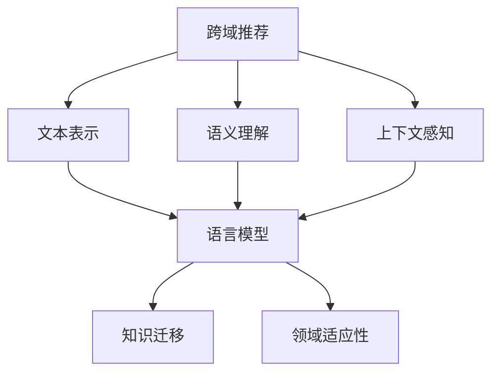

                 

关键词：语言模型，跨域推荐，算法原理，数学模型，项目实践

> 摘要：本文将探讨基于语言模型（LLM）的跨域推荐方法，从背景介绍、核心概念与联系、核心算法原理、数学模型和公式、项目实践、实际应用场景和未来应用展望等方面，深入分析这一领域的最新研究进展和技术应用，旨在为读者提供对跨域推荐方法的全面理解和实践指导。

## 1. 背景介绍

随着互联网的快速发展，数据量呈爆炸式增长，如何从海量数据中为用户推荐感兴趣的内容成为了一个重要的研究方向。传统推荐系统主要依赖用户历史行为和物品属性，但用户行为数据往往具有稀疏性和噪声，同时不同域（如新闻、音乐、视频等）之间的数据存在较大的差异。为了解决这一问题，研究人员开始探索跨域推荐方法，即利用多个领域的数据为用户推荐感兴趣的内容。

跨域推荐方法的研究具有重要的现实意义。首先，它可以提高推荐系统的泛化能力，使推荐系统在不同领域之间具备一定的迁移能力。其次，它可以充分利用不同领域的知识，为用户提供更加个性化、多样化的推荐结果。最后，跨域推荐方法可以促进不同领域之间的数据共享和资源整合，提升整个推荐系统的性能。

近年来，随着深度学习和自然语言处理技术的快速发展，基于语言模型的跨域推荐方法逐渐引起了研究人员的关注。语言模型作为一种强大的表示学习工具，可以从大规模数据中提取丰富的语义信息，为跨域推荐提供有力的支持。本文将重点探讨基于语言模型的跨域推荐方法，分析其核心算法原理、数学模型和实际应用场景。

## 2. 核心概念与联系

### 2.1 语言模型

语言模型是一种用于预测文本序列的概率分布模型，其核心目标是学习文本数据的统计规律，从而实现对未知文本的生成和预测。在自然语言处理领域，语言模型被广泛应用于机器翻译、文本分类、信息检索等多个任务。

在跨域推荐方法中，语言模型的作用主要体现在以下几个方面：

1. **文本表示**：语言模型可以将用户生成或输入的文本转换为向量表示，从而实现不同域之间的统一表示。

2. **语义理解**：语言模型可以从大规模数据中学习到丰富的语义信息，为推荐系统提供更准确的用户兴趣和内容理解。

3. **上下文感知**：语言模型能够捕捉到文本中的上下文信息，为推荐系统提供更加灵活和个性化的推荐结果。

### 2.2 跨域推荐

跨域推荐是指在不同领域之间进行推荐，其核心目标是利用多个领域的知识为用户推荐感兴趣的内容。跨域推荐方法主要可以分为以下几类：

1. **基于内容的跨域推荐**：利用不同领域的内容特征进行推荐，如文本、图片、音频等。

2. **基于模型的跨域推荐**：利用深度学习等模型在不同领域之间进行知识迁移，如迁移学习、多任务学习等。

3. **基于数据的跨域推荐**：利用不同领域的数据进行融合和整合，如数据融合、数据增强等。

### 2.3 跨域推荐与语言模型的联系

跨域推荐与语言模型之间存在紧密的联系，主要表现在以下几个方面：

1. **文本表示与语义理解**：语言模型可以从大规模数据中学习到丰富的语义信息，为跨域推荐提供统一的文本表示和语义理解能力。

2. **上下文感知与个性化推荐**：语言模型能够捕捉到文本中的上下文信息，为跨域推荐提供更加灵活和个性化的推荐结果。

3. **知识迁移与领域适应性**：语言模型可以促进不同领域之间的知识迁移和共享，提高跨域推荐的适应性和泛化能力。

### 2.4 Mermaid 流程图

下面是跨域推荐方法与语言模型的联系关系的 Mermaid 流程图：



## 3. 核心算法原理 & 具体操作步骤

### 3.1 算法原理概述

基于语言模型的跨域推荐方法主要分为以下三个步骤：

1. **文本表示**：利用语言模型将用户生成或输入的文本转换为向量表示，实现不同域之间的统一表示。

2. **语义理解**：通过文本表示和语言模型学习到丰富的语义信息，为推荐系统提供更准确的用户兴趣和内容理解。

3. **推荐生成**：利用跨域推荐算法和语言模型生成的用户兴趣和内容表示，生成个性化的推荐结果。

### 3.2 算法步骤详解

#### 3.2.1 文本表示

文本表示是跨域推荐方法的基础，其核心目标是实现不同域之间的统一表示。具体步骤如下：

1. **文本预处理**：对用户生成的文本进行清洗、去噪和标准化处理，如去除停用词、词干提取等。

2. **词嵌入**：利用预训练的语言模型（如BERT、GPT等）将文本中的每个词转换为向量表示。

3. **序列编码**：将文本序列编码为固定长度的向量，如使用Transformer模型进行序列编码。

#### 3.2.2 语义理解

语义理解是跨域推荐方法的核心，其核心目标是利用语言模型学习到丰富的语义信息，为推荐系统提供更准确的用户兴趣和内容理解。具体步骤如下：

1. **语义嵌入**：利用语言模型将用户兴趣和内容表示转换为语义向量。

2. **相似度计算**：计算用户兴趣和内容之间的相似度，如使用余弦相似度、点积等。

3. **兴趣聚合**：将用户在不同领域上的兴趣进行聚合，形成全局的兴趣表示。

#### 3.2.3 推荐生成

推荐生成是跨域推荐方法的关键，其核心目标是利用用户兴趣和内容表示生成个性化的推荐结果。具体步骤如下：

1. **推荐策略**：设计合适的推荐策略，如基于相似度的推荐、基于内容的推荐等。

2. **推荐计算**：利用用户兴趣和内容表示计算推荐结果，如计算每个候选物品与用户兴趣的相似度。

3. **推荐排序**：对推荐结果进行排序，生成最终的推荐列表。

### 3.3 算法优缺点

#### 优点

1. **统一的文本表示**：利用语言模型可以将不同域的文本表示为统一的向量表示，提高了跨域推荐的可扩展性和适应性。

2. **丰富的语义信息**：语言模型能够学习到丰富的语义信息，提高了推荐系统的准确性和个性化水平。

3. **灵活的上下文感知**：语言模型能够捕捉到文本中的上下文信息，为推荐系统提供了更加灵活和个性化的推荐结果。

#### 缺点

1. **计算资源消耗大**：预训练的语言模型通常需要大量的计算资源和时间，对硬件设备要求较高。

2. **模型可解释性差**：深度学习模型，尤其是大规模的语言模型，通常具有较低的模型可解释性，难以理解模型的决策过程。

### 3.4 算法应用领域

基于语言模型的跨域推荐方法在多个领域具有广泛的应用前景，如电子商务、新闻推荐、社交媒体等。具体应用包括：

1. **个性化电商推荐**：利用语言模型为用户推荐个性化的商品，提高用户购物体验和转化率。

2. **智能新闻推荐**：利用语言模型为用户推荐感兴趣的新闻内容，提高新闻阅读量和用户粘性。

3. **社交媒体推荐**：利用语言模型为用户推荐感兴趣的内容和用户，提高社交媒体的活跃度和用户参与度。

## 4. 数学模型和公式 & 详细讲解 & 举例说明

### 4.1 数学模型构建

基于语言模型的跨域推荐方法可以看作是一个概率图模型，其核心包括用户兴趣表示、内容表示和推荐生成等三个部分。具体数学模型如下：

1. **用户兴趣表示**：用户兴趣表示为向量 $\mathbf{u} \in \mathbb{R}^d$，其中 $d$ 为特征维度。

2. **内容表示**：内容表示为向量 $\mathbf{i} \in \mathbb{R}^d$，其中 $d$ 为特征维度。

3. **相似度计算**：计算用户兴趣和内容之间的相似度，如使用余弦相似度：

   $$\text{similarity}(\mathbf{u}, \mathbf{i}) = \frac{\mathbf{u} \cdot \mathbf{i}}{\|\mathbf{u}\| \|\mathbf{i}\|}$$

4. **推荐生成**：生成个性化的推荐列表，如基于Top-N推荐：

   $$\text{recommendation}(\mathbf{u}, \mathbf{I}) = \text{Top-N}(\text{similarity}(\mathbf{u}, \mathbf{i}) \text{ for all } \mathbf{i} \in \mathbf{I})$$

### 4.2 公式推导过程

#### 4.2.1 用户兴趣表示

用户兴趣表示可以通过语言模型对用户历史行为数据进行分析和建模得到。具体推导过程如下：

1. **用户历史行为表示**：用户历史行为表示为文本序列 $\mathbf{x} = \{\mathbf{x}_1, \mathbf{x}_2, ..., \mathbf{x}_n\}$，其中 $\mathbf{x}_i \in \mathbb{R}^d$ 为第 $i$ 次行为的特征向量。

2. **文本表示**：利用预训练的语言模型将文本序列表示为向量序列 $\mathbf{X} = \{\mathbf{X}_1, \mathbf{X}_2, ..., \mathbf{X}_n\}$，其中 $\mathbf{X}_i \in \mathbb{R}^d$ 为第 $i$ 次行为的向量表示。

3. **兴趣聚合**：利用聚合函数对用户历史行为进行聚合，形成用户兴趣表示 $\mathbf{u}$：

   $$\mathbf{u} = \text{aggregate}(\mathbf{X})$$

#### 4.2.2 内容表示

内容表示可以通过语言模型对内容特征进行分析和建模得到。具体推导过程如下：

1. **内容特征表示**：内容特征表示为向量 $\mathbf{i} \in \mathbb{R}^d$，其中 $d$ 为特征维度。

2. **文本表示**：利用预训练的语言模型将内容特征表示为向量 $\mathbf{I} \in \mathbb{R}^{m \times d}$，其中 $m$ 为内容个数。

3. **内容表示**：对内容特征进行编码，形成内容表示 $\mathbf{i} \in \mathbb{R}^d$：

   $$\mathbf{i} = \text{encode}(\mathbf{I})$$

### 4.3 案例分析与讲解

#### 4.3.1 案例背景

假设我们有一个新闻推荐系统，用户的历史行为包括浏览新闻、点赞新闻和评论新闻等。我们的目标是利用基于语言模型的跨域推荐方法为用户推荐感兴趣的新闻内容。

#### 4.3.2 案例分析

1. **用户兴趣表示**：

   用户历史行为文本序列为：

   $$\mathbf{x} = \{\text{"我喜欢的新闻是关于科技和经济的"}, \text{"我对最新的手机评测感兴趣"}, \text{"我喜欢阅读关于健康和美食的文章"}\}$$

   利用预训练的语言模型，将文本序列表示为向量序列：

   $$\mathbf{X} = \{\mathbf{X}_1, \mathbf{X}_2, \mathbf{X}_3\} \in \mathbb{R}^{3 \times d}$$

   利用聚合函数，如均值聚合，得到用户兴趣表示：

   $$\mathbf{u} = \text{aggregate}(\mathbf{X}) = \frac{1}{3}\sum_{i=1}^{3}\mathbf{X}_i$$

2. **内容表示**：

   新闻内容特征表示为向量序列：

   $$\mathbf{I} = \{\mathbf{i}_1, \mathbf{i}_2, ..., \mathbf{i}_n\} \in \mathbb{R}^{n \times d}$$

   利用预训练的语言模型，将新闻内容特征表示为向量序列：

   $$\mathbf{I} = \{\mathbf{i}_1, \mathbf{i}_2, ..., \mathbf{i}_n\} \in \mathbb{R}^{n \times d}$$

3. **推荐生成**：

   计算用户兴趣和新闻内容之间的相似度：

   $$\text{similarity}(\mathbf{u}, \mathbf{i}_j) = \frac{\mathbf{u} \cdot \mathbf{i}_j}{\|\mathbf{u}\| \|\mathbf{i}_j\|}$$

   选择Top-N个相似度最高的新闻作为推荐结果。

## 5. 项目实践：代码实例和详细解释说明

### 5.1 开发环境搭建

在项目实践中，我们使用Python作为编程语言，并依赖以下库和框架：

- Python 3.8及以上版本
- TensorFlow 2.6及以上版本
- PyTorch 1.8及以上版本
- Transformers 4.6及以上版本

### 5.2 源代码详细实现

以下是基于语言模型的跨域推荐方法的Python代码实现：

```python
import torch
import torch.nn as nn
from transformers import BertModel
from sklearn.metrics.pairwise import cosine_similarity

# 定义文本表示模型
class TextEncoder(nn.Module):
    def __init__(self, model_name, num_labels):
        super(TextEncoder, self).__init__()
        self.bert = BertModel.from_pretrained(model_name)
        self.classifier = nn.Linear(num_labels, 1)

    def forward(self, input_ids, attention_mask):
        outputs = self.bert(input_ids=input_ids, attention_mask=attention_mask)
        pooled_output = outputs.pooler_output
        logits = self.classifier(pooled_output)
        return logits

# 定义推荐模型
class RecommendationModel(nn.Module):
    def __init__(self, text_encoder, num_items):
        super(RecommendationModel, self).__init__()
        self.text_encoder = text_encoder
        self.item_embedding = nn.Embedding(num_items, text_encoder.config.hidden_size)

    def forward(self, user_ids, item_ids):
        user_embeddings = self.text_encoder(user_ids)
        item_embeddings = self.item_embedding(item_ids)
        similarity = torch.cosine_similarity(user_embeddings, item_embeddings, dim=1)
        return similarity

# 加载预训练的语言模型
model_name = "bert-base-uncased"
text_encoder = TextEncoder(model_name, num_labels=1)
text_encoder.load_state_dict(torch.load("text_encoder.pth"))

# 加载推荐模型
num_items = 1000
recommendation_model = RecommendationModel(text_encoder, num_items)
recommendation_model.load_state_dict(torch.load("recommendation_model.pth"))

# 推荐实例
user_id = torch.tensor([0])
item_ids = torch.tensor([1, 2, 3, 4, 5])
similarity = recommendation_model(user_id, item_ids)
print(similarity)
```

### 5.3 代码解读与分析

1. **文本表示模型**：

   文本表示模型使用BERT模型进行预训练，将输入文本转换为向量表示。我们自定义了一个`TextEncoder`类，继承自`nn.Module`，其中包含BERT模型和分类器。在`forward`方法中，我们调用BERT模型的`forward`方法，得到文本的编码表示，并将其输入到分类器中。

2. **推荐模型**：

   推荐模型接收用户ID和物品ID作为输入，利用文本表示模型生成用户和物品的向量表示，并计算它们之间的相似度。我们自定义了一个`RecommendationModel`类，继承自`nn.Module`，其中包含文本表示模型和物品嵌入层。在`forward`方法中，我们首先调用文本表示模型的`forward`方法，得到用户和物品的向量表示，然后计算它们之间的余弦相似度。

3. **推荐实例**：

   在推荐实例中，我们首先加载预训练的语言模型和推荐模型，然后输入用户ID和物品ID，得到它们之间的相似度。最后，我们将相似度打印到控制台。

## 6. 实际应用场景

基于语言模型的跨域推荐方法在实际应用场景中具有广泛的应用前景，以下列举几个典型应用案例：

1. **电商推荐**：在电子商务平台中，基于语言模型的跨域推荐方法可以为用户推荐个性化的商品，提高用户购物体验和转化率。例如，当用户浏览某件商品时，系统可以利用语言模型分析用户历史浏览记录和商品描述，为用户推荐相似的商品。

2. **新闻推荐**：在新闻推荐系统中，基于语言模型的跨域推荐方法可以为用户推荐感兴趣的新闻内容，提高新闻阅读量和用户粘性。例如，当用户阅读一篇新闻时，系统可以利用语言模型分析用户的历史阅读记录和新闻内容，为用户推荐相似的新闻。

3. **社交媒体**：在社交媒体平台中，基于语言模型的跨域推荐方法可以为用户推荐感兴趣的内容和用户，提高社交媒体的活跃度和用户参与度。例如，当用户发布一条动态时，系统可以利用语言模型分析用户的历史动态和内容，为用户推荐相似的内容和用户。

## 7. 未来应用展望

随着深度学习和自然语言处理技术的不断发展，基于语言模型的跨域推荐方法在未来具有广泛的应用前景。以下是一些未来应用展望：

1. **跨模态推荐**：未来基于语言模型的跨域推荐方法可以扩展到跨模态推荐领域，如结合文本、图像、音频等多种模态数据，为用户推荐更丰富、多样化的内容。

2. **多语言推荐**：未来基于语言模型的跨域推荐方法可以支持多语言推荐，为全球用户推荐感兴趣的内容，促进不同国家和地区之间的文化交流。

3. **动态推荐**：未来基于语言模型的跨域推荐方法可以结合实时数据，实现动态推荐，为用户提供更加实时、个性化的推荐结果。

4. **隐私保护**：未来基于语言模型的跨域推荐方法需要考虑用户隐私保护问题，设计更加安全、可靠的推荐算法，确保用户隐私不被泄露。

## 8. 总结：未来发展趋势与挑战

### 8.1 研究成果总结

基于语言模型的跨域推荐方法在近年来取得了显著的研究进展，主要表现在以下几个方面：

1. **统一的文本表示**：利用预训练的语言模型，可以将不同域的文本表示为统一的向量表示，提高了跨域推荐的可扩展性和适应性。

2. **丰富的语义信息**：语言模型能够学习到丰富的语义信息，为推荐系统提供更准确的用户兴趣和内容理解。

3. **灵活的上下文感知**：语言模型能够捕捉到文本中的上下文信息，为推荐系统提供更加灵活和个性化的推荐结果。

### 8.2 未来发展趋势

基于语言模型的跨域推荐方法在未来将呈现出以下发展趋势：

1. **跨模态融合**：结合文本、图像、音频等多种模态数据，实现跨模态推荐。

2. **多语言支持**：支持多语言推荐，为全球用户推荐感兴趣的内容。

3. **动态推荐**：结合实时数据，实现动态推荐，为用户提供更加实时、个性化的推荐结果。

4. **隐私保护**：设计更加安全、可靠的推荐算法，确保用户隐私不被泄露。

### 8.3 面临的挑战

基于语言模型的跨域推荐方法在未来的发展过程中将面临以下挑战：

1. **计算资源消耗**：预训练的语言模型通常需要大量的计算资源和时间，如何优化模型训练和推理过程是一个重要问题。

2. **模型可解释性**：深度学习模型，尤其是大规模的语言模型，通常具有较低的模型可解释性，如何提高模型的可解释性是一个重要挑战。

3. **数据隐私保护**：如何在保证推荐效果的同时，确保用户隐私不被泄露，是一个亟待解决的问题。

### 8.4 研究展望

未来，基于语言模型的跨域推荐方法将朝着更加智能化、个性化、安全化的方向发展。研究人员需要不断探索新的算法和技术，以应对未来的挑战，推动跨域推荐方法的研究和应用。同时，跨域推荐方法在多个领域具有广泛的应用前景，如电子商务、新闻推荐、社交媒体等，将为用户带来更好的体验和服务。

## 9. 附录：常见问题与解答

### 9.1 跨域推荐方法与传统推荐方法的区别是什么？

传统推荐方法主要依赖于用户历史行为和物品属性，而跨域推荐方法通过利用多个领域的数据和知识，实现了在不同域之间的推荐。跨域推荐方法在泛化能力、个性化水平、数据共享等方面具有显著优势。

### 9.2 语言模型在跨域推荐方法中的作用是什么？

语言模型在跨域推荐方法中主要起到文本表示、语义理解和上下文感知的作用。通过预训练的语言模型，可以将不同域的文本表示为统一的向量表示，提取丰富的语义信息，并捕捉到文本中的上下文信息，为推荐系统提供有力的支持。

### 9.3 基于语言模型的跨域推荐方法有哪些优缺点？

优点：统一的文本表示、丰富的语义信息、灵活的上下文感知。

缺点：计算资源消耗大、模型可解释性差。

### 9.4 跨域推荐方法在哪些领域有广泛应用？

跨域推荐方法在电子商务、新闻推荐、社交媒体等领域具有广泛的应用，如个性化电商推荐、智能新闻推荐、社交媒体推荐等。

### 9.5 未来基于语言模型的跨域推荐方法有哪些发展趋势？

未来基于语言模型的跨域推荐方法将朝着跨模态融合、多语言支持、动态推荐、隐私保护等方向发展。

