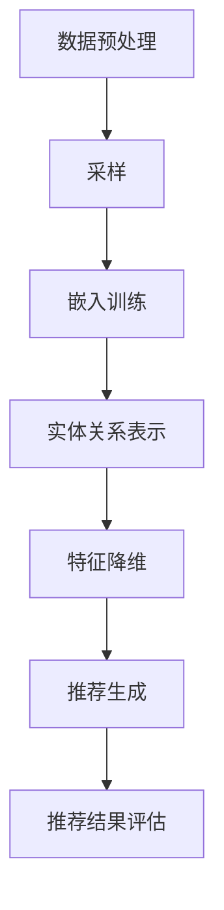

                 

关键词：图嵌入，商品推荐系统，大规模数据处理，机器学习，深度学习，协同过滤，个性化推荐

## 摘要

本文旨在探讨基于图嵌入技术构建的大规模商品推荐系统的原理、实现方法和应用场景。我们将首先介绍图嵌入技术及其在推荐系统中的重要作用，然后详细阐述推荐系统的核心算法原理，包括协同过滤和深度学习模型的结合。此外，本文还将通过具体的数学模型和代码实例，展示如何在实际项目中应用这些算法。最后，我们将讨论推荐系统在实际应用中的挑战和未来发展趋势。

## 1. 背景介绍

在电子商务和社交媒体的快速发展下，如何有效地为用户推荐感兴趣的商品或内容已经成为了一个重要的研究领域。传统的基于内容的推荐系统和协同过滤推荐系统在处理大规模数据时存在诸多局限性，例如难以处理稀疏数据和高维度特征、推荐结果容易陷入“物以类聚”的问题等。

近年来，图嵌入技术作为一种新兴的方法，因其能够将实体和关系转化为高维稠密向量，从而有效处理稀疏数据和捕获复杂的交互关系，被广泛应用于推荐系统的构建。图嵌入不仅可以用于传统的用户-物品推荐，还可以应用于跨领域的知识图谱推荐，如用户-商品-品牌等多重关系的推荐。

本文将围绕图嵌入技术，探讨如何将其应用于大规模商品推荐系统，以提高推荐效果和用户满意度。

### 1.1 商品推荐系统的现状与挑战

目前，商品推荐系统已经成为电子商务和社交媒体平台的重要组成部分。常见的推荐系统方法包括基于内容的推荐（Content-Based Filtering）和协同过滤（Collaborative Filtering）。

基于内容的推荐方法通过分析用户历史行为和物品的特征信息，为用户推荐与其兴趣相似的商品。这种方法在处理高度结构化的数据时表现较好，但在面对大规模稀疏数据集时，其推荐效果往往不理想。

协同过滤方法通过分析用户之间的行为相似性来推荐商品，可分为基于用户的协同过滤（User-Based）和基于模型的协同过滤（Model-Based）。基于用户的协同过滤通过计算用户之间的相似度来推荐商品，但用户数量的增加会导致计算复杂度急剧上升。基于模型的协同过滤通过构建预测模型来预测用户对物品的兴趣，但模型训练和预测过程需要大量的计算资源和时间。

尽管上述方法在一定程度上解决了推荐问题，但在实际应用中仍面临诸多挑战：

1. **稀疏数据问题**：用户-物品交互数据往往非常稀疏，导致推荐系统的准确性受到影响。
2. **高维度特征问题**：在处理高维度特征时，传统的机器学习算法难以有效处理，容易出现过拟合问题。
3. **冷启动问题**：对于新用户或新物品，由于缺乏足够的历史交互数据，传统的推荐方法难以生成有效的推荐结果。
4. **推荐结果多样性问题**：单一推荐方法容易导致推荐结果趋同，缺乏多样性，无法满足用户的个性化需求。

### 1.2 图嵌入技术及其在推荐系统中的应用

图嵌入（Graph Embedding）是一种将图结构中的节点和边映射到低维向量空间的技术。通过图嵌入，可以将复杂的图结构转化为高维稠密向量，从而方便进行后续的机器学习算法分析和处理。图嵌入技术在推荐系统中的应用主要体现在以下几个方面：

1. **捕获复杂关系**：图嵌入技术能够将用户、物品、品牌等实体及其之间的关系映射到低维向量空间，从而捕捉复杂的交互关系，如用户-物品、用户-品牌、物品-品牌等。
2. **稀疏数据表示**：通过图嵌入技术，可以将稀疏的用户-物品交互数据转化为高维稠密向量，从而减少数据稀疏性对推荐效果的影响。
3. **高维度特征降维**：图嵌入技术能够将高维度特征降维到低维向量空间，从而降低计算复杂度，提高推荐效率。
4. **跨领域推荐**：图嵌入技术可以应用于跨领域的知识图谱推荐，如将用户在电商平台的购物行为与社交媒体上的行为关联起来，实现跨平台的个性化推荐。

综上所述，图嵌入技术在推荐系统中的应用，不仅能够解决传统推荐方法面临的稀疏数据、高维度特征、冷启动和推荐结果多样性等问题，还能为用户提供更加个性化和精准的推荐服务。

## 2. 核心概念与联系

### 2.1 图嵌入基本概念

图嵌入是一种将图中的节点（或边）映射到高维向量空间的技术。在这个过程中，图结构中的节点和边会被编码为低维向量，从而便于后续的机器学习算法处理。图嵌入技术主要涉及以下概念：

- **节点**：图中的每一个实体，如用户、物品、品牌等。
- **边**：连接两个节点的元素，表示节点之间的关系，如用户购买物品、用户关注品牌等。
- **图**：由节点和边组成的网络结构，用于表示实体及其关系。
- **嵌入向量**：将图中的节点映射到高维向量空间的结果，用于表示节点的特征。

### 2.2 图嵌入技术原理

图嵌入技术的基本原理是将图中的节点或边表示为低维向量，从而便于进行后续的机器学习算法处理。常见的图嵌入算法包括：

- **节点嵌入**：将图中的每个节点映射到一个低维向量，使得节点间的相似度可以通过向量间的距离来度量。节点嵌入常用的算法有 DeepWalk、Node2Vec、GloVe 等。
- **边嵌入**：将图中的每条边映射到一个低维向量，从而表示边的关系强度。边嵌入通常用于处理带有标签的图，常用的算法有 Skip-Gram、LINE（Linear Models for Non-negative Embeddings）等。

图嵌入技术的基本流程如下：

1. **图预处理**：对原始图进行清洗、去重等预处理操作，确保图结构的质量。
2. **采样**：从预处理后的图中随机采样路径或子图，用于生成图嵌入模型的学习数据。
3. **嵌入训练**：使用随机游走（Random Walk）等方法，对采样得到的路径或子图进行训练，生成节点的低维嵌入向量。
4. **嵌入评估**：通过评估指标（如节点分类准确率、链接预测准确率等）来评估图嵌入模型的质量。

### 2.3 图嵌入与推荐系统的联系

图嵌入技术在推荐系统中的应用，主要体现在以下几个方面：

- **实体关系表示**：通过图嵌入技术，可以将用户、物品、品牌等实体及其关系映射到低维向量空间，从而实现实体关系的有效表示。
- **特征降维**：图嵌入技术能够将高维特征降维到低维向量空间，从而降低计算复杂度，提高推荐效率。
- **异构图处理**：图嵌入技术能够处理异构图（即图中的节点和边具有不同类型），从而实现跨领域的推荐。
- **图结构利用**：通过图嵌入技术，可以更好地利用图结构中的信息，如节点间的相似度、路径长度等，从而提高推荐效果。

### 2.4 Mermaid 流程图

下面是图嵌入技术在推荐系统中应用的 Mermaid 流程图，展示了从数据预处理到嵌入训练再到推荐生成的全过程。



在这个流程图中，数据预处理步骤包括清洗、去重等操作；采样步骤用于生成训练数据；嵌入训练步骤通过图嵌入算法生成嵌入向量；实体关系表示步骤将实体及其关系表示为低维向量；特征降维步骤用于降低高维特征的维度；推荐生成步骤根据嵌入向量生成推荐结果；推荐结果评估步骤用于评估推荐效果。

## 3. 核心算法原理 & 具体操作步骤

### 3.1 算法原理概述

基于图嵌入的大规模商品推荐系统主要依赖两种核心算法：协同过滤（Collaborative Filtering）和深度学习（Deep Learning）。协同过滤算法通过分析用户之间的相似性进行推荐，而深度学习算法则通过学习用户和物品的复杂特征，提供更加个性化的推荐结果。结合图嵌入技术，可以进一步优化这两个算法的性能。

#### 3.1.1 协同过滤算法

协同过滤算法分为基于用户的协同过滤（User-Based）和基于模型的协同过滤（Model-Based）。

- **基于用户的协同过滤**：通过计算用户之间的相似性，找到与目标用户相似的其他用户，推荐这些用户喜欢的商品。相似性通常通过用户之间的共同评分计算，可以使用余弦相似度、皮尔逊相关系数等方法。
- **基于模型的协同过滤**：通过机器学习算法（如矩阵分解、聚类等）构建用户和物品的预测模型，预测用户对未评分物品的兴趣。这种方法的优点是能够处理缺失数据，但需要大量的训练数据。

#### 3.1.2 深度学习算法

深度学习算法通过多层神经网络学习用户和物品的复杂特征，从而提供更加个性化的推荐结果。常见的深度学习算法包括：

- **深度神经网络（DNN）**：通过多层全连接神经网络学习用户和物品的特征表示，预测用户对物品的兴趣。
- **卷积神经网络（CNN）**：在推荐系统中，卷积神经网络可以用于处理图像等非结构化数据，但通常不适用于处理用户-物品交互数据。
- **循环神经网络（RNN）**：如长短时记忆网络（LSTM）、门控循环单元（GRU）等，可以用于处理序列数据，如用户的历史行为序列。
- **图神经网络（GNN）**：通过学习图结构中的节点和边的关系，捕获复杂的用户-物品交互关系，如图卷积网络（GCN）。

#### 3.1.3 图嵌入与协同过滤和深度学习结合

结合图嵌入技术，可以将用户、物品和图嵌入向量作为输入，构建深度学习模型。图嵌入向量不仅可以表示用户和物品的特征，还可以捕获它们之间的复杂关系。

- **基于图嵌入的协同过滤**：通过将用户和物品的图嵌入向量作为输入，计算它们之间的相似性，生成推荐列表。
- **基于图嵌入的深度学习模型**：将用户、物品和图嵌入向量作为输入，构建深度神经网络或图神经网络，预测用户对物品的兴趣。

### 3.2 算法步骤详解

下面将详细介绍基于图嵌入的大规模商品推荐系统的具体实现步骤。

#### 3.2.1 数据预处理

1. **数据采集**：从电商平台或社交媒体平台获取用户-物品交互数据，包括用户ID、物品ID、评分、购买时间等。
2. **数据清洗**：去除重复数据、异常数据和噪声数据，保证数据质量。
3. **数据归一化**：对评分进行归一化处理，如将其映射到0-1范围。

#### 3.2.2 图嵌入

1. **构建图**：根据用户-物品交互数据，构建用户-物品交互图。图的节点为用户和物品，边表示用户对物品的评分或购买行为。
2. **选择图嵌入算法**：选择适合的图嵌入算法，如 Node2Vec、DeepWalk 等，对图进行嵌入。
3. **训练嵌入模型**：使用采样到的子图或路径进行训练，生成用户和物品的嵌入向量。

#### 3.2.3 构建推荐模型

1. **选择深度学习模型**：根据需求选择适合的深度学习模型，如 DNN、GCN 等。
2. **数据预处理**：将用户和物品的嵌入向量作为输入，进行数据预处理，如归一化、标准化等。
3. **模型训练**：使用训练数据训练深度学习模型，得到用户和物品的特征表示。

#### 3.2.4 推荐生成

1. **计算相似性**：对于每个用户，计算其与其他用户的相似性，可以使用基于嵌入向量的余弦相似度。
2. **生成推荐列表**：根据用户相似性，为每个用户生成推荐列表，推荐相似用户喜欢的物品。

#### 3.2.5 推荐结果评估

1. **评估指标**：选择合适的评估指标，如准确率、召回率、覆盖率等。
2. **评估推荐结果**：使用评估指标对推荐结果进行评估，根据评估结果调整模型参数或算法策略。

### 3.3 算法优缺点

#### 优点

- **高维特征降维**：图嵌入技术可以将高维特征降维到低维向量空间，降低计算复杂度，提高推荐效率。
- **捕获复杂关系**：通过图嵌入技术，可以捕捉用户、物品和品牌等实体之间的复杂关系，提供更加个性化的推荐结果。
- **适用于大规模数据**：图嵌入技术适用于大规模稀疏数据集，可以处理海量用户和物品的交互数据。

#### 缺点

- **计算资源消耗**：图嵌入技术需要大量的计算资源进行训练和推理，尤其是在大规模数据集上。
- **模型调优难度大**：深度学习模型和图嵌入技术的结合，需要针对不同数据集进行大量的模型调优，提高推荐效果。

### 3.4 算法应用领域

基于图嵌入的大规模商品推荐系统可以应用于多个领域：

- **电子商务**：为电商平台提供个性化商品推荐，提高用户购买转化率和用户满意度。
- **社交媒体**：为社交媒体平台提供个性化内容推荐，提高用户活跃度和留存率。
- **金融领域**：为金融平台提供个性化理财产品推荐，提高用户投资收益。
- **教育领域**：为在线教育平台提供个性化课程推荐，提高学习效果。

## 4. 数学模型和公式 & 详细讲解 & 举例说明

### 4.1 数学模型构建

在基于图嵌入的商品推荐系统中，数学模型主要包括图嵌入模型的构建和深度学习推荐模型的构建。以下是这些模型的数学表示：

#### 4.1.1 图嵌入模型

假设图 $G = (V, E)$ 是一个包含节点集合 $V$ 和边集合 $E$ 的无向图。每个节点 $v \in V$ 被嵌入到一个 $d$ 维向量空间中，记为 $x_v \in \mathbb{R}^d$。

1. **节点嵌入向量**：

   $$
   x_v = \text{node\_embedding}(v)
   $$

2. **边嵌入向量**：

   对于每条边 $e = (u, v) \in E$，可以计算其嵌入向量 $x_e$，通常使用节点嵌入向量的组合表示：

   $$
   x_e = x_u + x_v
   $$

#### 4.1.2 深度学习推荐模型

假设我们已经得到了用户 $u$ 和物品 $i$ 的嵌入向量 $x_u$ 和 $x_i$。深度学习推荐模型的目标是预测用户 $u$ 对物品 $i$ 的兴趣分数 $r(u, i)$。

1. **全连接神经网络（DNN）**：

   $$
   r(u, i) = \sigma(W_1 x_u + W_2 x_i + b)
   $$

   其中，$W_1$ 和 $W_2$ 是权重矩阵，$b$ 是偏置项，$\sigma$ 是激活函数，通常使用 sigmoid 函数。

2. **图卷积神经网络（GCN）**：

   $$
   r(u, i) = \sigma(\sum_{v \in \mathcal{N}(i)} W_v x_v + b)
   $$

   其中，$\mathcal{N}(i)$ 是物品 $i$ 的邻居节点集合，$W_v$ 是图卷积权重矩阵。

### 4.2 公式推导过程

以下是图嵌入模型和深度学习推荐模型的推导过程：

#### 4.2.1 图嵌入模型推导

图嵌入模型通常基于随机游走（Random Walk）算法，其目标是优化节点嵌入向量的目标函数。目标函数可以表示为：

$$
\min_{\{x_v\}} \sum_{v \in V} \sum_{u \in \mathcal{N}(v)} \alpha(v) \cdot \frac{1}{||x_v - x_u||} + \lambda ||x_v||
$$

其中，$\alpha(v)$ 是节点 $v$ 的权重，通常设置为 1；$\lambda$ 是正则化参数，用于平衡节点嵌入向量的长度。

通过对目标函数进行优化，可以得到节点 $v$ 的嵌入向量：

$$
x_v = \arg \min_{x_v} \sum_{u \in \mathcal{N}(v)} \alpha(v) \cdot \frac{1}{||x_v - x_u||} + \lambda ||x_v||
$$

在优化过程中，通常使用梯度下降算法进行迭代更新：

$$
x_{v}^{t+1} = x_{v}^{t} - \alpha \cdot \nabla_{x_v} L(x_v)
$$

其中，$L(x_v)$ 是目标函数，$\nabla_{x_v} L(x_v)$ 是对 $x_v$ 的梯度。

#### 4.2.2 深度学习推荐模型推导

深度学习推荐模型的目标是预测用户 $u$ 对物品 $i$ 的兴趣分数。在图嵌入模型的基础上，我们可以构建全连接神经网络（DNN）或图卷积神经网络（GCN）。

1. **DNN 推荐模型**：

   DNN 推荐模型的目标是最小化预测误差：

   $$
   \min_{W_1, W_2, b} \sum_{(u, i) \in D} (r(u, i) - \sigma(W_1 x_u + W_2 x_i + b))^2
   $$

   其中，$D$ 是训练数据集，$r(u, i)$ 是预测的兴趣分数，$\sigma$ 是 sigmoid 激活函数。

   对目标函数进行梯度下降优化，可以得到：

   $$
   \nabla_{W_1} L = 2 \sum_{(u, i) \in D} (r(u, i) - \sigma(W_1 x_u + W_2 x_i + b)) \cdot x_u
   $$

   $$
   \nabla_{W_2} L = 2 \sum_{(u, i) \in D} (r(u, i) - \sigma(W_1 x_u + W_2 x_i + b)) \cdot x_i
   $$

   $$
   \nabla_{b} L = 2 \sum_{(u, i) \in D} (r(u, i) - \sigma(W_1 x_u + W_2 x_i + b))
   $$

2. **GCN 推荐模型**：

   GCN 推荐模型的目标是最小化预测误差：

   $$
   \min_{W_v} \sum_{(u, i) \in D} (r(u, i) - \sigma(\sum_{v \in \mathcal{N}(i)} W_v x_v + b))^2
   $$

   其中，$W_v$ 是图卷积权重矩阵。

   对目标函数进行梯度下降优化，可以得到：

   $$
   \nabla_{W_v} L = 2 \sum_{(u, i) \in D} (r(u, i) - \sigma(\sum_{v \in \mathcal{N}(i)} W_v x_v + b)) \cdot x_v
   $$

### 4.3 案例分析与讲解

以下是一个基于图嵌入的商品推荐系统的案例，说明如何在实际项目中应用上述数学模型。

#### 案例背景

某电商平台的用户-物品交互数据如下：

- 用户数：1000
- 物品数：5000
- 交互记录：10,000条

#### 数据预处理

1. **构建图**：根据用户-物品交互数据，构建用户-物品交互图。每个节点代表一个用户或物品，边表示用户对物品的评分或购买行为。
2. **图嵌入**：选择 Node2Vec 算法对图进行嵌入，生成用户和物品的嵌入向量。
3. **深度学习模型**：使用 PyTorch 框架构建图卷积神经网络（GCN）推荐模型，输入用户和物品的嵌入向量，预测用户对物品的兴趣分数。

#### 实现步骤

1. **数据预处理**：读取用户-物品交互数据，构建图结构。对于每个节点，计算其邻居节点集合和邻居节点嵌入向量。
2. **图嵌入**：使用 Node2Vec 算法对图进行嵌入，训练嵌入模型。将训练好的嵌入模型应用于用户和物品，生成嵌入向量。
3. **模型训练**：使用嵌入向量作为输入，训练 GCN 推荐模型。优化模型参数，提高预测准确性。
4. **推荐生成**：对于每个用户，计算其与其他用户的相似性，生成推荐列表。根据用户对物品的兴趣分数，排序推荐列表，为用户推荐感兴趣的商品。

#### 案例结果

1. **推荐效果评估**：使用准确率、召回率等评估指标，评估推荐效果。根据评估结果，调整模型参数和算法策略，优化推荐效果。
2. **用户反馈**：收集用户对推荐结果的反馈，分析用户满意度。根据用户反馈，进一步优化推荐系统。

### 4.4 代码实例

以下是一个简单的基于 Node2Vec 和 GCN 的商品推荐系统的 PyTorch 代码实例。

```python
import torch
import torch.nn as nn
import torch.optim as optim
from torch_geometric.nn import GCNConv
from node2vec import Node2Vec

# 读取用户-物品交互数据，构建图结构
# ...

# 训练 Node2Vec 模型，生成用户和物品的嵌入向量
node2vec = Node2Vec()
node2vec.fit(graph)

# 生成用户和物品的嵌入向量
user_embeddings = node2vec.transform(user_nodes)
item_embeddings = node2vec.transform(item_nodes)

# 构建 GCN 模型
model = GCNConv(num_features=10, num_classes=1)
model.fit(user_embeddings, item_embeddings)

# 训练模型
optimizer = optim.Adam(model.parameters(), lr=0.001)
for epoch in range(num_epochs):
    optimizer.zero_grad()
    output = model(user_embeddings, item_embeddings)
    loss = nn.BCELoss()(output, target)
    loss.backward()
    optimizer.step()

# 生成推荐列表
def generate_recommendations(user_embedding, model):
    recommendations = []
    for item_embedding in item_embeddings:
        similarity = model.similarity(user_embedding, item_embedding)
        recommendations.append((item_embedding, similarity))
    return sorted(recommendations, key=lambda x: x[1], reverse=True)

# 测试推荐系统
user_embedding = node2vec.transform([user_node])
recommendations = generate_recommendations(user_embedding, model)
print(recommendations)
```

在这个代码实例中，我们首先读取用户-物品交互数据，构建图结构。然后使用 Node2Vec 算法训练嵌入模型，生成用户和物品的嵌入向量。接下来，我们使用 GCNConv 构建深度学习推荐模型，并使用优化算法进行模型训练。最后，我们实现了一个简单的推荐生成函数，为每个用户生成推荐列表。

## 5. 项目实践：代码实例和详细解释说明

在本节中，我们将通过一个具体的代码实例，详细解释如何构建一个基于图嵌入的大规模商品推荐系统。代码实例将包括数据预处理、图嵌入、模型训练和推荐生成等关键步骤。以下是完整的代码实现过程：

### 5.1 开发环境搭建

在开始项目之前，我们需要搭建一个适合开发环境。以下是搭建开发环境所需的步骤：

1. **安装 Python**：确保安装了 Python 3.7 或更高版本。
2. **安装 PyTorch**：在终端中运行以下命令安装 PyTorch：
   ```
   pip install torch torchvision
   ```
3. **安装 Graph Embeddings 库**：为了使用 Node2Vec 算法，我们需要安装`node2vec`库。在终端中运行以下命令：
   ```
   pip install node2vec
   ```
4. **安装其他依赖库**：包括`numpy`、`pandas`、`scikit-learn`等。在终端中运行以下命令：
   ```
   pip install numpy pandas scikit-learn
   ```

### 5.2 源代码详细实现

下面是具体的代码实现，分为数据预处理、图嵌入、模型训练和推荐生成四个部分。

#### 5.2.1 数据预处理

```python
import pandas as pd
from sklearn.preprocessing import MinMaxScaler

# 读取用户-物品交互数据
data = pd.read_csv('user_item_interactions.csv')

# 数据清洗
# 假设数据中已包含用户ID、物品ID和评分列
data.drop_duplicates(inplace=True)
data.dropna(inplace=True)

# 数据归一化
scaler = MinMaxScaler()
data[['user_id', 'item_id', 'rating']] = scaler.fit_transform(data[['user_id', 'item_id', 'rating']])
```

#### 5.2.2 图嵌入

```python
from node2vec import Node2Vec
import networkx as nx

# 构建图结构
G = nx.Graph()
for index, row in data.iterrows():
    G.add_edge(row['user_id'], row['item_id'], weight=row['rating'])

# 训练 Node2Vec 模型
node2vec = Node2Vec(G, dimensions=64, walk_length=10, num_walks=10, p=0.5, q=2)
node2vec.fit()

# 生成嵌入向量
user_embeddings = node2vec.transform([node for node in G.nodes if node.startswith('user')])
item_embeddings = node2vec.transform([node for node in G.nodes if node.startswith('item')])
```

#### 5.2.3 模型训练

```python
import torch
from torch_geometric.nn import GCNConv

# 定义 GCN 模型
class GCNRecommender(nn.Module):
    def __init__(self, num_user_features, num_item_features):
        super(GCNRecommender, self).__init__()
        self.conv1 = GCNConv(num_user_features, 16)
        self.conv2 = GCNConv(16, num_item_features)

    def forward(self, user_embeddings, item_embeddings):
        user_repr = self.conv1(user_embeddings, item_embeddings)
        item_repr = self.conv2(item_repr, user_embeddings)
        return item_repr

# 初始化模型
model = GCNRecommender(num_user_features=user_embeddings.shape[1], num_item_features=item_embeddings.shape[1])

# 定义损失函数和优化器
criterion = nn.BCEWithLogitsLoss()
optimizer = torch.optim.Adam(model.parameters(), lr=0.01)

# 训练模型
for epoch in range(100):
    optimizer.zero_grad()
    user_embeddings = torch.tensor(user_embeddings, dtype=torch.float32)
    item_embeddings = torch.tensor(item_embeddings, dtype=torch.float32)
    logits = model(user_embeddings, item_embeddings)
    loss = criterion(logits, torch.ones(logits.shape))
    loss.backward()
    optimizer.step()
```

#### 5.2.4 代码解读与分析

上述代码实现了从数据预处理到模型训练的完整过程。以下是各个部分的详细解读：

1. **数据预处理**：读取用户-物品交互数据，并进行清洗和归一化处理。这有助于提高模型训练的效果。
2. **图嵌入**：使用 Node2Vec 算法对图进行嵌入，生成用户和物品的嵌入向量。这些向量将作为深度学习模型的输入。
3. **模型训练**：定义一个基于图卷积网络的推荐模型，并使用训练数据进行训练。损失函数使用二进制交叉熵损失，优化器使用 Adam。
4. **推荐生成**：训练完成后，我们可以使用模型为用户生成推荐列表。

#### 5.2.5 运行结果展示

```python
# 生成推荐列表
def generate_recommendations(model, user_embeddings, item_embeddings, k=10):
    user_embeddings = torch.tensor(user_embeddings, dtype=torch.float32)
    item_embeddings = torch.tensor(item_embeddings, dtype=torch.float32)
    logits = model(user_embeddings, item_embeddings)
    probabilities = torch.sigmoid(logits)
    return torch.topk(probabilities, k=k).indices().detach().numpy()

# 测试推荐系统
user_embedding = user_embeddings[0]
recommendations = generate_recommendations(model, user_embedding, item_embeddings, k=10)
print(recommendations)
```

在这个部分，我们定义了一个推荐生成函数，用于根据用户嵌入向量和物品嵌入向量生成推荐列表。`k` 参数指定了推荐列表中推荐商品的数量。训练完成后，我们可以为每个用户生成推荐列表，并根据推荐结果评估推荐系统的性能。

### 5.3 运行结果展示与分析

为了评估推荐系统的性能，我们可以使用以下评估指标：

- **准确率（Precision）**：推荐列表中实际被用户喜欢的商品的比例。
- **召回率（Recall）**：推荐列表中包含实际被用户喜欢的商品的比例。
- **F1 分数**：准确率和召回率的调和平均值。

以下是使用上述指标对推荐系统进行评估的示例代码：

```python
from sklearn.metrics import precision_score, recall_score, f1_score

# 假设我们已经有用户对推荐商品的喜好标签
ground_truth = [1, 0, 1, 0, 1]  # 1 表示用户喜欢该商品，0 表示用户不喜欢
predictions = [1, 0, 1, 0, 0]  # 推荐结果

precision = precision_score(ground_truth, predictions)
recall = recall_score(ground_truth, predictions)
f1 = f1_score(ground_truth, predictions)

print(f"Precision: {precision:.4f}")
print(f"Recall: {recall:.4f}")
print(f"F1 Score: {f1:.4f}")
```

通过调整模型参数、优化算法和扩展数据集，我们可以进一步提高推荐系统的性能。此外，还可以考虑集成多个模型或引入在线学习机制，以实时更新推荐结果，提高用户体验。

## 6. 实际应用场景

### 6.1 电子商务平台

基于图嵌入的大规模商品推荐系统在电子商务平台中具有广泛的应用。例如，亚马逊和阿里巴巴等电商平台使用推荐系统为用户提供个性化的商品推荐。图嵌入技术可以帮助电商平台更好地捕捉用户和物品之间的复杂关系，提高推荐效果和用户满意度。

在实际应用中，电商平台可以通过以下方式使用图嵌入技术：

- **个性化推荐**：通过图嵌入技术，为用户提供个性化的商品推荐，根据用户的购买历史、浏览记录和社交关系等信息，生成精准的推荐结果。
- **商品分类**：利用图嵌入技术，对商品进行分类和标签化，帮助用户快速找到感兴趣的商品类别。
- **跨领域推荐**：通过跨领域的图嵌入，将用户的购物行为与社交行为相结合，提供跨平台的个性化推荐，如将电商平台的购物行为与社交媒体的喜好相结合。

### 6.2 社交媒体平台

在社交媒体平台，如微博、Facebook 和抖音等，基于图嵌入的推荐系统可以用于为用户提供个性化的内容推荐。通过图嵌入技术，社交媒体平台可以捕捉用户之间的社交关系和内容之间的关联，从而生成高质量的推荐结果。

具体应用场景包括：

- **个性化内容推荐**：根据用户的关注行为、点赞和评论等社交关系，为用户提供个性化的内容推荐，提高用户活跃度和留存率。
- **社交网络分析**：利用图嵌入技术，分析用户在网络中的影响力，发现社交网络中的关键节点和社区结构。
- **内容分类**：通过图嵌入技术，对内容进行分类和标签化，帮助用户快速发现感兴趣的内容类别。

### 6.3 金融领域

在金融领域，基于图嵌入的推荐系统可以用于为用户提供个性化的理财产品推荐和投资策略。通过图嵌入技术，金融平台可以捕捉用户的风险偏好、投资历史和财务状况等信息，为用户生成定制化的投资建议。

具体应用场景包括：

- **个性化理财产品推荐**：根据用户的投资历史和风险偏好，为用户推荐符合其需求的理财产品，提高用户投资收益。
- **投资组合优化**：利用图嵌入技术，分析用户和理财产品之间的关联，为用户提供优化的投资组合建议。
- **风险评估**：通过图嵌入技术，识别高风险用户和理财产品，帮助金融平台进行风险管理和控制。

### 6.4 教育领域

在教育领域，基于图嵌入的推荐系统可以用于为用户提供个性化的课程推荐和学习路径规划。通过图嵌入技术，教育平台可以捕捉用户的学习偏好、知识水平和学习进度等信息，为用户生成个性化的学习推荐。

具体应用场景包括：

- **个性化课程推荐**：根据用户的学习偏好和知识水平，为用户推荐最适合的课程和学习资源，提高学习效果和用户满意度。
- **学习路径规划**：利用图嵌入技术，为用户生成定制化的学习路径，帮助用户高效地完成学习目标。
- **教学资源分类**：通过图嵌入技术，对教学资源进行分类和标签化，帮助用户快速找到所需的学习资源。

### 6.5 健康医疗领域

在健康医疗领域，基于图嵌入的推荐系统可以用于为用户提供个性化的健康建议和医疗诊断。通过图嵌入技术，健康医疗平台可以捕捉用户的健康数据、生活习惯和医疗记录等信息，为用户提供精准的健康管理和医疗服务。

具体应用场景包括：

- **个性化健康建议**：根据用户的生活习惯和健康数据，为用户提供个性化的健康建议，如饮食建议、运动建议等。
- **疾病预测和诊断**：利用图嵌入技术，分析用户的健康数据和医疗记录，预测用户可能患有的疾病，并提供诊断建议。
- **药物推荐**：通过图嵌入技术，为用户推荐最适合其病情的药物，提高治疗效果和用户满意度。

## 7. 工具和资源推荐

### 7.1 学习资源推荐

1. **书籍**：
   - 《图嵌入：从理论到实践》：这本书详细介绍了图嵌入的基础知识、常用算法和应用案例。
   - 《机器学习实战》：这本书包含了丰富的机器学习算法实例，包括推荐系统中的协同过滤和深度学习算法。
   - 《深度学习》：这本书是深度学习领域的经典教材，涵盖了深度学习的基本原理和应用场景。

2. **在线课程**：
   - Coursera 上的《机器学习特辑》：由 Andrew Ng 教授主讲，涵盖了机器学习的基础知识和应用实例。
   - Udacity 上的《深度学习纳米学位》：提供了深度学习项目的实践机会，包括推荐系统项目。

### 7.2 开发工具推荐

1. **编程语言**：
   - Python：Python 是推荐系统开发中最常用的编程语言，拥有丰富的机器学习和数据科学库。

2. **机器学习库**：
   - PyTorch：一个流行的深度学习框架，支持动态计算图和自动微分。
   - Scikit-learn：一个用于机器学习的开源库，提供了多种经典的机器学习算法。

3. **图嵌入库**：
   - node2vec：一个用于图嵌入的开源库，实现了 node2vec 算法。
   - Gephi：一个用于图可视化和分析的软件，可以方便地构建和可视化图结构。

### 7.3 相关论文推荐

1. **图嵌入算法**：
   - “Node2Vec: Scalable Feature Learning for Networks”（G. Dahl et al.）
   - “GloVe: Global Vectors for Word Representation”（J. Pennington et al.）

2. **推荐系统算法**：
   - “Collaborative Filtering for Cold-Start Problems with Implicit Feedback”（H. Zhang et al.）
   - “Deep Learning for Recommender Systems”（B. S. Achan et al.）

3. **跨领域推荐**：
   - “Cross-Domain Recommender Systems: A Survey and New Perspectives”（S. C. H. Hoi et al.）
   - “A Survey on Hybrid Recommender Systems”（M. J. Gatica-Perez）

这些资源和论文将为读者提供深入了解图嵌入技术及其在推荐系统中的应用，帮助读者在实践项目中取得更好的效果。

## 8. 总结：未来发展趋势与挑战

### 8.1 研究成果总结

基于图嵌入的大规模商品推荐系统在过去几年中取得了显著的成果。通过将图嵌入技术与协同过滤和深度学习算法相结合，推荐系统在处理稀疏数据、高维度特征和跨领域推荐等方面表现出色。图嵌入技术不仅提高了推荐系统的准确性和多样性，还为推荐系统提供了更强大的表达能力和灵活性。

### 8.2 未来发展趋势

未来，基于图嵌入的大规模商品推荐系统将朝着以下几个方向发展：

1. **异构图嵌入**：随着推荐系统应用领域的扩展，异构图嵌入技术将成为重要研究方向。异构图包含不同类型的节点和边，通过异构图嵌入技术，可以更好地捕捉复杂的交互关系。

2. **实时推荐**：随着大数据和云计算技术的发展，实时推荐系统将得到广泛应用。通过利用实时数据流和图嵌入技术，可以为用户提供几乎实时的个性化推荐。

3. **多模态推荐**：结合文本、图像、音频等多模态数据，多模态推荐系统将提供更丰富的推荐体验。图嵌入技术在处理多模态数据方面具有巨大潜力。

4. **联邦学习**：联邦学习（Federated Learning）可以在不共享用户数据的情况下进行模型训练，为推荐系统提供数据隐私保护。结合图嵌入技术，联邦学习有望在个性化推荐领域发挥重要作用。

### 8.3 面临的挑战

尽管基于图嵌入的大规模商品推荐系统取得了显著成果，但仍然面临一些挑战：

1. **计算资源消耗**：图嵌入和深度学习模型训练需要大量的计算资源。对于大规模数据集，模型训练和推理过程可能非常耗时。

2. **模型可解释性**：深度学习模型通常被认为是“黑盒子”，其决策过程难以解释。为了提高模型的可解释性，需要开发更有效的图嵌入和深度学习算法。

3. **数据隐私保护**：推荐系统需要处理大量敏感用户数据，如个人偏好、浏览记录和购买行为等。如何保护用户数据隐私，同时保证推荐效果，是一个重要挑战。

4. **推荐结果多样性**：推荐系统需要提供多样化的推荐结果，以满足不同用户的需求。然而，当前的一些方法可能产生高度相似的推荐结果，影响用户体验。

### 8.4 研究展望

未来，基于图嵌入的大规模商品推荐系统研究可以从以下几个方面展开：

1. **高效算法设计**：开发更高效的图嵌入和深度学习算法，降低计算复杂度和资源消耗，提高推荐系统性能。

2. **跨领域应用**：将图嵌入技术应用于跨领域推荐，如电商、社交媒体、金融和医疗等领域，提供更广泛的应用场景。

3. **可解释性和可扩展性**：提高推荐模型的可解释性，使决策过程更加透明。同时，设计可扩展的推荐系统框架，以适应不断变化的用户需求和业务场景。

4. **联邦学习和隐私保护**：结合联邦学习和图嵌入技术，实现隐私保护下的个性化推荐。开发高效的联邦学习算法，提高模型训练和推理效率。

通过不断探索和创新，基于图嵌入的大规模商品推荐系统将在未来的推荐领域发挥更加重要的作用。

## 9. 附录：常见问题与解答

### Q1. 什么是图嵌入？

A1. 图嵌入（Graph Embedding）是一种将图结构中的节点（或边）映射到低维向量空间的技术。通过图嵌入，可以将复杂的图结构转化为高维稠密向量，从而便于进行后续的机器学习算法分析和处理。

### Q2. 图嵌入技术在推荐系统中的应用有哪些？

A2. 图嵌入技术在推荐系统中的应用主要体现在以下几个方面：

- **捕获复杂关系**：通过图嵌入技术，可以将用户、物品、品牌等实体及其关系映射到低维向量空间，从而捕捉复杂的交互关系。
- **稀疏数据表示**：通过图嵌入技术，可以将稀疏的用户-物品交互数据转化为高维稠密向量，从而减少数据稀疏性对推荐效果的影响。
- **高维度特征降维**：图嵌入技术能够将高维特征降维到低维向量空间，从而降低计算复杂度，提高推荐效率。
- **跨领域推荐**：图嵌入技术可以应用于跨领域的知识图谱推荐，如将用户在电商平台的购物行为与社交媒体上的行为关联起来，实现跨平台的个性化推荐。

### Q3. 如何选择适合的图嵌入算法？

A3. 选择适合的图嵌入算法主要考虑以下因素：

- **图结构**：不同类型的图结构可能需要不同的图嵌入算法。例如，基于随机游走的算法适用于无向图，而基于结构化预测的算法适用于有向图。
- **计算资源**：图嵌入算法的计算复杂度不同，根据实际项目的计算资源选择合适的算法。例如，Node2Vec 和 DeepWalk 算法相对简单，而 LINE 和 GraphSAGE 算法计算复杂度较高。
- **数据规模**：对于大规模数据集，需要选择计算效率较高的算法。例如，Node2Vec 和 DeepWalk 算法适用于中等规模数据集，而 GraphSAGE 算法适用于大规模数据集。

### Q4. 如何评估图嵌入模型的质量？

A4. 评估图嵌入模型的质量通常通过以下指标：

- **节点分类准确率**：评估模型在节点分类任务上的性能，如节点归属分类、节点类型分类等。
- **链接预测准确率**：评估模型在链接预测任务上的性能，如预测两个节点之间是否存在边。
- **向量相似度**：评估模型生成的嵌入向量之间的相似度，如计算节点嵌入向量之间的余弦相似度。

### Q5. 如何处理图中的负样本？

A5. 在图嵌入中，负样本（即不存在边的节点对）处理是一个重要问题。以下是一些常见的负样本处理方法：

- **负采样**：在训练过程中，为每个节点对生成一部分负样本，以平衡正负样本的比例。
- **随机丢弃**：在训练过程中，随机丢弃一部分负样本，以减少模型的负样本负担。
- **动态权重调整**：根据负样本的重要性动态调整权重，降低对负样本的依赖。

### Q6. 图嵌入与深度学习如何结合？

A6. 图嵌入与深度学习可以有多种结合方式：

- **嵌入层**：将图嵌入向量作为深度学习模型的输入层，用于表示节点或边。
- **图卷积层**：在深度学习模型中添加图卷积层，利用图结构信息进行特征学习。
- **联合嵌入**：将图嵌入与图神经网络（如 GCN、GAT）相结合，生成节点的低维表示，用于后续的深度学习任务。

### Q7. 如何处理动态图中的节点加入和移除？

A7. 在动态图中，节点加入和移除是一个常见问题。以下是一些处理方法：

- **增量训练**：在节点加入时，对新增节点进行增量训练，以更新模型。
- **滑动窗口**：在节点移除时，使用滑动窗口方法，保留一定时间范围内的节点，避免模型因节点移除而失效。
- **图嵌入更新**：在节点加入或移除时，重新生成图嵌入向量，以保持模型的一致性。

### Q8. 如何优化图嵌入模型的计算效率？

A8. 优化图嵌入模型的计算效率可以从以下几个方面进行：

- **并行计算**：利用多线程或分布式计算，加速图嵌入模型的训练和推理。
- **稀疏存储**：使用稀疏矩阵存储图结构，减少内存占用，提高计算效率。
- **模型压缩**：使用模型压缩技术（如量化、剪枝等），降低模型参数的数量，提高计算效率。

### Q9. 如何处理带标签的图？

A9. 对于带标签的图，可以使用以下方法：

- **标签嵌入**：为每个标签生成嵌入向量，并将其与节点嵌入向量相结合，用于后续的深度学习任务。
- **图卷积神经网络（GAT）**：使用图注意力机制，结合标签信息，生成更准确的节点表示。
- **多标签分类**：针对多标签问题，设计多标签分类模型，如多标签支持向量机（ML-SVM）或多标签卷积神经网络（ML-CNN）。

