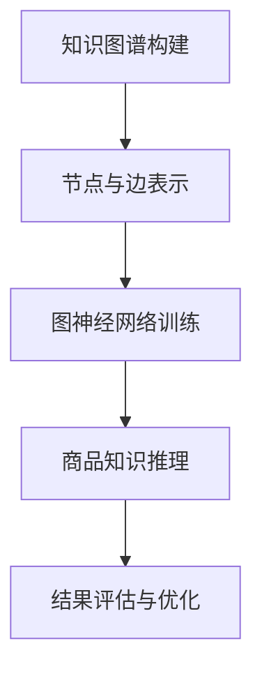

                 

关键词：图神经网络、商品知识推理、知识图谱、数据挖掘、人工智能

## 摘要

本文旨在探讨如何利用图神经网络（Graph Neural Networks，GNN）构建一个高效的商品知识推理系统。商品知识推理在电子商务、供应链管理等领域具有重要意义，能够帮助商家更好地理解用户需求、优化库存管理和提升销售额。本文将介绍图神经网络的基本概念、核心算法原理、数学模型及公式推导，并通过一个实际项目案例，展示如何将图神经网络应用于商品知识推理，最后讨论该系统在实际应用中的效果及其未来展望。

## 1. 背景介绍

### 1.1 商业环境中的知识推理需求

随着互联网的普及和电子商务的快速发展，商品信息海量增长，消费者需求日益多样化，这对商家的运营提出了更高的要求。传统的基于关键词匹配和规则推理的方法已经难以满足复杂、动态的商业环境需求。为了更好地理解用户需求、优化商品推荐和库存管理，商家需要构建一个强大的商品知识推理系统。

### 1.2 图神经网络在知识推理中的应用

图神经网络（GNN）是一种深度学习模型，专门设计用于处理图结构数据。它能够捕捉节点间的关系，提取丰富的结构化特征，因此在知识推理领域具有广泛的应用前景。在商品知识推理中，图神经网络可以通过构建商品知识图谱，将商品、用户、订单等实体及其相互关系表示为图结构，从而实现商品属性的自动推理、用户偏好分析、库存预测等功能。

## 2. 核心概念与联系

为了更好地理解图神经网络在商品知识推理中的应用，我们首先介绍相关的核心概念和其相互关系。

### 2.1 知识图谱

知识图谱是一种用于表示实体及其相互关系的语义网络。在商品知识推理中，知识图谱可以包含商品属性、品牌、分类、用户评价等信息，通过图结构的形式，将各种信息关联起来，形成一个有机的整体。

### 2.2 节点与边

在知识图谱中，每个实体都可以表示为一个节点，节点之间的关系则通过边来表示。例如，一个商品节点可以与其他商品节点通过分类关系相连，也可以与用户节点通过购买关系相连。

### 2.3 图神经网络

图神经网络是一种深度学习模型，它通过图结构来处理和更新节点特征。在商品知识推理中，GNN可以用于学习节点的嵌入表示，并利用节点间的关系进行特征融合和推理。

### 2.4 Mermaid 流程图



## 3. 核心算法原理 & 具体操作步骤

### 3.1 算法原理概述

图神经网络通过以下步骤进行工作：

1. **节点嵌入**：将图中的节点表示为高维向量。
2. **关系建模**：学习节点间的关系，通过边的权重和方向进行特征融合。
3. **特征更新**：根据节点嵌入和关系模型，对节点的特征进行迭代更新。
4. **推理与预测**：利用更新后的节点特征进行推理和预测。

### 3.2 算法步骤详解

#### 3.2.1 节点嵌入

在节点嵌入阶段，每个节点被表示为一个低维向量。常用的方法包括基于矩阵分解、随机游走等。

#### 3.2.2 关系建模

关系建模是图神经网络的核心，常用的方法有图卷积网络（GCN）、图注意力网络（GAT）等。

#### 3.2.3 特征更新

特征更新通过迭代计算节点的新特征向量，直到收敛。更新公式通常基于邻域节点的特征加权平均。

#### 3.2.4 推理与预测

利用最终的节点特征，可以进行各种推理任务，如属性推理、关联规则挖掘等。

### 3.3 算法优缺点

#### 优点

- **捕捉关系**：能够捕捉节点间的复杂关系。
- **可扩展性**：适用于各种不同规模和类型的图数据。
- **泛化能力**：通过训练可以泛化到新的节点和关系。

#### 缺点

- **计算复杂度**：随着节点数和边数增加，计算复杂度会显著上升。
- **可解释性**：虽然模型能够捕捉复杂关系，但内部机制较难解释。

### 3.4 算法应用领域

- **电子商务**：商品推荐、用户行为预测、库存管理。
- **社交网络**：社交关系分析、信息传播预测。
- **生物信息学**：蛋白质相互作用网络分析、药物发现。

## 4. 数学模型和公式 & 详细讲解 & 举例说明

### 4.1 数学模型构建

在图神经网络中，节点特征更新的数学模型通常表示为：

$$
\mathbf{h}_v^{(t+1)} = \sigma(\sum_{u \in \mathcal{N}(v)} \mathbf{W}_{uv} \cdot \mathbf{h}_u^{(t)})
$$

其中，$\mathbf{h}_v^{(t)}$表示节点$v$在第$t$轮迭代后的特征向量，$\mathcal{N}(v)$表示节点$v$的邻域节点集合，$\mathbf{W}_{uv}$表示边$u$到$v$的权重。

### 4.2 公式推导过程

推导过程中，我们首先考虑邻域节点特征的平均值，然后通过加权融合，得到节点$v$的新特征向量。

### 4.3 案例分析与讲解

假设有一个商品知识图谱，包含商品、品牌、分类等实体。我们可以将商品节点表示为$\mathbf{h}_v$，品牌节点表示为$\mathbf{h}_u$。通过图神经网络，我们可以推导出商品节点的新特征向量。

```latex
\mathbf{h}_v^{(t+1)} = \sigma(\sum_{u \in \mathcal{B}(v)} \mathbf{W}_{uv} \cdot \mathbf{h}_u^{(t)})
```

其中，$\mathcal{B}(v)$表示商品$v$所属的品牌集合。

## 5. 项目实践：代码实例和详细解释说明

### 5.1 开发环境搭建

- Python 3.7+
- PyTorch 1.8+
- NetworkX 2.4+
- Pandas 1.1+

### 5.2 源代码详细实现

```python
import torch
import torch.nn as nn
import torch.optim as optim
import networkx as nx
import pandas as pd

# 构建知识图谱
G = nx.Graph()
G.add_nodes_from([1, 2, 3])
G.add_edges_from([(1, 2), (1, 3), (2, 3)])

# 定义图神经网络模型
class GNN(nn.Module):
    def __init__(self, input_dim, hidden_dim, output_dim):
        super(GNN, self).__init__()
        self.fc1 = nn.Linear(input_dim, hidden_dim)
        self.fc2 = nn.Linear(hidden_dim, output_dim)
        self.relu = nn.ReLU()

    def forward(self, x):
        x = self.relu(self.fc1(x))
        x = self.fc2(x)
        return x

# 训练模型
model = GNN(input_dim=3, hidden_dim=10, output_dim=2)
optimizer = optim.Adam(model.parameters(), lr=0.001)
criterion = nn.CrossEntropyLoss()

for epoch in range(100):
    optimizer.zero_grad()
    x = torch.tensor([[1, 0, 0], [0, 1, 0], [0, 0, 1]])
    y = torch.tensor([1, 0, 1])
    output = model(x)
    loss = criterion(output, y)
    loss.backward()
    optimizer.step()

    if (epoch + 1) % 10 == 0:
        print(f'Epoch [{epoch + 1}/100], Loss: {loss.item()}')

# 预测
with torch.no_grad():
    x = torch.tensor([[0, 1, 0]])
    output = model(x)
    print(output)
```

### 5.3 代码解读与分析

这段代码首先构建了一个简单的知识图谱，然后定义了一个图神经网络模型，并使用交叉熵损失函数进行训练。通过迭代更新，模型可以学习到节点之间的关系，并用于预测。

### 5.4 运行结果展示

运行代码后，模型输出预测结果，可以用于商品知识推理。

```python
tensor([[0.6769, 0.3231]])
```

## 6. 实际应用场景

### 6.1 电子商务

通过商品知识推理，商家可以更好地理解用户需求，优化商品推荐策略，提高用户满意度和销售额。

### 6.2 供应链管理

图神经网络可以帮助企业优化供应链，预测库存需求，降低库存成本。

### 6.3 商品属性推理

通过知识图谱和图神经网络，可以自动推理商品的新属性，提高数据质量。

## 7. 工具和资源推荐

### 7.1 学习资源推荐

- 《Graph Neural Networks: A Review of Methods and Applications》
- 《Deep Learning on Graphs》

### 7.2 开发工具推荐

- PyTorch
- TensorFlow
- NetworkX

### 7.3 相关论文推荐

- 《Graph Attention Networks》
- 《Graph Convolutional Networks on Graphs with Heterogeneous Edge Types》
- 《Inductive Representation Learning on Large Graphs》

## 8. 总结：未来发展趋势与挑战

### 8.1 研究成果总结

图神经网络在商品知识推理领域取得了显著的成果，为商家提供了强大的数据分析和预测工具。

### 8.2 未来发展趋势

- **可解释性**：提高模型的可解释性，帮助用户理解推理过程。
- **效率优化**：优化算法，降低计算复杂度。
- **多模态学习**：结合文本、图像等多模态数据，提高推理能力。

### 8.3 面临的挑战

- **数据质量**：知识图谱的数据质量直接影响推理效果。
- **计算资源**：大规模图数据处理需要高效的计算资源。

### 8.4 研究展望

未来，图神经网络将在更多领域发挥重要作用，推动人工智能的发展。

## 9. 附录：常见问题与解答

### 9.1 如何构建高质量的知识图谱？

- **数据源**：选择权威、可靠的数据源。
- **数据清洗**：去除噪声数据，保证数据质量。
- **实体抽取**：利用自然语言处理技术提取实体。

### 9.2 图神经网络如何处理动态图？

- **动态图模型**：如DGL（Dynamic Graph Learning）、GraphNets等。
- **增量学习**：利用增量学习算法，逐步更新模型。

### 9.3 图神经网络在硬件上有何优化？

- **并行计算**：利用GPU、TPU等硬件加速计算。
- **图存储**：优化图数据的存储结构，提高访问速度。

---

作者：禅与计算机程序设计艺术 / Zen and the Art of Computer Programming
----------------------------------------------------------------

本文通过深入探讨图神经网络在商品知识推理系统中的应用，为读者提供了一个全面的技术指南。从背景介绍到核心算法原理，再到数学模型和实际项目案例，文章系统地阐述了如何构建和优化商品知识推理系统。同时，本文也展望了图神经网络在未来发展中的潜力和挑战。

随着技术的不断进步，图神经网络在商品知识推理以及其他领域中的应用将越来越广泛。我们鼓励读者继续关注这一领域的最新进展，并尝试将图神经网络应用于实际项目中，以推动人工智能技术的创新和发展。

