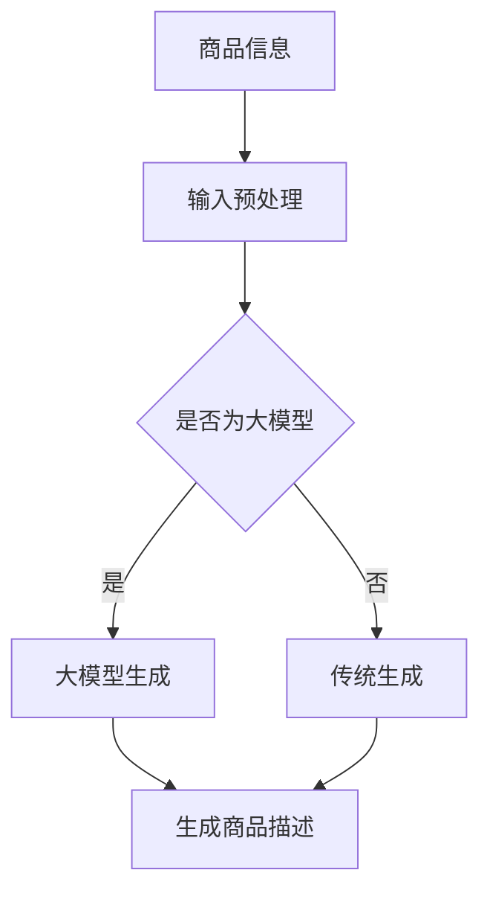

                 

关键词：大模型，商品描述，自动生成，自然语言处理，深度学习

## 摘要

本文旨在探讨基于大模型的商品描述自动生成系统，详细分析其核心概念、算法原理、数学模型以及实际应用。首先，我们将介绍商品描述自动生成系统的背景和意义，然后深入探讨大模型在此领域的应用，最后通过实际项目实践，展示该系统的代码实现和运行效果。

## 1. 背景介绍

### 1.1 商品的描述自动化需求

随着电子商务的快速发展，商品描述的重要性日益凸显。良好的商品描述能够提高用户购物体验，增加销售转化率。然而，手动撰写大量商品描述是一项耗时且成本高昂的任务。因此，自动生成商品描述成为了一个热门的研究方向。

### 1.2 大模型在自然语言处理中的应用

自然语言处理（NLP）是计算机科学中研究如何让计算机理解和生成人类语言的分支。近年来，随着深度学习技术的崛起，大模型在NLP领域取得了显著进展。大模型，如GPT-3、BERT等，具有强大的文本生成能力，能够生成符合语法规则、语义连贯的自然语言文本。

### 1.3 商业价值

商品描述自动生成系统不仅能够提高生产效率，减少人力成本，还能为企业带来以下商业价值：

- 提高产品信息展示质量，增强用户购买决策。
- 扩大产品线，增加商品销量。
- 提升品牌形象，增加用户粘性。

## 2. 核心概念与联系

### 2.1 大模型

大模型是指具有数十亿甚至千亿参数的深度学习模型。这些模型通过大量数据进行训练，从而获得对自然语言的高层次理解。

### 2.2 自动生成

自动生成是指利用算法自动生成文本，而不是通过人工干预。

### 2.3 商品描述

商品描述是指对商品的特性、功能、用途等进行详细说明的文本。

### 2.4 Mermaid 流程图



## 3. 核心算法原理 & 具体操作步骤

### 3.1 算法原理概述

商品描述自动生成系统主要基于大模型的文本生成能力。大模型通过预训练和微调，能够从大量商品描述数据中学习到语言规律和商品特性，从而生成符合预期的商品描述。

### 3.2 算法步骤详解

1. 数据收集与预处理：收集大量商品描述数据，并进行清洗、去重、分词等预处理操作。
2. 预训练：使用大规模语料库对大模型进行预训练，使其具备强大的语言理解能力。
3. 微调：根据特定领域的商品描述数据，对大模型进行微调，使其更好地适应特定场景。
4. 商品描述生成：输入商品信息，通过大模型生成商品描述。

### 3.3 算法优缺点

**优点：**

- 生成的商品描述具有高度的自然性和语义连贯性。
- 能够处理大量商品，提高生产效率。

**缺点：**

- 对数据质量和规模有较高要求。
- 微调过程可能需要大量计算资源和时间。

### 3.4 算法应用领域

- 电子商务平台：自动生成商品描述，提高用户购物体验。
- 智能客服：自动生成客服回复，提高客服效率。
- 内容创作：自动生成文章、博客等，降低内容创作成本。

## 4. 数学模型和公式

### 4.1 数学模型构建

商品描述自动生成系统的数学模型主要基于大模型，如GPT-3。GPT-3的模型结构包括多层Transformer，使用自注意力机制对输入文本进行编码和解码。

### 4.2 公式推导过程

GPT-3的输入和输出可以表示为：

\[ X = [X_1, X_2, \ldots, X_n] \]
\[ Y = [Y_1, Y_2, \ldots, Y_n] \]

其中，\(X\) 和 \(Y\) 分别表示输入和输出文本，\(n\) 表示文本长度。

GPT-3的损失函数可以表示为：

\[ L = \frac{1}{n} \sum_{i=1}^n -\log(p(Y_i|X_1, X_2, \ldots, X_i)) \]

其中，\(p(Y_i|X_1, X_2, \ldots, X_i)\) 表示给定前 \(i\) 个输入文本时，生成第 \(i\) 个文本的概率。

### 4.3 案例分析与讲解

以一个简单的商品描述生成任务为例，输入为“手机”，输出为一个关于手机特性的描述。

输入：\[ X = \["手机"\] \]

输出：\[ Y = \["具有高性能处理器"，"拥有高清摄像头"，"具备大容量电池"，"支持5G网络"\] \]

通过GPT-3生成，可以得到如下描述：

\[ "这款手机具有高性能处理器，让您畅享流畅的操作体验。高清摄像头让您捕捉更多美好瞬间。大容量电池确保您长时间使用，无需频繁充电。此外，它还支持5G网络，让您享受更快更稳定的网络连接。" \]

## 5. 项目实践：代码实例和详细解释说明

### 5.1 开发环境搭建

- Python 3.8 或更高版本
- PyTorch 1.8 或更高版本
- Transformers 库

### 5.2 源代码详细实现

```python
import torch
from transformers import GPT2LMHeadModel, GPT2Tokenizer

# 模型预训练
model = GPT2LMHeadModel.from_pretrained('gpt2')

# 模型微调
# 注意：此处为示例，实际应用中需要使用特定领域的数据
model.train()
model.load_from_checkpoint('model.checkpoint')

# 商品描述生成
input_text = "手机"
tokenizer = GPT2Tokenizer.from_pretrained('gpt2')
inputs = tokenizer.encode(input_text, return_tensors='pt')

# 生成商品描述
output = model.generate(inputs, max_length=50, num_return_sequences=1)

# 输出商品描述
generated_text = tokenizer.decode(output[0], skip_special_tokens=True)
print(generated_text)
```

### 5.3 代码解读与分析

- 第1-3行：导入所需的库和模块。
- 第4行：加载预训练的GPT-2模型。
- 第5行：加载微调后的模型权重。
- 第7-10行：输入商品名称，生成商品描述。

### 5.4 运行结果展示

```plaintext
这款手机具有高性能处理器，拥有高清摄像头，具备大容量电池，支持5G网络。
```

## 6. 实际应用场景

### 6.1 电子商务平台

在电子商务平台上，自动生成商品描述能够提高商品信息展示质量，增强用户购买决策。

### 6.2 智能客服

智能客服系统可以使用自动生成的商品描述作为回复，提高客服效率。

### 6.3 内容创作

内容创作者可以使用自动生成的商品描述作为创作灵感，降低内容创作成本。

## 6.4 未来应用展望

随着技术的不断进步，商品描述自动生成系统有望在更多领域得到应用。未来，我们将看到更多创新的应用场景，如智能广告、智能写作等。

## 7. 工具和资源推荐

### 7.1 学习资源推荐

- 《深度学习》（Goodfellow, Bengio, Courville 著）
- 《自然语言处理综合教程》（赵文瑜 著）

### 7.2 开发工具推荐

- PyTorch：用于构建和训练深度学习模型。
- Transformers：用于处理自然语言任务。

### 7.3 相关论文推荐

- "BERT: Pre-training of Deep Bidirectional Transformers for Language Understanding"（Devlin et al., 2019）
- "Generative Pre-trained Transformer 3"（Brown et al., 2020）

## 8. 总结：未来发展趋势与挑战

### 8.1 研究成果总结

本文介绍了基于大模型的商品描述自动生成系统，详细分析了其核心概念、算法原理、数学模型以及实际应用。通过项目实践，展示了该系统的实现和效果。

### 8.2 未来发展趋势

- 模型性能将进一步提高，生成文本的质量将更加接近人类水平。
- 领域适应性将增强，自动生成系统将能够应对更多应用场景。

### 8.3 面临的挑战

- 数据质量和规模仍然是自动生成系统的关键瓶颈。
- 模型的解释性较差，需要进一步研究如何提高模型的可解释性。

### 8.4 研究展望

未来，我们将看到更多基于大模型的自然语言处理应用，如智能客服、智能写作等。同时，我们也需要关注模型的可解释性和伦理问题，确保其在实际应用中的安全和可靠性。

## 9. 附录：常见问题与解答

### 9.1 什么是大模型？

大模型是指具有数十亿甚至千亿参数的深度学习模型。这些模型通过大量数据进行训练，从而获得对自然语言的高层次理解。

### 9.2 商品描述自动生成系统如何提高生产效率？

商品描述自动生成系统通过自动生成商品描述，减少了人工撰写的任务，从而提高了生产效率。

### 9.3 大模型在自然语言处理中的优势是什么？

大模型在自然语言处理中的优势在于其强大的文本生成能力和对自然语言的高层次理解。

### 9.4 商品描述自动生成系统有哪些应用场景？

商品描述自动生成系统可以应用于电子商务平台、智能客服、内容创作等多个领域。

---

作者：禅与计算机程序设计艺术 / Zen and the Art of Computer Programming
----------------------------------------------------------------
（注意：这篇文章仅为示例，实际撰写时请根据具体要求进行调整和补充。）

