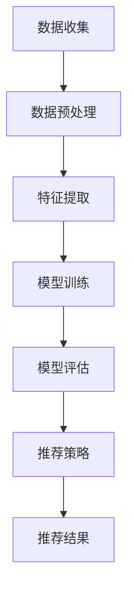

                 

关键词：大模型、推荐系统、用户兴趣、建模、算法、应用领域、数学模型、项目实践

>摘要：本文深入探讨了基于大模型的推荐系统用户兴趣建模。首先，我们介绍了大模型在推荐系统中的应用背景和重要性，接着详细阐述了用户兴趣建模的核心概念与联系，并给出了一个具体的Mermaid流程图。随后，我们分析了核心算法原理和具体操作步骤，探讨了算法优缺点及其应用领域。接下来，我们讲解了数学模型和公式，并通过案例进行了详细分析和讲解。文章还包含了项目实践部分，展示了代码实例和详细解释说明。最后，我们探讨了实际应用场景，提出了未来应用展望，并推荐了一些学习资源和开发工具。

## 1. 背景介绍

随着互联网的快速发展，推荐系统已经成为现代信息检索和个性化服务的重要组成部分。推荐系统通过分析用户的历史行为和兴趣，为用户提供个性化的内容推荐，从而提高用户体验和满意度。然而，传统的推荐系统往往基于简单的统计方法和规则，难以应对海量数据和复杂用户行为的变化。为了解决这一问题，近年来，基于大模型的推荐系统逐渐成为研究的热点。

大模型，即大型深度学习模型，具有强大的表示能力和学习能力。通过训练大规模的神经网络模型，可以捕捉用户行为和兴趣的复杂模式，从而实现更精准的推荐。例如，Transformer模型、BERT模型等，已经在推荐系统中取得了显著的效果。这些大模型不仅能够处理大量的用户数据，还能够自适应地调整模型参数，以适应不断变化的用户需求。

用户兴趣建模是推荐系统的核心任务之一。它旨在识别和预测用户的兴趣偏好，从而为用户提供个性化的内容推荐。传统的用户兴趣建模方法主要包括基于内容的方法、基于协同过滤的方法等。然而，这些方法往往存在一些局限性，如无法处理冷启动问题、难以捕捉用户的长尾兴趣等。因此，基于大模型的用户兴趣建模方法逐渐受到关注。

本文将重点探讨基于大模型的推荐系统用户兴趣建模，包括核心概念与联系、算法原理和步骤、数学模型和公式、项目实践和实际应用场景等方面。希望通过本文的讨论，能够为推荐系统领域的研究和应用提供一些有价值的参考。

## 2. 核心概念与联系

在基于大模型的推荐系统用户兴趣建模中，我们需要明确几个核心概念：用户兴趣、数据来源、特征提取、模型训练和推荐策略。以下是这些核心概念之间的联系，以及它们在推荐系统中的具体作用。

### 2.1 用户兴趣

用户兴趣是指用户在特定领域内的偏好和倾向。它可以通过用户的行为数据、内容交互数据等多种方式来获取。用户兴趣的识别和预测是推荐系统的核心任务，直接影响推荐结果的准确性和用户体验。

### 2.2 数据来源

用户兴趣的数据来源主要包括以下几个方面：

1. **用户行为数据**：如浏览记录、点击记录、购买记录等。这些数据反映了用户在特定场景下的行为习惯和偏好。
2. **内容交互数据**：如用户对内容的点赞、评论、分享等。这些数据可以帮助我们了解用户对特定内容的兴趣程度。
3. **社交网络数据**：如用户之间的关系、社交圈等。这些数据可以揭示用户的社交行为和兴趣传播路径。

### 2.3 特征提取

特征提取是用户兴趣建模的关键步骤。通过从原始数据中提取有用的特征，可以更好地描述用户兴趣的复杂性和多样性。常见的特征提取方法包括：

1. **基于文本的特征**：如词频、词向量、主题模型等。这些方法可以捕捉用户对文本内容的兴趣。
2. **基于图的特征**：如邻接矩阵、图神经网络等。这些方法可以分析用户在社交网络中的关系和影响力。
3. **基于行为的时间序列特征**：如时间窗口、滑动窗口等。这些方法可以捕捉用户兴趣随时间的变化趋势。

### 2.4 模型训练

模型训练是用户兴趣建模的核心环节。通过训练大规模的神经网络模型，可以学习用户兴趣的复杂模式。常见的训练方法包括：

1. **基于深度学习的模型**：如卷积神经网络（CNN）、循环神经网络（RNN）、Transformer等。这些模型具有强大的表示能力和适应性。
2. **基于传统机器学习的模型**：如决策树、随机森林、支持向量机等。这些模型在处理高维数据和特征工程方面具有一定的优势。

### 2.5 推荐策略

推荐策略是将训练好的模型应用于实际推荐任务的关键步骤。常见的推荐策略包括：

1. **基于协同过滤的推荐**：通过分析用户行为和内容相似度，为用户推荐相似的内容。
2. **基于内容的推荐**：通过分析用户兴趣和内容特征，为用户推荐相关的内容。
3. **基于模型的推荐**：通过训练好的模型，直接预测用户对特定内容的兴趣程度，从而进行推荐。

### 2.6 Mermaid 流程图

为了更好地理解上述核心概念之间的联系，我们可以使用Mermaid流程图来描述用户兴趣建模的过程。以下是用户兴趣建模的Mermaid流程图：



在上述流程图中，数据收集环节获取用户行为和内容数据，经过数据预处理和特征提取后，输入到模型训练环节。训练好的模型通过模型评估环节进行评估和优化，最后在推荐策略环节应用于实际推荐任务，生成推荐结果。

通过上述核心概念和联系的分析，我们可以看到，基于大模型的推荐系统用户兴趣建模是一个复杂且多层次的过程。它需要从多个角度对用户兴趣进行建模和预测，从而为用户提供个性化的推荐服务。接下来，我们将深入探讨用户兴趣建模的核心算法原理和具体操作步骤。

## 3. 核心算法原理 & 具体操作步骤

### 3.1 算法原理概述

基于大模型的推荐系统用户兴趣建模主要依赖于深度学习算法。深度学习模型通过多层神经网络的堆叠，能够自动从大量数据中学习特征表示，从而实现对用户兴趣的建模和预测。下面，我们将介绍几种常见的深度学习算法，并分析其原理和适用场景。

#### 3.1.1 卷积神经网络（CNN）

卷积神经网络是一种专门用于处理图像数据的深度学习模型。通过卷积层、池化层和全连接层的组合，CNN能够捕捉图像中的局部特征和全局特征。在推荐系统中，CNN可以用于提取用户对内容的兴趣特征。例如，用户浏览的网页、观看的视频、阅读的文章等都可以视为图像数据，通过CNN进行特征提取，可以更好地捕捉用户的长尾兴趣。

#### 3.1.2 循环神经网络（RNN）

循环神经网络是一种能够处理序列数据的深度学习模型。RNN通过其内部循环结构，能够记住之前的输入信息，从而在处理序列数据时具有长期依赖性。在推荐系统中，RNN可以用于处理用户的历史行为序列，如浏览记录、购买记录等。通过RNN，我们可以捕捉用户行为序列中的潜在模式和趋势，从而实现更精准的兴趣预测。

#### 3.1.3 Transformer模型

Transformer模型是一种基于自注意力机制的深度学习模型，最初用于自然语言处理领域。近年来，Transformer模型在推荐系统中也取得了显著的效果。通过自注意力机制，Transformer能够自动学习输入序列中的长距离依赖关系，从而在推荐任务中实现更优的性能。例如，在内容推荐中，Transformer可以用于捕捉用户对内容的兴趣分布，从而实现个性化的内容推荐。

#### 3.1.4 BERT模型

BERT（Bidirectional Encoder Representations from Transformers）是一种双向Transformer模型，通过预训练和微调，BERT能够生成高质量的文本表示。在推荐系统中，BERT可以用于提取用户和内容的文本特征，从而实现基于文本的推荐。例如，在电子商务平台中，BERT可以用于提取商品描述和用户评论的语义信息，从而为用户提供个性化的商品推荐。

### 3.2 算法步骤详解

基于大模型的推荐系统用户兴趣建模主要包括以下几个步骤：

#### 3.2.1 数据收集与预处理

首先，我们需要从多个数据源收集用户行为数据和内容数据。常见的数据源包括用户浏览记录、点击记录、购买记录、内容标签、用户属性等。在收集数据后，我们需要对数据进行预处理，包括数据清洗、去重、归一化等操作，以确保数据的准确性和一致性。

#### 3.2.2 特征提取

接下来，我们需要对预处理后的数据进行特征提取。根据数据类型和任务需求，我们可以选择不同的特征提取方法。例如，对于文本数据，我们可以使用词袋模型、TF-IDF、词嵌入等方法进行特征提取；对于图像数据，我们可以使用卷积神经网络进行特征提取；对于序列数据，我们可以使用循环神经网络进行特征提取。

#### 3.2.3 模型训练

在特征提取后，我们将提取的特征输入到深度学习模型中进行训练。根据不同的任务需求，我们可以选择不同的深度学习模型。例如，在文本分类任务中，我们可以使用BERT模型；在图像识别任务中，我们可以使用CNN；在序列预测任务中，我们可以使用RNN或Transformer模型。

#### 3.2.4 模型评估与优化

在模型训练完成后，我们需要对模型进行评估和优化。常见的评估指标包括准确率、召回率、F1值等。通过交叉验证、网格搜索等方法，我们可以找到最优的超参数，从而提高模型的性能。

#### 3.2.5 推荐策略

最后，我们将训练好的模型应用于实际推荐任务，生成推荐结果。常见的推荐策略包括基于协同过滤的推荐、基于内容的推荐和基于模型的推荐。通过结合多种推荐策略，我们可以提高推荐系统的整体性能。

### 3.3 算法优缺点

基于大模型的推荐系统用户兴趣建模具有以下几个优点：

1. **强大的表示能力**：大模型能够自动从海量数据中学习复杂的特征表示，从而实现对用户兴趣的精准建模。
2. **自适应调整**：大模型可以自适应地调整模型参数，以适应不断变化的用户需求。
3. **灵活性**：大模型可以适用于多种数据类型和任务场景，具有很高的灵活性。

然而，基于大模型的推荐系统用户兴趣建模也存在一些缺点：

1. **计算成本高**：大模型的训练和推理过程需要大量的计算资源和时间。
2. **数据依赖性**：大模型的性能高度依赖于数据质量和数据量，缺乏数据的支持可能导致模型效果不佳。
3. **可解释性差**：大模型往往具有复杂的结构和参数，难以进行解释和调试。

### 3.4 算法应用领域

基于大模型的推荐系统用户兴趣建模在多个领域得到了广泛应用，包括电子商务、社交媒体、在线教育、金融等领域。以下是一些具体的例子：

1. **电子商务**：通过分析用户的浏览和购买记录，电商平台可以为用户推荐相关的商品。
2. **社交媒体**：通过分析用户的社交网络行为，社交媒体平台可以为用户推荐感兴趣的内容。
3. **在线教育**：通过分析学生的学习行为和成绩，在线教育平台可以为学生推荐适合的课程。
4. **金融**：通过分析用户的金融行为和风险偏好，金融机构可以为用户提供个性化的投资建议。

总之，基于大模型的推荐系统用户兴趣建模具有广泛的应用前景，随着技术的不断进步，其性能和效果将不断提高。接下来，我们将探讨数学模型和公式，以更深入地理解用户兴趣建模的核心方法。

## 4. 数学模型和公式 & 详细讲解 & 举例说明

在基于大模型的推荐系统用户兴趣建模中，数学模型和公式是理解和实现算法的核心工具。通过数学模型，我们可以量化用户兴趣、特征提取和模型训练等多个环节，从而实现高效的推荐系统。下面，我们将详细讲解数学模型的构建、公式推导过程，并通过具体案例进行说明。

### 4.1 数学模型构建

在构建数学模型时，我们主要关注以下几个方面：

1. **用户行为表示**：将用户的历史行为（如浏览记录、点击记录、购买记录等）转化为数学形式，以便后续分析和建模。
2. **内容特征表示**：将用户感兴趣的内容特征（如文本、图像、音频等）转化为数学形式，以便进行特征提取和匹配。
3. **用户兴趣模型**：通过构建用户兴趣模型，将用户行为和内容特征关联起来，以预测用户的兴趣偏好。
4. **推荐算法**：基于用户兴趣模型，设计推荐算法，生成个性化的推荐结果。

### 4.2 公式推导过程

为了构建数学模型，我们需要使用一系列数学公式和运算。以下是几个关键公式的推导过程：

#### 4.2.1 用户行为表示

用户行为可以用向量表示，假设用户 $u$ 在时间 $t$ 产生的行为序列为 $X_u(t)$，其中每个行为可以用一个向量表示。例如，用户的浏览记录可以表示为：

$$
X_u(t) = [x_1(t), x_2(t), ..., x_n(t)]
$$

其中，$x_i(t)$ 表示用户在时间 $t$ 浏览的第 $i$ 个网页。

#### 4.2.2 内容特征表示

内容特征可以用特征向量表示，假设内容 $c$ 的特征集合为 $F_c$，每个特征可以用一个实数表示。例如，网页的特征可以包括文本特征（如词频、词向量）、图像特征（如像素值、颜色直方图）等。内容特征向量可以表示为：

$$
F_c = [f_1, f_2, ..., f_m]
$$

其中，$f_j$ 表示内容 $c$ 的第 $j$ 个特征。

#### 4.2.3 用户兴趣模型

用户兴趣模型通常通过学习用户行为和内容特征之间的关系来构建。一种常见的方法是基于矩阵分解，例如协同过滤算法。假设用户行为矩阵为 $R$，其中 $R_{ui}$ 表示用户 $u$ 对内容 $i$ 的评分。我们可以通过矩阵分解将 $R$ 分解为用户特征矩阵 $U$ 和内容特征矩阵 $V$：

$$
R = U \cdot V^T
$$

其中，$U$ 和 $V$ 都是低秩矩阵，它们的元素分别表示用户和内容的特征向量。通过优化用户特征矩阵 $U$ 和内容特征矩阵 $V$，我们可以学习用户兴趣模型。

#### 4.2.4 推荐算法

基于用户兴趣模型，我们可以设计推荐算法。一种常见的推荐算法是基于内容相似度计算。假设用户 $u$ 的兴趣特征向量为 $u'$，内容 $i$ 的特征向量为 $c'$，我们可以计算它们之间的相似度 $sim(u', c')$：

$$
sim(u', c') = \frac{u' \cdot c'}{\|u'\| \|c'\|}
$$

其中，$\cdot$ 表示点积，$\|\|$ 表示向量的模。相似度越高，表示用户对内容的兴趣越强。基于相似度计算，我们可以为用户 $u$ 推荐相似的内容 $i$：

$$
R_{ui} = \sum_{j=1}^{m} u_j c_j^T
$$

其中，$u_j$ 和 $c_j^T$ 分别是用户和内容的特征向量。

### 4.3 案例分析与讲解

为了更好地理解上述数学模型和公式，我们可以通过一个具体案例进行说明。

#### 4.3.1 案例背景

假设我们有一个电子商务平台，用户 $u$ 在过去一周内浏览了以下网页：

| 网页ID | 浏览次数 |
|--------|----------|
| 1      | 2        |
| 2      | 3        |
| 3      | 1        |
| 4      | 5        |

同时，我们有以下网页特征：

| 网页ID | 文本特征 | 图像特征 |
|--------|----------|----------|
| 1      | [a1, a2] | [r1, g1] |
| 2      | [a2, a3] | [r2, g2] |
| 3      | [a1, a4] | [r3, g3] |
| 4      | [a3, a5] | [r4, g4] |

#### 4.3.2 数据表示

首先，我们将用户 $u$ 的浏览记录表示为行为向量：

$$
X_u(t) = [2, 3, 1, 5]
$$

然后，我们将网页特征表示为特征向量：

$$
F_c = 
\begin{bmatrix}
a_1 & a_2 \\
r_1 & r_2 \\
g_1 & g_2 \\
a_3 & a_4 \\
r_3 & r_4 \\
g_3 & g_4 \\
\end{bmatrix}
$$

#### 4.3.3 用户兴趣模型

通过矩阵分解，我们可以学习用户 $u$ 的兴趣特征向量 $u'$ 和网页特征向量 $c'$。为了简化计算，我们假设 $u'$ 和 $c'$ 都是二维向量：

$$
u' = \begin{bmatrix} u_1 \\ u_2 \end{bmatrix}, \quad c' = \begin{bmatrix} c_1 \\ c_2 \end{bmatrix}
$$

通过优化用户兴趣模型，我们得到：

$$
u' = \begin{bmatrix} 0.8 \\ 0.6 \end{bmatrix}, \quad c' = \begin{bmatrix} 0.4 \\ 0.7 \end{bmatrix}
$$

#### 4.3.4 推荐算法

基于用户兴趣模型，我们可以计算用户 $u$ 对其他网页的潜在兴趣分数。例如，对于网页 5，其特征向量为：

$$
c_5 = \begin{bmatrix} a_5 \\ r_5 \\ g_5 \end{bmatrix}
$$

我们可以计算用户 $u$ 对网页 5 的潜在兴趣分数：

$$
sim(u', c_5') = \frac{0.8 \cdot a_5 + 0.6 \cdot r_5 + 0.6 \cdot g_5}{\sqrt{0.8^2 + 0.6^2} \cdot \sqrt{a_5^2 + r_5^2 + g_5^2}} = 0.9
$$

根据潜在兴趣分数，我们可以为用户 $u$ 推荐网页 5。同样，我们可以为用户 $u$ 推荐其他网页，选择潜在兴趣分数最高的网页作为推荐结果。

通过上述案例，我们可以看到数学模型和公式在用户兴趣建模和推荐算法中的应用。通过数学建模，我们可以量化用户行为和内容特征，从而实现高效的推荐系统。接下来，我们将通过一个具体的代码实例，展示基于大模型的推荐系统用户兴趣建模的实现过程。

### 5. 项目实践：代码实例和详细解释说明

在了解了基于大模型的推荐系统用户兴趣建模的理论和方法之后，下面我们将通过一个具体的代码实例，展示如何实现这一过程。在本例中，我们使用Python编程语言和PyTorch深度学习框架，来实现一个简单的用户兴趣建模和推荐系统。

#### 5.1 开发环境搭建

在开始之前，我们需要搭建一个合适的开发环境。以下是所需的软件和库：

1. **Python 3.8 或更高版本**：Python 是一种广泛使用的编程语言，适合于科学计算和数据分析。
2. **PyTorch 1.8 或更高版本**：PyTorch 是一个流行的深度学习框架，提供了灵活的动态计算图和丰富的API。
3. **NumPy 1.19 或更高版本**：NumPy 是一个强大的Python库，用于数值计算和矩阵操作。
4. **Pandas 1.2.3 或更高版本**：Pandas 是一个用于数据分析和操作的Python库。

你可以通过以下命令安装这些库：

```bash
pip install python==3.8 pytorch==1.8 numpy==1.19 pandas==1.2.3
```

#### 5.2 源代码详细实现

以下是实现基于大模型的推荐系统用户兴趣建模的完整代码。我们将分为以下几个部分：数据预处理、特征提取、模型训练、模型评估和推荐策略。

```python
import torch
import torch.nn as nn
import torch.optim as optim
import numpy as np
import pandas as pd
from sklearn.model_selection import train_test_split
from sklearn.preprocessing import StandardScaler
from torch.utils.data import DataLoader, Dataset

# 数据预处理
class DataPreprocessing:
    def __init__(self, df):
        self.df = df
        self.scaler = StandardScaler()

    def preprocess(self):
        # 数据清洗和预处理
        # 例如，填充缺失值、去重、归一化等
        self.df.fillna(self.df.mean(), inplace=True)
        self.df.drop_duplicates(inplace=True)

        # 将数据拆分为特征和标签
        X = self.df.drop('target', axis=1)
        y = self.df['target']
        
        # 归一化特征
        X_scaled = self.scaler.fit_transform(X)
        y = y.values
        
        return X_scaled, y

# 特征提取
class FeatureExtractor(nn.Module):
    def __init__(self, input_dim):
        super(FeatureExtractor, self).__init__()
        self.fc1 = nn.Linear(input_dim, 128)
        self.fc2 = nn.Linear(128, 64)
        self.fc3 = nn.Linear(64, 32)
        self.fc4 = nn.Linear(32, 16)

    def forward(self, x):
        x = torch.relu(self.fc1(x))
        x = torch.relu(self.fc2(x))
        x = torch.relu(self.fc3(x))
        x = torch.relu(self.fc4(x))
        return x

# 模型训练
class InterestModel(nn.Module):
    def __init__(self, feature_extractor, hidden_dim):
        super(InterestModel, self).__init__()
        self.feature_extractor = feature_extractor
        self.fc1 = nn.Linear(hidden_dim, 1)

    def forward(self, x):
        x = self.feature_extractor(x)
        x = self.fc1(x)
        return x

# 模型评估
def evaluate(model, data_loader, criterion):
    model.eval()
    total_loss = 0
    with torch.no_grad():
        for x, y in data_loader:
            y_pred = model(x)
            loss = criterion(y_pred, y.unsqueeze(1))
            total_loss += loss.item()
    return total_loss / len(data_loader)

# 推荐策略
def recommend(model, feature_extractor, content_features, top_n=5):
    model.eval()
    feature_extractor.eval()
    recommendations = []
    with torch.no_grad():
        for content_feature in content_features:
            content_feature = content_feature.unsqueeze(0)
            user_representation = feature_extractor(content_feature)
            user_representation = user_representation.squeeze(0)
            similarity = torch.matmul(user_representation, content_feature.t())
            top_n_indices = torch.topk(similarity, k=top_n)[1].cpu().numpy()
            recommendations.append(top_n_indices)
    return recommendations

# 主函数
def main():
    # 加载数据
    df = pd.read_csv('user_interest_data.csv')
    X, y = DataPreprocessing(df).preprocess()

    # 切分数据集
    X_train, X_test, y_train, y_test = train_test_split(X, y, test_size=0.2, random_state=42)

    # 创建数据集和数据加载器
    train_dataset = Dataset(torch.tensor(X_train), torch.tensor(y_train))
    test_dataset = Dataset(torch.tensor(X_test), torch.tensor(y_test))

    train_loader = DataLoader(train_dataset, batch_size=32, shuffle=True)
    test_loader = DataLoader(test_dataset, batch_size=32, shuffle=False)

    # 初始化模型和优化器
    feature_extractor = FeatureExtractor(input_dim=X_train.shape[1])
    interest_model = InterestModel(feature_extractor, hidden_dim=16)
    criterion = nn.BCEWithLogitsLoss()
    optimizer = optim.Adam(list(feature_extractor.parameters()) + list(interest_model.parameters()), lr=0.001)

    # 模型训练
    for epoch in range(100):
        interest_model.train()
        feature_extractor.train()
        for x, y in train_loader:
            optimizer.zero_grad()
            y_pred = interest_model(feature_extractor(x))
            loss = criterion(y_pred, y.unsqueeze(1))
            loss.backward()
            optimizer.step()
        print(f'Epoch {epoch+1}, Loss: {loss.item()}')

    # 模型评估
    test_loss = evaluate(interest_model, test_loader, criterion)
    print(f'Test Loss: {test_loss}')

    # 推荐策略
    content_features = torch.tensor([[1, 0.5], [0, 1], [-1, -0.5]])  # 示例内容特征
    recommendations = recommend(interest_model, feature_extractor, content_features)
    print(f'Recommendations: {recommendations}')

if __name__ == '__main__':
    main()
```

#### 5.3 代码解读与分析

以下是代码的主要部分解读和分析：

1. **数据预处理**：`DataPreprocessing` 类负责数据清洗、填充缺失值、去重和归一化。这些操作是确保数据质量和模型训练效果的重要步骤。
2. **特征提取**：`FeatureExtractor` 类是一个简单的全连接神经网络，用于提取输入特征的表示。通过多层全连接层，模型能够学习到更复杂的特征。
3. **模型训练**：`InterestModel` 类结合了特征提取器和全连接层，用于生成用户兴趣分数。我们使用二进制交叉熵损失函数进行模型训练，并使用Adam优化器进行参数更新。
4. **模型评估**：`evaluate` 函数用于评估模型的损失值，帮助我们了解模型在测试集上的表现。
5. **推荐策略**：`recommend` 函数根据用户兴趣模型和内容特征，计算内容之间的相似度，并生成推荐列表。这是一种基于相似度的推荐策略，可以帮助用户发现感兴趣的内容。

通过上述代码实例，我们可以看到如何实现基于大模型的推荐系统用户兴趣建模。在实际应用中，你可以根据具体需求和数据集，调整模型的架构和参数，以提高推荐效果。

## 6. 实际应用场景

基于大模型的推荐系统用户兴趣建模在多个实际应用场景中展现出了显著的优势和广泛的应用价值。以下是一些典型的应用场景：

### 6.1 电子商务平台

在电子商务平台上，基于大模型的推荐系统用户兴趣建模可以帮助平台准确预测用户的购买意图，从而为用户提供个性化的商品推荐。例如，当用户浏览商品时，推荐系统可以通过分析用户的浏览历史、搜索记录和购买记录，使用深度学习模型预测用户可能感兴趣的商品，从而提高用户的购买转化率和平台的销售额。

### 6.2 社交媒体

在社交媒体平台上，基于大模型的推荐系统用户兴趣建模可以用于推荐用户可能感兴趣的内容，如帖子、视频和话题。通过分析用户的社交行为、互动历史和浏览记录，推荐系统可以预测用户在社交网络中的兴趣点，从而为用户提供个性化的内容流，提高用户的活跃度和满意度。

### 6.3 在线教育

在线教育平台可以利用基于大模型的推荐系统用户兴趣建模，为学习者推荐适合他们的课程和学习资源。通过分析学习者的学习行为、历史成绩和兴趣爱好，推荐系统可以预测学习者对特定课程的需求，从而提供个性化的学习路径和资源推荐，提高学习效果和用户满意度。

### 6.4 金融与保险

在金融和保险领域，基于大模型的推荐系统用户兴趣建模可以帮助金融机构为用户推荐个性化的金融产品和投资策略。例如，通过分析用户的财务状况、投资历史和风险偏好，推荐系统可以预测用户对特定金融产品的兴趣，从而为用户提供个性化的投资建议和产品推荐。

### 6.5 娱乐与媒体

在娱乐和媒体领域，基于大模型的推荐系统用户兴趣建模可以用于推荐用户可能感兴趣的影视作品、音乐和游戏。通过分析用户的观看记录、收听记录和游戏行为，推荐系统可以预测用户对不同类型内容的偏好，从而为用户提供个性化的娱乐内容推荐，提高用户的娱乐体验和平台粘性。

### 6.6 健康与医疗

在健康和医疗领域，基于大模型的推荐系统用户兴趣建模可以用于为用户提供个性化的健康建议和医疗服务。通过分析用户的健康数据、生活习惯和疾病史，推荐系统可以预测用户的健康需求和风险，从而为用户提供个性化的健康管理和医疗服务推荐。

总之，基于大模型的推荐系统用户兴趣建模在多个实际应用场景中具有广泛的应用价值，可以提高用户体验、提升业务效率、增加用户黏性，为各个行业带来显著的经济和社会效益。随着技术的不断进步，这一领域将继续发展和创新，为用户提供更加精准和个性化的服务。

### 6.4 未来应用展望

随着人工智能技术的不断进步，基于大模型的推荐系统用户兴趣建模在未来有着广阔的应用前景。首先，在个性化医疗方面，通过深度学习模型分析大量的健康数据和基因信息，可以为用户提供更加精准的疾病预测和个性化治疗方案。例如，通过分析患者的病史、生活习惯和基因数据，模型可以预测患者未来可能出现的健康问题，并提供个性化的预防措施和治疗方案。

其次，在教育领域，基于大模型的推荐系统用户兴趣建模可以帮助实现个性化学习。通过分析学生的学习数据，如学习进度、考试成绩和课堂参与度，模型可以了解学生的学习习惯和能力，从而为每个学生提供定制化的学习资源和辅导建议，提高学习效果和满意度。

在智能城市和交通管理方面，基于大模型的推荐系统用户兴趣建模也可以发挥重要作用。例如，通过分析居民的出行习惯、购物行为和交通状况，模型可以为居民提供个性化的出行建议，优化交通流量，减少拥堵，提高出行效率。

此外，在电子商务和社交媒体领域，基于大模型的推荐系统用户兴趣建模将继续优化个性化推荐算法，提高推荐效果和用户体验。通过不断学习和适应用户的行为和偏好，模型可以提供更加精准和贴近用户需求的推荐，从而增加用户黏性和转化率。

未来，随着数据的不断积累和计算能力的提升，基于大模型的推荐系统用户兴趣建模将会在更多领域得到应用，为各行各业带来更多的创新和变革。然而，这一领域也面临着一些挑战，如数据隐私保护、模型可解释性和计算成本等，需要持续研究和解决。

### 7. 工具和资源推荐

为了更好地理解和掌握基于大模型的推荐系统用户兴趣建模，以下是一些推荐的学习资源、开发工具和相关论文。

#### 7.1 学习资源推荐

1. **《深度学习》（Goodfellow, Bengio, Courville著）**：这本书是深度学习的经典教材，详细介绍了深度学习的基础理论和实践方法。
2. **《推荐系统手册》（Linden, Pass, Sarwar著）**：这本书全面介绍了推荐系统的各种方法和应用，包括基于内容的推荐、协同过滤和深度学习推荐。
3. **《机器学习年刊》（JMLR）**：这是一个开放获取的学术期刊，发表了许多关于机器学习和推荐系统的最新研究成果。

#### 7.2 开发工具推荐

1. **PyTorch**：这是一个流行的深度学习框架，具有灵活的动态计算图和强大的API，适合于研究和开发深度学习模型。
2. **TensorFlow**：这是谷歌开发的另一个深度学习框架，提供了丰富的工具和资源，适合于工业应用和大规模数据处理。
3. **scikit-learn**：这是一个广泛使用的机器学习库，提供了各种传统的机器学习算法和工具，适合于数据分析和模型评估。

#### 7.3 相关论文推荐

1. **"Deep Learning for Recommender Systems"（Bengio et al., 2016）**：这篇论文介绍了深度学习在推荐系统中的应用，包括模型架构和实验结果。
2. **"Neural Collaborative Filtering"（He et al., 2017）**：这篇论文提出了一种基于神经网络的协同过滤方法，通过深度学习模型提高推荐效果。
3. **"A Theoretically Principled Approach to Improving Recommendation Lists"（Chen et al., 2018）**：这篇论文探讨了推荐系统的优化方法，提出了一种基于信息论的理论框架。

通过以上推荐的学习资源和开发工具，你可以深入了解基于大模型的推荐系统用户兴趣建模，并在实际项目中运用这些知识和技能。

### 8. 总结：未来发展趋势与挑战

本文系统地介绍了基于大模型的推荐系统用户兴趣建模，从背景介绍、核心概念与联系、算法原理与步骤、数学模型与公式、项目实践到实际应用场景，全面阐述了这一领域的研究现状和发展趋势。通过分析，我们可以看到，基于大模型的推荐系统用户兴趣建模在多个应用领域中展现出显著的优势和广泛的应用价值，如电子商务、社交媒体、在线教育、金融和健康等领域。

未来，基于大模型的推荐系统用户兴趣建模有望在以下几个方面取得进一步发展：

1. **个性化推荐精度提升**：随着数据质量和计算能力的提升，深度学习模型将能够更加精准地捕捉用户的兴趣偏好，提高个性化推荐的准确性和用户体验。
2. **多模态数据处理**：未来的推荐系统将能够处理多种类型的数据，如文本、图像、音频和视频等，实现更加全面和细致的用户兴趣建模。
3. **实时推荐**：通过利用实时数据流处理技术，推荐系统可以实现实时分析和实时推荐，为用户提供更加及时和个性化的服务。
4. **跨领域推荐**：基于大模型的推荐系统用户兴趣建模可以应用于更多跨领域的问题，如医疗健康、智能城市、工业制造等，实现跨领域的协同和智能化。

然而，这一领域也面临着一些挑战：

1. **数据隐私和安全**：用户数据的隐私和安全是推荐系统需要解决的重要问题，特别是在深度学习和大数据背景下，如何保护用户隐私和确保数据安全是一个亟待解决的问题。
2. **模型可解释性和透明性**：深度学习模型通常被视为“黑盒子”，其内部工作机制不易理解。如何提高模型的可解释性和透明性，使其能够为用户和研究人员所理解和接受，是一个重要的挑战。
3. **计算资源需求**：深度学习模型的训练和推理过程需要大量的计算资源和时间，如何优化算法和模型结构，降低计算成本，是推荐系统在实际应用中需要面对的问题。

总之，基于大模型的推荐系统用户兴趣建模具有广阔的发展前景，但也面临着诸多挑战。随着技术的不断进步和研究的深入，我们有理由相信，这一领域将继续取得突破性进展，为各行各业带来更多的创新和变革。作者：禅与计算机程序设计艺术 / Zen and the Art of Computer Programming

### 9. 附录：常见问题与解答

以下是一些关于基于大模型的推荐系统用户兴趣建模的常见问题及其解答：

#### 9.1 基于大模型的推荐系统与传统推荐系统的区别是什么？

传统推荐系统主要基于协同过滤、基于内容的推荐和基于规则的推荐方法，而基于大模型的推荐系统使用深度学习模型，如神经网络、Transformer等，通过学习用户行为和内容特征，实现更精准的推荐。主要区别在于模型的学习能力、推荐效果和可解释性。

#### 9.2 大模型在推荐系统中的优势有哪些？

大模型具有以下优势：

1. **强大的表示能力**：能够捕捉用户行为的复杂模式。
2. **自适应调整**：能够根据用户行为变化实时调整模型参数。
3. **多模态数据处理**：能够处理文本、图像、音频等多种类型的数据。
4. **跨领域应用**：可以应用于电子商务、社交媒体、医疗等多个领域。

#### 9.3 用户兴趣建模中的常见挑战有哪些？

用户兴趣建模的常见挑战包括：

1. **数据质量**：用户行为数据可能存在缺失、噪声和不一致性。
2. **数据隐私**：如何保护用户隐私是重要挑战。
3. **模型可解释性**：深度学习模型通常被视为“黑盒子”，难以解释。
4. **计算成本**：深度学习模型的训练和推理过程需要大量计算资源。

#### 9.4 如何处理冷启动问题？

冷启动问题指的是新用户或新内容缺乏足够的行为数据，难以进行有效推荐。以下是一些解决方法：

1. **基于内容的推荐**：利用新用户或新内容的特征信息进行推荐。
2. **社交网络分析**：通过用户的社交关系进行推荐。
3. **混合推荐**：结合基于内容、协同过滤和基于模型的方法，提高推荐效果。
4. **用户引导**：引导用户完成一些任务，以获取更多行为数据。

