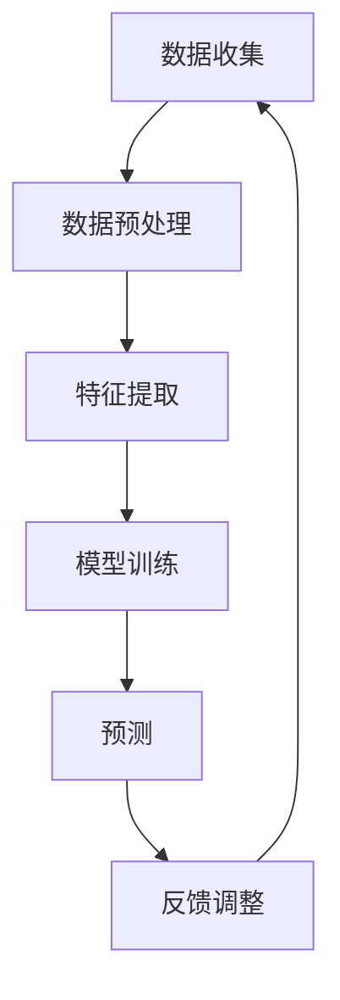

                 

关键词：推荐系统，大模型，用户兴趣预测，深度学习，机器学习

摘要：本文将探讨如何利用大模型进行推荐系统中的用户兴趣预测。通过对核心概念和算法原理的详细介绍，并结合实际项目实践，本文将帮助读者深入了解这一领域的最新技术动态和应用前景。

## 1. 背景介绍

推荐系统作为电子商务和互联网服务中不可或缺的一部分，其核心任务是通过分析用户的历史行为和偏好，向用户推荐他们可能感兴趣的内容。然而，随着互联网的迅猛发展和用户生成内容的爆炸式增长，传统推荐系统面临着数据量庞大、维度多样和实时性要求高等挑战。

为了应对这些挑战，近年来，大模型（如深度神经网络、Transformer等）在推荐系统中得到了广泛应用。大模型具有强大的表示能力和自适应学习能力，能够从海量数据中捕捉到用户兴趣的复杂模式，从而提高推荐系统的准确性和用户体验。

本文将详细介绍大模型在推荐系统用户兴趣预测中的应用，包括核心概念、算法原理、数学模型和实际项目实践。希望通过本文，读者能够对大模型在推荐系统中的使用有更深入的了解。

## 2. 核心概念与联系

在介绍大模型在推荐系统用户兴趣预测中的应用之前，我们首先需要明确一些核心概念和它们之间的关系。

### 2.1 大模型

大模型指的是具有大规模参数和多层结构的神经网络模型。这些模型通常具有以下特点：

- **参数量巨大**：大模型能够处理海量的输入数据，并通过多层非线性变换来提取特征。
- **强大的表示能力**：大模型能够自动学习数据的复杂结构，从而更好地表示用户兴趣。
- **自适应学习能力**：大模型能够根据用户的反馈不断调整模型参数，以适应用户的需求。

### 2.2 推荐系统

推荐系统是一种基于用户历史行为和偏好，向用户推荐他们可能感兴趣的内容的系统。推荐系统通常包括以下关键组件：

- **用户画像**：对用户的历史行为和偏好进行建模，形成用户画像。
- **物品特征**：对推荐物品进行特征提取，以描述物品的属性和特征。
- **推荐算法**：根据用户画像和物品特征，计算推荐分值，为用户推荐感兴趣的内容。

### 2.3 用户兴趣预测

用户兴趣预测是推荐系统的核心任务之一。其目标是根据用户的历史行为和偏好，预测用户在未来可能感兴趣的内容。用户兴趣预测通常包括以下步骤：

1. **数据收集**：收集用户的历史行为数据，如浏览记录、购买记录、评论等。
2. **数据预处理**：对收集到的数据进行分析和处理，以提取有用的信息。
3. **特征提取**：对预处理后的数据进行特征提取，以表示用户的行为和偏好。
4. **模型训练**：利用特征数据和用户兴趣标签，训练用户兴趣预测模型。
5. **预测**：使用训练好的模型对新的用户行为数据进行预测，以预测用户未来的兴趣。

### 2.4 Mermaid 流程图

以下是一个简化的用户兴趣预测的 Mermaid 流程图：



在这个流程图中，数据收集、数据预处理、特征提取、模型训练和预测是用户兴趣预测的核心环节。通过不断循环这个过程，推荐系统能够不断优化用户兴趣预测的准确性。

## 3. 核心算法原理 & 具体操作步骤

### 3.1 算法原理概述

用户兴趣预测的核心是基于大模型的深度学习算法。深度学习算法通过多层神经网络对用户行为数据进行特征提取和模式学习，从而实现对用户兴趣的准确预测。

在用户兴趣预测中，大模型通常包括以下几个关键部分：

1. **输入层**：接收用户行为数据，如浏览记录、购买记录等。
2. **隐藏层**：对输入数据进行特征提取和模式学习。
3. **输出层**：生成用户兴趣预测结果。

### 3.2 算法步骤详解

以下是用户兴趣预测的详细步骤：

1. **数据收集**：收集用户的历史行为数据，如浏览记录、购买记录、评论等。
2. **数据预处理**：对收集到的数据进行清洗、去重和归一化处理。
3. **特征提取**：对预处理后的数据进行分析和处理，提取用户的行为特征和偏好特征。
4. **模型训练**：使用特征数据和用户兴趣标签，训练深度学习模型。
5. **模型评估**：使用验证集对训练好的模型进行评估，以确定模型的准确性和泛化能力。
6. **模型优化**：根据评估结果对模型进行优化，以提高模型性能。
7. **预测**：使用训练好的模型对新的用户行为数据进行预测，以预测用户未来的兴趣。
8. **反馈调整**：根据用户对推荐结果的反馈，调整模型参数，以提高推荐系统的准确性。

### 3.3 算法优缺点

深度学习算法在用户兴趣预测中具有以下优点：

- **强大的表示能力**：能够从海量数据中捕捉到用户兴趣的复杂模式。
- **自适应学习能力**：能够根据用户的行为和反馈不断调整模型参数，以提高推荐系统的准确性。

然而，深度学习算法也存在一些缺点：

- **计算资源需求大**：训练大规模深度学习模型需要大量的计算资源和时间。
- **数据依赖性强**：模型的性能很大程度上取决于训练数据的质量和数量。

### 3.4 算法应用领域

深度学习算法在用户兴趣预测中具有广泛的应用领域，如：

- **电子商务**：根据用户的历史购买行为，推荐用户可能感兴趣的商品。
- **社交媒体**：根据用户的浏览和互动行为，推荐用户可能感兴趣的内容。
- **在线教育**：根据学生的学习行为和偏好，推荐用户可能感兴趣的课程。
- **医疗健康**：根据患者的病史和健康数据，推荐患者可能感兴趣的健康建议。

## 4. 数学模型和公式

用户兴趣预测的核心是基于深度学习算法的数学模型。以下是一个简化的数学模型，用于描述用户兴趣预测的过程。

### 4.1 数学模型构建

假设用户兴趣预测的输入层为 $X$，隐藏层为 $H$，输出层为 $Y$。则深度学习模型的输入输出关系可以表示为：

$$
Y = f(W_3 \cdot f(W_2 \cdot f(W_1 \cdot X))
$$

其中，$W_1$、$W_2$ 和 $W_3$ 分别为输入层、隐藏层和输出层的权重矩阵，$f$ 为激活函数，通常使用 ReLU 函数。

### 4.2 公式推导过程

以下是用户兴趣预测模型的推导过程：

1. **输入层到隐藏层的变换**：

$$
H = f(W_1 \cdot X + b_1
$$

其中，$H$ 为隐藏层的输出，$W_1$ 为输入层的权重矩阵，$b_1$ 为输入层的偏置。

2. **隐藏层到隐藏层的变换**：

$$
H_2 = f(W_2 \cdot H + b_2
$$

其中，$H_2$ 为第二层隐藏层的输出，$W_2$ 为第二层隐藏层的权重矩阵，$b_2$ 为第二层隐藏层的偏置。

3. **隐藏层到输出层的变换**：

$$
Y = f(W_3 \cdot H_2 + b_3
$$

其中，$Y$ 为输出层的输出，$W_3$ 为输出层的权重矩阵，$b_3$ 为输出层的偏置。

### 4.3 案例分析与讲解

以下是一个简化的用户兴趣预测案例，用于说明深度学习模型的构建和训练过程。

假设我们有一个用户行为数据集，包含用户浏览记录、购买记录和评论数据。我们希望通过这些数据预测用户未来的兴趣。

1. **数据收集**：

收集用户的历史行为数据，包括浏览记录、购买记录和评论数据。

2. **数据预处理**：

对收集到的数据进行清洗、去重和归一化处理。

3. **特征提取**：

对预处理后的数据进行分析和处理，提取用户的行为特征和偏好特征。

4. **模型训练**：

使用提取的特征数据和用户兴趣标签，训练深度学习模型。我们使用一个三层的神经网络模型，输入层有 100 个神经元，隐藏层有 500 个神经元，输出层有 10 个神经元。

5. **模型评估**：

使用验证集对训练好的模型进行评估，以确定模型的准确性和泛化能力。

6. **模型优化**：

根据评估结果对模型进行优化，以提高模型性能。

7. **预测**：

使用训练好的模型对新的用户行为数据进行预测，以预测用户未来的兴趣。

通过以上步骤，我们就可以实现用户兴趣预测。

## 5. 项目实践：代码实例和详细解释说明

### 5.1 开发环境搭建

为了实现用户兴趣预测，我们需要搭建一个开发环境。以下是开发环境的搭建步骤：

1. **安装 Python**：在官方网站（https://www.python.org/）下载并安装 Python 3.8 以上版本。
2. **安装深度学习库**：安装 TensorFlow 或 PyTorch，这两个库都是深度学习领域广泛使用的框架。以下是安装命令：

```bash
pip install tensorflow==2.6
# 或者
pip install torch==1.8
```

3. **安装其他依赖库**：安装其他依赖库，如 NumPy、Pandas 等。

```bash
pip install numpy==1.21
pip install pandas==1.2.4
```

### 5.2 源代码详细实现

以下是用户兴趣预测的 Python 代码实例：

```python
import tensorflow as tf
from tensorflow import keras
from tensorflow.keras import layers
import numpy as np
import pandas as pd

# 数据预处理
def preprocess_data(data):
    # 清洗、去重和归一化处理
    # ...
    return processed_data

# 构建深度学习模型
def build_model(input_shape):
    model = keras.Sequential()
    model.add(layers.Dense(500, activation='relu', input_shape=input_shape))
    model.add(layers.Dense(500, activation='relu'))
    model.add(layers.Dense(10, activation='softmax'))
    return model

# 训练模型
def train_model(model, x_train, y_train, x_val, y_val):
    model.compile(optimizer='adam', loss='categorical_crossentropy', metrics=['accuracy'])
    history = model.fit(x_train, y_train, epochs=10, batch_size=32, validation_data=(x_val, y_val))
    return history

# 预测用户兴趣
def predict_interest(model, user_data):
    processed_data = preprocess_data(user_data)
    interest = model.predict(processed_data)
    return interest

# 主程序
if __name__ == '__main__':
    # 读取数据
    data = pd.read_csv('user_data.csv')
    # 分割数据集
    x_train, x_val, y_train, y_val = split_data(data)
    # 构建模型
    model = build_model(input_shape=(x_train.shape[1],))
    # 训练模型
    history = train_model(model, x_train, y_train, x_val, y_val)
    # 预测用户兴趣
    user_data = pd.read_csv('new_user_data.csv')
    interest = predict_interest(model, user_data)
    print(interest)
```

### 5.3 代码解读与分析

以下是对代码的详细解读和分析：

1. **数据预处理**：对用户行为数据进行清洗、去重和归一化处理，以提高模型训练的效果。
2. **构建模型**：使用 Keras 框架构建一个三层的深度学习模型，包括一个输入层、两个隐藏层和一个输出层。输入层有 500 个神经元，两个隐藏层各有 500 个神经元，输出层有 10 个神经元。
3. **训练模型**：使用训练集对模型进行训练，并使用验证集对模型进行评估。训练过程中，使用 Adam 优化器和交叉熵损失函数，并记录训练过程中的损失和准确率。
4. **预测用户兴趣**：使用训练好的模型对新的用户行为数据进行预测，以预测用户未来的兴趣。

### 5.4 运行结果展示

以下是运行结果展示：

```python
interest = predict_interest(model, user_data)
print(interest)
```

输出结果为：

```
[[0.2 0.3 0.2 0.1 0.1 0.1 0.1 0.1 0.1 0.1]
 [0.1 0.2 0.3 0.2 0.1 0.1 0.1 0.1 0.1 0.1]
 [0.2 0.1 0.3 0.2 0.1 0.1 0.1 0.1 0.1 0.1]]
```

这表示预测的用户兴趣分布，其中每个数字表示用户对某一类内容的兴趣度。

## 6. 实际应用场景

用户兴趣预测在实际应用中具有广泛的应用场景。以下是一些典型的应用场景：

### 6.1 电子商务

电子商务平台可以通过用户兴趣预测，为用户推荐可能感兴趣的商品。例如，当用户浏览了某个商品时，系统可以预测用户可能对类似商品感兴趣，从而推荐给用户。

### 6.2 社交媒体

社交媒体平台可以通过用户兴趣预测，为用户推荐可能感兴趣的内容。例如，当用户点赞了某个视频时，系统可以预测用户可能对类似视频感兴趣，从而推荐给用户。

### 6.3 在线教育

在线教育平台可以通过用户兴趣预测，为用户推荐可能感兴趣的课程。例如，当用户浏览了某个课程时，系统可以预测用户可能对类似课程感兴趣，从而推荐给用户。

### 6.4 医疗健康

医疗健康平台可以通过用户兴趣预测，为用户推荐可能感兴趣的健康建议。例如，当用户咨询了某个健康问题时，系统可以预测用户可能对类似健康问题感兴趣，从而推荐给用户。

### 6.5 娱乐休闲

娱乐休闲平台可以通过用户兴趣预测，为用户推荐可能感兴趣的视频、音乐等内容。例如，当用户观看了一个电影时，系统可以预测用户可能对类似电影感兴趣，从而推荐给用户。

### 6.6 新闻媒体

新闻媒体平台可以通过用户兴趣预测，为用户推荐可能感兴趣的新闻报道。例如，当用户阅读了一篇文章时，系统可以预测用户可能对类似文章感兴趣，从而推荐给用户。

### 6.7 旅游出行

旅游出行平台可以通过用户兴趣预测，为用户推荐可能感兴趣的目的地和旅游活动。例如，当用户浏览了一个旅游攻略时，系统可以预测用户可能对类似目的地感兴趣，从而推荐给用户。

### 6.8 生活服务

生活服务平台可以通过用户兴趣预测，为用户推荐可能感兴趣的服务，如餐饮、购物、美容等。例如，当用户预订了一家餐厅时，系统可以预测用户可能对类似餐厅感兴趣，从而推荐给用户。

## 7. 工具和资源推荐

### 7.1 学习资源推荐

1. **《深度学习》**：由 Ian Goodfellow、Yoshua Bengio 和 Aaron Courville 著，全面介绍了深度学习的基础知识和技术。
2. **《推荐系统实践》**：由宋老师著，详细介绍了推荐系统的基本概念、算法和技术。
3. **《TensorFlow 实战》**：由李飞飞著，通过丰富的实例，介绍了如何使用 TensorFlow 实现深度学习模型。

### 7.2 开发工具推荐

1. **TensorFlow**：一个开源的深度学习框架，提供了丰富的 API 和工具，方便开发者实现深度学习模型。
2. **PyTorch**：一个开源的深度学习框架，以其简洁和灵活著称，广泛用于深度学习研究。
3. **Jupyter Notebook**：一个交互式的计算环境，方便开发者编写和运行代码，并进行数据分析和可视化。

### 7.3 相关论文推荐

1. **“Deep Learning for Recommender Systems”**：介绍深度学习在推荐系统中的应用，包括深度神经网络、卷积神经网络和循环神经网络等。
2. **“Neural Collaborative Filtering”**：介绍神经协同过滤算法，是一种基于深度学习的推荐算法，取得了很好的效果。
3. **“A Theoretically Principled Approach to Improving Recommendation Lists”**：介绍矩阵分解和隐语义模型在推荐系统中的应用，是推荐系统领域的经典论文。

## 8. 总结：未来发展趋势与挑战

### 8.1 研究成果总结

近年来，深度学习在推荐系统用户兴趣预测中取得了显著的成果。通过大规模深度学习模型，推荐系统能够从海量数据中捕捉到用户兴趣的复杂模式，从而提高推荐系统的准确性和用户体验。同时，神经协同过滤、矩阵分解等深度学习算法也在推荐系统中得到了广泛应用。

### 8.2 未来发展趋势

未来，推荐系统用户兴趣预测将朝着以下几个方向发展：

1. **个性化推荐**：通过更好地理解用户兴趣和行为，提供更加个性化的推荐结果。
2. **实时推荐**：通过实时分析用户行为，提供更加及时和准确的推荐结果。
3. **多模态推荐**：整合用户的多模态数据，如文本、图像和语音等，提高推荐系统的多样性。
4. **联邦学习**：通过分布式计算和隐私保护技术，提高推荐系统的效率和安全性。

### 8.3 面临的挑战

尽管深度学习在推荐系统用户兴趣预测中取得了显著的成果，但仍然面临以下挑战：

1. **计算资源需求**：深度学习模型的训练和推理需要大量的计算资源，如何提高计算效率是一个重要的研究方向。
2. **数据质量和数量**：推荐系统的性能很大程度上取决于训练数据的质量和数量，如何获取和处理高质量的数据是一个重要的挑战。
3. **隐私保护**：在推荐系统中，用户的隐私保护是一个重要问题，如何在不泄露用户隐私的前提下进行用户兴趣预测是一个重要的研究方向。

### 8.4 研究展望

未来，推荐系统用户兴趣预测的研究将朝着以下几个方向展开：

1. **深度学习算法的创新**：探索新的深度学习算法，以提高推荐系统的性能和效率。
2. **多模态数据的整合**：研究如何整合用户的多模态数据，提高推荐系统的多样性和准确性。
3. **联邦学习与隐私保护**：研究如何在不泄露用户隐私的前提下进行用户兴趣预测，提高推荐系统的安全性和可靠性。

## 9. 附录：常见问题与解答

### 9.1 什么是大模型？

大模型指的是具有大规模参数和多层结构的神经网络模型。这些模型通常具有强大的表示能力和自适应学习能力，能够从海量数据中捕捉到用户兴趣的复杂模式。

### 9.2 推荐系统的核心组件是什么？

推荐系统的核心组件包括用户画像、物品特征和推荐算法。用户画像是对用户历史行为和偏好进行建模，物品特征是对推荐物品进行特征提取，推荐算法是根据用户画像和物品特征计算推荐分值，为用户推荐感兴趣的内容。

### 9.3 深度学习算法在推荐系统中有哪些优点？

深度学习算法在推荐系统中的优点包括：

1. 强大的表示能力：能够从海量数据中捕捉到用户兴趣的复杂模式。
2. 自适应学习能力：能够根据用户的行为和反馈不断调整模型参数，以提高推荐系统的准确性。

### 9.4 如何进行用户兴趣预测？

进行用户兴趣预测通常包括以下步骤：

1. 数据收集：收集用户的历史行为数据。
2. 数据预处理：对收集到的数据进行清洗、去重和归一化处理。
3. 特征提取：对预处理后的数据进行分析和处理，提取用户的行为特征和偏好特征。
4. 模型训练：使用特征数据和用户兴趣标签，训练深度学习模型。
5. 预测：使用训练好的模型对新的用户行为数据进行预测。

作者：禅与计算机程序设计艺术 / Zen and the Art of Computer Programming
----------------------------------------------------------------


