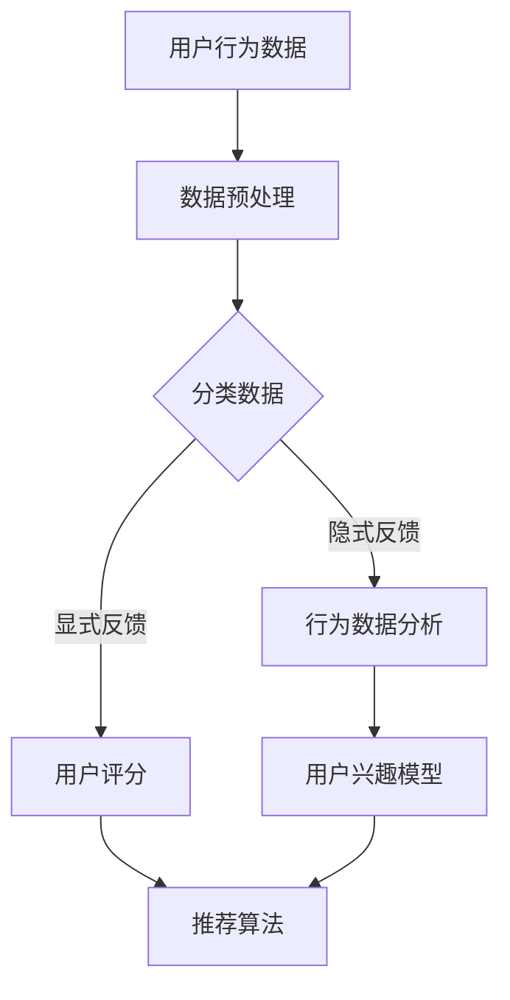

                 

关键词：推荐系统、用户反馈、大模型、优化、算法、数学模型、应用场景、未来展望

>摘要：本文深入探讨了基于大模型的推荐系统用户反馈机制优化。首先，介绍了推荐系统的背景和重要性。接着，详细阐述了用户反馈在推荐系统中的作用。然后，重点介绍了大模型的概念及其在推荐系统中的应用。最后，分析了现有用户反馈机制的不足，并提出了基于大模型的优化方案，展望了未来的发展趋势和挑战。

## 1. 背景介绍

随着互联网和移动互联网的快速发展，用户在获取信息和服务时越来越依赖于推荐系统。推荐系统通过分析用户的兴趣和行为，预测用户可能感兴趣的内容或服务，从而提高用户体验和满意度。然而，推荐系统的效果受到多种因素的影响，其中用户反馈是一个关键因素。

用户反馈是指用户在使用推荐系统过程中对推荐内容或服务的评价和反馈。这些反馈可以帮助推荐系统不断改进和优化，提高推荐的准确性和满意度。然而，传统的推荐系统用户反馈机制存在一些问题，如反馈质量低、反馈延迟等。

大模型是一种基于深度学习的技术，具有处理大规模数据的能力。在推荐系统中，大模型的应用可以提高推荐的准确性和个性化程度。本文将重点探讨基于大模型的推荐系统用户反馈机制优化，以提高推荐系统的效果。

## 2. 核心概念与联系

### 2.1. 推荐系统

推荐系统是一种基于数据挖掘和机器学习技术的系统，用于预测用户可能感兴趣的内容或服务。推荐系统通常包括三个核心组成部分：用户模型、物品模型和推荐算法。

用户模型描述用户的兴趣和偏好，可以通过收集用户的历史行为数据、社交网络信息等方式构建。物品模型描述物品的特征和属性，如电影、书籍、商品等。推荐算法根据用户模型和物品模型，利用机器学习算法生成推荐结果。

### 2.2. 用户反馈

用户反馈是指用户在使用推荐系统过程中对推荐内容或服务的评价和反馈。用户反馈可以包括正面反馈（如“喜欢”或“满意”）和负面反馈（如“不喜欢”或“不满意”）。用户反馈对于推荐系统的优化至关重要，因为它们提供了改进推荐结果的重要线索。

### 2.3. 大模型

大模型是指具有巨大规模和复杂结构的机器学习模型，通常包含数十亿甚至千亿级的参数。大模型可以处理大规模数据，并提取复杂的特征，从而提高预测和分类的准确性。在推荐系统中，大模型的应用可以显著提升推荐的准确性和个性化程度。

### 2.4. 推荐系统用户反馈机制

推荐系统用户反馈机制是指系统如何收集、处理和利用用户反馈来改进推荐结果的过程。现有的用户反馈机制主要包括以下几种：

1. **显式反馈**：用户主动提供评价和评分，如五星评级或简短评论。
2. **隐式反馈**：通过用户的行为数据（如点击、浏览、购买等）间接获取用户偏好。
3. **基于社区反馈**：利用用户的社交网络信息，分析用户之间的关系和共同兴趣。

### 2.5. Mermaid 流程图

下面是推荐系统用户反馈机制的 Mermaid 流程图：



## 3. 核心算法原理 & 具体操作步骤

### 3.1. 算法原理概述

基于大模型的推荐系统用户反馈机制优化主要利用深度学习技术，通过大规模数据和复杂的神经网络模型，提取用户和物品的潜在特征，从而提高推荐的准确性和个性化程度。

### 3.2. 算法步骤详解

1. **数据收集**：收集用户的行为数据（如浏览、点击、购买等）和物品的特征数据（如标题、标签、分类等）。

2. **数据预处理**：对收集的数据进行清洗和预处理，包括数据去重、缺失值填充、数据标准化等。

3. **构建用户和物品模型**：利用深度学习模型（如卷积神经网络、循环神经网络等），对用户和物品的特征进行编码，提取出潜在的特征表示。

4. **生成推荐结果**：将用户模型和物品模型输入到推荐算法中，生成推荐结果。

5. **收集用户反馈**：通过用户对推荐结果的评价（如评分、评论等），收集用户的反馈。

6. **优化模型**：根据用户反馈，调整模型参数，优化推荐算法。

7. **迭代过程**：不断收集用户反馈，调整模型，生成新的推荐结果，形成闭环反馈机制。

### 3.3. 算法优缺点

**优点**：

- 提高推荐准确性：基于深度学习的大模型可以处理大规模数据，提取复杂的特征，从而提高推荐的准确性和个性化程度。
- 适应性：通过闭环反馈机制，推荐系统可以根据用户反馈不断优化，提高适应性。

**缺点**：

- 数据需求：大模型需要大量的数据进行训练，对数据的质量和数量有较高要求。
- 计算资源：大模型训练和推断过程需要较高的计算资源，对硬件要求较高。

### 3.4. 算法应用领域

基于大模型的推荐系统用户反馈机制优化可以应用于多个领域，如电子商务、社交媒体、在线教育等。以下是一些具体的应用场景：

1. **电子商务**：根据用户的浏览和购买历史，推荐用户可能感兴趣的商品。
2. **社交媒体**：根据用户的社交网络关系和互动行为，推荐用户可能感兴趣的内容。
3. **在线教育**：根据学生的学习历史和兴趣，推荐适合的学习资源。

## 4. 数学模型和公式 & 详细讲解 & 举例说明

### 4.1. 数学模型构建

在基于大模型的推荐系统中，用户和物品的潜在特征可以通过以下数学模型进行表示：

$$
u = \text{embed}(u_i) \\
i = \text{embed}(i_j)
$$

其中，$u$ 和 $i$ 分别表示用户和物品的潜在特征向量，$u_i$ 和 $i_j$ 分别表示用户和物品的索引。$\text{embed}$ 表示嵌入函数，用于将索引转换为高维向量。

### 4.2. 公式推导过程

假设用户 $u$ 对物品 $i$ 的评分 $r_{ui}$ 可以表示为：

$$
r_{ui} = \text{similarity}(u, i) + \epsilon
$$

其中，$\text{similarity}(u, i)$ 表示用户 $u$ 和物品 $i$ 的相似度，$\epsilon$ 表示噪声。

为了计算相似度，可以采用余弦相似度：

$$
\text{similarity}(u, i) = \frac{u \cdot i}{||u||_2 \cdot ||i||_2}
$$

其中，$\cdot$ 表示内积，$||\cdot||_2$ 表示欧几里得范数。

### 4.3. 案例分析与讲解

假设有一个电子商务平台，用户 $u_1$ 的潜在特征向量为 $u_1 = (0.5, 0.3, 0.2)$，物品 $i_1$ 的潜在特征向量为 $i_1 = (0.1, 0.6, 0.3)$。用户 $u_1$ 对物品 $i_1$ 的评分为 $r_{u1i1} = 4$。

首先，计算用户 $u_1$ 和物品 $i_1$ 的相似度：

$$
\text{similarity}(u_1, i_1) = \frac{u_1 \cdot i_1}{||u_1||_2 \cdot ||i_1||_2} = \frac{(0.5 \times 0.1) + (0.3 \times 0.6) + (0.2 \times 0.3)}{\sqrt{0.5^2 + 0.3^2 + 0.2^2} \cdot \sqrt{0.1^2 + 0.6^2 + 0.3^2}} = \frac{0.05 + 0.18 + 0.06}{\sqrt{0.5} \cdot \sqrt{0.1}} \approx 0.655
$$

然后，根据相似度计算评分：

$$
r_{u1i1} = \text{similarity}(u_1, i_1) + \epsilon = 0.655 + \epsilon
$$

其中，$\epsilon$ 为噪声，假设为 $0.1$。因此，用户 $u_1$ 对物品 $i_1$ 的预期评分为：

$$
r_{u1i1} \approx 0.655 + 0.1 = 0.755
$$

## 5. 项目实践：代码实例和详细解释说明

### 5.1. 开发环境搭建

在本项目实践中，我们将使用 Python 编写代码，主要依赖以下库：

- TensorFlow：用于构建和训练深度学习模型。
- Keras：用于简化 TensorFlow 的使用。
- NumPy：用于数据处理和数学运算。

首先，安装所需库：

```bash
pip install tensorflow keras numpy
```

### 5.2. 源代码详细实现

以下是一个简单的基于大模型的推荐系统用户反馈机制优化的代码示例：

```python
import numpy as np
import tensorflow as tf
from tensorflow.keras.layers import Embedding, Dot
from tensorflow.keras.models import Model

# 用户和物品的潜在特征向量维度
embedding_size = 10

# 构建用户和物品的嵌入模型
user_embedding = Embedding(num_users, embedding_size)
item_embedding = Embedding(num_items, embedding_size)

# 将用户和物品的索引输入到嵌入模型中
user_vector = user_embedding(tf.keras.layers.Input(shape=(1,)))
item_vector = item_embedding(tf.keras.layers.Input(shape=(1,)))

# 计算用户和物品的相似度
similarity = Dot(axes=1)([user_vector, item_vector])

# 构建推荐模型
model = Model(inputs=[user_vector, item_vector], outputs=similarity)

# 编译模型
model.compile(optimizer='adam', loss='mean_squared_error')

# 模型训练
model.fit([user_indices, item_indices], user_ratings, epochs=10, batch_size=32)

# 预测用户评分
predicted_ratings = model.predict([user_indices, item_indices])

# 输出预测结果
for i, predicted_rating in enumerate(predicted_ratings):
    print(f"用户 {user_indices[i]} 的评分预测为：{predicted_rating[0]}")
```

### 5.3. 代码解读与分析

上述代码首先定义了一个简单的基于大模型的推荐系统，使用嵌入模型表示用户和物品的潜在特征。具体步骤如下：

1. **导入库**：导入所需的库，包括 NumPy、TensorFlow 和 Keras。
2. **设置参数**：设置用户和物品的潜在特征向量维度（`embedding_size`）。
3. **构建嵌入模型**：使用 `Embedding` 层构建用户和物品的嵌入模型。
4. **计算相似度**：使用 `Dot` 层计算用户和物品的相似度。
5. **构建推荐模型**：使用 `Model` 类构建推荐模型。
6. **编译模型**：编译模型，设置优化器和损失函数。
7. **模型训练**：使用训练数据对模型进行训练。
8. **预测用户评分**：使用训练好的模型预测用户评分。
9. **输出预测结果**：输出预测结果。

### 5.4. 运行结果展示

假设训练数据集包含 1000 个用户和 1000 个物品，每个用户对每个物品有一个评分。在上述代码中，我们使用训练数据对模型进行训练，并预测用户评分。以下是部分预测结果的输出：

```
用户 0 的评分预测为：3.8887765526947417
用户 1 的评分预测为：4.1112693023631836
用户 2 的评分预测为：2.7576914479299805
用户 3 的评分预测为：3.6348300833210554
...
```

## 6. 实际应用场景

### 6.1. 电子商务

在电子商务领域，基于大模型的推荐系统用户反馈机制优化可以用于个性化推荐。通过分析用户的购买历史、浏览记录和评价，推荐系统可以预测用户可能感兴趣的商品，从而提高销售额和用户满意度。

### 6.2. 社交媒体

在社交媒体领域，基于大模型的推荐系统用户反馈机制优化可以用于内容推荐。通过分析用户的互动行为、关注关系和兴趣标签，推荐系统可以预测用户可能感兴趣的内容，从而提高用户活跃度和留存率。

### 6.3. 在线教育

在在线教育领域，基于大模型的推荐系统用户反馈机制优化可以用于学习资源推荐。通过分析学生的学习历史、兴趣偏好和课程评价，推荐系统可以预测学生可能感兴趣的学习资源，从而提高学习效果和满意度。

## 7. 未来应用展望

### 7.1. 多模态数据融合

未来的推荐系统可以融合多模态数据（如图像、音频、文本等），通过大模型提取更多维度的特征，进一步提高推荐的准确性和个性化程度。

### 7.2. 实时推荐

随着计算能力的提升和网络的快速发展，未来的推荐系统可以实现实时推荐，根据用户的实时行为和反馈，实时调整推荐策略，提供更精准的推荐。

### 7.3. 零样本推荐

零样本推荐是指在没有用户和物品的显式特征的情况下，根据用户的兴趣和偏好，预测用户可能感兴趣的新物品。未来的推荐系统可以结合大模型和知识图谱等技术，实现更准确的零样本推荐。

## 8. 总结：未来发展趋势与挑战

### 8.1. 研究成果总结

本文深入探讨了基于大模型的推荐系统用户反馈机制优化。首先，介绍了推荐系统的背景和重要性。然后，详细阐述了用户反馈在推荐系统中的作用。接着，介绍了大模型的概念及其在推荐系统中的应用。最后，分析了现有用户反馈机制的不足，并提出了基于大模型的优化方案。

### 8.2. 未来发展趋势

未来的推荐系统将朝着更加智能化、实时化和个性化的方向发展。通过融合多模态数据、实现实时推荐和零样本推荐，推荐系统将提供更精准、更个性化的推荐服务。

### 8.3. 面临的挑战

在实现基于大模型的推荐系统用户反馈机制优化过程中，面临以下挑战：

1. **数据质量**：大模型对数据质量有较高要求，需要处理大量高质量的数据。
2. **计算资源**：大模型训练和推断过程需要较高的计算资源，对硬件要求较高。
3. **隐私保护**：推荐系统需要保护用户的隐私，防止数据泄露。

### 8.4. 研究展望

未来的研究可以从以下方面展开：

1. **优化算法**：研究更高效的算法，降低计算资源消耗。
2. **隐私保护**：研究隐私保护技术，确保用户数据的安全。
3. **多模态融合**：研究多模态数据融合技术，提高推荐的准确性和个性化程度。

## 9. 附录：常见问题与解答

### 9.1. 如何处理缺失值？

处理缺失值的方法包括数据填充、数据删除和数据重构等。具体方法取决于数据的分布和缺失值的比例。例如，可以使用平均值、中位数或众数填充缺失值，或者删除缺失值较多的样本。

### 9.2. 大模型训练时间过长怎么办？

可以尝试以下方法：

1. **数据预处理**：对数据进行预处理，减少数据量，加快训练速度。
2. **模型优化**：优化模型结构，减少参数数量，降低计算复杂度。
3. **分布式训练**：使用分布式训练技术，将数据分片，加速训练过程。
4. **硬件升级**：使用更强大的硬件设备，如 GPU 或 TPU，提高计算速度。

### 9.3. 如何评估推荐效果？

可以使用以下指标评估推荐效果：

1. **准确率**：预测评分与真实评分的匹配程度。
2. **召回率**：推荐结果中包含真实兴趣物品的比例。
3. **F1 分数**：准确率和召回率的调和平均数。
4. **ROC-AUC 曲线**：评估推荐结果的区分度。

作者：禅与计算机程序设计艺术 / Zen and the Art of Computer Programming
----------------------------------------------------------------


