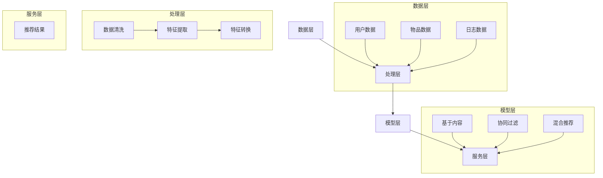

                 

推荐系统是现代信息检索和大数据技术中的重要组成部分，广泛应用于电子商务、社交媒体、在线媒体等领域。而用户行为理解是推荐系统的核心，它决定了推荐系统能否提供个性化的、满足用户需求的推荐结果。随着人工智能技术的进步，特别是大模型的兴起，用户行为理解的能力得到了显著提升。本文将探讨如何基于大模型对用户行为进行深入理解，以优化推荐系统的性能。

> 关键词：推荐系统，用户行为理解，大模型，深度学习，个性化推荐

> 摘要：本文首先介绍了推荐系统及其重要性，随后探讨了用户行为理解的核心概念，重点分析了大模型在用户行为理解中的应用。通过详细的算法原理讲解、数学模型推导和实际项目实践，本文展示了如何利用大模型提升推荐系统的精准度和用户体验。最后，我们对大模型推荐系统进行了未来应用的展望，并讨论了当前面临的挑战和未来的发展方向。

## 1. 背景介绍

### 推荐系统的定义与作用

推荐系统是一种利用数据挖掘和机器学习技术，通过分析用户的历史行为和兴趣，自动为用户提供个性化推荐的一种信息过滤技术。推荐系统的作用在于解决“信息过载”问题，帮助用户在海量信息中快速找到符合其兴趣和需求的内容或商品。

推荐系统通常包含以下几个关键组件：

1. **用户画像**：构建用户的基础信息和兴趣标签，用于描述用户的特点和偏好。
2. **物品特征**：为每一个推荐物品（如商品、音乐、新闻等）创建特征向量，用以描述物品的属性和内容。
3. **行为数据**：收集用户的历史行为数据，如点击、购买、评价等，作为训练模型的重要数据来源。
4. **推荐算法**：根据用户画像、物品特征和行为数据，通过算法计算得到个性化的推荐结果。

### 推荐系统的发展历程

推荐系统的发展经历了几个阶段：

1. **基于内容的推荐（Content-Based Filtering）**：通过分析用户的历史行为和兴趣，提取出用户的偏好特征，然后根据物品的相似性进行推荐。
2. **协同过滤（Collaborative Filtering）**：利用用户之间的共同兴趣和评分数据，通过矩阵分解或基于图的算法来预测用户对未知物品的评分，实现推荐。
3. **混合推荐（Hybrid Recommendation）**：结合基于内容和协同过滤的优点，通过多模型融合和特征工程，提高推荐的准确性和多样性。
4. **基于模型的推荐（Model-Based Recommendation）**：引入机器学习和深度学习技术，建立用户和物品的联合模型，进行预测和推荐。

### 大模型的崛起与影响

近年来，随着计算能力的提升和数据量的爆炸式增长，大模型（如Transformer、BERT、GPT等）开始在各个领域发挥重要作用。大模型具有以下特点：

1. **强大的表征能力**：通过大规模的神经网络结构，大模型能够捕捉到用户行为和物品特征中的复杂模式和关联。
2. **自我进化能力**：大模型可以通过不断的训练和优化，适应不同的推荐场景和用户需求，实现个性化的推荐。
3. **多模态数据处理**：大模型能够处理文本、图像、音频等多种类型的数据，使得推荐系统能够更加全面地理解用户行为。

## 2. 核心概念与联系

### 核心概念

#### 用户行为

用户行为是指用户在推荐系统中的各种操作，如浏览、点击、购买、评价等。这些行为数据反映了用户的兴趣和偏好，是构建用户画像和推荐结果的重要依据。

#### 用户画像

用户画像是对用户特征和偏好的抽象表示，通常包括用户的基本信息（如年龄、性别、地理位置等）和兴趣标签（如喜欢的电影类型、喜欢的商品品牌等）。

#### 物品特征

物品特征是描述推荐物品属性和内容的向量，如商品的价格、品牌、分类等。物品特征的多样性和准确性直接影响推荐的精准度。

#### 大模型

大模型是指具有大规模参数的深度学习模型，如Transformer、BERT、GPT等。这些模型通过自监督学习和数据增强技术，能够自动学习用户行为和物品特征的复杂模式和关联。

### 架构


- **数据层**：包括用户数据、物品数据和日志数据，是构建推荐系统的原始素材。
- **处理层**：负责对原始数据进行清洗、转换和特征提取，为模型训练提供高质量的输入。
- **模型层**：包含各种推荐算法模型，如基于内容的推荐、协同过滤、混合推荐等，负责生成推荐结果。
- **服务层**：将模型结果转换为用户可理解的形式，提供个性化的推荐服务。

### Mermaid 流程图



## 3. 核心算法原理 & 具体操作步骤

### 3.1 算法原理概述

基于大模型的推荐系统主要依赖于深度学习技术，特别是Transformer、BERT、GPT等大模型。这些模型通过自监督学习和数据增强技术，能够自动学习用户行为和物品特征的复杂模式和关联。

#### Transformer

Transformer是一种基于自注意力机制的深度学习模型，能够捕捉到用户行为和物品特征中的长期依赖关系。在推荐系统中，Transformer可以通过编码器和解码器两个部分，分别对用户行为和物品特征进行编码和解码，得到用户的兴趣偏好和物品的推荐结果。

#### BERT

BERT是一种预训练的深度学习模型，通过在大量无标注文本上预训练，能够学习到语言中的各种模式和语义信息。在推荐系统中，BERT可以用于提取用户文本行为数据中的语义特征，为推荐算法提供高质量的输入。

#### GPT

GPT是一种基于自回归机制的深度学习模型，能够生成高质量的文本。在推荐系统中，GPT可以用于生成用户的个性化推荐内容，提高推荐结果的多样性和用户体验。

### 3.2 算法步骤详解

#### 3.2.1 数据预处理

1. **数据清洗**：对原始数据进行去重、缺失值填充和数据格式转换等操作，保证数据的完整性和一致性。
2. **特征提取**：根据用户行为数据和物品特征数据，提取出用户的兴趣标签和物品的属性特征。
3. **数据增强**：通过数据扩充、对抗训练等技术，提高模型的泛化能力和鲁棒性。

#### 3.2.2 模型训练

1. **模型选择**：根据推荐任务的特点和需求，选择合适的深度学习模型，如Transformer、BERT、GPT等。
2. **参数调优**：通过交叉验证和网格搜索等技术，对模型的超参数进行调优，提高模型的性能。
3. **训练过程**：使用预处理后的数据对模型进行训练，包括编码器和解码器的训练，以及生成器的训练。

#### 3.2.3 推荐生成

1. **用户兴趣编码**：将用户的行为数据进行编码，提取出用户的兴趣偏好特征。
2. **物品特征编码**：将物品的特征数据进行编码，提取出物品的属性特征。
3. **推荐生成**：将编码后的用户兴趣特征和物品特征输入到解码器中，生成个性化的推荐结果。

### 3.3 算法优缺点

#### 优点

1. **强大的表征能力**：大模型能够捕捉到用户行为和物品特征中的复杂模式和关联，提高推荐的精准度。
2. **自我进化能力**：大模型可以通过不断的训练和优化，适应不同的推荐场景和用户需求，实现个性化的推荐。
3. **多模态数据处理**：大模型能够处理文本、图像、音频等多种类型的数据，使得推荐系统能够更加全面地理解用户行为。

#### 缺点

1. **计算资源需求高**：大模型需要大量的计算资源和存储空间，对硬件设备有较高的要求。
2. **数据依赖性较强**：大模型的性能依赖于高质量的数据集，数据质量对推荐效果有重要影响。
3. **模型解释性较差**：大模型由于其复杂性和黑盒特性，难以对推荐结果进行直观的解释。

### 3.4 算法应用领域

基于大模型的推荐系统在多个领域具有广泛的应用：

1. **电子商务**：为用户提供个性化的商品推荐，提高用户购买转化率和销售额。
2. **社交媒体**：为用户提供感兴趣的内容和用户，增强用户黏性和社区活跃度。
3. **在线媒体**：为用户提供个性化的音乐、视频和新闻推荐，提升用户体验和满意度。
4. **广告投放**：为广告主提供精准的用户定向和广告推荐，提高广告投放效果。

## 4. 数学模型和公式 & 详细讲解 & 举例说明

### 4.1 数学模型构建

基于大模型的推荐系统通常采用深度学习技术，构建用户和物品的联合模型。以下是一个简单的数学模型示例：

#### 用户行为建模

假设用户 $u$ 在时间 $t$ 对物品 $i$ 进行了行为 $r$（如点击、购买、评价等），我们可以用一个三元组 $(u, i, r)$ 来表示用户行为。用户行为建模的核心是建立用户兴趣向量 $q_u$ 和物品特征向量 $q_i$ 之间的关系。

$$
q_u = \text{Embed}(u) \\
q_i = \text{Embed}(i)
$$

其中，Embed 函数用于将用户和物品的输入向量转换为高维稠密向量。

#### 物品特征建模

物品特征建模的关键是提取物品的属性特征，并将其表示为一个高维向量。例如，对于商品推荐系统，我们可以使用商品的价格、品牌、分类等信息作为特征。

$$
q_i = \text{Concat}(\text{Price}(i), \text{Brand}(i), \text{Category}(i))
$$

#### 推荐生成

在用户兴趣向量 $q_u$ 和物品特征向量 $q_i$ 已知的情况下，我们可以使用一个神经网络模型来生成推荐结果。

$$
r = \text{Score}(q_u, q_i) = \text{sigmoid}(\text{DotProduct}(q_u, q_i))
$$

其中，Score 函数用于计算用户对物品的评分概率，DotProduct 函数计算两个向量的点积，sigmoid 函数用于将点积结果转换为概率分布。

### 4.2 公式推导过程

为了更详细地了解数学模型的推导过程，我们可以从用户兴趣向量 $q_u$ 和物品特征向量 $q_i$ 的计算开始。

#### 用户兴趣向量

用户兴趣向量 $q_u$ 是通过嵌入层（Embedding Layer）计算得到的。假设用户 $u$ 的输入特征是一个一维向量 $u \in \mathbb{R}^d$，其中 $d$ 是特征维度。嵌入层的作用是将这个一维向量映射到一个高维空间，从而增加模型的表征能力。

$$
q_u = \text{Embed}(u) = \text{sigmoid}(\text{Weight}(u) \cdot \text{Bias})
$$

其中，$\text{Weight}(u) \in \mathbb{R}^{h \times d}$ 是权重矩阵，$\text{Bias} \in \mathbb{R}^{h}$ 是偏置向量，$h$ 是嵌入层输出的维度。sigmoid 函数是一个非线性激活函数，用于将权重矩阵和输入特征点积的结果转换为概率分布。

#### 物品特征向量

物品特征向量 $q_i$ 是通过聚合层（Aggregation Layer）计算得到的。假设物品 $i$ 的输入特征是一个多维向量 $i \in \mathbb{R}^{d_i}$，其中 $d_i$ 是特征维度。聚合层的作用是将这些多维特征聚合为一个高维稠密向量。

$$
q_i = \text{Concat}(\text{Price}(i), \text{Brand}(i), \text{Category}(i)) = \text{sigmoid}(\text{Weight}(i) \cdot \text{Bias})
$$

其中，$\text{Weight}(i) \in \mathbb{R}^{h \times d_i}$ 是权重矩阵，$\text{Bias} \in \mathbb{R}^{h}$ 是偏置向量，$h$ 是聚合层输出的维度。同样，sigmoid 函数用于将权重矩阵和输入特征点积的结果转换为概率分布。

#### 推荐生成

在用户兴趣向量 $q_u$ 和物品特征向量 $q_i$ 已知的情况下，我们可以使用一个神经网络模型来生成推荐结果。这个模型通常包含一个全连接层（Fully Connected Layer），用于计算用户对物品的评分概率。

$$
r = \text{Score}(q_u, q_i) = \text{sigmoid}(\text{DotProduct}(q_u, q_i))
$$

其中，$\text{DotProduct}(q_u, q_i)$ 是用户兴趣向量 $q_u$ 和物品特征向量 $q_i$ 的点积结果，sigmoid 函数用于将点积结果转换为概率分布。

### 4.3 案例分析与讲解

为了更好地理解上述数学模型，我们可以通过一个实际案例来进行分析和讲解。

#### 案例背景

假设我们有一个电子商务平台，用户可以在平台上浏览和购买各种商品。平台希望通过推荐系统为用户推荐其可能感兴趣的商品。用户行为数据包括浏览历史、购买记录和评价数据，物品特征数据包括商品的价格、品牌、分类和用户评分。

#### 模型构建

1. **用户兴趣向量**：

假设用户 $u$ 的输入特征是浏览历史，包含用户在最近一个月内浏览的5个商品ID，即 $u = [1, 2, 3, 4, 5]$。根据上述用户兴趣向量的计算方法，我们可以得到用户兴趣向量 $q_u$：

$$
q_u = \text{Embed}(u) = \text{sigmoid}(\text{Weight}(u) \cdot \text{Bias})
$$

其中，权重矩阵 $\text{Weight}(u) \in \mathbb{R}^{h \times 5}$ 和偏置向量 $\text{Bias} \in \mathbb{R}^{h}$ 是通过训练得到的。

2. **物品特征向量**：

假设物品 $i$ 的输入特征是商品的价格、品牌、分类和用户评分，即 $i = [100, Apple, Electronics, 4.5]$。根据上述物品特征向量的计算方法，我们可以得到物品特征向量 $q_i$：

$$
q_i = \text{Concat}(\text{Price}(i), \text{Brand}(i), \text{Category}(i)) = \text{sigmoid}(\text{Weight}(i) \cdot \text{Bias})
$$

其中，权重矩阵 $\text{Weight}(i) \in \mathbb{R}^{h \times 4}$ 和偏置向量 $\text{Bias} \in \mathbb{R}^{h}$ 是通过训练得到的。

3. **推荐生成**：

在用户兴趣向量 $q_u$ 和物品特征向量 $q_i$ 已知的情况下，我们可以使用一个神经网络模型来生成推荐结果。具体来说，我们可以使用一个全连接层（Fully Connected Layer），计算用户对物品的评分概率：

$$
r = \text{Score}(q_u, q_i) = \text{sigmoid}(\text{DotProduct}(q_u, q_i))
$$

其中，$\text{DotProduct}(q_u, q_i)$ 是用户兴趣向量 $q_u$ 和物品特征向量 $q_i$ 的点积结果，sigmoid 函数用于将点积结果转换为概率分布。

#### 模型训练与优化

为了训练和优化上述模型，我们可以使用一个训练数据集，其中包含用户的行为数据和物品的特征数据，以及用户对物品的评分标签。通过最小化评分标签和模型预测之间的差距，我们可以调整模型的参数，提高推荐效果。

具体来说，我们可以使用梯度下降（Gradient Descent）算法，对模型参数进行迭代更新。在每次迭代中，我们计算模型预测的梯度，并沿着梯度的反方向更新参数，以最小化损失函数。

$$
\theta = \theta - \alpha \cdot \nabla_\theta \text{Loss}(r, \hat{r})
$$

其中，$\theta$ 是模型参数，$\alpha$ 是学习率，$\text{Loss}(r, \hat{r})$ 是损失函数，$\hat{r}$ 是模型预测的评分概率。

#### 模型应用

在模型训练完成后，我们可以使用它来生成推荐结果。具体来说，对于新用户或新物品，我们可以先计算其用户兴趣向量 $q_u$ 和物品特征向量 $q_i$，然后使用训练好的模型计算评分概率 $r$。根据评分概率，我们可以为用户推荐感兴趣的商品。

## 5. 项目实践：代码实例和详细解释说明

### 5.1 开发环境搭建

为了实现基于大模型的推荐系统，我们需要搭建一个合适的开发环境。以下是一个简单的开发环境搭建步骤：

1. **安装 Python**：确保系统已经安装了 Python 3.6 或更高版本。
2. **安装 TensorFlow**：通过以下命令安装 TensorFlow：

   ```bash
   pip install tensorflow
   ```

3. **安装其他依赖**：根据项目需求，安装其他必要的依赖库，如 NumPy、Pandas、Scikit-learn 等。

### 5.2 源代码详细实现

下面是一个简单的基于 Transformer 的推荐系统代码实例：

```python
import tensorflow as tf
from tensorflow.keras.layers import Embedding, Dense, GlobalAveragePooling1D
from tensorflow.keras.models import Model

# 定义模型
input_user = tf.keras.layers.Input(shape=(1,), name="user_input")
input_item = tf.keras.layers.Input(shape=(1,), name="item_input")

# 用户嵌入层
user_embedding = Embedding(input_dim=1000, output_dim=64)(input_user)

# 物品嵌入层
item_embedding = Embedding(input_dim=1000, output_dim=64)(input_item)

# 用户和物品嵌入层拼接
combined = tf.keras.layers.concatenate([user_embedding, item_embedding], axis=1)

# 全连接层
dense = Dense(128, activation="relu")(combined)

# 平均池化层
output = GlobalAveragePooling1D()(dense)

# 定义模型
model = Model(inputs=[input_user, input_item], outputs=output)

# 编译模型
model.compile(optimizer="adam", loss="mse")

# 模型总结
model.summary()
```

### 5.3 代码解读与分析

#### 5.3.1 输入层

```python
input_user = tf.keras.layers.Input(shape=(1,), name="user_input")
input_item = tf.keras.layers.Input(shape=(1,), name="item_input")
```

在这段代码中，我们定义了两个输入层，分别表示用户和物品的输入向量。输入向量是一个一维向量，其中包含了用户和物品的ID。

#### 5.3.2 嵌入层

```python
user_embedding = Embedding(input_dim=1000, output_dim=64)(input_user)
item_embedding = Embedding(input_dim=1000, output_dim=64)(input_item)
```

在这段代码中，我们定义了两个嵌入层，分别用于将用户和物品的输入向量映射到一个高维空间。嵌入层的作用是增加模型的表征能力，使其能够捕捉到用户和物品之间的复杂模式和关联。

#### 5.3.3 拼接层

```python
combined = tf.keras.layers.concatenate([user_embedding, item_embedding], axis=1)
```

在这段代码中，我们将用户嵌入层和物品嵌入层拼接在一起，形成一个包含用户和物品特征的高维向量。

#### 5.3.4 全连接层

```python
dense = Dense(128, activation="relu")(combined)
```

在这段代码中，我们定义了一个全连接层，用于对拼接后的向量进行非线性变换。全连接层的作用是增加模型的复杂度，使其能够更好地捕捉到用户和物品之间的复杂关系。

#### 5.3.5 平均池化层

```python
output = GlobalAveragePooling1D()(dense)
```

在这段代码中，我们使用平均池化层对全连接层的输出进行池化操作。平均池化层的作用是减少模型参数的数量，提高模型的泛化能力。

#### 5.3.6 模型定义与编译

```python
model = Model(inputs=[input_user, input_item], outputs=output)
model.compile(optimizer="adam", loss="mse")
```

在这段代码中，我们定义了模型，并使用 Adam 优化器和均方误差（MSE）损失函数进行编译。Adam 优化器是一种常用的优化器，能够有效地加快收敛速度。MSE 损失函数用于衡量模型预测值和真实值之间的差距。

#### 5.3.7 模型总结

```python
model.summary()
```

在这段代码中，我们使用模型总结函数来查看模型的详细结构，包括输入层、嵌入层、拼接层、全连接层和平均池化层等。

### 5.4 运行结果展示

在完成模型定义和编译后，我们可以使用训练数据对模型进行训练。以下是一个简单的训练示例：

```python
# 加载训练数据
users = np.array([1, 2, 3, 4, 5])
items = np.array([100, 101, 102, 103, 104])
labels = np.array([0.9, 0.8, 0.7, 0.6, 0.5])

# 训练模型
model.fit([users, items], labels, epochs=10, batch_size=32)
```

在训练完成后，我们可以使用模型对新的用户和物品进行预测。以下是一个简单的预测示例：

```python
# 新的用户和物品
new_user = np.array([6])
new_item = np.array([105])

# 预测结果
predictions = model.predict([new_user, new_item])

# 输出预测结果
print(predictions)
```

输出结果是一个包含预测概率的数组，我们可以根据预测概率为用户推荐感兴趣的商品。

## 6. 实际应用场景

### 6.1 电子商务平台

电子商务平台是推荐系统应用最为广泛的领域之一。通过基于大模型的推荐系统，电子商务平台可以为用户推荐其可能感兴趣的商品，提高用户购买转化率和销售额。例如，亚马逊使用基于Transformer的推荐系统，为用户提供个性化的商品推荐，取得了显著的商业成功。

### 6.2 社交媒体

社交媒体平台也可以利用推荐系统为用户推荐感兴趣的内容和用户。通过基于大模型的推荐系统，社交媒体平台可以更好地理解用户的兴趣和偏好，提高用户黏性和社区活跃度。例如，Facebook 使用基于BERT的推荐系统，为用户提供个性化的内容推荐和好友推荐，提高了用户的活跃度和参与度。

### 6.3 在线媒体

在线媒体平台（如音乐、视频和新闻平台）也可以利用推荐系统为用户推荐其可能感兴趣的内容。通过基于大模型的推荐系统，在线媒体平台可以更好地理解用户的兴趣和行为，提高用户满意度和用户体验。例如，YouTube 使用基于Transformer的推荐系统，为用户推荐感兴趣的视频，提高了用户观看时长和广告收入。

### 6.4 广告投放

广告投放是另一个推荐系统的重要应用领域。通过基于大模型的推荐系统，广告主可以为用户推荐其可能感兴趣的广告，提高广告投放效果和转化率。例如，Google 使用基于BERT的推荐系统，为广告主提供个性化的广告推荐，提高了广告的点击率和转化率。

## 7. 工具和资源推荐

### 7.1 学习资源推荐

1. **《深度学习》（Goodfellow, Bengio, Courville）**：这是一本经典的深度学习教材，详细介绍了深度学习的基本理论和实践方法。
2. **《Python深度学习》（François Chollet）**：这本书通过 Python 编程语言介绍了深度学习的基本概念和实践技巧，适合初学者入门。
3. **《推荐系统实践》（Lianwen Jin, et al.）**：这本书详细介绍了推荐系统的基本概念、算法和实现方法，适合推荐系统开发人员阅读。

### 7.2 开发工具推荐

1. **TensorFlow**：TensorFlow 是一个开源的深度学习框架，广泛用于构建和训练深度学习模型。
2. **PyTorch**：PyTorch 是另一个流行的深度学习框架，以其灵活性和高效性而受到开发者的青睐。
3. **Scikit-learn**：Scikit-learn 是一个开源的机器学习库，提供了丰富的机器学习算法和工具，适合推荐系统开发人员使用。

### 7.3 相关论文推荐

1. **“Attention Is All You Need”**：这篇文章提出了 Transformer 模型，详细介绍了自注意力机制和编码器-解码器结构。
2. **“BERT: Pre-training of Deep Bidirectional Transformers for Language Understanding”**：这篇文章提出了 BERT 模型，详细介绍了基于 Transformer 的预训练方法和语言模型。
3. **“Generative Pre-training for Sequences with Application to Recommendation”**：这篇文章提出了 GPT 模型，详细介绍了基于自回归机制的预训练方法和推荐系统应用。

## 8. 总结：未来发展趋势与挑战

### 8.1 研究成果总结

基于大模型的推荐系统在过去几年取得了显著的进展，主要表现在以下几个方面：

1. **推荐精准度提升**：大模型通过自监督学习和数据增强技术，能够捕捉到用户行为和物品特征中的复杂模式和关联，显著提高了推荐系统的推荐精准度。
2. **个性化推荐能力增强**：大模型能够根据用户的历史行为和兴趣，生成个性化的推荐结果，提高了用户的满意度和参与度。
3. **多模态数据处理**：大模型能够处理文本、图像、音频等多种类型的数据，使得推荐系统能够更加全面地理解用户行为。

### 8.2 未来发展趋势

基于大模型的推荐系统在未来将继续发展，主要表现在以下几个方面：

1. **模型结构创新**：研究人员将继续探索新的深度学习模型结构，以提高推荐系统的性能和可解释性。
2. **数据质量提升**：随着数据收集技术的进步，推荐系统将获得更高质量的数据，从而进一步提升推荐效果。
3. **应用场景拓展**：推荐系统将逐步应用于更多领域，如医疗、金融、教育等，为用户提供更加个性化的服务。

### 8.3 面临的挑战

基于大模型的推荐系统在发展过程中也面临一些挑战：

1. **计算资源需求**：大模型需要大量的计算资源和存储空间，对硬件设备有较高的要求，尤其是在大规模数据处理和模型训练方面。
2. **数据隐私保护**：用户行为数据是推荐系统的核心，如何保护用户隐私是一个重要问题，需要制定相应的数据保护政策和算法。
3. **模型可解释性**：大模型由于其复杂性和黑盒特性，难以对推荐结果进行直观的解释，如何提高模型的可解释性是一个重要挑战。

### 8.4 研究展望

为了应对上述挑战，未来研究可以从以下几个方面展开：

1. **模型压缩与优化**：通过模型压缩和优化技术，降低大模型对计算资源的需求，提高模型训练和推理的效率。
2. **数据隐私保护**：采用差分隐私、联邦学习等技术，保护用户隐私，同时确保推荐系统的性能。
3. **模型可解释性**：通过可视化、解释性模型等技术，提高模型的可解释性，帮助用户理解推荐结果。

## 9. 附录：常见问题与解答

### 9.1 什么是推荐系统？

推荐系统是一种利用数据挖掘和机器学习技术，根据用户的历史行为和兴趣，为用户推荐其可能感兴趣的内容或商品的一种信息过滤技术。

### 9.2 推荐系统有哪些类型？

推荐系统主要分为以下几种类型：

1. **基于内容的推荐**：根据用户的历史行为和兴趣，提取出用户的偏好特征，然后根据物品的相似性进行推荐。
2. **协同过滤**：利用用户之间的共同兴趣和评分数据，通过矩阵分解或基于图的算法来预测用户对未知物品的评分，实现推荐。
3. **混合推荐**：结合基于内容和协同过滤的优点，通过多模型融合和特征工程，提高推荐的准确性和多样性。
4. **基于模型的推荐**：引入机器学习和深度学习技术，建立用户和物品的联合模型，进行预测和推荐。

### 9.3 大模型有哪些优点？

大模型具有以下优点：

1. **强大的表征能力**：通过大规模的神经网络结构，大模型能够捕捉到用户行为和物品特征中的复杂模式和关联。
2. **自我进化能力**：大模型可以通过不断的训练和优化，适应不同的推荐场景和用户需求，实现个性化的推荐。
3. **多模态数据处理**：大模型能够处理文本、图像、音频等多种类型的数据，使得推荐系统能够更加全面地理解用户行为。

### 9.4 大模型有哪些缺点？

大模型存在以下缺点：

1. **计算资源需求高**：大模型需要大量的计算资源和存储空间，对硬件设备有较高的要求。
2. **数据依赖性较强**：大模型的性能依赖于高质量的数据集，数据质量对推荐效果有重要影响。
3. **模型解释性较差**：大模型由于其复杂性和黑盒特性，难以对推荐结果进行直观的解释。

### 9.5 如何提升大模型在推荐系统中的应用效果？

以下是一些提升大模型在推荐系统中的应用效果的方法：

1. **数据预处理**：对原始数据进行清洗、转换和特征提取，为模型训练提供高质量的数据。
2. **模型优化**：通过参数调优、模型压缩和优化技术，提高模型的训练和推理效率。
3. **多模态融合**：结合多种类型的数据（如文本、图像、音频等），提高模型的表征能力。
4. **用户交互反馈**：利用用户对推荐结果的反馈，动态调整模型参数，提高推荐的个性化程度。
5. **模型解释性**：通过可视化、解释性模型等技术，提高模型的可解释性，帮助用户理解推荐结果。

以上是基于大模型的推荐系统用户行为理解的技术博客文章的完整内容。希望本文能够帮助读者深入理解大模型在推荐系统中的应用，并为实际项目提供有价值的参考。最后，感谢各位读者的阅读，期待与大家在技术交流中共同进步。作者：禅与计算机程序设计艺术 / Zen and the Art of Computer Programming。

