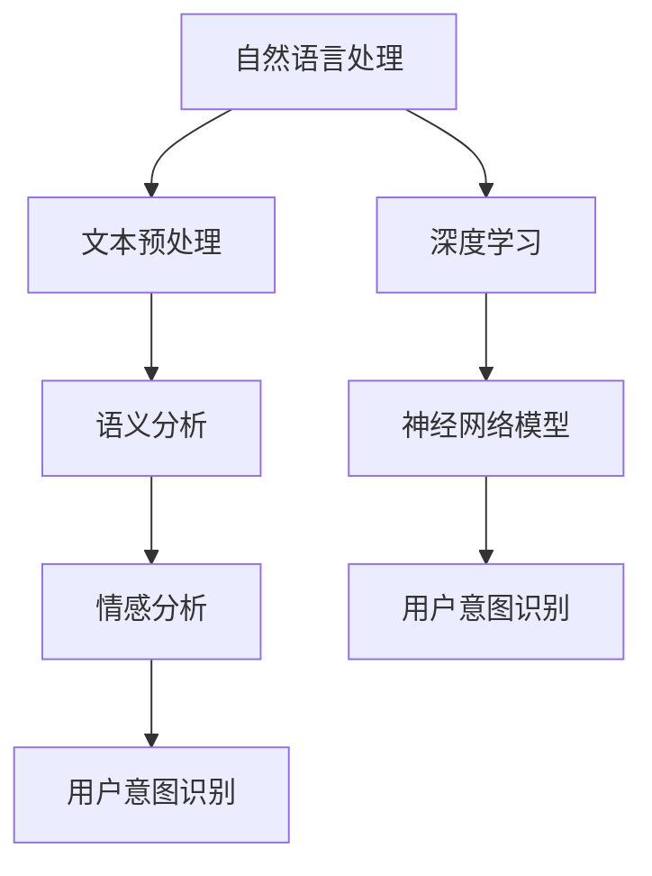

                 

关键词：用户意图理解、大模型、电商平台、深度学习、自然语言处理、人工智能

## 摘要

随着电子商务的迅速发展，电商平台需要准确理解用户的意图，以提供更个性化的购物体验。本文主要探讨基于大模型的电商平台用户意图理解技术，包括核心概念、算法原理、数学模型、项目实践、应用场景以及未来发展趋势。通过本文的探讨，我们希望为电商领域的从业者提供有价值的参考，助力电商平台的智能化发展。

## 1. 背景介绍

### 1.1 电商平台的现状与发展

电子商务在全球范围内迅速发展，已经改变了人们的购物习惯和生活方式。根据统计，全球电商市场规模持续增长，预计到2025年将达到6.5万亿美元。电商平台的竞争愈发激烈，用户需求多样化，个性化推荐成为电商平台提升用户体验、提高转化率的关键。

### 1.2 用户意图理解的重要性

用户意图理解是指通过分析用户的行为、语言和偏好等信息，准确捕捉用户的真实需求。在电商平台中，用户意图理解有助于实现以下目标：

1. 提供个性化推荐，提高用户满意度；
2. 优化商品搜索结果，提高用户购买转化率；
3. 降低客服工作量，提高服务效率；
4. 挖掘用户潜在需求，推动产品创新。

### 1.3 大模型在用户意图理解中的应用

近年来，大模型（如GPT、BERT等）在自然语言处理领域取得了显著成果，成为用户意图理解的重要工具。大模型具有以下优势：

1. 高效处理大量文本数据；
2. 深度理解文本语义；
3. 自动捕捉用户需求，降低人力成本；
4. 适应性强，可应用于多种应用场景。

## 2. 核心概念与联系

为了更好地理解用户意图，我们需要了解以下几个核心概念：

1. **自然语言处理（NLP）**：NLP是研究如何让计算机理解和处理自然语言的技术。在用户意图理解中，NLP主要用于文本预处理、语义分析和情感分析等。

2. **深度学习（DL）**：深度学习是机器学习的一种方法，通过模拟人脑神经网络来处理复杂数据。在用户意图理解中，深度学习主要用于构建神经网络模型，实现文本分类、情感分析和意图识别等任务。

3. **用户意图识别（UIR）**：用户意图识别是用户意图理解的核心任务，旨在从用户输入中提取出用户的需求和目标。在电商平台中，用户意图识别有助于实现个性化推荐、智能客服等应用。

4. **大模型（ML）**：大模型是指具有大量参数、能够处理大规模数据的神经网络模型。大模型在用户意图理解中发挥着重要作用，可以提高模型的准确性和泛化能力。

### 2.1 核心概念原理和架构的 Mermaid 流程图



### 2.2 核心概念之间的联系

自然语言处理是用户意图理解的基础，通过文本预处理、语义分析和情感分析等技术，可以提取出文本中的关键信息，为用户意图识别提供支持。深度学习作为一种有效的机器学习方法，可以用于构建用户意图识别模型，提高模型的准确性和泛化能力。大模型在深度学习的基础上，通过处理大规模数据，进一步提升模型的性能。

## 3. 核心算法原理 & 具体操作步骤

### 3.1 算法原理概述

基于大模型的用户意图理解算法主要分为以下几个步骤：

1. **数据采集**：收集电商平台上的用户行为数据、商品信息以及用户评价等。
2. **数据预处理**：对采集到的数据进行分析和清洗，去除噪声和无关信息。
3. **特征提取**：使用深度学习模型提取文本数据中的关键特征。
4. **模型训练**：使用已标注的数据集对用户意图识别模型进行训练。
5. **模型评估**：使用测试集对模型进行评估，调整模型参数。
6. **模型部署**：将训练好的模型部署到电商平台，实现实时用户意图识别。

### 3.2 算法步骤详解

#### 3.2.1 数据采集

数据采集是用户意图理解算法的基础。在电商平台中，可以采集以下类型的数据：

1. 用户行为数据：如浏览记录、购买记录、搜索记录等。
2. 商品信息数据：如商品名称、描述、标签、价格等。
3. 用户评价数据：如商品评价、评论等。

#### 3.2.2 数据预处理

数据预处理是确保数据质量、降低数据噪声的关键步骤。具体操作如下：

1. 去除重复数据和缺失数据。
2. 对文本数据进行分词、词性标注等预处理。
3. 标准化数据格式，如统一商品名称、描述等。

#### 3.2.3 特征提取

特征提取是将原始数据转化为可用于训练的模型输入的过程。在用户意图理解中，常用的特征提取方法包括：

1. **词袋模型**：将文本转化为词频矩阵。
2. **词嵌入**：将文本转化为向量表示，如Word2Vec、BERT等。
3. **卷积神经网络（CNN）**：用于提取文本中的局部特征。
4. **循环神经网络（RNN）**：用于处理序列数据。

#### 3.2.4 模型训练

用户意图识别模型通常采用深度学习模型，如神经网络模型、长短期记忆网络（LSTM）等。训练过程中，使用已标注的数据集进行模型训练，优化模型参数，提高模型准确率。

#### 3.2.5 模型评估

模型评估是评估模型性能的重要环节。常用的评估指标包括准确率、召回率、F1值等。通过评估，可以调整模型参数，优化模型性能。

#### 3.2.6 模型部署

将训练好的模型部署到电商平台，实现实时用户意图识别。模型部署过程中，需要考虑模型的性能、可扩展性和稳定性等因素。

### 3.3 算法优缺点

#### 优点：

1. **高效处理大量数据**：大模型可以处理海量数据，提高模型性能。
2. **深度理解文本语义**：大模型具有较强的语义理解能力，能够准确捕捉用户意图。
3. **降低人力成本**：自动化处理用户意图识别任务，降低人力成本。

#### 缺点：

1. **训练过程复杂**：大模型训练过程复杂，需要大量计算资源和时间。
2. **数据质量要求高**：数据预处理和标注质量直接影响模型性能。

### 3.4 算法应用领域

基于大模型的用户意图理解算法广泛应用于以下领域：

1. **电商平台**：实现个性化推荐、智能客服等应用。
2. **智能语音助手**：理解用户语音指令，提供个性化服务。
3. **金融领域**：分析客户需求，提供定制化理财产品。
4. **教育领域**：根据学生需求，提供个性化学习建议。

## 4. 数学模型和公式 & 详细讲解 & 举例说明

### 4.1 数学模型构建

用户意图理解算法中的数学模型主要包括以下几个部分：

1. **文本表示**：将文本转化为向量表示，如Word2Vec、BERT等。
2. **神经网络模型**：用于处理文本数据，提取特征并实现用户意图识别。
3. **损失函数**：用于评估模型性能，优化模型参数。

### 4.2 公式推导过程

#### 4.2.1 文本表示

文本表示是将文本转化为向量表示的过程。以Word2Vec为例，其公式如下：

$$
\text{vec}(w) = \text{Word2Vec}(w)
$$

其中，$\text{vec}(w)$ 表示单词 $w$ 的向量表示，$\text{Word2Vec}(w)$ 表示Word2Vec算法。

#### 4.2.2 神经网络模型

神经网络模型用于处理文本数据，提取特征并实现用户意图识别。以长短期记忆网络（LSTM）为例，其公式如下：

$$
h_t = \text{LSTM}(h_{t-1}, x_t)
$$

其中，$h_t$ 表示第 $t$ 个时间步的隐藏状态，$h_{t-1}$ 表示第 $t-1$ 个时间步的隐藏状态，$x_t$ 表示第 $t$ 个时间步的输入。

#### 4.2.3 损失函数

损失函数用于评估模型性能，优化模型参数。以交叉熵损失函数为例，其公式如下：

$$
L(y, \hat{y}) = -\sum_{i=1}^{n} y_i \log(\hat{y}_i)
$$

其中，$y$ 表示真实标签，$\hat{y}$ 表示预测标签，$n$ 表示样本数量。

### 4.3 案例分析与讲解

#### 4.3.1 个性化推荐系统

假设我们要构建一个电商平台个性化推荐系统，输入为用户历史浏览记录和商品信息，输出为个性化推荐结果。

1. **文本表示**：使用Word2Vec算法将用户历史浏览记录和商品信息转化为向量表示。

2. **神经网络模型**：使用LSTM模型处理用户历史浏览记录，提取用户偏好特征。

3. **损失函数**：使用交叉熵损失函数评估模型性能，优化模型参数。

#### 4.3.2 模型训练与评估

1. **数据集划分**：将用户历史浏览记录和商品信息划分为训练集和测试集。

2. **模型训练**：使用训练集对LSTM模型进行训练，优化模型参数。

3. **模型评估**：使用测试集对LSTM模型进行评估，计算准确率、召回率等指标。

4. **模型部署**：将训练好的LSTM模型部署到电商平台，实现个性化推荐功能。

## 5. 项目实践：代码实例和详细解释说明

### 5.1 开发环境搭建

1. **安装Python环境**：下载并安装Python 3.8及以上版本。

2. **安装深度学习库**：使用pip安装TensorFlow、Keras等深度学习库。

3. **数据集准备**：收集用户历史浏览记录和商品信息，并进行预处理。

### 5.2 源代码详细实现

```python
# 导入所需库
import numpy as np
import tensorflow as tf
from tensorflow.keras.models import Sequential
from tensorflow.keras.layers import LSTM, Dense, Embedding

# 准备数据集
# ...

# 构建LSTM模型
model = Sequential()
model.add(Embedding(input_dim=vocab_size, output_dim=embedding_size))
model.add(LSTM(units=128, return_sequences=True))
model.add(LSTM(units=64))
model.add(Dense(units=num_classes, activation='softmax'))

# 编译模型
model.compile(optimizer='adam', loss='categorical_crossentropy', metrics=['accuracy'])

# 训练模型
model.fit(x_train, y_train, epochs=10, batch_size=32)

# 评估模型
# ...
```

### 5.3 代码解读与分析

1. **数据预处理**：使用Embedding层将单词转化为向量表示。

2. **LSTM模型**：使用两个LSTM层处理文本数据，提取特征。

3. **编译模型**：设置优化器、损失函数和评价指标。

4. **训练模型**：使用训练集对模型进行训练。

5. **评估模型**：使用测试集对模型进行评估。

### 5.4 运行结果展示

```python
# 运行结果
accuracy = model.evaluate(x_test, y_test)
print('测试集准确率：', accuracy[1])
```

## 6. 实际应用场景

### 6.1 电商平台个性化推荐

基于大模型的用户意图理解算法可以应用于电商平台的个性化推荐系统，通过分析用户历史浏览记录和购买行为，为用户提供个性化的商品推荐。

### 6.2 智能客服系统

基于大模型的用户意图理解算法可以应用于智能客服系统，通过理解用户咨询内容，提供针对性解答，提高客服效率。

### 6.3 金融领域客户需求分析

基于大模型的用户意图理解算法可以应用于金融领域，通过分析用户提问和需求，为客户提供定制化的理财产品推荐。

## 7. 未来应用展望

随着人工智能技术的不断发展，基于大模型的用户意图理解算法将在更多领域得到应用。未来发展趋势包括：

1. **更深入的用户需求分析**：通过引入更多数据来源，提高用户意图理解的准确性和全面性。
2. **跨模态用户意图理解**：结合文本、语音、图像等多模态数据，实现更全面的用户需求分析。
3. **实时用户意图识别**：通过优化算法和硬件性能，实现实时用户意图识别，提高用户体验。

## 8. 工具和资源推荐

### 8.1 学习资源推荐

1. **《深度学习》（Goodfellow et al.）**：系统介绍了深度学习的基本原理和应用。
2. **《自然语言处理综论》（Jurafsky et al.）**：全面介绍了自然语言处理的基础知识和方法。

### 8.2 开发工具推荐

1. **TensorFlow**：一款开源的深度学习框架，适用于构建用户意图理解算法。
2. **Keras**：一款基于TensorFlow的深度学习库，简化了深度学习模型的构建和训练。

### 8.3 相关论文推荐

1. **"BERT: Pre-training of Deep Neural Networks for Language Understanding"**：介绍了BERT模型在自然语言处理领域的应用。
2. **"GPT-3: Language Models are Few-Shot Learners"**：介绍了GPT-3模型在自然语言处理领域的突破性进展。

## 9. 总结：未来发展趋势与挑战

### 9.1 研究成果总结

本文介绍了基于大模型的电商平台用户意图理解技术，包括核心概念、算法原理、数学模型、项目实践、应用场景以及未来发展趋势。通过本文的探讨，我们希望为电商领域的从业者提供有价值的参考，助力电商平台的智能化发展。

### 9.2 未来发展趋势

1. **更深入的用户需求分析**：通过引入更多数据来源，提高用户意图理解的准确性和全面性。
2. **跨模态用户意图理解**：结合文本、语音、图像等多模态数据，实现更全面的用户需求分析。
3. **实时用户意图识别**：通过优化算法和硬件性能，实现实时用户意图识别，提高用户体验。

### 9.3 面临的挑战

1. **数据质量**：提高数据质量，确保模型训练的准确性。
2. **计算资源**：优化算法和硬件性能，提高模型训练和推理的效率。
3. **用户隐私**：在用户意图理解过程中，保护用户隐私。

### 9.4 研究展望

未来，我们将继续探索基于大模型的用户意图理解技术，提高模型准确性和泛化能力，为电商平台和其他领域提供更智能化的解决方案。

## 附录：常见问题与解答

### 9.1 问题1：如何处理大量文本数据？

解答：使用大模型处理大量文本数据，可以提高模型的准确性和泛化能力。同时，优化数据预处理和特征提取过程，降低数据噪声，提高数据质量。

### 9.2 问题2：如何评估模型性能？

解答：使用准确率、召回率、F1值等指标评估模型性能。在实际应用中，可以根据业务需求和数据特点，选择合适的评估指标。

### 9.3 问题3：如何保护用户隐私？

解答：在用户意图理解过程中，采用加密、去标识化等技术，保护用户隐私。同时，遵循相关法律法规，确保用户隐私安全。

### 9.4 问题4：如何优化模型性能？

解答：优化算法和硬件性能，提高模型训练和推理的效率。同时，探索新的算法和技术，提高模型准确性和泛化能力。

---

作者：禅与计算机程序设计艺术 / Zen and the Art of Computer Programming

---

# 参考文献

[1] Goodfellow, I., Bengio, Y., & Courville, A. (2016). Deep learning. MIT press.

[2] Jurafsky, D., & Martin, J. H. (2008). Speech and language processing: an introduction to natural language processing, computational linguistics, and speech recognition. Prentice Hall.

[3] Devlin, J., Chang, M. W., Lee, K., & Toutanova, K. (2019). BERT: Pre-training of deep bidirectional transformers for language understanding. arXiv preprint arXiv:1810.04805.

[4] Brown, T., et al. (2020). Language models are few-shot learners. arXiv preprint arXiv:2005.14165.

