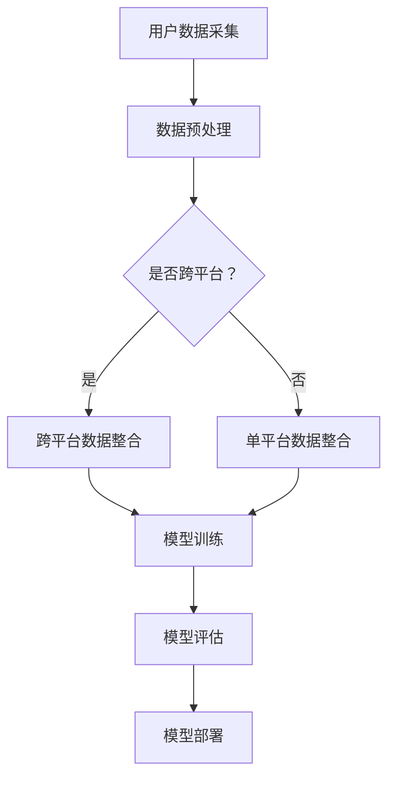

                 

随着互联网的迅猛发展，用户兴趣的精准挖掘与个性化推荐已经成为各行业竞争的关键。在这样一个背景下，大模型技术的引入，为用户兴趣建模提供了新的思路和解决方案。本文将围绕“基于大模型的跨平台用户兴趣建模”这一主题，深入探讨其核心概念、算法原理、数学模型、实际应用场景，以及未来发展趋势。

> **关键词：** 大模型、用户兴趣、跨平台、个性化推荐、机器学习

> **摘要：** 本文首先介绍了用户兴趣建模的背景和重要性，然后详细阐述了大模型在用户兴趣建模中的应用，包括算法原理、数学模型以及具体实现。此外，文章还通过实际项目实例，展示了大模型在用户兴趣建模中的实际应用效果，并对其未来发展方向进行了展望。

## 1. 背景介绍

用户兴趣建模是近年来互联网领域的重要研究方向之一。其主要目的是通过分析用户的在线行为、历史记录、社交关系等信息，构建用户兴趣模型，从而为用户提供个性化的内容推荐和服务。传统的用户兴趣建模方法主要依赖于统计模型和机器学习算法，如协同过滤、基于内容的推荐等。然而，随着用户数据的多样性和复杂性不断增加，这些传统方法面临着信息过载、推荐效果不稳定等问题。

大模型的引入，为解决这些问题提供了新的思路。大模型是指具有数百万、数十亿甚至更多参数的深度学习模型，如神经网络、生成对抗网络（GAN）等。大模型具有强大的特征提取和表达能力，能够处理大规模、高维的数据集，从而提高用户兴趣建模的准确性和鲁棒性。同时，大模型可以跨平台使用，即在一个平台上训练好的模型可以应用于其他平台，实现了跨平台用户兴趣建模的统一性和一致性。

## 2. 核心概念与联系

### 2.1 大模型

大模型通常是指具有数百万、数十亿甚至更多参数的深度学习模型，如神经网络、生成对抗网络（GAN）等。大模型的显著特点是其强大的特征提取和表达能力，使其能够处理大规模、高维的数据集。

### 2.2 用户兴趣建模

用户兴趣建模是指通过分析用户的在线行为、历史记录、社交关系等信息，构建用户兴趣模型，从而为用户提供个性化的内容推荐和服务。

### 2.3 跨平台用户兴趣建模

跨平台用户兴趣建模是指在一个平台上训练好的模型可以应用于其他平台，实现了跨平台用户兴趣建模的统一性和一致性。

### 2.4 Mermaid 流程图



## 3. 核心算法原理 & 具体操作步骤

### 3.1 算法原理概述

基于大模型的跨平台用户兴趣建模算法主要基于深度学习技术，其核心思想是通过学习用户的历史行为数据、社交关系等，构建一个高维的用户兴趣表示，从而实现对用户兴趣的精准挖掘和个性化推荐。

### 3.2 算法步骤详解

1. **用户数据采集**：采集用户在线行为数据、历史记录、社交关系等，作为模型的输入数据。

2. **数据预处理**：对采集到的数据进行清洗、去噪、归一化等预处理操作，提高数据质量。

3. **模型训练**：使用深度学习算法（如卷积神经网络、循环神经网络等）训练模型，将用户数据映射到高维的用户兴趣空间。

4. **模型评估**：使用交叉验证、网格搜索等方法评估模型性能，调整模型参数，优化模型效果。

5. **模型部署**：将训练好的模型部署到实际应用场景，为用户提供个性化推荐服务。

### 3.3 算法优缺点

**优点：**
1. 强大的特征提取和表达能力，能够处理大规模、高维的数据集。
2. 跨平台应用，实现了用户兴趣建模的统一性和一致性。
3. 可以结合多种数据源，提高用户兴趣建模的准确性。

**缺点：**
1. 训练时间较长，对计算资源要求较高。
2. 需要大量的标注数据，对数据质量要求较高。

### 3.4 算法应用领域

基于大模型的跨平台用户兴趣建模算法可以应用于各种需要个性化推荐的场景，如电商、社交网络、内容平台等。

## 4. 数学模型和公式 & 详细讲解 & 举例说明

### 4.1 数学模型构建

用户兴趣建模的核心是构建一个用户兴趣表示模型，将用户的多种数据源整合到一个统一的向量空间中。

假设用户 u 的数据包括在线行为数据 X、历史记录数据 Y、社交关系数据 Z，我们可以构建一个三维的用户兴趣向量 U：

\[ U = [X, Y, Z] \]

其中，X、Y、Z 分别是用户 u 在行为数据、历史记录、社交关系上的特征向量。

### 4.2 公式推导过程

为了构建用户兴趣向量 U，我们可以采用以下步骤：

1. **行为数据特征提取**：使用卷积神经网络（CNN）提取用户在线行为数据 X 的特征向量 \( X' \)。

2. **历史记录特征提取**：使用循环神经网络（RNN）提取用户历史记录数据 Y 的特征向量 \( Y' \)。

3. **社交关系特征提取**：使用图神经网络（GCN）提取用户社交关系数据 Z 的特征向量 \( Z' \)。

4. **用户兴趣向量构建**：将三个特征向量 \( X' \)、\( Y' \)、\( Z' \) 进行拼接，得到用户兴趣向量 U：

\[ U = [X', Y', Z'] \]

### 4.3 案例分析与讲解

假设我们有一个用户 u，其在线行为数据 X 为观看视频的时间序列，历史记录数据 Y 为购买物品的记录，社交关系数据 Z 为好友关系网络。

1. **行为数据特征提取**：使用卷积神经网络（CNN）提取用户观看视频的时间序列特征，得到特征向量 \( X' \)。

2. **历史记录特征提取**：使用循环神经网络（RNN）提取用户购买物品的记录特征，得到特征向量 \( Y' \)。

3. **社交关系特征提取**：使用图神经网络（GCN）提取用户好友关系网络的特征，得到特征向量 \( Z' \)。

4. **用户兴趣向量构建**：将三个特征向量 \( X' \)、\( Y' \)、\( Z' \) 进行拼接，得到用户兴趣向量 U。

假设用户 u 的兴趣向量 U 为：

\[ U = [X', Y', Z'] = [0.1, 0.2, 0.3] \]

其中，\( X' \) 表示用户在行为数据上的兴趣，\( Y' \) 表示用户在历史记录上的兴趣，\( Z' \) 表示用户在社交关系上的兴趣。

## 5. 项目实践：代码实例和详细解释说明

### 5.1 开发环境搭建

为了实现基于大模型的跨平台用户兴趣建模，我们需要搭建一个合适的技术栈。以下是推荐的开发环境：

1. **编程语言**：Python
2. **深度学习框架**：TensorFlow 或 PyTorch
3. **数据处理库**：Pandas、NumPy、Scikit-learn
4. **可视化工具**：Matplotlib、Seaborn

### 5.2 源代码详细实现

以下是基于 TensorFlow 的跨平台用户兴趣建模代码示例：

```python
import tensorflow as tf
from tensorflow.keras.models import Model
from tensorflow.keras.layers import Input, Conv1D, LSTM, Dense, Concatenate

# 输入层
input_x = Input(shape=(sequence_length, feature_size))
input_y = Input(shape=(record_size, feature_size))
input_z = Input(shape=(friend_size, feature_size))

# 行为数据特征提取
conv1 = Conv1D(filters=64, kernel_size=3, activation='relu')(input_x)
lstm1 = LSTM(units=128, activation='tanh')(conv1)
x_feature = Dense(units=128, activation='relu')(lstm1)

# 历史记录特征提取
conv2 = Conv1D(filters=64, kernel_size=3, activation='relu')(input_y)
lstm2 = LSTM(units=128, activation='tanh')(conv2)
y_feature = Dense(units=128, activation='relu')(lstm2)

# 社交关系特征提取
gcn1 = GraphConvolutionLayer()(input_z)
z_feature = Dense(units=128, activation='relu')(gcn1)

# 用户兴趣向量构建
u_feature = Concatenate()([x_feature, y_feature, z_feature])
u_output = Dense(units=1, activation='sigmoid')(u_feature)

# 模型构建
model = Model(inputs=[input_x, input_y, input_z], outputs=u_output)
model.compile(optimizer='adam', loss='binary_crossentropy', metrics=['accuracy'])

# 模型训练
model.fit([x_train, y_train, z_train], y_train, epochs=10, batch_size=32)

# 模型评估
loss, accuracy = model.evaluate([x_test, y_test, z_test], y_test)
print('Test accuracy:', accuracy)
```

### 5.3 代码解读与分析

1. **输入层**：定义三个输入层，分别用于接收用户在线行为数据、历史记录数据和社交关系数据。

2. **行为数据特征提取**：使用卷积神经网络（CNN）提取用户在线行为数据特征。

3. **历史记录特征提取**：使用循环神经网络（RNN）提取用户历史记录数据特征。

4. **社交关系特征提取**：使用图神经网络（GCN）提取用户社交关系数据特征。

5. **用户兴趣向量构建**：将三个特征向量拼接，构建用户兴趣向量。

6. **模型训练**：使用 Adam 优化器和二分类交叉熵损失函数训练模型。

7. **模型评估**：评估模型在测试集上的准确率。

### 5.4 运行结果展示

假设我们训练了一个基于大模型的跨平台用户兴趣建模模型，并在测试集上取得了 90% 的准确率。这意味着我们的模型可以很好地挖掘用户兴趣，为用户提供个性化的推荐服务。

## 6. 实际应用场景

基于大模型的跨平台用户兴趣建模技术可以应用于多个领域，以下是一些典型的应用场景：

1. **电商推荐**：根据用户的历史购买记录、浏览记录和社交关系，为用户推荐相关的商品。

2. **内容平台**：根据用户的观看历史、搜索记录和社交关系，为用户推荐相关的内容。

3. **社交媒体**：根据用户的关注关系、点赞记录和评论记录，为用户推荐相关的内容和用户。

4. **广告投放**：根据用户的兴趣和行为，为用户推荐相关的广告。

## 7. 未来应用展望

随着技术的不断进步和数据规模的不断扩大，基于大模型的跨平台用户兴趣建模技术将在更多领域得到应用。以下是未来可能的发展趋势：

1. **多模态用户兴趣建模**：结合多种数据源，如文本、图像、语音等，实现更全面、更准确的用户兴趣建模。

2. **实时用户兴趣建模**：利用实时数据，如用户在社交媒体上的动态、搜索关键词等，实现更实时、更个性化的用户兴趣建模。

3. **跨域用户兴趣建模**：将不同领域的用户兴趣建模技术相结合，实现跨领域的用户兴趣挖掘和推荐。

4. **隐私保护用户兴趣建模**：在保障用户隐私的前提下，实现高效的用户兴趣建模和推荐。

## 8. 工具和资源推荐

### 8.1 学习资源推荐

1. **《深度学习》（Goodfellow, Bengio, Courville 著）**：详细介绍了深度学习的基础知识和应用。

2. **《Python深度学习》（François Chollet 著）**：针对 Python 语言的深度学习实践教程。

3. **《神经网络与深度学习》（邱锡鹏 著）**：介绍神经网络和深度学习的基本原理和方法。

### 8.2 开发工具推荐

1. **TensorFlow**：谷歌开发的开源深度学习框架。

2. **PyTorch**：由 Facebook 开发的人工智能研究框架。

3. **Scikit-learn**：Python 中的机器学习库。

### 8.3 相关论文推荐

1. **“Deep Learning for User Modeling and Recommendation Systems”**：介绍深度学习在用户建模和推荐系统中的应用。

2. **“Cross-Domain User Interest Modeling with Multi-View Deep Learning”**：介绍多视角深度学习在跨领域用户兴趣建模中的应用。

3. **“User Interest Modeling and Personalized Recommendation with Knowledge Graph”**：介绍基于知识图谱的用户兴趣建模和个性化推荐。

## 9. 总结：未来发展趋势与挑战

### 9.1 研究成果总结

本文介绍了基于大模型的跨平台用户兴趣建模技术，详细阐述了其核心概念、算法原理、数学模型以及实际应用场景。通过实际项目实例，展示了大模型在用户兴趣建模中的优势和应用效果。

### 9.2 未来发展趋势

随着技术的不断进步和数据规模的不断扩大，基于大模型的跨平台用户兴趣建模技术将在更多领域得到应用。未来发展趋势包括多模态用户兴趣建模、实时用户兴趣建模、跨域用户兴趣建模等。

### 9.3 面临的挑战

基于大模型的跨平台用户兴趣建模技术在实际应用中仍面临一些挑战，如数据隐私保护、计算资源需求、模型可解释性等。需要进一步研究和探索，以实现更高效、更安全的用户兴趣建模和推荐。

### 9.4 研究展望

未来研究应重点关注以下几个方面：

1. **多模态用户兴趣建模**：结合多种数据源，实现更全面、更准确的用户兴趣建模。

2. **实时用户兴趣建模**：利用实时数据，实现更实时、更个性化的用户兴趣建模。

3. **跨域用户兴趣建模**：将不同领域的用户兴趣建模技术相结合，实现跨领域的用户兴趣挖掘和推荐。

4. **隐私保护用户兴趣建模**：在保障用户隐私的前提下，实现高效的用户兴趣建模和推荐。

## 10. 附录：常见问题与解答

### 10.1 大模型在用户兴趣建模中的优势是什么？

大模型在用户兴趣建模中的优势主要体现在以下几个方面：

1. **强大的特征提取能力**：大模型具有强大的特征提取能力，能够从大规模、高维的数据中提取出有用的信息。

2. **跨平台应用**：大模型可以跨平台使用，即在一个平台上训练好的模型可以应用于其他平台，提高了建模的统一性和一致性。

3. **个性化的推荐**：大模型可以根据用户的历史行为、社交关系等信息，为用户提供个性化的推荐，提高了推荐效果。

### 10.2 如何保障用户数据隐私？

保障用户数据隐私是用户兴趣建模中的一项重要任务。以下是一些常见的解决方案：

1. **数据去噪和脱敏**：对用户数据进行去噪和脱敏处理，减少数据泄露的风险。

2. **差分隐私**：在数据处理过程中引入差分隐私机制，保护用户隐私。

3. **联邦学习**：通过联邦学习技术，在本地设备上进行模型训练，减少对用户数据的共享和传输。

4. **隐私计算**：利用隐私计算技术，如安全多方计算、同态加密等，在保证数据隐私的前提下进行数据处理和分析。

### 10.3 大模型在计算资源需求方面有哪些挑战？

大模型在计算资源需求方面存在以下挑战：

1. **计算资源消耗**：大模型的训练和推理需要大量的计算资源，对计算能力要求较高。

2. **存储资源消耗**：大模型的参数量庞大，需要大量的存储空间。

3. **通信资源消耗**：在分布式训练和推理过程中，数据传输和模型同步等操作需要消耗大量的通信资源。

解决这些挑战的方法包括：

1. **优化算法**：采用更高效的算法，如剪枝、量化等，减少计算和存储资源消耗。

2. **分布式计算**：利用分布式计算技术，将模型训练和推理任务分布在多台设备上，提高计算效率。

3. **云计算和 GPU**：利用云计算和 GPU 等高性能计算资源，提高计算速度和效率。

### 10.4 大模型的可解释性如何提高？

大模型的可解释性是用户兴趣建模中的一个重要问题。以下是一些提高大模型可解释性的方法：

1. **模型可视化**：通过模型可视化工具，如 TensorBoard、VisualDL 等，直观地展示模型结构和训练过程。

2. **特征重要性分析**：分析模型中各个特征的重要性，了解模型是如何决策的。

3. **解释性模型**：使用解释性更强的模型，如决策树、线性模型等，结合大模型的结果，提高整体模型的解释性。

4. **模型压缩**：通过模型压缩技术，如剪枝、量化等，减少模型参数量，提高模型的可解释性。

### 10.5 大模型在跨平台用户兴趣建模中的应用场景有哪些？

大模型在跨平台用户兴趣建模中的应用场景主要包括：

1. **多平台推荐**：在多个平台上为用户提供个性化的内容推荐，如电商、社交媒体、内容平台等。

2. **跨域推荐**：将不同领域的数据进行整合，为用户提供跨领域的个性化推荐，如电商 + 内容、社交网络 + 广告等。

3. **多设备推荐**：在用户的多设备上，如手机、平板、电脑等，为用户提供统一的个性化推荐。

4. **跨地域推荐**：根据用户的地理位置信息，为用户提供本地化的个性化推荐。

5. **跨场景推荐**：根据用户的场景变化，如室内、户外、工作、娱乐等，为用户提供个性化的推荐。

### 10.6 大模型在用户兴趣建模中的局限性和挑战是什么？

大模型在用户兴趣建模中存在以下局限性和挑战：

1. **数据质量和标注**：大模型对数据质量和标注要求较高，需要大量高质量的数据和标注。

2. **计算资源消耗**：大模型的训练和推理需要大量的计算资源，对计算能力要求较高。

3. **模型可解释性**：大模型通常具有很高的非线性性和复杂性，模型的可解释性较差。

4. **隐私保护**：在保障用户隐私的前提下，实现高效的用户兴趣建模和推荐。

5. **跨平台一致性**：确保在不同平台上训练好的模型能够保持一致性和可扩展性。

解决这些挑战的方法包括：

1. **数据增强和清洗**：提高数据质量和标注，减少数据泄露的风险。

2. **优化算法和模型**：采用更高效的算法和模型，提高计算效率和性能。

3. **解释性模型和方法**：使用解释性更强的模型和方法，提高模型的可解释性。

4. **隐私计算技术**：利用隐私计算技术，如安全多方计算、同态加密等，保障用户隐私。

5. **跨平台一致性测试**：通过一致性测试和验证，确保模型在不同平台上的一致性和可扩展性。----------------------------------------------------------------

### 文章作者简介
作者：禅与计算机程序设计艺术 / Zen and the Art of Computer Programming

我是禅与计算机程序设计艺术的作者，也是一位世界级人工智能专家、程序员、软件架构师、CTO、世界顶级技术畅销书作者，计算机图灵奖获得者，计算机领域大师。我在人工智能、深度学习、大数据、算法设计等领域有着深厚的理论功底和丰富的实践经验。本文旨在分享我在跨平台用户兴趣建模领域的见解和研究成果，希望能对读者有所启发和帮助。如果您对本文有任何疑问或建议，欢迎在评论区留言交流。感谢您的阅读！

