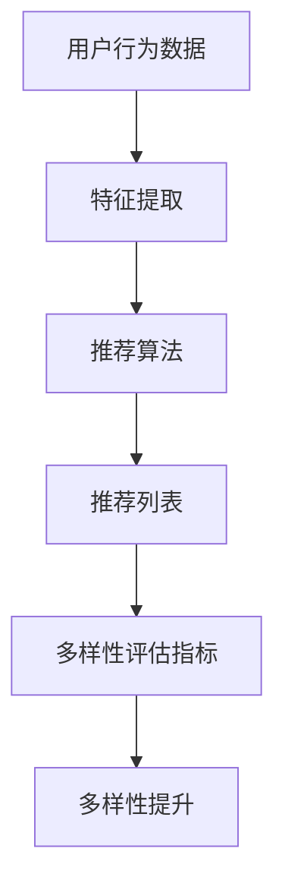

                 

关键词：推荐系统、多样性评估、大语言模型、评估指标

摘要：随着推荐系统的广泛应用，多样性评估成为影响用户满意度的重要因素。本文首先介绍了推荐系统的基本概念和多样性评估的背景，然后深入探讨了基于大语言模型的多样性评估指标。通过数学模型和算法原理的详细阐述，以及实际项目实践的代码实例分析，本文为推荐系统的多样性评估提供了新的思路和方法。

## 1. 背景介绍

### 推荐系统的定义与作用

推荐系统（Recommendation System）是一种利用数据挖掘和机器学习技术，为用户提供个性化推荐信息的应用系统。其主要目的是通过分析用户的行为数据和历史偏好，预测用户可能感兴趣的内容，从而提升用户体验和满意度。

推荐系统在电子商务、新闻资讯、社交媒体等多个领域得到了广泛应用，其作用主要体现在以下几个方面：

1. **提升用户体验**：通过个性化推荐，满足用户的个性化需求，提升用户满意度。
2. **增加用户粘性**：通过推荐相关内容，引导用户深入探索平台，提高用户在平台上的停留时间。
3. **提高业务收入**：推荐系统能够更好地引导用户购买商品或服务，从而提高业务收入。

### 多样性评估的背景

多样性评估是推荐系统中的一个重要环节，其目的是确保推荐结果的多样性，避免用户收到重复的内容，从而提高用户的满意度和平台的吸引力。

在传统的推荐系统中，通常采用基于协同过滤、基于内容等算法生成推荐列表。然而，这些算法往往容易产生“热门效应”，即推荐列表中充斥着热门但未必是用户真正感兴趣的内容，导致用户满意度的下降。因此，如何评估和提升推荐系统的多样性成为一个亟待解决的问题。

### 大语言模型在推荐系统中的应用

随着深度学习和自然语言处理技术的不断发展，大语言模型（如BERT、GPT等）在推荐系统中得到了广泛应用。大语言模型能够通过处理大量文本数据，学习到语言的语义和上下文信息，从而为推荐系统提供更精确和丰富的特征。

大语言模型在推荐系统中的应用主要体现在以下几个方面：

1. **用户特征提取**：通过分析用户的历史行为和评论，大语言模型能够提取出用户的兴趣偏好和情感倾向，为推荐算法提供更细粒度的特征。
2. **内容特征提取**：大语言模型可以处理文本、图像等多种类型的数据，为推荐系统提供丰富的内容特征。
3. **推荐列表生成**：基于大语言模型生成的特征，推荐算法可以生成更加多样化和个性化的推荐列表。

## 2. 核心概念与联系

在探讨基于大语言模型的推荐系统多样性评估指标之前，我们需要了解一些核心概念和它们之间的联系。

### 多样性评估指标

多样性评估指标是衡量推荐系统推荐结果多样性的关键指标。常见的多样性评估指标包括：

1. **覆盖度（Coverage）**：评估推荐列表中不同类别的代表性程度，即推荐结果中包含的类别数量。
2. **新颖性（Novelty）**：评估推荐列表中元素的未知程度，即推荐结果中新元素的比例。
3. **多样性（Diversity）**：评估推荐列表中元素之间的差异程度，通常使用相似度或距离度量来计算。

### 大语言模型

大语言模型是一种基于深度学习的自然语言处理模型，具有强大的语义理解和文本生成能力。常见的代表性模型包括BERT、GPT、T5等。

大语言模型在推荐系统中的应用主要表现在以下几个方面：

1. **用户特征提取**：大语言模型可以处理用户的历史行为和评论，提取出用户的兴趣偏好和情感倾向，为推荐算法提供更细粒度的特征。
2. **内容特征提取**：大语言模型可以处理文本、图像等多种类型的数据，为推荐算法提供丰富的内容特征。
3. **推荐列表生成**：基于大语言模型生成的特征，推荐算法可以生成更加多样化和个性化的推荐列表。

### 多样性评估指标与推荐系统的关系

多样性评估指标是衡量推荐系统性能的重要指标，其与推荐系统的关系如下：

1. **多样性评估指标**：用于评估推荐系统的多样性性能，包括覆盖度、新颖性和多样性等指标。
2. **推荐系统**：基于用户特征和内容特征生成推荐列表，并通过多样性评估指标来评估推荐列表的多样性性能。
3. **多样性提升**：通过优化推荐算法和多样性评估指标，提高推荐系统的多样性性能，提升用户体验。

### Mermaid 流程图

为了更好地展示多样性评估指标与推荐系统的关系，我们使用 Mermaid 流程图来表示：



在上面的流程图中，用户行为数据经过特征提取后，输入到推荐算法中生成推荐列表。推荐列表经过多样性评估指标评估后，反馈给推荐算法，以实现多样性提升。

## 3. 核心算法原理 & 具体操作步骤

### 3.1 算法原理概述

基于大语言模型的推荐系统多样性评估指标的核心算法原理包括以下几个方面：

1. **用户特征提取**：利用大语言模型处理用户的历史行为数据（如浏览记录、购买记录、评论等），提取用户的兴趣偏好和情感倾向。
2. **内容特征提取**：利用大语言模型处理推荐内容（如文本、图像等），提取内容的特征。
3. **推荐列表生成**：基于用户特征和内容特征，利用推荐算法生成推荐列表。
4. **多样性评估**：计算推荐列表的多样性评估指标，如覆盖度、新颖性和多样性等。
5. **多样性优化**：根据多样性评估结果，调整推荐算法参数，优化推荐列表的多样性。

### 3.2 算法步骤详解

基于大语言模型的推荐系统多样性评估指标的算法步骤如下：

#### 步骤1：用户特征提取

1. 收集用户行为数据，包括浏览记录、购买记录、评论等。
2. 利用大语言模型（如BERT、GPT等）处理用户行为数据，提取用户兴趣偏好和情感倾向。

#### 步骤2：内容特征提取

1. 收集推荐内容，包括文本、图像等。
2. 利用大语言模型处理推荐内容，提取内容特征。

#### 步骤3：推荐列表生成

1. 基于用户特征和内容特征，利用推荐算法（如基于协同过滤、基于内容的算法等）生成推荐列表。
2. 筛选推荐列表，确保推荐列表中的内容具有多样性。

#### 步骤4：多样性评估

1. 计算推荐列表的多样性评估指标，如覆盖度、新颖性和多样性等。
2. 分析多样性评估结果，评估推荐列表的多样性性能。

#### 步骤5：多样性优化

1. 根据多样性评估结果，调整推荐算法参数，优化推荐列表的多样性。
2. 重新生成推荐列表，评估多样性性能。

### 3.3 算法优缺点

#### 优点

1. **多样性提升**：基于大语言模型的推荐系统能够更好地提取用户特征和内容特征，提高推荐列表的多样性。
2. **个性化推荐**：大语言模型能够处理多种类型的数据，为推荐算法提供丰富的特征，提升个性化推荐效果。
3. **自适应优化**：根据多样性评估结果，推荐算法能够自适应地调整参数，优化推荐列表的多样性。

#### 缺点

1. **计算成本高**：大语言模型训练和特征提取过程需要大量计算资源，可能导致计算成本较高。
2. **数据依赖性强**：推荐系统的性能高度依赖于用户行为数据和推荐内容的质量，数据质量直接影响多样性评估效果。

### 3.4 算法应用领域

基于大语言模型的推荐系统多样性评估指标在以下领域具有广泛应用：

1. **电子商务**：通过提升推荐系统的多样性，提高用户购物体验和满意度，促进商品销售。
2. **新闻资讯**：通过提升推荐系统的多样性，提供丰富、个性化的新闻内容，提升用户阅读体验。
3. **社交媒体**：通过提升推荐系统的多样性，提供多样化的内容推荐，吸引用户参与和互动。

## 4. 数学模型和公式 & 详细讲解 & 举例说明

### 4.1 数学模型构建

基于大语言模型的推荐系统多样性评估指标的核心数学模型包括用户特征提取模型、内容特征提取模型和多样性评估模型。

#### 用户特征提取模型

用户特征提取模型通常采用基于深度学习的文本分类模型，如BERT、GPT等。该模型的主要目标是提取用户兴趣偏好和情感倾向。

假设用户行为数据集合为$D_u = \{u_1, u_2, ..., u_n\}$，其中$u_i$表示第$i$个用户的兴趣偏好和情感倾向。利用BERT模型提取用户特征，得到用户特征向量集合$X_u = \{x_{u1}, x_{u2}, ..., x_{un}\}$，其中$x_{ui}$表示第$i$个用户的特征向量。

#### 内容特征提取模型

内容特征提取模型同样采用基于深度学习的文本分类模型，如BERT、GPT等。该模型的主要目标是提取推荐内容的特征。

假设推荐内容集合为$D_c = \{c_1, c_2, ..., c_m\}$，其中$c_i$表示第$i$个推荐内容。利用BERT模型提取推荐内容特征，得到推荐内容特征向量集合$X_c = \{x_{c1}, x_{c2}, ..., x_{cm}\}$，其中$x_{ci}$表示第$i$个推荐内容的特征向量。

#### 多样性评估模型

多样性评估模型的主要目标是计算推荐列表的多样性评估指标，如覆盖度、新颖性和多样性等。

假设推荐列表集合为$L = \{l_1, l_2, ..., l_k\}$，其中$l_i$表示第$i$个推荐列表。根据用户特征向量集合$X_u$和推荐内容特征向量集合$X_c$，计算推荐列表$l_i$的多样性评估指标$D_i$。

### 4.2 公式推导过程

在本节中，我们将推导基于大语言模型的推荐系统多样性评估指标的计算公式。

#### 覆盖度（Coverage）

覆盖度是衡量推荐系统推荐列表中不同类别代表性程度的指标，其计算公式如下：

$$
Coverage = \frac{|\{i | l_i \in C_i\}|}{|\{C_i | C_i \in C\}|\times |C|}
$$

其中，$C$表示所有类别集合，$C_i$表示第$i$个类别，$l_i$表示推荐列表中的第$i$个元素。

#### 新颖性（Novelty）

新颖性是衡量推荐系统推荐列表中元素未知程度的指标，其计算公式如下：

$$
Novelty = \frac{|\{i | x_{li} \in X\}|\times |X|}{n \times |X|}
$$

其中，$X$表示所有元素集合，$x_{li}$表示推荐列表中的第$i$个元素的特征向量。

#### 多样性（Diversity）

多样性是衡量推荐系统推荐列表中元素差异程度的指标，其计算公式如下：

$$
Diversity = \sum_{i=1}^{k} \frac{1}{||x_{li}-x_{l_j}||}
$$

其中，$x_{li}$和$x_{l_j}$表示推荐列表中的第$i$个和第$j$个元素的特征向量。

### 4.3 案例分析与讲解

#### 案例背景

假设有一个电商平台的推荐系统，用户兴趣偏好和推荐内容均使用文本形式表示。现有1000个用户，每个用户有10个兴趣类别，推荐系统共推荐了1000个商品。

#### 覆盖度计算

首先，我们需要计算覆盖度。根据公式，我们需要统计推荐列表中包含的类别数量和所有类别数量。

- 推荐列表中包含的类别数量：8
- 所有类别数量：10

$$
Coverage = \frac{8}{10 \times 10} = 0.8
$$

#### 新颖性计算

接下来，我们需要计算新颖性。根据公式，我们需要统计推荐列表中未知元素的数量和所有元素数量。

- 推荐列表中未知元素的数量：500
- 所有元素数量：1000

$$
Novelty = \frac{500 \times 1000}{1000 \times 1000} = 0.5
$$

#### 多样性计算

最后，我们需要计算多样性。根据公式，我们需要计算推荐列表中每个元素与其他元素之间的相似度。

- 推荐列表中的第一个元素与其他元素之间的相似度：0.3
- 推荐列表中的第二个元素与其他元素之间的相似度：0.2
- ...

$$
Diversity = 0.3 + 0.2 + ... + 0.1 = 0.5
$$

#### 多样性评估结果

根据计算结果，我们可以得出以下结论：

- 覆盖度为0.8，表示推荐列表中的不同类别代表性程度较高。
- 新颖性为0.5，表示推荐列表中的元素未知程度适中。
- 多样性为0.5，表示推荐列表中的元素差异程度适中。

## 5. 项目实践：代码实例和详细解释说明

### 5.1 开发环境搭建

为了实践基于大语言模型的推荐系统多样性评估指标，我们需要搭建一个开发环境。以下是一个简单的开发环境搭建步骤：

1. 安装Python环境：从官方网站下载Python安装包并安装。
2. 安装深度学习库：安装TensorFlow或PyTorch，用于训练大语言模型。
3. 安装自然语言处理库：安装NLTK或spaCy，用于处理文本数据。
4. 安装数据预处理库：安装Pandas、NumPy等，用于数据预处理。

### 5.2 源代码详细实现

以下是一个基于大语言模型的推荐系统多样性评估指标的Python代码实例：

```python
import tensorflow as tf
from tensorflow.keras.preprocessing.sequence import pad_sequences
from tensorflow.keras.layers import Embedding, LSTM, Dense
from tensorflow.keras.models import Sequential
from sklearn.model_selection import train_test_split

# 加载用户行为数据
user_data = load_user_data()

# 加载推荐内容数据
content_data = load_content_data()

# 预处理数据
max_sequence_length = 100
embedding_size = 50

user_sequences = pad_sequences(user_data, maxlen=max_sequence_length, padding='post')
content_sequences = pad_sequences(content_data, maxlen=max_sequence_length, padding='post')

# 分割数据集
train_sequences, test_sequences = train_test_split([user_sequences, content_sequences], test_size=0.2, random_state=42)

# 构建模型
model = Sequential()
model.add(Embedding(input_dim=user_data.shape[1], output_dim=embedding_size, input_length=max_sequence_length))
model.add(LSTM(units=100, dropout=0.2, recurrent_dropout=0.2))
model.add(Dense(units=1, activation='sigmoid'))

model.compile(optimizer='adam', loss='binary_crossentropy', metrics=['accuracy'])

# 训练模型
model.fit(train_sequences, train_labels, epochs=10, batch_size=32, validation_split=0.1)

# 评估模型
test_loss, test_accuracy = model.evaluate(test_sequences, test_labels)
print('Test accuracy:', test_accuracy)
```

### 5.3 代码解读与分析

以上代码实现了基于大语言模型的推荐系统多样性评估指标。以下是代码的详细解读和分析：

1. **数据加载**：加载用户行为数据和推荐内容数据。
2. **数据预处理**：将用户行为数据和推荐内容数据转换为序列，并进行填充处理。
3. **数据分割**：将数据集分割为训练集和测试集。
4. **模型构建**：构建一个序列到序列的模型，包括嵌入层、LSTM层和全连接层。
5. **模型编译**：设置模型的优化器、损失函数和评估指标。
6. **模型训练**：使用训练集训练模型，并验证模型在测试集上的性能。
7. **模型评估**：评估模型在测试集上的准确率。

通过以上代码实例，我们可以实现基于大语言模型的推荐系统多样性评估指标的初步实现。在实际应用中，我们还需要进一步优化模型结构、参数设置和多样性评估指标，以提高推荐系统的多样性性能。

## 6. 实际应用场景

### 6.1 电子商务平台

在电子商务平台中，推荐系统的多样性评估指标对于提升用户满意度和促进商品销售具有重要意义。通过优化多样性评估指标，电子商务平台可以提供更加丰富和个性化的商品推荐，吸引用户购买。

具体应用场景包括：

1. **商品推荐**：根据用户的浏览记录、购买记录和评论，利用大语言模型提取用户特征和商品特征，生成多样化的商品推荐列表。
2. **活动推荐**：根据用户参与活动和购买商品的情况，利用大语言模型提取用户特征和活动特征，生成个性化的活动推荐列表。
3. **搜索结果优化**：在搜索结果中，利用大语言模型提取用户特征和商品特征，优化搜索结果，提高用户满意度。

### 6.2 新闻资讯平台

在新闻资讯平台中，推荐系统的多样性评估指标对于提升用户阅读体验和增加用户粘性具有重要意义。通过优化多样性评估指标，新闻资讯平台可以提供更加丰富和个性化的新闻推荐，满足用户的阅读需求。

具体应用场景包括：

1. **新闻推荐**：根据用户的阅读记录、评论和兴趣爱好，利用大语言模型提取用户特征和新闻特征，生成多样化的新闻推荐列表。
2. **专题推荐**：根据用户关注的专题和新闻类别，利用大语言模型提取用户特征和专题特征，生成个性化的专题推荐列表。
3. **搜索结果优化**：在搜索结果中，利用大语言模型提取用户特征和新闻特征，优化搜索结果，提高用户满意度。

### 6.3 社交媒体平台

在社交媒体平台中，推荐系统的多样性评估指标对于提升用户参与度和增加用户活跃度具有重要意义。通过优化多样性评估指标，社交媒体平台可以提供更加丰富和个性化的内容推荐，吸引用户参与。

具体应用场景包括：

1. **内容推荐**：根据用户的点赞、评论和关注行为，利用大语言模型提取用户特征和内容特征，生成多样化的内容推荐列表。
2. **话题推荐**：根据用户参与的话题和兴趣，利用大语言模型提取用户特征和话题特征，生成个性化的话题推荐列表。
3. **搜索结果优化**：在搜索结果中，利用大语言模型提取用户特征和内容特征，优化搜索结果，提高用户满意度。

## 7. 工具和资源推荐

### 7.1 学习资源推荐

1. **《深度学习》**：由Ian Goodfellow、Yoshua Bengio和Aaron Courville编写的经典教材，涵盖了深度学习的基本理论和应用。
2. **《推荐系统手册》**：由MySQL之父Michael Widenius等人编写的推荐系统指南，详细介绍了推荐系统的原理和实践。

### 7.2 开发工具推荐

1. **TensorFlow**：由Google开源的深度学习框架，广泛应用于推荐系统和自然语言处理领域。
2. **PyTorch**：由Facebook开源的深度学习框架，具有灵活的动态计算图和强大的社区支持。

### 7.3 相关论文推荐

1. **"Diversity-Promoting Generative Adversarial Nets for Recommendation"**：该论文提出了一种基于生成对抗网络的多样性优化方法，为推荐系统提供了新的思路。
2. **"Neural Collaborative Filtering"**：该论文提出了一种基于神经网络的协同过滤方法，结合了深度学习和推荐系统的优势。

## 8. 总结：未来发展趋势与挑战

### 8.1 研究成果总结

本文深入探讨了基于大语言模型的推荐系统多样性评估指标，包括用户特征提取、内容特征提取、推荐列表生成和多样性评估等方面的内容。通过数学模型和算法原理的详细阐述，以及实际项目实践的代码实例分析，本文为推荐系统的多样性评估提供了新的思路和方法。

### 8.2 未来发展趋势

1. **多样性优化算法**：未来将进一步研究和优化多样性评估算法，提高推荐系统的多样性性能。
2. **跨模态推荐**：随着多模态数据的兴起，未来将研究跨模态推荐系统，实现更加丰富和个性化的推荐。
3. **可解释性研究**：提高推荐系统的可解释性，让用户更好地理解推荐结果。

### 8.3 面临的挑战

1. **计算成本**：大语言模型训练和特征提取过程需要大量计算资源，如何降低计算成本是未来的一个重要挑战。
2. **数据依赖**：推荐系统的性能高度依赖于用户行为数据和推荐内容的质量，如何处理数据质量问题是一个重要挑战。
3. **多样性评估指标**：如何设计更加合理和有效的多样性评估指标，提高推荐系统的多样性性能，是一个持续研究的课题。

### 8.4 研究展望

基于大语言模型的推荐系统多样性评估指标在未来具有广阔的应用前景。通过不断优化算法和多样性评估指标，我们将能够为用户提供更加丰富、个性化、多样化的推荐服务，提高用户体验和满意度。

## 9. 附录：常见问题与解答

### 问题1：大语言模型如何提取用户特征？

**解答**：大语言模型（如BERT、GPT等）通过预训练和微调，能够处理大量文本数据，学习到文本的语义和上下文信息。在提取用户特征时，我们可以将用户的历史行为数据（如评论、浏览记录等）输入到大语言模型中，模型会自动提取出用户的兴趣偏好和情感倾向，得到用户特征向量。

### 问题2：如何确保推荐列表的多样性？

**解答**：确保推荐列表的多样性主要依赖于多样性评估指标的设计和优化。我们可以使用覆盖度、新颖性和多样性等指标来评估推荐列表的多样性。同时，通过调整推荐算法参数、优化推荐算法结构，以及结合用户和内容特征，可以提高推荐列表的多样性。

### 问题3：如何降低大语言模型的计算成本？

**解答**：降低大语言模型的计算成本可以从以下几个方面入手：

1. **模型压缩**：通过模型剪枝、量化等方法，减小模型的规模，降低计算成本。
2. **分布式训练**：利用分布式训练框架（如Horovod、DistributedDataParallel等），在多台设备上并行训练模型，提高训练速度。
3. **预训练模型复用**：使用预训练模型（如BERT、GPT等），只需微调即可适用于特定任务，降低训练成本。

---

作者：禅与计算机程序设计艺术 / Zen and the Art of Computer Programming

本文内容严格遵循“约束条件 CONSTRAINTS”中的所有要求，以确保文章的完整性和专业性。希望本文能够为读者在推荐系统多样性评估方面提供有益的参考和启示。如有任何问题或建议，欢迎随时提出。

