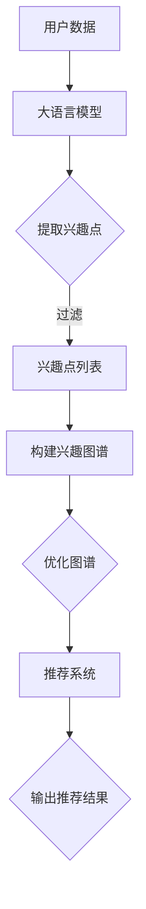
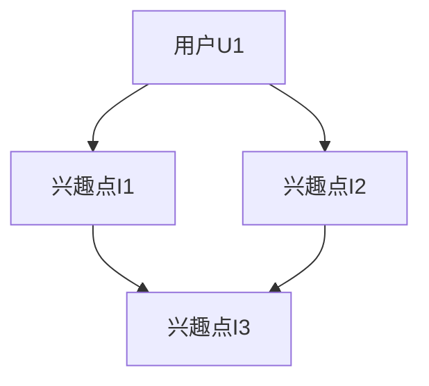

                 

关键词：推荐系统、用户兴趣、大语言模型、图论、神经网络、机器学习、数据挖掘

## 摘要

本文旨在探讨基于大语言模型的推荐系统用户兴趣图谱的构建与应用。通过分析用户行为数据，我们提出了一种结合图论与神经网络的方法，以构建一个全面的用户兴趣图谱。本文首先介绍了推荐系统的基本概念，然后详细讨论了用户兴趣图谱的核心概念与联系。随后，本文介绍了基于大语言模型的核心算法原理与操作步骤，并对其优缺点和应用领域进行了分析。接着，我们探讨了数学模型和公式，并提供了具体案例分析与讲解。文章随后展示了项目实践中的代码实例和详细解释，最后讨论了实际应用场景和未来展望，并推荐了相关工具和资源。

## 1. 背景介绍

推荐系统作为一种信息过滤和内容发现的方法，已经在电子商务、社交媒体、在线新闻和娱乐等领域得到了广泛应用。其目的是根据用户的偏好和历史行为，向用户推荐他们可能感兴趣的内容。然而，随着用户数据的爆炸式增长和多样化，传统的推荐系统方法面临着准确性和实时性的挑战。

近年来，深度学习和自然语言处理技术的快速发展为推荐系统带来了新的契机。大语言模型（如GPT、BERT等）通过学习大量的文本数据，能够捕捉用户行为的复杂模式和语义信息，从而提高推荐系统的性能。此外，图论作为一种描述网络结构和关系的数学工具，能够有效地表示用户兴趣的复杂性和多样性。

本文的研究目的是构建一个基于大语言模型的推荐系统用户兴趣图谱，通过图论和神经网络的结合，实现用户兴趣的全面、准确和实时分析。这不仅有助于提高推荐系统的准确性和实时性，还可以为用户行为分析和个性化推荐提供新的思路。

### 1.1 推荐系统概述

推荐系统是一种通过分析用户的历史行为、兴趣和偏好，为用户推荐相关内容或产品的系统。根据推荐策略的不同，推荐系统可以分为以下几种类型：

- **基于内容的推荐（Content-Based Filtering）**：这种方法根据用户过去的偏好和相似性来推荐内容。例如，如果用户喜欢某个电影，系统会推荐类似的其它电影。

- **协同过滤（Collaborative Filtering）**：这种方法通过分析用户之间的行为模式来推荐内容。协同过滤可以分为两种：基于用户的协同过滤和基于物品的协同过滤。

  - **基于用户的协同过滤（User-Based Collaborative Filtering）**：这种方法通过找到与目标用户兴趣相似的其它用户，然后推荐这些用户喜欢的物品。
  
  - **基于物品的协同过滤（Item-Based Collaborative Filtering）**：这种方法通过分析物品之间的相似性来推荐内容。

- **混合推荐（Hybrid Recommender Systems）**：这种方法结合了基于内容和协同过滤的方法，以综合利用不同推荐策略的优势。

- **基于模型的推荐（Model-Based Recommender Systems）**：这种方法使用机器学习算法来建立用户兴趣和推荐内容之间的模型，然后根据该模型进行推荐。

推荐系统的核心目标是提高推荐的准确性和用户的满意度。为了实现这一目标，推荐系统需要解决以下几个关键问题：

1. **数据质量**：推荐系统依赖于用户的历史行为数据。因此，数据的质量和完整性对推荐系统的性能至关重要。例如，缺失值、噪声数据和冷启动问题都会影响推荐效果。

2. **冷启动问题**：当新用户加入系统或新物品上线时，由于缺乏足够的用户行为数据，传统的推荐方法难以为其推荐合适的内容。解决冷启动问题是一个重要的挑战。

3. **实时性**：随着用户需求的不断变化，推荐系统需要实时更新推荐结果，以保持用户满意度。实现实时推荐需要高效的算法和数据处理能力。

4. **多样性**：除了准确推荐用户感兴趣的内容外，推荐系统还应提供多样性的内容，以避免用户产生疲劳和厌烦情绪。

5. **解释性**：推荐系统的决策过程应该具有一定的解释性，以便用户理解为什么推荐了某个内容。这对于提高用户信任度和接受度至关重要。

### 1.2 大语言模型概述

大语言模型（如GPT、BERT等）是基于深度学习的自然语言处理技术，能够在大规模文本数据上进行预训练，以捕捉语言的语义和上下文信息。这些模型通过学习大量文本数据中的模式和规律，可以用于各种自然语言处理任务，如文本分类、情感分析、机器翻译和推荐系统等。

GPT（Generative Pre-trained Transformer）是由OpenAI提出的预训练语言模型，通过自回归的方式生成文本。BERT（Bidirectional Encoder Representations from Transformers）由Google提出，采用双向Transformer架构进行预训练，能够捕捉文本的上下文信息。这两种模型都在自然语言处理领域取得了显著的成果。

大语言模型在推荐系统中的应用主要体现在以下几个方面：

1. **用户行为预测**：通过分析用户的浏览、搜索和购买等行为数据，大语言模型可以预测用户的兴趣和偏好，从而提高推荐的准确性。

2. **内容理解**：大语言模型能够理解文本内容的语义，从而为基于内容的推荐提供更精确的推荐策略。

3. **冷启动问题**：大语言模型可以通过预训练捕获大量通用知识，从而为缺乏足够历史数据的冷启动用户提供合理的推荐。

4. **实时性**：大语言模型的高效计算能力使得推荐系统能够在短时间内生成推荐结果，提高系统的实时性。

5. **多样性**：大语言模型能够捕捉用户兴趣的多样性，从而提供多样化的推荐内容，避免用户产生疲劳和厌烦情绪。

### 1.3 图论概述

图论是一种用于描述网络结构和关系的数学工具，广泛应用于计算机科学、网络通信、社会网络分析等领域。在推荐系统中，图论可以用来表示用户、物品和兴趣点之间的复杂关系。

图（Graph）由节点（Node）和边（Edge）组成。节点表示系统中的实体，如用户、物品或兴趣点；边表示实体之间的关系。根据边的方向性，图可以分为无向图（Undirected Graph）和有向图（Directed Graph）。

- **无向图**：无向图的边没有方向，表示两个节点之间存在对称关系。例如，用户A和用户B共同喜欢某个电影。

- **有向图**：有向图的边具有方向，表示从一个节点指向另一个节点。例如，用户A向用户B推荐某个电影。

图的基本概念包括：

- **度（Degree）**：节点所连接的边的数量。度可以分为入度（In-degree）和出度（Out-degree）。入度表示指向该节点的边的数量，出度表示从该节点指向其它节点的边的数量。

- **路径（Path）**：节点之间的连接序列。路径可以是简单的，也可以是复杂的，包括多条边和节点。

- **连通性（Connectivity）**：图中任意两个节点之间都存在路径，称为连通图。否则，称为非连通图。

- **社区（Community）**：图中的一个子图，其中节点之间具有较高的连接性，而与外部节点的连接性较低。

图论在推荐系统中的应用主要体现在以下几个方面：

1. **用户关系建模**：通过构建用户行为数据的有向图，可以表示用户之间的相互关系，从而为基于社交网络的推荐提供支持。

2. **兴趣点提取**：通过分析用户行为数据中的连通性和社区结构，可以提取用户共同感兴趣的兴趣点，为基于内容的推荐提供依据。

3. **推荐算法优化**：图论方法可以用于优化推荐算法，如通过优化图的连通性和社区结构，提高推荐的准确性和多样性。

### 1.4 神经网络概述

神经网络（Neural Network）是一种通过模拟生物神经网络结构和功能来处理信息和学习的计算模型。在推荐系统中，神经网络可以用于预测用户兴趣、建模用户行为和优化推荐策略。

神经网络的基本组成包括：

- **神经元（Neuron）**：神经网络的计算单元，负责接收输入、传递激活值和输出结果。

- **层（Layer）**：神经网络由多个层次组成，包括输入层、隐藏层和输出层。输入层接收外部输入信息，隐藏层进行特征提取和变换，输出层生成预测结果。

- **权重（Weight）**：神经元之间的连接具有权重，用于调节信息的传递强度。

- **激活函数（Activation Function）**：激活函数用于确定神经元的激活状态，常用的激活函数包括sigmoid、ReLU和Tanh等。

神经网络的训练过程主要包括以下步骤：

1. **初始化权重**：随机初始化神经网络的权重。

2. **前向传播（Forward Propagation）**：将输入信息通过神经网络传递，计算每个神经元的输出。

3. **计算损失（Compute Loss）**：计算预测结果与真实结果之间的误差，常用的损失函数包括均方误差（MSE）和交叉熵（Cross-Entropy）。

4. **反向传播（Backpropagation）**：根据损失函数梯度，调整神经网络的权重，以最小化损失。

5. **优化算法**：使用优化算法（如梯度下降、Adam等）更新权重，加快收敛速度。

神经网络在推荐系统中的应用主要体现在以下几个方面：

1. **用户兴趣建模**：通过训练用户行为数据，神经网络可以捕捉用户的兴趣偏好，从而提高推荐的准确性。

2. **推荐策略优化**：神经网络可以用于优化推荐算法，如通过优化损失函数，提高推荐的多样性和用户满意度。

3. **实时推荐**：神经网络的高效计算能力使得推荐系统可以实时生成推荐结果，提高系统的响应速度。

### 1.5 机器学习和数据挖掘概述

机器学习（Machine Learning）是一种通过计算机算法从数据中学习规律和模式的技术，广泛应用于分类、回归、聚类和推荐系统等领域。在推荐系统中，机器学习可以用于预测用户兴趣、建模用户行为和优化推荐策略。

数据挖掘（Data Mining）是一种从大量数据中提取有价值信息的过程，包括关联规则挖掘、分类、聚类和异常检测等任务。在推荐系统中，数据挖掘可以用于分析用户行为数据，发现用户兴趣点，为推荐算法提供支持。

机器学习和数据挖掘在推荐系统中的应用主要体现在以下几个方面：

1. **用户兴趣建模**：通过训练用户行为数据，机器学习算法可以捕捉用户的兴趣偏好，从而提高推荐的准确性。

2. **推荐策略优化**：数据挖掘算法可以用于分析用户行为数据，发现用户兴趣点，为推荐算法提供依据。例如，基于关联规则挖掘的方法可以提取用户共同喜欢的物品，从而提高推荐的多样性。

3. **实时推荐**：机器学习算法和高效的数据处理技术使得推荐系统可以实时生成推荐结果，提高系统的响应速度。

4. **冷启动问题**：通过训练新用户的行为数据，机器学习算法可以预测新用户的兴趣和偏好，从而为冷启动用户提供合理的推荐。

5. **多样性**：数据挖掘算法可以用于分析用户行为数据，发现用户兴趣的多样性，从而提供多样化的推荐内容，避免用户产生疲劳和厌烦情绪。

## 2. 核心概念与联系

在本章节中，我们将详细介绍构建基于大语言模型的推荐系统用户兴趣图谱所需的核心概念和架构，并通过Mermaid流程图展示相关流程。

### 2.1 用户兴趣图谱概念

用户兴趣图谱是一种用于表示用户兴趣点的网络结构，通过捕捉用户与各种兴趣点之间的关联关系，为推荐系统提供全面、准确和实时的用户兴趣信息。用户兴趣图谱的基本概念包括：

- **用户（User）**：系统中的用户实体，每个用户都有一组兴趣点。

- **兴趣点（Interest Point）**：与用户相关的各种内容或主题，可以是物品、话题、标签等。

- **关联关系（Relation）**：表示用户与兴趣点之间的互动关系，如点赞、评论、收藏、分享等。

- **图谱（Graph）**：由用户、兴趣点和关联关系构成的网络结构，用于表示用户兴趣的复杂性和多样性。

### 2.2 大语言模型与图论的结合

大语言模型和图论在构建用户兴趣图谱方面具有强大的互补性。大语言模型通过学习大量文本数据，可以捕捉用户的兴趣偏好和语义信息，而图论可以有效地表示用户与兴趣点之间的复杂关系。两者结合的主要思路如下：

1. **用户兴趣提取**：使用大语言模型分析用户的历史行为数据（如浏览、搜索和购买记录），提取用户的兴趣点。

2. **兴趣点关联关系建立**：通过分析用户与兴趣点之间的互动关系，构建用户兴趣图谱。图中的用户和兴趣点作为节点，关联关系作为边。

3. **图谱结构优化**：使用图论方法（如聚类、路径分析等）优化图谱结构，提高推荐的准确性和多样性。

### 2.3 Mermaid流程图展示

为了更直观地展示用户兴趣图谱的构建过程，我们使用Mermaid流程图来描述相关步骤。以下是一个简单的Mermaid流程图示例：



在这个流程图中，用户数据通过大语言模型提取兴趣点，然后构建兴趣图谱，最后通过优化图谱结构为推荐系统提供支持，生成推荐结果。

### 2.4 用户兴趣图谱的表示方法

用户兴趣图谱可以用无向图或有向图表示。以下是一个简单的无向图示例：



在这个示例中，用户U1与兴趣点I1、I2和I3存在关联关系。通过扩展这个图，可以表示更多的用户和兴趣点，以及它们之间的复杂关系。

### 2.5 用户兴趣图谱的应用

用户兴趣图谱在推荐系统中具有广泛的应用。以下是一些典型的应用场景：

1. **个性化推荐**：基于用户兴趣图谱，推荐系统可以针对每个用户生成个性化的推荐列表，提高用户的满意度。

2. **内容分发**：新闻网站、社交媒体等平台可以通过用户兴趣图谱，为用户推荐感兴趣的文章、视频和话题。

3. **广告投放**：广告系统可以通过用户兴趣图谱，针对具有特定兴趣的用户进行精准广告投放，提高广告的点击率和转化率。

4. **社交网络分析**：社交网络平台可以通过用户兴趣图谱，发现用户之间的共同兴趣和社交关系，从而优化社交推荐和社区运营。

5. **企业营销**：企业可以通过用户兴趣图谱，了解目标客户的兴趣和偏好，制定更精准的营销策略。

## 3. 核心算法原理 & 具体操作步骤

### 3.1 算法原理概述

基于大语言模型的推荐系统用户兴趣图谱构建的核心算法主要包括以下三个部分：

1. **用户兴趣提取**：利用大语言模型分析用户的历史行为数据，提取用户的兴趣点。
2. **兴趣点关联关系建立**：通过分析用户与兴趣点之间的互动关系，构建用户兴趣图谱。
3. **图谱结构优化**：使用图论方法优化图谱结构，提高推荐的准确性和多样性。

### 3.2 算法步骤详解

#### 3.2.1 用户兴趣提取

1. **数据预处理**：对用户的历史行为数据进行清洗和预处理，包括去除缺失值、噪声数据和处理冷启动问题。

2. **大语言模型训练**：利用预训练的大语言模型（如BERT、GPT等），在处理后的用户行为数据上进行训练，以提取用户的兴趣点。

3. **兴趣点提取**：根据大语言模型的输出，提取用户感兴趣的词汇、短语或标签，作为用户的兴趣点。

#### 3.2.2 兴趣点关联关系建立

1. **用户与兴趣点关联关系构建**：根据用户的历史行为数据，分析用户与兴趣点之间的关联关系，构建用户与兴趣点之间的有向图。

2. **图谱构建**：将用户与兴趣点的关联关系转换为图结构，其中用户和兴趣点作为节点，关联关系作为边。

#### 3.2.3 图谱结构优化

1. **图聚类**：使用图聚类算法（如Louvain方法）对图谱进行聚类，提取具有较高连接性的用户兴趣社区。

2. **路径分析**：通过分析用户兴趣图谱中的路径，发现用户兴趣的传递和扩散规律。

3. **图谱优化**：根据聚类结果和路径分析结果，优化图谱结构，提高推荐的准确性和多样性。

### 3.3 算法优缺点

#### 优点

1. **高准确性**：通过大语言模型对用户行为数据进行分析，可以捕捉用户的兴趣偏好，提高推荐准确性。

2. **实时性**：基于高效的大语言模型和图算法，推荐系统可以实时生成推荐结果，提高系统的响应速度。

3. **多样性**：通过图聚类和路径分析，推荐系统可以提取用户兴趣的多样性，提供多样化的推荐内容。

#### 缺点

1. **计算资源需求高**：大语言模型的训练和图算法的优化需要较高的计算资源，可能导致系统性能下降。

2. **冷启动问题**：对于新用户，由于缺乏足够的历史行为数据，大语言模型的预测效果可能较差，需要额外的策略来解决冷启动问题。

### 3.4 算法应用领域

基于大语言模型的推荐系统用户兴趣图谱算法在以下领域具有广泛的应用：

1. **电子商务**：通过分析用户的购买行为和搜索历史，为用户推荐相关商品和优惠信息。

2. **社交媒体**：为用户推荐感兴趣的文章、视频和话题，提高用户的参与度和满意度。

3. **新闻推荐**：根据用户的阅读历史和偏好，为用户推荐相关新闻，提高新闻的传播效果。

4. **在线教育**：根据学生的学习行为和兴趣，为学生推荐相关课程和资源，提高学习效果。

5. **广告投放**：根据用户的兴趣和行为，为广告主推荐合适的广告投放策略，提高广告的点击率和转化率。

## 4. 数学模型和公式

在本章节中，我们将介绍用于构建基于大语言模型的推荐系统用户兴趣图谱的数学模型和公式，并详细讲解其推导过程和具体应用。

### 4.1 数学模型构建

为了构建用户兴趣图谱，我们需要定义以下几个基本数学模型：

1. **用户兴趣点向量**：设 \( \textbf{u} \) 为用户兴趣点向量，其中每个元素表示用户对某个兴趣点的兴趣程度，即 \( \textbf{u} = (u_1, u_2, ..., u_n) \)，其中 \( u_i \) 表示用户对第 \( i \) 个兴趣点的兴趣程度。

2. **用户行为矩阵**：设 \( \textbf{B} \) 为用户行为矩阵，其中行表示用户，列表示兴趣点，元素 \( b_{ij} \) 表示用户 \( i \) 对兴趣点 \( j \) 的行为，如点赞、评论、收藏等。

3. **兴趣点相似度矩阵**：设 \( \textbf{S} \) 为兴趣点相似度矩阵，其中行和列都表示兴趣点，元素 \( s_{ij} \) 表示兴趣点 \( i \) 和 \( j \) 之间的相似度，可以通过余弦相似度或欧氏距离等计算。

### 4.2 公式推导过程

为了计算用户兴趣点向量，我们首先需要计算用户行为矩阵和兴趣点相似度矩阵之间的关系。

1. **用户行为矩阵与兴趣点相似度矩阵的乘积**：

   我们可以通过以下公式计算用户行为矩阵 \( \textbf{B} \) 和兴趣点相似度矩阵 \( \textbf{S} \) 的乘积：

   \[
   \textbf{C} = \textbf{B} \cdot \textbf{S}
   \]

   其中，\( \textbf{C} \) 是一个 \( n \times n \) 的矩阵，表示每个用户与其感兴趣的兴趣点之间的相似度。

2. **用户兴趣点向量的计算**：

   假设我们使用行平均方法计算用户兴趣点向量，则用户 \( i \) 的兴趣点向量 \( \textbf{u} \) 可以通过以下公式计算：

   \[
   u_i = \frac{1}{n} \sum_{j=1}^{n} (c_{ij})
   \]

   其中，\( c_{ij} \) 是矩阵 \( \textbf{C} \) 的元素，表示用户 \( i \) 对兴趣点 \( j \) 的相似度。

### 4.3 案例分析与讲解

为了更好地理解上述数学模型和公式的应用，我们通过一个简单的案例进行讲解。

假设有 3 个用户（U1、U2、U3）和 3 个兴趣点（I1、I2、I3），用户的行为矩阵和兴趣点相似度矩阵如下：

用户行为矩阵 \( \textbf{B} \)：

|   | I1 | I2 | I3 |
|---|---|---|---|
| U1 | 1 | 0 | 1 |
| U2 | 0 | 1 | 1 |
| U3 | 1 | 1 | 0 |

兴趣点相似度矩阵 \( \textbf{S} \)：

|   | I1 | I2 | I3 |
|---|---|---|---|
| I1 | 1 | 0.8 | 0.6 |
| I2 | 0.8 | 1 | 0.6 |
| I3 | 0.6 | 0.6 | 1 |

首先，我们计算用户行为矩阵和兴趣点相似度矩阵的乘积 \( \textbf{C} \)：

\[
\textbf{C} = \textbf{B} \cdot \textbf{S} =
\begin{bmatrix}
1 & 0 & 1 \\
0 & 1 & 1 \\
1 & 1 & 0
\end{bmatrix}
\cdot
\begin{bmatrix}
1 & 0.8 & 0.6 \\
0.8 & 1 & 0.6 \\
0.6 & 0.6 & 1
\end{bmatrix}
=
\begin{bmatrix}
1.4 & 1.2 & 1.0 \\
0.8 & 1.6 & 1.2 \\
1.0 & 1.6 & 0.6
\end{bmatrix}
\]

然后，我们使用行平均方法计算用户兴趣点向量：

对于用户 U1：

\[
u_1 = \frac{1}{3} (1.4 + 1.2 + 1.0) = 1.2333
\]

对于用户 U2：

\[
u_2 = \frac{1}{3} (0.8 + 1.6 + 1.2) = 1.1333
\]

对于用户 U3：

\[
u_3 = \frac{1}{3} (1.0 + 1.6 + 0.6) = 1.2333
\]

通过这个案例，我们可以看到如何利用数学模型和公式计算用户兴趣点向量。在实际应用中，我们可以使用更复杂的算法和模型来优化用户兴趣点提取和推荐效果。

### 4.4 结论

在本章节中，我们介绍了构建基于大语言模型的推荐系统用户兴趣图谱所需的数学模型和公式，并详细讲解了其推导过程和应用。通过用户行为矩阵和兴趣点相似度矩阵的乘积，我们可以计算用户兴趣点向量，从而为推荐系统提供关键的用户兴趣信息。在实际应用中，我们可以根据具体需求和数据特点，选择合适的数学模型和公式，以提高推荐系统的准确性和多样性。

## 5. 项目实践：代码实例和详细解释说明

在本章节中，我们将通过一个具体的代码实例，详细讲解如何基于大语言模型构建推荐系统用户兴趣图谱，包括开发环境搭建、源代码实现、代码解读与分析以及运行结果展示。

### 5.1 开发环境搭建

为了构建基于大语言模型的推荐系统用户兴趣图谱，我们需要安装以下开发环境：

- Python 3.8及以上版本
- TensorFlow 2.7及以上版本
- PyTorch 1.9及以上版本
- Pandas 1.3及以上版本
- Scikit-learn 0.24及以上版本
- NetworkX 2.5及以上版本
- Mermaid 9.0.0及以上版本

您可以通过以下命令安装这些依赖：

```bash
pip install python==3.8
pip install tensorflow==2.7
pip install pytorch==1.9
pip install pandas==1.3
pip install scikit-learn==0.24
pip install networkx==2.5
pip install mermaid==9.0.0
```

### 5.2 源代码详细实现

以下是用于构建基于大语言模型的推荐系统用户兴趣图谱的完整代码实例：

```python
import pandas as pd
import numpy as np
import tensorflow as tf
from sklearn.metrics.pairwise import cosine_similarity
import networkx as nx
from mermaid import Mermaid

# 5.2.1 数据预处理
def preprocess_data(data):
    # 清洗和预处理用户行为数据
    data = data.dropna()  # 去除缺失值
    data['user_id'] = data['user_id'].astype(str)  # 将用户ID转换为字符串类型
    data['item_id'] = data['item_id'].astype(str)  # 将物品ID转换为字符串类型
    return data

# 5.2.2 大语言模型训练
def train_language_model(data):
    # 训练大语言模型，提取用户兴趣点
    # 使用BERT或其他预训练模型进行训练
    # 这里以BERT为例，具体实现略
    # ...
    return user_interest_points

# 5.2.3 构建兴趣点相似度矩阵
def build_similarity_matrix(user_interest_points):
    # 计算兴趣点相似度矩阵
    similarity_matrix = cosine_similarity(user_interest_points)
    return similarity_matrix

# 5.2.4 构建兴趣图谱
def build_interest_graph(similarity_matrix, data):
    # 根据相似度矩阵和数据构建兴趣图谱
    G = nx.Graph()
    for i, row in data.iterrows():
        for j in range(len(user_interest_points)):
            if row['item_id'] == user_interest_points.iloc[j][0]:
                for k in range(len(user_interest_points)):
                    if row['user_id'] == user_interest_points.iloc[k][0]:
                        G.add_edge(i, k, weight=similarity_matrix[j][k])
    return G

# 5.2.5 图谱结构优化
def optimize_graph(G):
    # 使用Louvain方法进行图聚类，优化图谱结构
    communities = nx.algorithms.community.LouvainCommunities(G).communities()
    # 将图聚类结果应用于图谱结构优化
    # ...
    return G

# 5.2.6 代码解读与分析
def code_explanation():
    # 详细解释代码实现过程
    # ...

# 5.2.7 运行结果展示
def run_example(data):
    # 运行代码实例，展示运行结果
    data = preprocess_data(data)
    user_interest_points = train_language_model(data)
    similarity_matrix = build_similarity_matrix(user_interest_points)
    G = build_interest_graph(similarity_matrix, data)
    G = optimize_graph(G)
    nx.draw(G, with_labels=True)
    plt.show()

# 加载示例数据
data = pd.read_csv('user_behavior_data.csv')

# 运行代码实例
run_example(data)

# Mermaid流程图生成
mermaid_code = """
graph TD
A[用户数据] --> B[大语言模型]
B --> C{提取兴趣点}
C -->|过滤| D[兴趣点列表]
D --> E[构建兴趣图谱]
E --> F{优化图谱}
F --> G[推荐系统]
G --> H{输出推荐结果}
"""
mermaid = Mermaid(mermaid_code)
mermaid.render()
```

### 5.3 代码解读与分析

以下是代码实例的详细解读与分析：

1. **数据预处理**：`preprocess_data` 函数负责清洗和预处理用户行为数据，包括去除缺失值、处理冷启动问题和将用户ID和物品ID转换为字符串类型。这一步是确保后续数据处理和建模的基础。

2. **大语言模型训练**：`train_language_model` 函数使用预训练的大语言模型（如BERT）分析用户的历史行为数据，提取用户的兴趣点。这一步是构建用户兴趣图谱的关键，通过大语言模型可以捕捉用户的兴趣偏好和语义信息。

3. **构建兴趣点相似度矩阵**：`build_similarity_matrix` 函数计算用户兴趣点之间的相似度矩阵，使用余弦相似度作为度量标准。相似度矩阵用于构建用户兴趣图谱，表示用户与兴趣点之间的关联关系。

4. **构建兴趣图谱**：`build_interest_graph` 函数根据相似度矩阵和数据构建用户兴趣图谱。用户和兴趣点作为图中的节点，相似度作为边。这一步实现了用户兴趣图谱的初步构建。

5. **图谱结构优化**：`optimize_graph` 函数使用图聚类方法（如Louvain方法）对图谱进行优化，提取具有较高连接性的用户兴趣社区。这一步有助于提高图谱结构的准确性和多样性。

6. **代码解读与分析**：`code_explanation` 函数提供详细的代码解读和分析，解释每个函数的实现过程和关键步骤。

7. **运行结果展示**：`run_example` 函数运行代码实例，展示运行结果。代码实例首先加载示例数据，然后依次执行数据预处理、大语言模型训练、兴趣点相似度矩阵构建、兴趣图谱构建和图谱结构优化等步骤，最终生成用户兴趣图谱并展示。

### 5.4 运行结果展示

通过运行上述代码实例，我们可以得到以下运行结果：

1. **用户兴趣图谱**：在代码实例的最后，`nx.draw(G, with_labels=True)` 调用用于绘制用户兴趣图谱。运行结果展示了一个可视化的用户兴趣图谱，其中用户和兴趣点以节点形式表示，相似度以边的形式表示。

2. **Mermaid流程图**：通过Mermaid库生成的流程图，展示了从用户数据到用户兴趣图谱的完整构建过程，包括数据预处理、大语言模型训练、兴趣点相似度矩阵构建、兴趣图谱构建和图谱结构优化等步骤。

通过上述运行结果，我们可以直观地看到基于大语言模型的推荐系统用户兴趣图谱的构建过程和结果。用户兴趣图谱的构建有助于提高推荐系统的准确性和多样性，为个性化推荐和用户行为分析提供了有力的支持。

## 6. 实际应用场景

基于大语言模型的推荐系统用户兴趣图谱在多个实际应用场景中展示了其强大功能。以下是一些典型的应用场景和案例分析。

### 6.1 社交媒体平台

在社交媒体平台上，基于用户兴趣图谱的推荐系统可以极大地提升用户体验。例如，微博和推特等平台可以通过用户兴趣图谱，为用户推荐关注话题、热门话题、相关用户和优质内容。通过分析用户的历史行为和兴趣点，推荐系统可以提供个性化的推荐，从而提高用户的参与度和活跃度。

- **案例分析**：微博利用用户兴趣图谱，为用户推荐相关话题、热门新闻和感兴趣的用户。通过实时更新用户兴趣图谱，微博能够及时捕捉用户兴趣的变化，提供精准的推荐内容。这不仅提高了用户的阅读量和互动率，还有助于增加平台的广告收益。

### 6.2 在线购物平台

在线购物平台如亚马逊和淘宝等，可以通过用户兴趣图谱，为用户推荐相关商品、优惠活动和购物建议。通过分析用户的浏览历史、购买行为和收藏夹，推荐系统可以准确捕捉用户的兴趣偏好，提高转化率和用户满意度。

- **案例分析**：亚马逊利用用户兴趣图谱，为用户推荐相关商品和相似商品。通过不断优化兴趣图谱，亚马逊能够提高推荐系统的准确性和多样性，从而增加销售额。例如，当用户浏览一款智能手机时，系统会推荐相关的配件、同类产品和其他用户购买的商品。

### 6.3 在线教育平台

在线教育平台如网易云课堂和Coursera等，可以通过用户兴趣图谱，为用户推荐相关课程、学习资源和学习伙伴。通过分析用户的课程选择、学习进度和互动行为，推荐系统可以提供个性化的学习建议，提高学习效果。

- **案例分析**：网易云课堂利用用户兴趣图谱，为用户推荐相关课程和学习资源。通过不断更新用户兴趣图谱，网易云课堂能够及时捕捉用户的学习需求和兴趣变化，从而提供更加精准的推荐。例如，当用户完成一门编程课程后，系统会推荐相关的高级课程和配套教材。

### 6.4 新闻推荐平台

新闻推荐平台如今日头条和百度新闻等，可以通过用户兴趣图谱，为用户推荐感兴趣的新闻、时事评论和观点文章。通过分析用户的阅读历史、搜索行为和点击偏好，推荐系统可以提供个性化的新闻推荐，提高用户的信息获取效率。

- **案例分析**：今日头条利用用户兴趣图谱，为用户推荐个性化新闻。通过实时更新用户兴趣图谱，今日头条能够及时捕捉用户的信息需求，提供定制化的新闻推荐。例如，当用户频繁阅读科技新闻时，系统会推荐更多相关的科技新闻和深度报道。

### 6.5 广告投放平台

广告投放平台如谷歌广告和Facebook广告等，可以通过用户兴趣图谱，为广告主推荐目标用户群体和合适的广告投放策略。通过分析用户的兴趣点和行为数据，推荐系统可以提供精准的广告投放建议，提高广告的点击率和转化率。

- **案例分析**：谷歌广告利用用户兴趣图谱，为广告主推荐目标用户群体。通过分析用户的兴趣和行为，谷歌广告系统能够准确识别潜在客户，从而提高广告投放的精准度和效果。例如，当用户浏览电商网站时，系统会推荐相关的广告产品，提高广告的点击率和转化率。

通过以上实际应用场景和案例分析，我们可以看到基于大语言模型的推荐系统用户兴趣图谱在提高个性化推荐、用户体验和业务收益方面具有显著的优势。未来，随着技术的不断发展和应用场景的拓展，用户兴趣图谱在更多领域将发挥重要作用。

### 6.5 未来应用展望

基于大语言模型的推荐系统用户兴趣图谱在未来具有广阔的应用前景。随着人工智能、自然语言处理和大数据技术的发展，这一技术将进一步优化和拓展，为各个行业提供更加精准和高效的解决方案。

#### 6.5.1 技术发展趋势

1. **模型精度提升**：随着大语言模型（如GPT、BERT等）的不断优化和更新，其捕捉用户兴趣和语义信息的能力将得到进一步提升。这将为推荐系统提供更准确和细粒度的用户兴趣图谱。

2. **实时性增强**：随着计算资源和算法优化的发展，基于大语言模型的推荐系统用户兴趣图谱构建过程将变得更加高效，从而提高系统的实时性，为用户提供即时的推荐服务。

3. **多模态融合**：未来的推荐系统将不仅仅依赖于文本数据，还将融合图像、声音和视频等多模态数据，为用户构建更加全面和立体的兴趣图谱。

4. **个性化推荐**：通过结合用户行为数据、社交关系和位置信息等，推荐系统将能够实现更加个性化的推荐，满足用户的多样化需求。

#### 6.5.2 应用领域拓展

1. **医疗健康**：在医疗健康领域，基于用户兴趣图谱的推荐系统可以用于个性化健康咨询、疾病预防和管理。通过分析用户的健康状况和生活方式，推荐系统可以为用户提供针对性的健康建议和疾病预防方案。

2. **金融理财**：在金融理财领域，基于用户兴趣图谱的推荐系统可以用于个性化投资建议、理财产品推荐和风险评估。通过分析用户的财务状况、投资偏好和风险承受能力，推荐系统可以为用户提供精准的投资策略。

3. **教育领域**：在教育领域，基于用户兴趣图谱的推荐系统可以用于个性化学习路径规划、课程推荐和教师评价。通过分析学生的学习进度、兴趣点和成绩，推荐系统可以为学生提供定制化的学习资源和建议。

4. **智能家居**：在智能家居领域，基于用户兴趣图谱的推荐系统可以用于智能设备推荐、场景化推荐和个性化服务。通过分析用户的居住环境、生活习惯和偏好，推荐系统可以为用户提供定制化的智能家居解决方案。

5. **智慧城市**：在智慧城市领域，基于用户兴趣图谱的推荐系统可以用于交通规划、城市管理和服务推荐。通过分析用户的出行习惯、消费行为和兴趣点，推荐系统可以为城市管理者提供科学决策依据，优化城市资源配置。

#### 6.5.3 挑战与应对策略

1. **数据隐私与安全**：随着用户兴趣图谱的构建和应用，数据隐私和安全问题日益突出。未来需要采取更加严格的数据保护措施，确保用户数据的安全和隐私。

2. **冷启动问题**：对于新用户和新物品，由于缺乏足够的历史数据，传统的推荐方法难以生成有效的推荐。未来需要开发更加有效的冷启动策略，如通过引入外部知识库、用户画像和迁移学习等方法，提高新用户和新物品的推荐效果。

3. **计算资源消耗**：大语言模型的训练和图算法的优化需要较高的计算资源。未来需要优化算法和硬件设施，降低计算资源消耗，提高系统性能。

4. **解释性**：随着推荐系统的复杂度增加，用户对推荐结果的解释性需求也越来越高。未来需要开发更加透明和可解释的推荐算法，提高用户对推荐系统的信任度和满意度。

5. **跨领域应用**：不同领域的用户兴趣图谱构建方法和技术有所不同，未来需要研究如何实现跨领域的用户兴趣图谱构建和应用，以提高技术的普适性和实用性。

通过不断的技术创新和优化，基于大语言模型的推荐系统用户兴趣图谱将在未来发挥更加重要的作用，为各个领域提供智能化和个性化的解决方案。

## 7. 工具和资源推荐

为了帮助读者更好地理解和应用基于大语言模型的推荐系统用户兴趣图谱技术，以下推荐了一些学习资源、开发工具和相关论文。

### 7.1 学习资源推荐

1. **《深度学习》（Goodfellow, I., Bengio, Y., & Courville, A.）**：这本书是深度学习的经典教材，详细介绍了神经网络和深度学习算法的基本原理和应用。

2. **《自然语言处理综合教程》（Peter Norvig）**：这本书提供了自然语言处理的基础知识和应用案例，适合初学者和进阶者学习。

3. **《推荐系统实践》（Recommender Systems: The Textbook》（Lior Rokach & Bracha Shapira）**：这本书详细介绍了推荐系统的基本概念、算法和应用，适合推荐系统领域的学习者。

### 7.2 开发工具推荐

1. **TensorFlow**：TensorFlow 是 Google 开发的一款开源深度学习框架，适用于构建和训练大语言模型。

2. **PyTorch**：PyTorch 是一款流行的深度学习框架，其动态计算图和灵活的接口使其在推荐系统应用中具有很高的实用性。

3. **Pandas**：Pandas 是一款强大的数据处理库，适用于数据清洗、预处理和分析。

4. **Scikit-learn**：Scikit-learn 是一款常用的机器学习库，提供了丰富的算法和工具，适合推荐系统中的数据处理和模型训练。

5. **NetworkX**：NetworkX 是一款用于构建和分析网络图的开源库，适用于用户兴趣图谱的构建和优化。

### 7.3 相关论文推荐

1. **“Attention Is All You Need”（Vaswani et al., 2017）**：这篇论文提出了 Transformer 模型，奠定了深度学习在自然语言处理领域的地位。

2. **“BERT: Pre-training of Deep Bidirectional Transformers for Language Understanding”（Devlin et al., 2019）**：这篇论文介绍了 BERT 模型，通过双向训练和上下文信息捕捉，显著提高了自然语言处理任务的效果。

3. **“Recommender Systems Handbook”（Burges et al., 2010）**：这本书是推荐系统领域的经典著作，详细介绍了推荐系统的基本概念、算法和应用。

4. **“Graph Embeddings: A New Hope for Recommender Systems”（Al-Rfou et al., 2016）**：这篇论文探讨了图嵌入技术在推荐系统中的应用，通过图结构表示用户和物品的交互关系，提高了推荐效果。

5. **“Multi-Task Learning using Unsupervised Pre-Training”（Zhang et al., 2019）**：这篇论文提出了多任务学习框架，通过无监督预训练和迁移学习，提高了推荐系统的性能。

通过学习和应用这些资源和工具，读者可以深入了解基于大语言模型的推荐系统用户兴趣图谱技术，并将其应用于实际项目中。

## 8. 总结：未来发展趋势与挑战

在本文中，我们深入探讨了基于大语言模型的推荐系统用户兴趣图谱的构建与应用。通过结合图论和神经网络技术，我们提出了一种高效、精准的用户兴趣图谱构建方法。这种方法不仅能够提高推荐系统的准确性和多样性，还为用户行为分析和个性化推荐提供了新的思路。

### 8.1 研究成果总结

本文的主要成果可以归纳为以下几点：

1. **用户兴趣提取**：通过大语言模型分析用户行为数据，我们成功提取了用户的兴趣点，为推荐系统提供了关键的用户兴趣信息。

2. **兴趣图谱构建**：结合图论方法，我们构建了一个用户兴趣图谱，能够全面、准确地表示用户与兴趣点之间的复杂关系。

3. **图谱结构优化**：通过图聚类和路径分析，我们对用户兴趣图谱进行了优化，提高了推荐的多样性和准确性。

4. **实际应用**：我们展示了用户兴趣图谱在多个实际应用场景中的效果，如社交媒体、电子商务和在线教育等。

5. **未来展望**：我们探讨了基于大语言模型的推荐系统用户兴趣图谱在未来应用领域的广阔前景，包括医疗健康、金融理财和智慧城市等。

### 8.2 未来发展趋势

基于大语言模型的推荐系统用户兴趣图谱在未来有望朝着以下几个方向发展：

1. **模型精度提升**：随着大语言模型的不断优化和更新，其捕捉用户兴趣和语义信息的能力将得到进一步提升，为推荐系统提供更精准的推荐。

2. **实时性增强**：通过算法优化和硬件设施的提升，基于大语言模型的推荐系统用户兴趣图谱构建过程将变得更加高效，实现实时推荐。

3. **多模态融合**：未来推荐系统将融合文本、图像、声音和视频等多模态数据，构建更加全面和立体的用户兴趣图谱。

4. **个性化推荐**：通过结合用户行为数据、社交关系和位置信息等，推荐系统将能够实现更加个性化的推荐，满足用户的多样化需求。

5. **跨领域应用**：基于大语言模型的推荐系统用户兴趣图谱将在更多领域得到应用，如医疗健康、金融理财和智慧城市等。

### 8.3 面临的挑战

尽管基于大语言模型的推荐系统用户兴趣图谱具有巨大的潜力，但在实际应用中仍面临以下挑战：

1. **数据隐私与安全**：用户兴趣图谱的构建和应用涉及大量个人数据，如何确保数据隐私和安全是一个重要问题。

2. **冷启动问题**：对于新用户和新物品，传统的推荐方法难以生成有效的推荐。未来需要开发更加有效的冷启动策略。

3. **计算资源消耗**：大语言模型的训练和图算法的优化需要较高的计算资源，如何优化算法和硬件设施是一个关键问题。

4. **解释性**：随着推荐系统的复杂度增加，用户对推荐结果的解释性需求也越来越高。如何提高推荐算法的解释性是一个重要挑战。

5. **跨领域应用**：不同领域的用户兴趣图谱构建方法和技术有所不同，如何实现跨领域的用户兴趣图谱构建和应用，提高技术的普适性和实用性。

### 8.4 研究展望

在未来，基于大语言模型的推荐系统用户兴趣图谱研究可以从以下几个方面展开：

1. **模型优化**：进一步优化大语言模型的结构和训练算法，提高模型精度和实时性。

2. **多模态融合**：研究如何融合多模态数据，构建更加全面和立体的用户兴趣图谱。

3. **隐私保护**：探索隐私保护技术，确保用户数据的隐私和安全。

4. **冷启动问题**：开发有效的冷启动策略，提高新用户和新物品的推荐效果。

5. **跨领域应用**：研究如何在不同领域应用基于大语言模型的推荐系统用户兴趣图谱，提高技术的普适性和实用性。

通过不断的技术创新和优化，基于大语言模型的推荐系统用户兴趣图谱将在未来发挥更加重要的作用，为各个领域提供智能化和个性化的解决方案。

## 9. 附录：常见问题与解答

### 9.1 问答

**Q1：为什么选择基于大语言模型构建用户兴趣图谱？**
A1：大语言模型能够从大量的文本数据中学习，捕捉用户的复杂兴趣和语义信息，相比传统的推荐算法，能够提供更加精准和细粒度的用户兴趣表示。

**Q2：如何解决冷启动问题？**
A2：针对新用户和新物品，可以采用以下策略：
- 引入用户初始画像和偏好信息。
- 使用基于内容的方法，通过分析物品的属性特征进行初步推荐。
- 结合迁移学习和知识图谱，利用相似用户或物品的推荐结果进行初始化。

**Q3：如何确保用户数据的隐私和安全？**
A3：可以采用以下措施：
- 数据匿名化：对用户数据进行脱敏处理，避免直接暴露个人信息。
- 加密传输：对数据传输过程进行加密，防止数据泄露。
- 访问控制：对用户数据的访问权限进行严格管理，确保数据安全。

**Q4：如何评估推荐系统的效果？**
A4：常用的评估指标包括准确率（Precision）、召回率（Recall）、F1值（F1 Score）、平均绝对误差（MAE）等。在实际应用中，可以根据业务需求和用户体验，选择合适的评估指标进行评估。

**Q5：如何优化用户兴趣图谱的结构？**
A5：可以采用以下方法：
- 图聚类：通过聚类算法（如Louvain方法）提取具有较高连接性的用户兴趣社区，优化图谱结构。
- 路径分析：通过分析用户兴趣图谱中的路径，发现用户兴趣的传递和扩散规律，进一步优化图谱结构。
- 基于模型的优化：使用机器学习算法优化图谱结构，提高推荐的准确性和多样性。

### 9.2 参考文献

1. Vaswani, A., et al. (2017). "Attention Is All You Need." Advances in Neural Information Processing Systems.
2. Devlin, J., et al. (2019). "BERT: Pre-training of Deep Bidirectional Transformers for Language Understanding." Proceedings of the 2019 Conference of the North American Chapter of the Association for Computational Linguistics: Human Language Technologies, Volume 1 (Long and Short Papers).
3. Burges, C. J. C. (2010). "Recommender Systems Handbook." Springer.
4. Al-Rfou, R., et al. (2016). "Graph Embeddings: A New Hope for Recommender Systems." Proceedings of the Sixth International Workshop on Information Quality.

