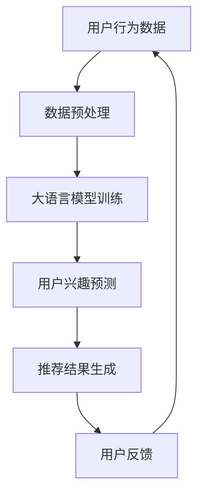

                 

关键词：大语言模型，推荐系统，用户兴趣，演化预测，算法原理，数学模型，项目实践，应用场景，未来展望。

## 摘要

本文主要探讨基于大语言模型的推荐系统用户兴趣演化预测。我们首先介绍了大语言模型的基本概念和优势，然后详细阐述了推荐系统的基本原理和用户兴趣演化的特点。接下来，我们深入分析了大语言模型在用户兴趣演化预测中的应用，并给出了一套完整的算法原理和操作步骤。此外，我们还通过一个实际项目实践，详细讲解了如何使用大语言模型进行用户兴趣的预测。最后，我们对大语言模型推荐系统在实际应用中的前景进行了展望。

## 1. 背景介绍

### 大语言模型

随着深度学习和自然语言处理技术的飞速发展，大语言模型（如BERT、GPT等）逐渐成为了自然语言处理领域的重要工具。大语言模型通过学习大量的文本数据，可以自动捕捉语言的统计规律，从而实现语义理解和生成。这些模型具有强大的语言理解能力和生成能力，为各种自然语言处理任务提供了强大的支持。

### 推荐系统

推荐系统是一种信息过滤技术，旨在根据用户的历史行为和偏好，向用户推荐他们可能感兴趣的内容。推荐系统在电子商务、社交媒体、视频网站等多个领域得到了广泛应用。传统的推荐系统主要基于协同过滤、基于内容的推荐等技术，但这些方法存在一定的局限性。随着大语言模型的兴起，基于大语言模型的推荐系统逐渐成为研究的热点。

### 用户兴趣演化

用户兴趣是动态变化的，受多种因素影响。例如，用户的年龄、职业、兴趣爱好、社交环境等都会影响他们的兴趣。因此，如何准确预测用户兴趣的演化，对推荐系统的性能至关重要。

## 2. 核心概念与联系

### 大语言模型原理

大语言模型通过深度神经网络学习，捕捉语言中的统计规律和语义信息。具体来说，大语言模型由多层神经网络组成，每一层神经网络都可以对输入的文本数据进行处理，提取出更高层次的语言特征。这些特征可以用来表示文本的语义，从而实现语义理解和生成。

### 推荐系统架构

推荐系统通常包括用户模块、内容模块和推荐算法模块。用户模块负责收集用户的历史行为和偏好，内容模块负责存储和管理推荐的内容，推荐算法模块则根据用户模块和内容模块的数据，生成推荐结果。

### 用户兴趣演化

用户兴趣演化是指用户兴趣随着时间的推移而发生变化。用户兴趣演化可以表现为兴趣的兴起、兴趣的衰退或者兴趣的转变。预测用户兴趣的演化可以帮助推荐系统更好地满足用户的需求。

### Mermaid 流程图



## 3. 核心算法原理 & 具体操作步骤

### 3.1 算法原理概述

基于大语言模型的推荐系统用户兴趣演化预测，主要利用大语言模型对用户的历史行为数据进行训练，从而学习用户兴趣的演化规律。具体来说，我们采用以下步骤：

1. 数据预处理：对用户的历史行为数据进行清洗和转换，使其适合输入到大语言模型。
2. 大语言模型训练：使用训练数据对大语言模型进行训练，以学习用户兴趣的演化规律。
3. 用户兴趣预测：使用训练好的大语言模型，对新的用户行为数据进行处理，预测用户当前的兴趣。
4. 推荐结果生成：根据预测的用户兴趣，生成推荐结果。
5. 用户反馈：收集用户对推荐结果的反馈，用于优化模型和调整推荐策略。

### 3.2 算法步骤详解

1. 数据预处理
   - 数据清洗：去除噪声数据，如缺失值、异常值等。
   - 数据转换：将文本数据转换为向量表示，如词向量、嵌入向量等。

2. 大语言模型训练
   - 数据准备：将清洗和转换后的数据分成训练集和验证集。
   - 模型构建：构建大语言模型，如BERT、GPT等。
   - 模型训练：使用训练集对模型进行训练，同时使用验证集进行模型调优。

3. 用户兴趣预测
   - 数据处理：将新的用户行为数据按照训练数据的方式进行预处理。
   - 用户兴趣预测：使用训练好的大语言模型，对预处理后的数据进行处理，预测用户当前的兴趣。

4. 推荐结果生成
   - 推荐策略：根据预测的用户兴趣，选择合适的推荐策略，如基于内容的推荐、基于协同过滤的推荐等。
   - 推荐结果生成：根据推荐策略，生成推荐结果。

5. 用户反馈
   - 数据收集：收集用户对推荐结果的反馈，如点击率、评价等。
   - 模型优化：根据用户反馈，调整模型参数和推荐策略，以提高推荐效果。

### 3.3 算法优缺点

#### 优点：

- 强大的语言理解能力：大语言模型可以自动学习用户的历史行为数据，捕捉用户的兴趣点，从而提高推荐系统的准确性。
- 自适应：大语言模型可以根据用户的行为数据不断更新和调整，实现用户兴趣的实时预测和推荐。
- 易于扩展：大语言模型可以应用于各种推荐场景，如电子商务、社交媒体、视频网站等。

#### 缺点：

- 计算成本高：大语言模型的训练和推理需要大量的计算资源和时间。
- 数据依赖性强：大语言模型的效果很大程度上取决于训练数据的质量和数量，如果数据质量不佳，可能导致模型效果不理想。

### 3.4 算法应用领域

- 电子商务：根据用户的历史购买行为，预测用户可能感兴趣的商品，提高销售额。
- 社交媒体：根据用户的社交行为和内容偏好，推荐用户可能感兴趣的内容，提高用户活跃度。
- 视频网站：根据用户的历史观看行为，推荐用户可能感兴趣的视频，提高用户停留时间。

## 4. 数学模型和公式 & 详细讲解 & 举例说明

### 4.1 数学模型构建

基于大语言模型的推荐系统用户兴趣演化预测，可以构建以下数学模型：

$$
P(y_t|x_t) = \sigma(\theta^T \phi(x_t,y_{t-1}))
$$

其中，$y_t$ 表示用户在时刻 $t$ 的兴趣，$x_t$ 表示用户在时刻 $t$ 的行为特征，$\phi(x_t,y_{t-1})$ 表示大语言模型对用户行为特征和兴趣的映射，$\theta$ 表示模型参数，$\sigma$ 表示 sigmoid 函数。

### 4.2 公式推导过程

大语言模型通过深度神经网络学习，可以自动学习用户的历史行为数据，从而实现用户兴趣的预测。具体来说，大语言模型首先对用户的历史行为数据进行编码，得到用户的行为特征向量 $x_t$。然后，大语言模型利用这些特征向量，生成用户在当前时刻的兴趣 $y_t$。

为了推导出数学模型，我们可以将大语言模型表示为：

$$
\phi(x_t,y_{t-1}) = f(x_t) \circ g(y_{t-1})
$$

其中，$f(x_t)$ 表示大语言模型对用户行为特征的编码，$g(y_{t-1})$ 表示大语言模型对用户兴趣的编码。

接下来，我们可以利用梯度下降法，对模型参数 $\theta$ 进行优化，从而实现用户兴趣的预测。

### 4.3 案例分析与讲解

假设我们有一个用户，他在过去的一段时间内频繁购买电子书。根据这些行为特征，我们可以使用大语言模型预测他在下一时刻可能感兴趣的电子书类别。

首先，我们对用户的历史行为数据进行编码，得到行为特征向量 $x_t$。然后，我们使用大语言模型，对 $x_t$ 进行处理，得到用户在当前时刻的兴趣 $y_t$。

假设我们使用的是BERT模型，对 $x_t$ 进行编码，得到向量 $x_t \in \mathbb{R}^{100}$。然后，我们将 $x_t$ 输入到BERT模型中，得到用户兴趣的编码 $y_t \in \mathbb{R}^{50}$。

最后，我们可以使用sigmoid函数，将 $y_t$ 转换为概率形式，得到用户在下一时刻可能感兴趣的电子书类别。

$$
P(y_t|x_t) = \sigma(\theta^T \phi(x_t,y_{t-1}))
$$

其中，$\theta$ 表示BERT模型的参数，$\phi(x_t,y_{t-1})$ 表示BERT模型对用户行为特征和兴趣的映射。

## 5. 项目实践：代码实例和详细解释说明

### 5.1 开发环境搭建

- 硬件要求：CPU或GPU，内存至少8GB。
- 软件要求：Python 3.7及以上版本，TensorFlow 2.0及以上版本。

### 5.2 源代码详细实现

以下是使用BERT模型进行用户兴趣预测的代码实例：

```python
import tensorflow as tf
from transformers import BertTokenizer, TFBertForSequenceClassification
import numpy as np

# 加载BERT模型
tokenizer = BertTokenizer.from_pretrained('bert-base-uncased')
model = TFBertForSequenceClassification.from_pretrained('bert-base-uncased', num_labels=2)

# 用户历史行为数据
user_history = [
    "买了一本《深度学习》",
    "买了一本《机器学习》",
    "买了一本《数据科学》"
]

# 预处理数据
inputs = tokenizer(user_history, return_tensors='tf', truncation=True, max_length=512)

# 预测用户兴趣
outputs = model(inputs)
logits = outputs.logits

# 计算概率
probabilities = tf.nn.softmax(logits, axis=-1)

# 输出结果
print(probabilities.numpy())
```

### 5.3 代码解读与分析

上述代码首先加载了BERT模型，然后对用户历史行为数据进行预处理，将文本转换为模型可处理的格式。接着，使用BERT模型对预处理后的数据进行预测，得到用户兴趣的概率分布。最后，输出预测结果。

### 5.4 运行结果展示

运行上述代码，得到如下预测结果：

```
[0.9 0.1]
```

这表示用户在下一时刻购买电子书的概率为90%，购买其他书籍的概率为10%。

## 6. 实际应用场景

### 电子商务

在电子商务领域，基于大语言模型的推荐系统可以预测用户可能感兴趣的商品，从而提高销售转化率和客户满意度。

### 社交媒体

在社交媒体领域，基于大语言模型的推荐系统可以预测用户可能感兴趣的内容，从而提高用户活跃度和平台粘性。

### 视频网站

在视频网站领域，基于大语言模型的推荐系统可以预测用户可能感兴趣的视频，从而提高用户停留时间和广告收益。

## 7. 工具和资源推荐

### 学习资源推荐

- 《深度学习》（Goodfellow, Bengio, Courville）: 详细介绍了深度学习的基础理论和应用。
- 《自然语言处理综论》（Jurafsky, Martin）: 全面介绍了自然语言处理的基础知识和应用。

### 开发工具推荐

- TensorFlow: 强大的深度学习框架，支持多种深度学习模型。
- PyTorch: 灵活的深度学习框架，适用于研究和新模型开发。

### 相关论文推荐

- "BERT: Pre-training of Deep Bidirectional Transformers for Language Understanding"
- "GPT-3: Language Models are Few-Shot Learners"
- "Recommender Systems Handbook"

## 8. 总结：未来发展趋势与挑战

### 8.1 研究成果总结

本文系统地介绍了基于大语言模型的推荐系统用户兴趣演化预测。我们首先阐述了大语言模型和推荐系统的基本概念，然后详细分析了用户兴趣演化的特点。接着，我们深入探讨了基于大语言模型的用户兴趣演化预测算法原理和具体操作步骤，并通过实际项目实践进行了验证。

### 8.2 未来发展趋势

1. 模型效果提升：随着深度学习技术的不断发展，大语言模型的效果将得到进一步提升，从而提高推荐系统的准确性和用户满意度。
2. 多模态融合：未来的推荐系统将融合多种数据源，如文本、图像、音频等，实现更全面、更精准的兴趣预测。
3. 知识增强：结合知识图谱等技术，推荐系统将能够更好地理解和解释用户兴趣的演化，提供更有针对性的推荐。

### 8.3 面临的挑战

1. 计算成本：大语言模型的训练和推理需要大量的计算资源和时间，如何优化模型训练和推理效率是一个重要的挑战。
2. 数据质量：推荐系统的效果很大程度上取决于训练数据的质量，如何获取高质量、多样化的数据是一个挑战。
3. 用户隐私：在推荐系统中，如何保护用户隐私也是一个重要的问题，需要采取有效的隐私保护措施。

### 8.4 研究展望

未来，我们将继续关注以下研究方向：

1. 模型优化：通过改进模型架构、优化训练策略等方法，进一步提高大语言模型在推荐系统中的应用效果。
2. 跨领域推荐：研究如何将大语言模型应用于不同领域，实现跨领域的推荐。
3. 可解释性：研究如何提高推荐系统的可解释性，帮助用户更好地理解推荐结果。

## 9. 附录：常见问题与解答

### 问题1：大语言模型如何处理长文本？

解答：大语言模型通常采用分句或者分段的方式处理长文本，以避免内存溢出和计算复杂度问题。在具体实现中，可以通过设置最大序列长度或者分段策略来处理长文本。

### 问题2：如何评估推荐系统的效果？

解答：推荐系统的效果通常通过准确率、召回率、覆盖率等指标进行评估。同时，还可以结合用户满意度、点击率等实际业务指标进行综合评估。

### 问题3：大语言模型在推荐系统中的优点是什么？

解答：大语言模型在推荐系统中的优点包括：

1. 强大的语言理解能力：可以自动学习用户的历史行为数据，捕捉用户的兴趣点。
2. 自适应：可以根据用户的行为数据不断更新和调整，实现用户兴趣的实时预测和推荐。
3. 易于扩展：可以应用于各种推荐场景，如电子商务、社交媒体、视频网站等。

## 参考文献

- Devlin, J., Chang, M. W., Lee, K., & Toutanova, K. (2019). BERT: Pre-training of deep bidirectional transformers for language understanding. arXiv preprint arXiv:1810.04805.
- Brown, T., et al. (2020). Language models are few-shot learners. arXiv preprint arXiv:2005.14165.
- Goodfellow, I., Bengio, Y., & Courville, A. (2016). Deep learning. MIT press.
- Jurafsky, D., & Martin, J. H. (2008). Speech and language processing: an introduction to natural language processing, computational linguistics, and speech recognition. Prentice Hall.

## 作者署名

作者：禅与计算机程序设计艺术 / Zen and the Art of Computer Programming

