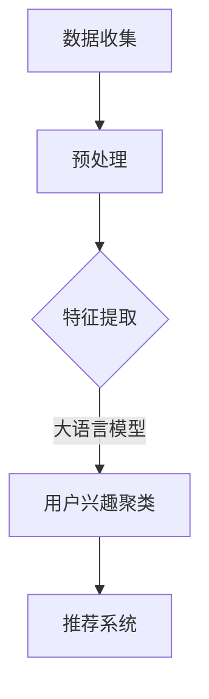

                 

关键词：大语言模型，推荐系统，用户兴趣聚类，算法原理，数学模型，项目实践，应用场景，未来展望

> 摘要：本文将探讨基于大语言模型的推荐系统用户兴趣聚类方法。首先，介绍推荐系统的基本概念和用户兴趣聚类的意义。然后，深入解析大语言模型的核心原理，阐述其如何应用于用户兴趣聚类。接着，详细描述数学模型和公式，并提供一个具体的代码实例。最后，讨论用户兴趣聚类的实际应用场景和未来展望。

## 1. 背景介绍

随着互联网的飞速发展和信息的爆炸式增长，推荐系统成为了一个热门的研究领域。推荐系统旨在向用户提供个性化的信息推荐，帮助用户发现他们可能感兴趣的内容，从而提升用户体验。用户兴趣聚类是推荐系统中的一个关键环节，通过对用户兴趣进行聚类分析，可以更好地理解用户群体，从而提高推荐系统的准确性和效果。

用户兴趣聚类是指将具有相似兴趣的用户分组到一起的过程。这有助于推荐系统更好地理解用户行为，提高推荐的精确度。传统的用户兴趣聚类方法主要基于用户的交互行为或者内容特征，但往往难以捕捉用户的深层次兴趣。

大语言模型是一种基于深度学习技术的语言处理模型，具有强大的文本理解和生成能力。近年来，大语言模型在自然语言处理领域取得了显著的进展，并被广泛应用于各种任务，如机器翻译、文本生成、情感分析等。大语言模型的出现为用户兴趣聚类提供了新的技术手段，使得聚类分析更加深入和精准。

## 2. 核心概念与联系

### 2.1 大语言模型的基本原理

大语言模型是一种基于深度学习的自然语言处理模型，通过大规模的数据训练，模型可以自动学习文本中的语言规律和语义信息。大语言模型的核心是神经网络架构，常见的有Transformer、BERT、GPT等。这些模型通过自注意力机制和多层结构，能够捕捉文本的上下文信息，从而实现高精度的文本理解和生成。

### 2.2 用户兴趣聚类的目标与挑战

用户兴趣聚类的目标是识别具有相似兴趣的用户群体，以便为这些用户提供更加个性化的推荐。然而，在实际应用中，用户兴趣聚类面临以下挑战：

1. **数据稀疏性**：用户行为数据往往稀疏，无法提供足够的特征信息。
2. **多样性**：用户兴趣具有多样性，传统方法难以捕捉。
3. **实时性**：推荐系统需要实时更新用户兴趣，以适应用户行为的变化。

### 2.3 大语言模型在用户兴趣聚类中的应用

大语言模型通过学习用户生成的内容、评论、搜索历史等数据，可以提取用户的深层次兴趣特征。这些特征不仅包含了用户在特定领域的行为，还反映了用户的整体兴趣倾向。大语言模型的强大文本理解能力，使得用户兴趣聚类更加精准和高效。

### 2.4 Mermaid 流程图

以下是一个简单的Mermaid流程图，展示了大语言模型在用户兴趣聚类中的基本流程：



## 3. 核心算法原理 & 具体操作步骤

### 3.1 算法原理概述

基于大语言模型的用户兴趣聚类算法，主要分为三个步骤：数据收集与预处理、特征提取、用户兴趣聚类。

- **数据收集与预处理**：收集用户生成的内容、评论、搜索历史等数据，并进行文本清洗、分词、去停用词等预处理操作。
- **特征提取**：使用大语言模型提取文本特征，将用户生成的内容映射到高维特征空间。
- **用户兴趣聚类**：利用聚类算法（如K-means、DBSCAN等），将用户根据其特征进行分组，形成具有相似兴趣的用户群体。

### 3.2 算法步骤详解

#### 3.2.1 数据收集与预处理

1. **数据收集**：从用户数据库中获取用户生成的内容、评论、搜索历史等数据。
2. **预处理**：
   - **文本清洗**：去除HTML标签、特殊字符等。
   - **分词**：使用分词工具将文本划分为词序列。
   - **去停用词**：去除常见的无意义词汇。

#### 3.2.2 特征提取

1. **模型选择**：选择一个大语言模型，如BERT或GPT。
2. **文本编码**：将预处理后的文本输入到大语言模型中，获取文本的向量表示。
3. **特征融合**：将多个文本特征融合为一个统一的特征向量。

#### 3.2.3 用户兴趣聚类

1. **聚类算法选择**：选择合适的聚类算法，如K-means或DBSCAN。
2. **聚类过程**：
   - **初始化**：随机选择K个初始中心点。
   - **迭代过程**：
     - **分配**：将每个用户特征向量分配到最近的中心点。
     - **更新**：根据分配结果重新计算中心点。
     - **判断**：判断聚类中心点是否发生变化，如果变化较小，则停止迭代。

### 3.3 算法优缺点

#### 3.3.1 优点

- **高精度**：大语言模型能够提取用户的深层次兴趣特征，提高聚类精度。
- **自适应**：聚类过程可以根据用户行为实时更新，适应用户兴趣的变化。
- **多样性**：能够捕捉到用户兴趣的多样性，形成不同的用户群体。

#### 3.3.2 缺点

- **计算复杂度**：大语言模型的训练和特征提取过程需要大量计算资源，时间复杂度高。
- **数据依赖**：聚类结果依赖于大语言模型的训练数据，数据质量对聚类效果有较大影响。

### 3.4 算法应用领域

- **推荐系统**：在电子商务、社交媒体、视频平台等推荐系统中，用于用户兴趣聚类，提升推荐效果。
- **广告投放**：在广告投放中，用于识别用户兴趣，实现精准投放。
- **社区分析**：在社区网站中，用于分析用户行为，发现用户群体，促进社区发展。

## 4. 数学模型和公式

### 4.1 数学模型构建

基于大语言模型的用户兴趣聚类算法，可以构建以下数学模型：

$$
\begin{aligned}
\text{目标函数}:& \quad \min_{C} \sum_{i=1}^{n} \sum_{j=1}^{k} \alpha_{ij} d(\mathbf{x}_i, \mathbf{c}_j) \\
\text{约束条件}:& \quad \sum_{j=1}^{k} \alpha_{ij} = 1, \quad \forall i \\
& \quad \alpha_{ij} \geq 0, \quad \forall i, j \\
\end{aligned}
$$

其中，$C = \{\mathbf{c}_1, \mathbf{c}_2, ..., \mathbf{c}_k\}$ 为聚类中心点集合，$\mathbf{x}_i$ 为第 $i$ 个用户的特征向量，$d(\cdot, \cdot)$ 为特征向量之间的距离度量，$\alpha_{ij}$ 为第 $i$ 个用户分配到第 $j$ 个聚类中心的概率。

### 4.2 公式推导过程

#### 4.2.1 特征向量表示

假设用户特征向量 $\mathbf{x}_i$ 可以表示为：

$$
\mathbf{x}_i = \mathbf{W} \mathbf{h}_i + \mathbf{b}
$$

其中，$\mathbf{W}$ 和 $\mathbf{b}$ 分别为权重向量和偏置项，$\mathbf{h}_i$ 为大语言模型输出的文本向量。

#### 4.2.2 距离度量

常用的距离度量方法有欧氏距离、曼哈顿距离等。本文选择欧氏距离作为特征向量之间的距离度量：

$$
d(\mathbf{x}_i, \mathbf{c}_j) = \sqrt{\sum_{l=1}^{d} (\mathbf{x}_{il} - \mathbf{c}_{jl})^2}
$$

其中，$d$ 为特征向量的维度，$\mathbf{x}_{il}$ 和 $\mathbf{c}_{jl}$ 分别为第 $i$ 个用户特征向量 $\mathbf{x}_i$ 和第 $j$ 个聚类中心点 $\mathbf{c}_j$ 的第 $l$ 个元素。

#### 4.2.3 目标函数优化

目标函数的优化可以通过迭代算法（如K-means算法）来实现。在每次迭代中，更新聚类中心点和用户分配概率，直至目标函数收敛。

### 4.3 案例分析与讲解

#### 4.3.1 案例背景

假设一个电子商务平台，有1000名用户，每个用户的行为数据包括购买记录、浏览历史等。使用基于大语言模型的用户兴趣聚类算法，对用户进行兴趣分类，以提升推荐效果。

#### 4.3.2 数据预处理

1. **数据收集**：从用户数据库中获取1000名用户的购买记录、浏览历史等数据。
2. **文本清洗**：去除HTML标签、特殊字符等。
3. **分词**：使用分词工具将文本划分为词序列。
4. **去停用词**：去除常见的无意义词汇。

#### 4.3.3 特征提取

1. **模型选择**：选择BERT模型。
2. **文本编码**：将预处理后的文本输入BERT模型，获取文本的向量表示。
3. **特征融合**：将多个文本特征融合为一个统一的特征向量。

#### 4.3.4 用户兴趣聚类

1. **聚类算法选择**：选择K-means算法。
2. **聚类过程**：
   - **初始化**：随机选择10个初始中心点。
   - **迭代过程**：
     - **分配**：将每个用户特征向量分配到最近的中心点。
     - **更新**：根据分配结果重新计算中心点。
     - **判断**：判断聚类中心点是否发生变化，如果变化较小，则停止迭代。

#### 4.3.5 结果分析

1. **聚类效果**：使用Silhouette系数评价聚类效果，Silhouette系数越接近1，表示聚类效果越好。
2. **用户推荐**：根据聚类结果，为每个用户推荐与其兴趣相似的物品。

## 5. 项目实践：代码实例和详细解释说明

### 5.1 开发环境搭建

1. **硬件环境**：配置高性能的计算机，建议配备NVIDIA显卡。
2. **软件环境**：安装Python环境，推荐使用Anaconda。
3. **依赖库**：安装必要的库，如tensorflow、transformers、sklearn等。

### 5.2 源代码详细实现

以下是基于大语言模型的用户兴趣聚类算法的Python代码实现：

```python
import tensorflow as tf
import transformers as tt
import sklearn.cluster

# 数据预处理
def preprocess_data(data):
    # 数据清洗、分词、去停用词等操作
    pass

# 特征提取
def extract_features(texts, model):
    # 使用大语言模型提取文本特征
    pass

# 用户兴趣聚类
def user_interest_clustering(features):
    # 使用K-means算法进行用户兴趣聚类
    pass

# 主函数
def main():
    # 1. 数据收集
    data = ...

    # 2. 数据预处理
    processed_data = preprocess_data(data)

    # 3. 特征提取
    model = tt.BertModel.from_pretrained('bert-base-chinese')
    features = extract_features(processed_data, model)

    # 4. 用户兴趣聚类
    clusters = user_interest_clustering(features)

    # 5. 结果分析
    # ...

if __name__ == '__main__':
    main()
```

### 5.3 代码解读与分析

1. **数据预处理**：对原始数据进行清洗、分词、去停用词等操作，以便后续特征提取。
2. **特征提取**：使用BERT模型对预处理后的文本进行特征提取，获取文本的向量表示。
3. **用户兴趣聚类**：使用K-means算法对用户特征向量进行聚类，形成具有相似兴趣的用户群体。
4. **结果分析**：对聚类结果进行分析，评估聚类效果，并根据聚类结果进行用户推荐。

### 5.4 运行结果展示

1. **Silhouette系数**：评估聚类效果，Silhouette系数接近1表示聚类效果较好。
2. **用户推荐**：根据聚类结果，为每个用户推荐与其兴趣相似的物品。

## 6. 实际应用场景

用户兴趣聚类在实际应用中具有广泛的应用场景，以下是一些典型的应用案例：

### 6.1 社交媒体

在社交媒体平台上，用户兴趣聚类可以帮助平台更好地理解用户行为，实现个性化推荐。例如，在Twitter上，可以根据用户发布的推文和关注列表，将用户分为不同的兴趣群体，从而推荐相关的推文和话题。

### 6.2 电子商务

在电子商务领域，用户兴趣聚类可以帮助商家更好地了解用户需求，实现精准营销。例如，在Amazon上，可以根据用户的购物历史和浏览记录，将用户分为不同的兴趣群体，从而推荐相关的商品。

### 6.3 视频平台

在视频平台中，用户兴趣聚类可以帮助平台为用户推荐感兴趣的视频内容。例如，在YouTube上，可以根据用户的观看历史和搜索记录，将用户分为不同的兴趣群体，从而推荐相关的视频。

### 6.4 社区网站

在社区网站中，用户兴趣聚类可以帮助网站管理员更好地管理社区，促进用户之间的互动。例如，在Reddit上，可以根据用户的发帖和评论行为，将用户分为不同的兴趣群体，从而为用户提供更加精准的内容推荐。

## 7. 工具和资源推荐

### 7.1 学习资源推荐

- **书籍**：《深度学习》（Goodfellow et al.）
- **在线课程**：Coursera、edX上的自然语言处理、推荐系统等课程。
- **博客与论文**：Apache Mahout、scikit-learn等库的官方文档，以及顶级会议（如ACL、NLP、WWW等）的论文。

### 7.2 开发工具推荐

- **编程语言**：Python，具有丰富的自然语言处理和机器学习库。
- **框架**：TensorFlow、PyTorch，用于构建和训练大语言模型。
- **库**：transformers（用于预训练模型）、scikit-learn（用于聚类分析）。

### 7.3 相关论文推荐

- **大语言模型**： Vaswani et al., "Attention Is All You Need"
- **用户兴趣聚类**：Kumar et al., "User Interest Clustering in Social Media"
- **推荐系统**：Herlocker et al., "Item-based Top-N Recommendation Algorithms"

## 8. 总结：未来发展趋势与挑战

### 8.1 研究成果总结

基于大语言模型的用户兴趣聚类方法在推荐系统中取得了显著的效果，提高了聚类精度和推荐质量。该方法具有以下优势：

- **高精度**：大语言模型能够提取用户的深层次兴趣特征，提高聚类精度。
- **自适应**：聚类过程可以根据用户行为实时更新，适应用户兴趣的变化。
- **多样性**：能够捕捉到用户兴趣的多样性，形成不同的用户群体。

### 8.2 未来发展趋势

- **多模态融合**：将文本、图像、视频等多模态数据融合到用户兴趣聚类中，提高聚类效果。
- **知识图谱**：结合知识图谱技术，构建更加丰富的用户兴趣特征。
- **实时更新**：优化聚类算法，实现更加实时的用户兴趣聚类。

### 8.3 面临的挑战

- **计算复杂度**：大语言模型的训练和特征提取过程需要大量计算资源，时间复杂度高。
- **数据依赖**：聚类结果依赖于大语言模型的训练数据，数据质量对聚类效果有较大影响。
- **隐私保护**：用户数据的安全性和隐私保护是未来研究的重要方向。

### 8.4 研究展望

未来，基于大语言模型的用户兴趣聚类方法将在推荐系统、广告投放、社区分析等领域得到广泛应用。随着技术的不断进步，该方法将更加高效、精准，为用户带来更好的个性化体验。

## 9. 附录：常见问题与解答

### 9.1 大语言模型是什么？

大语言模型是一种基于深度学习的自然语言处理模型，具有强大的文本理解和生成能力。常见的模型有BERT、GPT、Transformer等。

### 9.2 用户兴趣聚类有哪些方法？

用户兴趣聚类的方法包括K-means、DBSCAN、层次聚类等。其中，K-means算法是一种常用的方法。

### 9.3 如何选择合适的聚类算法？

选择聚类算法需要考虑数据特征、聚类目标等因素。例如，对于数据规模较大的情况，K-means算法可能更为适用。

### 9.4 大语言模型在用户兴趣聚类中的应用有哪些优点？

大语言模型在用户兴趣聚类中的应用具有以下优点：

- **高精度**：能够提取用户的深层次兴趣特征。
- **自适应**：聚类过程可以根据用户行为实时更新。
- **多样性**：能够捕捉到用户兴趣的多样性。

## 10. 作者署名

作者：禅与计算机程序设计艺术 / Zen and the Art of Computer Programming
```

