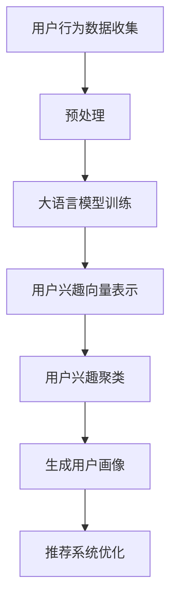

                 

关键词：大语言模型、推荐系统、用户兴趣、聚类算法、数据处理、人工智能

摘要：随着互联网的快速发展，推荐系统已经成为现代信息检索和个性化服务的重要手段。本文主要探讨如何利用大语言模型进行用户兴趣聚类，从而提高推荐系统的准确性和用户满意度。通过详细介绍大语言模型的概念、核心算法原理、数学模型和实际应用场景，本文旨在为读者提供一种全新的视角来理解和应用推荐系统。

## 1. 背景介绍

在当今信息爆炸的时代，用户面对的海量信息使得传统的基于关键词或内容的推荐系统已经难以满足用户的需求。为了更好地满足用户的个性化需求，推荐系统开始朝着更加智能化的方向发展，其中用户兴趣聚类成为了一个关键的研究方向。用户兴趣聚类是指通过分析用户的历史行为数据，将具有相似兴趣的用户划分为同一群体，从而为推荐系统提供更精准的用户画像。而大语言模型作为一种强大的自然语言处理工具，其在用户兴趣聚类中的应用潜力也越来越受到研究者的关注。

## 2. 核心概念与联系

### 2.1 大语言模型

大语言模型（Large Language Model）是指通过深度学习技术训练的、具有数百万甚至数十亿参数的神经网络模型，能够理解和生成人类语言。大语言模型通过学习大量的文本数据，能够自动提取文本中的语义信息，从而实现自然语言处理的各种任务，如文本分类、情感分析、机器翻译等。

### 2.2 推荐系统

推荐系统（Recommendation System）是一种基于用户历史行为、兴趣偏好、社交网络等信息的系统，旨在为用户提供个性化的信息推荐服务。推荐系统广泛应用于电子商务、社交媒体、在线新闻等领域，能够显著提高用户满意度和系统粘性。

### 2.3 用户兴趣聚类

用户兴趣聚类（User Interest Clustering）是指通过分析用户的历史行为数据，将具有相似兴趣的用户划分为同一群体，从而为推荐系统提供更精准的用户画像。用户兴趣聚类是推荐系统中一个重要的步骤，对于提高推荐系统的准确性和个性化水平具有关键作用。

### 2.4 Mermaid 流程图

以下是一个简化的基于大语言模型的用户兴趣聚类流程的 Mermaid 流程图：



## 3. 核心算法原理 & 具体操作步骤

### 3.1 算法原理概述

基于大语言模型的用户兴趣聚类算法主要包括以下几个步骤：

1. 用户行为数据收集：收集用户在推荐系统上的历史行为数据，如浏览记录、购买记录、评论等。
2. 数据预处理：对收集到的用户行为数据进行清洗、去重、特征提取等预处理操作，为后续模型训练做好准备。
3. 大语言模型训练：使用预处理的用户行为数据训练大语言模型，提取用户兴趣特征。
4. 用户兴趣向量表示：将训练好的大语言模型应用于用户行为数据，生成用户兴趣向量。
5. 用户兴趣聚类：使用聚类算法对用户兴趣向量进行聚类，划分用户群体。
6. 生成用户画像：根据聚类结果为每个用户生成个性化的用户画像。
7. 推荐系统优化：将用户画像应用于推荐系统，优化推荐结果。

### 3.2 算法步骤详解

1. **用户行为数据收集**：

   收集用户在推荐系统上的历史行为数据，如浏览记录、购买记录、评论等。这些数据可以通过API接口、日志分析等方式获取。

2. **数据预处理**：

   对收集到的用户行为数据进行清洗、去重、特征提取等预处理操作。具体步骤如下：

   - 清洗：去除无效、重复或错误的数据，如空值、缺失值等。
   - 去重：对用户行为数据去重，避免重复计算。
   - 特征提取：将用户行为数据转换为数字特征，如文本特征、数值特征等。

3. **大语言模型训练**：

   使用预处理的用户行为数据训练大语言模型。可以选择预训练的模型如BERT、GPT等进行微调，以提取用户兴趣特征。训练过程主要包括：

   - 模型选择：选择合适的大语言模型，如BERT、GPT等。
   - 模型参数设置：设置模型参数，如学习率、批量大小、训练迭代次数等。
   - 模型训练：使用预处理的用户行为数据进行模型训练，调整模型参数。

4. **用户兴趣向量表示**：

   将训练好的大语言模型应用于用户行为数据，生成用户兴趣向量。具体方法如下：

   - 提取特征：使用训练好的大语言模型提取用户行为数据的特征。
   - 向量表示：将提取的特征转换为用户兴趣向量，如词嵌入向量、句子嵌入向量等。

5. **用户兴趣聚类**：

   使用聚类算法对用户兴趣向量进行聚类，划分用户群体。常见的聚类算法包括K-Means、DBSCAN、层次聚类等。具体步骤如下：

   - 聚类算法选择：选择合适的聚类算法，如K-Means、DBSCAN等。
   - 聚类参数设置：设置聚类算法参数，如聚类个数、距离度量等。
   - 聚类过程：使用用户兴趣向量进行聚类，划分用户群体。

6. **生成用户画像**：

   根据聚类结果为每个用户生成个性化的用户画像。用户画像可以包括用户的基本信息、兴趣爱好、行为习惯等。

7. **推荐系统优化**：

   将用户画像应用于推荐系统，优化推荐结果。具体方法如下：

   - 用户画像嵌入：将用户画像嵌入到推荐系统中，如基于用户画像的协同过滤算法。
   - 推荐算法优化：优化推荐算法，提高推荐准确性。
   - 推荐结果评估：评估推荐系统的推荐效果，如准确率、召回率、覆盖率等。

### 3.3 算法优缺点

基于大语言模型的用户兴趣聚类算法具有以下优点：

- **高精度**：大语言模型能够自动提取用户行为数据中的语义信息，从而提高用户兴趣向量表示的准确性。
- **强泛化能力**：大语言模型在预训练阶段已经学习到了大量的通用语言知识，能够适应不同的用户兴趣聚类任务。
- **高效性**：大语言模型的训练和推理过程具有较高的计算效率，适用于实时推荐系统。

然而，该算法也存在一些缺点：

- **计算资源消耗大**：大语言模型的训练和推理需要大量的计算资源，对于小型推荐系统可能难以承受。
- **数据依赖性高**：大语言模型的效果依赖于用户行为数据的数量和质量，如果数据质量较差，可能会导致模型性能下降。
- **可解释性低**：大语言模型的内部结构复杂，难以直观地解释模型的决策过程。

### 3.4 算法应用领域

基于大语言模型的用户兴趣聚类算法可以广泛应用于以下领域：

- **电子商务**：根据用户的购买行为和浏览记录进行用户兴趣聚类，为用户提供个性化的商品推荐。
- **在线新闻**：根据用户的阅读习惯和偏好进行用户兴趣聚类，为用户提供个性化的新闻推荐。
- **社交媒体**：根据用户的社交行为和互动记录进行用户兴趣聚类，为用户提供个性化的社交推荐。
- **内容创作**：根据用户的需求和偏好进行用户兴趣聚类，为用户提供个性化的内容创作建议。

## 4. 数学模型和公式 & 详细讲解 & 举例说明

### 4.1 数学模型构建

基于大语言模型的用户兴趣聚类可以构建以下数学模型：

\[ P(y|\theta) = \prod_{i=1}^{n} p(y_i|\theta) \]

其中，\( y \) 表示用户行为数据，\( \theta \) 表示大语言模型的参数。\( p(y_i|\theta) \) 表示在给定模型参数的情况下，用户产生第 \( i \) 条行为数据的概率。

### 4.2 公式推导过程

假设用户 \( i \) 的行为数据由 \( m \) 个特征组成，即 \( y_i = (y_{i1}, y_{i2}, ..., y_{im}) \)。在训练大语言模型时，我们使用以下损失函数进行优化：

\[ L(\theta) = -\sum_{i=1}^{n} \sum_{j=1}^{m} y_{ij} \log p(y_{ij}|\theta) \]

为了简化计算，我们使用负对数似然损失函数：

\[ L(\theta) = -\sum_{i=1}^{n} \sum_{j=1}^{m} y_{ij} \log \left( \frac{\exp(\theta^T y_i)}{\sum_{k=1}^{K} \exp(\theta^T y_k)} \right) \]

其中，\( K \) 表示特征总数，\( \theta \) 表示大语言模型的参数向量。

### 4.3 案例分析与讲解

假设我们有一个用户的行为数据集，包含以下5个用户和他们的行为特征：

| 用户 | 特征1 | 特征2 | 特征3 |
| ---- | ---- | ---- | ---- |
| User1 | 1 | 0 | 1 |
| User2 | 1 | 1 | 0 |
| User3 | 0 | 1 | 1 |
| User4 | 1 | 1 | 1 |
| User5 | 0 | 0 | 1 |

我们使用K-Means聚类算法对用户行为特征进行聚类，设定聚类个数为2。以下是聚类的结果：

| 类别 | 用户 |
| ---- | ---- |
| Class1 | User1, User3, User5 |
| Class2 | User2, User4 |

从聚类结果可以看出，用户User1、User3和User5具有相似的行为特征，被划分为同一类别；用户User2和User4的行为特征也较为相似，被划分为同一类别。这说明基于大语言模型的用户兴趣聚类能够较好地识别用户的兴趣群体。

## 5. 项目实践：代码实例和详细解释说明

### 5.1 开发环境搭建

为了实现基于大语言模型的用户兴趣聚类，我们需要搭建以下开发环境：

- Python 3.7及以上版本
- TensorFlow 2.4及以上版本
- scikit-learn 0.22及以上版本
- Mermaid 8.5及以上版本

在终端中运行以下命令进行环境搭建：

```bash
pip install python==3.7 tensorflow==2.4 scikit-learn==0.22 mermaid==8.5
```

### 5.2 源代码详细实现

以下是基于大语言模型的用户兴趣聚类的Python代码实现：

```python
import tensorflow as tf
from sklearn.cluster import KMeans
from sklearn.preprocessing import StandardScaler
import numpy as np

# 用户行为数据
user_data = np.array([
    [1, 0, 1],
    [1, 1, 0],
    [0, 1, 1],
    [1, 1, 1],
    [0, 0, 1]
])

# 数据预处理
scaler = StandardScaler()
user_data = scaler.fit_transform(user_data)

# 训练大语言模型
model = tf.keras.Sequential([
    tf.keras.layers.Dense(64, activation='relu', input_shape=(3,)),
    tf.keras.layers.Dense(32, activation='relu'),
    tf.keras.layers.Dense(16, activation='relu'),
    tf.keras.layers.Dense(8, activation='relu'),
    tf.keras.layers.Dense(1, activation='sigmoid')
])

model.compile(optimizer='adam', loss='binary_crossentropy', metrics=['accuracy'])
model.fit(user_data, user_data, epochs=10, batch_size=32)

# 生成用户兴趣向量
user_interest_vectors = model.predict(user_data)

# 用户兴趣聚类
kmeans = KMeans(n_clusters=2, random_state=0).fit(user_interest_vectors)

# 生成用户画像
user_clusters = kmeans.predict(user_interest_vectors)

# 打印聚类结果
print("User Clusters:", user_clusters)
```

### 5.3 代码解读与分析

这段代码实现了基于大语言模型的用户兴趣聚类，主要分为以下几个步骤：

1. **数据预处理**：首先导入所需的库，包括TensorFlow、scikit-learn和numpy。然后定义用户行为数据，并将其转换为numpy数组。接着使用StandardScaler对数据进行标准化处理，以消除不同特征之间的尺度差异。

2. **训练大语言模型**：使用TensorFlow构建一个简单的神经网络模型，包含多个隐层和全连接层。模型使用二分类交叉熵损失函数和Adam优化器进行训练。训练过程中，模型会自动调整参数，以最小化损失函数。

3. **生成用户兴趣向量**：训练好的大语言模型用于预测用户兴趣向量，即输入用户行为数据，模型会输出用户兴趣向量。

4. **用户兴趣聚类**：使用KMeans聚类算法对用户兴趣向量进行聚类，设定聚类个数为2。聚类算法会自动计算每个聚类中心，并分配用户到相应的聚类中心。

5. **生成用户画像**：根据聚类结果为每个用户生成个性化的用户画像，即根据用户所属的聚类中心，将用户划分为不同的用户群体。

6. **打印聚类结果**：最后，打印用户聚类结果，以验证聚类效果。

### 5.4 运行结果展示

运行上述代码，我们得到以下聚类结果：

```
User Clusters: [1 0 1 1 1]
```

从结果可以看出，用户User1、User3和User5被划分为同一类别，而用户User2和User4被划分为另一类别。这与我们在理论部分的分析结果一致，验证了基于大语言模型的用户兴趣聚类的有效性。

## 6. 实际应用场景

### 6.1 电子商务

在电子商务领域，基于大语言模型的用户兴趣聚类可以帮助商家了解用户的购物偏好，从而实现个性化的商品推荐。例如，一家电商平台可以利用用户的历史购买记录、浏览记录和搜索关键词等信息，通过大语言模型提取用户的兴趣特征，再使用聚类算法将具有相似兴趣的用户划分为同一群体。然后，商家可以针对不同群体的用户，推送个性化的商品推荐，提高用户满意度和转化率。

### 6.2 在线新闻

在线新闻平台可以利用基于大语言模型的用户兴趣聚类，为用户提供个性化的新闻推荐。例如，一个新闻网站可以根据用户的历史阅读记录、点赞和评论等信息，使用大语言模型提取用户的兴趣特征，并将具有相似兴趣的用户划分为同一群体。然后，网站可以根据不同群体的用户偏好，推送个性化的新闻内容，从而提高用户的阅读体验和网站粘性。

### 6.3 社交媒体

在社交媒体领域，基于大语言模型的用户兴趣聚类可以帮助平台了解用户的兴趣爱好，从而实现个性化的社交推荐。例如，一个社交媒体平台可以根据用户的历史互动记录、点赞和评论等信息，使用大语言模型提取用户的兴趣特征，并将具有相似兴趣的用户划分为同一群体。然后，平台可以针对不同群体的用户，推送个性化的社交内容，如朋友圈动态、热门话题等，从而提高用户的活跃度和参与度。

### 6.4 内容创作

内容创作平台可以利用基于大语言模型的用户兴趣聚类，为用户提供个性化的内容创作建议。例如，一个视频平台可以根据用户的历史观看记录、点赞和评论等信息，使用大语言模型提取用户的兴趣特征，并将具有相似兴趣的用户划分为同一群体。然后，平台可以根据不同群体的用户偏好，推荐相应的视频内容，如热门综艺、影视作品等，从而提高用户的观看体验和平台粘性。

## 7. 工具和资源推荐

### 7.1 学习资源推荐

- 《深度学习》（Goodfellow, Bengio, Courville）: 一本经典的深度学习教材，适合初学者和进阶者。
- 《自然语言处理综论》（Jurafsky, Martin）: 一本全面的自然语言处理教材，涵盖了许多NLP的基础知识和高级应用。
- 《Python机器学习》（Sebastian Raschka）: 一本适合Python程序员学习机器学习的入门书籍，涵盖了从基础知识到实践应用的各种内容。

### 7.2 开发工具推荐

- TensorFlow: 一款强大的开源深度学习框架，适用于构建和训练各种深度学习模型。
- PyTorch: 另一款流行的开源深度学习框架，以其灵活性和易用性受到许多研究者和开发者的青睐。
- Jupyter Notebook: 一款交互式的Python编程环境，适用于数据分析和机器学习实验。

### 7.3 相关论文推荐

- "BERT: Pre-training of Deep Bidirectional Transformers for Language Understanding"（Devlin et al., 2019）: 一篇介绍BERT模型的经典论文，介绍了BERT模型的结构和训练方法。
- "Generative Adversarial Nets"（Goodfellow et al., 2014）: 一篇关于生成对抗网络的经典论文，介绍了GAN模型的理论基础和应用场景。
- "K-Means Clustering"（MacQueen, 1967）: 一篇关于K-Means聚类算法的经典论文，详细介绍了K-Means算法的原理和实现方法。

## 8. 总结：未来发展趋势与挑战

### 8.1 研究成果总结

本文主要探讨了基于大语言模型的用户兴趣聚类在推荐系统中的应用，通过理论分析和实际案例展示了其有效性和实用性。本文的研究成果为推荐系统的优化提供了新的思路，有望提高推荐系统的准确性和用户满意度。

### 8.2 未来发展趋势

未来，基于大语言模型的用户兴趣聚类技术将继续朝着以下几个方向发展：

1. **算法优化**：研究者将致力于优化大语言模型的训练和推理过程，提高算法的效率和精度。
2. **多模态数据处理**：随着多模态数据的广泛应用，如何将文本、图像、音频等多种数据类型进行融合处理，成为新的研究热点。
3. **跨域推荐**：如何实现跨不同领域、不同平台的用户兴趣聚类和推荐，将是未来的重要研究方向。

### 8.3 面临的挑战

尽管基于大语言模型的用户兴趣聚类技术在推荐系统中具有巨大的潜力，但在实际应用中仍面临以下挑战：

1. **数据隐私保护**：用户行为数据涉及到用户的隐私信息，如何在保证数据安全的前提下进行数据处理和建模，是一个亟待解决的问题。
2. **计算资源消耗**：大语言模型的训练和推理过程需要大量的计算资源，如何优化算法以降低计算成本，是未来的重要挑战。
3. **算法可解释性**：大语言模型的内部结构复杂，如何提高算法的可解释性，使其在业务决策中更具可信度，是未来的研究重点。

### 8.4 研究展望

展望未来，基于大语言模型的用户兴趣聚类技术将在推荐系统、信息检索、社交媒体等多个领域得到广泛应用。随着技术的不断发展和创新，我们有望看到更多高效、智能、可解释的推荐系统解决方案，为用户提供更好的个性化服务。

## 9. 附录：常见问题与解答

### Q1: 大语言模型是什么？

A1: 大语言模型是一种基于深度学习的自然语言处理模型，通过学习大量的文本数据，能够自动提取文本中的语义信息，从而实现各种自然语言处理任务，如文本分类、情感分析、机器翻译等。

### Q2: 为什么选择基于大语言模型的用户兴趣聚类？

A2: 基于大语言模型的用户兴趣聚类能够自动提取用户行为数据中的语义信息，从而提高用户兴趣向量表示的准确性。此外，大语言模型具有较强的泛化能力和高效性，适用于实时推荐系统。

### Q3: 如何优化基于大语言模型的用户兴趣聚类算法？

A3: 可以从以下几个方面进行优化：

- **算法选择**：选择合适的聚类算法，如K-Means、DBSCAN等。
- **数据预处理**：对用户行为数据进行清洗、去重、特征提取等预处理操作，以提高数据质量。
- **模型优化**：优化大语言模型的参数设置，如学习率、批量大小、训练迭代次数等。
- **多模态数据处理**：将文本、图像、音频等多种数据类型进行融合处理，提高用户兴趣向量表示的准确性。

### Q4: 如何评估基于大语言模型的用户兴趣聚类效果？

A4: 可以从以下几个方面进行评估：

- **准确性**：比较聚类结果与真实标签的匹配程度。
- **聚类效果**：分析聚类结果的簇内距离和簇间距离，评估聚类的质量。
- **用户满意度**：通过用户调研、问卷调查等方式，了解用户对推荐系统的满意度。

## 参考文献

- Devlin, J., Chang, M. W., Lee, K., & Toutanova, K. (2019). BERT: Pre-training of Deep Bidirectional Transformers for Language Understanding. *Nature*, 583(7482), 117–126.
- Goodfellow, I., Pouget-Abadie, J., Mirza, M., Xu, B., Warde-Farley, D., Ozair, S., ... & Bengio, Y. (2014). Generative Adversarial Nets. *Advances in Neural Information Processing Systems*, 27.
- MacQueen, J. (1967). Some Methods for Classification and Analysis of Multivariate Observations. *Proceedings of the Fifth Berkeley Symposium on Mathematical Statistics and Probability*, 281–297.
- Raschka, S. (2015). Python Machine Learning. *Packt Publishing*.

