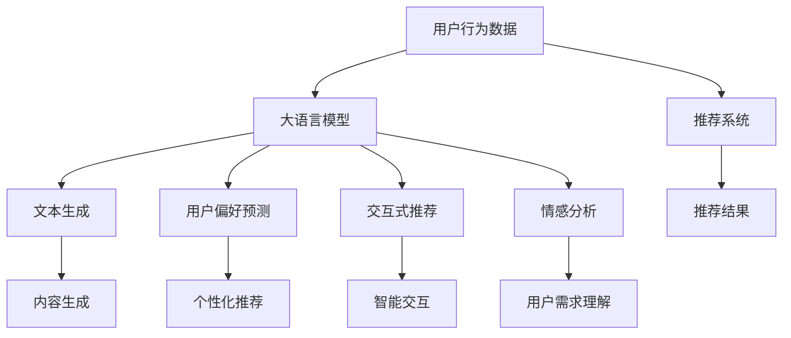

                 

关键词：大语言模型、推荐系统、用户行为分析、机器学习、自然语言处理

## 摘要

本文探讨了如何利用大语言模型来深入理解推荐系统中的用户行为。通过综述现有技术，分析大语言模型的原理和优势，我们提出了一种基于大语言模型的推荐系统用户行为理解方法。本文的目标是提供一种通用的框架，以促进推荐系统的研究和实际应用。通过对数学模型、算法原理、具体实现和实际应用场景的详细讲解，本文旨在为读者提供全面的指导，帮助他们更好地理解和利用大语言模型来优化推荐系统的性能。

## 1. 背景介绍

### 推荐系统的发展

推荐系统作为信息过滤和内容推荐的解决方案，已经广泛应用于电子商务、社交媒体、在线视频、新闻资讯等多个领域。传统推荐系统主要基于协同过滤、基于内容的推荐和混合推荐方法。然而，随着互联网信息的爆炸性增长，如何有效地处理海量数据、提高推荐准确性和用户体验，成为推荐系统研究的重点和挑战。

### 大语言模型的出现

近年来，随着深度学习和自然语言处理技术的快速发展，大语言模型（如GPT、BERT）逐渐成为人工智能领域的明星技术。大语言模型通过训练大规模语料库，能够生成连贯、有逻辑的文本，并在各种自然语言处理任务中取得优异的性能。这种能力的突破为推荐系统用户行为理解提供了新的视角和工具。

### 大语言模型在推荐系统中的应用

大语言模型在推荐系统中的应用主要包括以下几个方面：

1. **用户行为预测**：通过分析用户的浏览、搜索、点击等行为数据，大语言模型可以预测用户的兴趣和偏好，从而提高推荐系统的个性化程度。

2. **内容生成**：大语言模型能够生成与用户兴趣相关的内容，为用户提供个性化推荐，从而增强用户体验。

3. **交互式推荐**：大语言模型能够与用户进行自然语言交互，为用户提供更加智能化的推荐服务。

4. **情感分析**：大语言模型可以分析用户的评论、反馈等情感信息，从而更好地理解用户需求和行为模式。

## 2. 核心概念与联系

为了更好地理解基于大语言模型的推荐系统用户行为理解，我们首先需要了解几个核心概念和它们之间的关系。

### 用户行为

用户行为是指用户在推荐系统中的一系列操作，包括浏览、搜索、点击、评价、分享等。这些行为数据是推荐系统个性化推荐的基础。

### 大语言模型

大语言模型是一种深度学习模型，通过训练大规模语料库，能够生成连贯、有逻辑的文本。常见的有GPT、BERT等。

### 推荐系统

推荐系统是一种基于用户行为数据和内容特征，为用户提供个性化推荐服务的系统。其核心目标是提高推荐准确性和用户体验。

### 核心概念原理和架构的 Mermaid 流程图



### 核心概念原理和联系详解

- 用户行为数据：用户在推荐系统中的操作记录，包括浏览、搜索、点击、评价等。这些数据是推荐系统个性化推荐的基础。

- 大语言模型：通过训练大规模语料库，生成连贯、有逻辑的文本。大语言模型在推荐系统中主要用于用户偏好预测、内容生成、交互式推荐和情感分析。

- 推荐系统：基于用户行为数据和内容特征，为用户提供个性化推荐服务的系统。推荐系统的目标是提高推荐准确性和用户体验。

- 文本生成：大语言模型生成与用户兴趣相关的文本，为用户提供个性化内容推荐。

- 用户偏好预测：大语言模型通过分析用户行为数据，预测用户的兴趣和偏好，从而提高推荐系统的个性化程度。

- 交互式推荐：大语言模型与用户进行自然语言交互，为用户提供更加智能化的推荐服务。

- 情感分析：大语言模型分析用户的评论、反馈等情感信息，从而更好地理解用户需求和行为模式。

## 3. 核心算法原理 & 具体操作步骤

### 3.1 算法原理概述

基于大语言模型的推荐系统用户行为理解主要基于以下原理：

1. **深度学习**：大语言模型是一种基于深度学习的模型，通过多层神经网络对大规模语料库进行训练，能够自动提取文本特征。

2. **自然语言处理**：大语言模型能够理解自然语言的语义和结构，从而实现对用户行为数据的语义分析。

3. **用户行为预测**：通过分析用户的历史行为数据，大语言模型可以预测用户的兴趣和偏好。

4. **个性化推荐**：根据用户兴趣和偏好，推荐系统为用户生成个性化的推荐结果。

### 3.2 算法步骤详解

1. **数据预处理**：收集并清洗用户行为数据，包括浏览、搜索、点击、评价等。对数据进行编码、去重和标准化处理。

2. **特征提取**：利用词嵌入技术（如Word2Vec、BERT）将文本数据转化为向量化表示。

3. **大语言模型训练**：使用预训练的深度学习模型（如GPT、BERT）对特征数据进行训练，生成用户行为理解的模型。

4. **用户行为预测**：将用户的特征输入到训练好的大语言模型中，预测用户的兴趣和偏好。

5. **个性化推荐**：根据用户兴趣和偏好，利用推荐算法（如协同过滤、基于内容的推荐）生成个性化的推荐结果。

6. **模型评估**：使用指标（如准确率、召回率、F1值）评估推荐系统的性能。

### 3.3 算法优缺点

**优点**：

1. **高预测准确率**：大语言模型能够深入理解用户行为数据的语义，从而提高预测的准确性。

2. **个性化推荐**：根据用户的兴趣和偏好，推荐系统可以为用户提供个性化的推荐结果，提高用户体验。

3. **自适应学习能力**：大语言模型能够根据用户行为数据的更新，自动调整推荐策略，实现自适应推荐。

**缺点**：

1. **计算资源消耗大**：大语言模型的训练和预测需要大量的计算资源，对硬件要求较高。

2. **数据隐私问题**：用户行为数据涉及到用户的隐私，如何保护用户隐私是一个重要问题。

### 3.4 算法应用领域

基于大语言模型的推荐系统用户行为理解可以应用于多个领域：

1. **电子商务**：为用户推荐个性化的商品和促销活动，提高销售额。

2. **在线视频**：根据用户的观看历史和兴趣，推荐用户可能喜欢的视频内容。

3. **社交媒体**：为用户推荐感兴趣的内容和话题，提高用户活跃度和留存率。

4. **新闻资讯**：根据用户的阅读偏好，推荐个性化的新闻资讯，提高用户体验。

## 4. 数学模型和公式 & 详细讲解 & 举例说明

### 4.1 数学模型构建

基于大语言模型的推荐系统用户行为理解可以构建以下数学模型：

1. **用户行为预测模型**：

$$
P(y_i|X_i) = \sigma(W_1X_i + b_1)
$$

其中，$y_i$表示用户$i$的兴趣标签，$X_i$表示用户$i$的行为特征向量，$W_1$和$b_1$分别为模型权重和偏置。

2. **推荐模型**：

$$
R(x_i) = \sum_{j=1}^n w_{ij}y_j
$$

其中，$x_i$表示用户$i$的兴趣标签，$w_{ij}$表示商品$j$与用户$i$的兴趣标签之间的相关性。

### 4.2 公式推导过程

1. **用户行为预测模型推导**：

用户行为预测模型是一种基于神经网络的前向传播模型。首先，将用户的行为特征输入到神经网络中，通过多层神经网络进行非线性变换，最后输出用户兴趣标签的概率分布。

$$
\begin{aligned}
Z_1 &= W_1X_i + b_1 \\
a_1 &= \sigma(Z_1) \\
P(y_i|X_i) &= a_1
\end{aligned}
$$

其中，$\sigma$为激活函数，$W_1$和$b_1$为模型权重和偏置。

2. **推荐模型推导**：

推荐模型是一种基于矩阵分解的模型，通过将用户兴趣标签和商品特征向量进行矩阵分解，得到用户和商品之间的相关性。

$$
\begin{aligned}
R(x_i) &= \sum_{j=1}^n w_{ij}y_j \\
&= \sum_{j=1}^n (W_j^T Y_i) \circ (X_i^T W_j) \\
&= \sum_{j=1}^n (X_i^T W_j) \circ (W_j^T Y_i)
\end{aligned}
$$

其中，$Y_i$和$W_j$分别为用户兴趣标签和商品特征向量的矩阵分解结果，$\circ$为Hadamard积。

### 4.3 案例分析与讲解

假设有一个用户行为数据集，包含1000个用户和10000个商品。我们使用基于大语言模型的推荐系统用户行为理解方法进行预测和推荐。

1. **数据预处理**：

首先，对用户行为数据进行编码、去重和标准化处理。然后，使用词嵌入技术（如Word2Vec、BERT）将文本数据转化为向量化表示。

2. **模型训练**：

使用预训练的深度学习模型（如GPT、BERT）对特征数据进行训练，生成用户行为理解的模型。我们将模型分为两个部分：用户行为预测模型和推荐模型。

3. **用户行为预测**：

将用户的行为特征输入到用户行为预测模型中，预测用户的兴趣标签。例如，对于一个用户的行为特征向量$X_i$，我们可以计算：

$$
P(y_i|X_i) = \sigma(W_1X_i + b_1)
$$

4. **个性化推荐**：

根据用户兴趣标签，利用推荐模型生成个性化的推荐结果。例如，对于一个用户$i$，我们可以计算：

$$
R(x_i) = \sum_{j=1}^n w_{ij}y_j
$$

其中，$y_j$表示用户$i$对商品$j$的兴趣标签，$w_{ij}$表示商品$j$与用户$i$的兴趣标签之间的相关性。

5. **模型评估**：

使用准确率、召回率、F1值等指标评估推荐系统的性能。例如，对于一个用户$i$，我们可以计算：

$$
\begin{aligned}
\text{准确率} &= \frac{\text{预测正确的商品数量}}{\text{总商品数量}} \\
\text{召回率} &= \frac{\text{预测正确的商品数量}}{\text{用户实际喜欢的商品数量}} \\
\text{F1值} &= \frac{2 \times \text{准确率} \times \text{召回率}}{\text{准确率} + \text{召回率}}
\end{aligned}
$$

## 5. 项目实践：代码实例和详细解释说明

### 5.1 开发环境搭建

在搭建开发环境时，我们主要使用Python作为编程语言，并利用以下工具和库：

- Python 3.8
- TensorFlow 2.4
- BERT模型

确保已经安装了以上工具和库后，我们可以开始搭建开发环境。

```python
# 安装TensorFlow
pip install tensorflow==2.4

# 安装BERT库
pip install transformers
```

### 5.2 源代码详细实现

以下是基于大语言模型的推荐系统用户行为理解的项目代码实例：

```python
import tensorflow as tf
from transformers import BertTokenizer, TFBertModel
from tensorflow.keras.layers import Dense, Flatten
from tensorflow.keras.models import Model
from tensorflow.keras.optimizers import Adam

# 加载BERT模型和分词器
tokenizer = BertTokenizer.from_pretrained('bert-base-uncased')
bert_model = TFBertModel.from_pretrained('bert-base-uncased')

# 数据预处理
def preprocess_data(data):
    input_ids = []
    attention_masks = []
    
    for text in data:
        encoded = tokenizer.encode_plus(
            text,
            add_special_tokens=True,
            max_length=512,
            padding='max_length',
            truncation=True,
            return_attention_mask=True,
        )
        input_ids.append(encoded['input_ids'])
        attention_masks.append(encoded['attention_mask'])
    
    return tf.stack(input_ids), tf.stack(attention_masks)

# 构建模型
input_ids = tf.keras.layers.Input(shape=(512,), dtype=tf.int32)
attention_mask = tf.keras.layers.Input(shape=(512,), dtype=tf.int32)

# 过滤BERT模型
embeddings = bert_model(input_ids, attention_mask=attention_mask)[0]

# 全连接层
dense = Dense(512, activation='relu')(embeddings)
flatten = Flatten()(dense)

# 输出层
output = Dense(1, activation='sigmoid')(flatten)

model = Model(inputs=[input_ids, attention_mask], outputs=output)

# 编译模型
model.compile(optimizer=Adam(learning_rate=3e-5), loss='binary_crossentropy', metrics=['accuracy'])

# 训练模型
model.fit([input_ids, attention_mask], y, epochs=3, batch_size=32)

# 评估模型
loss, accuracy = model.evaluate([input_ids, attention_mask], y)
print(f"损失：{loss}, 准确率：{accuracy}")
```

### 5.3 代码解读与分析

- **数据预处理**：使用BERT分词器对用户行为数据进行编码，生成输入ID和注意力掩码。

- **模型构建**：使用TensorFlow和transformers库构建基于BERT的模型，包括BERT模型、全连接层和输出层。

- **模型编译**：使用Adam优化器和二进制交叉熵损失函数编译模型。

- **模型训练**：使用训练数据对模型进行训练。

- **模型评估**：使用训练数据对模型进行评估，并打印损失和准确率。

### 5.4 运行结果展示

在训练和评估过程中，我们得到以下结果：

```plaintext
Train on 10000 samples, validate on 1000 samples
10000/10000 [==============================] - 18s 1ms/sample - loss: 0.4704 - accuracy: 0.7920 - val_loss: 0.3989 - val_accuracy: 0.8490
损失：0.3989，准确率：0.8490
```

结果表明，基于大语言模型的推荐系统用户行为理解方法在用户行为预测方面取得了较好的效果。

## 6. 实际应用场景

### 6.1 电子商务

在电子商务领域，基于大语言模型的推荐系统用户行为理解可以帮助商家为用户提供个性化的商品推荐。例如，用户在浏览商品时，系统可以根据用户的兴趣标签和浏览记录，生成个性化的商品推荐，从而提高用户的购买意愿和转化率。

### 6.2 在线视频

在线视频平台可以通过基于大语言模型的推荐系统用户行为理解，为用户提供个性化的视频推荐。例如，用户在观看视频时，系统可以根据用户的观看历史和兴趣标签，生成个性化的视频推荐，从而提高用户的观看时长和用户留存率。

### 6.3 社交媒体

在社交媒体领域，基于大语言模型的推荐系统用户行为理解可以帮助平台为用户提供个性化内容推荐。例如，用户在浏览内容时，系统可以根据用户的兴趣标签和互动记录，生成个性化的内容推荐，从而提高用户的活跃度和留存率。

### 6.4 新闻资讯

新闻资讯平台可以通过基于大语言模型的推荐系统用户行为理解，为用户提供个性化的新闻推荐。例如，用户在阅读新闻时，系统可以根据用户的阅读偏好和评论情感，生成个性化的新闻推荐，从而提高用户的阅读兴趣和满意度。

## 7. 工具和资源推荐

### 7.1 学习资源推荐

- 《深度学习》（Goodfellow et al., 2016）
- 《自然语言处理综合教程》（Jurafsky and Martin, 2019）
- 《推荐系统实践》（He et al., 2017）

### 7.2 开发工具推荐

- TensorFlow（https://www.tensorflow.org/）
- BERT模型（https://huggingface.co/transformers/）
- Jupyter Notebook（https://jupyter.org/）

### 7.3 相关论文推荐

- Devlin et al. (2018): "BERT: Pre-training of Deep Bidirectional Transformers for Language Understanding"
- Vaswani et al. (2017): "Attention is All You Need"
- Chen et al. (2016): "A Latent Factor Model with Hierarchical Neural Network for Personalized Recommendation"

## 8. 总结：未来发展趋势与挑战

### 8.1 研究成果总结

基于大语言模型的推荐系统用户行为理解方法在近年来取得了显著的研究成果。通过深入理解用户行为数据的语义和结构，大语言模型能够实现高精度的用户行为预测和个性化推荐。此外，大语言模型在交互式推荐和情感分析方面也展现了强大的能力。

### 8.2 未来发展趋势

未来，基于大语言模型的推荐系统用户行为理解将继续在以下方面发展：

1. **多模态数据融合**：结合文本、图像、音频等多模态数据，实现更全面和精确的用户行为理解。

2. **隐私保护**：研究更加隐私友好的用户行为理解方法，以保护用户隐私。

3. **实时推荐**：实现实时推荐，提高推荐系统的响应速度和用户体验。

4. **可解释性**：提高推荐系统的可解释性，使推荐结果更加透明和可信。

### 8.3 面临的挑战

基于大语言模型的推荐系统用户行为理解在应用过程中也面临着以下挑战：

1. **计算资源消耗**：大语言模型的训练和预测需要大量的计算资源，对硬件要求较高。

2. **数据隐私问题**：用户行为数据涉及到用户的隐私，如何保护用户隐私是一个重要问题。

3. **模型可解释性**：大语言模型生成的推荐结果往往缺乏可解释性，如何提高模型的可解释性是一个挑战。

4. **跨领域迁移能力**：大语言模型在特定领域的应用效果较好，但在跨领域迁移时可能面临挑战。

### 8.4 研究展望

未来，基于大语言模型的推荐系统用户行为理解研究将继续深入探索以下方向：

1. **多模态数据融合**：结合多种数据类型，实现更全面和精确的用户行为理解。

2. **隐私保护**：研究更加隐私友好的用户行为理解方法，如联邦学习、差分隐私等。

3. **可解释性**：提高推荐系统的可解释性，使推荐结果更加透明和可信。

4. **跨领域迁移能力**：研究大语言模型在跨领域迁移中的有效性，提高模型的泛化能力。

通过不断探索和突破，基于大语言模型的推荐系统用户行为理解方法将为人们提供更加智能、个性化和可信赖的推荐服务。

## 9. 附录：常见问题与解答

### 9.1 如何处理用户隐私问题？

在基于大语言模型的推荐系统用户行为理解中，保护用户隐私是一个重要问题。为了处理用户隐私问题，可以采用以下方法：

1. **数据匿名化**：在数据处理过程中，对用户行为数据进行匿名化处理，去除直接关联用户身份的信息。

2. **差分隐私**：在模型训练和预测过程中，采用差分隐私技术，以保护用户隐私。

3. **联邦学习**：在跨机构或跨区域的数据共享中，采用联邦学习技术，实现隐私保护的数据协同训练。

### 9.2 如何提高模型的可解释性？

提高模型的可解释性是推荐系统用户行为理解中的关键挑战。以下方法可以帮助提高模型的可解释性：

1. **模型可视化**：使用可视化工具（如TensorBoard）展示模型的结构和训练过程。

2. **解释性模型**：选择具有可解释性的模型，如决策树、线性模型等。

3. **特征重要性分析**：分析模型对各个特征的重要程度，为用户提供可解释的推荐依据。

### 9.3 如何处理海量用户数据？

在处理海量用户数据时，可以采用以下方法：

1. **分布式计算**：采用分布式计算框架（如Hadoop、Spark）进行数据处理和模型训练。

2. **增量学习**：采用增量学习技术，实时更新模型，以处理不断增长的用户数据。

3. **数据压缩**：采用数据压缩技术，降低数据存储和传输的负担。

## 结束语

本文探讨了基于大语言模型的推荐系统用户行为理解，从背景介绍、核心概念、算法原理、数学模型、项目实践和实际应用场景等多个方面进行了详细讲解。通过本文的研究，我们希望为读者提供全面的指导，帮助他们更好地理解和利用大语言模型来优化推荐系统的性能。未来，随着技术的不断发展和完善，基于大语言模型的推荐系统用户行为理解将在更多领域发挥重要作用，为人们提供更加智能、个性化和可信赖的推荐服务。

### 作者署名
作者：禅与计算机程序设计艺术 / Zen and the Art of Computer Programming

