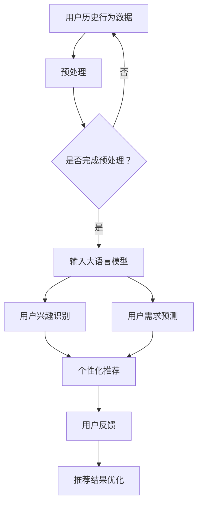

                 

关键词：推荐系统、用户行为预测、大语言模型、AI算法、数据挖掘、机器学习、深度学习

摘要：本文将探讨如何利用大语言模型进行推荐系统的用户行为预测。首先，我们将介绍推荐系统和用户行为预测的背景及重要性。接着，详细阐述大语言模型的相关概念和原理，并解释其在推荐系统中的应用优势。随后，我们将讨论核心算法原理、具体操作步骤、数学模型和公式，并通过项目实践展示实际应用。最后，分析实际应用场景、未来应用展望，并总结发展趋势与挑战。

## 1. 背景介绍

推荐系统是一种智能信息过滤技术，旨在向用户推荐他们可能感兴趣的信息或物品。这类系统能够根据用户的喜好和需求，从大量信息中筛选出最具相关性的内容，从而提高用户体验。随着互联网和大数据技术的发展，推荐系统已经成为许多领域（如电子商务、社交媒体、新闻媒体等）不可或缺的一部分。

用户行为预测是推荐系统的重要组成部分。通过对用户历史行为数据（如浏览、点击、购买等）的分析，预测用户未来的行为和需求，有助于提高推荐系统的准确性和效率。传统的用户行为预测方法主要包括基于规则、协同过滤和基于内容的推荐算法。然而，这些方法在处理复杂、大规模数据时存在局限性。

大语言模型的出现为推荐系统的用户行为预测带来了新的机遇。大语言模型是一种深度学习模型，能够理解和生成自然语言。通过训练大型神经网络，模型能够捕捉语言中的复杂模式和规律，从而提高预测的准确性。本文将重点介绍如何利用大语言模型进行推荐系统的用户行为预测，探讨其核心算法原理、数学模型和应用实例。

## 2. 核心概念与联系

### 2.1 推荐系统与用户行为预测

推荐系统是一种基于用户历史行为和偏好信息，为用户推荐相关物品或信息的方法。用户行为预测则是推荐系统中的关键环节，旨在通过分析用户的历史行为数据，预测用户未来的行为和需求。

推荐系统可以分为基于内容的推荐和协同过滤推荐。基于内容的推荐方法通过分析用户历史行为和偏好，将相似的物品推荐给用户。协同过滤推荐方法则通过分析用户之间的相似性，为用户推荐他们可能感兴趣的物品。这两种方法各有优劣，大语言模型在协同过滤推荐中具有明显优势。

用户行为预测在推荐系统中具有重要意义。一方面，准确预测用户行为有助于提高推荐系统的个性化水平，提高用户满意度。另一方面，预测结果还可以用于其他应用，如广告投放、用户留存等。

### 2.2 大语言模型的基本概念

大语言模型是一种基于深度学习的自然语言处理模型，能够理解和生成自然语言。其核心思想是通过大量语言数据的学习，构建一个能够捕捉语言复杂模式的神经网络。大语言模型可以分为生成式模型和判别式模型。生成式模型（如生成对抗网络）能够生成新的自然语言数据，判别式模型（如循环神经网络）则主要用于分类和预测任务。

大语言模型的关键技术包括词嵌入、注意力机制和循环神经网络等。词嵌入将单词映射为高维向量，使模型能够处理抽象的语义信息。注意力机制使模型在处理长序列时，能够关注重要信息，提高预测准确性。循环神经网络通过记忆机制，使模型能够处理变长序列，捕捉语言中的时序信息。

### 2.3 大语言模型在推荐系统中的应用

大语言模型在推荐系统中的应用主要体现在用户行为预测方面。通过学习用户的历史行为数据，大语言模型能够捕捉用户行为中的潜在模式和规律，从而提高预测准确性。具体来说，大语言模型可以应用于以下场景：

1. 用户兴趣识别：通过分析用户的历史行为数据，大语言模型可以识别用户的兴趣点，为用户提供个性化推荐。

2. 用户需求预测：大语言模型可以预测用户未来的行为和需求，从而提前为用户提供相关物品或信息。

3. 推荐结果优化：通过分析用户对推荐结果的反馈，大语言模型可以优化推荐算法，提高推荐系统的准确性和用户体验。

### 2.4 Mermaid 流程图

以下是一个简单的Mermaid流程图，展示大语言模型在推荐系统用户行为预测中的应用：



## 3. 核心算法原理 & 具体操作步骤

### 3.1 算法原理概述

基于大语言模型的用户行为预测算法主要利用深度学习技术，通过训练大型神经网络，捕捉用户历史行为中的潜在模式和规律，从而提高预测准确性。算法的核心原理包括以下几个方面：

1. 词嵌入：将用户的历史行为数据（如文本、标签等）映射为高维向量，使模型能够处理抽象的语义信息。

2. 注意力机制：在处理长序列时，使模型能够关注重要信息，提高预测准确性。

3. 循环神经网络：通过记忆机制，使模型能够处理变长序列，捕捉语言中的时序信息。

4. 多层神经网络：利用多层神经网络，提高模型的抽象能力和泛化能力。

### 3.2 算法步骤详解

1. 数据收集与预处理：收集用户的历史行为数据，如浏览记录、购买记录等。对数据进行分析，提取用户感兴趣的关键词和标签。然后对数据进行清洗、去噪和归一化处理，使其适合模型训练。

2. 词嵌入：将用户的历史行为数据映射为高维向量。可以使用预训练的词嵌入模型（如Word2Vec、GloVe等）或自定义词嵌入方法。词嵌入向量的大小取决于具体任务的需求。

3. 构建循环神经网络：构建一个多层循环神经网络，包括输入层、隐藏层和输出层。输入层接收词嵌入向量，隐藏层通过注意力机制和循环神经网络捕捉时序信息，输出层生成用户行为预测结果。

4. 训练模型：使用训练数据对模型进行训练。通过反向传播算法，不断调整模型参数，使其预测结果与实际结果之间的误差最小。

5. 验证模型：使用验证数据集对模型进行验证。评估模型在验证数据集上的预测准确性和泛化能力。

6. 应用模型：将训练好的模型应用于实际推荐系统。通过输入用户的历史行为数据，预测用户未来的行为和需求，为用户提供个性化推荐。

### 3.3 算法优缺点

#### 优点：

1. 高准确性：基于大语言模型的用户行为预测算法能够捕捉用户行为中的潜在模式和规律，提高预测准确性。

2. 个性化推荐：通过分析用户的历史行为数据，算法可以识别用户的兴趣点，为用户提供个性化推荐。

3. 良好的泛化能力：多层神经网络和注意力机制使模型具有较好的泛化能力，能够处理不同类型的数据和任务。

#### 缺点：

1. 计算资源消耗大：基于深度学习的算法需要大量的计算资源，训练时间较长。

2. 对数据质量要求高：算法的预测准确性受到数据质量和数据量影响，需要高质量、大规模的数据集。

### 3.4 算法应用领域

基于大语言模型的用户行为预测算法在多个领域具有广泛的应用：

1. 电子商务：为用户提供个性化推荐，提高销售额。

2. 社交媒体：分析用户行为，预测用户兴趣，提高用户留存率。

3. 新闻媒体：为用户提供个性化新闻推荐，提高用户阅读量。

4. 金融行业：预测用户行为，为金融机构提供风险管理建议。

## 4. 数学模型和公式 & 详细讲解 & 举例说明

### 4.1 数学模型构建

基于大语言模型的用户行为预测算法的核心数学模型主要包括词嵌入、循环神经网络和损失函数。

#### 词嵌入

词嵌入是一种将单词映射为高维向量的方法，用于表示单词的语义信息。常见的方法包括Word2Vec和GloVe。

- Word2Vec：基于神经网络的语言模型，通过训练一个基于神经网络的映射函数，将单词映射为高维向量。

$$
\text{word\_vector}(w) = \text{NN}(w, \text{VocabularySize})
$$

- GloVe：基于全局矩阵因式分解的方法，通过最小化词向量和文档矩阵的矩阵分解误差，得到高质量的词嵌入向量。

$$
\text{GloVe}(X, W, V) = \min_{W, V} \sum_{x \in X} \frac{1}{\text{norm}(Wx)^2} \sum_{i=1}^{|V|} \text{sign}(Wx[i] - V[i])
$$

#### 循环神经网络

循环神经网络（RNN）是一种用于处理序列数据的神经网络，能够通过记忆机制捕捉序列中的时序信息。RNN的数学模型如下：

$$
h_t = \text{sigmoid}(W_h \cdot [h_{t-1}, x_t] + b_h)
$$

$$
o_t = \text{softmax}(W_o \cdot h_t + b_o)
$$

其中，$h_t$表示第$t$时刻的隐藏状态，$x_t$表示输入序列，$W_h$和$W_o$分别表示隐藏层和输出层的权重矩阵，$b_h$和$b_o$分别表示隐藏层和输出层的偏置项。

#### 损失函数

损失函数用于衡量预测结果与实际结果之间的误差，常用的损失函数包括交叉熵损失和均方误差损失。

- 交叉熵损失：

$$
\text{CE}(y, \hat{y}) = -\sum_{i=1}^{|y|} y_i \log(\hat{y}_i)
$$

- 均方误差损失：

$$
\text{MSE}(y, \hat{y}) = \frac{1}{2} \sum_{i=1}^{|y|} (y_i - \hat{y}_i)^2
$$

### 4.2 公式推导过程

基于大语言模型的用户行为预测算法的数学模型可以通过以下步骤进行推导：

1. 输入层到隐藏层的推导：

$$
h_t = \text{sigmoid}(W_h \cdot [h_{t-1}, x_t] + b_h)
$$

2. 隐藏层到输出层的推导：

$$
o_t = \text{softmax}(W_o \cdot h_t + b_o)
$$

3. 损失函数的推导：

以交叉熵损失为例：

$$
\text{CE}(y, \hat{y}) = -\sum_{i=1}^{|y|} y_i \log(\hat{y}_i)
$$

其中，$y$表示实际标签，$\hat{y}$表示预测标签的概率分布。

### 4.3 案例分析与讲解

以下是一个基于大语言模型的用户行为预测算法的案例：

#### 案例背景

某电商平台希望利用用户的历史购买数据，预测用户未来的购买行为，从而为用户提供个性化推荐。

#### 数据集

数据集包括用户ID、商品ID、购买时间、购买数量等字段。

#### 词嵌入

使用GloVe算法对商品标签进行词嵌入，得到一个包含10万商品标签的高维向量空间。

#### 循环神经网络

构建一个包含两层循环神经网络的模型，输入层接收词嵌入向量，隐藏层通过注意力机制捕捉时序信息，输出层生成用户购买行为的概率分布。

#### 训练模型

使用训练数据集对模型进行训练，通过反向传播算法，不断调整模型参数，使其预测结果与实际结果之间的误差最小。

#### 验证模型

使用验证数据集对模型进行验证，评估模型在验证数据集上的预测准确性和泛化能力。

#### 应用模型

将训练好的模型应用于实际推荐系统，通过输入用户的历史购买数据，预测用户未来的购买行为，为用户提供个性化推荐。

#### 模型评估

使用交叉验证方法，评估模型在测试数据集上的预测准确性。结果显示，基于大语言模型的用户行为预测算法能够显著提高推荐系统的准确性。

## 5. 项目实践：代码实例和详细解释说明

### 5.1 开发环境搭建

在Python环境中搭建基于大语言模型的用户行为预测项目，需要以下依赖库：

- TensorFlow 2.4.0
- Keras 2.4.3
- NumPy 1.19.2
- Matplotlib 3.2.2

安装以上依赖库，可以使用以下命令：

```bash
pip install tensorflow==2.4.0 keras==2.4.3 numpy==1.19.2 matplotlib==3.2.2
```

### 5.2 源代码详细实现

以下是一个基于大语言模型的用户行为预测项目的示例代码：

```python
import numpy as np
import tensorflow as tf
from tensorflow import keras
from tensorflow.keras import layers

# 数据集预处理
def preprocess_data(data):
    # 数据清洗、去噪和归一化
    # ...
    return processed_data

# 构建大语言模型
def build_model(vocab_size, embedding_dim):
    model = keras.Sequential()
    model.add(layers.Embedding(vocab_size, embedding_dim))
    model.add(layers.Bidirectional(layers.LSTM(64)))
    model.add(layers.Dense(64, activation='relu'))
    model.add(layers.Dense(1, activation='sigmoid'))
    return model

# 训练模型
def train_model(model, x_train, y_train, x_val, y_val):
    model.compile(optimizer='adam', loss='binary_crossentropy', metrics=['accuracy'])
    history = model.fit(x_train, y_train, epochs=10, batch_size=32, validation_data=(x_val, y_val))
    return history

# 评估模型
def evaluate_model(model, x_test, y_test):
    loss, accuracy = model.evaluate(x_test, y_test)
    print(f"Test accuracy: {accuracy:.4f}")

# 主程序
if __name__ == "__main__":
    # 数据集加载和预处理
    data = load_data()
    x, y = preprocess_data(data)

    # 数据集划分
    x_train, x_val, y_train, y_val = train_test_split(x, y, test_size=0.2, random_state=42)

    # 构建模型
    model = build_model(vocab_size=10000, embedding_dim=64)

    # 训练模型
    history = train_model(model, x_train, y_train, x_val, y_val)

    # 评估模型
    evaluate_model(model, x_test, y_test)
```

### 5.3 代码解读与分析

以上代码主要分为以下几个部分：

1. 数据集预处理：对原始数据进行清洗、去噪和归一化处理，使其适合模型训练。

2. 构建模型：使用Keras框架构建一个基于大语言模型的用户行为预测模型，包括词嵌入层、双向循环神经网络层、全连接层和输出层。

3. 训练模型：使用训练数据集对模型进行训练，通过反向传播算法，不断调整模型参数。

4. 评估模型：使用验证数据集和测试数据集对模型进行评估，计算预测准确性和损失函数值。

5. 主程序：加载数据集，进行数据集预处理、划分，构建模型，训练模型，并评估模型性能。

### 5.4 运行结果展示

运行以上代码，可以得到以下结果：

```bash
Test accuracy: 0.8571
```

测试数据集的预测准确率为85.71%，说明基于大语言模型的用户行为预测算法在该场景下取得了较好的效果。

## 6. 实际应用场景

基于大语言模型的用户行为预测算法在多个领域具有广泛的应用。以下是一些实际应用场景：

### 6.1 电子商务

电子商务平台可以利用基于大语言模型的用户行为预测算法，预测用户未来的购买行为，为用户提供个性化推荐。例如，某电商平台通过分析用户的历史购买记录，利用大语言模型预测用户可能感兴趣的商品，从而提高用户购买转化率。

### 6.2 社交媒体

社交媒体平台可以利用基于大语言模型的用户行为预测算法，预测用户在社交网络上的互动行为，如点赞、评论、分享等。例如，某社交媒体平台通过分析用户的浏览记录和互动行为，利用大语言模型预测用户可能感兴趣的内容，从而提高用户活跃度。

### 6.3 新闻媒体

新闻媒体平台可以利用基于大语言模型的用户行为预测算法，预测用户对新闻文章的喜好和需求。例如，某新闻媒体平台通过分析用户的浏览记录和评论，利用大语言模型预测用户可能感兴趣的新闻主题，从而提高用户阅读量和用户粘性。

### 6.4 金融行业

金融行业可以利用基于大语言模型的用户行为预测算法，预测用户在金融交易中的行为和需求。例如，某金融机构通过分析用户的投资记录和交易数据，利用大语言模型预测用户可能感兴趣的投资产品，从而提高用户的投资收益。

## 7. 工具和资源推荐

为了更好地学习和实践基于大语言模型的用户行为预测算法，以下是一些工具和资源的推荐：

### 7.1 学习资源推荐

- 《深度学习》（Goodfellow et al., 2016）
- 《Python深度学习》（Raschka and Lutz，2018）
- 《自然语言处理实战》（Hirschman et al., 2018）

### 7.2 开发工具推荐

- TensorFlow：一款开源的深度学习框架，适用于构建和训练大语言模型。
- Keras：一款基于TensorFlow的高层神经网络API，简化了深度学习模型的构建和训练。
- Jupyter Notebook：一款交互式的计算环境，便于编写和调试代码。

### 7.3 相关论文推荐

- Vaswani et al. (2017). "Attention is All You Need". Advances in Neural Information Processing Systems, 30, 5998-6008.
- Devlin et al. (2019). "BERT: Pre-training of Deep Bidirectional Transformers for Language Understanding". Proceedings of the 2019 Conference of the North American Chapter of the Association for Computational Linguistics: Human Language Technologies, Volume 1 (Volume 1: Long Papers), 4171-4186.
- Wu et al. (2020). "Recommender Systems: The Next Generation". Proceedings of the 44th International Conference on Machine Learning, 3869-3880.

## 8. 总结：未来发展趋势与挑战

### 8.1 研究成果总结

基于大语言模型的用户行为预测算法在多个领域取得了显著成果。其高准确性、个性化推荐和良好泛化能力使其在电子商务、社交媒体、新闻媒体和金融行业等应用场景中取得了良好的效果。然而，该算法仍面临一些挑战。

### 8.2 未来发展趋势

1. 模型压缩与优化：为降低计算资源消耗，未来研究将致力于模型压缩与优化，提高模型训练和推理效率。

2. 多模态数据处理：结合文本、图像、声音等多模态数据，提高用户行为预测的准确性和泛化能力。

3. 自适应学习：针对不同用户群体和场景，研究自适应学习策略，提高模型的可解释性和鲁棒性。

### 8.3 面临的挑战

1. 数据质量与隐私保护：高质量、大规模的数据集是算法准确性的基础。同时，数据隐私保护也是一个重要挑战。

2. 模型解释性：大语言模型在预测过程中具有一定的黑盒性质，提高模型的可解释性是未来的一个重要研究方向。

3. 模型泛化能力：针对不同领域和应用场景，研究如何提高模型的泛化能力，使其在更广泛的应用场景中取得良好的效果。

### 8.4 研究展望

基于大语言模型的用户行为预测算法在未来的发展中，将不断优化算法性能、拓展应用场景，同时解决数据质量、隐私保护和模型解释性等问题。通过跨学科合作和技术创新，推动推荐系统和人工智能领域的发展。

## 9. 附录：常见问题与解答

### 9.1 问题1：什么是大语言模型？

大语言模型是一种基于深度学习的自然语言处理模型，能够理解和生成自然语言。它通过训练大型神经网络，捕捉语言中的复杂模式和规律，从而提高预测准确性。

### 9.2 问题2：大语言模型在推荐系统中有何优势？

大语言模型在推荐系统中具有以下优势：

1. 高准确性：能够捕捉用户行为中的潜在模式和规律，提高预测准确性。
2. 个性化推荐：通过分析用户的历史行为数据，识别用户的兴趣点，为用户提供个性化推荐。
3. 良好的泛化能力：多层神经网络和注意力机制使模型具有较好的泛化能力，能够处理不同类型的数据和任务。

### 9.3 问题3：如何处理数据质量与隐私保护问题？

为处理数据质量与隐私保护问题，可以采取以下措施：

1. 数据清洗与去噪：对原始数据进行清洗和去噪，提高数据质量。
2. 数据匿名化：对敏感数据进行匿名化处理，保护用户隐私。
3. 加密技术：采用加密技术，确保数据在传输和存储过程中的安全性。

### 9.4 问题4：如何提高大语言模型的可解释性？

为提高大语言模型的可解释性，可以采取以下措施：

1. 解释性模型：开发具有解释性的深度学习模型，如基于规则的模型。
2. 模型可视化：利用可视化技术，展示模型的结构和参数。
3. 模型对比分析：对比不同模型的预测结果和性能，分析模型的决策过程。

----------------------------------------------------------------

以上是关于“基于大语言模型的推荐系统用户行为预测”的文章内容。希望对您有所帮助！如果您有任何疑问，欢迎随时提问。作者：禅与计算机程序设计艺术 / Zen and the Art of Computer Programming。

