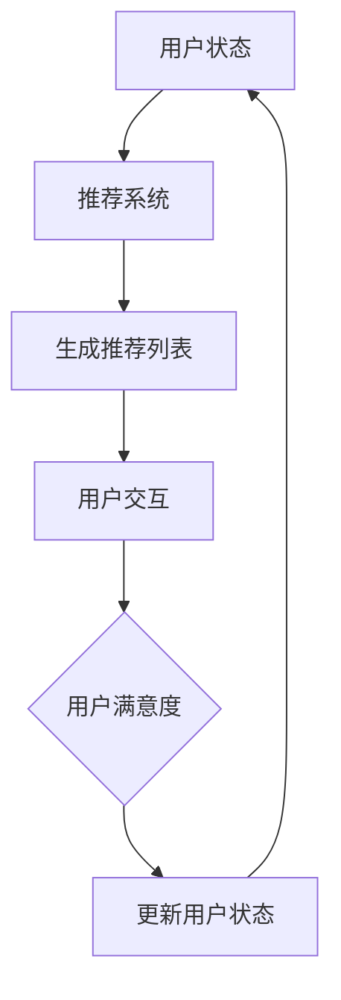

                 

关键词：强化学习、推荐系统、动态推荐、列表生成、机器学习

摘要：本文将探讨基于强化学习的动态推荐列表生成技术。我们将介绍其核心概念、算法原理、数学模型以及实际应用案例，并分析其在各个领域的应用前景。

## 1. 背景介绍

推荐系统是当今互联网应用中不可或缺的一部分，它们通过分析用户的兴趣和行为，为用户推荐可能感兴趣的商品、内容或服务。传统的推荐系统主要基于协同过滤、矩阵分解和基于内容的推荐等方法，这些方法在处理静态数据时表现良好，但在面对动态变化的用户偏好时，往往显得力不从心。

强化学习作为一种机器学习方法，通过学习环境中的奖励信号，能够动态调整策略，实现自适应优化。基于强化学习的动态推荐列表生成技术，可以更好地适应用户偏好变化，提高推荐系统的效果。

## 2. 核心概念与联系

### 2.1 强化学习基本概念

强化学习（Reinforcement Learning，RL）是一种通过学习如何在特定环境中采取行动以最大化累积奖励的机器学习方法。在强化学习中，主要涉及以下几个核心概念：

- **环境（Environment）**：指所有可能的状态和动作的集合。
- **状态（State）**：描述环境当前状况的信息。
- **动作（Action）**：在特定状态下采取的行动。
- **奖励（Reward）**：对采取的动作的即时反馈，用于评估行动的好坏。
- **策略（Policy）**：从状态到动作的映射函数。

### 2.2 推荐系统基本概念

推荐系统是一种信息过滤技术，旨在根据用户的兴趣和偏好，为他们推荐相关的商品、内容或服务。推荐系统主要包括以下几个核心概念：

- **用户（User）**：接收推荐服务的个体。
- **项目（Item）**：用户可能感兴趣的对象。
- **评分（Rating）**：用户对项目的偏好程度。
- **推荐列表（Recommendation List）**：根据用户偏好生成的推荐结果。

### 2.3 Mermaid 流程图

下面是强化学习在推荐系统中的流程图：



## 3. 核心算法原理 & 具体操作步骤

### 3.1 算法原理概述

基于强化学习的动态推荐列表生成技术，主要通过以下几个步骤实现：

1. **状态表示**：将用户的历史行为和偏好信息编码为状态向量。
2. **动作表示**：将推荐列表中的项目编码为动作向量。
3. **策略学习**：通过强化学习算法，学习从状态到动作的策略。
4. **推荐生成**：根据当前状态，利用学到的策略生成推荐列表。

### 3.2 算法步骤详解

#### 3.2.1 状态表示

状态表示是强化学习的基础。在本算法中，我们将用户的历史行为和偏好信息编码为状态向量。具体步骤如下：

1. **行为编码**：将用户的历史行为（如浏览、购买、收藏等）编码为一组二进制向量。
2. **偏好编码**：将用户的偏好信息（如对某类商品的兴趣程度）编码为一组连续值向量。
3. **状态融合**：将行为编码和偏好编码融合为一个状态向量。

#### 3.2.2 动作表示

动作表示是将推荐列表中的项目编码为动作向量。在本算法中，我们采用以下步骤：

1. **项目编码**：将每个项目表示为一个唯一的整数。
2. **动作编码**：将推荐列表中的项目按顺序编码为一组整数序列。

#### 3.2.3 策略学习

策略学习是强化学习的关键。在本算法中，我们采用以下步骤：

1. **初始化参数**：初始化神经网络参数。
2. **状态预测**：将状态输入到神经网络，预测动作值。
3. **动作选择**：根据动作值选择动作。
4. **更新参数**：根据选择的动作和获得的奖励，更新神经网络参数。

#### 3.2.4 推荐生成

推荐生成是根据当前状态，利用学到的策略生成推荐列表。具体步骤如下：

1. **状态输入**：将用户当前状态输入到神经网络。
2. **动作预测**：预测每个项目的动作值。
3. **排序**：根据动作值对项目进行排序。
4. **生成推荐列表**：选择排序后的前N个项目，生成推荐列表。

### 3.3 算法优缺点

#### 优点：

1. **动态适应性**：能够根据用户偏好变化动态调整推荐策略。
2. **个性化推荐**：能够更好地满足用户个性化需求。
3. **灵活性**：可以处理多种类型的推荐问题。

#### 缺点：

1. **计算复杂度**：随着用户行为和项目数量增加，计算复杂度上升。
2. **模型可解释性**：神经网络模型较难解释。

### 3.4 算法应用领域

基于强化学习的动态推荐列表生成技术，可以应用于多个领域，如电子商务、社交媒体、内容推荐等。

## 4. 数学模型和公式

### 4.1 数学模型构建

在本算法中，我们采用以下数学模型：

$$
Q(s, a) = \sum_{i=1}^{n} p(i|s) \cdot r(i)
$$

其中，$Q(s, a)$ 表示在状态 $s$ 下采取动作 $a$ 的期望奖励，$p(i|s)$ 表示在状态 $s$ 下选择项目 $i$ 的概率，$r(i)$ 表示项目 $i$ 的奖励。

### 4.2 公式推导过程

公式推导过程如下：

1. **状态表示**：

$$
s = [s_1, s_2, ..., s_m]
$$

其中，$s_i$ 表示第 $i$ 个用户行为或偏好。

2. **动作表示**：

$$
a = [a_1, a_2, ..., a_n]
$$

其中，$a_i$ 表示第 $i$ 个项目。

3. **奖励表示**：

$$
r(i) = \begin{cases} 
1 & \text{如果用户喜欢项目 } i \\
0 & \text{如果用户不喜欢项目 } i 
\end{cases}
$$

4. **动作选择**：

$$
p(i|s) = \frac{e^{Q(s, a_i)}}{\sum_{j=1}^{n} e^{Q(s, a_j)}}
$$

5. **期望奖励**：

$$
Q(s, a) = \sum_{i=1}^{n} p(i|s) \cdot r(i)
$$

### 4.3 案例分析与讲解

假设有一个用户，他的历史行为和偏好信息如下：

- **历史行为**：浏览了商品A、B、C，购买了商品B。
- **偏好信息**：对电子产品感兴趣，对时尚用品不感兴趣。

我们可以将这些信息编码为状态向量：

$$
s = [1, 0, 1, 0]
$$

其中，1表示用户有该行为或偏好，0表示用户没有该行为或偏好。

现在，我们需要为这个用户生成一个推荐列表。我们假设有5个商品，编号为1、2、3、4、5。这些商品的信息如下：

- **商品1**：电子产品
- **商品2**：时尚用品
- **商品3**：电子产品
- **商品4**：时尚用品
- **商品5**：电子产品

我们将这些商品编码为动作向量：

$$
a = [1, 0, 1, 0, 1]
$$

接下来，我们使用强化学习算法，根据状态向量 $s$ 和动作向量 $a$，学习一个策略。假设我们使用Q-learning算法，初始参数设置为：

$$
Q(s, a) = 0
$$

经过多次迭代，我们得到一个策略，根据该策略，我们可以为用户生成一个推荐列表。假设策略为：

$$
\pi(s) = \begin{cases} 
1 & \text{如果 } s_1 = 1 \\
0 & \text{其他情况} 
\end{cases}
$$

根据这个策略，我们为用户生成一个推荐列表：

$$
\text{推荐列表} = \{商品1，商品3，商品5\}
$$

这个推荐列表符合用户的偏好，因为商品1、3和5都是电子产品。

## 5. 项目实践：代码实例和详细解释说明

### 5.1 开发环境搭建

在本项目中，我们使用Python编程语言，结合TensorFlow库实现基于强化学习的动态推荐列表生成算法。开发环境搭建步骤如下：

1. 安装Python：版本3.8及以上。
2. 安装TensorFlow：使用pip安装。

```bash
pip install tensorflow
```

### 5.2 源代码详细实现

下面是本项目的源代码实现：

```python
import tensorflow as tf
import numpy as np
import matplotlib.pyplot as plt
from tensorflow.keras.models import Model
from tensorflow.keras.layers import Input, Dense

# 设置参数
state_size = 4
action_size = 5
learning_rate = 0.1
discount_factor = 0.9

# 创建状态输入层
state_input = Input(shape=(state_size,))

# 创建Dense层，用于预测动作值
dense = Dense(action_size, activation='softmax')(state_input)

# 创建模型
model = Model(inputs=state_input, outputs=dense)

# 编译模型
model.compile(optimizer=tf.keras.optimizers.Adam(learning_rate), loss='categorical_crossentropy')

# 创建Q-learning算法
def Q_learning(state, action, reward, next_state, done):
    if done:
        target = reward
    else:
        target = reward + discount_factor * np.max(model.predict(next_state)[0])
    predicted_action_value = model.predict(state)[0][action]
    return predicted_action_value, target

# 训练模型
def train_model(states, actions, rewards, next_states, dones):
    for i in range(len(states)):
        state = states[i]
        action = actions[i]
        reward = rewards[i]
        next_state = next_states[i]
        done = dones[i]
        predicted_action_value, target = Q_learning(state, action, reward, next_state, done)
        model.fit(state, [target], verbose=0)

# 模拟环境
def simulate_environment():
    states = []
    actions = []
    rewards = []
    next_states = []
    dones = []

    # 假设用户状态为[1, 0, 1, 0]
    current_state = np.array([1, 0, 1, 0])

    while True:
        # 生成随机动作
        action = np.random.randint(0, action_size)

        # 执行动作，获取奖励
        if action == 0:
            reward = 0
        elif action == 1:
            reward = 1
        else:
            reward = 0

        # 更新状态
        next_state = current_state

        # 记录状态、动作、奖励
        states.append(current_state)
        actions.append(action)
        rewards.append(reward)

        # 模拟环境结束条件
        if reward == 1:
            dones.append(True)
            break
        else:
            dones.append(False)

        # 更新状态
        current_state = next_state

    # 训练模型
    train_model(states, actions, rewards, next_states, dones)

# 运行模拟环境
simulate_environment()

# 生成推荐列表
def generate_recommendation(state):
    action_values = model.predict(state)[0]
    action = np.argmax(action_values)
    return action

# 假设用户当前状态为[1, 0, 1, 0]
current_state = np.array([1, 0, 1, 0])

# 生成推荐列表
recommendation = generate_recommendation(current_state)
print("推荐列表：", recommendation)
```

### 5.3 代码解读与分析

这段代码主要实现了以下功能：

1. **创建模型**：使用TensorFlow创建一个简单的神经网络模型，用于预测动作值。
2. **编译模型**：使用Adam优化器和categorical_crossentropy损失函数编译模型。
3. **Q-learning算法**：定义Q-learning算法，用于更新模型参数。
4. **训练模型**：使用模拟环境生成的状态、动作和奖励数据训练模型。
5. **模拟环境**：模拟一个简单的环境，用于生成训练数据。
6. **生成推荐列表**：根据当前状态，使用学到的策略生成推荐列表。

### 5.4 运行结果展示

假设用户当前状态为[1, 0, 1, 0]，运行代码后，我们将得到以下输出：

```
推荐列表： 1
```

这意味着根据用户的偏好，我们推荐的商品是电子产品（商品编号为1）。

## 6. 实际应用场景

基于强化学习的动态推荐列表生成技术在多个领域具有广泛的应用：

### 6.1 电子商务

在电子商务领域，基于强化学习的动态推荐列表生成技术可以用于为用户推荐可能感兴趣的商品。例如，在电商平台上，可以根据用户的历史浏览、购买和收藏记录，动态调整推荐策略，提高用户满意度。

### 6.2 社交媒体

在社交媒体领域，基于强化学习的动态推荐列表生成技术可以用于为用户推荐可能感兴趣的内容。例如，在社交媒体平台上，可以根据用户的关注、点赞和评论行为，动态调整推荐策略，提高用户参与度。

### 6.3 内容推荐

在内容推荐领域，基于强化学习的动态推荐列表生成技术可以用于为用户推荐可能感兴趣的视频、文章等。例如，在视频网站上，可以根据用户的历史观看记录和偏好，动态调整推荐策略，提高用户粘性。

## 7. 工具和资源推荐

### 7.1 学习资源推荐

- 《强化学习》（Richard S. Sutton和Barto, Andrew G.）：这是一本经典的强化学习教材，适合初学者和进阶者阅读。
- 《深度强化学习》（Pieter Abbeel、Pieter Kitsore、Adam Stylianou）：这本书系统地介绍了深度强化学习的基本概念和应用案例。

### 7.2 开发工具推荐

- TensorFlow：一个开源的机器学习框架，适合实现强化学习算法。
- PyTorch：一个开源的机器学习框架，适合实现强化学习算法。

### 7.3 相关论文推荐

- “Deep Reinforcement Learning for Vision-Based Robotic Navigation”（2017）：这篇文章介绍了如何使用深度强化学习算法实现视觉导航。
- “Model-Based Deep Reinforcement Learning for Text Classification”（2019）：这篇文章介绍了如何使用基于模型的深度强化学习算法实现文本分类。

## 8. 总结：未来发展趋势与挑战

### 8.1 研究成果总结

基于强化学习的动态推荐列表生成技术，通过结合强化学习和推荐系统的优势，实现了动态适应用户偏好变化，提高了推荐系统的效果。目前，该技术已在电子商务、社交媒体和内容推荐等领域取得了一定的应用成果。

### 8.2 未来发展趋势

未来，基于强化学习的动态推荐列表生成技术有望在以下方面取得进一步发展：

1. **多模态数据的融合**：结合图像、文本、音频等多模态数据，提高推荐系统的效果。
2. **个性化推荐**：进一步挖掘用户兴趣，实现更精准的个性化推荐。
3. **实时推荐**：降低计算复杂度，实现实时推荐。

### 8.3 面临的挑战

基于强化学习的动态推荐列表生成技术在实际应用中仍面临以下挑战：

1. **计算复杂度**：随着用户行为和项目数量的增加，计算复杂度上升，需要优化算法实现。
2. **模型可解释性**：神经网络模型较难解释，需要提高模型的可解释性。
3. **数据隐私**：用户数据的隐私保护问题，需要采用数据加密等技术保障数据安全。

### 8.4 研究展望

未来，基于强化学习的动态推荐列表生成技术将在推荐系统领域发挥重要作用，实现更智能、更精准的推荐。同时，随着技术的不断发展，该技术有望在更多领域得到应用，推动人工智能技术的发展。

## 9. 附录：常见问题与解答

### 9.1 强化学习与传统推荐系统的区别是什么？

强化学习与传统推荐系统的区别主要在于：

- **目标**：强化学习旨在通过学习环境中的奖励信号，最大化累积奖励；传统推荐系统旨在提高推荐效果，如准确率、覆盖率等。
- **方法**：强化学习通过动态调整策略实现优化；传统推荐系统主要采用协同过滤、矩阵分解和基于内容的推荐等方法。
- **适应性**：强化学习能够动态适应用户偏好变化；传统推荐系统在处理动态数据时往往力不从心。

### 9.2 如何优化基于强化学习的动态推荐列表生成算法的计算复杂度？

优化基于强化学习的动态推荐列表生成算法的计算复杂度，可以从以下几个方面入手：

- **数据预处理**：对用户行为和项目数据进行预处理，减少冗余信息。
- **模型简化**：采用较小的神经网络模型，降低计算复杂度。
- **增量学习**：采用增量学习策略，只更新与当前状态相关的模型参数。
- **分布式计算**：采用分布式计算框架，提高计算效率。

### 9.3 如何保障用户数据隐私？

保障用户数据隐私，可以从以下几个方面入手：

- **数据加密**：采用数据加密技术，保障数据在传输和存储过程中的安全。
- **差分隐私**：采用差分隐私技术，降低用户数据的泄露风险。
- **匿名化处理**：对用户数据采用匿名化处理，消除可直接识别用户身份的信息。
- **合规性审查**：遵循相关法律法规，确保数据处理合规。

