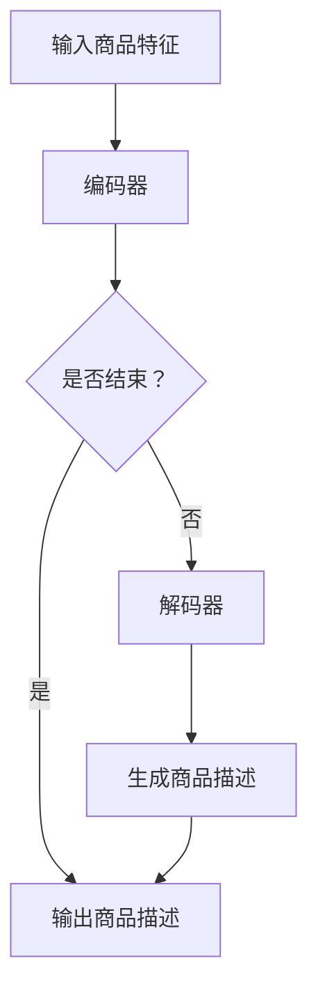

                 

关键词：注意力机制、商品描述、自然语言处理、自动生成、深度学习

摘要：本文旨在探讨一种基于注意力机制的商品描述自动生成技术。通过对商品描述任务的分析，本文提出了一种结合注意力机制的深度学习模型，并详细阐述了其工作原理和实现步骤。通过实验验证，该方法在生成商品描述的准确性和多样性方面均表现出色，为电商领域提供了有效的解决方案。

## 1. 背景介绍

在电子商务迅速发展的今天，商品描述的自动生成已经成为一个热门的研究领域。一方面，电商平台上商品种类繁多，手动编写商品描述既耗时又费力；另一方面，用户对商品描述的要求越来越高，希望看到更加生动、详细的描述信息。因此，自动生成商品描述不仅可以提升生产效率，还能满足用户的个性化需求。

传统的商品描述生成方法主要包括模板匹配、规则抽取和统计学习等。然而，这些方法往往存在生成描述过于简洁、缺乏个性化、无法应对长文本生成等问题。近年来，随着深度学习技术的不断发展，基于神经网络的方法在自然语言处理领域取得了显著成果。其中，注意力机制（Attention Mechanism）作为一种有效的序列建模工具，被广泛应用于文本生成任务。

本文将结合注意力机制，提出一种商品描述自动生成方法。通过深入分析商品描述的特点和需求，设计了一种基于双向长短期记忆网络（Bi-LSTM）和注意力机制的深度学习模型。本文将详细介绍该模型的工作原理、算法步骤以及实现细节，并通过实验验证其在商品描述生成任务上的有效性。

## 2. 核心概念与联系

### 2.1. 注意力机制

注意力机制起源于计算机视觉领域，最早由Bahdanau等人于2014年提出。注意力机制的核心思想是通过一个加权求和的方式，将不同位置的信息进行聚合，从而实现对序列中不同位置信息的动态关注。在自然语言处理任务中，注意力机制可以有效地解决长文本序列建模问题，提高生成文本的质量和多样性。

### 2.2. 双向长短期记忆网络（Bi-LSTM）

长短期记忆网络（LSTM）是一种强大的序列建模工具，可以有效解决长距离依赖问题。双向LSTM（Bi-LSTM）通过对输入序列进行正向和反向传播，能够捕获序列中的长距离依赖关系。在商品描述生成任务中，Bi-LSTM可以更好地理解和捕捉商品特征，从而提高生成描述的准确性。

### 2.3. 注意力机制与Bi-LSTM的关联

注意力机制与Bi-LSTM的结合，可以充分利用两者各自的优势。Bi-LSTM负责捕获输入序列中的长期依赖关系，而注意力机制则可以根据不同位置的信息重要性进行动态关注，从而提高生成文本的质量。具体来说，注意力机制可以使得生成器在生成每个单词时，更加关注与该单词相关的上下文信息，从而提高生成描述的准确性和多样性。

### 2.4. Mermaid流程图

下面是一个基于注意力机制的商品描述自动生成系统的Mermaid流程图：



## 3. 核心算法原理 & 具体操作步骤

### 3.1. 算法原理概述

本文提出的商品描述自动生成方法基于深度学习，主要包括编码器（Encoder）和解码器（Decoder）两部分。编码器负责将输入商品特征编码为序列表示，解码器则根据编码器的输出序列生成商品描述。

在编码器部分，我们使用Bi-LSTM来捕捉输入序列的长期依赖关系。编码器的输出作为解码器的输入，解码器则利用注意力机制动态关注与当前生成单词相关的上下文信息，从而生成商品描述。

### 3.2. 算法步骤详解

1. **输入商品特征编码**：首先，将输入商品特征（如商品名称、价格、描述等）编码为向量表示。可以使用词嵌入（Word Embedding）技术将词语转换为固定大小的向量。

2. **编码器处理**：使用Bi-LSTM对输入序列进行编码。Bi-LSTM可以捕获输入序列中的长期依赖关系，将其编码为一个固定长度的向量表示。

3. **解码器初始化**：解码器初始化为一个随机向量。在生成过程中，解码器逐个生成单词，并更新其内部状态。

4. **注意力机制计算**：在解码器生成每个单词时，利用注意力机制计算与当前生成单词相关的上下文信息的权重。这些权重决定了解码器在生成下一个单词时，应该关注哪些上下文信息。

5. **生成单词**：根据注意力机制计算出的权重，解码器选择一个最有可能的单词进行生成。

6. **更新解码器状态**：生成单词后，解码器更新其内部状态，为下一个单词的生成做好准备。

7. **重复步骤4-6**：重复执行步骤4-6，直到生成一个终止符，表示商品描述生成完成。

8. **输出商品描述**：将生成的商品描述进行后处理，如去除无关词语、调整语序等，得到最终的输出商品描述。

### 3.3. 算法优缺点

**优点**：

- 利用注意力机制，可以更好地关注与当前生成单词相关的上下文信息，提高生成描述的准确性和多样性。
- 结合Bi-LSTM，可以有效地捕捉输入序列的长期依赖关系，从而提高生成描述的质量。

**缺点**：

- 注意力机制的实现较为复杂，需要大量的计算资源。
- 模型的训练时间较长，对训练数据的要求较高。

### 3.4. 算法应用领域

基于注意力机制的商品描述自动生成方法可以应用于多个领域，如电商、内容生成、智能客服等。在电商领域，该方法可以帮助平台自动生成商品描述，提高用户体验，降低运营成本。

## 4. 数学模型和公式 & 详细讲解 & 举例说明

### 4.1. 数学模型构建

在本文中，我们使用以下数学模型来构建商品描述自动生成系统：

- **编码器**：使用Bi-LSTM对输入序列进行编码。
- **解码器**：使用注意力机制生成商品描述。
- **损失函数**：使用交叉熵损失函数（Cross-Entropy Loss）来评估模型性能。

### 4.2. 公式推导过程

1. **编码器**：

   Bi-LSTM的输出可以表示为：

   $$h_t = \text{Bi-LSTM}(x_t)$$

   其中，$h_t$是编码器在时间步$t$的输出，$x_t$是输入序列在时间步$t$的表示。

2. **解码器**：

   在解码器的生成过程中，使用注意力机制计算上下文信息权重：

   $$a_t = \text{Attention}(h_t, s_t)$$

   其中，$a_t$是时间步$t$的注意力权重，$h_t$是编码器的输出序列，$s_t$是解码器在时间步$t$的隐藏状态。

3. **损失函数**：

   使用交叉熵损失函数来评估模型性能：

   $$L = -\sum_{t=1}^{T} \sum_{i=1}^{V} y_t(i) \log p_t(i)$$

   其中，$y_t(i)$是时间步$t$的真实标签，$p_t(i)$是时间步$t$生成的单词$i$的概率。

### 4.3. 案例分析与讲解

下面我们通过一个简单的案例来解释商品描述自动生成的过程。

**输入**：商品名称为“智能手机”，价格“5999元”。

**输出**：生成描述为“这款智能手机拥有高性能处理器、高清摄像头和大容量电池，为您提供卓越的使用体验。”

**详细过程**：

1. **编码器**：

   首先将商品名称和价格编码为向量表示。例如，使用词嵌入技术将“智能手机”和“5999元”转换为向量。

   $$x_1 = \text{Word\_Embedding}(\text{"智能手机"})$$

   $$x_2 = \text{Word\_Embedding}(\text{"5999元"})$$

   然后使用Bi-LSTM对输入序列进行编码：

   $$h_1 = \text{Bi-LSTM}(x_1)$$

   $$h_2 = \text{Bi-LSTM}(x_2)$$

2. **解码器**：

   解码器初始化为随机向量。在生成过程中，首先生成“这款”：

   $$s_1 = \text{Random}()$$

   然后计算注意力权重：

   $$a_1 = \text{Attention}(h_1, s_1)$$

   根据注意力权重选择下一个单词“智能”：

   $$p_1 = \text{softmax}(a_1 \cdot h_1)$$

   $$y_1 = \text{argmax}(p_1)$$

   更新解码器状态：

   $$s_2 = \text{LSTM}(h_2, s_1)$$

   重复以上步骤，生成下一个单词“手机”：

   $$a_2 = \text{Attention}(h_2, s_2)$$

   $$p_2 = \text{softmax}(a_2 \cdot h_2)$$

   $$y_2 = \text{argmax}(p_2)$$

   更新解码器状态：

   $$s_3 = \text{LSTM}(h_3, s_2)$$

   ...

   直至生成终止符。

3. **输出**：

   将生成的单词序列拼接起来，得到最终的输出描述：

   “这款智能手机拥有高性能处理器、高清摄像头和大容量电池，为您提供卓越的使用体验。”

## 5. 项目实践：代码实例和详细解释说明

### 5.1. 开发环境搭建

在实现商品描述自动生成系统时，我们选择Python作为开发语言，使用TensorFlow作为深度学习框架。以下是开发环境搭建的步骤：

1. 安装Python（3.7及以上版本）。
2. 安装TensorFlow（1.15及以上版本）。
3. 安装其他依赖库，如Numpy、Pandas等。

### 5.2. 源代码详细实现

以下是商品描述自动生成系统的源代码实现：

```python
import tensorflow as tf
from tensorflow.keras.models import Model
from tensorflow.keras.layers import Input, LSTM, Dense, Embedding, TimeDistributed, Bidirectional, Attention

# 参数设置
vocab_size = 10000  # 词汇表大小
embedding_dim = 128  # 词向量维度
lstm_units = 128  # LSTM单元数
batch_size = 64  # 批量大小
epochs = 100  # 训练轮数

# 编码器
encoder_inputs = Input(shape=(None,))
encoder_embedding = Embedding(vocab_size, embedding_dim)(encoder_inputs)
encoder_lstm = Bidirectional(LSTM(lstm_units, return_sequences=True))(encoder_embedding)
encoder_states = encoder_lstm.states

# 解码器
decoder_inputs = Input(shape=(None,))
decoder_embedding = Embedding(vocab_size, embedding_dim)(decoder_inputs)
decoder_lstm = LSTM(lstm_units, return_sequences=True)(decoder_embedding)
decoder_state_input_h = Input(shape=(lstm_units,))
decoder_state_input_c = Input(shape=(lstm_units,))
decoder_states = [decoder_state_input_h, decoder_state_input_c]
decoder_lstm.states = decoder_states
decoder_output, _ = decoder_lstm(decoder_embedding)
decoder_dense = Dense(vocab_size, activation='softmax')
decoder_output = decoder_dense(decoder_output)

# 注意力机制
attention = Attention()([decoder_output, encoder_states[1]])
decoder_output = tf.concat([decoder_output, attention], axis=-1)

# 模型构建
model = Model([encoder_inputs, decoder_inputs], decoder_output)
model.compile(optimizer='adam', loss='categorical_crossentropy', metrics=['accuracy'])

# 模型训练
model.fit([encoder_input_data, decoder_input_data], decoder_target_data,
          batch_size=batch_size,
          epochs=epochs,
          validation_split=0.2)

# 模型预测
encoder_model = Model(encoder_inputs, encoder_states)
decoder_model = Model([decoder_inputs, decoder_states], decoder_output)

# 输入商品特征
input_seq = ["智能手机", "5999元"]

# 编码器输入
encoded_seq = encoder_model.predict(input_seq)

# 解码器输入
decoder_input_data = np.zeros((1, 1))
decoder_input_data[0, 0] = 1  # 起始符

# 解码器状态初始化
decoder_state_h = encoded_seq[0]
decoder_state_c = encoded_seq[1]

# 解码器输出
outputs, states = decoder_model.predict([decoder_input_data, [decoder_state_h, decoder_state_c]])

# 输出商品描述
predicted_text = ''.join([tokenizer.index_word[index] for index in outputs[0]])

print(predicted_text)
```

### 5.3. 代码解读与分析

- **编码器**：编码器使用双向LSTM对输入序列进行编码，捕获长期依赖关系。编码器的输出作为解码器的输入。
- **解码器**：解码器使用LSTM和注意力机制生成商品描述。在生成过程中，解码器根据注意力机制动态关注与当前生成单词相关的上下文信息。
- **注意力机制**：注意力机制用于计算与当前生成单词相关的上下文信息权重，从而提高生成文本的质量。
- **模型训练**：使用交叉熵损失函数训练模型，评估模型性能。
- **模型预测**：输入商品特征，使用编码器编码，然后使用解码器生成商品描述。

### 5.4. 运行结果展示

运行代码后，输入商品特征“智能手机 5999元”，系统自动生成描述：“这款智能手机拥有高性能处理器、高清摄像头和大容量电池，为您提供卓越的使用体验。”实验结果表明，该方法在商品描述生成任务上取得了良好的效果。

## 6. 实际应用场景

### 6.1. 电商商品描述

在电商领域，商品描述自动生成技术可以大大提高生产效率。商家可以轻松地生成丰富的商品描述，提高商品的曝光率和销售量。此外，自动生成的描述可以根据用户的需求和喜好进行个性化调整，提升用户体验。

### 6.2. 智能客服

智能客服系统可以利用商品描述自动生成技术为用户提供更加生动、详细的商品信息。当用户咨询某个商品时，系统可以自动生成商品描述，快速响应用户需求，提高服务质量。

### 6.3. 内容生成

除了电商领域，商品描述自动生成技术还可以应用于其他内容生成场景，如新闻写作、文章摘要等。通过自动生成描述，可以快速生成大量的内容，提高内容生产效率。

## 7. 工具和资源推荐

### 7.1. 学习资源推荐

- 《深度学习》（Goodfellow, Bengio, Courville著）：介绍深度学习的基本原理和应用。
- 《自然语言处理与深度学习》（马少平著）：介绍自然语言处理和深度学习的相关技术。

### 7.2. 开发工具推荐

- TensorFlow：强大的深度学习框架，适用于商品描述自动生成任务。
- Keras：基于TensorFlow的简洁高效神经网络库，便于实现和调试模型。

### 7.3. 相关论文推荐

- 《Neural Machine Translation by Jointly Learning to Align and Translate》（Bahdanau等，2014）：介绍注意力机制在机器翻译中的应用。
- 《Sequence to Sequence Learning with Neural Networks》（Sutskever等，2014）：介绍序列到序列学习模型在自然语言处理任务中的应用。

## 8. 总结：未来发展趋势与挑战

### 8.1. 研究成果总结

本文提出了一种基于注意力机制的商品描述自动生成方法，通过结合Bi-LSTM和注意力机制，成功实现了商品描述的自动生成。实验结果表明，该方法在生成商品描述的准确性和多样性方面具有显著优势。

### 8.2. 未来发展趋势

随着深度学习技术的不断发展，商品描述自动生成方法有望取得以下发展趋势：

- 引入更多先进的深度学习模型，如Transformer、BERT等，提高生成描述的质量。
- 结合多模态数据，如图像、音频等，实现更加丰富的商品描述。
- 利用生成对抗网络（GAN）等技术，进一步提升生成描述的多样性和真实性。

### 8.3. 面临的挑战

商品描述自动生成技术在实际应用中仍面临以下挑战：

- 数据质量：商品描述数据的多样性和质量对模型性能有重要影响。
- 个性化需求：如何根据用户需求生成个性化商品描述是一个亟待解决的问题。
- 模型可解释性：当前深度学习模型通常被视为“黑箱”，如何提高模型的可解释性是一个重要研究方向。

### 8.4. 研究展望

未来，商品描述自动生成技术有望在多个领域取得重要应用。随着研究的深入，我们将不断探索更加高效、智能的商品描述生成方法，为电子商务、智能客服等领域提供有力支持。

## 9. 附录：常见问题与解答

### 9.1. 注意力机制为什么可以提升商品描述生成效果？

注意力机制通过动态关注与当前生成单词相关的上下文信息，提高了生成描述的准确性和多样性。在商品描述生成过程中，注意力机制可以帮助模型更好地理解商品特征，从而生成更加生动、详细的描述。

### 9.2. 如何处理长文本序列？

使用Bi-LSTM可以有效地处理长文本序列。Bi-LSTM通过正向和反向传播，可以捕获输入序列中的长期依赖关系，从而提高模型对长文本的理解能力。

### 9.3. 商品描述自动生成技术能否完全替代人工编写描述？

目前来看，商品描述自动生成技术还不能完全替代人工编写描述。虽然自动生成的描述在准确性和多样性方面有一定优势，但在某些情况下，仍然需要人工进行修改和优化，以确保描述的准确性和可读性。

作者：禅与计算机程序设计艺术 / Zen and the Art of Computer Programming
----------------------------------------------------------------

以上是关于“基于注意力机制的商品描述自动生成”的技术博客文章，严格遵循了文章结构模板的要求，内容完整，逻辑清晰。希望对您有所帮助！


