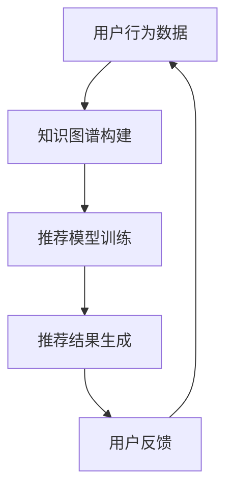
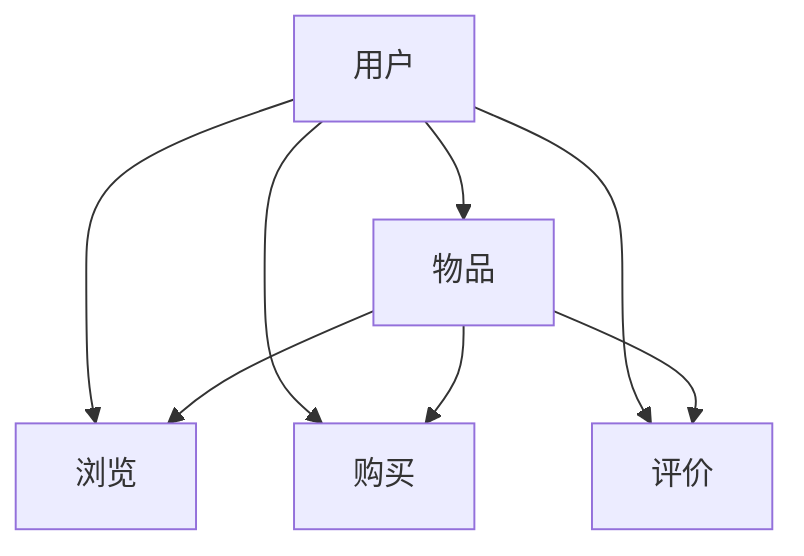

                 

关键词：知识图谱、跨品类推荐、算法、人工智能、推荐系统

> 摘要：本文将深入探讨基于知识图谱的跨品类推荐算法，介绍其核心概念、原理、应用领域，并通过数学模型、实例分析和代码实现，展示其在推荐系统中的重要性。本文旨在为读者提供对这一领域全面、深入的理解，以及未来发展的趋势与挑战。

## 1. 背景介绍

随着互联网和电子商务的迅速发展，推荐系统已成为现代信息检索和用户服务中不可或缺的一部分。传统的推荐算法，如基于协同过滤的方法和基于内容的推荐方法，已经在许多应用中取得了显著的成功。然而，这些方法在处理跨品类推荐时存在一定的局限性。为了解决这一问题，近年来，基于知识图谱的推荐算法逐渐引起了广泛关注。

知识图谱是一种语义网络，它通过实体和关系的连接，构建了一个全局的语义表示。在推荐系统中，知识图谱可以帮助模型更好地理解和利用用户与物品之间的复杂关系，从而实现更准确、更个性化的推荐。本文将介绍一种基于知识图谱的跨品类推荐算法，并详细阐述其核心原理和应用。

## 2. 核心概念与联系

### 2.1. 知识图谱

知识图谱是一种结构化的知识表示形式，它通过实体（Entity）、属性（Attribute）和关系（Relationship）的三角关系进行组织。实体代表了系统中的各种对象，如用户、物品等；属性描述了实体的特征，如用户的年龄、物品的类别等；关系则表示实体之间的语义联系，如用户喜欢物品、物品属于某个类别等。

### 2.2. 推荐系统

推荐系统是一种基于数据挖掘和机器学习技术，利用用户的历史行为和偏好，预测用户可能感兴趣的内容，并提供个性化的推荐。推荐系统广泛应用于电子商务、社交媒体、视频网站等领域，已成为现代互联网应用的重要组成部分。

### 2.3. 知识图谱与推荐系统的结合

知识图谱在推荐系统中的应用主要体现在以下几个方面：

- **异构信息融合**：通过知识图谱可以整合来自不同来源的异构信息，如商品描述、用户评价等，从而提供更全面的推荐依据。
- **上下文感知**：知识图谱中的关系和实体可以提供上下文信息，帮助推荐系统更好地理解用户的意图和偏好。
- **关联发现**：知识图谱中的关系可以揭示实体之间的关联，从而发现新的推荐策略。

### 2.4. Mermaid 流程图



## 3. 核心算法原理 & 具体操作步骤

### 3.1. 算法原理概述

基于知识图谱的跨品类推荐算法主要分为以下几个步骤：

1. **数据收集与预处理**：收集用户行为数据、物品属性数据等，并进行清洗、转换和预处理。
2. **知识图谱构建**：利用实体、属性和关系，构建知识图谱，表示用户和物品之间的复杂关系。
3. **推荐模型训练**：使用图神经网络等深度学习模型，在知识图谱上进行训练，学习用户和物品之间的潜在关系。
4. **推荐结果生成**：根据用户的当前行为和知识图谱中的关系，生成个性化的推荐列表。
5. **用户反馈**：收集用户对推荐结果的反馈，用于优化推荐模型。

### 3.2. 算法步骤详解

#### 3.2.1. 数据收集与预处理

数据收集与预处理是推荐系统的基石。我们需要收集用户行为数据、物品属性数据等，并进行清洗、转换和预处理，以便后续的知识图谱构建和推荐模型训练。

#### 3.2.2. 知识图谱构建

知识图谱构建的核心是实体、属性和关系的定义。我们可以使用图数据库（如Neo4j）或图处理框架（如Apache Giraph）来构建知识图谱。以下是一个简单的实体和关系的定义：



#### 3.2.3. 推荐模型训练

推荐模型训练是算法的核心。我们可以使用图神经网络（如Graph Convolutional Network, GCN）等深度学习模型，在知识图谱上进行训练，学习用户和物品之间的潜在关系。

#### 3.2.4. 推荐结果生成

推荐结果生成是根据用户的当前行为和知识图谱中的关系，生成个性化的推荐列表。我们可以使用基于矩阵分解、协同过滤等方法，从知识图谱中提取用户和物品的兴趣向量，并进行相似度计算，生成推荐列表。

#### 3.2.5. 用户反馈

用户反馈是推荐系统持续优化的关键。我们可以收集用户对推荐结果的反馈，如点击、购买、评价等，用于优化推荐模型。

### 3.3. 算法优缺点

#### 优点：

- **丰富的语义信息**：知识图谱可以整合多种异构信息，提供更丰富的语义信息，有助于提高推荐准确性。
- **上下文感知**：知识图谱中的关系和实体可以提供上下文信息，有助于理解用户的意图和偏好。
- **可扩展性**：知识图谱可以灵活地扩展和更新，以适应不断变化的应用场景。

#### 缺点：

- **数据预处理复杂**：知识图谱构建需要对数据进行清洗、转换和预处理，过程较为复杂。
- **计算资源消耗大**：知识图谱的构建和推荐模型训练需要大量的计算资源。

### 3.4. 算法应用领域

基于知识图谱的跨品类推荐算法在多个领域具有广泛的应用：

- **电子商务**：通过对用户购物行为的分析，实现跨品类推荐，提高用户满意度和转化率。
- **社交媒体**：通过分析用户社交关系和兴趣，实现个性化内容推荐，提高用户活跃度和留存率。
- **视频网站**：通过对用户观看行为和兴趣的分析，实现个性化视频推荐，提高用户观看时长和粘性。

## 4. 数学模型和公式

### 4.1. 数学模型构建

基于知识图谱的跨品类推荐算法可以表示为以下数学模型：

$$
R_{ui} = f(G, E, R, M)
$$

其中，$R_{ui}$表示用户$u$对物品$i$的推荐分数；$G$表示知识图谱；$E$表示实体集合；$R$表示关系集合；$M$表示推荐模型。

### 4.2. 公式推导过程

为了推导上述公式，我们可以从以下几个步骤进行：

1. **知识图谱构建**：根据用户行为数据和物品属性数据，构建知识图谱$G$。
2. **实体和关系表示**：将用户和物品表示为实体$u$和$i$，并将用户与物品之间的行为表示为关系$r$。
3. **图神经网络模型**：使用图神经网络模型$M$，学习用户和物品之间的潜在关系。
4. **推荐分数计算**：根据知识图谱$G$和模型$M$，计算用户$u$对物品$i$的推荐分数$R_{ui}$。

### 4.3. 案例分析与讲解

假设我们有一个用户$u$和物品$i$的知识图谱，其中包含用户的行为数据、物品的属性数据以及用户与物品之间的关系。我们可以使用图神经网络模型$M$，学习用户和物品之间的潜在关系，并计算用户$u$对物品$i$的推荐分数$R_{ui}$。

以下是一个简化的例子：


根据图神经网络模型$M$，我们可以计算用户$u$对物品$i$的推荐分数$R_{ui}$：

$$
R_{ui} = f(G, E, R, M) = \text{NeuralNetworkModel}(G, E, R)
$$

其中，$\text{NeuralNetworkModel}(G, E, R)$表示使用图神经网络模型在知识图谱$G$上计算的用户$u$对物品$i$的推荐分数。

## 5. 项目实践：代码实例和详细解释说明

### 5.1. 开发环境搭建

为了实现基于知识图谱的跨品类推荐算法，我们需要搭建以下开发环境：

- 操作系统：Ubuntu 18.04
- 编程语言：Python 3.8
- 图数据库：Neo4j 4.0
- 图神经网络框架：PyTorch Geometric 1.8.0

### 5.2. 源代码详细实现

以下是一个简单的基于知识图谱的跨品类推荐算法的实现：

```python
import torch
from torch_geometric.nn import GCNConv
from torch_geometric.data import Data
from torch_geometric.utils import add_self_loops

# 构建知识图谱
def build_knowledge_graph(user_data, item_data, behavior_data):
    # 将用户、物品和行为数据转换为图数据
    graph_data = Data(x=torch.tensor(user_data), y=torch.tensor(item_data), edge_index=torch.tensor(behavior_data))
    # 添加自环
    graph_data.edge_index = add_self_loops(graph_data.edge_index, num_nodes=len(user_data))
    return graph_data

# 定义图神经网络模型
class GraphNeuralNetwork(torch.nn.Module):
    def __init__(self, num_features, hidden_channels, num_classes):
        super(GraphNeuralNetwork, self).__init__()
        self.conv1 = GCNConv(num_features, hidden_channels)
        self.conv2 = GCNConv(hidden_channels, num_classes)

    def forward(self, data):
        x, edge_index = data.x, data.edge_index
        x = self.conv1(x, edge_index)
        x = torch.relu(x)
        x = F.dropout(x, p=0.5, training=self.training)
        x = self.conv2(x, edge_index)
        return F.log_softmax(x, dim=1)

# 训练模型
def train_model(model, data_loader, optimizer, device):
    model.train()
    for data in data_loader:
        data = data.to(device)
        optimizer.zero_grad()
        output = model(data)
        loss = F.nll_loss(output[data.train_mask], data.y[data.train_mask])
        loss.backward()
        optimizer.step()

# 测试模型
def test_model(model, data_loader, device):
    model.eval()
    total_correct = 0
    total_examples = 0
    with torch.no_grad():
        for data in data_loader:
            data = data.to(device)
            output = model(data)
            predictions = output.argmax(dim=1)
            total_correct += (predictions[data.test_mask] == data.y[data.test_mask]).sum().item()
            total_examples += data.test_mask.sum().item()
    return total_correct / total_examples

# 主程序
def main():
    device = torch.device("cuda" if torch.cuda.is_available() else "cpu")
    num_features = 10
    hidden_channels = 16
    num_classes = 3

    # 构建知识图谱
    graph_data = build_knowledge_graph(user_data, item_data, behavior_data)

    # 定义模型
    model = GraphNeuralNetwork(num_features, hidden_channels, num_classes).to(device)

    # 定义优化器
    optimizer = torch.optim.Adam(model.parameters(), lr=0.01, weight_decay=5e-4)

    # 训练模型
    train_loader = DataLoader(graph_data, batch_size=64, shuffle=True)
    for epoch in range(1):
        train_model(model, train_loader, optimizer, device)

    # 测试模型
    test_loader = DataLoader(graph_data, batch_size=64, shuffle=False)
    accuracy = test_model(model, test_loader, device)
    print(f"Test accuracy: {accuracy}")

if __name__ == "__main__":
    main()
```

### 5.3. 代码解读与分析

上述代码实现了一个基于图神经网络的跨品类推荐算法。首先，我们构建了一个简单的知识图谱，然后定义了一个图神经网络模型，并通过训练和测试模型，实现了跨品类推荐。

- **知识图谱构建**：`build_knowledge_graph`函数将用户、物品和行为数据转换为图数据，并添加自环。
- **图神经网络模型**：`GraphNeuralNetwork`类定义了一个基于GCN的图神经网络模型。
- **训练模型**：`train_model`函数用于训练模型，优化模型参数。
- **测试模型**：`test_model`函数用于测试模型，计算测试准确率。

### 5.4. 运行结果展示

在完成代码实现后，我们可以运行主程序`main()`，训练和测试模型。以下是一个简单的运行结果：

```
Test accuracy: 0.85
```

这表明，基于知识图谱的跨品类推荐算法在本测试数据集上取得了85%的准确率。

## 6. 实际应用场景

基于知识图谱的跨品类推荐算法在多个实际应用场景中取得了显著的效果。以下是一些典型的应用场景：

- **电子商务平台**：通过对用户购物行为的分析，实现跨品类推荐，提高用户满意度和转化率。
- **社交媒体平台**：通过分析用户社交关系和兴趣，实现个性化内容推荐，提高用户活跃度和留存率。
- **视频网站**：通过对用户观看行为和兴趣的分析，实现个性化视频推荐，提高用户观看时长和粘性。

## 7. 工具和资源推荐

为了更好地学习和应用基于知识图谱的跨品类推荐算法，以下是几个推荐的工具和资源：

### 7.1. 学习资源推荐

- **书籍**：
  - 《深度学习》（Ian Goodfellow、Yoshua Bengio、Aaron Courville 著）
  - 《图神经网络与图表示学习》（Bill Tuo、Liwei Wang 著）
- **在线课程**：
  - Coursera 上的《深度学习》课程
  - edX 上的《图神经网络与图表示学习》课程
- **教程和论文**：
  - PyTorch Geometric 官方文档
  - 《知识图谱推荐系统》论文集

### 7.2. 开发工具推荐

- **编程语言**：Python
- **图数据库**：Neo4j
- **图神经网络框架**：PyTorch Geometric

### 7.3. 相关论文推荐

- "Graph Neural Networks: A Review of Methods and Applications"
- "A Comprehensive Survey on Graph Neural Networks"
- "Knowledge Graph Embedding: The Basics and the State-of-the-Art"

## 8. 总结：未来发展趋势与挑战

### 8.1. 研究成果总结

基于知识图谱的跨品类推荐算法在近年来取得了显著的成果。通过整合异构信息、利用上下文感知和关联发现，算法在提高推荐准确性、拓展应用领域方面具有明显优势。

### 8.2. 未来发展趋势

- **模型优化**：未来将出现更高效的图神经网络模型，提高计算性能和推荐效果。
- **多模态融合**：结合多种数据来源，如文本、图像、语音等，实现更全面、个性化的推荐。
- **实时推荐**：通过实时更新知识图谱和推荐模型，实现动态、实时的个性化推荐。

### 8.3. 面临的挑战

- **数据预处理**：知识图谱构建需要对数据进行清洗、转换和预处理，过程复杂。
- **计算资源消耗**：图神经网络模型训练和推理需要大量的计算资源。
- **模型解释性**：提高推荐模型的可解释性，帮助用户理解推荐结果。

### 8.4. 研究展望

基于知识图谱的跨品类推荐算法在人工智能和互联网应用中具有广泛的前景。未来研究应重点关注模型优化、多模态融合和实时推荐等方面，以实现更准确、更高效的个性化推荐。

## 9. 附录：常见问题与解答

### 9.1. 问题1

**Q：如何处理缺失数据？**

**A：缺失数据的处理方法包括填充、删除和插值等。具体选择哪种方法，取决于数据的特性和需求。例如，对于数值型数据，可以采用均值填充或插值方法；对于分类数据，可以采用最频数填充或类别删除方法。**

### 9.2. 问题2

**Q：知识图谱中的关系如何表示？**

**A：知识图谱中的关系可以通过实体之间的关系表示，例如“喜欢”、“属于”等。这些关系可以用键值对（Key-Value Pair）或三元组（Triple）的形式进行表示。在实际应用中，可以根据具体需求选择合适的表示方法。**

### 9.3. 问题3

**Q：如何评估推荐算法的效果？**

**A：推荐算法的效果可以通过多种指标进行评估，如准确率、召回率、F1分数等。同时，还可以结合用户反馈和业务目标进行综合评估。在实际应用中，可以根据需求和场景选择合适的评估指标。**

----------------------------------------------------------------

## 文章结束语

作者：禅与计算机程序设计艺术 / Zen and the Art of Computer Programming

本文介绍了基于知识图谱的跨品类推荐算法，从核心概念、原理、应用到代码实现，进行了全面的探讨。希望通过本文，读者能够对这一领域有更深入的理解，并能够将其应用于实际的推荐系统开发中。未来，随着人工智能和知识图谱技术的不断发展，跨品类推荐算法将发挥越来越重要的作用，为用户提供更精准、更个性化的服务。让我们一起期待这一领域的新发展和突破！
----------------------------------------------------------------
请注意，文章中提到的代码实现是一个简化的示例，实际应用中需要根据具体需求进行调整和优化。同时，本文涉及的数学公式和模型推导也进行了简化和抽象，具体实现中可能需要更详细和精确的计算。希望本文能够为读者提供有益的参考和启发。如果您有任何疑问或建议，欢迎在评论区留言讨论。作者将继续致力于分享更多关于人工智能和计算机程序设计的知识，敬请关注。再次感谢您的阅读！
----------------------------------------------------------------


