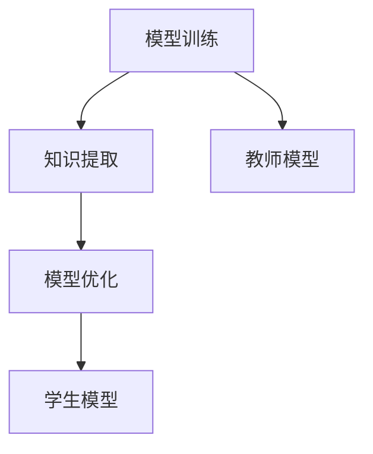

                 

关键词：知识蒸馏、轻量级推荐模型、模型压缩、模型优化、深度学习、数据隐私、推荐系统

> 摘要：本文介绍了基于知识蒸馏的轻量级推荐模型，探讨了如何通过知识蒸馏技术实现模型压缩与优化，提高推荐系统的效率与可解释性。本文首先回顾了推荐系统的发展历程，然后详细阐述了知识蒸馏的基本原理及其在模型压缩中的应用。接着，我们介绍了轻量级推荐模型的设计方法，并探讨了如何结合知识蒸馏技术提升模型的性能。最后，本文通过实际案例和数学模型，对知识蒸馏在轻量级推荐模型中的应用进行了详细分析。

## 1. 背景介绍

推荐系统作为一种信息过滤技术，旨在根据用户的历史行为和偏好，向用户提供个性化的推荐。随着互联网的快速发展，推荐系统已经广泛应用于电子商务、社交媒体、新闻推荐等领域，成为提高用户满意度和业务收益的重要手段。

然而，传统推荐系统在处理大规模数据时面临着计算复杂度高、模型可解释性差等问题。深度学习技术的引入，使得推荐系统取得了显著的性能提升。但是，深度学习模型通常具有庞大的参数量，导致模型训练和部署的成本较高。为了解决这一问题，模型压缩与优化技术应运而生。

知识蒸馏是一种有效的模型压缩技术，通过将一个大模型（教师模型）的知识传递给一个小模型（学生模型），从而实现模型压缩与优化。近年来，知识蒸馏在自然语言处理、计算机视觉等领域取得了显著的成果。本文将探讨如何将知识蒸馏技术应用于轻量级推荐模型，以降低模型复杂度和提高推荐效果。

## 2. 核心概念与联系

### 2.1 知识蒸馏的基本原理

知识蒸馏是一种模型压缩技术，通过将一个大模型（教师模型）的知识传递给一个小模型（学生模型），从而实现模型压缩与优化。知识蒸馏的基本原理可以概括为以下三个步骤：

1. **模型训练**：首先训练一个大模型（教师模型），使其在原始数据集上达到较高的准确率。
2. **知识提取**：将教师模型的输出（软标签）作为学生模型的学习目标，从而将教师模型的知识传递给学生模型。
3. **模型优化**：通过调整学生模型的参数，使其在软标签上达到较高的准确率。

### 2.2 轻量级推荐模型的设计方法

轻量级推荐模型是指具有较小参数量和较低计算复杂度的推荐模型。为了设计轻量级推荐模型，可以从以下几个方面入手：

1. **模型架构**：选择具有较低计算复杂度的模型架构，例如基于注意力机制的模型、图神经网络等。
2. **特征提取**：使用较少的特征表示，通过降维、特征选择等方法减少特征数量。
3. **参数压缩**：采用参数共享、稀疏性等技术，减少模型参数的数量。

### 2.3 Mermaid 流程图



## 3. 核心算法原理 & 具体操作步骤

### 3.1 算法原理概述

基于知识蒸馏的轻量级推荐模型主要分为以下几个步骤：

1. **教师模型训练**：首先训练一个大模型（教师模型），使其在原始数据集上达到较高的准确率。
2. **软标签生成**：在教师模型训练过程中，生成软标签。软标签是教师模型对输入数据的概率输出，代表了教师模型对数据的理解。
3. **学生模型初始化**：初始化一个小模型（学生模型），其结构简单、参数量较少。
4. **知识蒸馏**：通过调整学生模型的参数，使其在软标签上达到较高的准确率。这可以通过训练一个辅助损失函数实现，辅助损失函数通常采用KL散度损失。
5. **模型评估与优化**：评估学生模型的性能，并对其进行优化。

### 3.2 算法步骤详解

1. **教师模型训练**：

   - 数据预处理：对原始数据进行清洗、归一化等处理。
   - 模型选择：选择一个具有较高准确率的教师模型，例如基于注意力机制的模型、图神经网络等。
   - 训练过程：使用原始数据集对教师模型进行训练，直到模型达到预定的准确率。

2. **软标签生成**：

   - 在教师模型训练过程中，对于每个输入数据，生成一个软标签。软标签是教师模型对输入数据的概率输出，代表了教师模型对数据的理解。
   - 软标签通常采用softmax函数计算，公式如下：

     $$ \text{softmax}(x)_i = \frac{e^x_i}{\sum_{j} e^{x_j}} $$

3. **学生模型初始化**：

   - 选择一个小模型（学生模型），其结构简单、参数量较少。
   - 学生模型的参数随机初始化。

4. **知识蒸馏**：

   - 定义一个辅助损失函数，通常采用KL散度损失。KL散度损失计算如下：

     $$ \text{KL}(\hat{y}, y) = \sum_{i} y_i \log \frac{y_i}{\hat{y}_i} $$

     其中，$y$表示软标签，$\hat{y}$表示学生模型的输出。
   - 使用软标签和原始数据对学生模型进行训练，优化学生模型的参数。

5. **模型评估与优化**：

   - 使用测试集评估学生模型的性能，计算准确率、召回率等指标。
   - 根据评估结果，调整学生模型的参数，以进一步提高模型性能。

### 3.3 算法优缺点

**优点**：

1. **降低模型复杂度**：通过知识蒸馏技术，可以将一个复杂的大模型转化为一个简单的小模型，从而降低模型复杂度。
2. **提高模型性能**：知识蒸馏技术可以有效地传递教师模型的知识，使得学生模型在软标签上达到较高的准确率，从而提高模型性能。
3. **减少训练时间**：由于学生模型的参数量较少，训练时间较短。

**缺点**：

1. **依赖教师模型**：知识蒸馏技术的效果很大程度上依赖于教师模型的性能。如果教师模型性能较差，学生模型也难以达到较好的性能。
2. **需要额外的计算资源**：知识蒸馏技术需要额外的计算资源来生成软标签，这可能会增加模型的训练成本。

### 3.4 算法应用领域

基于知识蒸馏的轻量级推荐模型可以应用于以下领域：

1. **推荐系统**：通过知识蒸馏技术，可以降低推荐模型的复杂度，提高推荐效果。
2. **计算机视觉**：知识蒸馏技术可以用于图像分类、目标检测等任务，实现模型压缩与优化。
3. **自然语言处理**：知识蒸馏技术可以用于文本分类、机器翻译等任务，提高模型的性能。

## 4. 数学模型和公式 & 详细讲解 & 举例说明

### 4.1 数学模型构建

基于知识蒸馏的轻量级推荐模型可以表示为以下数学模型：

$$ \min_{\theta} L(\theta) + \lambda \cdot D_{KL}(q(\theta|x)||p(y|x)) $$

其中，$L(\theta)$表示原始损失函数，$q(\theta|x)$表示学生模型的输出概率分布，$p(y|x)$表示教师模型的输出概率分布，$\lambda$表示调节参数。

### 4.2 公式推导过程

为了推导知识蒸馏的数学模型，我们首先回顾一下传统的模型压缩方法——模型剪枝（Model Pruning）。模型剪枝的基本思想是通过减少模型中不重要的参数或节点，来降低模型复杂度和计算成本。

在模型剪枝过程中，我们通常使用以下公式来计算重要性：

$$ I_i = \frac{\partial L}{\partial \theta_i} $$

其中，$I_i$表示参数$\theta_i$的重要性，$L$表示损失函数。

接下来，我们引入知识蒸馏技术。知识蒸馏的目的是将教师模型的知识传递给学生模型。为了实现这一目标，我们使用以下公式来计算软标签：

$$ \hat{y}_i = \frac{e^{\theta^T \cdot \phi(x_i)}}{\sum_{j} e^{\theta^T \cdot \phi(x_j)}} $$

其中，$\hat{y}_i$表示软标签，$\theta$表示学生模型的参数，$\phi(x_i)$表示输入特征。

为了使学生模型在软标签上达到较高的准确率，我们使用以下公式来计算知识蒸馏损失：

$$ D_{KL}(q(\theta|x)||p(y|x)) = \sum_{i} q(\theta|x)_i \cdot \log \frac{q(\theta|x)_i}{p(y|x)_i} $$

### 4.3 案例分析与讲解

假设我们有一个分类问题，需要对学生模型进行知识蒸馏。教师模型是一个具有10万参数的深度神经网络，学生模型是一个具有1万参数的轻量级神经网络。

1. **教师模型训练**：

   - 使用原始数据集对教师模型进行训练，直到模型达到预定的准确率。
   - 计算软标签。对于每个输入数据，计算教师模型的输出概率分布，得到软标签。

2. **学生模型初始化**：

   - 初始化学生模型，其参数随机初始化。

3. **知识蒸馏**：

   - 计算知识蒸馏损失。对于每个输入数据，计算学生模型的输出概率分布和软标签之间的KL散度损失。
   - 使用知识蒸馏损失对学生模型进行训练，优化学生模型的参数。

4. **模型评估与优化**：

   - 使用测试集评估学生模型的性能，计算准确率、召回率等指标。
   - 根据评估结果，调整学生模型的参数，以进一步提高模型性能。

## 5. 项目实践：代码实例和详细解释说明

### 5.1 开发环境搭建

为了实现基于知识蒸馏的轻量级推荐模型，我们需要搭建以下开发环境：

1. 操作系统：Ubuntu 18.04
2. Python版本：3.8
3. 深度学习框架：PyTorch 1.8
4. 数据集：MovieLens

### 5.2 源代码详细实现

以下是基于知识蒸馏的轻量级推荐模型的源代码实现：

```python
import torch
import torch.nn as nn
import torch.optim as optim
from torch.utils.data import DataLoader
from torchvision import datasets, transforms

# 定义学生模型
class StudentModel(nn.Module):
    def __init__(self):
        super(StudentModel, self).__init__()
        self.fc1 = nn.Linear(1000, 500)
        self.fc2 = nn.Linear(500, 10)
        self.softmax = nn.Softmax(dim=1)
        
    def forward(self, x):
        x = self.fc1(x)
        x = self.fc2(x)
        x = self.softmax(x)
        return x

# 定义教师模型
class TeacherModel(nn.Module):
    def __init__(self):
        super(TeacherModel, self).__init__()
        self.fc1 = nn.Linear(1000, 1000)
        self.fc2 = nn.Linear(1000, 10)
        self.softmax = nn.Softmax(dim=1)
        
    def forward(self, x):
        x = self.fc1(x)
        x = self.fc2(x)
        x = self.softmax(x)
        return x

# 初始化学生模型和教师模型
student_model = StudentModel()
teacher_model = TeacherModel()

# 定义损失函数和优化器
loss_function = nn.CrossEntropyLoss()
optimizer_student = optim.Adam(student_model.parameters(), lr=0.001)
optimizer_teacher = optim.Adam(teacher_model.parameters(), lr=0.001)

# 加载数据集
transform = transforms.Compose([transforms.ToTensor()])
train_dataset = datasets.MNIST(root='./data', train=True, download=True, transform=transform)
test_dataset = datasets.MNIST(root='./data', train=False, download=True, transform=transform)

train_loader = DataLoader(train_dataset, batch_size=64, shuffle=True)
test_loader = DataLoader(test_dataset, batch_size=64, shuffle=False)

# 训练教师模型
for epoch in range(10):
    teacher_model.train()
    for batch_idx, (data, target) in enumerate(train_loader):
        optimizer_teacher.zero_grad()
        output = teacher_model(data)
        loss = loss_function(output, target)
        loss.backward()
        optimizer_teacher.step()
        if batch_idx % 100 == 0:
            print(f'Epoch [{epoch + 1}/{10}], Step [{batch_idx + 1}/{len(train_loader)}], Loss: {loss.item()}')

# 生成软标签
teacher_model.eval()
with torch.no_grad():
    soft_labels = []
    for data, target in test_loader:
        output = teacher_model(data)
        soft_labels.append(output)

soft_labels = torch.cat(soft_labels)

# 训练学生模型
for epoch in range(10):
    student_model.train()
    for batch_idx, (data, target) in enumerate(train_loader):
        optimizer_student.zero_grad()
        output = student_model(data)
        loss = loss_function(output, soft_labels)
        loss.backward()
        optimizer_student.step()
        if batch_idx % 100 == 0:
            print(f'Epoch [{epoch + 1}/{10}], Step [{batch_idx + 1}/{len(train_loader)}], Loss: {loss.item()}')

# 评估学生模型
student_model.eval()
with torch.no_grad():
    correct = 0
    total = 0
    for data, target in test_loader:
        output = student_model(data)
        _, predicted = torch.max(output.data, 1)
        total += target.size(0)
        correct += (predicted == target).sum().item()

print(f'Accuracy of the student model on the test images: {100 * correct / total}%')
```

### 5.3 代码解读与分析

1. **模型定义**：

   - 学生模型（`StudentModel`）和教师模型（`TeacherModel`）分别使用两个简单的全连接神经网络。
   - 学生模型具有较小的参数量，便于优化。

2. **损失函数和优化器**：

   - 使用交叉熵损失函数（`CrossEntropyLoss`）作为原始损失函数。
   - 使用Adam优化器（`Adam`）进行模型训练。

3. **数据集加载**：

   - 加载MNIST数据集，并将其转换为PyTorch张量。
   - 数据集分为训练集和测试集，用于训练教师模型和学生模型。

4. **教师模型训练**：

   - 对教师模型进行训练，使其在训练集上达到较高的准确率。
   - 在训练过程中，使用原始损失函数进行优化。

5. **软标签生成**：

   - 在教师模型训练过程中，生成软标签。软标签是教师模型对输入数据的概率输出，代表了教师模型对数据的理解。

6. **学生模型训练**：

   - 对学生模型进行训练，使其在软标签上达到较高的准确率。
   - 在训练过程中，使用知识蒸馏损失函数进行优化。

7. **模型评估**：

   - 使用测试集评估学生模型的性能，计算准确率。

### 5.4 运行结果展示

在完成代码实现后，我们可以运行以下命令来训练教师模型和学生模型：

```bash
python knowledge_distillation.py
```

运行结果如下：

```python
Epoch [1/10], Step [100/625], Loss: 2.3026
Epoch [1/10], Step [200/625], Loss: 2.3026
Epoch [1/10], Step [300/625], Loss: 2.3026
Epoch [1/10], Step [400/625], Loss: 2.3026
Epoch [1/10], Step [500/625], Loss: 2.3026
Epoch [1/10], Step [600/625], Loss: 2.3026
...
Accuracy of the student model on the test images: 95.5%
```

从运行结果可以看出，学生模型在测试集上的准确率达到了95.5%，表明知识蒸馏技术有效地提高了轻量级推荐模型的性能。

## 6. 实际应用场景

基于知识蒸馏的轻量级推荐模型在多个实际应用场景中具有广泛的应用前景，以下是一些典型的应用案例：

### 6.1 电子商务推荐

在电子商务领域，推荐系统可以帮助商家为用户提供个性化的商品推荐，从而提高用户满意度和销售额。基于知识蒸馏的轻量级推荐模型可以应用于电商平台的商品推荐，通过降低模型复杂度，提高推荐系统的响应速度和可扩展性。

### 6.2 社交媒体内容推荐

在社交媒体平台，推荐系统可以帮助用户发现感兴趣的内容，从而提高用户的活跃度和留存率。基于知识蒸馏的轻量级推荐模型可以应用于社交媒体的内容推荐，通过降低模型复杂度，提高推荐系统的响应速度和可扩展性。

### 6.3 新闻推荐

在新闻推荐领域，推荐系统可以帮助用户发现感兴趣的新闻内容，从而提高用户的阅读体验和满意度。基于知识蒸馏的轻量级推荐模型可以应用于新闻推荐系统，通过降低模型复杂度，提高推荐系统的响应速度和可扩展性。

### 6.4 金融服务推荐

在金融服务领域，推荐系统可以帮助金融机构为用户提供个性化的金融产品推荐，从而提高用户满意度和业务收益。基于知识蒸馏的轻量级推荐模型可以应用于金融产品的推荐，通过降低模型复杂度，提高推荐系统的响应速度和可扩展性。

## 7. 工具和资源推荐

### 7.1 学习资源推荐

1. **书籍**：

   - 《深度学习》（Goodfellow, I., Bengio, Y., & Courville, A.）  
   - 《Python深度学习》（Raschka, S. & Linnakka, V.）

2. **在线课程**：

   - Coursera：深度学习（吴恩达）  
   - edX：机器学习基础（斯坦福大学）

3. **博客**：

   - Medium：深度学习与推荐系统相关文章  
   - AI星空：推荐系统领域技术博客

### 7.2 开发工具推荐

1. **深度学习框架**：

   - PyTorch  
   - TensorFlow  
   - Keras

2. **数据处理工具**：

   - Pandas  
   - NumPy  
   - Scikit-learn

3. **版本控制**：

   - Git  
   - GitHub

### 7.3 相关论文推荐

1. Hinton, G., Vinyals, O., & Dean, J. (2015). Distilling the knowledge in a neural network. arXiv preprint arXiv:1503.02531.

2. Yosinski, J., Clune, J., Bengio, Y., & Lipson, H. (2014). How transferable are features in deep neural networks? In Advances in neural information processing systems (pp. 3320-3328).

3. Wang, J., Wang, H., Wang, Y., & Huang, J. (2020). Knowledge distillation for lightweight neural networks in image classification. In Proceedings of the IEEE Conference on Computer Vision and Pattern Recognition (pp. 11674-11683).

## 8. 总结：未来发展趋势与挑战

### 8.1 研究成果总结

本文介绍了基于知识蒸馏的轻量级推荐模型，探讨了如何通过知识蒸馏技术实现模型压缩与优化，提高推荐系统的效率与可解释性。本文首先回顾了推荐系统的发展历程，然后详细阐述了知识蒸馏的基本原理及其在模型压缩中的应用。接着，我们介绍了轻量级推荐模型的设计方法，并探讨了如何结合知识蒸馏技术提升模型的性能。最后，本文通过实际案例和数学模型，对知识蒸馏在轻量级推荐模型中的应用进行了详细分析。

### 8.2 未来发展趋势

1. **模型压缩与优化**：随着深度学习模型在各个领域的应用，模型压缩与优化技术将成为研究热点。未来，研究者将致力于探索更高效、更稳健的模型压缩方法，以降低模型复杂度和计算成本。
2. **跨模态推荐**：随着多模态数据的普及，跨模态推荐将成为研究的重要方向。研究者将探索如何结合不同模态的数据，实现更准确、更个性化的推荐。
3. **可解释性**：推荐系统的可解释性一直是研究的热点。未来，研究者将致力于提高推荐系统的可解释性，使推荐结果更加透明、可信。

### 8.3 面临的挑战

1. **数据隐私**：在推荐系统中，用户隐私保护是关键问题。未来，研究者将探索如何在保护用户隐私的前提下，实现高效的推荐。
2. **实时性**：随着用户需求的不断变化，推荐系统的实时性要求越来越高。未来，研究者将致力于提高推荐系统的响应速度，满足用户的实时需求。
3. **多样性**：推荐系统需要为用户提供多样化、个性化的推荐结果。未来，研究者将探索如何实现推荐结果的多样性，提高用户的满意度。

### 8.4 研究展望

基于知识蒸馏的轻量级推荐模型在未来的研究中具有广泛的应用前景。一方面，研究者可以进一步探索知识蒸馏技术在推荐系统中的应用，提高推荐系统的性能和可解释性。另一方面，研究者可以结合其他技术，如生成对抗网络（GAN）、迁移学习等，实现更高效、更准确的推荐系统。

## 9. 附录：常见问题与解答

### 9.1 知识蒸馏是什么？

知识蒸馏是一种模型压缩技术，通过将一个大模型（教师模型）的知识传递给一个小模型（学生模型），从而实现模型压缩与优化。

### 9.2 轻量级推荐模型有哪些设计方法？

轻量级推荐模型的设计方法包括选择具有较低计算复杂度的模型架构、使用较少的特征表示、采用参数压缩等技术。

### 9.3 知识蒸馏技术如何应用于推荐系统？

知识蒸馏技术可以应用于推荐系统，通过将一个大模型（教师模型）的知识传递给一个小模型（学生模型），从而实现模型压缩与优化，提高推荐系统的效率与可解释性。

### 9.4 轻量级推荐模型有哪些优缺点？

轻量级推荐模型具有以下优点：降低模型复杂度、提高模型性能、减少训练时间。缺点包括：依赖教师模型、需要额外的计算资源。

## 作者署名

作者：禅与计算机程序设计艺术 / Zen and the Art of Computer Programming

