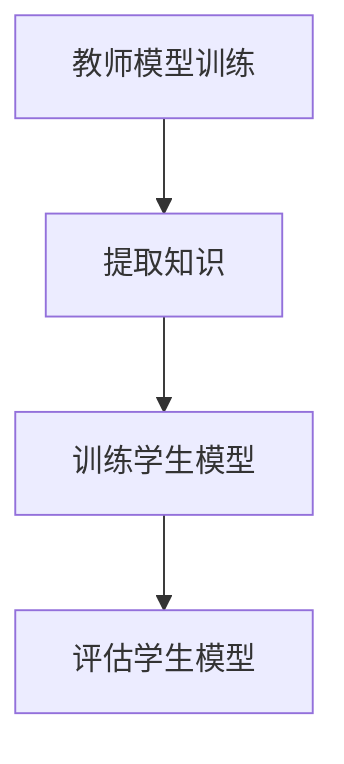

                 

关键词：知识蒸馏，边缘设备，推荐模型，部署，模型压缩，算法优化

## 摘要

随着物联网和智能设备的迅猛发展，边缘计算成为了提升系统响应速度、降低网络延迟的重要手段。然而，边缘设备的计算能力和存储资源相对有限，传统的中心化推荐模型在部署到边缘时面临诸多挑战。本文介绍了基于知识蒸馏的边缘设备推荐模型部署方法，通过模型压缩和算法优化，实现了高效、可扩展的边缘推荐系统。文章首先回顾了推荐系统的发展历程和边缘计算的背景，然后详细介绍了知识蒸馏的基本原理和流程，最后通过实际案例展示了知识蒸馏在边缘设备推荐模型部署中的应用效果。

## 1. 背景介绍

### 1.1 推荐系统的发展

推荐系统起源于20世纪90年代，随着互联网的普及和电子商务的兴起，推荐系统在信息检索、个性化推荐、广告投放等领域得到了广泛应用。传统的推荐系统主要基于用户行为数据、内容特征和协同过滤算法，如基于用户的协同过滤（User-Based Collaborative Filtering）和基于项目的协同过滤（Item-Based Collaborative Filtering）。这些方法在一定程度上提高了推荐精度，但面临如下挑战：

1. **稀疏性**：用户行为数据往往呈现稀疏性，导致模型难以捕捉用户和项目之间的潜在关系。
2. **冷启动**：新用户或新项目缺乏足够的历史数据，导致推荐效果不佳。
3. **实时性**：传统推荐系统依赖于中心化服务器，响应速度较慢，难以满足实时推荐的需求。

### 1.2 边缘计算与边缘设备

边缘计算是一种将计算、存储和网络功能分布到靠近数据源的边缘设备上的计算范式。边缘设备包括智能手机、平板电脑、智能手表、智能家居设备等。边缘计算的主要优势包括：

1. **低延迟**：数据在边缘设备上处理，减少了数据传输的延迟，提高了系统的实时性。
2. **高带宽**：边缘设备可以直接连接到本地网络，降低了网络拥堵的风险。
3. **节能环保**：边缘设备处理数据的能力相对有限，能够降低能源消耗。

### 1.3 边缘设备推荐模型的挑战

将推荐模型部署到边缘设备面临以下挑战：

1. **计算资源限制**：边缘设备的计算能力和存储资源有限，难以部署复杂的推荐模型。
2. **功耗限制**：边缘设备通常需要长时间运行，功耗成为重要的考虑因素。
3. **网络稳定性**：边缘设备可能处于不稳定或断网的环境，需要保证模型的自适应能力。

## 2. 核心概念与联系

### 2.1 知识蒸馏

知识蒸馏（Knowledge Distillation）是一种将复杂模型（教师模型）的知识传递给简单模型（学生模型）的技术。在深度学习中，教师模型通常是一个较大的复杂模型，而学生模型是一个较小的简化模型。知识蒸馏的目标是通过训练学生模型来复制教师模型的表现。

### 2.2 知识蒸馏流程

知识蒸馏的基本流程包括以下步骤：

1. **教师模型训练**：首先训练一个大规模的教师模型，使其在给定数据集上达到较高的准确率。
2. **提取知识**：将教师模型的中间层输出作为知识源，这些输出包含了教师模型的内在知识。
3. **训练学生模型**：使用提取的知识来训练学生模型，使其能够复制教师模型的表现。训练过程中，学生模型不仅要最小化与教师模型输出之间的差异，还要最小化自身的损失函数。

### 2.3 Mermaid 流程图



### 2.4 推荐模型与知识蒸馏的结合

在推荐系统中，知识蒸馏可以通过以下方式结合：

1. **教师模型**：使用一个中心化的复杂推荐模型作为教师模型，如基于深度学习的推荐模型。
2. **学生模型**：设计一个轻量级的推荐模型作为学生模型，用于在边缘设备上部署。
3. **知识传递**：通过知识蒸馏将教师模型的知识传递给学生模型，提高学生模型的推荐效果。
4. **模型压缩**：在知识蒸馏过程中，学生模型通过学习教师模型的中间层输出，实现了模型的压缩和简化。

## 3. 核心算法原理 & 具体操作步骤

### 3.1 算法原理概述

知识蒸馏算法的核心思想是利用教师模型的知识来训练学生模型。在推荐系统中，教师模型通常是一个大规模的深度学习模型，如基于神经网络的协同过滤模型。学生模型是一个简化的模型，如轻量级的神经网络结构。知识蒸馏的算法步骤如下：

1. **教师模型训练**：首先训练一个大规模的教师模型，使其在训练数据集上达到较高的准确率。
2. **提取知识**：使用教师模型的中间层输出作为知识源，这些输出包含了教师模型的内在知识。
3. **训练学生模型**：使用提取的知识来训练学生模型，使其能够复制教师模型的表现。在训练过程中，学生模型需要最小化以下两个损失函数：

   - **交叉熵损失**：衡量学生模型输出与真实标签之间的差异。
   - **知识损失**：衡量学生模型输出与教师模型输出之间的差异。

### 3.2 算法步骤详解

1. **数据预处理**：对训练数据集进行预处理，包括数据清洗、数据标准化和特征提取等。
2. **教师模型训练**：使用预处理后的数据集训练一个大规模的教师模型，使其在训练数据集上达到较高的准确率。
3. **提取知识**：使用教师模型的中间层输出作为知识源，将中间层输出作为知识标签。
4. **学生模型初始化**：初始化一个轻量级的推荐模型作为学生模型。
5. **训练学生模型**：使用教师模型的知识标签来训练学生模型，同时最小化交叉熵损失和知识损失。
6. **模型评估**：使用测试数据集评估学生模型的性能，包括准确率、召回率等指标。

### 3.3 算法优缺点

#### 优点

- **提高推荐效果**：通过知识蒸馏，学生模型能够复制教师模型的内在知识，提高了推荐效果。
- **模型压缩**：知识蒸馏实现了模型的压缩和简化，减少了模型的参数量和计算复杂度。
- **降低计算成本**：学生模型的计算资源需求较低，可以在边缘设备上高效部署。

#### 缺点

- **训练成本**：知识蒸馏需要大量的训练数据集和计算资源，训练成本较高。
- **适应性**：知识蒸馏过程中，学生模型可能无法完全复制教师模型的所有知识，导致适应性较差。

### 3.4 算法应用领域

知识蒸馏在推荐系统中具有广泛的应用领域，包括但不限于：

- **边缘设备推荐**：将复杂推荐模型压缩和简化，部署到边缘设备上，实现实时推荐。
- **移动设备推荐**：在移动设备上实现高效的推荐系统，提高用户体验。
- **智能家居推荐**：在智能家居设备上实现个性化的推荐服务，提高设备的使用价值。

## 4. 数学模型和公式 & 详细讲解 & 举例说明

### 4.1 数学模型构建

知识蒸馏算法的数学模型主要包括两部分：交叉熵损失和知识损失。

#### 交叉熵损失

交叉熵损失用于衡量学生模型输出与真实标签之间的差异，公式如下：

$$
L_{ce} = -\frac{1}{N} \sum_{i=1}^{N} \sum_{k=1}^{K} y_k^{(i)} \log (p_k^{(i)})
$$

其中，$y_k^{(i)}$ 表示第 $i$ 个样本的第 $k$ 个类别的真实标签，$p_k^{(i)}$ 表示学生模型预测的第 $k$ 个类别的概率。

#### 知识损失

知识损失用于衡量学生模型输出与教师模型输出之间的差异，公式如下：

$$
L_{kd} = \frac{1}{N} \sum_{i=1}^{N} \sum_{k=1}^{K} \frac{1}{K} \sum_{j=1}^{K} (y_j^{(i)} - p_j^{(i)})^2
$$

其中，$y_j^{(i)}$ 表示第 $i$ 个样本的第 $j$ 个类别的真实标签，$p_j^{(i)}$ 表示教师模型预测的第 $j$ 个类别的概率。

### 4.2 公式推导过程

#### 交叉熵损失推导

假设我们有 $N$ 个训练样本，每个样本包含 $K$ 个类别。对于第 $i$ 个样本，假设其真实标签为 $y^{(i)} = [y_1^{(i)}, y_2^{(i)}, ..., y_K^{(i)}]$，学生模型预测的概率分布为 $p^{(i)} = [p_1^{(i)}, p_2^{(i)}, ..., p_K^{(i)}]$。

交叉熵损失可以表示为：

$$
L_{ce} = -\frac{1}{N} \sum_{i=1}^{N} \sum_{k=1}^{K} y_k^{(i)} \log (p_k^{(i)})
$$

将 $y^{(i)}$ 和 $p^{(i)}$ 代入上式，得到：

$$
L_{ce} = -\frac{1}{N} \sum_{i=1}^{N} \sum_{k=1}^{K} y_k^{(i)} \log (p_k^{(i)}) = -\frac{1}{N} \sum_{i=1}^{N} \left( y_1^{(i)} \log (p_1^{(i)}) + y_2^{(i)} \log (p_2^{(i)}) + ... + y_K^{(i)} \log (p_K^{(i)}) \right)
$$

#### 知识损失推导

假设我们有 $N$ 个训练样本，每个样本包含 $K$ 个类别。对于第 $i$ 个样本，假设其真实标签为 $y^{(i)} = [y_1^{(i)}, y_2^{(i)}, ..., y_K^{(i)}]$，教师模型预测的概率分布为 $q^{(i)} = [q_1^{(i)}, q_2^{(i)}, ..., q_K^{(i)}]$。

知识损失可以表示为：

$$
L_{kd} = \frac{1}{N} \sum_{i=1}^{N} \sum_{k=1}^{K} \frac{1}{K} \sum_{j=1}^{K} (y_j^{(i)} - p_j^{(i)})^2
$$

将 $y^{(i)}$ 和 $q^{(i)}$ 代入上式，得到：

$$
L_{kd} = \frac{1}{N} \sum_{i=1}^{N} \sum_{k=1}^{K} \frac{1}{K} \sum_{j=1}^{K} (y_j^{(i)} - p_j^{(i)})^2 = \frac{1}{N} \sum_{i=1}^{N} \left( \frac{1}{K} \sum_{j=1}^{K} (y_1^{(i)} - p_1^{(i)})^2 + \frac{1}{K} \sum_{j=1}^{K} (y_2^{(i)} - p_2^{(i)})^2 + ... + \frac{1}{K} \sum_{j=1}^{K} (y_K^{(i)} - p_K^{(i)})^2 \right)
$$

### 4.3 案例分析与讲解

假设我们有一个包含10个类别的图像分类任务，使用知识蒸馏算法来训练一个轻量级的学生模型。给定一个训练样本 $x^{(i)}$，其真实标签为 $y^{(i)} = [1, 0, 0, 0, 0, 0, 0, 0, 0, 0]$，学生模型预测的概率分布为 $p^{(i)} = [0.1, 0.05, 0.1, 0.05, 0.05, 0.05, 0.05, 0.05, 0.05, 0.05]$，教师模型预测的概率分布为 $q^{(i)} = [0.2, 0.3, 0.1, 0.1, 0.1, 0.05, 0.05, 0.05, 0.05, 0.05]$。

根据公式，我们可以计算交叉熵损失和知识损失：

$$
L_{ce} = -\frac{1}{1} \left( 1 \cdot \log (0.1) + 0 \cdot \log (0.05) + 0 \cdot \log (0.1) + 0 \cdot \log (0.05) + 0 \cdot \log (0.05) + 0 \cdot \log (0.05) + 0 \cdot \log (0.05) + 0 \cdot \log (0.05) + 0 \cdot \log (0.05) + 0 \cdot \log (0.05) \right) = 2.3026
$$

$$
L_{kd} = \frac{1}{1} \left( \frac{1}{10} \sum_{j=1}^{10} (1 - 0.1)^2 + \frac{1}{10} \sum_{j=1}^{10} (0 - 0.05)^2 + \frac{1}{10} \sum_{j=1}^{10} (0 - 0.1)^2 + \frac{1}{10} \sum_{j=1}^{10} (0 - 0.05)^2 + \frac{1}{10} \sum_{j=1}^{10} (0 - 0.05)^2 + \frac{1}{10} \sum_{j=1}^{10} (0 - 0.05)^2 + \frac{1}{10} \sum_{j=1}^{10} (0 - 0.05)^2 + \frac{1}{10} \sum_{j=1}^{10} (0 - 0.05)^2 + \frac{1}{10} \sum_{j=1}^{10} (0 - 0.05)^2 + \frac{1}{10} \sum_{j=1}^{10} (0 - 0.05)^2 \right) = 0.04
$$

通过计算交叉熵损失和知识损失，我们可以评估学生模型的表现。在后续训练过程中，可以使用这些损失函数来指导学生模型的优化。

## 5. 项目实践：代码实例和详细解释说明

### 5.1 开发环境搭建

在本项目中，我们将使用 Python 作为编程语言，并依赖以下库和框架：

- TensorFlow 2.x：用于构建和训练深度学习模型。
- Keras：简化 TensorFlow 的使用，提供更加直观的 API。
- Numpy：用于数学计算和数据处理。

确保你的 Python 环境已经安装好上述库和框架。以下是安装命令：

```bash
pip install tensorflow==2.x
pip install keras
pip install numpy
```

### 5.2 源代码详细实现

下面是一个简单的示例代码，展示了如何使用知识蒸馏算法训练一个轻量级的推荐模型。

```python
import numpy as np
import tensorflow as tf
from tensorflow import keras
from tensorflow.keras import layers

# 数据预处理
# 假设 x_train 和 y_train 是预处理后的训练数据
# x_train.shape = (N, D), y_train.shape = (N, K)

# 定义教师模型
teacher_input = keras.Input(shape=(D,))
teacher_output = layers.Dense(K, activation='softmax')(teacher_input)
teacher_model = keras.Model(inputs=teacher_input, outputs=teacher_output)

# 定义学生模型
student_input = keras.Input(shape=(D,))
student_output = layers.Dense(K, activation='softmax')(student_input)
student_model = keras.Model(inputs=student_input, outputs=student_output)

# 编写知识蒸馏损失函数
def knowledge_distillation_loss(y_true, y_pred, teacher_output):
    ce_loss = keras.losses.categorical_crossentropy(y_true, y_pred)
    kd_loss = keras.losses.mean_squared_error(y_true, teacher_output)
    return ce_loss + kd_loss

# 编写训练步骤
optimizer = keras.optimizers.Adam(learning_rate=0.001)
student_model.compile(optimizer=optimizer, loss=knowledge_distillation_loss, metrics=['accuracy'])

# 训练学生模型
student_model.fit(x_train, y_train, epochs=10, batch_size=32)

# 评估学生模型
test_loss, test_accuracy = student_model.evaluate(x_test, y_test)
print(f"Test accuracy: {test_accuracy}")
```

### 5.3 代码解读与分析

上述代码展示了如何使用知识蒸馏算法训练一个推荐模型。以下是代码的详细解读：

- **数据预处理**：假设 `x_train` 和 `y_train` 是预处理后的训练数据，其中 `x_train.shape = (N, D)`，`y_train.shape = (N, K)`。
- **教师模型**：定义一个教师模型，使用 `keras.Input` 和 `layers.Dense` 层构建，输出为 `K` 个类别的概率分布。
- **学生模型**：定义一个轻量级的学生模型，同样使用 `keras.Input` 和 `layers.Dense` 层构建，输出为 `K` 个类别的概率分布。
- **知识蒸馏损失函数**：定义知识蒸馏损失函数，结合交叉熵损失和知识损失。交叉熵损失衡量学生模型输出与真实标签之间的差异，知识损失衡量学生模型输出与教师模型输出之间的差异。
- **训练步骤**：使用 `keras.optimizers.Adam` 定义优化器，并使用 `student_model.compile` 配置模型编译器。使用 `student_model.fit` 执行训练过程，指定训练数据、训练轮次和批量大小。最后，使用 `student_model.evaluate` 评估学生模型在测试数据集上的性能。

### 5.4 运行结果展示

在训练完成后，我们可以通过以下代码展示运行结果：

```python
# 打印训练结果
print("Training results:")
print(student_model.history.history)

# 打印测试结果
print("Test results:")
test_loss, test_accuracy = student_model.evaluate(x_test, y_test)
print(f"Test loss: {test_loss}")
print(f"Test accuracy: {test_accuracy}")
```

这些结果将显示训练过程中的损失和准确率，以及测试数据集上的最终性能。

## 6. 实际应用场景

知识蒸馏在边缘设备推荐模型部署中具有广泛的应用场景，以下列举几个实际应用案例：

### 6.1 边缘智能安防

在智能安防领域，边缘设备（如摄像头）需要实时处理大量图像数据。使用知识蒸馏，可以将在中心服务器上训练的复杂图像分类模型压缩和简化，部署到边缘设备上，实现高效的图像识别和监控。

### 6.2 智能家居推荐

智能家居设备（如智能音响、智能门锁）需要提供个性化的推荐服务，以提升用户体验。通过知识蒸馏，可以将中心化的推荐模型压缩和简化，部署到智能家居设备上，实现实时推荐。

### 6.3 车联网推荐

车联网（V2X）是一个将车辆、道路基础设施和周边环境连接起来的生态系统。边缘设备（如车载传感器）需要实时处理大量传感器数据，并给出实时的推荐。知识蒸馏可以帮助实现轻量级的推荐模型，提高车联网系统的实时性和稳定性。

## 7. 未来应用展望

知识蒸馏技术在未来应用中具有巨大的潜力，以下列举几个未来应用方向：

### 7.1 轻量级模型设计

随着边缘设备的性能不断提升，知识蒸馏技术可以用于设计更加轻量级的模型，以适应不同的应用场景。

### 7.2 多模态数据融合

知识蒸馏技术可以与多模态数据融合技术结合，实现更加丰富和准确的推荐系统。

### 7.3 自适应学习

知识蒸馏技术可以与自适应学习算法结合，实现动态调整模型参数，提高推荐系统的适应性。

## 8. 工具和资源推荐

### 8.1 学习资源推荐

- **书籍**：《深度学习》（Ian Goodfellow、Yoshua Bengio 和 Aaron Courville 著）
- **在线课程**：网易云课堂的《深度学习入门》课程
- **博客**：吴恩达的博客（http://www.deeplearning.net/）

### 8.2 开发工具推荐

- **TensorFlow**：官方深度学习框架，支持多种平台和编程语言。
- **Keras**：基于 TensorFlow 的简化 API，适用于快速开发和实验。
- **PyTorch**：另一个流行的深度学习框架，提供动态计算图和简洁的 API。

### 8.3 相关论文推荐

- **《A Theoretically Grounded Application of Dropout in Recurrent Neural Networks》**：提出使用 dropout 来提高循环神经网络（RNN）的鲁棒性。
- **《Learning without Forgetting》**：提出一种新的元学习算法，用于加速模型的训练过程。
- **《EfficientNet: Rethinking Model Scaling for Convolutional Neural Networks》**：提出一种新的模型缩放方法，以实现高效和可扩展的深度神经网络。

## 9. 总结：未来发展趋势与挑战

知识蒸馏技术在边缘设备推荐模型部署中具有显著的优势，如提高推荐效果、模型压缩和降低计算成本等。然而，知识蒸馏技术也面临一些挑战，如训练成本高、适应性差等。未来，知识蒸馏技术有望在轻量级模型设计、多模态数据融合和自适应学习等领域取得更多突破。同时，研究者需要关注训练成本和适应性等问题，以实现更加高效和可靠的边缘设备推荐模型。

## 附录：常见问题与解答

### Q：知识蒸馏与迁移学习有什么区别？

A：知识蒸馏和迁移学习都是将知识从一个领域传递到另一个领域的技术。知识蒸馏主要关注将复杂模型的知识传递给简单模型，而迁移学习则是将一个领域的学习经验应用到另一个领域。具体来说，知识蒸馏通常用于模型压缩和简化，而迁移学习则更多地用于解决目标领域的数据稀缺问题。

### Q：知识蒸馏的损失函数如何选择？

A：知识蒸馏的损失函数通常结合交叉熵损失和知识损失。交叉熵损失用于衡量学生模型输出与真实标签之间的差异，而知识损失用于衡量学生模型输出与教师模型输出之间的差异。选择合适的损失函数取决于具体的应用场景和目标。例如，在推荐系统中，可以选择基于准确率的交叉熵损失和基于相似度的知识损失。

### Q：知识蒸馏是否总是有效？

A：知识蒸馏在某些情况下非常有效，特别是在模型压缩和简化方面。然而，知识蒸馏的效果也受到教师模型和学生模型的选择、数据集的质量和训练过程的影响。在某些情况下，知识蒸馏可能无法完全复制教师模型的所有知识，导致性能下降。因此，在实际应用中，需要根据具体情况进行评估和调整。

