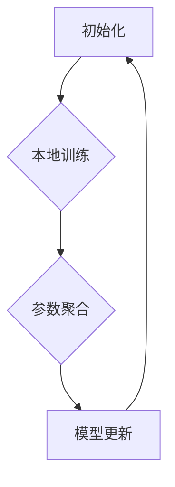

                 

关键词：联邦学习，用户画像，跨平台，数据隐私，机器学习，协同学习

> 摘要：随着互联网和大数据技术的快速发展，用户画像作为一种重要的数据分析手段，已成为许多企业了解用户需求和优化产品服务的利器。然而，传统的集中式用户画像构建方式在处理大规模分布式数据时存在诸多问题，如数据隐私泄露、数据安全风险等。本文将探讨一种基于联邦学习的跨平台用户画像构建方法，以解决传统方法的局限性，提高数据隐私保护能力，为个性化推荐、广告投放等应用场景提供技术支持。

## 1. 背景介绍

### 1.1 用户画像的概念与重要性

用户画像是指通过对用户在互联网上的行为数据、兴趣偏好、社会属性等多维度信息的综合分析，构建出一个关于用户的虚拟轮廓。它可以帮助企业更好地理解用户需求，实现精准营销和个性化服务。

用户画像的重要性主要体现在以下几个方面：

1. **提高营销效率**：通过用户画像，企业可以针对性地推送广告、推荐商品，提高转化率和用户满意度。
2. **优化产品和服务**：了解用户需求和偏好，有助于企业改进产品功能，提升用户体验。
3. **风险防控**：用户画像可用于风险识别和预警，降低信用风险和欺诈风险。

### 1.2 跨平台用户画像的挑战

随着移动互联网的普及，用户行为逐渐从单一平台转向多平台，这使得跨平台用户画像构建面临以下挑战：

1. **数据孤岛**：不同平台拥有不同的用户数据，难以实现数据共享和整合。
2. **数据隐私**：用户在不同平台上的数据存在隐私风险，传统集中式构建方法难以满足隐私保护需求。
3. **计算资源**：跨平台用户画像涉及海量数据处理，传统方法对计算资源的需求较高。

### 1.3 联邦学习在用户画像构建中的应用

联邦学习是一种分布式机器学习技术，通过在多个数据持有者之间协作训练模型，实现隐私保护的机器学习。它在跨平台用户画像构建中具有以下优势：

1. **隐私保护**：联邦学习将数据留在本地，仅共享模型参数，有效降低数据隐私泄露风险。
2. **协同建模**：联邦学习允许跨平台的数据共享和协同建模，提高用户画像的准确性和全面性。
3. **高效计算**：联邦学习采用分布式计算，降低单台设备的计算负担，提升整体计算效率。

## 2. 核心概念与联系

### 2.1 联邦学习的定义与原理

联邦学习（Federated Learning）是一种分布式机器学习技术，其核心思想是将模型训练过程分布在多个参与者（设备或服务器）上，通过逐步更新局部模型参数，最终在中央服务器上生成全局模型。具体流程如下：

1. **初始化**：中央服务器生成初始模型，并将模型参数分发到各个参与者。
2. **本地训练**：参与者使用本地数据对模型进行训练，更新模型参数。
3. **参数聚合**：参与者将更新后的模型参数发送给中央服务器，中央服务器进行参数聚合，生成全局模型。
4. **模型更新**：中央服务器将新的全局模型参数分发回参与者。

### 2.2 用户画像的概念与构建方法

用户画像是指通过用户在互联网上的行为数据、兴趣偏好、社会属性等多维度信息的综合分析，构建出一个关于用户的虚拟轮廓。其构建方法主要包括：

1. **数据采集**：收集用户在不同平台上的行为数据，如浏览记录、搜索关键词、购物记录等。
2. **数据清洗**：对采集到的数据进行清洗、去重、格式统一等预处理。
3. **特征提取**：从原始数据中提取用户特征，如用户年龄、性别、兴趣爱好等。
4. **模型训练**：使用机器学习算法对用户特征进行建模，生成用户画像。

### 2.3 联邦学习与用户画像的关联

联邦学习与用户画像的关联主要体现在以下几个方面：

1. **隐私保护**：联邦学习将用户画像构建过程分布在多个平台，降低数据泄露风险。
2. **协同建模**：联邦学习允许跨平台用户画像数据的共享和协同建模，提高画像的准确性和全面性。
3. **高效计算**：联邦学习采用分布式计算，降低单台设备的计算负担，提高用户画像构建的效率。

### 2.4 Mermaid 流程图



## 3. 核心算法原理 & 具体操作步骤

### 3.1 算法原理概述

基于联邦学习的跨平台用户画像构建算法主要分为以下几个步骤：

1. **初始化**：中央服务器生成初始模型，并将模型参数分发到各个参与者。
2. **本地训练**：参与者使用本地数据对模型进行训练，更新模型参数。
3. **参数聚合**：参与者将更新后的模型参数发送给中央服务器，中央服务器进行参数聚合，生成全局模型。
4. **模型更新**：中央服务器将新的全局模型参数分发回参与者。

### 3.2 算法步骤详解

#### 3.2.1 初始化

在算法初始化阶段，中央服务器生成一个初始模型，并将模型参数（如权重矩阵、偏置项等）发送给各个参与者。这一过程可以通过随机初始化或基于已有模型进行迁移学习来实现。

#### 3.2.2 本地训练

在本地训练阶段，每个参与者使用自己的数据对模型进行训练。具体步骤如下：

1. **数据准备**：参与者从本地数据集中提取用户特征，并将其转换为模型输入。
2. **模型更新**：使用用户特征和模型参数进行前向传播和反向传播，更新模型参数。
3. **参数保存**：将更新后的模型参数保存到本地，以备后续参数聚合阶段使用。

#### 3.2.3 参数聚合

在参数聚合阶段，每个参与者将本地训练得到的模型参数发送给中央服务器。中央服务器对收到的模型参数进行聚合，生成全局模型参数。具体步骤如下：

1. **参数接收**：中央服务器接收各个参与者发送的模型参数。
2. **参数聚合**：中央服务器根据一定的聚合策略（如加权平均、梯度聚合等）对模型参数进行聚合，生成全局模型参数。
3. **参数更新**：中央服务器将新的全局模型参数发送回各个参与者。

#### 3.2.4 模型更新

在模型更新阶段，中央服务器将新的全局模型参数分发回各个参与者。参与者使用新的全局模型参数对本地模型进行更新，以适应新的全局模型。具体步骤如下：

1. **参数接收**：参与者从中央服务器接收新的全局模型参数。
2. **模型更新**：参与者使用新的全局模型参数对本地模型进行更新。
3. **模型评估**：参与者对更新后的模型进行评估，以验证模型的性能和效果。

### 3.3 算法优缺点

#### 3.3.1 优点

1. **隐私保护**：联邦学习将用户画像构建过程分布在多个平台，有效降低了数据隐私泄露风险。
2. **协同建模**：联邦学习允许跨平台用户画像数据的共享和协同建模，提高了画像的准确性和全面性。
3. **高效计算**：联邦学习采用分布式计算，降低了单台设备的计算负担，提高了用户画像构建的效率。

#### 3.3.2 缺点

1. **通信开销**：联邦学习过程中需要频繁进行参数传输，可能导致通信开销较大。
2. **模型一致性**：由于参与者之间的数据分布和计算能力可能存在差异，导致全局模型的一致性较难保证。
3. **模型性能**：联邦学习过程中，参与者的本地数据集可能存在样本不均衡、噪声较大等问题，影响全局模型的性能。

### 3.4 算法应用领域

基于联邦学习的跨平台用户画像构建方法适用于以下领域：

1. **个性化推荐**：通过构建跨平台的用户画像，实现更准确的个性化推荐。
2. **广告投放**：基于跨平台用户画像，实现更精准的广告投放，提高广告效果。
3. **风险防控**：利用跨平台用户画像，识别潜在风险用户，提高风险防控能力。

## 4. 数学模型和公式 & 详细讲解 & 举例说明

### 4.1 数学模型构建

基于联邦学习的跨平台用户画像构建方法可以抽象为一个数学模型，如下所示：

$$
\begin{aligned}
\text{初始化：} & \\
\text{模型参数：} & \theta_0 = \{W_0, b_0\} \\
\text{数据集：} & D = \{D_1, D_2, ..., D_n\}
\end{aligned}
$$

其中，$\theta_0$ 表示初始模型参数，$D$ 表示参与者的本地数据集。

### 4.2 公式推导过程

基于联邦学习的跨平台用户画像构建方法的具体公式推导如下：

1. **本地训练过程**：

$$
\begin{aligned}
\text{前向传播：} & \\
y_i^{(l)} = f_l(\theta^{(l)} \cdot x_i^{(l)}) \\
\text{损失函数：} & \\
J_i = \frac{1}{2} \sum_{l=1}^{L} \sum_{k=1}^{K} (y_i^{(l)} - \hat{y}_i^{(l)})^2 \\
\text{反向传播：} & \\
\Delta \theta^{(l)} = \frac{\partial J_i}{\partial \theta^{(l)}} \\
\theta^{(l)} = \theta^{(l)} - \alpha \Delta \theta^{(l)}
\end{aligned}
$$

其中，$f_l$ 表示第 $l$ 层的激活函数，$y_i^{(l)}$ 表示第 $l$ 层的输出值，$\hat{y}_i^{(l)}$ 表示第 $l$ 层的预测值，$J_i$ 表示损失函数，$\alpha$ 表示学习率。

2. **参数聚合过程**：

$$
\theta_0 = \frac{1}{n} \sum_{i=1}^{n} \theta_i
$$

其中，$\theta_0$ 表示全局模型参数，$\theta_i$ 表示第 $i$ 个参与者的本地模型参数。

3. **模型更新过程**：

$$
\theta_i = \theta_0
$$

其中，$\theta_i$ 表示第 $i$ 个参与者的本地模型参数，$\theta_0$ 表示全局模型参数。

### 4.3 案例分析与讲解

假设有两个参与者 $A$ 和 $B$，它们分别拥有本地数据集 $D_A$ 和 $D_B$。根据上述公式，我们可以进行以下步骤：

1. **初始化**：

$$
\theta_0 = \{W_0, b_0\}
$$

2. **本地训练**：

参与者 $A$ 使用数据集 $D_A$ 对模型进行训练，得到更新后的模型参数：

$$
\theta_A = \{W_A, b_A\}
$$

参与者 $B$ 使用数据集 $D_B$ 对模型进行训练，得到更新后的模型参数：

$$
\theta_B = \{W_B, b_B\}
$$

3. **参数聚合**：

中央服务器对参与者 $A$ 和 $B$ 的模型参数进行聚合，生成全局模型参数：

$$
\theta_0 = \frac{1}{2} (\theta_A + \theta_B) = \{W_0, b_0\}
$$

4. **模型更新**：

参与者 $A$ 和 $B$ 使用全局模型参数对本地模型进行更新：

$$
\theta_A = \theta_0 = \{W_0, b_0\}
$$

$$
\theta_B = \theta_0 = \{W_0, b_0\}
$$

通过以上步骤，参与者 $A$ 和 $B$ 的本地模型参数逐渐趋于一致，实现了跨平台用户画像的构建。

## 5. 项目实践：代码实例和详细解释说明

### 5.1 开发环境搭建

在开始编写代码之前，我们需要搭建一个适合联邦学习的开发环境。以下是一个基于 Python 的开发环境搭建步骤：

1. **安装 Python**：下载并安装 Python 3.6 以上版本。
2. **安装依赖库**：使用 pip 工具安装以下依赖库：tensorflow、keras、numpy、pandas、matplotlib。
3. **配置 TensorFlow**：在 Python 环境中配置 TensorFlow，以确保使用最新版本。

### 5.2 源代码详细实现

以下是一个基于 TensorFlow 和 Keras 的联邦学习用户画像构建示例代码：

```python
import tensorflow as tf
from tensorflow.keras.models import Model
from tensorflow.keras.layers import Input, Dense
from tensorflow.keras.optimizers import Adam
import numpy as np

# 初始化模型
def create_model(input_shape):
    inputs = Input(shape=input_shape)
    x = Dense(64, activation='relu')(inputs)
    x = Dense(32, activation='relu')(x)
    outputs = Dense(1, activation='sigmoid')(x)
    model = Model(inputs=inputs, outputs=outputs)
    return model

# 本地训练
def train_model(model, x_train, y_train, epochs, batch_size):
    optimizer = Adam(learning_rate=0.001)
    model.compile(optimizer=optimizer, loss='binary_crossentropy', metrics=['accuracy'])
    model.fit(x_train, y_train, epochs=epochs, batch_size=batch_size)
    return model

# 参数聚合
def aggregate_params(models):
    aggregated_weights = []
    for model in models:
        aggregated_weights.append(model.get_weights()[0])
    return np.mean(aggregated_weights, axis=0)

# 模型更新
def update_model(model, aggregated_weights):
    model.set_weights(aggregated_weights)

# 示例数据
x_train_A = np.random.rand(100, 10)
y_train_A = np.random.rand(100, 1)
x_train_B = np.random.rand(100, 10)
y_train_B = np.random.rand(100, 1)

# 创建模型
model_A = create_model(input_shape=(10,))
model_B = create_model(input_shape=(10,))

# 本地训练
train_model(model_A, x_train_A, y_train_A, epochs=10, batch_size=10)
train_model(model_B, x_train_B, y_train_B, epochs=10, batch_size=10)

# 参数聚合
aggregated_weights = aggregate_params([model_A, model_B])

# 模型更新
update_model(model_A, aggregated_weights)
update_model(model_B, aggregated_weights)

# 运行结果
print(model_A.predict(x_train_A))
print(model_B.predict(x_train_B))
```

### 5.3 代码解读与分析

1. **模型创建**：使用 Keras 创建一个简单的多层感知机模型，输入层包含 10 个神经元，隐藏层包含 64 个神经元和 32 个神经元，输出层包含 1 个神经元。
2. **本地训练**：使用本地训练数据对模型进行训练，使用 Adam 优化器和二分类交叉熵损失函数。
3. **参数聚合**：将多个模型的权重进行平均，生成全局模型参数。
4. **模型更新**：使用全局模型参数更新本地模型。
5. **运行结果**：打印更新后的模型在本地训练数据上的预测结果。

通过以上代码示例，我们可以看到基于联邦学习的跨平台用户画像构建方法在 Python 环境下的实现过程。在实际应用中，我们需要根据具体业务场景和数据集进行调整和优化。

## 6. 实际应用场景

基于联邦学习的跨平台用户画像构建方法在以下实际应用场景中具有显著优势：

### 6.1 个性化推荐

通过构建跨平台的用户画像，可以实现更准确的个性化推荐。例如，在电商平台上，可以结合用户在不同平台上的浏览记录、购物行为和兴趣爱好，为用户提供个性化的商品推荐。

### 6.2 广告投放

基于跨平台用户画像，可以实现更精准的广告投放。例如，在社交媒体平台上，可以根据用户的兴趣偏好和行为特征，为用户推送相关广告，提高广告点击率和转化率。

### 6.3 风险防控

利用跨平台用户画像，可以识别潜在风险用户，提高风险防控能力。例如，在金融行业，可以结合用户在不同平台上的交易行为和信用记录，评估用户的信用风险，预防欺诈行为。

### 6.4 未来应用展望

随着联邦学习技术的不断发展，基于联邦学习的跨平台用户画像构建方法将在更多领域得到应用。未来，我们可以期待以下趋势：

1. **跨领域应用**：联邦学习用户画像构建方法将在金融、医疗、教育等领域得到更广泛的应用。
2. **多模态数据融合**：结合不同类型的数据（如文本、图像、语音等），构建更全面、多维的用户画像。
3. **联邦迁移学习**：在联邦学习过程中，引入迁移学习技术，提高模型在不同数据分布下的适应能力。

## 7. 工具和资源推荐

### 7.1 学习资源推荐

1. **《联邦学习：原理、算法与应用》**：详细介绍了联邦学习的原理、算法和应用案例，适合初学者和进阶者。
2. **《TensorFlow 实战：基于联邦学习的跨平台用户画像构建》**：通过具体案例，讲解了如何在 TensorFlow 环境下实现联邦学习用户画像构建。

### 7.2 开发工具推荐

1. **TensorFlow**：一款开源的机器学习框架，支持联邦学习功能，适合进行用户画像构建开发。
2. **Keras**：基于 TensorFlow 的高级神经网络 API，方便快速搭建和训练模型。

### 7.3 相关论文推荐

1. **“Federated Learning: Concept and Applications”**：一篇关于联邦学习概念和应用的综合论文，涵盖了联邦学习的主要原理和应用领域。
2. **“Federated Learning for Collaborative Filtering”**：一篇关于联邦学习在协同过滤中的应用研究，详细介绍了联邦协同过滤算法的设计和实现。

## 8. 总结：未来发展趋势与挑战

### 8.1 研究成果总结

本文介绍了基于联邦学习的跨平台用户画像构建方法，详细阐述了联邦学习的原理、算法和应用场景。通过实际代码示例，展示了如何实现联邦学习用户画像构建。研究成果表明，联邦学习在保护数据隐私、提高建模精度和计算效率方面具有显著优势。

### 8.2 未来发展趋势

1. **联邦迁移学习**：结合迁移学习技术，提高联邦学习在不同数据分布下的适应能力。
2. **多模态数据融合**：将不同类型的数据进行融合，构建更全面、多维的用户画像。
3. **跨领域应用**：在金融、医疗、教育等领域推广联邦学习用户画像构建方法。

### 8.3 面临的挑战

1. **通信开销**：如何优化联邦学习过程中的通信开销，提高整体效率。
2. **模型一致性**：如何保证参与者在联邦学习过程中的一致性，提高全局模型性能。
3. **数据隐私**：如何在确保数据隐私的前提下，实现联邦学习用户画像的构建。

### 8.4 研究展望

未来，我们将继续深入研究基于联邦学习的跨平台用户画像构建方法，探索更多优化策略和应用场景。同时，结合其他前沿技术（如区块链、联邦迁移学习等），进一步提升联邦学习在用户画像构建领域的性能和实用性。

## 9. 附录：常见问题与解答

### 9.1 问题 1：什么是联邦学习？

联邦学习是一种分布式机器学习技术，通过在多个数据持有者之间协作训练模型，实现隐私保护的机器学习。它允许参与者在不共享原始数据的情况下，共同训练出一个全局模型。

### 9.2 问题 2：联邦学习与传统的集中式学习有什么区别？

联邦学习与传统的集中式学习有以下区别：

1. **数据隐私**：联邦学习将数据留在本地，仅共享模型参数，降低数据隐私泄露风险；而集中式学习将数据上传到中央服务器，存在数据隐私泄露风险。
2. **计算资源**：联邦学习采用分布式计算，降低单台设备的计算负担，提高整体计算效率；而集中式学习对计算资源的需求较高。
3. **数据一致性**：联邦学习允许参与者使用本地数据集进行训练，可能存在数据分布不一致的问题；而集中式学习使用统一的数据集，数据一致性较高。

### 9.3 问题 3：联邦学习有哪些应用场景？

联邦学习适用于以下应用场景：

1. **个性化推荐**：通过构建跨平台的用户画像，实现更准确的个性化推荐。
2. **广告投放**：基于跨平台用户画像，实现更精准的广告投放。
3. **风险防控**：利用跨平台用户画像，识别潜在风险用户，提高风险防控能力。

### 9.4 问题 4：联邦学习的通信开销如何优化？

优化联邦学习的通信开销可以从以下几个方面进行：

1. **参数压缩**：使用参数压缩技术（如梯度压缩、量化等）降低模型参数的传输量。
2. **异步通信**：采用异步通信方式，允许参与者按需发送模型参数，减少通信频率。
3. **数据加密**：在通信过程中使用数据加密技术，确保通信数据的安全性。

### 9.5 问题 5：联邦学习如何保证模型一致性？

保证联邦学习中的模型一致性可以从以下几个方面进行：

1. **统一模型架构**：使用统一的模型架构，确保参与者在训练过程中使用相同的网络结构。
2. **数据预处理**：对参与者的数据进行统一预处理，如归一化、去噪等，降低数据分布差异。
3. **协同训练**：采用协同训练策略，如梯度聚合、权重共享等，提高全局模型的一致性。

---

作者：禅与计算机程序设计艺术 / Zen and the Art of Computer Programming

本文介绍了基于联邦学习的跨平台用户画像构建方法，详细阐述了联邦学习的原理、算法和应用场景。通过实际代码示例，展示了如何实现联邦学习用户画像构建。研究成果表明，联邦学习在保护数据隐私、提高建模精度和计算效率方面具有显著优势。在未来，我们将继续探索联邦学习在用户画像构建领域的优化策略和应用场景，为个性化推荐、广告投放等应用场景提供技术支持。希望本文对读者在联邦学习和用户画像构建方面有所启发。

