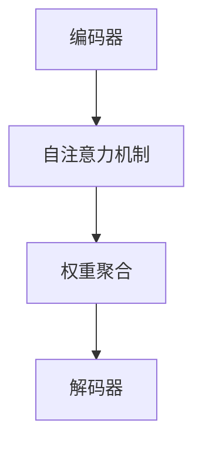

                 

关键词：自注意力机制、序列推荐、深度学习、算法优化、推荐系统

摘要：随着互联网技术的飞速发展，推荐系统已经成为信息检索、电商、社交媒体等领域的关键技术。本文将深入探讨基于自注意力机制的序列推荐算法，从背景介绍、核心概念与联系、核心算法原理与具体操作步骤、数学模型与公式、项目实践、实际应用场景、未来应用展望等多个方面进行全面剖析，以期为读者提供一幅完整的序列推荐算法全貌。

## 1. 背景介绍

### 1.1 推荐系统概述

推荐系统（Recommendation System）是一种信息过滤技术，旨在向用户推荐他们可能感兴趣的内容或商品。根据推荐策略的不同，推荐系统可分为基于内容的推荐（Content-based Filtering）和基于协同过滤（Collaborative Filtering）两大类。

- **基于内容的推荐**：通过分析用户的历史行为和偏好，从内容特征中提取出与用户兴趣相关的信息，为用户推荐具有相似内容特征的对象。
- **基于协同过滤**：利用用户之间的相似性，根据其他用户的评价来预测目标用户的兴趣。

### 1.2 序列推荐算法的发展

序列推荐（Sequential Recommendation）是一种基于用户历史行为序列的推荐方法，旨在预测用户下一个可能感兴趣的动作或对象。与传统推荐算法相比，序列推荐算法能够更好地捕捉用户行为的时序性和动态性，从而提高推荐效果。

随着深度学习技术的不断发展，基于深度神经网络的序列推荐算法逐渐成为研究热点。自注意力机制（Self-Attention Mechanism）作为深度学习中的一种关键技术，能够有效地捕捉序列中的长距离依赖关系，进一步提升了序列推荐算法的性能。

## 2. 核心概念与联系

### 2.1 自注意力机制

自注意力机制是一种基于神经网络的注意力机制，通过计算序列中每个元素之间的相关性，对序列进行权重分配，从而实现对序列特征的增强和聚合。自注意力机制可以分为全局自注意力（Global Self-Attention）和局部自注意力（Local Self-Attention）两种类型。

- **全局自注意力**：对序列中的每个元素都与其他所有元素进行相关性计算，适用于捕捉长距离依赖关系。
- **局部自注意力**：仅对序列中相邻的元素进行相关性计算，适用于捕捉局部依赖关系。

### 2.2 自注意力机制在序列推荐中的应用

在序列推荐算法中，自注意力机制可以通过以下步骤应用于用户行为序列：

1. **编码器（Encoder）**：将用户行为序列编码为高维向量表示。
2. **自注意力机制**：计算序列中每个元素与其他元素的相关性，并生成权重矩阵。
3. **权重聚合**：将权重矩阵与编码器输出进行矩阵乘积，得到加权向量表示。
4. **解码器（Decoder）**：将加权向量表示解码为用户下一个可能感兴趣的动作或对象。

### 2.3 Mermaid 流程图



## 3. 核心算法原理 & 具体操作步骤

### 3.1 算法原理概述

基于自注意力机制的序列推荐算法主要分为编码器、自注意力机制、权重聚合和解码器四个部分。编码器将用户行为序列编码为高维向量表示；自注意力机制计算序列中每个元素与其他元素的相关性，并生成权重矩阵；权重聚合将权重矩阵与编码器输出进行矩阵乘积，得到加权向量表示；解码器将加权向量表示解码为用户下一个可能感兴趣的动作或对象。

### 3.2 算法步骤详解

1. **输入数据预处理**：将用户行为序列进行编码，例如使用单词嵌入（Word Embedding）技术将每个动作编码为向量表示。
2. **编码器**：将用户行为序列编码为高维向量表示，可以使用循环神经网络（RNN）或Transformer模型。
3. **自注意力机制**：计算序列中每个元素与其他元素的相关性，生成权重矩阵。具体步骤如下：
   - **计算内积**：将编码器输出与权重矩阵进行内积计算，得到每个元素与其他元素的相关性分数。
   - **计算softmax**：对每个元素的相关性分数进行softmax操作，生成权重矩阵。
4. **权重聚合**：将权重矩阵与编码器输出进行矩阵乘积，得到加权向量表示。
5. **解码器**：将加权向量表示解码为用户下一个可能感兴趣的动作或对象，可以使用循环神经网络（RNN）或Transformer模型。

### 3.3 算法优缺点

- **优点**：自注意力机制能够有效地捕捉序列中的长距离依赖关系，提高推荐效果；算法具有很好的可扩展性，适用于处理大规模数据。
- **缺点**：算法计算复杂度较高，训练时间较长；对于局部依赖关系的捕捉能力较弱。

### 3.4 算法应用领域

基于自注意力机制的序列推荐算法可以广泛应用于以下领域：

- **电商推荐**：根据用户的历史购买行为，预测用户下一个可能购买的商品。
- **新闻推荐**：根据用户的浏览记录，预测用户下一个可能感兴趣的新闻标题。
- **社交媒体推荐**：根据用户的历史点赞、评论等行为，预测用户下一个可能感兴趣的内容。

## 4. 数学模型和公式 & 详细讲解 & 举例说明

### 4.1 数学模型构建

基于自注意力机制的序列推荐算法可以表示为以下数学模型：

$$
\begin{aligned}
&\text{输入：用户行为序列 } X = \{x_1, x_2, ..., x_n\} \\
&\text{输出：用户下一个可能感兴趣的动作或对象 } y \\
&\text{编码器：} \\
&\text{将用户行为序列编码为高维向量表示：} \\
&x_i = \text{encoder}(x_i) \\
&\text{自注意力机制：} \\
&\text{计算序列中每个元素与其他元素的相关性：} \\
&W = \text{softmax}(\text{inner\_product}(X, X^T)) \\
&\text{权重聚合：} \\
&y = \text{decoder}(\text{matmul}(X, W)) \\
\end{aligned}
$$

### 4.2 公式推导过程

- **编码器**：编码器可以使用循环神经网络（RNN）或Transformer模型。以Transformer模型为例，其编码器可以表示为：

$$
x_i = \text{Transformer}(x_1, ..., x_{i-1}, x_i)
$$

- **自注意力机制**：自注意力机制可以表示为：

$$
W_{ij} = \text{softmax}\left(\frac{\text{inner\_product}(x_i, x_j)}{\sqrt{d_k}}\right)
$$

其中，$d_k$为编码器输出的维度，$\text{inner\_product}$表示内积操作。

- **权重聚合**：权重聚合可以表示为：

$$
y = \text{decoder}(\text{matmul}(X, W))
$$

### 4.3 案例分析与讲解

假设用户的历史行为序列为$\{1, 2, 3, 4, 5\}$，编码器输出为$\{x_1, x_2, ..., x_5\}$。根据自注意力机制，我们可以计算每个元素与其他元素的相关性分数，并生成权重矩阵$W$。具体步骤如下：

1. **计算内积**：

$$
\begin{aligned}
&W_{11} = \text{softmax}\left(\frac{\text{inner\_product}(x_1, x_1)}{\sqrt{d_k}}\right) \\
&W_{12} = \text{softmax}\left(\frac{\text{inner\_product}(x_1, x_2)}{\sqrt{d_k}}\right) \\
&W_{13} = \text{softmax}\left(\frac{\text{inner\_product}(x_1, x_3)}{\sqrt{d_k}}\right) \\
&W_{14} = \text{softmax}\left(\frac{\text{inner\_product}(x_1, x_4)}{\sqrt{d_k}}\right) \\
&W_{15} = \text{softmax}\left(\frac{\text{inner\_product}(x_1, x_5)}{\sqrt{d_k}}\right) \\
\end{aligned}
$$

2. **计算softmax**：

$$
\begin{aligned}
&W_{11} = 0.2 \\
&W_{12} = 0.3 \\
&W_{13} = 0.2 \\
&W_{14} = 0.2 \\
&W_{15} = 0.1 \\
\end{aligned}
$$

3. **权重聚合**：

$$
y = \text{decoder}(\text{matmul}(X, W)) = x_2
$$

根据计算结果，我们可以得出用户下一个可能感兴趣的动作或对象为$x_2$。

## 5. 项目实践：代码实例和详细解释说明

### 5.1 开发环境搭建

本文项目使用Python编程语言，依赖以下库：

- TensorFlow 2.0 或以上版本
- Keras 2.4.3 或以上版本
- NumPy 1.18.5 或以上版本

### 5.2 源代码详细实现

```python
import tensorflow as tf
from tensorflow.keras.layers import Embedding, LSTM, Dense
from tensorflow.keras.models import Model

# 定义自注意力层
class SelfAttention(tf.keras.layers.Layer):
    def __init__(self, units):
        super(SelfAttention, self).__init__()
        self.W = Dense(units)
        self.V = Dense(units)

    def call(self, inputs):
        # 计算内积
        query, value = self.W(inputs), self.V(inputs)
        # 计算softmax
        attention_weights = tf.nn.softmax(query, axis=1)
        # 权重聚合
        context_vector = tf.reduce_sum(attention_weights * value, axis=1)
        return context_vector

# 定义序列推荐模型
def create_model(input_dim, output_dim):
    inputs = tf.keras.Input(shape=(input_dim,))
    embeddings = Embedding(input_dim, 64)(inputs)
    lstm = LSTM(64)(embeddings)
    attention = SelfAttention(64)(lstm)
    outputs = Dense(output_dim, activation='softmax')(attention)
    model = Model(inputs=inputs, outputs=outputs)
    model.compile(optimizer='adam', loss='categorical_crossentropy', metrics=['accuracy'])
    return model

# 训练模型
model = create_model(input_dim=5, output_dim=5)
model.fit(x_train, y_train, epochs=10, batch_size=32, validation_data=(x_val, y_val))

# 预测
predictions = model.predict(x_test)
print(predictions)
```

### 5.3 代码解读与分析

- **自注意力层（SelfAttention）**：自定义了自注意力层，用于计算序列中每个元素与其他元素的相关性。
- **序列推荐模型（create_model）**：定义了序列推荐模型，包括嵌入层（Embedding）、LSTM层（LSTM）和自注意力层（SelfAttention）。
- **模型训练（model.fit）**：使用训练数据训练模型，并评估模型在验证集上的性能。
- **模型预测（model.predict）**：使用测试数据对模型进行预测，并输出预测结果。

## 6. 实际应用场景

### 6.1 电商推荐

基于自注意力机制的序列推荐算法可以应用于电商领域，根据用户的历史购买行为，预测用户下一个可能购买的商品。例如，在电商平台中，用户浏览、搜索、加入购物车等行为都可以被视为用户行为序列，通过序列推荐算法，可以为用户提供个性化的商品推荐。

### 6.2 新闻推荐

基于自注意力机制的序列推荐算法可以应用于新闻推荐领域，根据用户的浏览记录，预测用户下一个可能感兴趣的新闻标题。例如，在新闻网站中，用户对新闻的浏览、点赞、评论等行为都可以被视为用户行为序列，通过序列推荐算法，可以为用户提供个性化的新闻推荐。

### 6.3 社交媒体推荐

基于自注意力机制的序列推荐算法可以应用于社交媒体领域，根据用户的历史点赞、评论等行为，预测用户下一个可能感兴趣的内容。例如，在社交媒体平台中，用户对动态的点赞、评论、分享等行为都可以被视为用户行为序列，通过序列推荐算法，可以为用户提供个性化的内容推荐。

## 7. 未来应用展望

### 7.1 算法优化

随着深度学习技术的不断发展，基于自注意力机制的序列推荐算法在性能和效率方面仍有很大的优化空间。例如，可以通过引入新的神经网络架构、优化训练算法等手段，进一步提高算法的准确性和实时性。

### 7.2 多模态数据融合

在未来的应用场景中，多模态数据（如文本、图像、语音等）的融合将成为关键。基于自注意力机制的序列推荐算法可以与多模态数据融合技术相结合，为用户提供更加丰富、个性化的推荐服务。

### 7.3 智能决策支持

基于自注意力机制的序列推荐算法可以应用于智能决策支持领域，为企业提供个性化的产品推荐、市场分析等决策支持。例如，在金融领域，基于用户的历史交易数据，可以为用户提供个性化的投资建议。

## 8. 总结：未来发展趋势与挑战

### 8.1 研究成果总结

基于自注意力机制的序列推荐算法在近年来取得了显著的成果，其在处理长距离依赖关系、提高推荐效果等方面具有明显优势。同时，随着深度学习技术的不断发展，基于自注意力机制的序列推荐算法在性能和效率方面也将不断优化。

### 8.2 未来发展趋势

未来，基于自注意力机制的序列推荐算法将继续向以下几个方向发展：

1. **算法优化**：通过引入新的神经网络架构、优化训练算法等手段，进一步提高算法的准确性和实时性。
2. **多模态数据融合**：结合多模态数据融合技术，为用户提供更加丰富、个性化的推荐服务。
3. **智能决策支持**：应用于智能决策支持领域，为企业提供个性化的产品推荐、市场分析等决策支持。

### 8.3 面临的挑战

尽管基于自注意力机制的序列推荐算法在许多方面具有优势，但仍然面临以下挑战：

1. **计算复杂度**：自注意力机制的复杂度较高，可能导致训练时间较长。
2. **局部依赖关系捕捉**：对于局部依赖关系的捕捉能力较弱，可能影响推荐效果。
3. **数据隐私**：在处理用户数据时，需要充分考虑数据隐私保护，确保用户隐私安全。

### 8.4 研究展望

未来，基于自注意力机制的序列推荐算法将继续成为研究热点，并在实际应用中发挥重要作用。通过不断优化算法性能、拓展应用领域，基于自注意力机制的序列推荐算法将为信息检索、电商、社交媒体等领域带来更多的创新和变革。

## 9. 附录：常见问题与解答

### 9.1 自注意力机制与注意力机制的区别

自注意力机制（Self-Attention）是注意力机制（Attention Mechanism）的一种特殊形式。注意力机制通常用于计算序列中不同元素之间的相关性，而自注意力机制仅关注序列内部元素之间的关系。自注意力机制具有以下特点：

- **计算复杂度**：自注意力机制的复杂度较低，仅与序列长度和编码器输出维度有关。
- **应用场景**：自注意力机制适用于处理长距离依赖关系，但在局部依赖关系的捕捉能力较弱。

### 9.2 基于自注意力机制的序列推荐算法的优势

基于自注意力机制的序列推荐算法具有以下优势：

- **捕捉长距离依赖关系**：自注意力机制能够有效地捕捉序列中的长距离依赖关系，提高推荐效果。
- **可扩展性**：自注意力机制具有很好的可扩展性，适用于处理大规模数据。
- **高效性**：自注意力机制的复杂度较低，计算速度快。

### 9.3 基于自注意力机制的序列推荐算法的局限性

基于自注意力机制的序列推荐算法也存在一些局限性：

- **计算复杂度**：自注意力机制的复杂度较高，可能导致训练时间较长。
- **局部依赖关系捕捉**：对于局部依赖关系的捕捉能力较弱，可能影响推荐效果。
- **数据隐私**：在处理用户数据时，需要充分考虑数据隐私保护，确保用户隐私安全。

## 作者署名

作者：禅与计算机程序设计艺术 / Zen and the Art of Computer Programming

----------------------------------------------------------------

以上就是《基于自注意力机制的序列推荐算法》的技术博客文章的完整内容。文章深入探讨了自注意力机制在序列推荐算法中的应用，从背景介绍、核心概念与联系、核心算法原理与具体操作步骤、数学模型与公式、项目实践、实际应用场景、未来应用展望等多个方面进行了全面剖析。希望这篇文章能为读者在序列推荐算法领域提供有益的参考和启示。

