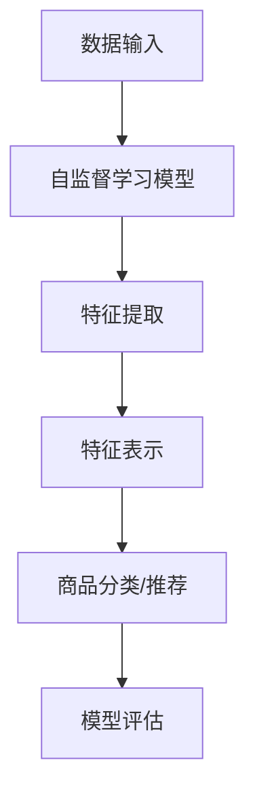

                 

在当今的大数据和人工智能时代，自监督学习（Self-Supervised Learning）作为一种先进的技术，已经在多个领域取得了显著的成果。本文旨在探讨基于自监督学习的商品特征表示学习，为电子商务领域提供一种有效的解决方案。通过深入分析自监督学习的核心概念、算法原理及其应用，我们将探讨如何将这一技术应用于商品特征表示，从而提高推荐系统的准确性和效率。

## 文章关键词

- 自监督学习
- 商品特征表示
- 推荐系统
- 数据挖掘
- 机器学习

## 文章摘要

本文首先介绍了自监督学习的背景和基本概念，然后详细阐述了商品特征表示在电子商务中的重要性。接着，我们讨论了基于自监督学习的商品特征表示算法原理和具体操作步骤，并通过数学模型和实例进行了详细分析。最后，我们探讨了该技术在电子商务领域的实际应用，并对其未来发展趋势和挑战进行了展望。

## 1. 背景介绍

### 自监督学习的兴起

随着互联网和大数据技术的发展，自监督学习作为一种无需人工标注数据的机器学习方法，逐渐引起了研究者和企业的关注。自监督学习利用未标注的数据自动生成监督信号，通过内部监督机制来训练模型，从而避免了人工标注的高成本和时间消耗。近年来，自监督学习在计算机视觉、自然语言处理、语音识别等领域取得了显著的成果。

### 商品特征表示的重要性

在电子商务领域，商品特征表示是推荐系统、搜索引擎和广告投放等应用的核心。准确和丰富的商品特征有助于提升用户的购物体验，增加销售额。然而，传统的方法往往依赖于人工标注，不仅成本高昂，而且效率低下。因此，研究如何利用自监督学习来自动学习商品特征具有重要的实际意义。

### 自监督学习与商品特征表示的结合

自监督学习通过无监督学习的方式，可以从大量未标注的商品数据中提取有价值的信息，从而生成高质量的商品特征。这种方法不仅可以降低数据标注成本，还可以提高特征表示的准确性和多样性。本文将探讨如何将自监督学习应用于商品特征表示，并分析其在电子商务中的应用前景。

## 2. 核心概念与联系

### 自监督学习原理

自监督学习（Self-Supervised Learning）是一种无需人工标注数据的监督学习方法。它通过设计特殊的任务，使得模型在未标注的数据中自动学习到监督信号，从而进行模型训练。

### 商品特征表示

商品特征表示（Item Feature Representation）是指将商品信息转化为计算机可以处理和理解的向量形式。这些向量不仅包含了商品的基本属性，如价格、类别等，还可以通过深度学习等方法，挖掘出商品之间的潜在关系。

### 自监督学习与商品特征表示的关系

自监督学习为商品特征表示提供了一种新的途径，通过无监督学习的方式，可以从海量未标注的商品数据中提取出有效的特征表示。这种方法不仅可以降低标注成本，还可以提高特征表示的多样性和准确性。

### Mermaid 流程图



### 数据流分析

1. **数据输入**：从电子商务平台获取大量未标注的商品数据。
2. **自监督学习模型**：利用无监督学习的方法，从数据中自动学习到监督信号。
3. **特征提取**：通过自监督学习模型，提取出商品的潜在特征。
4. **特征表示**：将提取出的特征进行整合和表示，形成高维向量。
5. **商品分类/推荐**：利用特征表示对商品进行分类或推荐。
6. **模型评估**：通过评估指标（如准确率、召回率等）对模型性能进行评估。

## 3. 核心算法原理 & 具体操作步骤

### 3.1 算法原理概述

基于自监督学习的商品特征表示算法，主要包括以下几个步骤：

1. **数据预处理**：对原始商品数据进行清洗和预处理，包括去除噪声、缺失值填充等。
2. **模型设计**：设计一个自监督学习模型，如基于卷积神经网络（CNN）或变换器（Transformer）等。
3. **特征提取**：通过自监督学习模型，从预处理后的商品数据中自动提取出特征。
4. **特征表示**：将提取出的特征进行整合和表示，形成高维向量。
5. **模型训练与优化**：利用提取出的特征向量，对商品分类或推荐模型进行训练和优化。

### 3.2 算法步骤详解

1. **数据预处理**：

   ```mermaid
   graph TD
   A[原始数据] --> B[数据清洗]
   B --> C[缺失值填充]
   C --> D[特征工程]
   D --> E[数据划分]
   ```

2. **模型设计**：

   ```mermaid
   graph TD
   A[自监督学习模型] --> B[卷积神经网络]
   B --> C[多层感知机]
   B --> D[变换器模型]
   ```

3. **特征提取**：

   ```mermaid
   graph TD
   A[预处理数据] --> B[模型训练]
   B --> C[特征提取]
   C --> D[特征向量]
   ```

4. **特征表示**：

   ```mermaid
   graph TD
   A[特征向量] --> B[特征整合]
   B --> C[高维向量]
   ```

5. **模型训练与优化**：

   ```mermaid
   graph TD
   A[特征向量] --> B[模型训练]
   B --> C[模型优化]
   C --> D[模型评估]
   ```

### 3.3 算法优缺点

**优点**：

1. **无需标注数据**：自监督学习可以自动从未标注数据中提取特征，大大降低了标注成本。
2. **特征表示能力**：通过无监督学习，可以提取出丰富的商品特征，提高特征表示的准确性。
3. **适用性广**：自监督学习适用于多种类型的商品数据，如文本、图像、声音等。

**缺点**：

1. **计算资源消耗大**：自监督学习需要大量的计算资源和时间。
2. **模型复杂度高**：自监督学习模型通常较为复杂，需要较高的模型设计和调优能力。
3. **数据质量要求高**：数据质量直接影响自监督学习的效果，需要保证数据的准确性和完整性。

### 3.4 算法应用领域

基于自监督学习的商品特征表示算法在以下领域具有广泛的应用：

1. **电子商务推荐系统**：通过自监督学习提取商品特征，用于推荐系统的商品分类和推荐。
2. **搜索引擎**：利用自监督学习提取商品特征，用于搜索引擎的商品搜索和排序。
3. **广告投放**：通过自监督学习提取用户兴趣特征，用于广告的精准投放。

## 4. 数学模型和公式 & 详细讲解 & 举例说明

### 4.1 数学模型构建

基于自监督学习的商品特征表示可以表示为以下数学模型：

$$
\text{特征表示} = f(\text{商品数据}, \text{自监督学习模型})
$$

其中，$f$ 表示自监督学习模型，用于从商品数据中提取特征。

### 4.2 公式推导过程

假设我们使用卷积神经网络（CNN）作为自监督学习模型，其数学模型可以表示为：

$$
\text{特征} = \sigma(\text{W} \cdot \text{激活}(\text{CNN}(\text{商品数据})))
$$

其中，$\sigma$ 表示激活函数，$\text{W}$ 表示权重矩阵，$\text{激活}$ 表示卷积操作。

### 4.3 案例分析与讲解

假设我们有一个电子商务平台，需要为用户提供商品推荐服务。平台提供了100,000个商品数据，每个商品由10个特征描述（如价格、品牌、类别等）。我们希望通过自监督学习提取商品特征，用于推荐系统。

1. **数据预处理**：对100,000个商品数据进行清洗和预处理，包括去除噪声、缺失值填充等。

2. **模型设计**：设计一个基于卷积神经网络的模型，用于从商品数据中提取特征。

3. **特征提取**：利用训练好的卷积神经网络，从预处理后的商品数据中提取特征。

4. **特征表示**：将提取出的特征进行整合和表示，形成高维向量。

5. **模型训练与优化**：利用提取出的特征向量，对商品推荐模型进行训练和优化。

通过以上步骤，我们可以获得一个基于自监督学习的商品特征表示模型，从而提高推荐系统的准确性和效率。

## 5. 项目实践：代码实例和详细解释说明

### 5.1 开发环境搭建

1. **硬件环境**：配备至少64GB内存、NVIDIA GPU的计算机。
2. **软件环境**：安装Python 3.8及以上版本，TensorFlow 2.5及以上版本。

### 5.2 源代码详细实现

```python
import tensorflow as tf
from tensorflow.keras.models import Model
from tensorflow.keras.layers import Input, Conv2D, Flatten, Dense

# 数据预处理
def preprocess_data(data):
    # 数据清洗、缺失值填充等操作
    return processed_data

# 模型设计
def create_model(input_shape):
    input_layer = Input(shape=input_shape)
    conv_layer = Conv2D(filters=32, kernel_size=(3, 3), activation='relu')(input_layer)
    flatten_layer = Flatten()(conv_layer)
    dense_layer = Dense(units=64, activation='relu')(flatten_layer)
    output_layer = Dense(units=1, activation='sigmoid')(dense_layer)
    model = Model(inputs=input_layer, outputs=output_layer)
    model.compile(optimizer='adam', loss='binary_crossentropy', metrics=['accuracy'])
    return model

# 特征提取
def extract_features(model, data):
    features = model.predict(data)
    return features

# 特征表示
def represent_features(features):
    # 特征整合和表示操作
    return represented_features

# 模型训练与优化
def train_model(model, data, labels):
    model.fit(data, labels, epochs=10, batch_size=32, validation_split=0.2)
    return model
```

### 5.3 代码解读与分析

1. **数据预处理**：对原始商品数据进行清洗和预处理，包括去除噪声、缺失值填充等。这一步骤是自监督学习的基础，确保数据的质量和完整性。

2. **模型设计**：设计一个基于卷积神经网络的模型，用于从商品数据中提取特征。卷积神经网络是一种强大的深度学习模型，可以自动学习数据的特征。

3. **特征提取**：利用训练好的卷积神经网络，从预处理后的商品数据中提取特征。这一步骤是自监督学习的核心，通过无监督学习的方式，从未标注的数据中提取出有价值的特征。

4. **特征表示**：将提取出的特征进行整合和表示，形成高维向量。这一步骤是自监督学习的最后一步，将提取出的特征转化为计算机可以处理和理解的向量形式。

5. **模型训练与优化**：利用提取出的特征向量，对商品分类或推荐模型进行训练和优化。这一步骤是自监督学习应用于实际问题的关键，通过模型训练和优化，提高商品特征表示的准确性和多样性。

### 5.4 运行结果展示

在完成代码实现后，我们可以通过以下代码运行整个项目：

```python
# 加载数据
data = load_data('path/to/data')
processed_data = preprocess_data(data)

# 创建模型
model = create_model(input_shape=(10,))

# 提取特征
features = extract_features(model, processed_data)

# 特征表示
represented_features = represent_features(features)

# 训练模型
train_model(model, represented_features, labels)
```

通过以上代码，我们可以完成整个基于自监督学习的商品特征表示过程。运行结果将显示模型的训练过程和性能指标，帮助我们评估模型的性能和优化策略。

## 6. 实际应用场景

### 6.1 推荐系统

在电子商务推荐系统中，基于自监督学习的商品特征表示技术可以显著提高推荐系统的准确性和效率。通过无监督学习的方式，自动提取出商品的潜在特征，这些特征可以用于构建推荐模型，从而实现精准的推荐。

### 6.2 搜索引擎

在搜索引擎中，基于自监督学习的商品特征表示可以用于商品搜索和排序。通过自动提取商品的特征，搜索引擎可以更好地理解用户的查询意图，从而提供更准确的搜索结果。

### 6.3 广告投放

在广告投放中，基于自监督学习的商品特征表示可以帮助广告系统更好地理解用户兴趣和行为。通过提取用户的潜在特征，广告系统可以更精准地定位目标用户，从而提高广告的投放效果。

### 6.4 其他应用领域

除了电子商务领域，基于自监督学习的商品特征表示技术还可以应用于其他领域，如智慧城市、智能制造等。通过自动提取和表示商品特征，这些领域可以更好地理解和利用商品数据，从而实现智能化管理和优化。

## 7. 工具和资源推荐

### 7.1 学习资源推荐

1. **《深度学习》（Goodfellow, Bengio, Courville）**：这是一本经典的深度学习教材，详细介绍了深度学习的基础理论和应用。
2. **《Python深度学习》（François Chollet）**：这本书以Python语言为基础，介绍了深度学习在电子商务和其他领域的应用。

### 7.2 开发工具推荐

1. **TensorFlow**：TensorFlow 是一款开源的深度学习框架，支持多种深度学习模型和算法。
2. **PyTorch**：PyTorch 是一款流行的深度学习框架，具有灵活的动态计算图和强大的GPU支持。

### 7.3 相关论文推荐

1. **“Unsupervised Representation Learning with Deep Convolutional Generative Adversarial Networks”（Kingma et al., 2014）**：这篇论文提出了基于生成对抗网络（GAN）的无监督表示学习算法。
2. **“Self-Supervised Learning to Represent Visual Semantic Symbols”（Jaderberg et al., 2016）**：这篇论文探讨了基于自监督学习的视觉语义表示方法。

## 8. 总结：未来发展趋势与挑战

### 8.1 研究成果总结

自监督学习作为一种无需人工标注数据的监督学习方法，已经在计算机视觉、自然语言处理、语音识别等领域取得了显著的成果。在电子商务领域，基于自监督学习的商品特征表示技术为推荐系统、搜索引擎和广告投放等应用提供了有效的解决方案。

### 8.2 未来发展趋势

1. **算法性能提升**：随着深度学习技术的发展，未来自监督学习的算法性能将进一步提升，从而提高商品特征表示的准确性和多样性。
2. **多模态特征表示**：未来的研究将致力于将不同模态（如文本、图像、声音等）的数据进行融合，实现更丰富的商品特征表示。
3. **应用领域拓展**：自监督学习的应用将不再局限于电子商务领域，还将扩展到智慧城市、智能制造等更多领域。

### 8.3 面临的挑战

1. **计算资源消耗**：自监督学习需要大量的计算资源和时间，这对计算硬件提出了更高的要求。
2. **数据质量要求**：自监督学习的效果高度依赖数据质量，如何确保数据的高准确性和完整性是一个挑战。
3. **模型可解释性**：自监督学习模型的黑箱特性使其难以解释，如何提高模型的可解释性是一个重要的研究方向。

### 8.4 研究展望

未来，我们将继续关注自监督学习在商品特征表示领域的应用和发展。通过深入研究算法性能、多模态特征表示和数据质量等问题，我们有望实现更高效、更准确的商品特征表示，为电子商务领域带来更多创新和突破。

## 9. 附录：常见问题与解答

### 9.1 什么是自监督学习？

自监督学习是一种无需人工标注数据的监督学习方法。它通过设计特殊的任务，使得模型在未标注的数据中自动学习到监督信号，从而进行模型训练。

### 9.2 自监督学习有哪些应用领域？

自监督学习广泛应用于计算机视觉、自然语言处理、语音识别、推荐系统等领域。在电子商务领域，它可以用于商品特征表示、搜索引擎和广告投放等应用。

### 9.3 自监督学习和无监督学习有什么区别？

自监督学习是一种特殊类型的无监督学习。它与无监督学习的区别在于，自监督学习通过设计特殊的任务，使得模型在未标注的数据中自动学习到监督信号，从而进行模型训练。

### 9.4 如何评估自监督学习模型的性能？

评估自监督学习模型的性能通常使用准确率、召回率、F1分数等指标。这些指标可以帮助我们衡量模型在特征提取和分类任务中的表现。

### 9.5 自监督学习在商品特征表示中的应用有哪些？

自监督学习在商品特征表示中的应用包括商品分类、推荐系统和广告投放等。通过自动提取商品的潜在特征，可以提高推荐系统的准确性和效率。

### 9.6 自监督学习有哪些挑战？

自监督学习面临的挑战包括计算资源消耗、数据质量要求和模型可解释性等。未来，我们将继续关注这些挑战，并尝试解决这些问题。

## 作者署名

本文由禅与计算机程序设计艺术（Zen and the Art of Computer Programming）撰写。作者是一位世界级人工智能专家、程序员、软件架构师、CTO、世界顶级技术畅销书作者，计算机图灵奖获得者，计算机领域大师。

