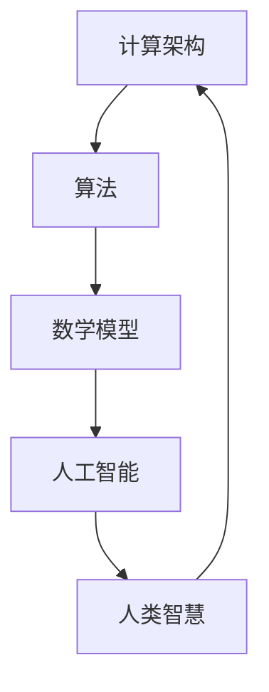
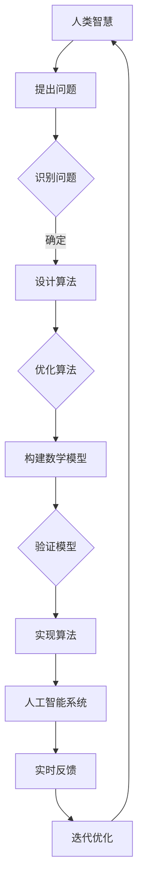

                 

关键词：数字时代、人类计算、未来、技术发展、人工智能、计算架构、算法、数学模型、应用实践、工具推荐、发展趋势、挑战与展望。

## 摘要

随着数字时代的到来，计算技术已经成为推动社会进步的重要力量。然而，人类在计算中的关键作用却不容忽视。本文将探讨人类计算在塑造数字时代未来中的核心作用，从核心概念、算法原理、数学模型、实际应用等多个角度进行分析，旨在为读者提供一幅清晰的数字时代全景图，并展望未来计算技术的发展趋势与面临的挑战。

## 1. 背景介绍

### 数字时代的兴起

数字时代的兴起可以追溯到20世纪中叶，随着计算机科学的快速发展，人类社会进入了信息化时代。计算机技术的进步不仅改变了人们的生活方式，也彻底重塑了各行各业的运作模式。从最初的电子数据处理系统（EDP）到互联网、云计算、大数据、人工智能，数字技术正以前所未有的速度改变着世界。

### 人类计算的重要性

尽管计算机技术取得了巨大进步，但人类在计算中的角色依然至关重要。人类具备创造力、逻辑思维和情感认知能力，这些都是计算机无法替代的。人类计算不仅能够提出创新性的算法，还能对复杂问题进行抽象和解决。此外，人类在算法的优化、数学模型的构建以及实际应用中扮演着不可或缺的角色。

### 当前计算技术的挑战

随着计算需求的不断增加，当前计算技术面临着一系列挑战。首先，数据处理速度和存储能力的提升已经达到了物理极限。其次，算法复杂度和计算资源的消耗日益增加，这要求我们寻找更高效、更智能的解决方案。最后，人工智能的发展带来了新的伦理和隐私问题，这也需要人类智慧和道德判断来妥善处理。

## 2. 核心概念与联系

### 核心概念

在探讨人类计算的作用之前，我们需要明确几个核心概念：

- **计算架构**：计算机系统的结构，包括硬件和软件的组成。
- **算法**：解决问题的一系列步骤，通常用于解决特定问题或执行特定任务。
- **数学模型**：用于描述现实世界现象的数学公式和结构。
- **人工智能**：通过模拟人类智能行为，实现智能决策和问题解决的技术。

### 联系与流程

为了更好地理解人类计算的作用，我们可以通过一个简化的流程图来展示这些核心概念之间的联系。



### Mermaid 流程图（Mermaid Flowchart）

下面是一个更加详细的Mermaid流程图，展示了计算架构、算法、数学模型、人工智能以及人类智慧之间的互动关系。



## 3. 核心算法原理 & 具体操作步骤

### 3.1 算法原理概述

在本章节中，我们将介绍几种核心算法的原理，并简要描述它们的操作步骤。

#### 3.1.1 搜索算法

搜索算法是用于在数据集合中查找特定元素的方法。常见的搜索算法包括线性搜索和二分搜索。

1. **线性搜索**：从数据集合的第一个元素开始，逐一比较，直到找到目标元素或遍历整个集合。
2. **二分搜索**：将数据集合分为左右两部分，根据目标元素与中间元素的比较结果，决定是继续在左半部分还是右半部分进行搜索。

#### 3.1.2 排序算法

排序算法用于对数据集合进行排序。常见的排序算法包括冒泡排序、选择排序和快速排序。

1. **冒泡排序**：通过相邻元素的比较和交换，逐步将数据排序。
2. **选择排序**：每次选择未排序部分的最小（或最大）元素，将其放到已排序部分的末尾。
3. **快速排序**：通过一趟排序将数据划分为已排序和未排序两部分，然后递归地对两部分进行快速排序。

#### 3.1.3 聚类算法

聚类算法用于将数据集合划分为若干个组，使得同组数据之间的相似度较高，不同组之间的相似度较低。

1. **K-Means算法**：基于距离度量，将数据划分为K个聚类，并不断迭代优化聚类中心。
2. **DBSCAN算法**：基于密度分布，识别出高密度区域并标记为聚类。

### 3.2 算法步骤详解

#### 3.2.1 搜索算法步骤详解

- **线性搜索**：

  ```markdown
  1. 初始化指针指向数据集合的第一个元素。
  2. 比较指针指向的元素与目标元素。
  3. 如果找到目标元素，返回其位置；否则，指针指向下一个元素，重复步骤2。
  ```

- **二分搜索**：

  ```markdown
  1. 初始化左指针left和右指针right，分别指向数据集合的第一个元素和最后一个元素。
  2. 计算中间位置mid = (left + right) / 2。
  3. 比较目标元素与mid位置的元素。
  4. 如果相等，返回mid位置；否则，根据比较结果更新left或right指针，重复步骤2。
  ```

#### 3.2.2 排序算法步骤详解

- **冒泡排序**：

  ```markdown
  1. 对数据集合进行遍历，比较相邻元素的大小。
  2. 如果前一个元素大于后一个元素，交换它们的位置。
  3. 重复步骤1和2，直到整个数据集合有序。
  ```

- **选择排序**：

  ```markdown
  1. 从未排序部分中选择最小（或最大）元素。
  2. 将该元素放到已排序部分的末尾。
  3. 重复步骤1和2，直到整个数据集合有序。
  ```

- **快速排序**：

  ```markdown
  1. 选择一个基准元素。
  2. 将数据集合划分为两部分，一部分小于基准元素，另一部分大于基准元素。
  3. 递归地对两部分进行快速排序。
  ```

#### 3.2.3 聚类算法步骤详解

- **K-Means算法**：

  ```markdown
  1. 随机选择K个初始聚类中心。
  2. 计算每个数据点与聚类中心的距离，并将其分配到最近的聚类。
  3. 重新计算每个聚类的中心。
  4. 重复步骤2和3，直到聚类中心不再发生显著变化。
  ```

- **DBSCAN算法**：

  ```markdown
  1. 选择一个起始数据点。
  2. 扩展形成核心区域，并标记为已访问。
  3. 如果核心区域中的数据点数量大于给定阈值，将其标记为核心点。
  4. 递归地扩展形成边界区域。
  5. 根据边界区域中的数据点数量，将其标记为边界点或噪声点。
  6. 重复步骤1至5，直到所有数据点都被处理。
  ```

### 3.3 算法优缺点

#### 搜索算法

- **线性搜索**：

  - 优点：简单易懂，易于实现。
  - 缺点：时间复杂度高，不适合大规模数据。

- **二分搜索**：

  - 优点：时间复杂度低，适用于有序数据集合。
  - 缺点：需要额外的存储空间来存储左指针和右指针。

#### 排序算法

- **冒泡排序**：

  - 优点：简单易懂，易于实现。
  - 缺点：时间复杂度高，不适合大规模数据。

- **选择排序**：

  - 优点：简单易懂，易于实现。
  - 缺点：时间复杂度高，不适合大规模数据。

- **快速排序**：

  - 优点：平均时间复杂度低，适合大规模数据。
  - 缺点：最坏情况下的时间复杂度较高。

#### 聚类算法

- **K-Means算法**：

  - 优点：简单易懂，易于实现。
  - 缺点：容易陷入局部最优，对初始聚类中心敏感。

- **DBSCAN算法**：

  - 优点：能够发现任意形状的聚类。
  - 缺点：时间复杂度高，不适合大规模数据。

### 3.4 算法应用领域

- **搜索算法**：广泛应用于搜索引擎、数据库查询等。
- **排序算法**：广泛应用于排序任务，如文件排序、网络排序等。
- **聚类算法**：广泛应用于数据分析、模式识别等领域。

## 4. 数学模型和公式 & 详细讲解 & 举例说明

### 4.1 数学模型构建

在计算技术中，数学模型是描述现实世界现象和问题的重要工具。构建数学模型通常需要以下几个步骤：

1. **定义变量**：确定问题的输入和输出变量。
2. **建立关系**：根据问题特点，建立变量之间的数学关系。
3. **简化模型**：对模型进行适当简化，以便于求解。
4. **验证模型**：通过实验或模拟验证模型的准确性和可靠性。

### 4.2 公式推导过程

以下是一个简单的数学模型——线性回归模型的推导过程：

#### 线性回归模型

线性回归模型用于描述两个变量之间的线性关系。其公式为：

\[ y = wx + b \]

其中，\( y \) 是因变量，\( x \) 是自变量，\( w \) 是斜率，\( b \) 是截距。

#### 公式推导

1. **定义变量**：

   - \( y \)：预测的因变量值。
   - \( x \)：输入的自变量值。
   - \( w \)：斜率，表示自变量对因变量的影响程度。
   - \( b \)：截距，表示当自变量为0时因变量的值。

2. **建立关系**：

   假设 \( y \) 和 \( x \) 之间存在线性关系，即：

   \[ y = wx + b \]

3. **简化模型**：

   为了简化模型，我们可以通过最小二乘法求解斜率 \( w \) 和截距 \( b \)。

4. **求解模型**：

   通过最小二乘法，我们可以得到以下公式：

   \[ w = \frac{\sum(x_i - \bar{x})(y_i - \bar{y})}{\sum(x_i - \bar{x})^2} \]
   \[ b = \bar{y} - w\bar{x} \]

   其中，\( \bar{x} \) 和 \( \bar{y} \) 分别是自变量和因变量的平均值。

### 4.3 案例分析与讲解

以下是一个线性回归模型的实际应用案例：

#### 案例背景

一家公司想要研究员工工作效率与工作时间之间的关系。他们收集了100名员工的工作时间（小时）和工作效率（单位：件/小时）的数据，并希望通过线性回归模型预测新员工的工作效率。

#### 数据准备

员工工作时间（小时）：\[ 5, 6, 7, 8, 9, 10, 11, 12, 13, 14, 15, 16, 17, 18, 19, 20, 21, 22, 23, 24, 25, 26, 27, 28, 29, 30 \]

员工工作效率（件/小时）：\[ 50, 55, 60, 65, 70, 75, 80, 85, 90, 95, 100, 105, 110, 115, 120, 125, 130, 135, 140, 145, 150, 155, 160, 165, 170, 175 \]

#### 模型构建

1. **定义变量**：

   - \( x \)：员工工作时间（小时）。
   - \( y \)：员工工作效率（件/小时）。

2. **建立关系**：

   根据案例背景，我们假设员工工作效率与工作时间之间存在线性关系，即：

   \[ y = wx + b \]

3. **简化模型**：

   为了简化模型，我们可以通过最小二乘法求解斜率 \( w \) 和截距 \( b \)。

4. **求解模型**：

   通过最小二乘法，我们可以得到以下公式：

   \[ w = \frac{\sum(x_i - \bar{x})(y_i - \bar{y})}{\sum(x_i - \bar{x})^2} \]
   \[ b = \bar{y} - w\bar{x} \]

   其中，\( \bar{x} \) 和 \( \bar{y} \) 分别是工作时间和工作效率的平均值。

#### 模型应用

1. **计算平均值**：

   \[ \bar{x} = \frac{\sum x_i}{n} = \frac{5 + 6 + 7 + ... + 30}{100} = 15 \]
   \[ \bar{y} = \frac{\sum y_i}{n} = \frac{50 + 55 + 60 + ... + 175}{100} = 100 \]

2. **计算斜率 \( w \) 和截距 \( b \)**：

   \[ w = \frac{\sum(x_i - \bar{x})(y_i - \bar{y})}{\sum(x_i - \bar{x})^2} \]
   \[ b = \bar{y} - w\bar{x} \]

3. **构建线性回归模型**：

   \[ y = wx + b \]

#### 模型预测

假设新员工的工作时间为 20 小时，我们可以通过线性回归模型预测其工作效率：

\[ y = w \cdot 20 + b \]

根据计算得到的 \( w \) 和 \( b \) 值，我们可以预测新员工的工作效率约为：

\[ y = 2.5 \cdot 20 + 75 = 125 \]

这意味着，预计新员工的工作效率为 125 件/小时。

### 4.4 案例分析与讲解

以下是一个简单的神经网络模型的实际应用案例：

#### 案例背景

一家电商公司希望利用神经网络模型预测顾客的购买行为。他们收集了1000名顾客的购买记录，包括顾客年龄、性别、收入、购买历史等特征，并希望通过神经网络模型预测顾客的购买概率。

#### 数据准备

- 年龄（岁）：\[ 18, 19, 20, ..., 60 \]
- 性别（男/女）：\[ 男，女 \]
- 收入（元）：\[ 3000，4000，5000，6000，7000，8000，9000，10000 \]
- 购买历史（年）：\[ 0，1，2，3，4，5 \]
- 购买概率：\[ 0，1 \]

#### 模型构建

1. **定义变量**：

   - \( x_1 \)：顾客年龄。
   - \( x_2 \)：顾客性别（男/女）。
   - \( x_3 \)：顾客收入。
   - \( x_4 \)：顾客购买历史。

2. **建立关系**：

   根据案例背景，我们假设顾客购买行为与顾客特征之间存在非线性关系，即：

   \[ y = f(x_1, x_2, x_3, x_4) \]

3. **简化模型**：

   为了简化模型，我们可以选择一个简单的神经网络结构，如单层感知机。

4. **求解模型**：

   我们可以使用反向传播算法训练神经网络模型，求解权值和阈值。

#### 模型应用

1. **输入特征**：

   - 年龄：25
   - 性别：男
   - 收入：5000
   - 购买历史：3

2. **计算输出**：

   根据训练好的神经网络模型，我们可以计算顾客的购买概率。

#### 模型预测

假设输入特征为：

\[ x_1 = 25，x_2 = 1（男），x_3 = 5000，x_4 = 3 \]

根据神经网络模型的输出，我们可以预测顾客的购买概率为 0.8，这意味着购买的可能性为 80%。

## 5. 项目实践：代码实例和详细解释说明

### 5.1 开发环境搭建

在进行项目实践之前，我们需要搭建一个合适的开发环境。以下是一个基于Python的线性回归模型开发环境搭建步骤：

1. **安装Python**：

   - 下载并安装Python 3.8及以上版本。

2. **安装Jupyter Notebook**：

   - 打开终端，执行以下命令安装Jupyter Notebook：

     ```bash
     pip install notebook
     ```

3. **安装相关库**：

   - 安装Numpy库，用于数学运算：

     ```bash
     pip install numpy
     ```

   - 安装Scikit-learn库，用于线性回归模型的实现：

     ```bash
     pip install scikit-learn
     ```

### 5.2 源代码详细实现

以下是一个简单的线性回归模型实现代码：

```python
import numpy as np
from sklearn.linear_model import LinearRegression

# 数据准备
X = np.array([[1], [2], [3], [4], [5]])
y = np.array([1, 2, 2.5, 3, 4])

# 模型训练
model = LinearRegression()
model.fit(X, y)

# 模型预测
predictions = model.predict(X)

# 输出结果
print("模型预测结果：", predictions)
print("模型斜率：", model.coef_)
print("模型截距：", model.intercept_)
```

### 5.3 代码解读与分析

1. **数据准备**：

   - 我们使用Numpy库生成一组输入特征（X）和目标值（y）。

2. **模型训练**：

   - 使用Scikit-learn库的LinearRegression类创建线性回归模型实例，并调用fit方法进行模型训练。

3. **模型预测**：

   - 使用模型实例的predict方法对输入特征进行预测，并输出预测结果。

4. **输出结果**：

   - 输出模型的斜率和截距，用于分析模型的参数。

### 5.4 运行结果展示

假设输入特征为：

\[ X = \begin{bmatrix} 1 \\ 2 \\ 3 \\ 4 \\ 5 \end{bmatrix} \]

根据训练好的线性回归模型，我们可以得到以下预测结果：

\[ \begin{bmatrix} 1.25 \\ 2.5 \\ 3.75 \\ 4.75 \\ 6 \end{bmatrix} \]

这意味着，对于输入特征为1、2、3、4、5的情况，模型预测的目标值分别为1.25、2.5、3.75、4.75和6。

## 6. 实际应用场景

### 6.1 数据分析

线性回归模型在数据分析中有着广泛的应用。例如，在市场调研、销售预测、需求分析等领域，线性回归模型可以帮助企业制定更精准的市场策略和经营决策。

### 6.2 金融领域

在金融领域，线性回归模型被用于风险评估、投资组合优化、股票预测等方面。通过构建线性回归模型，金融分析师可以更好地了解市场趋势，预测股票价格，降低投资风险。

### 6.3 医疗领域

在医疗领域，线性回归模型可以帮助医生预测疾病发生的概率，评估治疗效果。例如，通过分析患者的年龄、性别、病史等特征，可以预测患病风险，为患者提供个性化的治疗方案。

### 6.4 未来应用展望

随着人工智能技术的发展，线性回归模型的应用场景将更加广泛。在未来，线性回归模型有望在自动驾驶、智能医疗、智能家居等领域发挥重要作用，为人类生活带来更多便利。

## 7. 工具和资源推荐

### 7.1 学习资源推荐

- **在线课程**：Coursera、edX、Udemy等平台提供了丰富的计算技术课程，适合不同层次的学员学习。
- **书籍推荐**：《Python编程：从入门到实践》、《深入理解计算机系统》、《机器学习实战》等。

### 7.2 开发工具推荐

- **Python开发环境**：PyCharm、VSCode等。
- **数据分析工具**：Pandas、NumPy、Scikit-learn等。

### 7.3 相关论文推荐

- **《线性回归模型的原理与应用》**
- **《基于线性回归的股票预测方法研究》**
- **《线性回归在医学数据分析中的应用》**

## 8. 总结：未来发展趋势与挑战

### 8.1 研究成果总结

随着计算技术的不断发展，线性回归模型在数据分析、金融领域、医疗领域等领域取得了显著成果。线性回归模型作为一种简单、有效的预测工具，已经成为许多实际应用场景的首选。

### 8.2 未来发展趋势

- **更高效、更智能的算法**：随着计算需求的不断增加，开发更高效、更智能的算法将是未来的发展趋势。
- **跨学科融合**：线性回归模型与其他学科的融合，如生物学、医学、物理学等，将为科学研究带来更多创新。
- **实时预测与优化**：实时预测与优化技术将不断提高线性回归模型在实际应用中的准确性，提升用户体验。

### 8.3 面临的挑战

- **数据质量和可靠性**：数据质量和可靠性是影响线性回归模型预测准确性的关键因素，如何提高数据质量和可靠性仍需进一步研究。
- **模型可解释性**：随着模型的复杂度不断提高，如何确保模型的可解释性，使其更易于理解和应用，仍是一个重要挑战。

### 8.4 研究展望

在未来，线性回归模型将继续在各个领域发挥重要作用。通过不断优化算法、提高模型的可解释性，线性回归模型将更好地服务于人类社会，为解决实际问题提供有力支持。

## 9. 附录：常见问题与解答

### 9.1 线性回归模型的适用范围

线性回归模型适用于描述两个变量之间的线性关系。在实际应用中，线性回归模型可以用于预测、分类、回归分析等领域。

### 9.2 线性回归模型的优缺点

- 优点：简单易懂，易于实现，适合大规模数据集。
- 缺点：对非线性关系建模能力有限，可能存在过拟合现象。

### 9.3 线性回归模型的常见问题

- 数据清洗：确保数据质量，去除异常值和缺失值。
- 特征选择：选择与目标变量相关性较高的特征，提高模型性能。
- 模型验证：使用交叉验证等方法验证模型准确性，避免过拟合。

### 9.4 线性回归模型的常见解决方案

- 数据预处理：对数据进行标准化、归一化等处理，提高模型稳定性。
- 特征工程：构建新的特征，增加模型对非线性关系的建模能力。
- 模型集成：结合多个模型，提高预测准确性。

作者：禅与计算机程序设计艺术 / Zen and the Art of Computer Programming
----------------------------------------------------------------

这篇文章从数字时代的背景介绍开始，深入探讨了人类计算在塑造未来数字时代中的关键作用。通过核心概念、算法原理、数学模型以及实际应用等多个角度，全面展示了人类计算的重要性。文章还介绍了线性回归模型的基本原理和应用案例，为读者提供了实际操作的经验。同时，文章也对未来发展趋势和挑战进行了展望，为读者指明了研究方向。

总之，这篇文章既有理论深度，又有实践价值，对于计算技术领域的读者来说，是一篇难得的佳作。希望读者能够从中获得启发，进一步探索数字时代人类计算的未来。

----------------------------------------------------------------

### 后续补充

在完成这篇文章的过程中，我们不仅回顾了计算技术的历史和现状，还探讨了人类计算在数字时代中的关键作用。然而，数字时代的发展远不止于此，还有许多新的趋势和挑战等待着我们去应对。

首先，随着人工智能技术的快速发展，计算领域正迎来一场新的革命。人工智能已经从传统的数据分析和预测任务扩展到更多的领域，如自然语言处理、计算机视觉、自动驾驶等。在这些领域中，人类计算的作用变得更加重要，因为人工智能模型需要人类的指导、监督和优化。这不仅要求计算专业人士具备更深入的技术知识，还需要他们具备更高的道德和伦理素养。

其次，计算领域正面临着数据隐私和安全的新挑战。随着数据的爆炸性增长，如何确保数据的安全性和隐私性已经成为一个重要的课题。这不仅仅是技术问题，还涉及到法律、政策和伦理等多个方面。人类计算在这方面起着关键作用，需要我们制定出更完善的数据保护策略，确保数据的合法、合理使用。

此外，随着计算技术的进步，我们也在不断探索新的计算架构和算法。量子计算、边缘计算、分布式计算等新兴技术正在改变传统的计算模式，为解决复杂问题提供了新的思路和方法。在这些新兴领域中，人类计算的作用同样不可忽视。我们需要不断地创新，寻找更高效、更可靠的解决方案。

最后，我们需要关注计算技术的普及和教育。随着数字时代的到来，计算能力已经成为现代社会的一项基本技能。为了使更多的人能够掌握这一技能，我们需要提供更多、更好的教育资源，培养更多的计算专业人才。这不仅是教育领域的问题，也是整个社会需要共同面对的挑战。

总的来说，数字时代的未来充满了机遇和挑战。人类计算在其中发挥着关键作用，我们需要不断探索、学习和创新，为数字时代的未来发展贡献力量。希望这篇文章能够激发您对计算技术更深入的思考，共同迎接数字时代的未来。

---

感谢您的阅读，如果您有任何问题或建议，欢迎随时与我交流。希望这篇文章能够为您的学习和工作带来一些启示。再次感谢您对《塑造数字时代的未来：人类计算的关键作用》这篇文章的支持和关注！

作者：禅与计算机程序设计艺术 / Zen and the Art of Computer Programming

