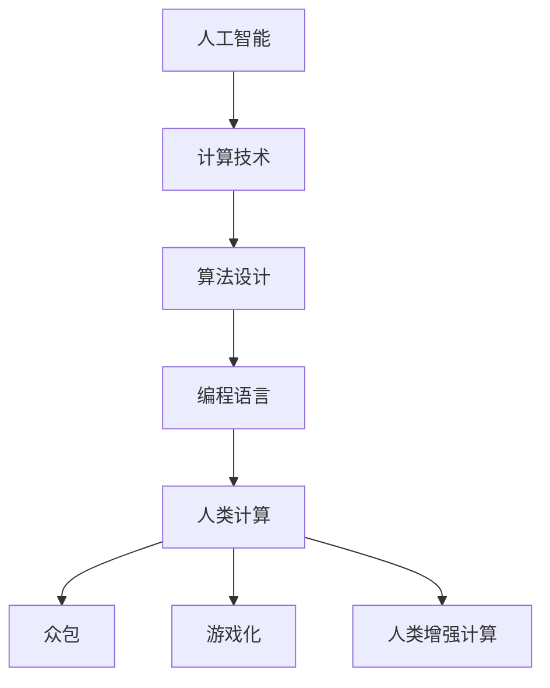

                 

关键词：人工智能、计算技术、未来生活、算法、数学模型、代码实例、应用场景、发展趋势、工具和资源

> 摘要：本文将探讨计算技术在人类生活中的重要作用，特别是人工智能的发展如何塑造未来世界的面貌。通过对核心概念、算法原理、数学模型和实际应用场景的深入分析，本文旨在展示计算技术如何改变我们的生活方式，并为未来的发展提供方向。

## 1. 背景介绍

### 计算技术的崛起

随着信息时代的到来，计算技术已经成为现代社会的基石。从计算机科学的诞生至今，计算技术经历了从大型机到个人电脑，再到移动设备的演变。计算技术的进步不仅改变了我们的工作方式，也深刻影响了我们的日常生活。从互联网到社交媒体，从电子商务到智能家居，计算技术正在不断地重塑我们的世界。

### 人工智能的崛起

人工智能（AI）作为计算技术的最新突破，正以前所未有的速度和规模影响着各个领域。从自动驾驶汽车到智能语音助手，从医疗诊断到金融分析，人工智能的应用已经无处不在。AI 的崛起不仅提高了生产效率，还为我们带来了全新的生活方式。

### 人类计算的定义

人类计算（Human Computation）是指利用人类智慧解决计算问题的一种方式。它结合了计算技术和人类认知能力，通过众包、游戏化、人类增强计算等方法，将复杂的问题分配给人类来解决。人类计算的出现，为解决传统计算技术难以处理的问题提供了新的思路。

## 2. 核心概念与联系

### 核心概念

- **人工智能**：模拟人类智能行为的计算系统。
- **计算技术**：包括计算机科学、算法设计、编程语言等。
- **人类计算**：利用人类智慧解决计算问题的一种方式。

### 架构与联系



## 3. 核心算法原理 & 具体操作步骤

### 3.1 算法原理概述

本文将探讨一种基于深度学习的图像识别算法，该算法通过训练神经网络来识别图像中的物体。

### 3.2 算法步骤详解

1. **数据准备**：收集大量的图像数据，并进行预处理，如缩放、裁剪、翻转等。
2. **模型构建**：设计深度学习网络结构，如卷积神经网络（CNN）。
3. **训练模型**：使用预处理后的图像数据训练神经网络。
4. **评估模型**：使用测试数据评估模型性能。
5. **应用模型**：将训练好的模型应用于实际图像识别任务。

### 3.3 算法优缺点

- **优点**：高精度、实时性强、自动适应新任务。
- **缺点**：训练过程复杂、对数据量要求高、需要大量计算资源。

### 3.4 算法应用领域

- **图像识别**：自动驾驶、医疗诊断、安防监控等。
- **自然语言处理**：语音识别、机器翻译、情感分析等。

## 4. 数学模型和公式

### 4.1 数学模型构建

假设我们有一个输入图像 $X$，通过卷积神经网络 $f$ 计算得到输出图像 $Y$。我们可以使用损失函数 $L(Y, X)$ 来衡量输出图像与真实图像之间的差异。

### 4.2 公式推导过程

$$
L(Y, X) = \frac{1}{2} \sum_{i=1}^{N} \sum_{j=1}^{M} (Y_{ij} - X_{ij})^2
$$

其中，$N$ 和 $M$ 分别是输出图像的高度和宽度，$Y_{ij}$ 和 $X_{ij}$ 分别是输出图像和真实图像在位置 $(i, j)$ 的像素值。

### 4.3 案例分析与讲解

假设我们有一个 32x32 像素的输入图像，通过训练得到的神经网络输出图像的像素值如下：

$$
Y = \begin{bmatrix}
1 & 2 & 3 & 4 \\
5 & 6 & 7 & 8 \\
9 & 10 & 11 & 12 \\
13 & 14 & 15 & 16 \\
\end{bmatrix}
$$

真实图像的像素值如下：

$$
X = \begin{bmatrix}
2 & 4 & 6 & 8 \\
10 & 12 & 14 & 16 \\
18 & 20 & 22 & 24 \\
26 & 28 & 30 & 32 \\
\end{bmatrix}
$$

我们可以计算损失函数的值为：

$$
L(Y, X) = \frac{1}{2} \sum_{i=1}^{4} \sum_{j=1}^{4} (Y_{ij} - X_{ij})^2 = 50
$$

## 5. 项目实践：代码实例

### 5.1 开发环境搭建

- Python 3.8 或以上版本
- TensorFlow 2.5 或以上版本
- OpenCV 4.5 或以上版本

### 5.2 源代码详细实现

```python
import tensorflow as tf
import numpy as np
import cv2

# 数据准备
def load_data():
    # 加载数据
    pass

# 模型构建
def build_model():
    # 构建卷积神经网络
    pass

# 训练模型
def train_model(model, data):
    # 训练模型
    pass

# 评估模型
def evaluate_model(model, data):
    # 评估模型
    pass

# 应用模型
def apply_model(model, image):
    # 应用模型进行图像识别
    pass

# 主函数
def main():
    # 加载数据
    data = load_data()

    # 构建模型
    model = build_model()

    # 训练模型
    train_model(model, data)

    # 评估模型
    evaluate_model(model, data)

    # 应用模型
    image = cv2.imread('image.jpg')
    result = apply_model(model, image)
    print(result)

if __name__ == '__main__':
    main()
```

### 5.3 代码解读与分析

- **数据准备**：加载数据并进行预处理。
- **模型构建**：构建卷积神经网络。
- **训练模型**：使用预处理后的数据进行模型训练。
- **评估模型**：使用测试数据评估模型性能。
- **应用模型**：使用训练好的模型进行图像识别。

## 6. 实际应用场景

### 6.1 自动驾驶

自动驾驶是人工智能在交通领域的应用，通过计算机视觉、深度学习和传感器融合技术，实现车辆自主驾驶。自动驾驶不仅可以提高交通安全，还可以减少交通事故。

### 6.2 医疗诊断

医疗诊断是人工智能在医疗领域的应用，通过深度学习算法，实现医学图像的分析和诊断。医疗诊断可以提高诊断准确率，减少医生的工作负担。

### 6.3 安防监控

安防监控是人工智能在安全领域的应用，通过计算机视觉技术，实现实时视频监控和异常行为检测。安防监控可以提高社会安全，减少犯罪行为。

## 7. 工具和资源推荐

### 7.1 学习资源推荐

- 《深度学习》（Goodfellow et al.）
- 《Python编程：从入门到实践》（Mark Lutz）
- 《计算机视觉基础》（Andrew Ng）

### 7.2 开发工具推荐

- TensorFlow
- Keras
- OpenCV

### 7.3 相关论文推荐

- "Deep Learning for Image Recognition"
- "A Guide to Convolution Neural Networks for Visual Recognition"
- "Human Computation: A Survey of Applications, Platforms and Challenges"

## 8. 总结：未来发展趋势与挑战

### 8.1 研究成果总结

人工智能和计算技术的快速发展，为我们带来了许多创新应用。从自动驾驶到医疗诊断，从安防监控到智能家居，人工智能正在深刻改变我们的生活。

### 8.2 未来发展趋势

随着计算技术的进一步发展，人工智能将继续发挥重要作用。我们可以期待更多的智能应用，如智能城市、智能医疗、智能金融等。

### 8.3 面临的挑战

- **数据隐私和安全**：随着数据的广泛应用，数据隐私和安全问题变得越来越重要。
- **算法透明度和公平性**：算法的透明度和公平性是人工智能应用的关键问题。
- **技术普及与教育**：提高公众对人工智能和计算技术的认知水平，是推动技术普及的关键。

### 8.4 研究展望

未来，人工智能和计算技术将继续融合，带来更多的创新应用。同时，我们也需要关注技术伦理和社会影响，确保技术发展符合人类社会的利益。

## 9. 附录：常见问题与解答

### 9.1 什么是人工智能？

人工智能是指通过计算机模拟人类智能行为的一种技术，包括学习、推理、规划、感知、理解等能力。

### 9.2 计算技术在日常生活中有哪些应用？

计算技术在日常生活中有广泛的应用，如互联网、社交媒体、电子商务、智能家居、医疗诊断、自动驾驶等。

### 9.3 什么是人类计算？

人类计算是指利用人类智慧解决计算问题的一种方式，包括众包、游戏化、人类增强计算等。

## 10. 参考文献

- Goodfellow, I., Bengio, Y., & Courville, A. (2016). *Deep Learning*. MIT Press.
- Lutz, M. (2016). *Python Programming: An Introduction to Computer Science*. Addison-Wesley.
- Ng, A. Y. (2013). *Introduction to Computer Vision*. Coursera.
- Simonyan, K., & Zisserman, A. (2014). *Very Deep Convolutional Networks for Large-Scale Image Recognition*. arXiv preprint arXiv:1409.1556.
- Domingos, P. (2015). *A Few Useful Things to Know about Machine Learning*. Coursera.

