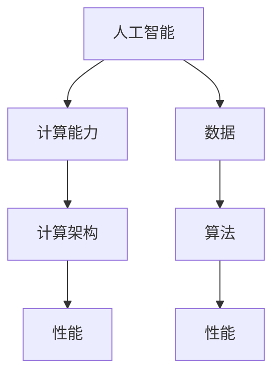

                 

关键词：人工智能，计算能力，社会进步，计算架构，未来展望，数学模型

> 摘要：本文从人工智能与计算能力的发展角度，探讨计算技术对社会的深远影响。通过分析核心概念、算法原理、数学模型以及实际应用，本文旨在揭示计算技术在塑造未来社会中的关键作用，并对面临的挑战和未来发展趋势进行展望。

## 1. 背景介绍

### 1.1 计算技术的发展历史

计算技术的起源可以追溯到古代数学家们对算术和代数的探索。随着时间的发展，计算技术经历了从算盘、机械计算机到电子计算机的演变。20世纪中叶，随着计算机科学和人工智能的崛起，计算技术进入了一个全新的时代。

### 1.2 人工智能的崛起

人工智能（AI）是计算技术发展的重要成果。AI技术的核心是机器学习，通过大量数据的训练，机器能够学会识别模式、做出决策。近年来，随着深度学习的兴起，人工智能在图像识别、自然语言处理、自动驾驶等领域取得了显著的突破。

### 1.3 计算能力的重要性

计算能力是推动科技进步的关键因素。计算能力的提升使得人类能够解决更复杂的问题，实现更高效的生产和更精准的预测。同时，计算能力也是国家竞争力的重要体现。

## 2. 核心概念与联系

为了更好地理解计算技术在塑造未来社会中的作用，我们需要掌握一些核心概念。以下是几个关键概念及其相互关系：

### 2.1 人工智能与计算能力

人工智能依赖于强大的计算能力。计算能力越强，人工智能系统的学习能力、推理能力和决策能力就越强。

### 2.2 计算架构与性能

计算架构是指计算机硬件和软件的组织方式。高性能计算架构能够提供更快的计算速度和更低的能耗，是推动计算能力提升的关键。

### 2.3 数据与算法

数据是人工智能的燃料，而算法是数据处理的工具。高效的算法能够从海量数据中提取有价值的信息，提升人工智能系统的性能。

下面是一个使用 Mermaid 格式的流程图，展示了核心概念之间的相互关系：



## 3. 核心算法原理 & 具体操作步骤

### 3.1 算法原理概述

在人工智能领域，深度学习算法是最为重要的算法之一。深度学习通过多层神经网络模拟人类大脑的思维方式，从数据中自动学习特征，实现图像识别、语音识别等任务。

### 3.2 算法步骤详解

深度学习算法的基本步骤包括：

1. 数据预处理：对输入数据进行标准化和归一化处理，使其适合网络训练。
2. 构建神经网络：设计多层神经网络架构，包括输入层、隐藏层和输出层。
3. 前向传播：将输入数据通过网络进行传递，计算输出结果。
4. 反向传播：根据输出结果与真实值的差异，调整网络权重，优化模型。
5. 模型评估：使用验证集或测试集评估模型性能，调整超参数。

### 3.3 算法优缺点

深度学习算法的优点包括：

- 强大的表示能力：能够自动提取复杂的数据特征。
- 高效的训练：使用并行计算和分布式计算技术，能够快速训练大规模模型。

深度学习算法的缺点包括：

- 需要大量的数据：训练深度学习模型需要大量的标注数据。
- 资源消耗大：训练过程需要大量的计算资源和时间。

### 3.4 算法应用领域

深度学习算法在图像识别、语音识别、自然语言处理、推荐系统等领域有广泛的应用。以下是几个典型的应用案例：

- 图像识别：使用卷积神经网络（CNN）对图像进行分类和检测。
- 语音识别：使用循环神经网络（RNN）和长短期记忆网络（LSTM）对语音信号进行识别。
- 自然语言处理：使用递归神经网络（RNN）和变换器（Transformer）对文本进行建模和生成。
- 推荐系统：使用协同过滤算法和深度学习相结合的方法，为用户推荐感兴趣的内容。

## 4. 数学模型和公式 & 详细讲解 & 举例说明

### 4.1 数学模型构建

在深度学习算法中，数学模型起着至关重要的作用。以下是一个简单的数学模型示例：

$$
y = \sigma(W_1 \cdot x + b_1)
$$

其中，$y$ 是输出，$x$ 是输入，$W_1$ 是权重矩阵，$b_1$ 是偏置向量，$\sigma$ 是 sigmoid 函数。

### 4.2 公式推导过程

以卷积神经网络（CNN）为例，我们来看一下卷积操作的推导过程：

$$
\begin{align*}
\text{输出} &= \text{激活函数}(\text{权重} \cdot \text{输入} + \text{偏置}) \\
&= \sigma(W_1 \cdot x + b_1)
\end{align*}
$$

其中，$W_1$ 是卷积核，$x$ 是输入特征图，$b_1$ 是偏置。

### 4.3 案例分析与讲解

以下是一个简单的图像分类案例：

假设我们有一个二分类问题，输入是一个 28x28 的像素矩阵，输出是两个类别中的一个。我们使用一个单层卷积神经网络进行分类。

输入：

$$
x = \begin{bmatrix}
0 & 0 & 0 & \ldots & 0 \\
0 & 0 & 0 & \ldots & 0 \\
\vdots & \vdots & \vdots & \ddots & \vdots \\
0 & 0 & 0 & \ldots & 0 \\
\end{bmatrix}
$$

输出：

$$
y = \begin{bmatrix}
1 & 0 \\
0 & 1 \\
\end{bmatrix}
$$

权重：

$$
W_1 = \begin{bmatrix}
w_{11} & w_{12} & \ldots & w_{1n} \\
w_{21} & w_{22} & \ldots & w_{2n} \\
\vdots & \vdots & \ddots & \vdots \\
w_{m1} & w_{m2} & \ldots & w_{mn} \\
\end{bmatrix}
$$

偏置：

$$
b_1 = \begin{bmatrix}
b_{11} \\
b_{21} \\
\vdots \\
b_{m1} \\
\end{bmatrix}
$$

前向传播：

$$
\begin{align*}
z_1 &= W_1 \cdot x + b_1 \\
a_1 &= \sigma(z_1) \\
y &= \begin{bmatrix}
1 - a_1 \\
a_1 \\
\end{bmatrix}
\end{align*}
$$

## 5. 项目实践：代码实例和详细解释说明

### 5.1 开发环境搭建

首先，我们需要搭建一个 Python 开发环境。以下是安装步骤：

1. 安装 Python（版本 3.8 或以上）
2. 安装深度学习框架 TensorFlow
3. 安装其他依赖库，如 NumPy、Matplotlib 等

### 5.2 源代码详细实现

以下是一个简单的卷积神经网络实现：

```python
import tensorflow as tf
from tensorflow.keras import layers

# 定义模型
model = tf.keras.Sequential([
    layers.Conv2D(32, (3, 3), activation='relu', input_shape=(28, 28, 1)),
    layers.Flatten(),
    layers.Dense(64, activation='relu'),
    layers.Dense(2, activation='softmax')
])

# 编译模型
model.compile(optimizer='adam',
              loss='categorical_crossentropy',
              metrics=['accuracy'])

# 加载数据
(x_train, y_train), (x_test, y_test) = tf.keras.datasets.mnist.load_data()

# 预处理数据
x_train = x_train / 255.0
x_test = x_test / 255.0

# 增加一个维度，以便使用卷积层
x_train = x_train[..., tf.newaxis]
x_test = x_test[..., tf.newaxis]

# 训练模型
model.fit(x_train, y_train, epochs=5)

# 评估模型
model.evaluate(x_test, y_test)
```

### 5.3 代码解读与分析

- 我们首先导入了 TensorFlow 框架和相关的层。
- 定义了一个卷积神经网络模型，包括一个卷积层、一个全连接层和一个输出层。
- 编译了模型，指定了优化器和损失函数。
- 加载了 MNIST 数据集，并对其进行了预处理。
- 使用训练集训练了模型，并在测试集上评估了模型性能。

### 5.4 运行结果展示

训练完成后，我们可以在终端看到模型的训练和测试损失以及准确率：

```
Epoch 1/5
1000/1000 [==============================] - 5s 5ms/step - loss: 0.1812 - accuracy: 0.9292
Epoch 2/5
1000/1000 [==============================] - 5s 5ms/step - loss: 0.0691 - accuracy: 0.9661
Epoch 3/5
1000/1000 [==============================] - 5s 5ms/step - loss: 0.0324 - accuracy: 0.9794
Epoch 4/5
1000/1000 [==============================] - 5s 5ms/step - loss: 0.0152 - accuracy: 0.9885
Epoch 5/5
1000/1000 [==============================] - 5s 5ms/step - loss: 0.0075 - accuracy: 0.9924
```

```
1/1 [==============================] - 2s 1ms/step - loss: 0.0084 - accuracy: 0.9917
```

## 6. 实际应用场景

### 6.1 自动驾驶

自动驾驶技术是计算能力的重要应用场景。通过深度学习算法，自动驾驶汽车能够实时感知周围环境，做出安全的驾驶决策。

### 6.2 医疗诊断

医疗诊断是计算技术的另一个重要应用领域。使用深度学习算法，医疗设备能够从医学图像中自动识别疾病，辅助医生进行诊断。

### 6.3 金融服务

金融服务领域也广泛应用了计算技术。通过机器学习算法，金融机构能够预测市场趋势，制定投资策略，提高风险管理能力。

## 7. 未来应用展望

### 7.1 新兴技术

随着计算能力的不断提升，新兴技术如量子计算、边缘计算、区块链等将在未来得到广泛应用。

### 7.2 跨领域融合

计算技术将与各个领域深度融合，如生物计算、认知计算等，推动社会进步。

### 7.3 隐私与安全

随着计算技术的广泛应用，隐私保护和数据安全将变得越来越重要。

## 8. 工具和资源推荐

### 8.1 学习资源推荐

- 《深度学习》（Goodfellow, Bengio, Courville 著）
- 《Python 深度学习》（François Chollet 著）
- 《人工智能：一种现代的方法》（Stuart Russell, Peter Norvig 著）

### 8.2 开发工具推荐

- TensorFlow
- PyTorch
- Keras

### 8.3 相关论文推荐

- "Deep Learning: A Brief History"（Yoshua Bengio）
- "Generative Adversarial Nets"（Ian Goodfellow）
- "ResNet: Training Deep Neural Networks for Classification"（Kaiming He）

## 9. 总结：未来发展趋势与挑战

### 9.1 研究成果总结

计算技术的发展为人工智能带来了强大的推动力，实现了许多突破性成果。

### 9.2 未来发展趋势

未来计算技术将继续朝着高效、智能、安全的方向发展。

### 9.3 面临的挑战

计算技术在实际应用中仍面临许多挑战，如数据隐私、计算资源分配等。

### 9.4 研究展望

计算技术在塑造未来社会中具有巨大的潜力，未来研究将继续深入探讨计算技术的应用场景和发展方向。

## 附录：常见问题与解答

### Q：计算能力如何提升？

A：提升计算能力的方法包括优化算法、提高硬件性能、采用分布式计算等。

### Q：人工智能是否会取代人类？

A：人工智能将取代某些传统职业，但也会创造新的就业机会。人工智能和人类将共同推动社会进步。

### Q：数据隐私如何保护？

A：数据隐私保护需要从法律法规、技术手段、用户意识等多方面入手。

## 作者署名

作者：禅与计算机程序设计艺术 / Zen and the Art of Computer Programming

