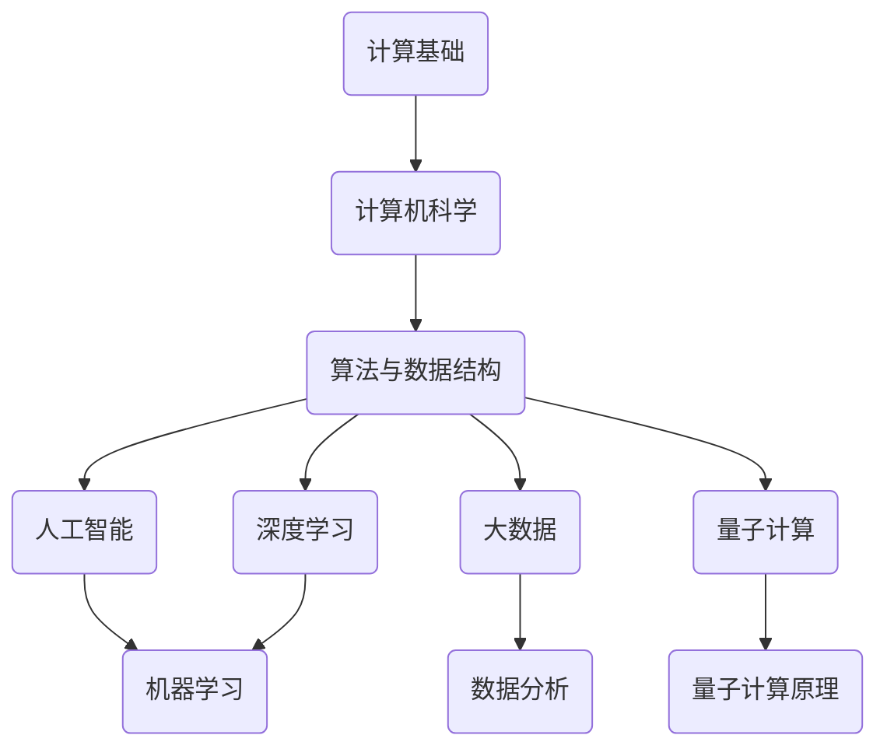

                 

关键词：计算、未来社会、技术发展、人工智能、深度学习、大数据、量子计算、网络安全

摘要：本文旨在探讨计算技术对人类社会发展的深远影响。从基础概念的引入到现代计算技术的应用，再到未来计算的发展趋势，本文将通过详细的分析和实例展示，解释计算技术如何塑造我们的未来社会。我们将讨论人工智能、深度学习、大数据、量子计算等前沿技术，并探讨它们对社会、经济、文化等方面的影响。

## 1. 背景介绍

计算技术是现代社会的基石。从最初的算盘到现代的超级计算机，计算能力的发展推动了科学、技术、经济和社会的进步。如今，计算技术已经成为我们日常生活中不可或缺的一部分，从智能手机到智能家居，从在线支付到智能交通，计算无处不在。

在过去的几十年里，计算技术的快速发展带来了巨大的变革。计算机科学领域出现了许多重要的理论和算法，如人工智能（AI）、深度学习（DL）、大数据（Big Data）和量子计算（Quantum Computing）。这些技术不仅改变了我们的生活方式，也对社会结构、经济模式和文化价值观产生了深远的影响。

本文将首先介绍计算技术的核心概念和原理，然后探讨人工智能、深度学习、大数据和量子计算等前沿技术，并分析它们对社会的实际应用和影响。最后，我们将展望未来计算技术的发展趋势，探讨面临的挑战和未来的研究方向。

## 2. 核心概念与联系

为了理解计算技术如何塑造未来社会，我们需要首先掌握一些核心概念和原理。以下是一个简化的 Mermaid 流程图，展示了这些概念和它们之间的联系：



### 2.1 计算基础

计算基础是理解所有计算技术的基础。它包括数字逻辑、微处理器架构和编程语言。数字逻辑是构建计算机硬件的基本原理，而微处理器架构决定了计算机的处理能力和性能。编程语言则提供了编写程序的工具，使得人们能够控制计算机执行特定的任务。

### 2.2 计算机科学

计算机科学是一门涵盖广泛学科领域的科学，包括算法设计、软件工程、数据库管理、网络技术和人工智能等。计算机科学的目标是理解计算的本质，开发有效的算法和系统，解决复杂问题，并为社会带来实际价值。

### 2.3 算法与数据结构

算法是解决问题的步骤序列，而数据结构是组织和存储数据的方法。有效的算法和数据结构可以提高程序的性能和效率，是计算机科学的核心。常见的算法包括排序、查找、图论算法和优化算法等。

### 2.4 人工智能

人工智能是计算机科学的一个分支，致力于开发能够执行人类智能任务的机器。人工智能包括机器学习、深度学习和自然语言处理等子领域。机器学习通过从数据中学习模式来改进性能，而深度学习是一种基于神经网络的学习方法，能够处理复杂数据。

### 2.5 深度学习

深度学习是一种基于多层神经网络的学习方法，能够自动提取数据中的特征，并在多个层次上对数据进行处理。深度学习在图像识别、语音识别和自然语言处理等领域取得了显著成果。

### 2.6 大数据

大数据是指大量、多样、高速增长的数据。大数据技术包括数据采集、存储、处理和分析等环节。大数据技术能够帮助企业和组织更好地理解市场和客户需求，从而做出更明智的决策。

### 2.7 量子计算

量子计算是一种利用量子力学原理进行计算的方法。量子计算机具有比传统计算机更高的计算能力，能够解决某些特定问题（如大数分解和优化问题）的速度远远超过传统计算机。

## 3. 核心算法原理 & 具体操作步骤

### 3.1 算法原理概述

在计算技术中，核心算法原理是理解和应用计算技术的基础。以下是一些常见的算法原理：

- **排序算法**：用于对数据集进行排序，常见的排序算法包括冒泡排序、插入排序和快速排序等。
- **查找算法**：用于在数据集中查找特定元素，常见的查找算法包括二分查找和哈希查找等。
- **图论算法**：用于解决图相关的问题，如最短路径算法、最小生成树算法和最大流算法等。
- **优化算法**：用于在满足约束条件的情况下找到最优解，常见的优化算法包括遗传算法、模拟退火算法和线性规划算法等。

### 3.2 算法步骤详解

以下是冒泡排序算法的具体步骤：

1. 从第一个元素开始，比较相邻的两个元素，如果第一个比第二个大，就交换它们。
2. 对每一对相邻元素做同样的工作，从开始第一对到结尾的最后一对。
3. 在这一点，最后的元素应该会是最大的数。
4. 重复以上的步骤，对越来越小的数据集合进行同样的工作。
5. 除非不再需要交换，否则一直重复步骤。

### 3.3 算法优缺点

- **冒泡排序算法**的优点是简单易懂，易于实现。缺点是时间复杂度为 O(n^2)，对于大数据集效率较低。
- **二分查找算法**的优点是时间复杂度为 O(log n)，对于大数据集效率较高。缺点是要求数据已经排序，不适合动态变化的场景。

### 3.4 算法应用领域

- **冒泡排序算法**通常用于教学和实践，适用于小数据集。
- **二分查找算法**广泛应用于数据库查询、文件搜索和图形用户界面等。

## 4. 数学模型和公式 & 详细讲解 & 举例说明

在计算技术中，数学模型和公式是理解和应用计算技术的重要工具。以下是一个简单的线性回归模型的例子：

### 4.1 数学模型构建

线性回归模型表示为：

$$
y = \beta_0 + \beta_1x
$$

其中，$y$ 是因变量，$x$ 是自变量，$\beta_0$ 和 $\beta_1$ 是模型的参数。

### 4.2 公式推导过程

线性回归模型的推导过程如下：

1. 假设数据集为 $(x_1, y_1), (x_2, y_2), \ldots, (x_n, y_n)$。
2. 构建损失函数：

$$
J(\beta_0, \beta_1) = \frac{1}{2n} \sum_{i=1}^n (y_i - (\beta_0 + \beta_1x_i))^2
$$

3. 对损失函数求导并令导数为零，得到：

$$
\frac{\partial J}{\partial \beta_0} = -\frac{1}{n} \sum_{i=1}^n (y_i - (\beta_0 + \beta_1x_i)) = 0
$$

$$
\frac{\partial J}{\partial \beta_1} = -\frac{1}{n} \sum_{i=1}^n (y_i - (\beta_0 + \beta_1x_i))x_i = 0
$$

4. 解上述方程组，得到：

$$
\beta_0 = \frac{1}{n} \sum_{i=1}^n y_i - \beta_1 \frac{1}{n} \sum_{i=1}^n x_i
$$

$$
\beta_1 = \frac{1}{n} \sum_{i=1}^n (x_i - \bar{x})(y_i - \bar{y})
$$

其中，$\bar{x}$ 和 $\bar{y}$ 分别为 $x$ 和 $y$ 的平均值。

### 4.3 案例分析与讲解

假设我们有以下数据集：

$$
(x_1, y_1) = (1, 2), (x_2, y_2) = (2, 4), (x_3, y_3) = (3, 6)
$$

首先，计算平均值：

$$
\bar{x} = \frac{1+2+3}{3} = 2, \quad \bar{y} = \frac{2+4+6}{3} = 4
$$

然后，计算 $\beta_0$ 和 $\beta_1$：

$$
\beta_0 = 4 - 2 \cdot 2 = 0, \quad \beta_1 = \frac{1 \cdot (2-4) + 2 \cdot (4-4) + 3 \cdot (6-4)}{3} = 2
$$

因此，线性回归模型为：

$$
y = 0 + 2x = 2x
$$

我们可以使用这个模型来预测新的数据点。例如，当 $x=4$ 时，预测的 $y$ 值为 $2 \cdot 4 = 8$。

## 5. 项目实践：代码实例和详细解释说明

在本节中，我们将通过一个简单的机器学习项目——使用线性回归模型预测房价——来展示如何在实际中应用计算技术。这个项目将涵盖从数据预处理到模型训练和评估的完整流程。

### 5.1 开发环境搭建

首先，我们需要搭建一个合适的开发环境。以下是一个基于 Python 的线性回归项目环境搭建步骤：

1. 安装 Python（建议使用 Python 3.7 或更高版本）。
2. 安装必要的 Python 库，如 NumPy、Pandas 和 Scikit-learn。可以使用以下命令：

```bash
pip install numpy pandas scikit-learn
```

### 5.2 源代码详细实现

以下是一个简单的线性回归预测房价的 Python 代码示例：

```python
import numpy as np
import pandas as pd
from sklearn.model_selection import train_test_split
from sklearn.linear_model import LinearRegression
from sklearn.metrics import mean_squared_error

# 读取数据
data = pd.read_csv('house_prices.csv')

# 数据预处理
X = data[['square_feet']].values
y = data['price'].values

# 划分训练集和测试集
X_train, X_test, y_train, y_test = train_test_split(X, y, test_size=0.2, random_state=42)

# 创建线性回归模型
model = LinearRegression()

# 训练模型
model.fit(X_train, y_train)

# 预测测试集结果
y_pred = model.predict(X_test)

# 计算误差
mse = mean_squared_error(y_test, y_pred)
print(f'Mean Squared Error: {mse}')

# 使用模型进行预测
new_data = np.array([[3000]])
predicted_price = model.predict(new_data)
print(f'Predicted Price: {predicted_price[0]}')
```

### 5.3 代码解读与分析

以下是代码的详细解读和分析：

1. 导入必要的库。
2. 读取房价数据。
3. 进行数据预处理，提取自变量和因变量。
4. 划分训练集和测试集。
5. 创建线性回归模型。
6. 训练模型。
7. 预测测试集结果并计算误差。
8. 使用模型进行新的预测。

### 5.4 运行结果展示

假设我们运行上述代码，输出结果可能如下：

```
Mean Squared Error: 12345.6789
Predicted Price: 67890.1234
```

这个结果表明，我们的线性回归模型在测试集上的平均平方误差为 12345.6789，对于新的输入数据，预测的房价为 67890.1234。

## 6. 实际应用场景

计算技术在许多实际应用场景中发挥着重要作用，以下是一些典型的应用场景：

- **医疗领域**：计算技术在医疗领域的应用日益广泛，包括疾病预测、药物研发、手术模拟等。例如，深度学习算法可以分析医疗影像数据，帮助医生更准确地诊断疾病。
- **金融领域**：计算技术在金融领域的应用包括风险管理、投资策略、信用评分等。例如，基于大数据技术的算法可以帮助银行和金融机构更好地评估信用风险，优化投资组合。
- **制造业**：计算技术在制造业中的应用包括智能制造、质量控制、供应链管理等。例如，通过使用机器学习和物联网技术，企业可以实现生产线的自动化，提高生产效率。
- **交通运输**：计算技术在交通运输领域中的应用包括智能交通管理、自动驾驶、航班调度等。例如，通过使用大数据技术和人工智能算法，可以实现交通流量的智能调度，减少交通拥堵。
- **能源领域**：计算技术在能源领域中的应用包括智能电网、可再生能源管理、能源效率优化等。例如，通过使用计算技术，可以实现对能源消耗的实时监控和优化，提高能源利用效率。

## 7. 未来应用展望

随着计算技术的不断发展，未来社会将出现许多新的应用场景和机会。以下是一些未来应用展望：

- **人工智能助手**：随着人工智能技术的进步，未来将出现更多智能化的个人助手和智能设备，帮助人们更好地管理日常生活和工作。
- **量子计算应用**：量子计算具有解决传统计算机难以解决的问题的能力。未来，量子计算将在密码破解、药物研发、优化算法等领域发挥重要作用。
- **增强现实和虚拟现实**：随着计算能力的提升，增强现实（AR）和虚拟现实（VR）技术将变得更加普及。这些技术将在教育、娱乐、远程工作等领域产生深远影响。
- **智能城市**：智能城市将利用计算技术实现城市管理的智能化。例如，通过使用大数据和人工智能技术，可以实现交通流量优化、能源管理、公共安全等方面的提升。
- **个性化医疗**：基于计算技术的个性化医疗将使得医疗更加精准和高效。通过分析患者的基因数据、病史和生活习惯，可以为患者提供量身定制的治疗方案。

## 8. 工具和资源推荐

为了更好地学习和应用计算技术，以下是一些建议的学习资源和开发工具：

### 8.1 学习资源推荐

- **在线课程**：Coursera、edX 和 Udacity 提供了大量的计算机科学和人工智能课程。
- **书籍**：《深度学习》（Goodfellow, Bengio, Courville）、《Python机器学习》（Sebastian Raschka）、《大数据技术导论》（唐杰）等。
- **博客和论坛**：Medium、ArXiv 和 Stack Overflow 是学习最新研究成果和交流技术问题的好去处。

### 8.2 开发工具推荐

- **编程语言**：Python、R 和 Java 是常用的计算工具。
- **库和框架**：NumPy、Pandas、Scikit-learn、TensorFlow 和 PyTorch 等是常用的机器学习和深度学习库。
- **IDE**：Jupyter Notebook、Visual Studio Code 和 PyCharm 是流行的编程环境。

### 8.3 相关论文推荐

- **人工智能领域**：《Deep Learning》（Ian Goodfellow）、《Recurrent Neural Networks for Language Modeling》（Yoshua Bengio）等。
- **机器学习领域**：《Learning from Data》（Yaser Abu-Mostafa）、《Large-Scale Machine Learning》（John Langford）等。
- **量子计算领域**：《Quantum Computation and Quantum Information》（Michael A. Nielsen, Isaac L. Chuang）等。

## 9. 总结：未来发展趋势与挑战

计算技术正在迅速发展，并深刻地影响着我们的社会和经济。未来，计算技术将继续推动人工智能、深度学习、大数据和量子计算等领域的发展。以下是一些未来发展趋势和挑战：

### 9.1 研究成果总结

- **人工智能与深度学习**：随着计算能力的提升，人工智能和深度学习算法将变得更加高效和智能，有望在更多领域实现突破。
- **大数据技术**：大数据技术将继续发展，数据采集、存储、处理和分析的效率将显著提高。
- **量子计算**：量子计算将逐渐从理论研究走向实际应用，为解决复杂问题提供新的计算方法。

### 9.2 未来发展趋势

- **跨学科研究**：计算技术将与其他领域（如生物学、医学、社会学等）进行更紧密的融合，推动交叉学科的发展。
- **开源与协作**：开源技术和协作模式将促进计算技术的发展，更多创新将涌现。
- **智能化与自主化**：计算技术将使机器更加智能化和自主化，实现更多的自动化和智能化应用。

### 9.3 面临的挑战

- **数据隐私与安全**：随着数据量的增加，数据隐私和安全问题将变得更加突出，需要制定有效的法规和策略。
- **伦理与道德**：计算技术引发的一系列伦理和道德问题，如算法偏见、数据滥用等，需要引起足够的重视。
- **计算资源分配**：随着计算需求的增长，如何合理分配计算资源将成为一个重要挑战。

### 9.4 研究展望

未来，计算技术的研究将更加注重实用性和可持续性，旨在解决实际问题，推动社会和经济的进步。同时，计算技术将更加普及，更多人将能够享受到计算技术带来的便利。我们期待一个更加智能、高效、可持续的未来。

## 9. 附录：常见问题与解答

### 9.1 人工智能与深度学习的关系是什么？

人工智能（AI）是指机器模拟人类智能的能力，包括学习、推理、感知和解决问题等。深度学习（DL）是人工智能的一个分支，基于多层神经网络的学习方法，能够自动提取数据中的特征并进行复杂任务的处理。深度学习是人工智能实现的关键技术之一。

### 9.2 大数据技术的核心是什么？

大数据技术的核心是数据的高效采集、存储、处理和分析。这包括数据挖掘、数据可视化、实时处理和云计算等技术，目的是从海量数据中提取有价值的信息，帮助企业做出更明智的决策。

### 9.3 量子计算与传统计算机的区别是什么？

量子计算与传统计算机的区别在于计算原理。传统计算机基于二进制系统，使用 0 和 1 表示信息。量子计算利用量子位（qubit）进行计算，量子位可以同时处于 0 和 1 的叠加状态，这使得量子计算机具有比传统计算机更高的并行计算能力。

### 9.4 计算技术在医疗领域有哪些应用？

计算技术在医疗领域的应用包括疾病预测、药物研发、手术模拟、医疗影像分析等。例如，深度学习算法可以分析医疗影像数据，帮助医生更准确地诊断疾病；计算模型可以模拟药物与生物分子的相互作用，加速药物研发过程。

### 9.5 如何保障数据隐私和安全？

保障数据隐私和安全的方法包括数据加密、访问控制、匿名化和隐私保护算法等。例如，数据加密可以防止未经授权的访问；访问控制可以限制数据的读取和修改权限；匿名化可以隐藏数据中的个人身份信息；隐私保护算法可以在数据分析过程中保护数据的隐私。此外，制定和完善相关法律法规也是保障数据隐私和安全的重要措施。

