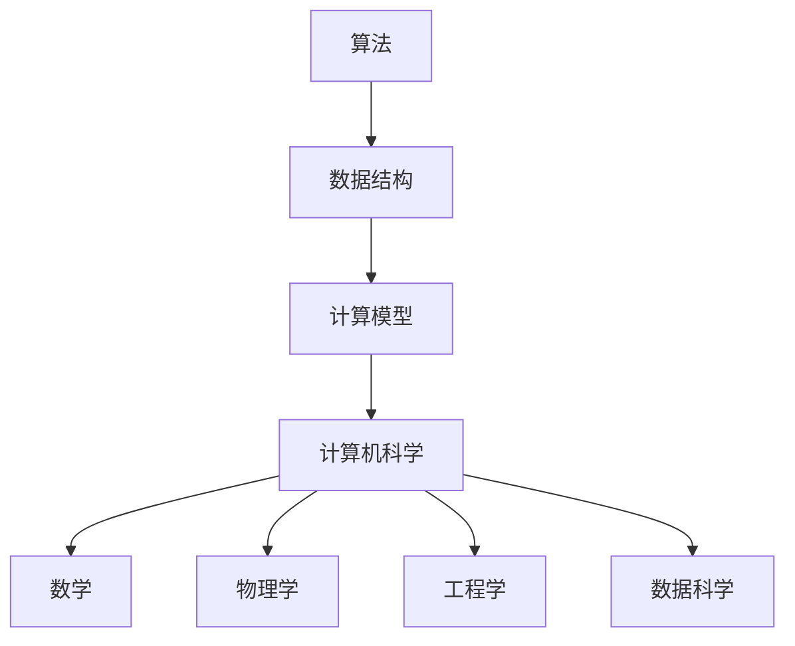

                 

关键词：计算技术、社会变革、人工智能、人类发展、计算能力、未来展望

> 摘要：本文将探讨计算技术在人类社会中的深远影响，从历史、现状到未来，分析计算如何塑造了人类文明的发展轨迹，以及如何在人工智能时代推动社会的进步和变革。

## 1. 背景介绍

计算技术是现代科技的基石，它起源于数学和逻辑的抽象，通过计算机科学的快速发展，逐渐渗透到人类社会的各个领域。从古代的计算工具如算盘到现代的超级计算机，计算技术经历了从简单到复杂、从低效到高效的发展过程。

人类社会的发展离不开计算技术的推动。从农业革命到工业革命，再到信息革命，计算技术的每一次进步都为社会带来了深远的影响。计算技术的进步不仅改变了生产方式，也深刻影响了人们的思维方式和生活习惯。

本文将首先回顾计算技术的发展历史，然后分析其在现代社会的应用，最后探讨人工智能时代计算技术的未来发展趋势和面临的挑战。

## 2. 核心概念与联系

为了更好地理解计算技术对社会的深远影响，我们需要从核心概念和联系的角度进行探讨。

### 2.1 计算技术的核心概念

计算技术的核心概念包括算法、数据结构和计算模型。算法是一系列解决问题的步骤；数据结构是数据存储和组织的方式；计算模型是算法和数据结构在计算机上的实现。


### 2.2 计算技术的联系

计算技术与数学、物理学、工程学等多个学科有着紧密的联系。例如，图灵机的理论模型为计算提供了基础；量子计算的理论基于量子力学的原理；而数据科学则将计算技术与统计学相结合，用于大数据分析。


### 2.3 Mermaid 流程图

下面是一个简单的 Mermaid 流程图，展示了计算技术的一些核心概念和它们之间的联系。



## 3. 核心算法原理 & 具体操作步骤

### 3.1 算法原理概述

计算技术的核心在于算法的设计与实现。算法的效率和质量直接影响计算系统的性能。以下是几种典型的算法原理：

- **排序算法**：用于对数据进行排序，常见的有冒泡排序、选择排序、插入排序、快速排序等。
- **搜索算法**：用于在数据结构中查找特定数据，如线性搜索、二分搜索等。
- **图算法**：用于处理图结构的数据，如最短路径算法、最小生成树算法等。

### 3.2 算法步骤详解

以下以冒泡排序算法为例，详细介绍其步骤：

1. 比较相邻的元素。如果第一个比第二个大（升序排序），就交换它们两个。
2. 对每一对相邻元素做同样的工作，从开始第一对到结尾的最后一对。这步做完后，最后的元素会是最大的数。
3. 针对所有的元素重复以上的步骤，除了最后一个。
4. 重复步骤1~3，直到排序完成。

### 3.3 算法优缺点

- **冒泡排序**的优点是简单易懂，实现简单，适合小规模数据的排序。
- **缺点**是时间复杂度为O(n^2)，当数据量较大时效率较低。

### 3.4 算法应用领域

排序算法在多个领域有广泛的应用，如数据库排序、算法竞赛、搜索引擎排序等。不同的排序算法适用于不同的场景，需要根据具体需求选择合适的算法。

## 4. 数学模型和公式 & 详细讲解 & 举例说明

### 4.1 数学模型构建

在计算技术中，数学模型是理解和分析算法性能的重要工具。常见的数学模型包括时间复杂度和空间复杂度。

### 4.2 公式推导过程

- **时间复杂度**：用于衡量算法执行的时间长度，通常用大O符号表示，如O(n)，O(n^2)等。
- **空间复杂度**：用于衡量算法所需的空间大小，同样使用大O符号表示。

### 4.3 案例分析与讲解

以下是一个简单的例子，分析冒泡排序算法的时间复杂度和空间复杂度。

```latex
时间复杂度：T(n) = O(n^2)
空间复杂度：S(n) = O(1)
```

这意味着，当数据量n增加时，冒泡排序算法的时间复杂度呈平方增长，而空间复杂度保持不变。

## 5. 项目实践：代码实例和详细解释说明

### 5.1 开发环境搭建

为了实践计算技术，我们需要搭建一个适合的开发环境。这里以Python为例，介绍如何搭建开发环境。

1. 安装Python：从[Python官方网站](https://www.python.org/)下载并安装Python。
2. 安装IDE：安装一个Python的集成开发环境（IDE），如PyCharm、VSCode等。
3. 配置环境变量：确保Python的安装路径添加到系统环境变量中。

### 5.2 源代码详细实现

以下是一个简单的冒泡排序算法的Python实现。

```python
def bubble_sort(arr):
    n = len(arr)
    for i in range(n):
        for j in range(0, n-i-1):
            if arr[j] > arr[j+1]:
                arr[j], arr[j+1] = arr[j+1], arr[j]
    return arr

# 测试代码
arr = [64, 34, 25, 12, 22, 11, 90]
sorted_arr = bubble_sort(arr)
print("排序后的数组：", sorted_arr)
```

### 5.3 代码解读与分析

这段代码实现了冒泡排序算法，主要包括两个嵌套的循环。外层循环负责控制排序的轮数，内层循环负责进行相邻元素的比较和交换。

### 5.4 运行结果展示

当输入数组为`[64, 34, 25, 12, 22, 11, 90]`时，运行结果为`[11, 12, 22, 25, 34, 64, 90]`，数组已经按照升序排列。

## 6. 实际应用场景

计算技术在实际应用中有着广泛的应用，以下是几个典型的应用场景：

- **金融领域**：计算技术被用于风险管理、投资分析、算法交易等。
- **医疗领域**：计算技术用于医学图像处理、疾病预测、药物设计等。
- **交通领域**：计算技术用于交通流量预测、智能交通系统等。
- **教育领域**：计算技术被用于在线教育、智能学习系统等。

## 7. 工具和资源推荐

### 7.1 学习资源推荐

- **《算法导论》**：一本经典的算法教材，适合初学者和专业人士。
- **[Khan Academy算法课程](https://www.khanacademy.org/computing/computer-science/algorithms)**：免费的在线算法课程，适合初学者入门。

### 7.2 开发工具推荐

- **PyCharm**：一款功能强大的Python IDE。
- **VSCode**：一款轻量级但功能丰富的跨平台IDE。

### 7.3 相关论文推荐

- **"Quantum Computing since Democritus" by Scott Aaronson**：量子计算领域的经典论文。
- **"The Algorithm Design Manual" by Steve S. Skiena**：算法设计领域的经典著作。

## 8. 总结：未来发展趋势与挑战

### 8.1 研究成果总结

计算技术在过去几十年中取得了巨大的进步，从传统计算机到人工智能，从大数据到云计算，计算技术不断推动着社会的发展。

### 8.2 未来发展趋势

未来，计算技术将继续发展，特别是在量子计算、人工智能、大数据等领域。量子计算有望带来计算能力的巨大提升，而人工智能将更加深入地融入我们的日常生活。

### 8.3 面临的挑战

然而，计算技术也面临着一些挑战，如数据隐私保护、算法公平性、人工智能的安全性问题等。

### 8.4 研究展望

未来的研究应关注如何更好地利用计算技术解决实际问题，同时确保技术的可持续发展和社会责任。

## 9. 附录：常见问题与解答

### Q: 计算技术有哪些类型？

A: 计算技术主要分为传统计算技术、量子计算技术、生物计算技术等。

### Q: 人工智能是否会取代人类？

A: 人工智能不会完全取代人类，而是与人类共同发展，提高生产效率和生活质量。

### Q: 如何学习计算技术？

A: 可以通过阅读教材、参加在线课程、实践项目等多种方式学习计算技术。

作者：禅与计算机程序设计艺术 / Zen and the Art of Computer Programming
----------------------------------------------------------------

以上就是本文的完整内容，希望对您了解计算技术在人类社会中的深远意义有所帮助。在未来的发展中，计算技术将继续扮演关键角色，推动社会的进步和变革。

