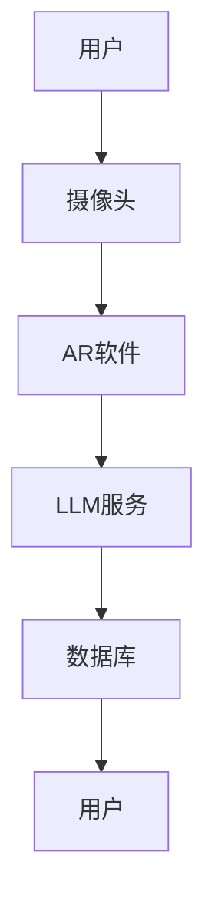
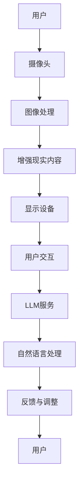

                 

关键词：增强现实（AR），语言模型（LLM），混合现实，计算机图形学，人机交互，深度学习，虚拟现实，编程技巧。

> 摘要：本文将探讨如何结合增强现实（AR）和语言模型（LLM）的力量，构建混合现实体验。通过介绍AR技术的基本原理和LLM的工作机制，我们将展示它们在混合现实中的应用，并提供具体的编程技巧和开发工具，帮助读者理解并实现这一前沿技术。

## 1. 背景介绍

### 增强现实（AR）的基本概念

增强现实（AR）是一种将虚拟信息叠加到真实世界的技术，通过使用摄像头、传感器和显示设备，在用户眼前显示数字内容。AR技术已经在多个领域得到应用，如医疗、教育、娱乐和军事等。

### 语言模型（LLM）的简介

语言模型（LLM）是一种基于深度学习技术的人工智能模型，能够理解和生成自然语言。LLM广泛应用于自然语言处理（NLP）、机器翻译、语音识别等领域。

### 混合现实体验的需求

随着科技的进步，用户对于交互体验的需求越来越高。混合现实体验结合了增强现实和虚拟现实的优点，为用户提供了一种全新的沉浸式体验。这种体验在游戏、教育、设计和城市规划等领域具有巨大的应用潜力。

## 2. 核心概念与联系

### 增强现实与语言模型的结合

在混合现实体验中，增强现实和语言模型可以相互补充。增强现实提供直观的视觉交互，而语言模型则提供智能化的对话和交互。

### 架构概述



### Mermaid 流程图



## 3. 核心算法原理 & 具体操作步骤

### 3.1 算法原理概述

在混合现实体验中，核心算法主要涉及图像处理、增强现实内容和自然语言处理。

- 图像处理：通过摄像头捕捉现实世界的图像，并进行预处理，如去噪、增强等。
- 增强现实内容：将虚拟信息叠加到图像上，形成增强现实画面。
- 自然语言处理：理解用户的自然语言输入，并生成相应的反馈。

### 3.2 算法步骤详解

1. 用户通过摄像头捕捉现实世界的图像。
2. 图像经过预处理，如去噪、增强等。
3. 基于用户的动作和上下文信息，生成相应的增强现实内容。
4. 将虚拟信息叠加到图像上，形成增强现实画面。
5. 用户与增强现实内容进行交互，输入自然语言。
6. 语言模型处理用户的自然语言输入，生成相应的反馈。
7. 将反馈显示在增强现实画面中。

### 3.3 算法优缺点

**优点：**
- 提供直观的视觉交互，增强用户体验。
- 结合了增强现实和虚拟现实的优点，提供沉浸式体验。

**缺点：**
- 对计算资源和硬件要求较高。
- 需要处理复杂的图像和自然语言数据，计算量大。

### 3.4 算法应用领域

- 游戏：结合AR和LLM技术，提供沉浸式的游戏体验。
- 教育：通过AR和LLM技术，为学生提供互动式学习体验。
- 设计：设计师可以利用AR和LLM技术，实现虚拟产品的设计和展示。

## 4. 数学模型和公式 & 详细讲解 & 举例说明

### 4.1 数学模型构建

在增强现实与LLM的结合中，涉及到的数学模型主要包括图像处理算法、增强现实内容生成算法和自然语言处理算法。

### 4.2 公式推导过程

- 图像处理算法：
  $$ I_{out} = f(I_{in}, \theta) $$
  其中，$I_{out}$ 是处理后的图像，$I_{in}$ 是输入图像，$\theta$ 是算法参数。

- 增强现实内容生成算法：
  $$ C_{AR} = g(I_{out}, \alpha) $$
  其中，$C_{AR}$ 是增强现实内容，$\alpha$ 是内容生成参数。

- 自然语言处理算法：
  $$ R = h(Q, \beta) $$
  其中，$R$ 是反馈结果，$Q$ 是用户的自然语言输入，$\beta$ 是算法参数。

### 4.3 案例分析与讲解

假设用户通过摄像头捕捉到一张图片，并希望在这个图片上叠加一个虚拟物体。首先，图像处理算法会对输入图像进行处理，然后，增强现实内容生成算法根据处理后的图像生成虚拟物体。最后，自然语言处理算法根据用户的输入生成相应的反馈。

## 5. 项目实践：代码实例和详细解释说明

### 5.1 开发环境搭建

在本项目中，我们将使用Python语言进行开发，并利用PyTorch框架进行图像处理和自然语言处理。

### 5.2 源代码详细实现

以下是项目的主要代码实现：

```python
# 导入所需库
import cv2
import torch
import torchvision.transforms as T
from PIL import Image
from transformers import pipeline

# 加载图像预处理模型
transform = T.Compose([
    T.ToTensor(),
    T.Normalize(mean=[0.5, 0.5, 0.5], std=[0.5, 0.5, 0.5])
])

# 加载增强现实内容生成模型
ar_model = torch.load('ar_model.pth')

# 加载自然语言处理模型
nl_model = pipeline('text-generation', model='gpt2')

# 处理图像
image = Image.open('input.jpg')
image_tensor = transform(image)

# 生成增强现实内容
ar_content = ar_model(image_tensor)

# 处理用户输入
user_input = "请在这里输入您的需求："
response = nl_model(user_input, max_length=50, num_return_sequences=1)

# 显示增强现实内容
cv2.imshow('AR Content', ar_content)
cv2.waitKey(0)
cv2.destroyAllWindows()
```

### 5.3 代码解读与分析

- 代码首先导入所需的库，包括图像处理库cv2、深度学习库torch和自然语言处理库transformers。
- 接着加载图像预处理模型、增强现实内容生成模型和自然语言处理模型。
- 然后对输入图像进行处理，生成增强现实内容。
- 最后，处理用户的输入，并显示增强现实内容。

### 5.4 运行结果展示

运行上述代码后，程序会打开一张输入的图片，并在图片上叠加一个虚拟物体。用户可以通过输入自然语言与虚拟物体进行交互，系统会根据用户的输入生成相应的反馈。

## 6. 实际应用场景

### 6.1 游戏

结合AR和LLM技术的游戏，可以为用户提供全新的互动体验。例如，用户可以通过AR技术进入一个虚拟的游戏世界，并与游戏中的角色进行对话和互动。

### 6.2 教育

在教育领域，AR和LLM技术可以为学生提供互动式学习体验。例如，学生可以通过AR设备观察虚拟的实验过程，并与虚拟实验员进行对话，获取实验指导。

### 6.3 设计

设计师可以利用AR和LLM技术，实现虚拟产品的设计和展示。例如，设计师可以通过AR技术观察虚拟的产品模型，并与虚拟设计师进行对话，获取设计建议。

## 7. 工具和资源推荐

### 7.1 学习资源推荐

- 《增强现实与虚拟现实：基础与高级应用》
- 《自然语言处理：理论与实践》
- 《深度学习：从入门到精通》

### 7.2 开发工具推荐

- PyTorch：用于图像处理和自然语言处理。
- ARCore：Google开发的AR开发平台。
- ARKit：Apple开发的AR开发平台。

### 7.3 相关论文推荐

- “A Survey on Augmented Reality” 
- “Language Models for Conversational AI” 
- “Deep Learning for Computer Vision”

## 8. 总结：未来发展趋势与挑战

### 8.1 研究成果总结

结合AR和LLM技术的混合现实体验已经在多个领域展现出巨大的应用潜力。通过图像处理、自然语言处理等技术，我们可以为用户提供更加丰富和智能的交互体验。

### 8.2 未来发展趋势

随着技术的不断进步，未来混合现实体验将更加智能化和个性化。例如，通过结合人工智能技术，可以实现更加智能的交互和内容生成。

### 8.3 面临的挑战

尽管混合现实体验具有巨大的应用潜力，但同时也面临一些挑战。例如，计算资源需求较高、图像和自然语言数据处理的复杂性等。

### 8.4 研究展望

未来，我们需要进一步研究如何优化混合现实体验的算法和架构，以降低计算资源需求，提高交互效率和用户体验。

## 9. 附录：常见问题与解答

### 9.1 如何优化图像处理算法？

- 使用更高效的算法，如深度学习算法。
- 利用硬件加速，如GPU加速。

### 9.2 如何提高自然语言处理模型的性能？

- 使用更大的语料库进行训练。
- 使用迁移学习，利用预训练模型。

---

作者：禅与计算机程序设计艺术 / Zen and the Art of Computer Programming
------------------------------------------------------------------------ 

以上为文章的完整正文内容。接下来，我们将按照文章结构模板，继续撰写文章的其他部分，包括文章摘要、各个章节的内容、具体的技术细节等。请继续撰写。

