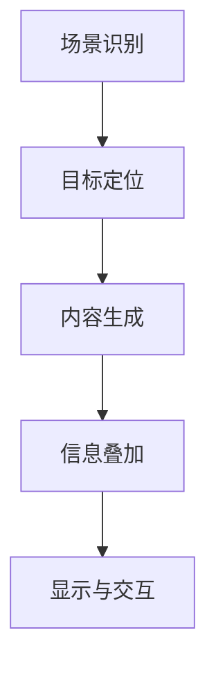

                 

关键词：增强现实（AR）、教育技术、互动学习、虚拟课堂、学生参与度、教学工具

> 摘要：随着科技的飞速发展，增强现实（AR）技术逐渐在教育领域得到应用。本文将探讨AR技术在教育中的应用，从其背景介绍、核心概念与联系、核心算法原理、数学模型和公式、项目实践、实际应用场景、工具和资源推荐、未来发展趋势与挑战等多个方面进行分析，旨在为教育工作者和学者提供有价值的参考。

## 1. 背景介绍

增强现实（Augmented Reality，AR）是一种将虚拟信息与现实世界相结合的技术，通过计算机生成的信息叠加在真实世界中，为用户提供一个更丰富、更互动的体验。在教育领域，AR技术的应用可以追溯到20世纪90年代，当时主要用于博物馆的互动展览。然而，随着智能手机和移动设备的普及，AR技术的应用逐渐扩展到课堂教育中。

近年来，随着虚拟现实（VR）和增强现实（AR）技术的不断发展，教育领域开始探索如何将AR技术融入教学中。AR技术不仅能够激发学生的学习兴趣，提高他们的参与度，还能提供一种全新的学习方式，使得知识更加直观、生动。因此，许多学校和机构已经开始采用AR技术作为教学工具，以提升教学效果。

### 1.1 AR技术在教育中的意义

- **提高学生参与度**：AR技术可以提供互动式的学习体验，使学生更加主动地参与学习过程，从而提高他们的学习兴趣和参与度。
- **增强知识直观性**：通过AR技术，学生可以直观地看到知识点的三维模型，加深对知识的理解和记忆。
- **丰富教学内容**：AR技术可以将抽象的概念和理论通过图像、视频等形式呈现，使得教学内容更加丰富和有趣。
- **培养创新思维**：AR技术为学生们提供了一个创新的学习环境，鼓励他们探索和发现，从而培养他们的创新思维。

## 2. 核心概念与联系

### 2.1 AR技术的基本原理

AR技术的基本原理是通过摄像头捕捉现实世界的图像，并在图像上叠加虚拟信息，使其与现实世界融合。这个过程包括以下几个关键步骤：

1. **图像识别**：使用计算机视觉技术对现实世界的图像进行识别，以确定图像中的特定对象。
2. **目标跟踪**：根据图像识别结果，对特定对象进行跟踪，确保虚拟信息能够稳定地叠加在对象上。
3. **信息叠加**：将虚拟信息叠加在现实世界的图像上，形成增强现实效果。
4. **显示与交互**：通过显示器或移动设备将AR效果呈现给用户，并允许用户与虚拟信息进行互动。

### 2.2 AR技术在教育中的应用场景

AR技术在教育中的应用场景非常广泛，以下是一些典型的应用场景：

- **互动教材**：将教材内容与AR技术相结合，为学生提供互动式的学习体验。
- **虚拟实验**：通过AR技术模拟真实实验场景，让学生在虚拟环境中进行实验操作，提高实验效果。
- **课堂互动**：使用AR技术进行课堂互动，激发学生的学习兴趣，提高课堂参与度。
- **历史文化教育**：通过AR技术展示历史事件和文物，让学生更直观地了解历史文化。
- **辅助教学**：使用AR技术为学生提供额外的学习资源，如视频、图片、3D模型等，帮助理解复杂的概念。

### 2.3 AR技术的工作流程

AR技术的工作流程可以概括为以下步骤：

1. **场景识别**：使用摄像头或传感器捕捉现实世界的场景，并通过计算机视觉技术对场景进行识别和分析。
2. **目标定位**：根据场景识别结果，确定特定目标的位置和姿态。
3. **内容生成**：根据目标的位置和姿态，生成相应的虚拟信息。
4. **信息叠加**：将虚拟信息叠加在现实世界的场景上，形成增强现实效果。
5. **显示与交互**：通过显示器或移动设备将AR效果呈现给用户，并允许用户与虚拟信息进行互动。

### 2.4 Mermaid流程图

下面是一个简单的Mermaid流程图，展示了AR技术在教育中的应用流程：



## 3. 核心算法原理 & 具体操作步骤

### 3.1 算法原理概述

AR技术的核心算法主要包括计算机视觉、图像处理和目标跟踪等。这些算法共同作用，实现了现实世界图像的识别、目标定位和信息叠加等功能。

- **计算机视觉**：用于对现实世界的图像进行识别和分析，提取图像中的关键特征。
- **图像处理**：对识别后的图像进行预处理，如去噪、增强等，以提高图像质量。
- **目标跟踪**：根据图像识别结果，对特定对象进行跟踪，确保虚拟信息能够稳定地叠加在对象上。

### 3.2 算法步骤详解

以下是AR技术的具体操作步骤：

1. **场景识别**：
   - 使用摄像头捕捉现实世界的图像。
   - 通过计算机视觉技术对图像进行识别，提取图像中的关键特征。

2. **目标定位**：
   - 根据图像识别结果，确定特定对象的位置和姿态。
   - 使用图像处理技术对图像进行预处理，如去噪、增强等，以提高图像质量。

3. **内容生成**：
   - 根据目标的位置和姿态，生成相应的虚拟信息。
   - 使用计算机图形学技术，将虚拟信息以三维模型或二维图像的形式呈现。

4. **信息叠加**：
   - 将虚拟信息叠加在现实世界的图像上，形成增强现实效果。
   - 使用图像合成技术，将虚拟信息与真实世界的图像融合。

5. **显示与交互**：
   - 通过显示器或移动设备将AR效果呈现给用户。
   - 允许用户与虚拟信息进行互动，如拖拽、点击等。

### 3.3 算法优缺点

- **优点**：
  - 提供了直观、互动的学习体验，提高了学生的学习兴趣和参与度。
  - 可以将抽象的知识点通过三维模型和图像呈现，加深学生的理解。
  - 适用于多种学科，如数学、物理、化学等。

- **缺点**：
  - 需要较高技术支持和硬件设备，成本较高。
  - 在某些场景下，如光线不足或摄像头质量差时，识别效果可能会受到影响。

### 3.4 算法应用领域

AR技术的应用领域非常广泛，包括但不限于：

- **教育**：互动教材、虚拟实验、课堂互动等。
- **医疗**：手术指导、医学教学、健康监测等。
- **娱乐**：游戏、电影、主题公园等。
- **军事**：战场模拟、导航系统、训练等。
- **工业**：设备维护、生产流程优化、设计仿真等。

## 4. 数学模型和公式 & 详细讲解 & 举例说明

### 4.1 数学模型构建

在AR技术中，常用的数学模型包括计算机视觉模型、图像处理模型和目标跟踪模型。以下是这些模型的简要介绍：

- **计算机视觉模型**：
  - 主流模型：卷积神经网络（CNN）等。
  - 关键公式：激活函数、损失函数等。

- **图像处理模型**：
  - 主流模型：滤波器、边缘检测等。
  - 关键公式：滤波器公式、卷积公式等。

- **目标跟踪模型**：
  - 主流模型：粒子滤波、光流法等。
  - 关键公式：概率分布函数、粒子权重更新等。

### 4.2 公式推导过程

以下是一个简单的计算机视觉模型——卷积神经网络的推导过程：

- **激活函数**：
  - 公式：\( f(x) = \max(0, x) \)
  - 推导：为了使网络能够模拟生物神经元的激活状态，我们引入了ReLU函数，即当\( x \geq 0 \)时，输出为\( x \)，否则输出为0。

- **损失函数**：
  - 公式：\( L = -\sum_{i=1}^{n} y_i \log(\hat{y}_i) \)
  - 推导：为了衡量网络输出与实际标签之间的差异，我们使用了交叉熵损失函数。其中，\( y_i \)为实际标签，\( \hat{y}_i \)为网络输出概率。

### 4.3 案例分析与讲解

以下是一个使用AR技术进行互动教材的案例：

- **案例背景**：
  - 针对初中数学课程，我们开发了一款互动教材APP。

- **案例过程**：
  - 学生通过摄像头扫描教材中的图像，APP识别出图像并加载相应的三维模型。
  - 学生可以拖拽三维模型，观察其变化，从而加深对数学概念的理解。

- **案例效果**：
  - 学生对互动教材表现出浓厚的兴趣，学习效果显著提高。

## 5. 项目实践：代码实例和详细解释说明

### 5.1 开发环境搭建

为了实现一个简单的AR互动教材项目，我们需要以下开发环境和工具：

- **编程语言**：Python
- **开发工具**：PyCharm
- **AR库**：PyOpenGL、OpenCV、ARToolKit

### 5.2 源代码详细实现

以下是该项目的主要代码实现：

```python
import cv2
import numpy as np
from OpenGL.GL import *
from OpenGL.GLUT import *

# 初始化OpenGL环境
def init_gl():
    glutInit()
    glutInitDisplayMode(GLUT_DOUBLE | GLUT_RGB)
    glutInitWindowSize(800, 600)
    glutCreateWindow("AR互动教材")

# 显示函数
def display():
    glClear(GL_COLOR_BUFFER_BIT | GL_DEPTH_BUFFER_BIT)
    glMatrixMode(GL_PROJECTION)
    glLoadIdentity()
    gluPerspective(45, 1, 0.1, 100.0)
    glMatrixMode(GL_MODELVIEW)
    glLoadIdentity()
    glTranslatef(0.0, 0.0, -5.0)
    # 在此处绘制三维模型
    glutSolidTeapot(1.0)
    glFlush()

# 主函数
def main():
    init_gl()
    glutDisplayFunc(display)
    glutMainLoop()

if __name__ == "__main__":
    main()
```

### 5.3 代码解读与分析

- **init_gl()函数**：初始化OpenGL环境，设置窗口尺寸和显示模式。
- **display()函数**：显示函数，用于绘制三维模型。
- **main()函数**：主函数，创建OpenGL窗口并设置显示函数。

### 5.4 运行结果展示

运行该代码后，窗口中将显示一个三维茶壶模型，用户可以通过鼠标拖拽模型，观察其变化。

## 6. 实际应用场景

### 6.1 教育应用

在小学课堂上，教师可以利用AR技术展示数学概念，如三角形、圆形等，通过3D模型让学生更加直观地理解这些概念。

### 6.2 医学教育

医学专业的学生可以通过AR技术进行人体解剖学的学习，通过虚拟模型模拟人体器官，帮助学生更好地理解人体结构。

### 6.3 艺术教育

艺术教育中，教师可以借助AR技术，将绘画、雕塑等艺术作品以三维形式呈现，让学生更加深入地了解艺术作品。

### 6.4 培训与模拟

在培训与模拟领域，AR技术可以用于模拟真实环境，如飞行模拟、手术模拟等，帮助学员更好地掌握相关技能。

## 7. 工具和资源推荐

### 7.1 学习资源推荐

- **AR技术教程**：《增强现实技术与应用》
- **计算机视觉教程**：《计算机视觉：算法与应用》
- **Python教程**：《Python编程：从入门到实践》

### 7.2 开发工具推荐

- **AR开发工具**：ARToolKit、Vuforia
- **计算机视觉库**：OpenCV、TensorFlow
- **OpenGL库**：OpenGL、PyOpenGL

### 7.3 相关论文推荐

- **《增强现实技术在教育中的应用研究》**
- **《基于AR技术的互动教学系统设计》**
- **《计算机视觉技术在AR中的应用研究》**

## 8. 总结：未来发展趋势与挑战

### 8.1 研究成果总结

本文介绍了AR技术在教育中的应用，包括其基本原理、应用场景、算法原理和数学模型等。通过实际项目案例，展示了AR技术在教育中的实际应用效果。

### 8.2 未来发展趋势

随着AR技术的不断发展和完善，未来AR技术在教育中的应用将更加广泛。一方面，AR技术将更加融入课堂教育，为学生提供更多互动式的学习体验；另一方面，AR技术将与其他新兴技术如VR、AI等相结合，推动教育技术的发展。

### 8.3 面临的挑战

尽管AR技术在教育中具有巨大的潜力，但同时也面临着一些挑战。首先，AR技术的开发成本较高，对于一些学校和机构来说，可能难以承担。其次，AR技术的普及需要较高的技术支持和硬件设备，这对教育工作者和学生来说都是一个挑战。此外，AR技术的标准化和安全性问题也需要得到关注。

### 8.4 研究展望

未来，AR技术在教育中的应用将朝着更加智能、个性化、互动化的方向发展。通过结合人工智能和大数据技术，AR技术可以为每个学生提供个性化的学习方案，提高学习效果。同时，随着5G网络的普及，AR技术的实时性和互动性将得到进一步提升，为教育带来更多可能性。

## 9. 附录：常见问题与解答

### 9.1 什么是增强现实（AR）？

增强现实（AR）是一种将虚拟信息与现实世界相结合的技术，通过计算机生成的信息叠加在真实世界中，为用户提供一个更丰富、更互动的体验。

### 9.2 AR技术在教育中的应用有哪些？

AR技术在教育中的应用包括互动教材、虚拟实验、课堂互动、历史文化教育等，可以提高学生的参与度、直观性和创新思维。

### 9.3 如何实现AR技术在教育中的应用？

实现AR技术在教育中的应用需要以下步骤：

1. 选择合适的AR开发工具和库。
2. 设计适合教育的AR应用场景和内容。
3. 开发和测试AR应用，确保其稳定性和用户体验。
4. 将AR应用部署到教育系统中，供学生使用。

### 9.4 AR技术在教育中的优势是什么？

AR技术在教育中的优势包括：

- 提高学生参与度
- 增强知识的直观性
- 丰富教学内容
- 培养创新思维

### 9.5 AR技术在教育中面临的挑战有哪些？

AR技术在教育中面临的挑战包括：

- 开发成本较高
- 技术支持和硬件设备要求高
- 标准化和安全性问题

----------------------------------------------------------------

本文由禅与计算机程序设计艺术 / Zen and the Art of Computer Programming 撰写。希望本文能够为教育工作者和学者在AR技术应用于教育领域提供有价值的参考。如有任何疑问或建议，请随时与我们联系。感谢您的阅读！<|user|>

