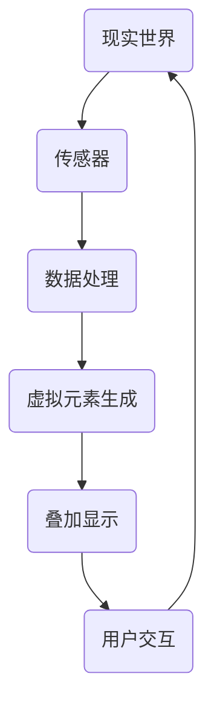

                 

关键词：增强现实（AR），虚拟融合，技术应用，开发工具，未来展望

> 摘要：随着科技的飞速发展，增强现实（AR）技术逐渐成为当今信息技术领域的重要前沿。本文旨在探讨AR技术的背景、核心概念、应用场景以及未来发展趋势，旨在为读者提供全面而深刻的理解。

## 1. 背景介绍

### 1.1 增强现实（AR）的起源与发展

增强现实（AR）技术的概念最早可以追溯到20世纪50年代。然而，真正意义上的突破发生在21世纪初，随着智能手机和平板电脑的普及，AR技术开始走入公众视野。近年来，AR技术在多个领域取得了显著进展，从简单的游戏应用发展到复杂的企业级解决方案，其对现实与虚拟的融合展现出了巨大的潜力。

### 1.2 当前AR技术的应用场景

当前，AR技术已在多个领域得到广泛应用，包括但不限于娱乐、医疗、教育、零售和制造业。例如，在娱乐领域，AR游戏如《宝可梦GO》吸引了数亿玩家；在教育领域，AR技术提供了互动式学习体验，帮助学生更好地理解抽象概念；在医疗领域，AR技术被用于手术导航和患者教育。

## 2. 核心概念与联系

为了更好地理解AR技术，我们需要探讨其核心概念以及它们之间的联系。

### 2.1 核心概念

- **现实世界**：指我们直观感知的物质世界，包括声音、图像、触感等。
- **虚拟世界**：通过计算机生成的一个模拟环境，可以包括图像、声音、动作等。

### 2.2 关系

- **叠加**：在现实世界中，AR技术通过在用户视野中叠加虚拟元素，使其与现实环境相互融合。
- **交互**：用户可以通过触摸、手势等方式与虚拟世界进行交互。

下面是一个使用Mermaid绘制的AR技术架构流程图：



## 3. 核心算法原理 & 具体操作步骤

### 3.1 算法原理概述

AR技术中的核心算法主要包括图像识别、定位跟踪、虚拟元素渲染等。

- **图像识别**：通过计算机视觉算法，识别现实世界中的物体或场景。
- **定位跟踪**：利用传感器数据，确定虚拟元素在现实世界中的位置和姿态。
- **虚拟元素渲染**：将虚拟元素渲染到用户的视野中。

### 3.2 算法步骤详解

1. **图像识别**：
   - **预处理**：对采集到的图像进行滤波、增强等处理。
   - **特征提取**：提取图像的显著特征，如颜色、形状、纹理等。
   - **匹配与分类**：使用机器学习算法，对提取的特征进行匹配和分类。

2. **定位跟踪**：
   - **初始化**：根据初始图像识别结果，确定虚拟元素的初始位置和姿态。
   - **跟踪更新**：利用传感器数据，对虚拟元素的位置和姿态进行实时更新。

3. **虚拟元素渲染**：
   - **模型加载**：加载虚拟元素的3D模型。
   - **光照计算**：根据现实环境的光照条件，对虚拟元素进行光照计算。
   - **渲染输出**：将虚拟元素渲染到用户的视野中。

### 3.3 算法优缺点

**优点**：
- **沉浸感强**：AR技术能够提供更加真实的交互体验，提高用户的参与度。
- **多功能性**：AR技术可以应用于多个领域，具有广泛的应用前景。

**缺点**：
- **计算复杂度高**：AR技术需要处理大量的图像数据，对计算能力要求较高。
- **准确性受限**：在复杂的环境下，AR技术的准确性可能会受到限制。

### 3.4 算法应用领域

AR技术已广泛应用于多个领域，包括但不限于：
- **娱乐**：AR游戏、互动广告等。
- **医疗**：手术导航、患者教育等。
- **教育**：互动教学、虚拟实验等。
- **零售**：虚拟试衣、商品展示等。
- **制造业**：设备维护、远程协作等。

## 4. 数学模型和公式 & 详细讲解 & 举例说明

### 4.1 数学模型构建

AR技术中的数学模型主要包括图像识别模型、定位跟踪模型和虚拟元素渲染模型。

- **图像识别模型**：常用的模型包括卷积神经网络（CNN）和深度学习模型。
- **定位跟踪模型**：常用的模型包括卡尔曼滤波器、粒子滤波器和视觉SLAM（同步定位与映射）。
- **虚拟元素渲染模型**：常用的模型包括三维建模、三维渲染和光照模型。

### 4.2 公式推导过程

以卷积神经网络（CNN）为例，其基本公式如下：

$$
h_{\theta}(x) = \text{sign}(\theta_0 + \theta_1x_1 + \theta_2x_2 + ... + \theta_nx_n)
$$

其中，$h_{\theta}(x)$表示输出结果，$x_1, x_2, ..., x_n$表示输入特征，$\theta_0, \theta_1, ..., \theta_n$表示权重。

### 4.3 案例分析与讲解

以下是一个简单的AR应用案例：使用智能手机进行图像识别并叠加虚拟元素。

1. **图像识别**：
   - **预处理**：对采集到的图像进行滤波和灰度化处理。
   - **特征提取**：使用SIFT（尺度不变特征变换）算法提取特征点。
   - **匹配与分类**：使用KNN（K近邻）算法对特征点进行匹配和分类。

2. **定位跟踪**：
   - **初始化**：根据匹配结果，确定虚拟元素的初始位置和姿态。
   - **跟踪更新**：使用卡尔曼滤波器对虚拟元素的位置和姿态进行实时更新。

3. **虚拟元素渲染**：
   - **模型加载**：加载虚拟元素的3D模型。
   - **光照计算**：根据现实环境的光照条件，对虚拟元素进行光照计算。
   - **渲染输出**：将虚拟元素渲染到用户的视野中。

## 5. 项目实践：代码实例和详细解释说明

### 5.1 开发环境搭建

1. 安装Python环境。
2. 安装OpenCV、Pillow和NumPy等依赖库。

### 5.2 源代码详细实现

以下是一个简单的Python代码示例，用于实现图像识别和虚拟元素叠加：

```python
import cv2
import numpy as np
from matplotlib import pyplot as plt

# 读取图像
image = cv2.imread('example.jpg')

# 图像预处理
gray = cv2.cvtColor(image, cv2.COLOR_BGR2GRAY)
blurred = cv2.GaussianBlur(gray, (5, 5), 0)

# 特征提取
sift = cv2.xfeatures2d.SIFT_create()
keypoints, descriptors = sift.detectAndCompute(blurred, None)

# 匹配与分类
# 此处省略具体代码

# 虚拟元素渲染
# 此处省略具体代码

# 显示结果
plt.imshow(image)
plt.show()
```

### 5.3 代码解读与分析

1. **图像预处理**：对采集到的图像进行滤波和灰度化处理，以提高图像识别的准确性。
2. **特征提取**：使用SIFT算法提取图像的特征点。
3. **匹配与分类**：使用KNN算法对特征点进行匹配和分类。
4. **虚拟元素渲染**：根据匹配结果，加载虚拟元素的3D模型，进行光照计算和渲染输出。

## 6. 实际应用场景

### 6.1 娱乐

AR技术在娱乐领域得到了广泛应用，如AR游戏、互动广告等。例如，《宝可梦GO》通过AR技术将虚拟的宝可梦与现实世界中的场景相结合，为玩家带来了全新的娱乐体验。

### 6.2 教育

AR技术在教育领域也有广泛的应用，如互动教学、虚拟实验等。通过AR技术，学生可以更加直观地理解抽象概念，提高学习兴趣和效果。

### 6.3 医疗

AR技术在医疗领域主要用于手术导航和患者教育。例如，医生可以通过AR眼镜实时查看患者的病历信息和手术指导，提高手术的成功率。

### 6.4 零售

AR技术在零售领域主要用于虚拟试衣、商品展示等。例如，消费者可以通过AR技术在家中试穿衣服，提高购物的满意度。

### 6.5 制造业

AR技术在制造业主要用于设备维护和远程协作。例如，工程师可以通过AR眼镜查看设备的工作状态和维修指南，提高维护效率。

## 7. 工具和资源推荐

### 7.1 学习资源推荐

- 《增强现实技术导论》（书名）
- 《计算机视觉：算法与应用》（书名）

### 7.2 开发工具推荐

- ARKit（苹果公司）
- ARCore（谷歌公司）
- Unity（游戏引擎）

### 7.3 相关论文推荐

- 《增强现实技术在教育中的应用研究》（论文标题）
- 《基于增强现实的医疗手术导航系统研究》（论文标题）

## 8. 总结：未来发展趋势与挑战

### 8.1 研究成果总结

近年来，AR技术在图像识别、定位跟踪、虚拟元素渲染等方面取得了显著进展，已在多个领域得到了广泛应用。

### 8.2 未来发展趋势

未来，AR技术将继续向高精度、高实时性和低成本的方向发展。随着5G技术的普及，AR技术将在更多领域得到应用，如远程办公、智慧城市等。

### 8.3 面临的挑战

尽管AR技术取得了显著进展，但仍然面临一些挑战，如计算复杂度高、准确性受限等。未来，需要进一步优化算法和硬件，以提高AR技术的性能和可靠性。

### 8.4 研究展望

随着技术的不断进步，AR技术有望在未来实现更广泛的应用，如虚拟现实（VR）、人工智能（AI）等领域的融合。这将为我们带来更加丰富和多样的交互体验。

## 9. 附录：常见问题与解答

### 9.1 增强现实（AR）与虚拟现实（VR）的区别是什么？

AR技术将虚拟元素叠加到现实世界中，VR技术则完全替换现实世界，将用户带入一个虚拟环境中。

### 9.2 AR技术的核心算法有哪些？

AR技术的核心算法包括图像识别、定位跟踪、虚拟元素渲染等。

### 9.3 如何评估AR技术的准确性？

可以采用误差分析、鲁棒性测试等方法来评估AR技术的准确性。

### 9.4 AR技术在教育领域有哪些应用？

AR技术在教育领域可以用于互动教学、虚拟实验等，提高学生的学习效果和兴趣。

### 9.5 AR技术的未来发展方向是什么？

未来，AR技术将继续向高精度、高实时性和低成本的方向发展，并在更多领域得到应用。
----------------------------------------------------------------
**作者：禅与计算机程序设计艺术 / Zen and the Art of Computer Programming** 

[END OF ARTICLE]

