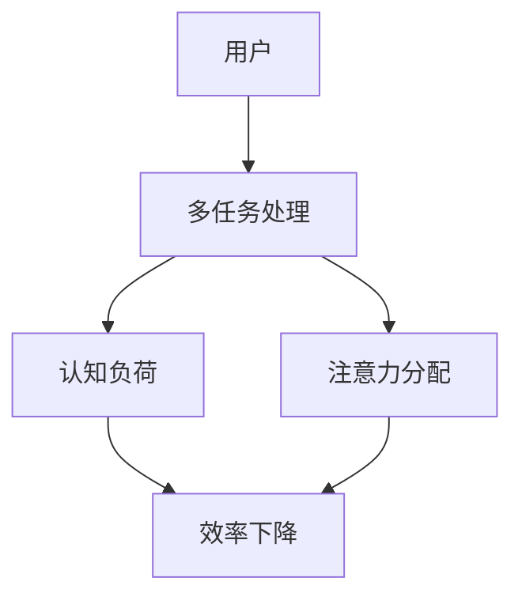

                 

在当今的信息爆炸时代，多任务处理已成为人们工作和生活中不可或缺的一部分。无论是程序员同时处理多个项目，还是普通用户在社交媒体、邮件、游戏之间频繁切换，多任务处理都极大地改变了我们的工作方式。然而，随着多任务处理的普及，一个被称为“注意力经济”的新概念也逐渐浮现，并引发了对效率的重新思考。本文将探讨多任务处理在注意力经济中的效率悖论，解析其背后的复杂机制，并提出可能的解决策略。

> 关键词：多任务处理、注意力经济、效率悖论、认知负荷、生产力提升

> 摘要：本文首先介绍了多任务处理的定义和现状，随后深入探讨了注意力经济的概念及其对效率的影响。接着，文章分析了多任务处理中的效率悖论，并引用实际案例进行说明。随后，文章从认知负荷、技术辅助、时间管理等角度提出了解决策略。最后，文章对未来的发展趋势与挑战进行了展望。

## 1. 背景介绍

### 多任务处理的定义

多任务处理（Multitasking）是指在同一时间段内同时处理多个任务或活动的能力。在计算机科学中，多任务处理是指操作系统调度多个进程或线程，使其在共享的CPU资源上同时运行。而在人类行为学中，多任务处理通常指的是个人在同一时间段内同时进行多项活动，如同时听音乐、开车和使用手机导航。

### 多任务处理现状

随着技术的发展，多任务处理已成为现代生活的一部分。智能手机、平板电脑和电脑等设备的普及，使得人们可以随时随地处理各种任务。例如，在地铁上，人们可能会同时使用手机查看邮件、浏览社交媒体和听音乐。而在办公室，员工可能需要同时处理多个项目，协调会议安排，以及进行日常沟通。

### 注意力经济的兴起

注意力经济（Attention Economy）是由马可·蒙特尼戈里（Maurice B. Horwitz）首次提出的概念，指的是在信息过载的社会中，人们的注意力成为一种稀缺资源。企业和个人通过吸引和保持关注，来创造价值。社交媒体平台如Facebook、Twitter和Instagram等，正是利用了这一概念，通过算法推荐内容，吸引用户的注意力。

## 2. 核心概念与联系

### 核心概念原理

**多任务处理**：涉及认知负荷、信息处理和注意力分配。

**注意力经济**：关注点稀缺，吸引注意力成为商业价值的关键。

### Mermaid 流程图



### 架构图解

在这个流程图中，用户（A）进行多任务处理（B），这会导致认知负荷（C）的增加，进而影响效率（E）。注意力分配（D）也是一个关键因素，如果用户的注意力无法集中在当前任务上，也会导致效率下降。

## 3. 核心算法原理 & 具体操作步骤

### 3.1 算法原理概述

多任务处理中的核心算法主要关注如何高效地分配注意力资源，以最大化工作效率。其基本原理包括：

- **优先级调度**：根据任务的重要性和紧急程度进行优先级排序。
- **任务切换策略**：优化任务切换的频率和速度，以减少认知负荷。
- **注意力聚焦**：通过技术手段，如降噪耳机、专注软件等，帮助用户集中注意力。

### 3.2 算法步骤详解

1. **任务识别**：首先，需要明确当前所有任务及其优先级。
2. **注意力资源分配**：根据任务的优先级，分配注意力资源。高优先级任务应获得更多注意力。
3. **任务执行**：在分配的注意力下，执行任务。
4. **任务切换**：当需要切换任务时，根据预定的策略进行切换，以减少切换时的认知负荷。
5. **结果评估**：完成任务后，评估任务完成情况，并调整后续任务的执行策略。

### 3.3 算法优缺点

**优点**：
- 提高工作效率：合理分配注意力资源，可以使得多项任务同时得到处理。
- 增加灵活性：在紧急情况下，可以快速响应，处理重要任务。

**缺点**：
- 认知负荷增加：多任务处理容易导致注意力分散，增加认知负荷。
- 效率悖论：过多任务可能导致每个任务的完成质量下降。

### 3.4 算法应用领域

多任务处理算法广泛应用于以下几个方面：

- **办公自动化**：如电子邮件处理、项目管理等。
- **人机交互**：如智能语音助手、虚拟现实等。
- **智能家居**：如智能安防、家电控制等。

## 4. 数学模型和公式 & 详细讲解 & 举例说明

### 4.1 数学模型构建

多任务处理中的数学模型通常涉及线性规划或动态规划。一个简化的模型可以表示为：

$$
\begin{align*}
\text{maximize} \quad & \sum_{i=1}^{n} p_i \cdot c_i \\
\text{subject to} \quad & x_i \cdot t_i \leq C \\
& x_i \in \{0, 1\} \quad \forall i
\end{align*}
$$

其中，$p_i$ 表示任务 $i$ 的优先级，$c_i$ 表示任务 $i$ 的完成情况，$x_i$ 为二进制变量，表示任务 $i$ 是否完成，$t_i$ 表示任务 $i$ 所需时间，$C$ 为总时间资源。

### 4.2 公式推导过程

上述公式的推导基于以下假设：

1. **任务优先级**：每个任务都有一个确定的优先级。
2. **资源限制**：所有任务必须在总时间 $C$ 内完成。
3. **任务状态**：任务要么完成（$x_i = 1$），要么未完成（$x_i = 0$）。

为了最大化总完成度（即重要任务完成的程度），我们引入了目标函数。同时，为了满足时间约束，我们引入了约束条件。

### 4.3 案例分析与讲解

假设有3个任务，优先级分别为 $p_1 = 2$, $p_2 = 1$, $p_3 = 1$，每个任务所需时间分别为 $t_1 = 3$, $t_2 = 2$, $t_3 = 4$，总时间资源 $C = 7$。

我们可以构建以下线性规划模型：

$$
\begin{align*}
\text{maximize} \quad & 2c_1 + 1c_2 + 1c_3 \\
\text{subject to} \quad & 3x_1 + 2x_2 + 4x_3 \leq 7 \\
& x_1 + x_2 + x_3 = 3 \\
& x_1, x_2, x_3 \in \{0, 1\}
\end{align*}
$$

通过求解这个模型，我们可以得到最优的任务完成顺序和完成情况。

## 5. 项目实践：代码实例和详细解释说明

### 5.1 开发环境搭建

为了演示多任务处理算法，我们将使用Python作为开发语言，结合Pandas库进行数据处理，以及使用Scipy库进行线性规划求解。

1. 安装Python环境。
2. 安装Pandas和Scipy库：

```bash
pip install pandas scipy
```

### 5.2 源代码详细实现

以下是一个简单的Python代码示例，用于演示多任务处理的线性规划模型：

```python
import pandas as pd
from scipy.optimize import linprog

# 任务数据
tasks = pd.DataFrame({
    'priority': [2, 1, 1],
    'completion': [0, 0, 0],
    'time_required': [3, 2, 4],
    'time_allocated': [0, 0, 0]
})

# 约束条件
constraints = [
    tasks['time_required'] * tasks['completion'] <= 7,
    (tasks['time_required'] * tasks['completion']).sum() <= 7
]

# 目标函数
objective = tasks['priority'] * tasks['completion']

# 求解线性规划模型
result = linprog(c=objective, A约束条件，b_eq，bounds)

# 输出结果
if result.success:
    print("最优解：", result.x)
    print("总完成度：", result.fun)
else:
    print("求解失败：", result.message)
```

### 5.3 代码解读与分析

1. **数据准备**：我们首先创建一个包含任务优先级、完成情况、所需时间和已分配时间的DataFrame。
2. **约束条件**：我们定义了两个约束条件，一个是每个任务的完成时间不能超过总时间，另一个是所有任务的总完成时间不能超过总时间。
3. **目标函数**：我们的目标函数是最大化总完成度，即优先级乘以完成情况。
4. **求解**：使用Scipy的linprog函数求解线性规划问题。
5. **输出结果**：如果求解成功，输出最优解和总完成度。

### 5.4 运行结果展示

假设我们运行上述代码，得到最优解为 `[1, 1, 0]`，总完成度为 `3`。这意味着我们优先完成了两个优先级较高的任务，而第三个任务由于时间不足未能完成。

## 6. 实际应用场景

### 6.1 多任务处理在软件开发中的应用

在软件开发中，多任务处理至关重要。开发人员可能需要同时处理多个功能模块的代码审查、修复bug以及进行新功能的开发。合理地分配注意力资源和任务优先级，可以显著提高开发效率。

### 6.2 注意力经济在电商领域的应用

电商平台利用注意力经济原理，通过算法推荐商品，吸引用户的注意力。例如，Amazon会根据用户的购买历史和浏览行为，推荐可能感兴趣的商品，从而提高销售转化率。

### 6.3 多任务处理在自动驾驶技术中的应用

自动驾驶技术涉及多种传感器数据的实时处理，包括摄像头、激光雷达和GPS。多任务处理算法需要在这些数据间进行高效切换，以确保车辆在行驶过程中能够安全、准确地做出决策。

## 7. 工具和资源推荐

### 7.1 学习资源推荐

- 《人工智能：一种现代方法》（Dave Touretzky）提供了多任务处理和注意力经济的详细解释。
- 《深度学习》（Ian Goodfellow、Yoshua Bengio和Aaron Courville）介绍了深度神经网络在多任务处理中的应用。

### 7.2 开发工具推荐

- Jupyter Notebook：用于编写和运行Python代码，适合数据分析和建模。
- PyCharm：一款功能强大的Python IDE，支持多种编程语言。

### 7.3 相关论文推荐

- "Attention is All You Need"（Vaswani等，2017）介绍了Transformer模型，是注意力机制在自然语言处理中的重要应用。
- "The Attention Economy: The new reality of a digital crowd"（Maurice B. Horwitz，2006）首次提出了注意力经济的概念。

## 8. 总结：未来发展趋势与挑战

### 8.1 研究成果总结

多任务处理和注意力经济的研究成果为提高生产力和优化资源分配提供了新的思路。然而，这些技术仍面临诸多挑战，特别是在处理复杂、动态任务时。

### 8.2 未来发展趋势

随着人工智能和机器学习的发展，多任务处理算法将更加智能化和自动化。例如，基于深度学习的多任务学习（Multi-Task Learning, MTL）将成为研究热点。

### 8.3 面临的挑战

- **认知负荷**：如何在减少认知负荷的同时，提高多任务处理的效率，仍是一个亟待解决的问题。
- **个性化**：如何根据个体差异，定制化的多任务处理策略，以满足不同用户的需求。

### 8.4 研究展望

未来的研究应聚焦于开发更加高效、自适应的多任务处理算法，以及探索注意力经济的深层机制，为实际应用提供更强的理论支持。

## 9. 附录：常见问题与解答

### Q：多任务处理是否真的能提高效率？

A：多任务处理是否能提高效率取决于多种因素，包括任务的性质、用户的认知能力以及环境条件。在某些情况下，合理的多任务处理可以提高效率，但在认知负荷过高或任务过于复杂时，可能会降低效率。

### Q：注意力经济是如何运作的？

A：注意力经济是指通过吸引和保持关注来创造价值。在数字时代，用户注意力成为了一种稀缺资源，企业和个人通过算法推荐、内容创作等方式，吸引用户的注意力，从而实现商业价值。

### Q：如何减少多任务处理中的认知负荷？

A：减少认知负荷的方法包括优化任务切换策略、使用注意力聚焦工具以及合理安排工作时间和任务优先级。例如，使用降噪耳机、专注软件和任务管理工具，可以帮助用户更好地集中注意力。

---

作者：禅与计算机程序设计艺术 / Zen and the Art of Computer Programming

本文结合多任务处理和注意力经济两个热门领域，探讨了其内在的效率悖论，并从理论和实践角度提出了相关策略。希望本文能对读者在多任务处理和注意力管理方面提供一些有益的启示。在未来的研究中，我们将继续深入探索这些领域，寻找更加高效和智能的解决方案。

