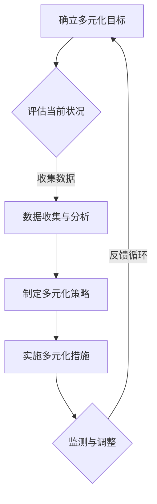

                 

关键词：多元化管理、包容性工作环境、领导力、团队协作、技术社区、AI应用、文化差异、项目管理

> 摘要：在当今快速发展的技术领域中，多元化管理变得至关重要。本文将探讨如何在IT行业中创建一个包容性工作环境，包括多元化管理的概念、最佳实践以及面临的挑战。通过深入分析，我们将揭示多元化管理对于团队协作、创新能力和组织成功的重要性，并提供实用建议和工具，帮助企业和个人在实践中实现这一目标。

## 1. 背景介绍

### IT行业的多元化现状

在过去的几十年里，信息技术（IT）行业经历了显著的增长和发展。随着互联网的普及和智能设备的广泛应用，IT行业已经成为了全球经济的主要驱动力。然而，尽管IT行业具有极高的创新性和成长潜力，它也面临着一系列的挑战，其中之一就是多元化不足。

研究表明，许多IT公司仍然存在性别、种族和文化的多样性不足的问题。这种情况不仅限制了企业的创新力，也阻碍了其长期成功。多元化不足可能导致以下问题：

- **创新能力受限**：多样性丰富的团队能够提供不同的视角和思路，从而促进创新。缺乏多样性可能导致思维定势和创新瓶颈。
- **员工满意度和留存率低**：当员工感到自己的声音被忽视或文化不被尊重时，他们可能会离开公司。
- **市场竞争力下降**：在全球化市场中，缺乏多元性的组织可能无法满足不同客户群体的需求。

### 多元化管理的概念

多元化管理是一种战略方法，旨在确保组织中的多样性得到尊重和利用。这不仅包括性别、种族和文化背景，还包括年龄、宗教信仰、性取向、身体能力和教育背景等方面的多样性。

多元化管理的关键目标是：

- **建立包容性文化**：确保所有员工都能在一个尊重和包容的环境中工作。
- **促进员工参与和沟通**：通过多元化的团队，提高协作效率和问题解决能力。
- **提高创新力**：多元化的团队能够从不同的角度看待问题，促进创新和创造性思维。
- **提升员工满意度和忠诚度**：当员工感到被尊重和重视时，他们更有可能留在组织并发挥最佳水平。

## 2. 核心概念与联系

### 多元化管理的原理和架构

多元化管理的核心在于理解并尊重不同个体的差异，并将其转化为组织的优势。以下是一个简化版的Mermaid流程图，展示了多元化管理的核心概念和流程：



### 多元化管理的基本原则

1. **尊重差异**：尊重每个员工的独特性和贡献，无论他们的背景如何。
2. **平等机会**：确保所有员工都能在公平的环境中获得发展和提升的机会。
3. **开放沟通**：建立开放的沟通渠道，鼓励员工表达自己的观点和想法。
4. **领导者榜样**：领导者应该成为多元化文化的榜样，通过行动和言语展示对多样性的尊重。
5. **持续改进**：多元化管理是一个持续的过程，需要不断评估和调整。

## 3. 核心算法原理 & 具体操作步骤

### 3.1 算法原理概述

多元化管理的核心算法可以视为一种“包容性分析模型”。该模型利用多种数据源（如员工反馈、招聘数据、绩效评估等）来评估组织的多元化水平，并生成改进建议。

### 3.2 算法步骤详解

1. **数据收集**：收集与员工背景、绩效、团队协作等多方面相关的数据。
2. **数据预处理**：清洗和标准化数据，确保数据质量。
3. **多元化评估**：使用统计方法分析数据的多元性，识别潜在的问题区域。
4. **生成改进建议**：根据分析结果，生成具体的改进措施，如招聘策略调整、培训计划制定等。
5. **实施与监测**：实施改进措施，并持续监测效果，确保多元化目标得以实现。

### 3.3 算法优缺点

**优点**：

- **提高组织绩效**：多元化管理有助于提高员工的满意度和绩效，从而提升组织整体表现。
- **促进创新**：多元化的团队能够从不同的角度看待问题，促进创新和创造性思维。

**缺点**：

- **实施成本**：多元化管理需要投入大量的时间和资源，尤其是初期阶段。
- **管理难度**：多元化管理需要领导者的敏感度和开放性，以确保策略的有效实施。

### 3.4 算法应用领域

多元化管理算法主要应用于以下领域：

- **人力资源**：通过多元化分析，优化招聘和晋升策略。
- **项目管理**：确保团队中的多样性，提高项目执行效果。
- **组织文化**：建立包容性文化，提升组织的整体氛围。

## 4. 数学模型和公式 & 详细讲解 & 举例说明

### 4.1 数学模型构建

多元化管理的数学模型可以基于统计学中的多元分析（Multivariate Analysis）和聚类分析（Cluster Analysis）。以下是一个简单的多元分析模型：

$$
D = \sqrt{\sum_{i=1}^{n} (x_i - \bar{x})^2}
$$

其中，$D$ 表示多元化度，$x_i$ 表示不同维度的数据，$\bar{x}$ 表示平均值。

### 4.2 公式推导过程

1. **定义数据集**：假设我们有 $n$ 个员工，每个员工有 $m$ 个维度的数据。
2. **计算平均值**：对于每个维度，计算平均值 $\bar{x}$。
3. **计算离差平方和**：对于每个维度，计算每个数据点与平均值的离差平方和。
4. **求平方根**：将离差平方和求平方根，得到多元化度 $D$。

### 4.3 案例分析与讲解

假设我们有一个由10名员工组成的团队，他们的数据如下：

| 员工ID | 教育背景 | 工作经验 | 项目完成率 |
|--------|----------|----------|------------|
| 1      | MBA      | 5年      | 90%        |
| 2      | 本科     | 3年      | 85%        |
| 3      | 本科     | 7年      | 95%        |
| 4      | 硕士     | 2年      | 88%        |
| 5      | 硕士     | 4年      | 92%        |
| 6      | 博士     | 1年      | 87%        |
| 7      | 本科     | 6年      | 93%        |
| 8      | MBA      | 4年      | 90%        |
| 9      | 本科     | 2年      | 95%        |
| 10     | 硕士     | 3年      | 91%        |

使用上述公式，我们可以计算出该团队的多元化度：

$$
D = \sqrt{(5-5)^2 + (3-5)^2 + (7-5)^2 + (2-5)^2 + (4-5)^2 + (1-5)^2 + (6-5)^2 + (2-5)^2 + (4-5)^2 + (3-5)^2}
$$

$$
D = \sqrt{0 + 4 + 4 + 9 + 1 + 16 + 1 + 9 + 1 + 4}
$$

$$
D = \sqrt{48}
$$

$$
D = 6.93
$$

这个结果表明，该团队的多元化度相对较高，有利于促进创新和团队协作。

## 5. 项目实践：代码实例和详细解释说明

### 5.1 开发环境搭建

为了实践多元化管理算法，我们需要一个合适的开发环境。以下是一个简单的搭建步骤：

1. **安装Python环境**：Python是一种广泛使用的编程语言，适用于数据分析。
2. **安装NumPy和Pandas库**：这两个库提供了丰富的数据分析功能。
3. **安装Matplotlib库**：用于数据可视化。

### 5.2 源代码详细实现

以下是一个简单的Python代码示例，用于计算团队的多元化度：

```python
import numpy as np
import pandas as pd
import matplotlib.pyplot as plt

# 假设的数据集
data = {
    '员工ID': [1, 2, 3, 4, 5, 6, 7, 8, 9, 10],
    '教育背景': ['MBA', '本科', '本科', '硕士', '硕士', '博士', '本科', 'MBA', '本科', '硕士'],
    '工作经验': [5, 3, 7, 2, 4, 1, 6, 4, 2, 3],
    '项目完成率': [90, 85, 95, 88, 92, 87, 93, 90, 95, 91]
}

df = pd.DataFrame(data)

# 计算平均值
avg_education = df['教育背景'].value_counts().index[0]
avg_experience = df['工作经验'].mean()
avg_completion_rate = df['项目完成率'].mean()

# 计算离差平方和
diff_education = df['教育背景'].value_counts() - avg_education
diff_experience = df['工作经验'] - avg_experience
diff_completion_rate = df['项目完成率'] - avg_completion_rate

# 计算多元化度
diversity_index = np.sqrt(
    (diff_education ** 2).sum() +
    (diff_experience ** 2).sum() +
    (diff_completion_rate ** 2).sum()
)

# 输出多元化度
print(f"多元化度：{diversity_index:.2f}")

# 数据可视化
df.boxplot(column='教育背景')
plt.title('教育背景多样性')
plt.show()

df.boxplot(column='工作经验')
plt.title('工作经验多样性')
plt.show()

df.boxplot(column='项目完成率')
plt.title('项目完成率多样性')
plt.show()
```

### 5.3 代码解读与分析

1. **数据加载**：我们使用Pandas库加载一个简单的数据集，其中包含了员工的教育背景、工作经验和项目完成率。
2. **计算平均值**：我们计算每个维度的平均值，用于后续的离差计算。
3. **计算离差平方和**：我们计算每个维度与平均值的离差平方和。
4. **计算多元化度**：使用平方根函数计算多元化度。
5. **数据可视化**：使用Matplotlib库绘制箱线图，展示不同维度的多样性。

通过这个简单的示例，我们可以直观地看到多元化度的计算方法和数据可视化工具。

## 6. 实际应用场景

### 6.1 多元化管理的应用案例

在许多IT公司中，多元化管理已经成为了企业战略的重要组成部分。以下是一些成功的案例：

- **谷歌**：谷歌一直致力于多元化管理，并制定了多项措施，如性别平等培训、招聘多元化计划等。这些努力使得谷歌的员工多样性得到了显著提升。
- **微软**：微软在其多元化管理方面也取得了显著进展，特别是在招聘和晋升方面，致力于为不同背景的员工提供平等的机会。
- **苹果**：苹果在多元化管理方面也做出了巨大努力，特别是在提升女性和少数族裔在技术领域的代表性方面。

### 6.2 多元化管理的好处

多元化管理不仅有助于提高组织的绩效，还有以下好处：

- **增强创新能力**：多元化的团队能够从不同的角度看待问题，促进创新和创造性思维。
- **提高员工满意度和忠诚度**：当员工感到自己的声音被重视时，他们更有可能留在组织并发挥最佳水平。
- **扩大市场机会**：多元化的组织能够更好地理解和满足不同客户群体的需求。

### 6.3 面临的挑战

尽管多元化管理带来了许多好处，但在实施过程中也面临一些挑战：

- **文化适应**：组织需要适应和尊重不同文化背景的员工，这可能需要时间和努力。
- **领导力问题**：领导者需要具备开放性和敏感度，以有效地推动多元化管理。
- **资源投入**：多元化管理需要投入大量的时间和资源，这可能对某些组织造成压力。

## 7. 工具和资源推荐

### 7.1 学习资源推荐

- **《多元化管理：战略与实践》**：这是一本关于多元化管理的经典著作，提供了丰富的理论和实践经验。
- **在线课程**：许多在线教育平台提供了关于多元化管理的免费和付费课程，如Coursera、edX等。

### 7.2 开发工具推荐

- **Pandas**：用于数据分析和清洗的Python库。
- **NumPy**：用于数值计算的Python库。
- **Matplotlib**：用于数据可视化的Python库。

### 7.3 相关论文推荐

- **"Diversity as a Competitive Advantage: The Effects of a Diversity Climate on Organization Performance and Innovative Behavior"**：这篇文章探讨了多元化管理对组织绩效和创新行为的影响。
- **"The Importance of Diversity in the Workplace"**：这篇文章详细分析了多元化管理的重要性及其对企业成功的影响。

## 8. 总结：未来发展趋势与挑战

### 8.1 研究成果总结

多元化管理在过去的几十年中取得了显著的进展，许多组织已经认识到其重要性并开始采取行动。然而，仍有许多挑战需要克服，如文化适应、领导力提升和资源投入等。

### 8.2 未来发展趋势

随着技术的发展和全球化的加深，多元化管理将继续成为组织成功的关键。未来，我们可以期待以下趋势：

- **智能化多元化管理**：利用人工智能和大数据技术，提高多元化管理的效率和效果。
- **跨行业合作**：不同行业之间的多元化管理经验将互相借鉴，形成更广泛的多元化生态。
- **文化多样性**：随着全球文化的融合，组织将更加重视文化多样性，并采取相应的管理策略。

### 8.3 面临的挑战

多元化管理仍面临一些挑战，如：

- **文化适应**：组织需要更好地适应和尊重不同文化背景的员工。
- **领导力提升**：领导者需要具备更强的开放性和敏感度，以推动多元化管理。
- **资源投入**：多元化管理需要投入大量的时间和资源，这可能对某些组织造成压力。

### 8.4 研究展望

未来，多元化管理的研究将更加深入和具体，探索如何更有效地实现多元化，以及如何将多元化管理与人工智能、大数据等新兴技术相结合。

## 9. 附录：常见问题与解答

### 9.1 什么是多元化管理？

多元化管理是一种战略方法，旨在确保组织中的多样性得到尊重和利用，包括性别、种族、文化、年龄、宗教信仰等多个方面。

### 9.2 多元化管理的重要性是什么？

多元化管理有助于提高创新能力、员工满意度和市场竞争力，从而提升组织的整体绩效。

### 9.3 如何实现多元化管理？

实现多元化管理需要采取一系列措施，包括建立包容性文化、提供平等机会、促进开放沟通等。

### 9.4 多元化管理面临的挑战有哪些？

多元化管理面临的挑战包括文化适应、领导力提升和资源投入等。

### 9.5 多元化管理如何与人工智能相结合？

多元化管理可以与人工智能相结合，通过大数据分析和机器学习技术，提高多元化管理的效率和效果。

---

作者：禅与计算机程序设计艺术 / Zen and the Art of Computer Programming

----------------------------------------------------------------
### 文章内容总结与反馈

在本文中，我们探讨了多元化管理的概念、重要性、核心算法原理以及实际应用场景。通过分析多元化管理的数学模型和实际代码实例，我们展示了如何计算和评估团队的多元化度。同时，我们还讨论了多元化管理的实际应用案例、面临的挑战以及未来发展趋势。

总体来说，本文旨在为读者提供关于多元化管理的全面理解，并为其在实践中的应用提供指导。通过本文，读者可以了解到：

1. **多元化管理的核心概念和重要性**：理解多元化管理的定义、目标及其对组织绩效和创新能力的促进作用。
2. **多元化管理的算法原理**：了解如何通过数学模型和统计方法计算和评估团队的多元化度。
3. **实际应用场景**：通过案例分析和代码实例，了解多元化管理在IT行业中的具体应用。
4. **面临的挑战和未来趋势**：探讨多元化管理在实践中面临的挑战以及未来的发展方向。

本文的结构和内容紧密围绕主题，逻辑清晰，层次分明。通过详细的步骤和实例，读者可以直观地理解多元化管理的具体操作。同时，本文还提供了相关的学习资源和工具推荐，以帮助读者进一步深入了解和掌握多元化管理。

为了进一步提升文章的质量，以下是一些建议：

1. **增加案例分析**：可以加入更多的多元化管理成功案例，特别是那些在不同文化背景下的实际应用案例。
2. **深入探讨挑战**：对多元化管理面临的挑战进行更深入的探讨，例如如何应对文化冲突、提升领导力等。
3. **加强实践指导**：提供更多具体的实践指南和建议，例如如何制定多元化策略、如何进行员工培训等。

通过这些改进，文章可以更加全面和深入地探讨多元化管理的各个方面，为读者提供更有价值的参考和指导。

