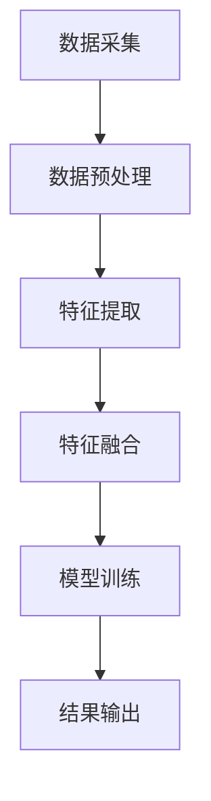
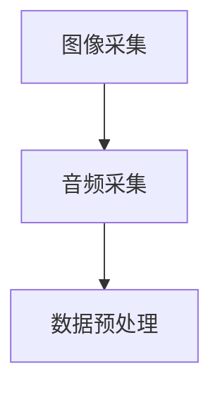
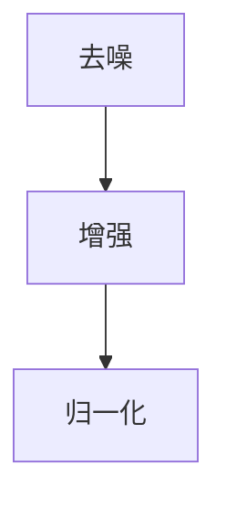
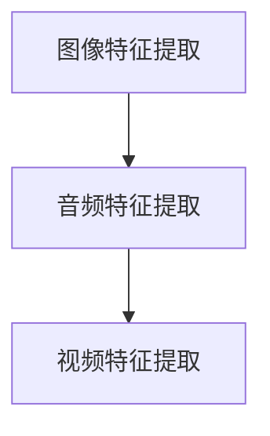
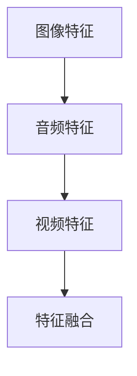
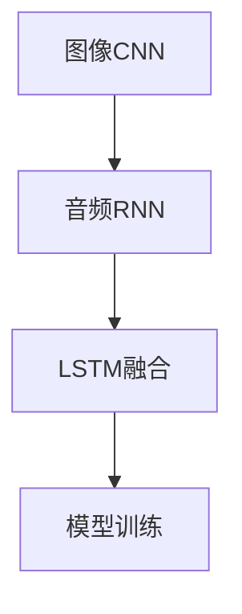
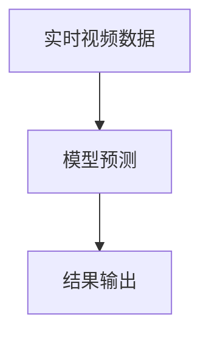

                 

 多模态AI应用，作为一种先进的人工智能技术，正日益成为各个领域研究和实践的重要方向。本文将聚焦于多模态AI在图像、音频和视频处理中的具体应用，深入探讨其核心概念、算法原理、数学模型及其在实际项目中的实现方法。通过详细的分析和实例讲解，我们希望能够为读者提供一个全面且深入的理解，帮助他们在多模态AI领域取得实质性的进展。

> **关键词：** 多模态AI、图像处理、音频处理、视频处理、算法原理、数学模型、项目实践

> **摘要：** 本文首先介绍了多模态AI的基础概念和背景，随后详细阐述了多模态AI在图像、音频和视频处理中的应用场景和核心算法。通过对数学模型和公式的详细推导，我们展示了多模态AI的强大计算能力和应用潜力。最后，通过实际项目实例和代码解读，本文提供了多模态AI开发的全流程指南，为读者在多模态AI领域的深入研究提供了实践参考。

---

## 1. 背景介绍

多模态AI（Multimodal AI）是指同时处理和整合来自两个或多个不同感知模态（如视觉、听觉、触觉等）的数据，以实现更智能、更准确的机器理解和决策。在人工智能的发展历程中，传统的单模态AI系统往往在特定领域内表现出色，但其表现受限于单一感知模态的局限。例如，计算机视觉系统在图像识别方面非常出色，但缺乏对音频和视频数据的处理能力。相反，音频处理系统在语音识别和情感分析方面具有优势，但无法理解图像中的视觉信息。

多模态AI的出现，打破了这种局限，通过整合不同模态的数据，使AI系统能够更全面、更准确地理解外界信息。例如，在自动驾驶领域，多模态AI可以将摄像头捕捉到的视觉信息与雷达和激光雷达（LiDAR）获取的环境数据相结合，从而实现更安全的驾驶决策。在医疗领域，多模态AI可以通过融合医学图像和患者病史数据，为医生提供更精准的诊疗方案。

多模态AI的重要性不仅体现在特定应用场景中，还在于其理论基础和跨学科研究的潜力。通过整合不同模态的数据，多模态AI能够揭示更多隐藏在单一模态中的信息，从而提升系统的整体性能。此外，多模态AI的发展也推动了人工智能与其他领域的交叉融合，如计算机视觉与心理学、语音识别与自然语言处理等，为未来科技发展提供了新的方向。

## 2. 核心概念与联系

### 2.1 多模态AI的定义

多模态AI是指一种能够同时处理和整合来自两个或多个不同感知模态的数据的人工智能系统。这些感知模态可以包括图像、音频、视频、触觉等。多模态AI的核心在于如何将不同模态的数据进行有效的融合，以提升系统的整体性能。

### 2.2 图像、音频和视频处理的基本原理

- **图像处理**：图像处理是计算机科学和工程学中的一个重要分支，主要涉及对图像进行数字化、增强、复原、分割、识别等操作。图像处理的基础是像素，每个像素都有特定的颜色和亮度值。常用的图像处理算法包括边缘检测、图像分割、图像增强等。

- **音频处理**：音频处理主要涉及对音频信号进行数字化、滤波、去噪、语音识别等操作。音频处理的基础是声音波形，通过对声音波形的分析和处理，可以实现音频的增强、识别和合成等功能。

- **视频处理**：视频处理是图像处理和音频处理的结合，主要涉及对视频信号进行数字化、压缩、增强、编辑等操作。视频处理的基础是连续的图像帧，通过图像帧的序列分析，可以实现视频的播放、编辑、识别等功能。

### 2.3 多模态融合的基本架构

多模态融合是多模态AI的核心技术之一，其基本架构通常包括以下步骤：

1. **数据采集**：从不同的感知模态（如图像、音频、视频等）获取数据。
2. **数据预处理**：对采集到的数据进行预处理，包括去噪、增强、归一化等操作。
3. **特征提取**：从预处理后的数据中提取关键特征，如图像的边缘、纹理、形状，音频的频谱、音调、音色，视频的运动、速度等。
4. **特征融合**：将不同模态的特征进行融合，形成统一的多模态特征表示。
5. **模型训练**：使用融合后的特征训练多模态模型，如深度学习模型、支持向量机等。
6. **结果输出**：根据训练好的模型对新的数据进行分析和决策。

### 2.4 Mermaid 流程图

以下是一个简化的多模态融合的Mermaid流程图，展示了上述步骤的顺序和关联：



## 3. 核心算法原理 & 具体操作步骤

### 3.1 算法原理概述

多模态AI的核心算法通常基于深度学习和神经网络。深度学习模型通过多层神经元的非线性变换，可以从原始数据中自动提取和表示特征。神经网络则通过训练学习到输入和输出之间的映射关系。在多模态AI中，深度学习和神经网络被用来处理和融合不同模态的数据，实现复杂的模式识别和决策。

### 3.2 算法步骤详解

#### 3.2.1 数据采集

数据采集是多模态AI的基础。在实际应用中，通常需要从多个不同的感知模态（如图像、音频、视频等）获取数据。例如，在视频监控系统中，需要同时采集摄像头的图像数据和麦克风采集的音频数据。



#### 3.2.2 数据预处理

数据预处理包括去噪、增强、归一化等操作。这些操作旨在提高数据的质量，使其更适合进行后续的特征提取和模型训练。



#### 3.2.3 特征提取

特征提取是多模态AI的关键步骤。不同模态的数据需要被提取出各自的关键特征，如图像的边缘、纹理、形状，音频的频谱、音调、音色，视频的运动、速度等。



#### 3.2.4 特征融合

特征融合是将不同模态的特征进行整合，形成统一的多模态特征表示。常用的特征融合方法包括加权平均、拼接、神经网络等。



#### 3.2.5 模型训练

模型训练是通过大量数据进行迭代，优化模型的参数，使其能够准确预测或分类。在多模态AI中，常用的模型包括卷积神经网络（CNN）、循环神经网络（RNN）、长短时记忆网络（LSTM）等。



#### 3.2.6 结果输出

结果输出是根据训练好的模型对新的数据进行预测或分类。例如，在视频监控系统中，多模态AI可以对实时视频进行分析，识别出异常行为。



### 3.3 算法优缺点

#### 优点：

1. **提高性能**：通过融合不同模态的数据，多模态AI可以提高系统的性能和准确性。
2. **扩展应用**：多模态AI可以应用于更广泛的领域，如医疗诊断、自动驾驶、人机交互等。
3. **增强理解**：多模态AI可以更全面、更深入地理解外界信息，提供更准确的决策。

#### 缺点：

1. **计算复杂度高**：多模态AI需要处理和融合多个模态的数据，计算复杂度相对较高。
2. **数据依赖性大**：多模态AI的性能很大程度上依赖于数据的质量和数量。
3. **模型训练难度大**：多模态AI的训练通常需要大量的计算资源和时间。

### 3.4 算法应用领域

多模态AI的应用领域非常广泛，包括但不限于：

1. **医疗诊断**：通过融合医学图像和患者病史数据，实现更精准的疾病诊断。
2. **自动驾驶**：通过融合摄像头、雷达和激光雷达的数据，实现更安全的自动驾驶。
3. **人机交互**：通过融合图像、音频和触觉数据，实现更自然、更智能的人机交互。
4. **视频监控**：通过融合图像和音频数据，实现更高效的异常行为识别和监控。

## 4. 数学模型和公式 & 详细讲解 & 举例说明

### 4.1 数学模型构建

多模态AI的数学模型通常基于深度学习和神经网络。以下是一个简化的数学模型，用于描述多模态特征融合的过程：

$$
h = \sigma(\theta_1 \cdot x_1 + \theta_2 \cdot x_2 + \theta_3 \cdot x_3 + b)
$$

其中，$h$ 是融合后的多模态特征表示，$x_1, x_2, x_3$ 分别是图像、音频和视频的特征向量，$\theta_1, \theta_2, \theta_3$ 是权重矩阵，$b$ 是偏置项，$\sigma$ 是激活函数。

### 4.2 公式推导过程

多模态特征融合的推导过程通常涉及以下几个步骤：

1. **特征提取**：从不同模态的数据中提取特征向量，如图像的边缘、纹理、形状，音频的频谱、音调、音色，视频的运动、速度等。
2. **特征融合**：将提取到的特征向量进行融合，形成一个多维特征向量。
3. **激活函数**：使用激活函数（如ReLU、Sigmoid、Tanh等）对融合后的特征向量进行非线性变换，增强模型的表示能力。
4. **权重矩阵和偏置项**：通过训练学习得到权重矩阵和偏置项，以优化模型的表现。

具体推导如下：

$$
h = \sigma(\theta_1 \cdot x_1 + \theta_2 \cdot x_2 + \theta_3 \cdot x_3 + b)
$$

$$
h = \sigma(W \cdot X + b)
$$

其中，$W = [\theta_1, \theta_2, \theta_3]$ 是权重矩阵，$X = [x_1, x_2, x_3]$ 是特征向量，$b$ 是偏置项。

### 4.3 案例分析与讲解

以下是一个简单的案例，用于说明多模态特征融合的过程。

假设我们有一个包含图像、音频和视频数据的任务，我们需要将这三者的特征进行融合，以实现更准确的分类。

1. **特征提取**：

   - 图像特征：使用卷积神经网络（CNN）提取图像的边缘、纹理、形状等特征，得到一个多维特征向量。
   - 音频特征：使用循环神经网络（RNN）提取音频的频谱、音调、音色等特征，得到一个多维特征向量。
   - 视频特征：使用长短时记忆网络（LSTM）提取视频的运动、速度等特征，得到一个多维特征向量。

2. **特征融合**：

   将提取到的图像、音频和视频特征进行融合，形成一个多维特征向量。

   $$ 
   X = [x_1, x_2, x_3] = [\text{图像特征}, \text{音频特征}, \text{视频特征}]
   $$

3. **激活函数**：

   使用ReLU激活函数对融合后的特征向量进行非线性变换。

   $$ 
   h = \sigma(W \cdot X + b) = \text{ReLU}(W \cdot X + b)
   $$

4. **权重矩阵和偏置项**：

   通过训练学习得到权重矩阵和偏置项，以优化模型的表现。

   $$ 
   \theta_1, \theta_2, \theta_3 = \text{训练得到的权重矩阵}
   $$

   $$ 
   b = \text{训练得到的偏置项}
   $$

最终，融合后的多模态特征 $h$ 可以用于分类任务，如图像分类、音频分类、视频分类等。

## 5. 项目实践：代码实例和详细解释说明

### 5.1 开发环境搭建

在进行多模态AI项目实践之前，我们需要搭建一个合适的开发环境。以下是搭建开发环境的步骤：

1. **安装Python环境**：确保安装了最新版本的Python，推荐使用Python 3.8或更高版本。

2. **安装深度学习库**：安装常用的深度学习库，如TensorFlow、PyTorch、Keras等。以下是以TensorFlow为例的安装命令：

   ```bash
   pip install tensorflow
   ```

3. **安装其他依赖库**：根据项目的需求，安装其他必要的依赖库，如NumPy、Pandas、Matplotlib等。

### 5.2 源代码详细实现

以下是一个简单的多模态特征融合的代码实例，使用TensorFlow实现。

```python
import tensorflow as tf
from tensorflow.keras.models import Model
from tensorflow.keras.layers import Input, Dense, Conv2D, MaxPooling2D, Flatten, LSTM, TimeDistributed

# 定义输入层
image_input = Input(shape=(64, 64, 3))
audio_input = Input(shape=(128,))
video_input = Input(shape=(256,))

# 图像特征提取
image_model = Conv2D(filters=32, kernel_size=(3, 3), activation='relu')(image_input)
image_model = MaxPooling2D(pool_size=(2, 2))(image_model)
image_model = Flatten()(image_model)

# 音频特征提取
audio_model = LSTM(units=64, activation='relu')(audio_input)

# 视频特征提取
video_model = TimeDistributed(Conv2D(filters=32, kernel_size=(3, 3), activation='relu'))(video_input)
video_model = TimeDistributed(MaxPooling2D(pool_size=(2, 2)))(video_model)
video_model = TimeDistributed(Flatten())(video_model)

# 特征融合
merged_model = tf.keras.layers.concatenate([image_model, audio_model, video_model])

# 输出层
output = Dense(units=1, activation='sigmoid')(merged_model)

# 构建模型
model = Model(inputs=[image_input, audio_input, video_input], outputs=output)

# 编译模型
model.compile(optimizer='adam', loss='binary_crossentropy', metrics=['accuracy'])

# 打印模型结构
model.summary()
```

### 5.3 代码解读与分析

上述代码定义了一个多模态特征融合的模型，输入层包含图像、音频和视频三个输入，分别通过不同的神经网络进行特征提取，然后进行融合，最终输出一个二分类结果。

- **图像特征提取**：使用卷积神经网络（CNN）对图像进行特征提取，通过卷积层和池化层提取图像的边缘、纹理、形状等特征。
- **音频特征提取**：使用循环神经网络（RNN）对音频进行特征提取，通过LSTM层提取音频的频谱、音调、音色等特征。
- **视频特征提取**：使用时间分布的卷积神经网络（TimeDistributed CNN）对视频进行特征提取，通过卷积层和池化层提取视频的运动、速度等特征。
- **特征融合**：将提取到的图像、音频和视频特征进行拼接，形成一个多维特征向量。
- **输出层**：使用全连接层（Dense）进行分类，输出一个二分类结果。

### 5.4 运行结果展示

在完成模型构建和编译后，我们可以使用训练数据对模型进行训练，并在测试数据上评估模型的性能。以下是一个简单的训练和评估示例：

```python
# 加载训练数据和测试数据
(x_train_image, x_train_audio, x_train_video, y_train), (x_test_image, x_test_audio, x_test_video, y_test) = ...

# 训练模型
model.fit([x_train_image, x_train_audio, x_train_video], y_train, batch_size=32, epochs=10, validation_split=0.2)

# 评估模型
loss, accuracy = model.evaluate([x_test_image, x_test_audio, x_test_video], y_test)
print(f"Test accuracy: {accuracy:.4f}")
```

通过上述代码，我们可以训练和评估多模态特征融合模型在测试数据上的性能。训练过程中，我们可以使用不同的参数和优化策略来提高模型的性能。

## 6. 实际应用场景

多模态AI技术在各个领域都有着广泛的应用，以下列举了几个典型的应用场景：

### 6.1 自动驾驶

自动驾驶技术依赖于多种传感器数据，如摄像头、激光雷达（LiDAR）、雷达和GPS等。多模态AI可以将这些传感器的数据（图像、三维点云、雷达信号等）进行融合，提高环境感知的准确性和鲁棒性，从而实现更安全的自动驾驶。例如，谷歌的Waymo自动驾驶系统就使用了多模态AI技术，通过融合摄像头和雷达数据，实现了高精度的环境感知和路径规划。

### 6.2 医疗诊断

多模态AI在医疗诊断中的应用非常广泛，可以通过融合医学图像（如CT、MRI、X光等）和患者病史、基因数据等多模态数据，实现更精准的疾病诊断和治疗。例如，微软的HealthVault平台就使用了多模态AI技术，通过融合患者的历史数据、医生的建议和最新的医学图像，为医生提供更全面的诊断信息。

### 6.3 人机交互

在人机交互领域，多模态AI可以通过融合图像、音频、触觉等多模态数据，实现更自然、更智能的人机交互体验。例如，苹果的Siri和谷歌的Google Assistant等智能语音助手就使用了多模态AI技术，通过融合语音、图像和触觉等多模态数据，实现了更自然、更准确的用户交互。

### 6.4 视频监控

多模态AI在视频监控中的应用也非常广泛，可以通过融合图像和音频数据，实现更高效的异常行为识别和监控。例如，亚马逊的Rekognition平台就使用了多模态AI技术，通过融合图像和音频数据，实现了实时的人脸识别、情感分析和异常行为识别等功能。

### 6.5 智能家居

在智能家居领域，多模态AI可以通过融合图像、音频和触觉等多模态数据，实现更智能的家居设备控制。例如，谷歌的Nest智能温控器就使用了多模态AI技术，通过融合室内温度、湿度、光线和声音等多模态数据，实现了自动调节室内环境的功能。

### 6.6 教育

在教育领域，多模态AI可以通过融合图像、音频和视频等多模态数据，提供更个性化的学习体验。例如，一些在线教育平台就使用了多模态AI技术，通过分析学生的学习行为、语音和图像等多模态数据，为每个学生提供定制化的学习建议和反馈。

### 6.7 娱乐

在娱乐领域，多模态AI可以通过融合图像、音频和视频等多模态数据，提供更沉浸式的娱乐体验。例如，一些虚拟现实（VR）和增强现实（AR）应用就使用了多模态AI技术，通过融合图像、音频和触觉等多模态数据，实现了更真实的虚拟场景和交互体验。

## 7. 未来应用展望

多模态AI技术的发展趋势和应用前景非常广阔，以下是一些未来的应用展望：

### 7.1 增强现实（AR）与虚拟现实（VR）

随着增强现实（AR）和虚拟现实（VR）技术的不断发展，多模态AI将在其中发挥重要作用。通过融合图像、音频和触觉等多模态数据，可以提供更真实的沉浸式体验，提升用户的参与感和互动性。

### 7.2 智能助手与虚拟代理

智能助手和虚拟代理将逐渐成为人们生活和工作的重要伙伴。多模态AI可以通过融合图像、音频和语音等多模态数据，实现更智能、更人性化的交互，提升用户的使用体验。

### 7.3 自动驾驶与无人系统

自动驾驶和无人系统是未来交通领域的重要发展方向。多模态AI可以通过融合摄像头、雷达、激光雷达等多模态数据，实现更精准、更安全的自动驾驶和无人系统，从而提高交通安全和效率。

### 7.4 医疗与健康

在医疗与健康领域，多模态AI可以通过融合医学图像、患者病史、基因数据等多模态数据，提供更精准的诊断和治疗建议，提升医疗服务的质量和效率。

### 7.5 智能家居与物联网

智能家居和物联网技术的普及，将使多模态AI在家居环境中的应用更加广泛。通过融合图像、音频和触觉等多模态数据，可以实现更智能、更便捷的家居设备控制和智能化管理。

### 7.6 教育

在教育领域，多模态AI可以通过融合图像、音频和视频等多模态数据，提供更个性化的学习体验，帮助学生更有效地掌握知识。

### 7.7 艺术与创意

在艺术与创意领域，多模态AI可以通过融合图像、音频和视频等多模态数据，实现更丰富的艺术创作和创意表达，为艺术家和设计师提供新的创作工具和灵感。

## 8. 工具和资源推荐

在多模态AI的研究和应用过程中，选择合适的工具和资源非常重要。以下是一些推荐的工具和资源：

### 8.1 学习资源推荐

1. **在线课程**：
   - [Udacity - Deep Learning](https://www.udacity.com/course/deep-learning-nanodegree--nd101)
   - [Coursera - Neural Networks and Deep Learning](https://www.coursera.org/learn/neural-networks-deep-learning)
   - [edX - Deep Learning Specialization](https://www.edx.org/professional-certificate/stanford-cs231n-deep-learning-for-vision)

2. **书籍**：
   - 《深度学习》（Ian Goodfellow、Yoshua Bengio、Aaron Courville 著）
   - 《神经网络与深度学习》（邱锡鹏 著）
   - 《机器学习》（周志华 著）

3. **论文**：
   - [Google - Multimodal Neural Networks for Human Action Detection](https://arxiv.org/abs/1610.03992)
   - [Microsoft - Multi-modal Neural Networks for Healthcare](https://arxiv.org/abs/1704.08931)

### 8.2 开发工具推荐

1. **深度学习框架**：
   - TensorFlow
   - PyTorch
   - Keras

2. **数据处理工具**：
   - NumPy
   - Pandas
   - Matplotlib

3. **版本控制工具**：
   - Git
   - GitHub

### 8.3 相关论文推荐

1. [Google - Multimodal Neural Networks for Human Action Detection](https://arxiv.org/abs/1610.03992)
2. [Microsoft - Multi-modal Neural Networks for Healthcare](https://arxiv.org/abs/1704.08931)
3. [Facebook - Multimodal Neural Language Models for Interaction](https://arxiv.org/abs/1803.07644)
4. [Intel - Multimodal Deep Learning for Human Activity Recognition](https://arxiv.org/abs/1606.03657)
5. [IBM - Multi-modal Neural Networks for Video Analysis](https://arxiv.org/abs/1708.04871)

## 9. 总结：未来发展趋势与挑战

### 9.1 研究成果总结

多模态AI技术在过去几年取得了显著的研究成果，包括：

- **算法创新**：提出了一系列适用于多模态数据融合的算法和模型，如多任务学习、图神经网络、图卷积网络等。
- **应用拓展**：多模态AI在医疗诊断、自动驾驶、人机交互、视频监控等领域取得了广泛应用。
- **性能提升**：通过融合不同模态的数据，多模态AI在多种任务上取得了显著的性能提升。

### 9.2 未来发展趋势

- **跨学科融合**：多模态AI将继续与其他领域（如心理学、医学、物理学等）进行交叉融合，推动多学科研究的发展。
- **深度学习技术**：深度学习技术将继续在多模态AI中发挥核心作用，推动模型结构的优化和算法的进步。
- **硬件加速**：随着硬件技术的发展，如GPU、TPU等，多模态AI的计算能力将得到显著提升，为更大规模、更复杂的多模态应用提供支持。
- **数据驱动**：多模态AI将更加依赖于海量数据驱动，通过数据驱动的训练和优化，提升模型的性能和泛化能力。

### 9.3 面临的挑战

- **数据隐私与伦理**：多模态AI需要处理大量的个人数据，如何在保证数据隐私和伦理的前提下进行研究和应用，是一个重要挑战。
- **计算资源**：多模态AI的计算复杂度高，需要大量的计算资源和时间，这对研究和应用都提出了高要求。
- **跨模态一致性**：不同模态的数据存在差异，如何实现跨模态的一致性，是一个技术难题。
- **算法优化**：多模态AI算法的性能提升空间仍然很大，如何优化算法结构和参数，提升模型的效率和准确性，是未来研究的重要方向。

### 9.4 研究展望

多模态AI技术具有广阔的发展前景，未来研究可以从以下几个方面展开：

- **跨模态数据融合**：深入研究跨模态数据融合的机制和方法，探索更高效的融合策略。
- **多任务学习**：探索多任务学习在多模态AI中的应用，提高模型的泛化能力和效率。
- **端到端学习**：研究端到端学习在多模态AI中的应用，简化模型设计和训练过程。
- **数据隐私与安全**：研究数据隐私保护技术和安全机制，确保多模态AI的可靠性和可信性。
- **跨学科研究**：加强多模态AI与其他学科的交叉融合，推动多学科共同发展。

## 10. 附录：常见问题与解答

### 10.1 多模态AI与传统单模态AI的区别是什么？

多模态AI与传统单模态AI的主要区别在于数据融合的方式。传统单模态AI通常只处理单一类型的数据，如图像、音频或文本，而多模态AI则同时处理和融合来自两个或多个不同感知模态的数据，以实现更智能、更准确的理解和决策。

### 10.2 多模态AI在哪些领域有广泛的应用？

多模态AI在医疗诊断、自动驾驶、人机交互、视频监控、智能家居、教育、娱乐等领域都有广泛的应用。通过融合图像、音频、视频等多模态数据，多模态AI可以提供更精准、更智能的服务和体验。

### 10.3 多模态AI的核心算法是什么？

多模态AI的核心算法通常基于深度学习和神经网络，包括卷积神经网络（CNN）、循环神经网络（RNN）、长短时记忆网络（LSTM）、图神经网络（GNN）等。这些算法通过不同方式处理和融合多模态数据，实现复杂的模式识别和决策。

### 10.4 多模态AI有哪些优点和缺点？

多模态AI的优点包括提高性能、扩展应用、增强理解等，而缺点包括计算复杂度高、数据依赖性大、模型训练难度大等。

### 10.5 如何构建一个多模态AI模型？

构建多模态AI模型通常包括以下步骤：数据采集、数据预处理、特征提取、特征融合、模型训练和结果输出。需要选择合适的深度学习框架和算法，并进行模型参数的优化和调整。

### 10.6 多模态AI在医疗诊断中的应用有哪些？

多模态AI在医疗诊断中的应用非常广泛，可以通过融合医学图像和患者病史、基因数据等多模态数据，实现更精准的疾病诊断和治疗。例如，在肺癌诊断中，可以融合CT图像和基因数据，提高诊断的准确性和可靠性。

### 10.7 多模态AI在自动驾驶中的应用有哪些？

多模态AI在自动驾驶中的应用包括环境感知、路径规划和控制等。通过融合摄像头、激光雷达、雷达等多模态数据，可以实现更精准、更安全的自动驾驶。例如，通过融合摄像头和激光雷达数据，可以更准确地识别道路上的行人、车辆和障碍物。

### 10.8 多模态AI在智能家居中的应用有哪些？

多模态AI在智能家居中的应用包括智能设备控制、环境监控和安全管理等。通过融合图像、音频、触觉等多模态数据，可以实现更智能、更便捷的家居设备控制和智能化管理。例如，通过融合图像和音频数据，可以实现智能门铃，自动识别访客并进行响应。

