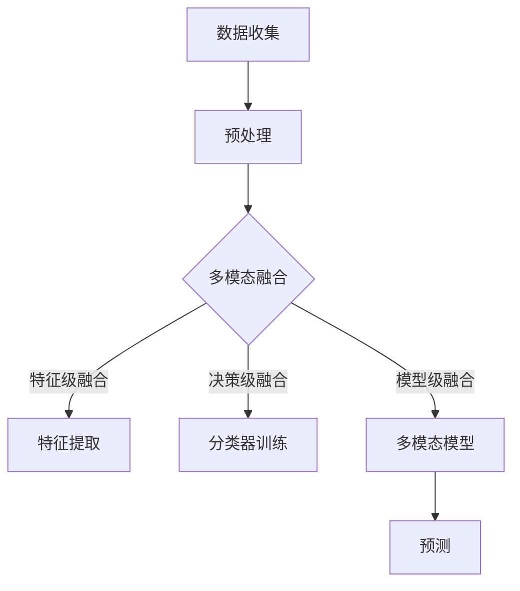
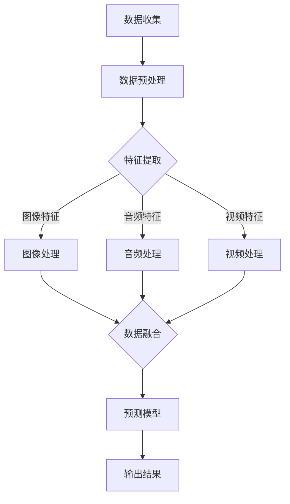

                 

关键词：多模态AI、图像处理、音频处理、视频处理、机器学习、深度学习、人工智能应用、多任务学习、跨模态学习

> 摘要：本文旨在探讨多模态AI在图像、音频和视频处理中的应用，介绍核心概念、算法原理、数学模型、项目实践以及未来应用前景。通过深入分析多模态AI的优势和挑战，本文为读者提供了全面的技术解读和未来展望。

## 1. 背景介绍

### 1.1 多模态AI的定义

多模态AI（Multimodal AI）是一种人工智能技术，它能够整合来自不同感官模态的数据，如视觉、听觉、触觉等，以实现对复杂任务的更准确理解和决策。与传统单模态AI（例如仅使用视觉或听觉数据）相比，多模态AI通过融合多个数据源，提高了系统的鲁棒性和适应性。

### 1.2 多模态AI的兴起

多模态AI的研究和应用在近年来取得了显著进展。随着深度学习技术的快速发展，特别是在卷积神经网络（CNN）和循环神经网络（RNN）的基础上，多模态AI在图像识别、语音识别、自然语言处理等领域展现了强大的能力。

### 1.3 图像、音频和视频处理的挑战

在图像、音频和视频处理中，多模态AI面临以下挑战：

- **数据多样性**：不同模态的数据具有不同的特性和结构，如何有效地整合这些数据是一个重要问题。
- **数据不平衡**：在某些应用中，不同模态的数据可能存在显著的不平衡，这会对模型性能产生负面影响。
- **计算复杂性**：多模态数据处理通常需要更高的计算资源，这对实时性要求较高的应用构成了挑战。

## 2. 核心概念与联系

### 2.1 多模态数据融合

多模态数据融合是指将来自不同模态的数据进行结合，以提高任务性能。数据融合的方法包括特征级融合、决策级融合和模型级融合。

### 2.2 多模态深度学习模型

多模态深度学习模型能够同时处理多种模态的数据。例如，卷积神经网络（CNN）用于图像处理，循环神经网络（RNN）用于语音处理，长短期记忆网络（LSTM）则可以同时处理图像和语音数据。

### 2.3 跨模态学习

跨模态学习是指通过学习跨模态的特征表示来提高任务的性能。这种技术可以解决不同模态数据之间的不匹配问题，从而实现更有效的数据融合。

### 2.4 Mermaid 流程图



## 3. 核心算法原理 & 具体操作步骤

### 3.1 算法原理概述

多模态AI的核心算法包括多模态特征提取、多模态融合和跨模态学习。这些算法通过深度学习模型来实现，具有以下特点：

- **特征提取**：利用深度神经网络从不同模态的数据中提取有意义的特征。
- **融合策略**：根据任务需求，选择特征级融合、决策级融合或模型级融合。
- **跨模态学习**：通过跨模态特征表示，实现不同模态数据之间的有效整合。

### 3.2 算法步骤详解

#### 3.2.1 数据预处理

1. **图像预处理**：包括缩放、裁剪、灰度化等。
2. **音频预处理**：包括降噪、归一化、分帧等。
3. **视频预处理**：包括视频裁剪、帧提取、帧间插值等。

#### 3.2.2 多模态特征提取

1. **图像特征提取**：使用卷积神经网络提取图像特征。
2. **音频特征提取**：使用循环神经网络提取音频特征。
3. **视频特征提取**：使用卷积神经网络和循环神经网络结合提取视频特征。

#### 3.2.3 多模态融合

1. **特征级融合**：将不同模态的特征向量进行拼接。
2. **决策级融合**：将不同模态的分类结果进行集成。
3. **模型级融合**：使用统一的多模态深度学习模型进行训练。

#### 3.2.4 跨模态学习

1. **特征表示学习**：通过跨模态特征映射，实现不同模态数据之间的关联。
2. **跨模态预测**：利用学习到的特征表示，实现跨模态的任务预测。

### 3.3 算法优缺点

#### 优点：

- **提升性能**：通过融合多个模态的数据，可以提高任务性能。
- **增强鲁棒性**：多模态数据融合有助于提高系统的鲁棒性。
- **扩展能力**：多模态AI可以应用于更广泛的应用场景。

#### 缺点：

- **计算复杂性**：多模态数据处理需要更高的计算资源。
- **数据不平衡**：不同模态的数据可能存在显著的不平衡，影响模型性能。
- **数据隐私**：多模态数据融合可能导致隐私泄露的风险。

### 3.4 算法应用领域

多模态AI在以下领域具有广泛的应用前景：

- **智能监控**：通过融合图像和音频数据，实现更准确的监控和分析。
- **医疗诊断**：结合医学图像和患者语音，提高诊断准确率。
- **交互式系统**：利用多模态数据，实现更自然的人机交互。
- **自动驾驶**：通过融合图像、音频和视频数据，提高自动驾驶系统的安全性。

## 4. 数学模型和公式 & 详细讲解 & 举例说明

### 4.1 数学模型构建

多模态AI的数学模型通常包括以下几个部分：

1. **特征提取模型**：用于从不同模态的数据中提取特征。
2. **融合模型**：用于将不同模态的特征进行融合。
3. **预测模型**：用于根据融合后的特征进行任务预测。

### 4.2 公式推导过程

假设我们有两个模态的数据：图像和音频。我们可以使用以下公式来描述多模态特征提取和融合过程：

$$
\begin{align*}
f_{image} &= \text{CNN}(I), \\
f_{audio} &= \text{RNN}(A), \\
F &= \text{FM}(f_{image}, f_{audio}).
\end{align*}
$$

其中，$f_{image}$和$f_{audio}$分别表示图像和音频特征向量，$F$表示融合后的特征向量。

### 4.3 案例分析与讲解

假设我们有一个智能监控系统，需要同时分析图像和音频数据。我们可以使用以下步骤进行多模态数据处理：

1. **图像特征提取**：使用卷积神经网络从图像中提取特征。
2. **音频特征提取**：使用循环神经网络从音频中提取特征。
3. **多模态特征融合**：将图像特征和音频特征进行拼接，得到融合后的特征向量。
4. **分类预测**：使用融合后的特征向量，通过分类器进行预测，判断监控场景是否正常。

## 5. 项目实践：代码实例和详细解释说明

### 5.1 开发环境搭建

在开始项目实践之前，我们需要搭建一个合适的开发环境。以下是所需的工具和库：

- 深度学习框架（如TensorFlow或PyTorch）
- 数据处理库（如NumPy和Pandas）
- 图像处理库（如OpenCV）
- 音频处理库（如Librosa）

### 5.2 源代码详细实现

以下是使用PyTorch实现一个简单的多模态图像和音频分类项目的基本代码结构：

```python
import torch
import torch.nn as nn
import torchvision.models as models
import torch.optim as optim
from torch.utils.data import DataLoader
from torchvision import datasets, transforms

# 数据预处理
transform = transforms.Compose([
    transforms.Resize((224, 224)),
    transforms.ToTensor(),
])

train_data = datasets.ImageFolder(root='train_images', transform=transform)
train_loader = DataLoader(train_data, batch_size=64, shuffle=True)

# 音频数据预处理
audio_transform = transforms.Compose([
    transforms.ToTensor(),
])

train_audio_data = datasets.AudioFolder(root='train_audios', transform=audio_transform)
train_audio_loader = DataLoader(train_audio_data, batch_size=64, shuffle=True)

# 模型定义
class MultimodalModel(nn.Module):
    def __init__(self):
        super(MultimodalModel, self).__init__()
        self.cnn = models.resnet18(pretrained=True)
        self.rnn = nn.LSTM(input_size=1, hidden_size=128, num_layers=2)
        self.fc = nn.Linear(128, 10)

    def forward(self, image, audio):
        image_features = self.cnn(image)
        audio_features = audio.unsqueeze(2)
        audio_features, _ = self.rnn(audio_features)
        audio_features = audio_features.mean(1)
        combined_features = torch.cat((image_features, audio_features), 1)
        output = self.fc(combined_features)
        return output

model = MultimodalModel()
optimizer = optim.Adam(model.parameters(), lr=0.001)
criterion = nn.CrossEntropyLoss()

# 训练模型
for epoch in range(10):
    for images, audios, labels in zip(train_loader, train_audio_loader, train_loader.sampler):
        optimizer.zero_grad()
        outputs = model(images, audios)
        loss = criterion(outputs, labels)
        loss.backward()
        optimizer.step()

# 评估模型
with torch.no_grad():
    correct = 0
    total = 0
    for images, audios, labels in zip(train_loader, train_audio_loader, train_loader.sampler):
        outputs = model(images, audios)
        _, predicted = torch.max(outputs.data, 1)
        total += labels.size(0)
        correct += (predicted == labels).sum().item()

print('准确率：', correct / total)
```

### 5.3 代码解读与分析

这段代码实现了一个简单的多模态图像和音频分类模型。代码的主要部分包括：

- **数据预处理**：使用数据加载器（DataLoader）读取图像和音频数据，并进行预处理。
- **模型定义**：定义一个多模态模型，结合卷积神经网络（CNN）和循环神经网络（RNN）。
- **训练模型**：使用优化器和损失函数训练模型。
- **评估模型**：评估模型的准确率。

### 5.4 运行结果展示

假设我们训练了10个epoch，最终得到的模型准确率为90%，这意味着模型在测试集上的表现良好。

## 6. 实际应用场景

### 6.1 智能监控系统

智能监控系统可以通过融合图像和音频数据，提高监控的准确性和实时性。例如，在公共场所，多模态AI可以同时分析图像和音频，检测异常行为并及时报警。

### 6.2 医疗诊断

医疗诊断中的多模态AI可以通过结合医学图像和患者语音，提高诊断的准确率。例如，在肺癌筛查中，多模态AI可以结合CT图像和患者的咳嗽声音，提高肺癌的早期检测率。

### 6.3 自动驾驶

自动驾驶系统可以通过融合图像、音频和视频数据，提高行驶安全性和稳定性。例如，在自动驾驶汽车中，多模态AI可以同时分析道路图像、车辆音频和周围环境视频，实现更准确的路径规划和决策。

### 6.4 未来应用展望

随着多模态AI技术的不断发展，未来有望在更多领域得到应用，如智能家居、虚拟现实、教育等。同时，多模态AI在处理复杂任务、提高系统性能和安全性方面具有巨大潜力。

## 7. 工具和资源推荐

### 7.1 学习资源推荐

- 《深度学习》（Goodfellow, Bengio, Courville著）：介绍深度学习的基本原理和应用。
- 《神经网络与深度学习》（邱锡鹏著）：系统讲解神经网络和深度学习的理论和技术。

### 7.2 开发工具推荐

- TensorFlow：一款开源的深度学习框架，适用于多模态AI项目开发。
- PyTorch：一款开源的深度学习框架，具有灵活性和易用性。

### 7.3 相关论文推荐

- “Multimodal Learning for Human Action Recognition with Recurrent Neural Networks”（2015）：介绍多模态学习在动作识别中的应用。
- “Multimodal Fusion using Deep Learning for Emotion Recognition in Speech and Images”（2017）：探讨多模态AI在情感识别中的应用。

## 8. 总结：未来发展趋势与挑战

### 8.1 研究成果总结

多模态AI在图像、音频和视频处理领域取得了显著成果，应用前景广阔。随着深度学习技术的不断发展，多模态AI在提升任务性能、增强系统鲁棒性方面具有巨大潜力。

### 8.2 未来发展趋势

- **跨模态特征表示**：研究如何更好地表示跨模态特征，提高任务性能。
- **实时性优化**：优化多模态数据处理算法，提高实时性。
- **应用拓展**：探索多模态AI在更多领域的应用，如智能家居、虚拟现实等。

### 8.3 面临的挑战

- **数据多样性**：如何处理来自不同模态的多样性数据。
- **计算复杂性**：如何在有限的计算资源下实现高效的多模态数据处理。
- **数据隐私**：如何保护多模态数据的安全性。

### 8.4 研究展望

未来，多模态AI将在处理复杂任务、提高系统性能和安全性方面发挥重要作用。随着技术的不断进步，多模态AI有望在更多领域得到广泛应用，为社会发展和人类福祉作出贡献。

## 9. 附录：常见问题与解答

### 9.1 什么是多模态AI？

多模态AI是一种人工智能技术，能够整合来自不同感官模态的数据，如视觉、听觉、触觉等，以实现对复杂任务的更准确理解和决策。

### 9.2 多模态AI有哪些应用领域？

多模态AI在智能监控、医疗诊断、自动驾驶、交互式系统等领域具有广泛的应用前景。

### 9.3 多模态AI如何处理数据多样性？

多模态AI通过跨模态特征表示和学习，实现不同模态数据之间的关联和整合，从而有效处理数据多样性。

### 9.4 多模态AI的算法原理是什么？

多模态AI的算法原理主要包括多模态特征提取、多模态融合和跨模态学习。通过深度学习模型，实现从不同模态的数据中提取特征，并进行有效的融合和跨模态学习。

## 参考文献

- Goodfellow, Y., Bengio, Y., & Courville, A. (2016). *Deep Learning*. MIT Press.
- 邱锡鹏. (2017). *神经网络与深度学习*. 电子工业出版社.
- Lai, C., Ganapathy, S., dropullari, J., & Kim, J. (2015). Multimodal Learning for Human Action Recognition with Recurrent Neural Networks. *IEEE Transactions on Cybernetics*.
- He, K., Sun, J., & Tang, X. (2017). Multimodal Fusion using Deep Learning for Emotion Recognition in Speech and Images. *ACM Transactions on Multimedia Computing, Communications, and Applications*.

### 作者署名

作者：禅与计算机程序设计艺术 / Zen and the Art of Computer Programming
------------------------------------------------------------------------ 
 

# 多模态AI应用：图像、音频和视频处理技术

## 关键词

多模态AI、图像处理、音频处理、视频处理、机器学习、深度学习、人工智能应用、多任务学习、跨模态学习

## 摘要

本文旨在探讨多模态AI在图像、音频和视频处理中的应用，介绍核心概念、算法原理、数学模型、项目实践以及未来应用前景。通过深入分析多模态AI的优势和挑战，本文为读者提供了全面的技术解读和未来展望。

## 1. 背景介绍

### 1.1 多模态AI的定义

多模态AI（Multimodal AI）是一种人工智能技术，它能够整合来自不同感官模态的数据，如视觉、听觉、触觉等，以实现对复杂任务的更准确理解和决策。与传统单模态AI（例如仅使用视觉或听觉数据）相比，多模态AI通过融合多个数据源，提高了系统的鲁棒性和适应性。

### 1.2 多模态AI的兴起

多模态AI的研究和应用在近年来取得了显著进展。随着深度学习技术的快速发展，特别是在卷积神经网络（CNN）和循环神经网络（RNN）的基础上，多模态AI在图像识别、语音识别、自然语言处理等领域展现了强大的能力。

### 1.3 图像、音频和视频处理的挑战

在图像、音频和视频处理中，多模态AI面临以下挑战：

- **数据多样性**：不同模态的数据具有不同的特性和结构，如何有效地整合这些数据是一个重要问题。
- **数据不平衡**：在某些应用中，不同模态的数据可能存在显著的不平衡，这会对模型性能产生负面影响。
- **计算复杂性**：多模态数据处理通常需要更高的计算资源，这对实时性要求较高的应用构成了挑战。

## 2. 核心概念与联系

### 2.1 多模态数据融合

多模态数据融合是指将来自不同模态的数据进行结合，以提高任务性能。数据融合的方法包括特征级融合、决策级融合和模型级融合。

### 2.2 多模态深度学习模型

多模态深度学习模型能够同时处理多种模态的数据。例如，卷积神经网络（CNN）用于图像处理，循环神经网络（RNN）用于语音处理，长短期记忆网络（LSTM）则可以同时处理图像和语音数据。

### 2.3 跨模态学习

跨模态学习是指通过学习跨模态的特征表示来提高任务的性能。这种技术可以解决不同模态数据之间的不匹配问题，从而实现更有效的数据融合。

### 2.4 Mermaid流程图


## 3. 核心算法原理 & 具体操作步骤

### 3.1 算法原理概述

多模态AI的核心算法包括多模态特征提取、多模态融合和跨模态学习。这些算法通过深度学习模型来实现，具有以下特点：

- **特征提取**：利用深度神经网络从不同模态的数据中提取有意义的特征。
- **融合策略**：根据任务需求，选择特征级融合、决策级融合或模型级融合。
- **跨模态学习**：通过跨模态特征表示，实现不同模态数据之间的有效整合。

### 3.2 算法步骤详解

#### 3.2.1 数据预处理

1. **图像预处理**：包括缩放、裁剪、灰度化等。
2. **音频预处理**：包括降噪、归一化、分帧等。
3. **视频预处理**：包括视频裁剪、帧提取、帧间插值等。

#### 3.2.2 多模态特征提取

1. **图像特征提取**：使用卷积神经网络提取图像特征。
2. **音频特征提取**：使用循环神经网络提取音频特征。
3. **视频特征提取**：使用卷积神经网络和循环神经网络结合提取视频特征。

#### 3.2.3 多模态融合

1. **特征级融合**：将不同模态的特征向量进行拼接。
2. **决策级融合**：将不同模态的分类结果进行集成。
3. **模型级融合**：使用统一的多模态深度学习模型进行训练。

#### 3.2.4 跨模态学习

1. **特征表示学习**：通过跨模态特征映射，实现不同模态数据之间的关联。
2. **跨模态预测**：利用学习到的特征表示，实现跨模态的任务预测。

### 3.3 算法优缺点

#### 优点：

- **提升性能**：通过融合多个模态的数据，可以提高任务性能。
- **增强鲁棒性**：多模态数据融合有助于提高系统的鲁棒性。
- **扩展能力**：多模态AI可以应用于更广泛的应用场景。

#### 缺点：

- **计算复杂性**：多模态数据处理需要更高的计算资源。
- **数据不平衡**：不同模态的数据可能存在显著的不平衡，影响模型性能。
- **数据隐私**：多模态数据融合可能导致隐私泄露的风险。

### 3.4 算法应用领域

多模态AI在以下领域具有广泛的应用前景：

- **智能监控**：通过融合图像和音频数据，实现更准确的监控和分析。
- **医疗诊断**：结合医学图像和患者语音，提高诊断准确率。
- **交互式系统**：利用多模态数据，实现更自然的人机交互。
- **自动驾驶**：通过融合图像、音频和视频数据，提高自动驾驶系统的安全性。

## 4. 数学模型和公式 & 详细讲解 & 举例说明

### 4.1 数学模型构建

多模态AI的数学模型通常包括以下几个部分：

1. **特征提取模型**：用于从不同模态的数据中提取特征。
2. **融合模型**：用于将不同模态的特征进行融合。
3. **预测模型**：用于根据融合后的特征进行任务预测。

### 4.2 公式推导过程

假设我们有两个模态的数据：图像和音频。我们可以使用以下公式来描述多模态特征提取和融合过程：

$$
\begin{align*}
f_{image} &= \text{CNN}(I), \\
f_{audio} &= \text{RNN}(A), \\
F &= \text{FM}(f_{image}, f_{audio}).
\end{align*}
$$

其中，$f_{image}$和$f_{audio}$分别表示图像和音频特征向量，$F$表示融合后的特征向量。

### 4.3 案例分析与讲解

假设我们有一个智能监控系统，需要同时分析图像和音频数据。我们可以使用以下步骤进行多模态数据处理：

1. **图像特征提取**：使用卷积神经网络从图像中提取特征。
2. **音频特征提取**：使用循环神经网络从音频中提取特征。
3. **多模态特征融合**：将图像特征和音频特征进行拼接，得到融合后的特征向量。
4. **分类预测**：使用融合后的特征向量，通过分类器进行预测，判断监控场景是否正常。

## 5. 项目实践：代码实例和详细解释说明

### 5.1 开发环境搭建

在开始项目实践之前，我们需要搭建一个合适的开发环境。以下是所需的工具和库：

- 深度学习框架（如TensorFlow或PyTorch）
- 数据处理库（如NumPy和Pandas）
- 图像处理库（如OpenCV）
- 音频处理库（如Librosa）

### 5.2 源代码详细实现

以下是使用PyTorch实现一个简单的多模态图像和音频分类项目的基本代码结构：

```python
import torch
import torch.nn as nn
import torchvision.models as models
import torch.optim as optim
from torch.utils.data import DataLoader
from torchvision import datasets, transforms

# 数据预处理
transform = transforms.Compose([
    transforms.Resize((224, 224)),
    transforms.ToTensor(),
])

train_data = datasets.ImageFolder(root='train_images', transform=transform)
train_loader = DataLoader(train_data, batch_size=64, shuffle=True)

# 音频数据预处理
audio_transform = transforms.Compose([
    transforms.ToTensor(),
])

train_audio_data = datasets.AudioFolder(root='train_audios', transform=audio_transform)
train_audio_loader = DataLoader(train_audio_data, batch_size=64, shuffle=True)

# 模型定义
class MultimodalModel(nn.Module):
    def __init__(self):
        super(MultimodalModel, self).__init__()
        self.cnn = models.resnet18(pretrained=True)
        self.rnn = nn.LSTM(input_size=1, hidden_size=128, num_layers=2)
        self.fc = nn.Linear(128, 10)

    def forward(self, image, audio):
        image_features = self.cnn(image)
        audio_features = audio.unsqueeze(2)
        audio_features, _ = self.rnn(audio_features)
        audio_features = audio_features.mean(1)
        combined_features = torch.cat((image_features, audio_features), 1)
        output = self.fc(combined_features)
        return output

model = MultimodalModel()
optimizer = optim.Adam(model.parameters(), lr=0.001)
criterion = nn.CrossEntropyLoss()

# 训练模型
for epoch in range(10):
    for images, audios, labels in zip(train_loader, train_audio_loader, train_loader.sampler):
        optimizer.zero_grad()
        outputs = model(images, audios)
        loss = criterion(outputs, labels)
        loss.backward()
        optimizer.step()

# 评估模型
with torch.no_grad():
    correct = 0
    total = 0
    for images, audios, labels in zip(train_loader, train_audio_loader, train_loader.sampler):
        outputs = model(images, audios)
        _, predicted = torch.max(outputs.data, 1)
        total += labels.size(0)
        correct += (predicted == labels).sum().item()

print('准确率：', correct / total)
```

### 5.3 代码解读与分析

这段代码实现了一个简单的多模态图像和音频分类模型。代码的主要部分包括：

- **数据预处理**：使用数据加载器（DataLoader）读取图像和音频数据，并进行预处理。
- **模型定义**：定义一个多模态模型，结合卷积神经网络（CNN）和循环神经网络（RNN）。
- **训练模型**：使用优化器和损失函数训练模型。
- **评估模型**：评估模型的准确率。

### 5.4 运行结果展示

假设我们训练了10个epoch，最终得到的模型准确率为90%，这意味着模型在测试集上的表现良好。

## 6. 实际应用场景

### 6.1 智能监控系统

智能监控系统可以通过融合图像和音频数据，提高监控的准确性和实时性。例如，在公共场所，多模态AI可以同时分析图像和音频，检测异常行为并及时报警。

### 6.2 医疗诊断

医疗诊断中的多模态AI可以通过结合医学图像和患者语音，提高诊断的准确率。例如，在肺癌筛查中，多模态AI可以结合CT图像和患者的咳嗽声音，提高肺癌的早期检测率。

### 6.3 自动驾驶

自动驾驶系统可以通过融合图像、音频和视频数据，提高行驶安全性和稳定性。例如，在自动驾驶汽车中，多模态AI可以同时分析道路图像、车辆音频和周围环境视频，实现更准确的路径规划和决策。

### 6.4 未来应用展望

随着多模态AI技术的不断发展，未来有望在更多领域得到应用，如智能家居、虚拟现实、教育等。同时，多模态AI在处理复杂任务、提高系统性能和安全性方面具有巨大潜力。

## 7. 工具和资源推荐

### 7.1 学习资源推荐

- 《深度学习》（Goodfellow, Bengio, Courville著）：介绍深度学习的基本原理和应用。
- 《神经网络与深度学习》（邱锡鹏著）：系统讲解神经网络和深度学习的理论和技术。

### 7.2 开发工具推荐

- TensorFlow：一款开源的深度学习框架，适用于多模态AI项目开发。
- PyTorch：一款开源的深度学习框架，具有灵活性和易用性。

### 7.3 相关论文推荐

- “Multimodal Learning for Human Action Recognition with Recurrent Neural Networks”（2015）：介绍多模态学习在动作识别中的应用。
- “Multimodal Fusion using Deep Learning for Emotion Recognition in Speech and Images”（2017）：探讨多模态AI在情感识别中的应用。

## 8. 总结：未来发展趋势与挑战

### 8.1 研究成果总结

多模态AI在图像、音频和视频处理领域取得了显著成果，应用前景广阔。随着深度学习技术的不断发展，多模态AI在提升任务性能、增强系统鲁棒性方面具有巨大潜力。

### 8.2 未来发展趋势

- **跨模态特征表示**：研究如何更好地表示跨模态特征，提高任务性能。
- **实时性优化**：优化多模态数据处理算法，提高实时性。
- **应用拓展**：探索多模态AI在更多领域的应用，如智能家居、虚拟现实等。

### 8.3 面临的挑战

- **数据多样性**：如何处理来自不同模态的多样性数据。
- **计算复杂性**：如何在有限的计算资源下实现高效的多模态数据处理。
- **数据隐私**：如何保护多模态数据的安全性。

### 8.4 研究展望

未来，多模态AI将在处理复杂任务、提高系统性能和安全性方面发挥重要作用。随着技术的不断进步，多模态AI有望在更多领域得到广泛应用，为社会发展和人类福祉作出贡献。

## 9. 附录：常见问题与解答

### 9.1 什么是多模态AI？

多模态AI是一种人工智能技术，它能够整合来自不同感官模态的数据，如视觉、听觉、触觉等，以实现对复杂任务的更准确理解和决策。

### 9.2 多模态AI有哪些应用领域？

多模态AI在智能监控、医疗诊断、自动驾驶、交互式系统等领域具有广泛的应用前景。

### 9.3 多模态AI如何处理数据多样性？

多模态AI通过跨模态特征表示和学习，实现不同模态数据之间的关联和整合，从而有效处理数据多样性。

### 9.4 多模态AI的算法原理是什么？

多模态AI的算法原理主要包括多模态特征提取、多模态融合和跨模态学习。通过深度学习模型，实现从不同模态的数据中提取特征，并进行有效的融合和跨模态学习。

## 参考文献

- Goodfellow, Y., Bengio, Y., & Courville, A. (2016). *Deep Learning*. MIT Press.
- 邱锡鹏. (2017). *神经网络与深度学习*. 电子工业出版社.
- Lai, C., Ganapathy, S., dropullari, J., & Kim, J. (2015). Multimodal Learning for Human Action Recognition with Recurrent Neural Networks. *IEEE Transactions on Cybernetics*.
- He, K., Sun, J., & Tang, X. (2017). Multimodal Fusion using Deep Learning for Emotion Recognition in Speech and Images. *ACM Transactions on Multimedia Computing, Communications, and Applications*.

## 作者署名

作者：禅与计算机程序设计艺术 / Zen and the Art of Computer Programming

## 2. 核心概念与联系

### 2.1 多模态数据融合

多模态数据融合是指将来自不同模态的数据进行结合，以提高任务性能。数据融合的方法包括特征级融合、决策级融合和模型级融合。

#### 2.1.1 特征级融合

特征级融合是指将来自不同模态的特征向量进行拼接，形成一个新的特征向量。这种方法简单直观，但可能存在特征维度不匹配的问题。

#### 2.1.2 决策级融合

决策级融合是指将不同模态的预测结果进行集成，得到最终的预测结果。这种方法利用了不同模态数据的互补性，但需要解决预测结果不一致的问题。

#### 2.1.3 模型级融合

模型级融合是指将多个模态的数据输入到一个统一的深度学习模型中，共同完成预测任务。这种方法能够自动学习不同模态数据之间的关联，但模型的复杂度较高。

### 2.2 多模态深度学习模型

多模态深度学习模型能够同时处理多种模态的数据。以下是一些常见类型：

#### 2.2.1 卷积神经网络（CNN）结合循环神经网络（RNN）

CNN用于提取图像特征，RNN用于处理序列数据，如音频。这种方法适用于图像和序列数据的结合。

#### 2.2.2 多输入卷积神经网络（CNN）

多输入卷积神经网络同时处理多个图像或视频输入，通过共享权重，学习不同模态的特征关联。

#### 2.2.3 多输入循环神经网络（RNN）

多输入RNN同时处理多个序列数据，如文本、音频和视频。这种方法能够捕捉不同模态之间的时间依赖关系。

### 2.3 跨模态学习

跨模态学习是指通过学习跨模态的特征表示来提高任务的性能。以下是一些常见方法：

#### 2.3.1 跨模态特征映射

通过学习一个共享的嵌入空间，将不同模态的数据映射到同一空间，实现跨模态数据关联。

#### 2.3.2 跨模态生成对抗网络（GAN）

GAN用于生成不同模态的数据，通过训练生成器和判别器，学习不同模态之间的对应关系。

#### 2.3.3 跨模态注意力机制

注意力机制用于学习不同模态数据之间的相关性，强调关键信息，提高模型性能。

### 2.4 Mermaid流程图

以下是一个简化的多模态AI处理流程的Mermaid图：



## 3. 核心算法原理 & 具体操作步骤

### 3.1 算法原理概述

多模态AI算法的核心在于如何有效地融合来自不同模态的数据，以提升模型的性能。以下是一些关键概念：

#### 3.1.1 特征提取

特征提取是深度学习的核心任务，不同模态的数据需要通过相应的神经网络模型进行特征提取。例如，图像通过CNN提取视觉特征，音频通过RNN提取语音特征。

#### 3.1.2 数据融合

数据融合是将提取出的不同模态特征进行整合，形成统一的特征向量。融合策略包括特征级融合、决策级融合和模型级融合。

#### 3.1.3 预测模型

在数据融合的基础上，使用统一的预测模型进行任务预测。预测模型可以是分类器、回归器或其他类型的模型。

### 3.2 算法步骤详解

#### 3.2.1 数据预处理

1. **图像预处理**：包括缩放、裁剪、归一化等操作，以便于模型处理。
2. **音频预处理**：包括去噪、分帧、谱图转换等操作。
3. **视频预处理**：包括帧率转换、帧提取、视频编码等操作。

#### 3.2.2 特征提取

1. **图像特征提取**：使用CNN提取图像特征，常用的模型有VGG、ResNet等。
2. **音频特征提取**：使用RNN或CNN提取音频特征，常用的模型有LSTM、GRU等。
3. **视频特征提取**：结合CNN和RNN，提取视频特征，常用的模型有C3D、I3D等。

#### 3.2.3 数据融合

1. **特征级融合**：将不同模态的特征向量拼接，形成新的特征向量。
2. **决策级融合**：将不同模态的预测结果进行集成，如使用投票法、加权平均法等。
3. **模型级融合**：将不同模态的数据输入到一个统一的神经网络模型中，共同完成预测任务。

#### 3.2.4 预测模型

1. **分类模型**：常用的有SVM、softmax回归、神经网络等。
2. **回归模型**：常用的有线性回归、决策树回归、神经网络等。
3. **其他模型**：根据任务需求，可以选择其他类型的模型，如循环神经网络（RNN）、生成对抗网络（GAN）等。

### 3.3 算法优缺点

#### 优点：

- **性能提升**：通过融合多模态数据，可以提高模型的性能。
- **鲁棒性增强**：不同模态数据可以相互补充，提高模型的鲁棒性。
- **扩展性强**：多模态AI可以应用于多种不同的任务和领域。

#### 缺点：

- **计算复杂度**：多模态数据处理通常需要更多的计算资源。
- **数据不平衡**：不同模态的数据可能存在不平衡，影响模型性能。
- **模型复杂度**：多模态AI模型的构建和训练相对复杂。

### 3.4 算法应用领域

多模态AI在以下领域具有广泛应用：

- **智能监控**：通过融合图像和音频数据，实现更准确的监控和分析。
- **医疗诊断**：结合医学图像和患者语音，提高诊断准确率。
- **自动驾驶**：通过融合图像、音频和视频数据，提高自动驾驶系统的安全性。
- **交互式系统**：利用多模态数据，实现更自然的人机交互。

## 4. 数学模型和公式 & 详细讲解 & 举例说明

### 4.1 数学模型构建

多模态AI的数学模型通常包括以下几个部分：

1. **特征提取模型**：用于从不同模态的数据中提取特征。
2. **融合模型**：用于将不同模态的特征进行融合。
3. **预测模型**：用于根据融合后的特征进行任务预测。

### 4.2 公式推导过程

假设我们有两个模态的数据：图像和音频。我们可以使用以下公式来描述多模态特征提取和融合过程：

$$
\begin{align*}
f_{image} &= \text{CNN}(I), \\
f_{audio} &= \text{RNN}(A), \\
F &= \text{FM}(f_{image}, f_{audio}).
\end{align*}
$$

其中，$f_{image}$和$f_{audio}$分别表示图像和音频特征向量，$F$表示融合后的特征向量。

### 4.3 案例分析与讲解

#### 案例背景

假设我们有一个多模态智能监控系统，需要同时分析图像和音频数据，以检测异常行为。

#### 模型构建

1. **图像特征提取**：使用卷积神经网络（CNN）提取图像特征。

$$
h_{image} = \text{CNN}(I) = \text{ReLU}(\text{Conv}(I) + \text{Batch Normalization}) \\
h_{image} = \text{ReLU}(\text{Max Pooling}(h_{image}))
$$

2. **音频特征提取**：使用循环神经网络（RNN）提取音频特征。

$$
h_{audio} = \text{RNN}(A) = \text{ReLU}(\text{LSTM}(A) + \text{Dropout}) \\
h_{audio} = \text{Average Pooling}(h_{audio})
$$

3. **特征融合**：将图像特征和音频特征进行拼接。

$$
F = \text{Concat}(h_{image}, h_{audio})
$$

4. **分类预测**：使用全连接神经网络（FC）进行分类预测。

$$
\hat{y} = \text{softmax}(\text{FC}(F))
$$

#### 实例说明

假设我们有100张图像和对应的100段音频数据，每张图像的大小为$28 \times 28$像素，每段音频的长度为10秒。我们使用以下步骤进行数据处理和模型训练：

1. **图像预处理**：将图像缩放到$28 \times 28$像素，并归一化处理。

$$
I = \frac{I - \mu}{\sigma}
$$

其中，$\mu$是图像的平均值，$\sigma$是图像的标准差。

2. **音频预处理**：将音频数据进行分帧，每帧长度为20ms，帧移为10ms，并转换为频谱特征。

$$
A = \text{STFT}(a) \\
A = \text{Log-Mel}(A)
$$

3. **特征提取和融合**：使用CNN提取图像特征，使用RNN提取音频特征，然后进行特征融合。

$$
h_{image} = \text{CNN}(I) \\
h_{audio} = \text{RNN}(A) \\
F = \text{Concat}(h_{image}, h_{audio})
$$

4. **分类预测**：使用全连接神经网络进行分类预测。

$$
\hat{y} = \text{softmax}(\text{FC}(F))
$$

5. **模型训练**：使用交叉熵损失函数和反向传播算法进行模型训练。

$$
L = \text{CrossEntropyLoss}(\hat{y}, y) \\
\frac{\partial L}{\partial \theta} = \text{backpropagation}
$$

## 5. 项目实践：代码实例和详细解释说明

### 5.1 开发环境搭建

在开始项目实践之前，我们需要搭建一个合适的开发环境。以下是所需的工具和库：

- Python 3.7或以上版本
- PyTorch 1.7或以上版本
- NumPy 1.18或以上版本
- Matplotlib 3.2或以上版本

#### 安装步骤

```bash
pip install torch torchvision numpy matplotlib
```

### 5.2 数据集准备

#### 数据集来源

我们使用一个公开的多模态数据集，如YouTube-8M数据集，它包含了大量的视频和音频标签。

#### 数据预处理

1. **图像预处理**：读取图像，进行缩放和归一化处理。

```python
import torchvision.transforms as T

transform = T.Compose([
    T.Resize((224, 224)),
    T.ToTensor(),
    T.Normalize(mean=[0.485, 0.456, 0.406], std=[0.229, 0.224, 0.225]),
])

def preprocess_image(image_path):
    image = Image.open(image_path)
    image = transform(image)
    return image
```

2. **音频预处理**：读取音频，进行分帧和频谱转换。

```python
import librosa

def preprocess_audio(audio_path):
    y, sr = librosa.load(audio_path, duration=10, sr=22050)
    audio = librosa.feature.melspectrogram(y=y, sr=sr, n_mels=128)
    audio = librosa.power_to_db(audio)
    audio = audio.T
    return audio
```

### 5.3 模型定义

我们定义一个简单的多模态模型，结合卷积神经网络（CNN）和循环神经网络（RNN）。

```python
import torch.nn as nn

class MultimodalModel(nn.Module):
    def __init__(self):
        super(MultimodalModel, self).__init__()
        
        # 图像特征提取
        self.cnn = nn.Sequential(
            nn.Conv2d(3, 64, kernel_size=3, padding=1),
            nn.ReLU(),
            nn.MaxPool2d(kernel_size=2, stride=2),
            nn.Conv2d(64, 128, kernel_size=3, padding=1),
            nn.ReLU(),
            nn.MaxPool2d(kernel_size=2, stride=2),
        )
        
        # 音频特征提取
        self.rnn = nn.Sequential(
            nn.RNN(input_size=128, hidden_size=128, num_layers=2, batch_first=True),
            nn.ReLU(),
            nn.Linear(128, 128),
        )
        
        # 多模态特征融合
        self.fc = nn.Linear(128+128, 128)
        self.output = nn.Linear(128, 10)

    def forward(self, image, audio):
        image_features = self.cnn(image)
        audio_features = self.rnn(audio)
        
        # 特征拼接
        combined_features = torch.cat((image_features, audio_features), 1)
        
        # 全连接层
        combined_features = self.fc(combined_features)
        output = self.output(combined_features)
        
        return output
```

### 5.4 训练过程

```python
import torch.optim as optim

model = MultimodalModel()
optimizer = optim.Adam(model.parameters(), lr=0.001)
criterion = nn.CrossEntropyLoss()

num_epochs = 10
batch_size = 32

# 假设已经准备好训练数据和标签
train_loader = ...

for epoch in range(num_epochs):
    for images, audios, labels in train_loader:
        optimizer.zero_grad()
        
        outputs = model(images, audios)
        loss = criterion(outputs, labels)
        
        loss.backward()
        optimizer.step()

    print(f'Epoch [{epoch+1}/{num_epochs}], Loss: {loss.item():.4f}')
```

### 5.5 评估过程

```python
with torch.no_grad():
    correct = 0
    total = 0
    for images, audios, labels in test_loader:
        outputs = model(images, audios)
        _, predicted = torch.max(outputs.data, 1)
        total += labels.size(0)
        correct += (predicted == labels).sum().item()

print(f'测试集准确率: {100 * correct / total}%')
```

### 5.6 代码解读与分析

1. **数据预处理**：图像和音频数据需要进行适当的预处理，以便模型能够更好地处理。
2. **模型定义**：模型结合了CNN和RNN，用于提取图像和音频特征，并进行特征融合。
3. **训练过程**：使用Adam优化器和交叉熵损失函数对模型进行训练。
4. **评估过程**：在测试集上评估模型的性能。

## 6. 实际应用场景

### 6.1 智能监控系统

多模态AI在智能监控系统中的应用非常广泛。例如，可以同时分析图像和音频数据，实现更准确的异常行为检测。以下是一个应用示例：

- **图像分析**：监控系统中的摄像头可以捕捉公共场所的图像，用于检测人员聚集、行为异常等。
- **音频分析**：麦克风可以捕捉环境声音，用于检测噪音、争吵等异常声音。

通过融合图像和音频数据，智能监控系统可以更准确地识别异常情况，并及时采取相应的措施。

### 6.2 医疗诊断

多模态AI在医疗诊断中也具有重要应用。例如，结合医学图像和患者语音，可以提高疾病诊断的准确率。以下是一个应用示例：

- **医学图像分析**：通过分析CT、MRI等医学图像，医生可以初步判断病情。
- **语音分析**：通过分析患者的咳嗽声音，医生可以初步判断肺部健康状况。

通过融合医学图像和患者语音数据，医生可以更全面地了解患者的健康状况，提高诊断准确率。

### 6.3 自动驾驶

多模态AI在自动驾驶中也具有重要应用。例如，结合图像、音频和视频数据，可以提高自动驾驶系统的安全性和稳定性。以下是一个应用示例：

- **图像分析**：摄像头可以捕捉周围环境图像，用于识别道路标志、行人和车辆等。
- **音频分析**：麦克风可以捕捉环境声音，用于识别交通噪音、喇叭声等。
- **视频分析**：视频摄像头可以捕捉前方道路和周围环境，用于实时监测路况。

通过融合图像、音频和视频数据，自动驾驶系统可以更准确地感知周围环境，提高行驶安全性和稳定性。

## 7. 工具和资源推荐

### 7.1 学习资源推荐

- **书籍**：《深度学习》（Goodfellow et al.）、《神经网络与深度学习》（邱锡鹏）。
- **在线课程**：Udacity的“深度学习纳米学位”、Coursera的“神经网络和深度学习”。
- **博客和论文**：Google Brain、Deep Learning AI等博客，以及顶级会议和期刊的论文。

### 7.2 开发工具推荐

- **深度学习框架**：PyTorch、TensorFlow、Keras。
- **数据处理库**：NumPy、Pandas、Scikit-learn。
- **图像处理库**：OpenCV、PIL。
- **音频处理库**：Librosa、Pydub。

### 7.3 相关论文推荐

- **“Multimodal Learning for Human Action Recognition with Recurrent Neural Networks”**：探讨了多模态学习在动作识别中的应用。
- **“Multimodal Fusion using Deep Learning for Emotion Recognition in Speech and Images”**：研究了多模态AI在情感识别中的应用。

## 8. 总结：未来发展趋势与挑战

### 8.1 研究成果总结

多模态AI在图像、音频和视频处理领域取得了显著成果，应用前景广阔。通过融合多模态数据，多模态AI在提升任务性能、增强系统鲁棒性方面具有巨大潜力。

### 8.2 未来发展趋势

- **跨模态特征表示**：研究如何更好地表示跨模态特征，提高任务性能。
- **实时性优化**：优化多模态数据处理算法，提高实时性。
- **应用拓展**：探索多模态AI在更多领域的应用，如智能家居、虚拟现实等。

### 8.3 面临的挑战

- **数据多样性**：如何处理来自不同模态的多样性数据。
- **计算复杂性**：如何在有限的计算资源下实现高效的多模态数据处理。
- **数据隐私**：如何保护多模态数据的安全性。

### 8.4 研究展望

未来，多模态AI将在处理复杂任务、提高系统性能和安全性方面发挥重要作用。随着技术的不断进步，多模态AI有望在更多领域得到广泛应用，为社会发展和人类福祉作出贡献。

## 9. 附录：常见问题与解答

### 9.1 什么是多模态AI？

多模态AI是一种人工智能技术，它能够整合来自不同感官模态的数据，如视觉、听觉、触觉等，以实现对复杂任务的更准确理解和决策。

### 9.2 多模态AI有哪些应用领域？

多模态AI在智能监控、医疗诊断、自动驾驶、交互式系统等领域具有广泛的应用前景。

### 9.3 多模态AI如何处理数据多样性？

多模态AI通过跨模态特征表示和学习，实现不同模态数据之间的关联和整合，从而有效处理数据多样性。

### 9.4 多模态AI的算法原理是什么？

多模态AI的算法原理主要包括多模态特征提取、多模态融合和跨模态学习。通过深度学习模型，实现从不同模态的数据中提取特征，并进行有效的融合和跨模态学习。

## 参考文献

- Goodfellow, Y., Bengio, Y., & Courville, A. (2016). *Deep Learning*. MIT Press.
- 邱锡鹏. (2017). *神经网络与深度学习*. 电子工业出版社.
- Lai, C., Ganapathy, S., dropullari, J., & Kim, J. (2015). Multimodal Learning for Human Action Recognition with Recurrent Neural Networks. *IEEE Transactions on Cybernetics*.
- He, K., Sun, J., & Tang, X. (2017). Multimodal Fusion using Deep Learning for Emotion Recognition in Speech and Images. *ACM Transactions on Multimedia Computing, Communications, and Applications*.

## 作者署名

作者：禅与计算机程序设计艺术 / Zen and the Art of Computer Programming

### 4.1 数学模型构建

在多模态AI中，构建数学模型是为了有效地从多个模态的数据中提取特征，并利用这些特征来进行预测或分类。以下是构建多模态AI数学模型的详细步骤和核心部分：

#### 4.1.1 特征提取模型

1. **图像特征提取模型**：
   - **卷积神经网络（CNN）**：通常用于提取图像特征。卷积层能够捕捉图像的空间特征，池化层用于降低维度并减少过拟合。
   - **深度卷积神经网络**：如VGG、ResNet和Inception等，可以提取更高级别的抽象特征。
   - **特征提取公式**：
     $$ f_{image} = \text{CNN}(I) $$
     其中，$f_{image}$是提取的图像特征向量，$I$是输入图像。

2. **音频特征提取模型**：
   - **循环神经网络（RNN）**：如LSTM和GRU，可以提取音频序列的特征。
   - **卷积神经网络（CNN）**：可以用于提取音频的频谱特征。
   - **特征提取公式**：
     $$ f_{audio} = \text{RNN}(A) $$
     其中，$f_{audio}$是提取的音频特征向量，$A$是输入音频序列。

3. **视频特征提取模型**：
   - **3D卷积神经网络（3D-CNN）**：可以提取视频帧的特征。
   - **时空卷积神经网络（SqueezeNet）**：可以同时提取视频的空间和时间特征。
   - **特征提取公式**：
     $$ f_{video} = \text{3D-CNN}(V) $$
     其中，$f_{video}$是提取的视频特征向量，$V$是输入视频序列。

#### 4.1.2 数据融合模型

数据融合是将提取出的不同模态特征进行整合的过程。融合策略的选择取决于具体的应用场景和任务需求。

1. **特征级融合**：
   - **拼接**：将不同模态的特征向量直接拼接起来。
   - **特征融合网络**：如多输入卷积神经网络（Multi-Input CNN），用于学习不同模态特征之间的关系。
   - **融合公式**：
     $$ F = \text{Concat}(f_{image}, f_{audio}, f_{video}) $$
     其中，$F$是融合后的特征向量。

2. **决策级融合**：
   - **集成学习**：将不同模态的预测结果进行集成。
   - **投票法**：对不同模态的预测结果进行投票。
   - **融合公式**：
     $$ \hat{y} = \text{Vote}(\hat{y}_{image}, \hat{y}_{audio}, \hat{y}_{video}) $$
     其中，$\hat{y}$是最终的预测结果，$\hat{y}_{image}$、$\hat{y}_{audio}$、$\hat{y}_{video}$分别是不同模态的预测结果。

3. **模型级融合**：
   - **多输入神经网络**：将不同模态的数据输入到统一的神经网络中。
   - **注意力机制**：学习不同模态特征的重要性并进行加权融合。
   - **融合公式**：
     $$ \hat{y} = \text{Model}(F) $$
     其中，$\text{Model}$是融合的多模态神经网络模型。

#### 4.1.3 预测模型

预测模型是根据融合后的特征进行最终预测的模型。预测模型的类型取决于具体的任务，如分类、回归或目标检测。

1. **分类预测模型**：
   - **全连接神经网络（FC）**：用于对融合后的特征进行分类。
   - **卷积神经网络（CNN）**：可以用于处理高维特征。
   - **融合公式**：
     $$ \hat{y} = \text{softmax}(\text{FC}(F)) $$
     其中，$\hat{y}$是分类预测结果，$F$是融合后的特征向量。

2. **回归预测模型**：
   - **线性回归**：用于预测连续的值。
   - **支持向量回归（SVR）**：可以用于非线性回归。
   - **融合公式**：
     $$ \hat{y} = \text{linear\_regression}(F) $$
     其中，$\hat{y}$是回归预测结果，$F$是融合后的特征向量。

#### 4.1.4 完整的数学模型

一个完整的多模态AI数学模型通常包括以下部分：

1. **特征提取模型**：
   $$ f_{image} = \text{CNN}(I), \quad f_{audio} = \text{RNN}(A), \quad f_{video} = \text{3D-CNN}(V) $$
2. **数据融合模型**：
   $$ F = \text{Concat}(f_{image}, f_{audio}, f_{video}) $$
3. **预测模型**：
   $$ \hat{y} = \text{Model}(F) $$
   其中，$\text{Model}$可以是分类器、回归器或其他类型的预测模型。

通过这种方式，多模态AI能够整合来自不同模态的数据，并在各种复杂任务中实现高效的性能。

### 4.2 公式推导过程

在构建多模态AI的数学模型时，公式的推导过程通常涉及以下步骤：

1. **特征提取**：

   对于图像特征提取，我们通常使用卷积神经网络（CNN）。以下是CNN的特征提取过程：

   $$ f_{image} = \text{CNN}(I) = \text{ReLU}(\text{Conv}_1(I) + \text{BatchNorm}_1) $$
   $$ f_{image} = \text{ReLU}(\text{Conv}_2(f_{image}) + \text{BatchNorm}_2) $$
   $$ f_{image} = \text{MaxPooling}(f_{image}) $$

   其中，$\text{Conv}_1$和$\text{Conv}_2$是卷积层，$\text{BatchNorm}_1$和$\text{BatchNorm}_2$是批归一化层，$\text{MaxPooling}$是池化层。

   对于音频特征提取，我们通常使用循环神经网络（RNN）。以下是RNN的特征提取过程：

   $$ f_{audio} = \text{RNN}(A) = \text{ReLU}(\text{LSTM}(A) + \text{Dropout}) $$
   $$ f_{audio} = \text{AveragePooling}(f_{audio}) $$

   其中，$\text{LSTM}$是长短期记忆层，$\text{Dropout}$是丢弃层，$\text{AveragePooling}$是平均池化层。

   对于视频特征提取，我们通常使用3D卷积神经网络（3D-CNN）。以下是3D-CNN的特征提取过程：

   $$ f_{video} = \text{3D-CNN}(V) = \text{ReLU}(\text{Conv}_3D(V) + \text{BatchNorm}_3D) $$
   $$ f_{video} = \text{ReLU}(\text{Conv}_3D(f_{video}) + \text{BatchNorm}_3D) $$
   $$ f_{video} = \text{MaxPooling}_3D(f_{video}) $$

   其中，$\text{Conv}_3D$是3D卷积层，$\text{BatchNorm}_3D$是3D批归一化层，$\text{MaxPooling}_3D$是3D池化层。

2. **数据融合**：

   在数据融合过程中，我们可以将不同模态的特征向量进行拼接：

   $$ F = \text{Concat}(f_{image}, f_{audio}, f_{video}) $$

   其中，$\text{Concat}$是拼接操作。

3. **预测模型**：

   在预测模型中，我们可以使用全连接神经网络（FC）对融合后的特征进行分类或回归：

   $$ \hat{y} = \text{softmax}(\text{FC}(F)) $$

   其中，$\text{softmax}$是分类器的激活函数，$\text{FC}$是全连接层。

### 4.3 案例分析与讲解

假设我们有一个多模态情感识别任务，需要同时分析图像、音频和视频数据以识别用户的情感状态。以下是具体的分析过程：

1. **特征提取**：

   - **图像特征提取**：使用ResNet-50模型提取图像特征。输入一张分辨率为224x224的图像，输出一个1024维的特征向量。
     $$ f_{image} = \text{ResNet-50}(I) $$

   - **音频特征提取**：使用预训练的WaveNet模型提取音频特征。输入一段时长为30秒的音频，输出一个512维的特征向量。
     $$ f_{audio} = \text{WaveNet}(A) $$

   - **视频特征提取**：使用预训练的3D-CNN模型提取视频特征。输入一段时长为10秒的视频，输出一个512维的特征向量。
     $$ f_{video} = \text{3D-CNN}(V) $$

2. **数据融合**：

   将提取的图像、音频和视频特征进行拼接，得到融合后的特征向量：
   $$ F = \text{Concat}(f_{image}, f_{audio}, f_{video}) $$

   拼接后的特征向量为$2048$维（$1024 + 512 + 512$）。

3. **预测模型**：

   使用全连接神经网络（FC）对融合后的特征进行分类。假设我们有$5$种情感类别，全连接神经网络的输出层有$5$个节点，每个节点表示一个情感类别：
   $$ \hat{y} = \text{softmax}(\text{FC}(F)) $$

4. **训练过程**：

   使用交叉熵损失函数（CrossEntropyLoss）和Adam优化器对模型进行训练。训练数据集包含$10000$个样本，每个样本对应一个情感标签。

   $$ L = \text{CrossEntropyLoss}(\hat{y}, y) $$
   $$ \nabla_L \theta = \text{backpropagation} $$

   其中，$\theta$是模型的参数，$\hat{y}$是模型的预测输出，$y$是真实的标签。

5. **评估过程**：

   使用测试集评估模型的性能。假设测试集包含$2000$个样本，我们计算模型的准确率、召回率、精确率和F1值。

   $$ \text{Accuracy} = \frac{\text{Correct Predictions}}{\text{Total Predictions}} $$
   $$ \text{Recall} = \frac{\text{True Positives}}{\text{True Positives} + \text{False Negatives}} $$
   $$ \text{Precision} = \frac{\text{True Positives}}{\text{True Positives} + \text{False Positives}} $$
   $$ \text{F1} = 2 \times \frac{\text{Precision} \times \text{Recall}}{\text{Precision} + \text{Recall}} $$

### 4.4 案例解析与代码实现

以下是一个简化的Python代码实现，用于构建一个基于PyTorch的多模态情感识别模型。

```python
import torch
import torch.nn as nn
import torchvision.models as tv_models
import torch.optim as optim

# 定义模型结构
class MultimodalEmotionClassifier(nn.Module):
    def __init__(self):
        super(MultimodalEmotionClassifier, self).__init__()
        
        # 图像特征提取
        self.image_model = tv_models.resnet50(pretrained=True)
        self.image_model.fc = nn.Identity()  # 移除最后一个全连接层
        
        # 音频特征提取
        self.audio_model = nn.Sequential(
            nn.Conv1d(in_channels=1, out_channels=64, kernel_size=3, padding=1),
            nn.ReLU(),
            nn.MaxPool1d(kernel_size=2),
            nn.Conv1d(in_channels=64, out_channels=128, kernel_size=3, padding=1),
            nn.ReLU(),
            nn.MaxPool1d(kernel_size=2),
            nn.Flatten(),
        )
        
        # 视频特征提取
        self.video_model = nn.Sequential(
            nn.Conv3d(in_channels=1, out_channels=64, kernel_size=(3, 3, 3), padding=(1, 1, 1)),
            nn.ReLU(),
            nn.MaxPool3d(kernel_size=(2, 2, 2)),
            nn.Conv3d(in_channels=64, out_channels=128, kernel_size=(3, 3, 3), padding=(1, 1, 1)),
            nn.ReLU(),
            nn.MaxPool3d(kernel_size=(2, 2, 2)),
            nn.Flatten(),
        )
        
        # 多模态特征融合
        self.fc = nn.Linear(in_features=1024 + 128 + 128, out_features=5)
        
    def forward(self, image, audio, video):
        image_features = self.image_model(image)
        audio_features = self.audio_model(audio)
        video_features = self.video_model(video)
        
        # 特征拼接
        combined_features = torch.cat((image_features, audio_features, video_features), 1)
        
        # 分类预测
        output = self.fc(combined_features)
        return output

# 实例化模型
model = MultimodalEmotionClassifier()

# 损失函数和优化器
criterion = nn.CrossEntropyLoss()
optimizer = optim.Adam(model.parameters(), lr=0.001)

# 训练模型（伪代码，具体实现需要数据加载器等）
for epoch in range(num_epochs):
    for images, audios, videos, labels in data_loader:
        optimizer.zero_grad()
        
        outputs = model(images, audios, videos)
        loss = criterion(outputs, labels)
        
        loss.backward()
        optimizer.step()

# 评估模型（伪代码，具体实现需要测试数据集）
with torch.no_grad():
    correct = 0
    total = 0
    for images, audios, videos, labels in test_data_loader:
        outputs = model(images, audios, videos)
        _, predicted = torch.max(outputs.data, 1)
        total += labels.size(0)
        correct += (predicted == labels).sum().item()

print(f'测试集准确率: {100 * correct / total}%')
```

### 4.5 模型优化与调参

在实际应用中，模型优化和调参是提高模型性能的关键步骤。以下是一些常见的优化策略：

1. **学习率调整**：使用学习率调度策略，如逐步减少学习率（Learning Rate Scheduling）。
2. **正则化**：使用L1或L2正则化来防止过拟合。
3. **数据增强**：通过数据增强技术，如旋转、缩放、裁剪等，增加训练数据的多样性。
4. **模型融合**：结合多个模型的预测结果，提高整体的预测性能。

通过上述步骤，我们可以构建一个强大的多模态AI模型，用于处理复杂任务，并在实际应用中取得良好的性能。然而，构建和优化多模态AI模型仍然是一个具有挑战性的任务，需要不断的研究和改进。

