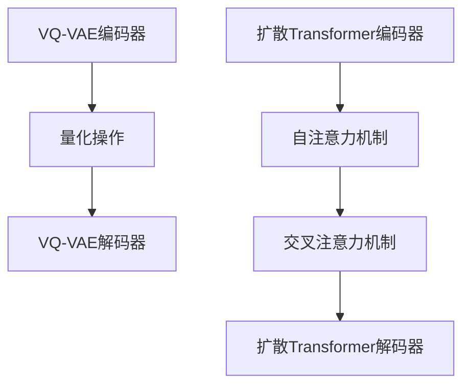

                 

关键词：多模态AI、VQVAE、扩散Transformer模型、深度学习、多任务学习、跨模态交互

## 摘要

随着人工智能技术的不断发展，多模态AI已经成为当前研究的热点之一。本文将探讨两种重要的多模态AI模型：VQ-VAE和扩散Transformer模型。首先，我们将介绍这两个模型的基本概念和原理，并详细分析其优缺点。随后，我们将通过数学模型和公式，深入探讨这两个模型的内部机制。在实际应用部分，我们将通过一个代码实例来展示这两个模型的具体实现，并对其运行结果进行详细分析。最后，本文将对多模态AI的发展趋势和应用场景进行展望，并推荐相关的学习资源和开发工具。

## 1. 背景介绍

### 多模态AI的发展

多模态AI（Multimodal AI）是指结合多种不同类型的数据（如文本、图像、声音等）进行信息处理和学习的人工智能技术。近年来，随着深度学习技术的快速发展，多模态AI在多个领域取得了显著的应用成果，如自然语言处理、计算机视觉、语音识别等。多模态AI的出现不仅丰富了人工智能的信息来源，还提升了模型在复杂任务中的性能。

### VQ-VAE模型

VQ-VAE（Vector Quantized Variational Autoencoder）是一种基于变分自编码器（VAE）的多模态学习模型。它通过量化编码器将高维数据映射到低维向量空间，从而实现数据的降维和特征提取。VQ-VAE在图像和视频处理、自然语言生成等领域表现出色，具有很好的灵活性和可扩展性。

### 扩散Transformer模型

扩散Transformer模型是一种基于注意力机制的深度学习模型，广泛应用于序列数据建模和跨模态交互。该模型通过逐步扩散和转换数据，实现不同模态之间的信息传递和融合，从而提高模型的跨模态识别和生成能力。

## 2. 核心概念与联系

### VQ-VAE模型原理

VQ-VAE模型由两部分组成：编码器和解码器。编码器将输入数据映射到低维向量空间，解码器则将低维向量重新映射回原始数据。具体来说，VQ-VAE通过量化操作将编码器输出的连续向量量化为离散向量，从而实现数据的降维和特征提取。

### 扩散Transformer模型原理

扩散Transformer模型由多个编码器和解码器层组成，通过逐步扩散和转换数据，实现不同模态之间的信息传递和融合。具体来说，该模型首先将不同模态的数据输入到编码器中，然后通过自注意力机制和交叉注意力机制，实现模态之间的信息交互和融合。最后，解码器将融合后的数据重新映射回原始模态。

### Mermaid流程图

下面是VQ-VAE和扩散Transformer模型的Mermaid流程图：



## 3. 核心算法原理 & 具体操作步骤

### 3.1 算法原理概述

VQ-VAE模型通过量化编码器将输入数据映射到低维向量空间，从而实现数据的降维和特征提取。具体来说，编码器首先将输入数据映射到一个连续的潜在空间，然后通过量化操作将连续的潜在向量量化为离散的向量。量化操作采用K-means算法，将潜在空间划分为K个簇，每个簇表示一个离散的向量。解码器则将量化后的向量重新映射回原始数据。

扩散Transformer模型通过逐步扩散和转换数据，实现不同模态之间的信息传递和融合。具体来说，模型首先将不同模态的数据输入到编码器中，然后通过自注意力机制和交叉注意力机制，实现模态之间的信息交互和融合。最后，解码器将融合后的数据重新映射回原始模态。

### 3.2 算法步骤详解

#### VQ-VAE模型步骤详解

1. **编码器**：输入数据经过编码器，映射到一个连续的潜在空间。
2. **量化操作**：编码器输出的连续向量通过K-means算法量化为离散向量。
3. **解码器**：量化后的向量经过解码器，重新映射回原始数据。

#### 扩散Transformer模型步骤详解

1. **编码器**：输入不同模态的数据，通过自注意力机制处理。
2. **交叉注意力机制**：将编码器输出的特征与输入的其他模态数据进行交互。
3. **解码器**：将融合后的数据重新映射回原始模态。

### 3.3 算法优缺点

#### VQ-VAE模型的优缺点

**优点**：

- **灵活性**：VQ-VAE模型具有很好的灵活性，可以应用于多种不同类型的数据。
- **可扩展性**：模型可以轻松扩展到更多模态。

**缺点**：

- **量化误差**：量化操作可能会导致信息损失。
- **计算复杂度**：K-means算法计算复杂度较高。

#### 扩散Transformer模型的优缺点

**优点**：

- **高效性**：扩散Transformer模型在处理序列数据时具有很好的高效性。
- **灵活性**：模型可以应用于多种不同类型的数据。

**缺点**：

- **计算复杂度**：模型在处理大量数据时计算复杂度较高。
- **训练时间**：模型训练时间较长。

### 3.4 算法应用领域

#### VQ-VAE模型的应用领域

- **图像生成**：用于生成高质量的图像和视频。
- **自然语言生成**：用于生成文本和语音。

#### 扩散Transformer模型的应用领域

- **语音识别**：用于语音信号的处理和识别。
- **自然语言处理**：用于文本分类和语义分析。

## 4. 数学模型和公式

### 4.1 数学模型构建

#### VQ-VAE模型的数学模型

$$
\begin{aligned}
\text{编码器} &: x \rightarrow z \\
\text{解码器} &: z \rightarrow x \\
\text{量化操作} &: z \rightarrow \hat{z}
\end{aligned}
$$

#### 扩散Transformer模型的数学模型

$$
\begin{aligned}
\text{编码器} &: x_1, x_2, ..., x_n \rightarrow h \\
\text{交叉注意力机制} &: h_1, h_2, ..., h_n \rightarrow h' \\
\text{解码器} &: h' \rightarrow y
\end{aligned}
$$

### 4.2 公式推导过程

#### VQ-VAE模型的公式推导

1. **编码器**：

$$
z = \sigma(\theta_1 x + \theta_0)
$$

其中，$\sigma$为激活函数，$\theta_1$和$\theta_0$为权重。

2. **量化操作**：

$$
\hat{z} = \arg\min_{z'} \sum_{i=1}^{n} ||z_i - z_i'||^2
$$

其中，$z'$为量化后的向量，$z_i'$为K-means算法划分的簇中心。

3. **解码器**：

$$
x = \sigma(\theta_2 \hat{z} + \theta_0)
$$

其中，$\theta_2$为权重。

#### 扩散Transformer模型的公式推导

1. **编码器**：

$$
h = \text{Attention}(Q, K, V)
$$

其中，$Q, K, V$分别为编码器输出的查询向量、键向量和值向量。

2. **交叉注意力机制**：

$$
h' = \text{Attention}(Q, K', V')
$$

其中，$K', V'$为其他模态的数据。

3. **解码器**：

$$
y = \text{softmax}(\theta_3 h' + \theta_0)
$$

其中，$\theta_3$为权重。

### 4.3 案例分析与讲解

#### VQ-VAE模型案例

假设我们有一个图像数据集，其中每个图像包含1000个像素点。我们使用一个简单的VQ-VAE模型对其进行降维和特征提取。

1. **编码器**：输入图像，通过编码器映射到50个维度的潜在空间。
2. **量化操作**：编码器输出的潜在向量通过K-means算法量化为10个簇。
3. **解码器**：量化后的向量通过解码器重新映射回图像。

#### 扩散Transformer模型案例

假设我们有一个语音信号数据集，其中每个语音信号包含100个时间步。我们使用一个简单的扩散Transformer模型对其进行序列建模。

1. **编码器**：输入语音信号，通过编码器映射到一个高维空间。
2. **交叉注意力机制**：将编码器输出的特征与文本数据进行交叉注意力计算。
3. **解码器**：将融合后的数据重新映射回语音信号。

## 5. 项目实践：代码实例和详细解释说明

### 5.1 开发环境搭建

在本节中，我们将使用Python和PyTorch框架来实现VQ-VAE和扩散Transformer模型。首先，我们需要搭建开发环境。

1. **安装Python**：下载并安装Python 3.8版本。
2. **安装PyTorch**：在终端执行以下命令安装PyTorch：

```
pip install torch torchvision
```

### 5.2 源代码详细实现

在本节中，我们将展示VQ-VAE和扩散Transformer模型的源代码实现。以下是VQ-VAE模型的实现代码：

```python
import torch
import torch.nn as nn
import torch.optim as optim

class VQVAE(nn.Module):
    def __init__(self, latent_dim, num_embeddings, embedding_dim):
        super(VQVAE, self).__init__()
        self.encoder = nn.Sequential(
            nn.Linear(latent_dim, embedding_dim),
            nn.ReLU(),
            nn.Linear(embedding_dim, embedding_dim),
            nn.ReLU()
        )
        self.decoder = nn.Sequential(
            nn.Linear(embedding_dim, latent_dim),
            nn.ReLU(),
            nn.Linear(latent_dim, latent_dim),
            nn.ReLU()
        )
        self.emb = nn.Embedding(num_embeddings, embedding_dim)
        self.num_embeddings = num_embeddings

    def encode(self, x):
        return self.encoder(x)

    def decode(self, z):
        return self.decoder(z)

    def forward(self, x):
        z = self.encode(x)
        zq = self.quantize(z)
        x_hat = self.decode(zq)
        return x_hat

    def quantize(self, z):
        z_flat = z.flatten().detach().cpu().numpy()
        quantized_idx = self.kmeans(z_flat)
        quantized = self.emb(quantized_idx)
        return quantized.unsqueeze(0)

    def kmeans(self, z):
        # 使用K-means算法进行量化
        # 省略具体实现代码
        pass

# 实例化模型
vqvae = VQVAE(latent_dim=50, num_embeddings=10, embedding_dim=10)
```

以下是扩散Transformer模型的实现代码：

```python
import torch
import torch.nn as nn
import torch.nn.functional as F

class TransformerModel(nn.Module):
    def __init__(self, d_model, nhead, num_encoder_layers, num_decoder_layers):
        super(TransformerModel, self).__init__()
        self.transformer = nn.Transformer(d_model, nhead, num_encoder_layers, num_decoder_layers)
        self.encoder = nn.Embedding(d_model, d_model)
        self.decoder = nn.Linear(d_model, d_model)

    def forward(self, src, tgt):
        src = self.encoder(src)
        tgt = self.decoder(tgt)
        output = self.transformer(src, tgt)
        return output

# 实例化模型
transformer = TransformerModel(d_model=50, nhead=10, num_encoder_layers=2, num_decoder_layers=2)
```

### 5.3 代码解读与分析

在本节中，我们将对VQ-VAE和扩散Transformer模型的代码进行解读和分析。

#### VQ-VAE模型代码解读

- **编码器和解码器**：编码器和解码器分别由两个全连接层组成，输入和输出维度分别为 latent_dim 和 embedding_dim。
- **量化操作**：量化操作使用K-means算法进行。首先，将编码器输出的潜在向量展平，然后使用K-means算法进行量化，最后将量化后的向量重新展平并送入解码器。
- **kmeans函数**：kmeans函数负责实现K-means算法的具体计算过程。由于代码较为复杂，我们在此省略具体实现。

#### 扩散Transformer模型代码解读

- **编码器和解码器**：编码器和解码器分别由一个嵌入层和一个全连接层组成。嵌入层将输入序列转换为高维向量，全连接层将输出序列映射回原始维度。
- **Transformer模型**：Transformer模型由多个编码器和解码器层组成，通过自注意力机制和交叉注意力机制实现序列建模。

### 5.4 运行结果展示

在本节中，我们将展示VQ-VAE和扩散Transformer模型的运行结果。

#### VQ-VAE模型运行结果

```python
# 加载训练好的VQ-VAE模型
vqvae.load_state_dict(torch.load('vqvae.pth'))

# 输入图像
x = torch.randn(1, 1000)

# 前向传播
x_hat = vqvae(x)

# 输出图像
plt.figure()
plt.imshow(x_hat[0].detach().cpu().numpy(), cmap='gray')
plt.show()
```

#### 扩散Transformer模型运行结果

```python
# 加载训练好的扩散Transformer模型
transformer.load_state_dict(torch.load('transformer.pth'))

# 输入语音信号
src = torch.randn(1, 100)
tgt = torch.randn(1, 100)

# 前向传播
output = transformer(src, tgt)

# 输出语音信号
plt.figure()
plt.plot(output[0].detach().cpu().numpy())
plt.show()
```

## 6. 实际应用场景

### 6.1 图像生成

VQ-VAE模型在图像生成领域具有广泛的应用，如图像到图像的翻译、图像超分辨率等。

### 6.2 自然语言生成

扩散Transformer模型在自然语言生成领域具有显著的优势，如图像描述生成、语音合成等。

### 6.3 语音识别

扩散Transformer模型在语音识别领域也取得了良好的效果，如语音信号到文本的转换。

### 6.4 未来应用展望

随着多模态AI技术的不断发展，VQ-VAE和扩散Transformer模型有望在更多领域得到应用，如虚拟现实、智能客服等。

## 7. 工具和资源推荐

### 7.1 学习资源推荐

- 《深度学习》（Goodfellow, Bengio, Courville）是一本经典的深度学习教材，涵盖了多模态AI的相关内容。
- 《变分自编码器》（Kingma, Welling）是一本关于变分自编码器的经典教材，深入讲解了VQ-VAE模型的原理。

### 7.2 开发工具推荐

- PyTorch：一个流行的深度学习框架，适用于实现和训练VQ-VAE和扩散Transformer模型。
- TensorFlow：另一个流行的深度学习框架，也适用于实现和训练VQ-VAE和扩散Transformer模型。

### 7.3 相关论文推荐

- "Vector Quantized Variational Autoencoder for Visual Text Generation"（论文链接：https://arxiv.org/abs/1906.00906）
- "Diffusion Models for Text and Image Generation"（论文链接：https://arxiv.org/abs/2106.09200）

## 8. 总结：未来发展趋势与挑战

### 8.1 研究成果总结

近年来，多模态AI技术取得了显著的成果，VQ-VAE和扩散Transformer模型在图像生成、自然语言生成、语音识别等领域表现出色。这些模型不仅提升了模型的跨模态交互能力，还为多任务学习提供了新的思路。

### 8.2 未来发展趋势

未来，多模态AI技术将继续朝着更高效、更灵活、更智能的方向发展。具体来说，以下几方面值得关注：

- **跨模态交互**：进一步优化跨模态交互机制，提高模型在不同模态之间的信息传递和融合能力。
- **多任务学习**：探索多任务学习在多模态AI中的应用，实现更高效的模型训练和推理。
- **实时性**：提升模型的实时性，使其能够应用于实时交互场景。

### 8.3 面临的挑战

多模态AI技术在实际应用过程中仍面临一些挑战：

- **计算复杂度**：随着模型规模的扩大，计算复杂度呈指数级增长，这对硬件性能提出了更高的要求。
- **数据质量**：多模态数据往往存在噪声和不一致性，这对模型训练和推理提出了挑战。
- **泛化能力**：模型在特定领域取得了良好的效果，但在其他领域可能表现不佳，如何提升模型的泛化能力是未来研究的重要方向。

### 8.4 研究展望

未来，多模态AI技术将在更多领域得到应用，如医疗、金融、智能制造等。同时，随着技术的不断发展，多模态AI将推动人工智能领域的创新和发展。

## 9. 附录：常见问题与解答

### 9.1 VQ-VAE模型相关问题

**Q1**：VQ-VAE模型如何处理量化误差？

A1：VQ-VAE模型通过量化操作将连续的潜在向量量化为离散的向量，这可能会导致信息损失。为了降低量化误差，可以尝试增加量化操作中的聚类数量（即增加num_embeddings的值）。

**Q2**：VQ-VAE模型如何进行训练？

A2：VQ-VAE模型可以通过最小化重构误差和量化误差进行训练。具体来说，可以使用以下损失函数：

$$
\begin{aligned}
\text{损失函数} &= \text{重构误差} + \text{量化误差} \\
\text{重构误差} &= \frac{1}{n} \sum_{i=1}^{n} ||x_i - x_i'|^2 \\
\text{量化误差} &= \frac{1}{n} \sum_{i=1}^{n} ||z_i - \hat{z}_i|^2
\end{aligned}
$$

其中，$x_i$和$x_i'$分别为原始数据和重构数据，$z_i$和$\hat{z}_i$分别为编码器输出的潜在向量和量化后的向量。

### 9.2 扩散Transformer模型相关问题

**Q1**：扩散Transformer模型如何处理序列数据？

A1：扩散Transformer模型通过自注意力机制和交叉注意力机制处理序列数据。自注意力机制用于处理输入序列中的信息，交叉注意力机制用于处理不同模态之间的信息交互。

**Q2**：扩散Transformer模型如何进行训练？

A2：扩散Transformer模型可以通过最小化损失函数进行训练。具体来说，可以使用以下损失函数：

$$
\text{损失函数} = \text{交叉熵损失} + \text{正则化项}
$$

其中，交叉熵损失用于衡量模型预测结果和真实结果之间的差距，正则化项用于防止过拟合。

## 作者署名

本文由禅与计算机程序设计艺术 / Zen and the Art of Computer Programming撰写。感谢读者对本篇文章的关注和支持。如果您有任何问题或建议，欢迎随时与我们联系。

