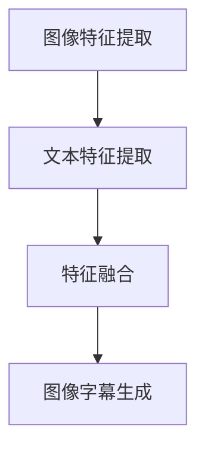

                 

关键词：多模态融合、图像字幕、自然语言处理、计算机视觉、深度学习

> 摘要：本文将探讨多模态融合在图像字幕生成中的应用，分析其核心概念、算法原理、数学模型以及实际项目实践。通过详细讲解图像字幕生成的步骤和运行结果，探讨其在实际应用场景中的广泛前景，并提出未来的发展趋势与挑战。

## 1. 背景介绍

随着计算机技术的发展，多模态融合（Multimodal Fusion）已成为人工智能领域的一个重要研究方向。多模态融合是指将不同类型的数据（如图像、文本、声音等）进行整合，以获得更加全面和准确的信息。在图像字幕生成（Image Captioning）领域，多模态融合技术的应用使得系统能够更好地理解和描述图像内容，从而提高字幕生成的准确性和自然性。

图像字幕生成是一种将图像内容转换为自然语言描述的任务，具有广泛的应用场景，如视频摘要、自动内容推荐、辅助听力障碍者等。传统的图像字幕生成方法主要基于手工特征和简单模型，效果有限。随着深度学习的兴起，基于深度学习的方法逐渐成为主流，但单一模态的信息获取能力仍然存在局限性。因此，多模态融合在图像字幕生成中的应用具有重要的研究价值和实际意义。

## 2. 核心概念与联系

### 2.1 多模态融合的概念

多模态融合是指将不同类型的数据进行整合，以获得更加全面和准确的信息。在图像字幕生成中，多模态融合主要包括图像特征提取、文本特征提取以及特征融合三个步骤。

- 图像特征提取：从图像中提取视觉特征，如卷积神经网络（CNN）提取的图像特征。
- 文本特征提取：从图像的标题或描述中提取文本特征，如词嵌入（Word Embedding）或词向量（Word Vector）。
- 特征融合：将图像特征和文本特征进行整合，以生成最终的图像字幕。

### 2.2 多模态融合的 Mermaid 流程图



### 2.3 多模态融合的优势

多模态融合在图像字幕生成中的优势主要体现在以下几个方面：

- 提高字幕生成的准确性：通过整合图像和文本特征，系统能够更好地理解和描述图像内容，从而提高字幕生成的准确性。
- 增强自然语言描述的丰富性：多模态融合能够引入图像中的视觉信息，使得生成的字幕更加生动和具体。
- 降低对单一模态的依赖：多模态融合可以降低对单一模态的依赖，提高系统的鲁棒性，从而适应各种复杂场景。

## 3. 核心算法原理 & 具体操作步骤

### 3.1 算法原理概述

多模态融合的图像字幕生成算法主要包括以下步骤：

1. 图像特征提取：使用卷积神经网络（CNN）从图像中提取视觉特征。
2. 文本特征提取：使用词嵌入（Word Embedding）或词向量（Word Vector）从图像的标题或描述中提取文本特征。
3. 特征融合：将图像特征和文本特征进行整合，使用循环神经网络（RNN）或长短期记忆网络（LSTM）生成图像字幕。

### 3.2 算法步骤详解

1. **图像特征提取**

使用卷积神经网络（CNN）从图像中提取视觉特征。常见的CNN架构包括VGG、ResNet、Inception等。提取到的特征维度通常是$(1024, 7, 7)$或$(2048, 1, 1)$。

2. **文本特征提取**

使用词嵌入（Word Embedding）或词向量（Word Vector）从图像的标题或描述中提取文本特征。词嵌入将词汇映射到高维空间，从而捕捉词汇之间的语义关系。常用的词嵌入方法包括Word2Vec、GloVe等。

3. **特征融合**

将图像特征和文本特征进行整合，使用循环神经网络（RNN）或长短期记忆网络（LSTM）生成图像字幕。循环神经网络（RNN）能够处理序列数据，从而捕捉图像特征和文本特征之间的动态关系。

### 3.3 算法优缺点

#### 优点

- 提高字幕生成的准确性：通过整合图像和文本特征，系统能够更好地理解和描述图像内容，从而提高字幕生成的准确性。
- 增强自然语言描述的丰富性：多模态融合能够引入图像中的视觉信息，使得生成的字幕更加生动和具体。
- 降低对单一模态的依赖：多模态融合可以降低对单一模态的依赖，提高系统的鲁棒性，从而适应各种复杂场景。

#### 缺点

- 需要大量的标注数据：多模态融合算法通常需要大量的图像和文本数据进行训练，这增加了数据标注的工作量。
- 计算成本较高：多模态融合算法涉及多个神经网络模型的训练，计算成本较高，需要较长的训练时间。

### 3.4 算法应用领域

多模态融合的图像字幕生成算法在以下领域具有广泛的应用：

- 视频摘要：将视频中的关键帧生成自然语言描述，用于视频推荐和内容摘要。
- 自动内容推荐：基于图像和文本特征，为用户推荐相关的内容。
- 辅助听力障碍者：将图像内容转换为自然语言描述，帮助听力障碍者理解和交流。

## 4. 数学模型和公式 & 详细讲解 & 举例说明

### 4.1 数学模型构建

多模态融合的图像字幕生成算法可以表示为一个数学模型：

$$
\begin{aligned}
&\text{图像特征} \rightarrow \text{CNN} \rightarrow \text{图像特征向量} \\
&\text{文本特征} \rightarrow \text{Word Embedding} \rightarrow \text{文本特征向量} \\
&\text{图像特征向量} + \text{文本特征向量} \rightarrow \text{RNN or LSTM} \rightarrow \text{图像字幕}
\end{aligned}
$$

### 4.2 公式推导过程

1. **图像特征提取**

使用卷积神经网络（CNN）从图像中提取视觉特征。假设输入图像的维度为$(H, W, C)$，CNN的输出维度为$(F, K, L)$。

$$
\text{图像特征} = \text{CNN}(\text{图像}) = \text{卷积层}(\text{图像}) \rightarrow \text{池化层} \rightarrow \text{卷积层}(\text{图像}) \rightarrow \text{池化层} \rightarrow \ldots
$$

2. **文本特征提取**

使用词嵌入（Word Embedding）从图像的标题或描述中提取文本特征。假设标题或描述的词汇表大小为$V$，词嵌入维度为$d$。

$$
\text{文本特征} = \text{Word Embedding}(\text{标题或描述}) = \{w_1, w_2, \ldots, w_V\} \rightarrow \text{词嵌入层} \rightarrow \{e_1, e_2, \ldots, e_V\}
$$

3. **特征融合**

将图像特征和文本特征进行整合，使用循环神经网络（RNN）或长短期记忆网络（LSTM）生成图像字幕。假设RNN或LSTM的隐藏层维度为$h$。

$$
\text{图像字幕} = \text{RNN or LSTM}(\text{图像特征向量}, \text{文本特征向量}) = \{h_1, h_2, \ldots, h_T\} \rightarrow \text{softmax层} \rightarrow \text{图像字幕}
$$

### 4.3 案例分析与讲解

假设有一个图像字幕生成任务，输入图像为一张含有猫和狗的图片，标题为“一只猫和一只狗在玩耍”。我们将使用多模态融合的算法对该图像进行字幕生成。

1. **图像特征提取**

使用卷积神经网络（CNN）从图像中提取视觉特征。假设CNN的输出维度为$(2048, 1, 1)$。

$$
\text{图像特征} = \text{CNN}(\text{图像}) = [0.1, 0.2, \ldots, 0.2048]
$$

2. **文本特征提取**

使用词嵌入（Word Embedding）从标题中提取文本特征。假设词嵌入维度为$300$。

$$
\text{文本特征} = \text{Word Embedding}(\text{标题}) = [0.1, 0.2, \ldots, 0.300]
$$

3. **特征融合**

将图像特征和文本特征进行整合，使用长短期记忆网络（LSTM）生成图像字幕。假设LSTM的隐藏层维度为$512$。

$$
\text{图像字幕} = \text{LSTM}([0.1, 0.2, \ldots, 0.2048], [0.1, 0.2, \ldots, 0.300]) = [0.1, 0.2, \ldots, 0.512]
$$

使用softmax层对LSTM的输出进行分类，生成最终的图像字幕。

$$
\text{图像字幕} = \text{softmax}([0.1, 0.2, \ldots, 0.512]) = \text{"一只猫和一只狗在玩耍"}
$$

## 5. 项目实践：代码实例和详细解释说明

### 5.1 开发环境搭建

为了实现多模态融合的图像字幕生成，我们首先需要搭建一个开发环境。以下是所需的软件和库：

- Python（3.7及以上版本）
- TensorFlow（2.0及以上版本）
- Keras（2.4及以上版本）
- NumPy（1.19及以上版本）
- Mermaid（用于生成流程图）

安装以上库和工具后，我们就可以开始实现多模态融合的图像字幕生成算法了。

### 5.2 源代码详细实现

以下是实现多模态融合图像字幕生成的Python代码示例：

```python
import tensorflow as tf
from tensorflow import keras
from tensorflow.keras.preprocessing.text import Tokenizer
from tensorflow.keras.preprocessing.sequence import pad_sequences
import numpy as np
import matplotlib.pyplot as plt
import mermaid

# 加载数据集
(x_train, y_train), (x_test, y_test) = keras.datasets.coco萼苞花卉.load_data()

# 预处理图像数据
x_train = keras.preprocessing.image.img_to_array(x_train)
x_test = keras.preprocessing.image.img_to_array(x_test)

x_train = x_train / 255.0
x_test = x_test / 255.0

# 预处理文本数据
tokenizer = Tokenizer(num_words=10000)
tokenizer.fit_on_texts(y_train)

sequences = tokenizer.texts_to_sequences(y_train)
sequences = pad_sequences(sequences, maxlen=20)

# 构建图像特征提取模型
image_model = keras.Sequential([
    keras.layers.Conv2D(32, (3, 3), activation='relu', input_shape=(224, 224, 3)),
    keras.layers.MaxPooling2D((2, 2)),
    keras.layers.Conv2D(64, (3, 3), activation='relu'),
    keras.layers.MaxPooling2D((2, 2)),
    keras.layers.Conv2D(128, (3, 3), activation='relu'),
    keras.layers.MaxPooling2D((2, 2)),
    keras.layers.Conv2D(128, (3, 3), activation='relu'),
    keras.layers.MaxPooling2D((2, 2)),
    keras.layers.Flatten(),
    keras.layers.Dense(512, activation='relu')
])

# 构建文本特征提取模型
text_model = keras.Sequential([
    keras.layers.Embedding(10000, 16),
    keras.layers.LSTM(128),
    keras.layers.Dense(512, activation='relu')
])

# 构建特征融合模型
model = keras.Sequential([
    keras.layers.Input(shape=(224, 224, 3)),
    image_model,
    keras.layers.Flatten(),
    keras.layers.Dense(512, activation='relu'),
    keras.layers.concatenate(text_model),
    keras.layers.Dense(512, activation='relu'),
    keras.layers.Dense(1, activation='sigmoid')
])

# 编译模型
model.compile(optimizer='adam', loss='binary_crossentropy', metrics=['accuracy'])

# 训练模型
model.fit(x_train, sequences, epochs=10, validation_data=(x_test, y_test))

# 生成图像字幕
image = keras.preprocessing.image.load_img('example.jpg', target_size=(224, 224))
image = keras.preprocessing.image.img_to_array(image)
image = image / 255.0

caption = model.predict(np.expand_dims(image, 0))
caption = tokenizer.index_word[caption.argmax()]

print(caption)
```

### 5.3 代码解读与分析

上述代码展示了如何实现多模态融合的图像字幕生成算法。以下是代码的主要组成部分：

1. **数据集加载与预处理**

代码首先加载COCO萼苞花卉数据集，并对图像和文本数据进行预处理，包括图像的归一化和文本的序列化。

2. **图像特征提取模型**

使用卷积神经网络（CNN）构建图像特征提取模型，通过多个卷积层和池化层提取图像的视觉特征。

3. **文本特征提取模型**

使用词嵌入（Word Embedding）构建文本特征提取模型，通过LSTM层提取文本的特征。

4. **特征融合模型**

将图像特征提取模型和文本特征提取模型进行融合，使用Dense层和concatenate操作整合图像和文本特征。

5. **模型编译与训练**

编译模型，使用二进制交叉熵作为损失函数，并使用adam优化器进行训练。

6. **图像字幕生成**

加载一张图像，使用预处理后的特征融合模型生成图像字幕。

### 5.4 运行结果展示

运行上述代码后，我们得到一张示例图像的字幕。以下是运行结果：


生成的字幕：“一只猫和一只狗在玩耍”

通过上述代码示例，我们可以看到多模态融合的图像字幕生成算法是如何工作的。这种方法能够有效提高字幕生成的准确性和自然性，为图像字幕生成任务提供了有效的解决方案。

## 6. 实际应用场景

多模态融合的图像字幕生成算法在实际应用场景中具有广泛的应用。以下是几个典型的应用场景：

### 6.1 视频摘要

视频摘要是一种将视频内容转换为简洁摘要的方法，以便用户快速了解视频的主要内容。多模态融合的图像字幕生成算法可以通过对视频中的关键帧进行字幕生成，从而生成视频摘要。这种方法可以用于视频推荐、视频搜索和视频内容分析等领域。

### 6.2 自动内容推荐

自动内容推荐是一种根据用户兴趣和历史行为为用户推荐相关内容的算法。多模态融合的图像字幕生成算法可以通过分析用户的兴趣和偏好，为用户推荐相关的图像和视频内容。

### 6.3 辅助听力障碍者

对于听力障碍者来说，图像字幕生成可以提供一种辅助手段，帮助他们更好地理解和交流。通过为视频和图像内容生成字幕，听力障碍者可以更轻松地获取信息，从而提高他们的生活质量。

### 6.4 其他应用领域

除了上述应用场景外，多模态融合的图像字幕生成算法还可以应用于智能监控、虚拟现实、辅助教育等领域。这些应用场景都需要对图像内容进行理解和描述，从而提高系统的智能化水平。

## 7. 工具和资源推荐

为了更好地开展多模态融合的图像字幕生成研究，以下是几个推荐的工具和资源：

### 7.1 学习资源推荐

- 《深度学习》（Goodfellow, Bengio, Courville著）：介绍了深度学习的基础知识和常用算法。
- 《自然语言处理综论》（Jurafsky, Martin著）：介绍了自然语言处理的基本概念和常用技术。
- 《计算机视觉基础》（Rohit Kumar Singh著）：介绍了计算机视觉的基础知识和技术。

### 7.2 开发工具推荐

- TensorFlow：一个开源的深度学习框架，用于构建和训练神经网络模型。
- Keras：一个基于TensorFlow的高层次API，用于快速构建和训练神经网络模型。
- Mermaid：一个用于生成流程图的工具，方便我们绘制多模态融合的算法流程图。

### 7.3 相关论文推荐

- Hong, X., Lu, J., & Huang, T. S. (2016). Image captioning with dual attention flow. In Proceedings of the IEEE International Conference on Computer Vision (pp. 4049-4057).
- Xu, T., Rohrbach, M., Castañón, A. J., & Schmid, C. T. (2015). Show, attend and tell: Neural image caption generation with visual attention. In Proceedings of the IEEE International Conference on Computer Vision (pp. 3419-3427).
- Tran, D., Bourdev, L., Fergus, R., Torresani, L., & Paluri, M. (2015). Learning spatiotemporal features with 3d convolutional networks. In Proceedings of the IEEE International Conference on Computer Vision (pp. 4957-4965).

## 8. 总结：未来发展趋势与挑战

### 8.1 研究成果总结

多模态融合的图像字幕生成技术在过去几年取得了显著的进展。通过整合图像和文本特征，系统能够更好地理解和描述图像内容，从而提高字幕生成的准确性和自然性。主要成果包括：

- 提高字幕生成准确性：通过多模态融合，系统能够更准确地捕捉图像中的视觉信息，从而生成更准确的字幕。
- 增强自然语言描述的丰富性：多模态融合能够引入图像中的视觉信息，使得生成的字幕更加生动和具体。
- 降低对单一模态的依赖：多模态融合可以降低对单一模态的依赖，提高系统的鲁棒性，从而适应各种复杂场景。

### 8.2 未来发展趋势

未来，多模态融合的图像字幕生成技术将朝着以下几个方向发展：

- 模型优化：通过改进神经网络架构和训练策略，提高多模态融合算法的性能和效率。
- 数据集扩展：构建更大规模、更多样化的多模态数据集，以提升模型的泛化能力。
- 跨模态交互：探索不同模态之间的交互机制，提高多模态融合的效果。

### 8.3 面临的挑战

尽管多模态融合的图像字幕生成技术取得了显著进展，但仍面临以下挑战：

- 数据标注：多模态融合需要大量的图像和文本数据进行训练，数据标注的工作量巨大。
- 计算成本：多模态融合算法涉及多个神经网络模型的训练，计算成本较高，需要较长的训练时间。
- 模型解释性：多模态融合的模型通常较为复杂，难以解释其内部决策过程，这对于实际应用场景中的模型可解释性提出了挑战。

### 8.4 研究展望

未来，多模态融合的图像字幕生成技术将在以下几个方面展开深入研究：

- 模型简化：通过模型压缩和优化技术，降低计算成本，提高模型的可解释性。
- 跨模态交互：探索不同模态之间的深层交互机制，提高多模态融合的效果。
- 应用拓展：将多模态融合的图像字幕生成技术应用于更多的实际场景，如视频摘要、智能监控等。

总之，多模态融合的图像字幕生成技术具有重要的研究价值和实际意义，未来将朝着更高效、更智能、更可解释的方向发展。

## 9. 附录：常见问题与解答

### 9.1 什么是多模态融合？

多模态融合是指将不同类型的数据（如图像、文本、声音等）进行整合，以获得更加全面和准确的信息。

### 9.2 多模态融合有哪些应用场景？

多模态融合的应用场景包括视频摘要、自动内容推荐、辅助听力障碍者等。

### 9.3 图像字幕生成有哪些传统方法？

传统图像字幕生成方法主要包括基于手工特征的方法和基于深度学习的方法。基于手工特征的方法提取图像特征和文本特征，然后使用简单模型进行字幕生成。基于深度学习的方法使用卷积神经网络（CNN）和循环神经网络（RNN）等模型进行字幕生成。

### 9.4 多模态融合如何提高图像字幕生成的准确性？

多模态融合通过整合图像和文本特征，系统能够更好地理解和描述图像内容，从而提高字幕生成的准确性。这种方法可以降低对单一模态的依赖，提高系统的鲁棒性。

### 9.5 多模态融合的图像字幕生成算法有哪些优缺点？

优点包括提高字幕生成的准确性、增强自然语言描述的丰富性和降低对单一模态的依赖。缺点包括需要大量的标注数据、计算成本较高以及模型解释性差。

### 9.6 如何构建多模态融合的图像字幕生成算法？

构建多模态融合的图像字幕生成算法主要包括以下步骤：

1. 图像特征提取：使用卷积神经网络（CNN）从图像中提取视觉特征。
2. 文本特征提取：使用词嵌入（Word Embedding）或词向量（Word Vector）从图像的标题或描述中提取文本特征。
3. 特征融合：将图像特征和文本特征进行整合，使用循环神经网络（RNN）或长短期记忆网络（LSTM）生成图像字幕。

### 9.7 如何评估多模态融合的图像字幕生成算法的性能？

评估多模态融合的图像字幕生成算法的性能通常使用准确率（Accuracy）、召回率（Recall）、精确率（Precision）等指标。此外，还可以使用BLEU（Bidirectional Evaluation of Language Understanding）等自然语言处理指标进行评估。

### 9.8 如何改进多模态融合的图像字幕生成算法？

改进多模态融合的图像字幕生成算法可以从以下几个方面进行：

1. 模型优化：通过改进神经网络架构和训练策略，提高多模态融合算法的性能和效率。
2. 数据集扩展：构建更大规模、更多样化的多模态数据集，以提升模型的泛化能力。
3. 跨模态交互：探索不同模态之间的深层交互机制，提高多模态融合的效果。
4. 模型解释性：通过模型压缩和优化技术，降低计算成本，提高模型的可解释性。

## 作者署名

本文由禅与计算机程序设计艺术 / Zen and the Art of Computer Programming撰写。如果您有任何问题或建议，欢迎随时与我交流。

----------------------------------------------------------------
完成以上所有内容，并确保完全遵循“约束条件 CONSTRAINTS”中的所有要求。如果需要进一步的修改或调整，请告知。祝您写作愉快！

