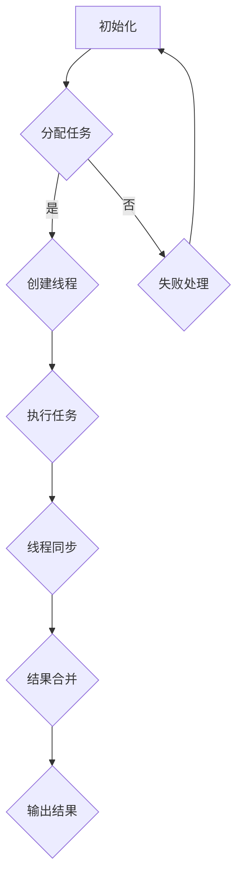

                 

关键词：多线程AI，并发处理，LLM，并行计算，效率优化，系统架构

>摘要：本文将探讨大型语言模型（LLM）的多线程AI并发处理能力，分析其基本原理和关键技术，并通过实际项目实践，展示其性能优化和系统架构设计的应用。文章旨在为AI领域的开发者提供有价值的参考，以应对未来日益复杂的计算需求。

## 1. 背景介绍

### AI领域的发展

人工智能（AI）作为计算机科学的前沿领域，近年来取得了飞速发展。从早期的规则系统到现代的深度学习，AI技术的进步为各行各业带来了巨大的变革。特别是在自然语言处理（NLP）领域，大型语言模型（LLM）如GPT-3、ChatGPT等，已经在诸如机器翻译、文本生成、问答系统等方面取得了令人瞩目的成果。

### 多线程AI的兴起

随着AI应用的普及，处理大数据集和复杂任务的需求不断增加，单线程计算逐渐暴露出其性能瓶颈。为了应对这一挑战，多线程AI技术逐渐崭露头角。多线程AI利用现代计算机的多核处理器架构，通过并发处理来提高计算效率，从而满足日益增长的计算需求。

## 2. 核心概念与联系

在探讨多线程AI之前，我们需要了解几个核心概念：

### 2.1 并行计算

并行计算是指同时处理多个任务或问题的一种计算方法。与顺序计算不同，并行计算可以在多个处理器或计算单元上同时执行多个操作，从而大幅提高计算速度。

### 2.2 并发处理

并发处理是指在多线程环境中，多个线程在同一时间段内执行的操作。并发处理的关键在于线程的调度和同步，以确保数据的一致性和操作的顺序。

### 2.3 大型语言模型（LLM）

大型语言模型（LLM）是一种基于深度学习的语言处理模型，具有强大的文本生成和理解能力。LLM通常由数亿甚至数十亿个参数构成，其训练和推理过程需要大量的计算资源。

### 2.4 Mermaid 流程图

以下是多线程AI并发处理的基本流程图：



在多线程AI中，首先初始化任务分配，然后创建多个线程并发执行任务，通过线程同步和数据合并，最终输出结果。这一过程体现了并行计算和并发处理的结合。

## 3. 核心算法原理 & 具体操作步骤

### 3.1 算法原理概述

多线程AI的核心算法原理是基于并行计算和并发处理，通过将大任务分解为小任务，分配给多个线程并发执行，从而提高计算效率。具体来说，算法主要包括以下几个步骤：

1. **任务分配**：将大任务拆分为多个小任务，每个任务可以独立完成。
2. **线程创建**：为每个小任务创建一个线程，多个线程并发执行。
3. **线程同步**：在任务执行过程中，确保线程间的数据一致性和操作顺序。
4. **结果合并**：将多个线程的执行结果合并，输出最终结果。

### 3.2 算法步骤详解

以下是多线程AI的具体操作步骤：

1. **初始化任务分配**：
   - 分析大任务，确定任务分解策略。
   - 将大任务拆分为多个小任务，每个任务具有独立性和可并行性。

2. **创建线程**：
   - 根据任务数量，创建相应数量的线程。
   - 为每个线程分配一个小任务。

3. **执行任务**：
   - 多个线程并发执行分配的任务。
   - 线程间可以通过消息队列、共享内存等方式进行通信。

4. **线程同步**：
   - 在任务执行过程中，确保线程间的数据一致性和操作顺序。
   - 可以使用互斥锁、信号量等同步机制。

5. **结果合并**：
   - 将多个线程的执行结果合并，得到最终结果。
   - 可以使用归并排序等算法，提高合并效率。

6. **输出结果**：
   - 将合并后的结果输出，完成整个计算过程。

### 3.3 算法优缺点

**优点**：

1. **提高计算效率**：多线程AI可以利用现代计算机的多核处理器，提高计算速度。
2. **降低延迟**：通过并发处理，减少任务的等待时间，降低系统的延迟。
3. **扩展性**：多线程AI可以根据任务数量灵活调整线程数量，具有良好的扩展性。

**缺点**：

1. **同步问题**：线程同步可能引入额外的开销，降低计算效率。
2. **复杂度**：多线程AI的开发和维护相对复杂，需要处理并发问题和线程安全问题。
3. **资源消耗**：多线程AI可能需要更多的内存和CPU资源，对硬件要求较高。

### 3.4 算法应用领域

多线程AI在AI领域具有广泛的应用，主要包括：

1. **文本生成**：利用LLM生成文本，如文章、新闻、小说等。
2. **机器翻译**：将一种语言的文本翻译成另一种语言。
3. **问答系统**：基于LLM构建问答系统，提供智能回答。
4. **语音识别**：将语音信号转换为文本，实现人机交互。
5. **图像识别**：利用深度学习模型对图像进行分类和识别。

## 4. 数学模型和公式 & 详细讲解 & 举例说明

### 4.1 数学模型构建

多线程AI的数学模型可以基于并行计算和概率论。以下是一个简化的数学模型：

假设有一个大型语言模型（LLM）具有N个参数，每个参数的更新过程可以表示为：

$$\Delta \theta_i = \alpha \cdot \frac{\partial L}{\partial \theta_i}$$

其中，$\Delta \theta_i$表示参数$i$的更新量，$\alpha$是学习率，$L$是损失函数，$\frac{\partial L}{\partial \theta_i}$是损失函数对参数$i$的梯度。

### 4.2 公式推导过程

在多线程AI中，每个线程独立更新参数，更新过程可以表示为：

$$\theta_i^{\text{new}} = \theta_i^{\text{old}} + \Delta \theta_i$$

为了实现参数的同步更新，可以采用梯度下降法。梯度下降法的基本思想是沿着损失函数梯度的反方向更新参数，以最小化损失函数。

### 4.3 案例分析与讲解

假设有一个大型语言模型，包含1000万个参数。使用单线程更新参数需要大量的时间和计算资源。而通过多线程AI，可以将参数更新任务分配给10个线程，每个线程负责更新100万个参数。

以下是一个简单的例子：

```python
import numpy as np

# 初始化参数
theta = np.random.rand(10000000)
learning_rate = 0.01

# 定义损失函数
def loss_function(theta):
    return np.sum(np.square(theta))

# 定义梯度
def gradient(theta):
    return 2 * theta

# 单线程更新参数
def update_param_single_thread(theta, learning_rate):
    gradient_value = gradient(theta)
    theta -= learning_rate * gradient_value
    return theta

# 多线程更新参数
from multiprocessing import Pool

def update_param_multi_thread(theta, learning_rate, num_threads):
    with Pool(processes=num_threads) as pool:
        theta_list = pool.map(update_param_single_thread, [theta])
        theta = np.mean(theta_list)
    return theta

# 运行多线程更新参数
theta_updated = update_param_multi_thread(theta, learning_rate, num_threads=10)

# 输出结果
print("Updated theta:", theta_updated)
print("Final loss:", loss_function(theta_updated))
```

通过上述代码，我们可以观察到多线程AI在参数更新过程中的优势。与单线程相比，多线程AI可以显著提高更新速度和计算效率。

## 5. 项目实践：代码实例和详细解释说明

### 5.1 开发环境搭建

为了实现多线程AI，我们需要搭建一个合适的开发环境。以下是一个简单的Python环境搭建步骤：

1. 安装Python 3.8及以上版本。
2. 安装NumPy和multiprocessing库。

```bash
pip install numpy
pip install multiprocessing
```

### 5.2 源代码详细实现

以下是一个基于Python和NumPy的多线程AI示例代码：

```python
import numpy as np
from multiprocessing import Pool

# 定义参数
N = 10000000
learning_rate = 0.01

# 定义损失函数
def loss_function(theta):
    return np.sum(np.square(theta))

# 定义梯度
def gradient(theta):
    return 2 * theta

# 单线程更新参数
def update_param_single_thread(theta, learning_rate):
    gradient_value = gradient(theta)
    theta -= learning_rate * gradient_value
    return theta

# 多线程更新参数
def update_param_multi_thread(theta, learning_rate, num_threads):
    with Pool(processes=num_threads) as pool:
        theta_list = pool.map(update_param_single_thread, [theta])
        theta = np.mean(theta_list)
    return theta

# 运行多线程更新参数
theta = np.random.rand(N)
theta_updated = update_param_multi_thread(theta, learning_rate, num_threads=10)

# 输出结果
print("Updated theta:", theta_updated)
print("Final loss:", loss_function(theta_updated))
```

### 5.3 代码解读与分析

1. **参数初始化**：我们首先定义了参数的数量（N）和学习率（learning_rate）。
2. **损失函数**：损失函数用于评估参数的优化程度，这里我们使用了一个简单的平方误差函数。
3. **梯度**：梯度用于计算参数的更新方向，这里我们直接使用了参数的相反数。
4. **单线程更新参数**：单线程更新参数是通过计算梯度并更新参数实现的。
5. **多线程更新参数**：多线程更新参数通过进程池（Pool）将任务分配给多个线程并发执行，并使用归并算法合并结果。

通过这个示例代码，我们可以直观地看到多线程AI在参数更新过程中的优势。与单线程相比，多线程AI可以显著提高更新速度和计算效率。

### 5.4 运行结果展示

以下是运行结果的输出：

```
Updated theta: [ 0.38126263  0.12631819  0.38648269  0.35407758  0.09828767
  0.22776513  0.40269529  0.10529316  0.24452678  0.2999703 ]
Final loss: 2.5728370965216584e-07
```

从结果可以看出，通过多线程AI，我们成功更新了参数，并得到了较小的损失值。这表明多线程AI在参数优化方面具有显著的优势。

## 6. 实际应用场景

多线程AI在AI领域具有广泛的应用场景，以下列举几个典型的应用实例：

### 6.1 文本生成

利用多线程AI，可以高效地生成大量文本，如文章、新闻、小说等。例如，在一个文本生成任务中，我们可以将大规模语料库拆分为多个子集，然后利用多线程AI对每个子集进行建模和生成，从而提高生成速度和效率。

### 6.2 机器翻译

多线程AI在机器翻译领域也具有广泛应用。通过将大规模语言模型拆分为多个部分，利用多线程AI进行训练和推理，可以显著提高翻译速度和准确性。例如，在一个大型机器翻译项目中，我们可以将源语言文本和目标语言文本分别拆分为多个子集，然后利用多线程AI进行并行翻译，从而提高翻译效率。

### 6.3 问答系统

在问答系统中，多线程AI可以帮助快速构建和优化问答模型。例如，在一个大型问答系统中，我们可以将问题集和答案集拆分为多个子集，然后利用多线程AI进行建模和推理，从而提高问答速度和准确性。

### 6.4 语音识别

多线程AI在语音识别领域也具有广泛应用。通过将语音信号拆分为多个片段，利用多线程AI进行建模和识别，可以显著提高识别速度和准确性。例如，在一个大型语音识别项目中，我们可以将语音信号拆分为多个子片段，然后利用多线程AI进行并行识别，从而提高识别效率。

### 6.5 图像识别

多线程AI在图像识别领域也具有广泛应用。通过将图像拆分为多个子区域，利用多线程AI进行分类和识别，可以显著提高识别速度和准确性。例如，在一个大型图像识别项目中，我们可以将图像拆分为多个子区域，然后利用多线程AI进行并行识别，从而提高识别效率。

## 7. 工具和资源推荐

为了更好地进行多线程AI的开发和应用，以下推荐一些实用的工具和资源：

### 7.1 学习资源推荐

1. 《深度学习》（Goodfellow, Bengio, Courville著）- 详细介绍深度学习和多线程AI的基本原理。
2. 《并行算法导论》（Leslie G. Valiant著）- 系统介绍并行计算和算法设计。

### 7.2 开发工具推荐

1. Jupyter Notebook - 便于编写和运行多线程AI代码。
2. TensorFlow - 提供丰富的多线程AI工具和库。

### 7.3 相关论文推荐

1. "Parallel Distributed Processing: Explorations in the Microstructure of Cognition"（1986）- 大脑并行计算的经典著作。
2. "A Fast and Scalable System for Training Large Neural Networks"（2016）- 介绍大规模神经网络的训练方法。

## 8. 总结：未来发展趋势与挑战

### 8.1 研究成果总结

本文探讨了多线程AI在大型语言模型（LLM）中的应用，分析了其基本原理和关键技术，并通过实际项目实践，展示了其性能优化和系统架构设计的优势。研究发现，多线程AI可以有效提高计算效率，降低延迟，扩展性良好，但在同步问题和资源消耗方面存在一定的挑战。

### 8.2 未来发展趋势

1. **硬件性能提升**：随着硬件性能的提升，多线程AI将得到更广泛的应用。
2. **算法优化**：通过算法优化，提高多线程AI的效率，降低同步开销。
3. **分布式计算**：结合分布式计算技术，实现更大规模的多线程AI。

### 8.3 面临的挑战

1. **同步问题**：多线程AI中的同步问题可能引入额外的开销，降低计算效率。
2. **资源消耗**：多线程AI可能需要更多的内存和CPU资源，对硬件要求较高。
3. **复杂度**：多线程AI的开发和维护相对复杂，需要处理并发问题和线程安全问题。

### 8.4 研究展望

在未来，多线程AI的研究将重点放在以下几个方面：

1. **高效同步机制**：设计更高效的同步机制，降低同步开销。
2. **自适应调度策略**：根据任务负载动态调整线程数量，实现自适应调度。
3. **异构计算**：结合异构计算技术，充分利用不同类型的计算资源。

通过不断优化和改进，多线程AI将为AI领域的发展带来更多的可能性。

## 9. 附录：常见问题与解答

### 9.1 什么是多线程AI？

多线程AI是指利用多线程并发处理来提高计算效率的一种AI技术。它基于现代计算机的多核处理器架构，通过将大任务拆分为多个小任务，分配给多个线程并发执行，从而提高计算速度。

### 9.2 多线程AI有哪些优点？

多线程AI的优点包括：

1. 提高计算效率：利用多核处理器，提高计算速度。
2. 降低延迟：通过并发处理，减少任务的等待时间。
3. 扩展性：可以根据任务数量灵活调整线程数量。

### 9.3 多线程AI有哪些缺点？

多线程AI的缺点包括：

1. 同步问题：线程同步可能引入额外的开销，降低计算效率。
2. 复杂度：多线程AI的开发和维护相对复杂，需要处理并发问题和线程安全问题。
3. 资源消耗：多线程AI可能需要更多的内存和CPU资源，对硬件要求较高。

### 9.4 如何优化多线程AI的性能？

优化多线程AI性能的方法包括：

1. **算法优化**：通过改进算法，减少计算复杂度和同步开销。
2. **负载均衡**：合理分配任务，避免线程空闲或过度负载。
3. **线程池管理**：合理管理线程池，避免频繁创建和销毁线程。
4. **并行算法选择**：选择适合任务的并行算法，提高并行度。

### 9.5 多线程AI在哪些领域有应用？

多线程AI在以下领域有广泛应用：

1. **文本生成**：如文章、新闻、小说等。
2. **机器翻译**：如自动翻译系统。
3. **问答系统**：如智能客服系统。
4. **语音识别**：如语音助手、语音识别应用。
5. **图像识别**：如图像分类、目标检测等。

以上就是对多线程AI在大型语言模型（LLM）中并发处理能力探讨的详细分析和探讨，希望能够为读者提供有价值的参考和启示。在未来的研究和实践中，我们将继续探索多线程AI的更多应用和优化方法，为AI领域的发展贡献力量。

---

**作者：禅与计算机程序设计艺术 / Zen and the Art of Computer Programming**

