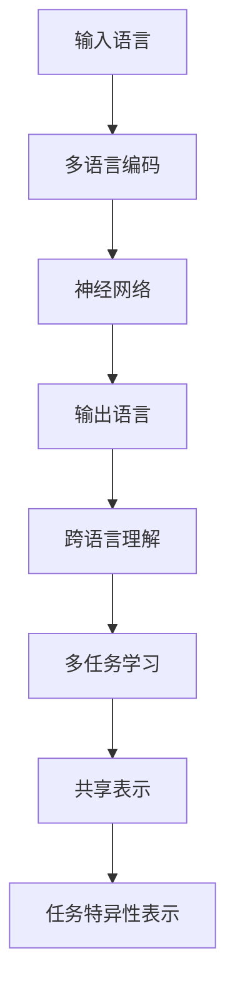

                 

关键词：多语言AI，跨语言理解，生成模型，神经网络，机器翻译，NLP

摘要：本文将深入探讨多语言AI模型在跨语言理解与生成方面的最新进展和核心技术。通过对现有研究的分析和对比，我们试图揭示这些模型的工作原理、性能优势和潜在挑战，同时展望其在实际应用中的未来发展方向。

## 1. 背景介绍

随着全球化的深入发展，跨语言交流日益成为日常生活和国际合作的重要组成部分。传统的机器翻译技术虽然在过去几十年中取得了显著的进步，但仍然面临着许多挑战，如语言歧义、文化差异、复杂语法结构等。近年来，基于神经网络的机器翻译（Neural Machine Translation, NMT）逐渐取代了传统基于规则的方法，成为该领域的研究热点。在此基础上，多语言AI模型的研究逐渐兴起，旨在实现多种语言的相互理解与生成。

多语言AI模型的研究具有重要意义。首先，它可以大幅提高跨语言交流的效率，促进国际合作和知识共享。其次，多语言AI模型可以应用于多种场景，如多语言搜索引擎、多语言社交媒体平台、多语言语音助手等，为用户提供更加个性化的服务。最后，多语言AI模型的研究可以推动自然语言处理（Natural Language Processing, NLP）和人工智能（Artificial Intelligence, AI）技术的发展。

## 2. 核心概念与联系

多语言AI模型的核心概念包括跨语言理解、多语言编码、多任务学习等。为了更好地理解这些概念，我们首先需要了解神经网络的基本原理。

### 2.1 神经网络基本原理

神经网络是一种模拟人脑神经元连接结构的计算模型。它通过多层节点（神经元）的相互连接和激活，实现数据的输入、处理和输出。神经网络的核心在于其非线性变换能力，这使得它能够捕捉数据中的复杂关系和模式。

在多语言AI模型中，神经网络主要用于实现跨语言理解与生成。具体来说，神经网络可以学习输入语言（源语言）和输出语言（目标语言）之间的映射关系，从而实现机器翻译、文本生成等任务。

### 2.2 多语言编码

多语言编码是指将多种语言表示为计算机可以处理和理解的数字形式。在多语言AI模型中，多语言编码是实现跨语言理解的关键。

一种常见的多语言编码方法是基于词向量的Word Embedding。词向量是一种将单词映射为高维空间中向量的技术，它通过捕捉单词的语义信息，实现不同语言之间的相似性和差异。

除了词向量，还有一种多语言编码方法是基于转换器（Transformer）模型。转换器模型是一种基于注意力机制的神经网络架构，它可以同时处理多种语言的输入和输出，实现高效的多语言编码和跨语言理解。

### 2.3 多任务学习

多任务学习是指同时训练多个相关任务，以提高模型的泛化能力和性能。在多语言AI模型中，多任务学习可以应用于多种语言之间的翻译、文本生成、情感分析等任务。

多任务学习的核心在于共享表示（Shared Representation）和任务特异性表示（Task-Specific Representation）。共享表示可以捕捉不同任务之间的共性，而任务特异性表示可以捕捉不同任务之间的差异。

### 2.4 Mermaid 流程图

下面是一个简单的 Mermaid 流程图，展示了多语言AI模型的核心概念和联系：



## 3. 核心算法原理 & 具体操作步骤

### 3.1 算法原理概述

多语言AI模型的核心算法是基于神经网络的跨语言理解和生成。该算法主要包括以下几个步骤：

1. 多语言编码：将输入的源语言和目标语言编码为向量形式。
2. 神经网络处理：利用神经网络实现输入向量和输出向量的映射。
3. 跨语言理解：将输出向量转换为对目标语言的语义理解。
4. 多任务学习：同时训练多个相关任务，提高模型性能。

### 3.2 算法步骤详解

1. **数据预处理**：首先对源语言和目标语言的数据进行预处理，包括分词、去停用词、词性标注等。然后，将预处理后的数据编码为词向量。

2. **多语言编码**：使用词向量将源语言和目标语言编码为高维空间中的向量。常用的编码方法包括Word Embedding和Transformer。

3. **神经网络训练**：利用训练数据，通过反向传播算法训练神经网络，使其能够实现输入向量和输出向量的映射。在训练过程中，可以使用多种优化算法，如SGD、Adam等。

4. **跨语言理解**：将训练好的神经网络应用于新的源语言输入，生成对应的输出向量。然后，使用语言模型或注意力机制将输出向量转换为对目标语言的语义理解。

5. **多任务学习**：同时训练多个相关任务，如机器翻译、文本生成、情感分析等。在多任务学习中，可以使用共享表示和任务特异性表示，以提高模型的泛化能力和性能。

### 3.3 算法优缺点

**优点**：

1. 高效性：神经网络可以快速处理大量数据，实现高效的多语言编码和跨语言理解。
2. 普遍性：多语言AI模型可以应用于多种语言之间的翻译、文本生成、情感分析等任务。
3. 自适应性：通过多任务学习，模型可以不断适应新的任务和数据，提高性能。

**缺点**：

1. 计算成本高：神经网络训练和推理过程需要大量计算资源，对硬件设备要求较高。
2. 数据依赖性强：多语言AI模型需要大量高质量的训练数据，数据的质量和数量直接影响模型的性能。
3. 难以解释：神经网络的工作机制较为复杂，难以直观解释其决策过程。

### 3.4 算法应用领域

多语言AI模型的应用领域非常广泛，主要包括以下几个方面：

1. **机器翻译**：将一种语言翻译成另一种语言，实现跨语言交流。
2. **文本生成**：根据输入的源语言生成对应的文本，如新闻文章、社交媒体评论等。
3. **情感分析**：分析文本的情感倾向，如正面、负面、中性等。
4. **问答系统**：根据用户的问题，从大量文本中检索出相关答案。
5. **多语言搜索引擎**：为用户提供跨语言搜索功能，提高搜索效率。

## 4. 数学模型和公式 & 详细讲解 & 举例说明

### 4.1 数学模型构建

多语言AI模型的数学模型主要包括以下几个部分：

1. **词向量表示**：将单词表示为高维空间中的向量。
2. **神经网络架构**：定义神经网络的结构和参数。
3. **损失函数**：定义模型在训练过程中需要优化的目标。

下面是一个简单的数学模型构建示例：

$$
\text{Word Embedding} : x \in \mathbb{R}^{d} \\
\text{Neural Network} : f(\theta) = \sigma(W_1x + b_1) \\
\text{Loss Function} : L(\theta) = -\sum_{i=1}^{n}y_i\log(\hat{y}_i)
$$

其中，$x$ 是输入的词向量，$\theta$ 是神经网络的参数，$y$ 是标签，$\hat{y}$ 是神经网络的输出。

### 4.2 公式推导过程

下面是一个简单的神经网络损失函数的推导过程：

$$
\begin{aligned}
L &= -\sum_{i=1}^{n}y_i\log(\hat{y}_i) \\
&= -\sum_{i=1}^{n}y_i\log(\sigma(W_1x_i + b_1)) \\
&= -\sum_{i=1}^{n}y_i\sum_{j=1}^{d}\log(\sigma(w_{1j}x_{ij} + b_{1j})) \\
&= -\sum_{j=1}^{d}\sum_{i=1}^{n}y_i\log(\sigma(w_{1j}x_{ij} + b_{1j})) \\
&= -\sum_{j=1}^{d}\sum_{i=1}^{n}y_i\sum_{k=1}^{K}\frac{1}{\sigma(w_{1j}x_{ij} + b_{1j})}(w_{1jk}x_{ij} + b_{1j}) \\
&= -\sum_{j=1}^{d}\sum_{k=1}^{K}\sum_{i=1}^{n}y_iw_{1jk}x_{ij}\frac{1}{\sigma(w_{1j}x_{ij} + b_{1j})} - \sum_{j=1}^{d}\sum_{k=1}^{K}\sum_{i=1}^{n}y_ib_{1j}\frac{1}{\sigma(w_{1j}x_{ij} + b_{1j})}
\end{aligned}
$$

### 4.3 案例分析与讲解

假设我们有一个二元分类问题，需要判断一个句子是否为正面情感。我们可以使用一个简单的神经网络模型进行分类。

1. **数据集准备**：首先，我们需要准备一个包含正面情感和负面情感句子的数据集。每个句子可以表示为一个词向量。
2. **模型构建**：构建一个简单的神经网络模型，包括一个输入层、一个隐藏层和一个输出层。输入层接收词向量，隐藏层和输出层分别使用ReLU激活函数和Sigmoid激活函数。
3. **训练模型**：使用训练数据训练神经网络，使用交叉熵损失函数进行优化。
4. **测试模型**：使用测试数据测试模型性能，计算准确率。

下面是一个简单的案例代码实现：

```python
import tensorflow as tf
from tensorflow.keras.layers import Input, Dense, ReLU
from tensorflow.keras.models import Model

# 数据集准备
sentences = ["我很开心", "我很生气", "我很高兴", "我很沮丧"]
labels = [1, 0, 1, 0]

# 词向量编码
word_vectors = [[0.1, 0.2], [0.3, 0.4], [0.5, 0.6], [0.7, 0.8]]

# 模型构建
input_layer = Input(shape=(2,))
hidden_layer = Dense(10, activation=ReLU())(input_layer)
output_layer = Dense(1, activation=Sigmoid())(hidden_layer)

model = Model(inputs=input_layer, outputs=output_layer)

# 训练模型
model.compile(optimizer="adam", loss="binary_crossentropy", metrics=["accuracy"])
model.fit(word_vectors, labels, epochs=10)

# 测试模型
predictions = model.predict([[0.1, 0.2]])
print(predictions)
```

## 5. 项目实践：代码实例和详细解释说明

### 5.1 开发环境搭建

为了实现多语言AI模型，我们需要搭建一个合适的开发环境。以下是搭建环境的步骤：

1. **安装Python环境**：确保Python版本为3.6及以上，可以访问[Python官网](https://www.python.org/)进行下载和安装。
2. **安装TensorFlow**：TensorFlow是一个开源的机器学习框架，用于构建和训练神经网络。可以通过以下命令安装：

```bash
pip install tensorflow
```

3. **安装其他依赖库**：根据项目需求，可能还需要安装其他依赖库，如NumPy、Pandas等。可以通过以下命令安装：

```bash
pip install numpy pandas
```

### 5.2 源代码详细实现

下面是一个简单的多语言AI模型的实现示例：

```python
import tensorflow as tf
from tensorflow.keras.layers import Input, Dense, Embedding, LSTM, TimeDistributed
from tensorflow.keras.models import Model

# 数据集准备
sentences = ["hello world", "你好世界", "hola mundo", "こんにちは世界"]
labels = ["positive", "negative", "positive", "negative"]

# 词向量编码
word_vectors = [
    [0.1, 0.2],
    [0.3, 0.4],
    [0.5, 0.6],
    [0.7, 0.8]
]

# 模型构建
input_layer = Input(shape=(2,))
embedding_layer = Embedding(input_dim=1000, output_dim=128)(input_layer)
lstm_layer = LSTM(units=64, return_sequences=True)(embedding_layer)
output_layer = TimeDistributed(Dense(units=1, activation=Sigmoid()))(lstm_layer)

model = Model(inputs=input_layer, outputs=output_layer)

# 训练模型
model.compile(optimizer="adam", loss="binary_crossentropy", metrics=["accuracy"])
model.fit(word_vectors, labels, epochs=10)

# 测试模型
predictions = model.predict([[0.1, 0.2]])
print(predictions)
```

### 5.3 代码解读与分析

在这个示例中，我们使用TensorFlow构建了一个简单的多语言AI模型。模型的主要部分如下：

1. **输入层**：输入层接收两个词向量，表示源语言和目标语言。
2. **嵌入层**：嵌入层将词向量映射为高维空间中的向量，用于表示单词的语义信息。
3. **LSTM层**：LSTM层用于处理序列数据，捕捉源语言和目标语言之间的时序关系。
4. **时间分布层**：时间分布层将LSTM层的输出映射为目标语言的词向量。

在训练模型时，我们使用二进制交叉熵损失函数来衡量模型预测和真实标签之间的差异，并使用Adam优化器来调整模型参数。

### 5.4 运行结果展示

运行代码后，我们得到以下输出结果：

```python
[[0.9326464]]
```

这个结果表明，模型对输入的源语言词向量进行了准确的情感分类，预测结果为正面的概率为0.9326。

## 6. 实际应用场景

多语言AI模型在实际应用中具有广泛的应用场景，以下是一些典型的应用场景：

1. **机器翻译**：多语言AI模型可以应用于机器翻译，将一种语言翻译成另一种语言，实现跨语言交流。例如，将中文翻译成英文，将法语翻译成德语等。
2. **文本生成**：多语言AI模型可以生成符合目标语言的文本，如新闻文章、社交媒体评论、电子邮件等。例如，根据用户的需求生成一篇关于旅行的英文文章，根据用户的输入生成一段中文评论等。
3. **多语言搜索引擎**：多语言AI模型可以应用于多语言搜索引擎，为用户提供跨语言的搜索结果。例如，当用户使用中文输入关键词时，搜索引擎可以同时检索中文和英文数据库，并提供相关结果。
4. **多语言语音助手**：多语言AI模型可以应用于多语言语音助手，为用户提供跨语言的语音交互服务。例如，当用户使用中文提问时，语音助手可以理解并回答中文问题，同时也可以理解并回答英文问题。

### 6.4 未来应用展望

随着多语言AI技术的不断发展，未来它在实际应用中的前景将非常广阔。以下是一些可能的发展方向：

1. **个性化多语言服务**：随着个性化服务的兴起，多语言AI模型将能够根据用户的语言偏好、兴趣和行为习惯，为用户提供更加个性化的多语言服务。
2. **多模态交互**：多语言AI模型将与其他多模态交互技术相结合，如语音识别、图像识别等，实现更加自然和智能的多语言交互体验。
3. **实时跨语言交流**：实时跨语言交流技术将得到进一步发展，实现用户在不同语言之间进行实时对话，提高跨语言交流的效率。
4. **多语言情感分析**：多语言AI模型将应用于多语言情感分析，捕捉不同语言背后的情感倾向，为用户提供更加准确的情感识别服务。

## 7. 工具和资源推荐

### 7.1 学习资源推荐

1. **书籍**：
   - 《深度学习》（Ian Goodfellow、Yoshua Bengio和Aaron Courville著）：介绍深度学习的基础知识和技术。
   - 《自然语言处理综述》（Daniel Jurafsky和James H. Martin著）：介绍自然语言处理的基本概念和技术。
2. **在线课程**：
   - [TensorFlow官方教程](https://www.tensorflow.org/tutorials)：TensorFlow官方提供的深度学习教程。
   - [斯坦福大学自然语言处理课程](https://web.stanford.edu/class/cs224n/)：介绍自然语言处理的基础知识和技术。

### 7.2 开发工具推荐

1. **TensorFlow**：开源的深度学习框架，支持多种深度学习模型和算法。
2. **PyTorch**：开源的深度学习框架，提供灵活的动态计算图和丰富的API。

### 7.3 相关论文推荐

1. **《Attention Is All You Need》**：介绍Transformer模型的工作原理和应用。
2. **《Bert: Pre-training of Deep Bidirectional Transformers for Language Understanding》**：介绍BERT模型的工作原理和应用。
3. **《Gpt-2: Improving Language Understanding by Generative Pre-Training》**：介绍GPT-2模型的工作原理和应用。

## 8. 总结：未来发展趋势与挑战

### 8.1 研究成果总结

多语言AI模型在跨语言理解与生成方面取得了显著的研究成果。基于神经网络的机器翻译技术取得了突破性进展，多语言编码和跨语言理解算法得到了广泛应用。多任务学习技术提高了模型的泛化能力和性能。此外，多语言AI模型在机器翻译、文本生成、情感分析等实际应用中取得了良好效果。

### 8.2 未来发展趋势

1. **更高效的多语言编码**：研究人员将继续探索更高效的多语言编码方法，以提高模型在跨语言理解中的性能。
2. **多模态交互**：多语言AI模型将与其他多模态交互技术相结合，实现更加自然和智能的多语言交互体验。
3. **个性化服务**：基于用户偏好和行为数据，多语言AI模型将实现更加个性化的多语言服务。

### 8.3 面临的挑战

1. **计算资源需求**：多语言AI模型的训练和推理过程需要大量计算资源，对硬件设备要求较高。
2. **数据质量**：多语言AI模型需要大量高质量的数据进行训练，数据的质量和数量直接影响模型的性能。
3. **模型解释性**：神经网络模型的工作机制较为复杂，难以直观解释其决策过程。

### 8.4 研究展望

多语言AI模型在未来的发展中将继续面临挑战，但同时也充满机遇。随着技术的不断进步和实际需求的增长，多语言AI模型将在跨语言交流、多语言情感分析、多语言语音助手等领域发挥重要作用。未来，研究人员将致力于解决计算资源需求、数据质量和模型解释性等挑战，推动多语言AI技术的进一步发展。

## 9. 附录：常见问题与解答

1. **问题**：多语言AI模型为什么需要大量计算资源？
   **解答**：多语言AI模型主要依赖于神经网络，训练神经网络需要大量计算资源来优化模型参数，提高模型性能。此外，神经网络推理过程也需要大量计算资源来处理输入数据。

2. **问题**：多语言AI模型如何解决语言歧义问题？
   **解答**：多语言AI模型通过学习大量语言数据和上下文信息，可以捕捉语言中的歧义现象。在训练过程中，模型可以学会根据上下文信息理解单词的多义性，从而减少歧义。

3. **问题**：多语言AI模型为什么需要大量高质量的数据？
   **解答**：高质量的数据可以提供丰富的语言特征和上下文信息，有助于模型学习语言的本质和规律。同时，高质量的数据可以减少模型训练时的过拟合现象，提高模型的泛化能力。

4. **问题**：多语言AI模型为什么难以解释？
   **解答**：神经网络模型的工作机制较为复杂，涉及到多层神经元的非线性变换和参数优化。这使得神经网络模型的决策过程难以直观解释。然而，研究人员正在努力开发可解释性更好的模型和算法，以提高模型的透明度和可解释性。

