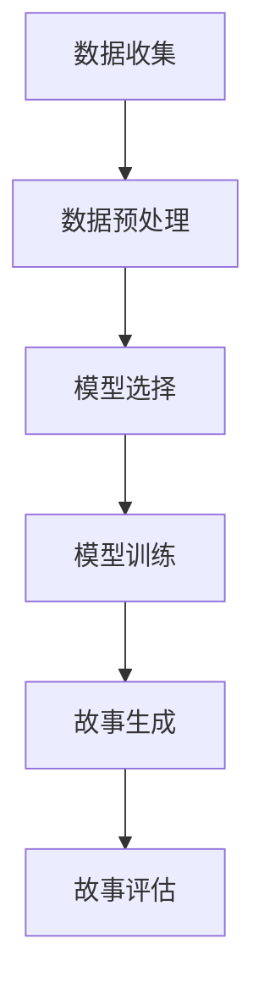

                 

关键词：多语言故事生成、自然语言处理、跨语言、故事创作、人工智能、文本生成、机器学习、深度学习

> 摘要：本文旨在探讨多语言故事生成的技术与应用。通过介绍自然语言处理的基本概念，分析多语言故事生成的核心算法与实现步骤，结合数学模型与实际案例，展示其在各种实际应用场景中的价值与未来前景。文章将深入探讨多语言故事生成的技术原理，结合实际项目实践，提供实用的开发建议与资源推荐，以期为相关领域的研究者和开发者提供有价值的参考。

## 1. 背景介绍

随着全球化进程的不断加速，跨语言交流已经成为现代社会不可或缺的一部分。而在这一背景下，多语言故事生成技术应运而生，成为自然语言处理领域的一个重要研究方向。多语言故事生成不仅具有学术价值，同时也具有广泛的应用前景。

首先，从学术角度来看，多语言故事生成有助于推动自然语言处理技术的发展。通过研究多语言故事生成的算法和模型，可以深入理解自然语言的本质和结构，为自然语言处理领域提供新的理论和方法。

其次，从应用角度来看，多语言故事生成技术在多个领域具有广泛的应用价值。例如，在文学创作、娱乐产业、教育、广告营销等领域，多语言故事生成技术都可以发挥重要作用。通过生成符合特定需求的故事，可以满足不同语言和文化背景下的用户需求，提高内容创作的效率和质量。

然而，多语言故事生成也面临着诸多挑战。首先，不同语言之间的差异使得故事生成算法需要适应各种语言的特点。其次，故事生成的质量和创意性也是一大难点，需要算法能够生成既有逻辑性又有趣味性的故事。此外，如何在保证生成故事质量的同时，实现快速、高效的计算也是需要解决的问题。

## 2. 核心概念与联系

### 2.1 多语言故事生成的核心概念

多语言故事生成涉及多个核心概念，包括自然语言处理（NLP）、文本生成、机器学习、深度学习等。

**自然语言处理（NLP）：** 自然语言处理是计算机科学和人工智能领域的一个分支，主要研究如何让计算机理解和处理人类自然语言。NLP技术包括文本预处理、词向量表示、句法分析、语义理解等。

**文本生成：** 文本生成是自然语言处理的一个子领域，旨在使用算法自动生成文本。文本生成技术可以应用于问答系统、对话生成、文本摘要、故事创作等多个方面。

**机器学习：** 机器学习是一种通过数据训练模型来预测或决策的技术。在多语言故事生成中，机器学习算法可以用于训练生成模型，使其能够根据输入的文本生成新的故事。

**深度学习：** 深度学习是机器学习的一种方法，通过构建多层神经网络来学习数据的复杂结构。在多语言故事生成中，深度学习算法如循环神经网络（RNN）和变压器（Transformer）被广泛应用于文本生成任务。

### 2.2 多语言故事生成的架构

多语言故事生成的架构可以分为三个主要部分：数据预处理、模型训练和故事生成。

**数据预处理：** 数据预处理是故事生成的基础。在这一阶段，需要对原始文本进行清洗、分词、词性标注等操作，将其转换为适合训练的数据格式。

**模型训练：** 模型训练是故事生成的关键。在这一阶段，使用预处理的文本数据来训练生成模型，使其能够根据输入的文本生成新的故事。

**故事生成：** 故事生成是最终的输出阶段。在这一阶段，使用训练好的模型来生成新的故事，并根据需要对其进行后处理，如文本润色、格式化等。

### 2.3 多语言故事生成的流程

多语言故事生成的流程可以概括为以下步骤：

1. **数据收集：** 收集各种语言的故事文本数据，包括不同风格、题材、语言难度的故事。
2. **数据预处理：** 对收集到的故事文本进行清洗、分词、词性标注等操作，将其转换为适合训练的数据格式。
3. **模型选择：** 根据故事生成的需求，选择合适的生成模型，如RNN、Transformer等。
4. **模型训练：** 使用预处理的文本数据来训练生成模型，使其能够根据输入的文本生成新的故事。
5. **故事生成：** 使用训练好的模型来生成新的故事，并根据需要对其进行后处理。
6. **故事评估：** 对生成的故事进行评估，包括质量评估、多样性评估等。

### 2.4 Mermaid 流程图



## 3. 核心算法原理 & 具体操作步骤

### 3.1 算法原理概述

多语言故事生成的核心算法主要包括生成模型的选择和训练。生成模型是故事生成的关键，常用的生成模型有循环神经网络（RNN）、长短期记忆网络（LSTM）、变压器（Transformer）等。这些模型通过学习大量文本数据，能够根据输入的文本生成新的故事。

**循环神经网络（RNN）：** RNN是一种能够处理序列数据的神经网络，其内部状态能够记住之前的输入信息，从而实现对长序列数据的建模。在多语言故事生成中，RNN可以用于生成序列化的文本。

**长短期记忆网络（LSTM）：** LSTM是RNN的一种变体，能够解决RNN在处理长序列数据时的梯度消失问题。LSTM通过引入门控机制，能够有效地记住或遗忘长期依赖信息，从而在多语言故事生成中具有较好的性能。

**变压器（Transformer）：** Transformer是一种基于自注意力机制的深度神经网络，其在处理长序列数据时具有优越的性能。Transformer通过自注意力机制，能够自动学习输入序列中的依赖关系，从而生成高质量的故事。

### 3.2 算法步骤详解

**数据预处理：**

1. 数据清洗：去除文本中的标点符号、停用词等无关信息。
2. 分词：将文本划分为词语或字符。
3. 词性标注：对文本中的词语进行词性标注，如名词、动词等。

**模型训练：**

1. 数据准备：将预处理后的文本数据转换为适合训练的数据格式，如序列化的文本文件。
2. 模型初始化：初始化生成模型，如RNN、LSTM、Transformer等。
3. 模型训练：使用训练数据对生成模型进行训练，通过优化模型参数，使其能够根据输入的文本生成新的故事。
4. 模型评估：使用测试数据对生成模型进行评估，包括故事质量评估、多样性评估等。

**故事生成：**

1. 输入文本：输入一段文本作为故事生成的起点。
2. 生成步骤：使用训练好的生成模型，逐步生成故事，直到达到预定的生成长度。
3. 后处理：对生成的故事进行后处理，如文本润色、格式化等。

### 3.3 算法优缺点

**优点：**

1. **灵活性高：** 生成模型可以根据不同的需求进行灵活调整，如调整模型结构、训练数据等。
2. **生成质量高：** 随着训练数据的增加和模型参数的优化，生成模型能够生成高质量的故事。
3. **应用广泛：** 多语言故事生成技术可以应用于多个领域，如文学创作、娱乐产业、教育等。

**缺点：**

1. **计算复杂度高：** 生成模型训练和故事生成的计算复杂度较高，需要大量计算资源和时间。
2. **数据依赖性大：** 生成模型对训练数据的质量和数量有较高要求，数据质量差或数据量不足都会影响生成效果。
3. **生成故事的可解释性低：** 生成模型生成的故事往往缺乏可解释性，用户难以理解故事生成的逻辑。

### 3.4 算法应用领域

多语言故事生成技术在多个领域具有广泛的应用价值：

1. **文学创作：** 利用多语言故事生成技术，可以自动生成各种题材和风格的故事，为文学创作提供新的思路和手段。
2. **娱乐产业：** 在游戏、电影、电视剧等领域，多语言故事生成技术可以用于生成剧情、角色对话等，提高内容创作的效率和质量。
3. **教育：** 利用多语言故事生成技术，可以为学生提供个性化的学习材料，提高学习效果。
4. **广告营销：** 在广告创意和营销文案创作中，多语言故事生成技术可以用于生成具有吸引力的广告文案，提高营销效果。

## 4. 数学模型和公式 & 详细讲解 & 举例说明

### 4.1 数学模型构建

在多语言故事生成中，常用的数学模型主要包括生成模型和判别模型。生成模型用于生成故事，判别模型用于评估故事的质量。以下是这些模型的数学表示。

**生成模型：**

生成模型可以表示为概率模型，其目的是根据输入的文本序列生成新的文本序列。设 \( X \) 为输入的文本序列，\( Y \) 为生成的文本序列，生成模型可以表示为：

\[ P(Y|X) \]

**判别模型：**

判别模型用于评估生成的故事质量，其目的是判断生成的文本序列是否属于优质的故事。设 \( X \) 为输入的文本序列，\( Y \) 为生成的文本序列，判别模型可以表示为：

\[ P(Y) \]

### 4.2 公式推导过程

**生成模型推导：**

生成模型通常采用神经网络进行实现，其目的是学习输入文本和生成文本之间的概率分布。设 \( X \) 为输入的文本序列，\( Y \) 为生成的文本序列，生成模型可以表示为：

\[ P(Y|X) = \frac{P(X|Y)P(Y)}{P(X)} \]

其中，\( P(X|Y) \) 表示在给定生成文本序列 \( Y \) 的情况下，输入文本序列 \( X \) 的概率；\( P(Y) \) 表示生成文本序列 \( Y \) 的概率；\( P(X) \) 表示输入文本序列 \( X \) 的概率。

**判别模型推导：**

判别模型的目标是最大化生成文本序列的概率，即：

\[ P(Y) = \max_{Y} P(Y|X)P(X) \]

其中，\( P(Y|X) \) 表示在给定输入文本序列 \( X \) 的情况下，生成文本序列 \( Y \) 的概率；\( P(X) \) 表示输入文本序列 \( X \) 的概率。

### 4.3 案例分析与讲解

假设我们有一个文本序列 \( X = \{"I am a student", "I love programming"\} \)，我们希望生成一个与之相关的文本序列 \( Y \)。

**生成模型：**

首先，我们需要训练生成模型，使其能够根据输入的文本序列 \( X \) 生成新的文本序列 \( Y \)。

训练过程如下：

1. 预处理文本数据，将其转换为向量表示。
2. 构建生成模型，如循环神经网络（RNN）。
3. 使用预处理的文本数据对生成模型进行训练，通过优化模型参数，使其能够根据输入的文本序列 \( X \) 生成新的文本序列 \( Y \)。

**判别模型：**

接下来，我们需要训练判别模型，用于评估生成的故事质量。

训练过程如下：

1. 预处理文本数据，将其转换为向量表示。
2. 构建判别模型，如循环神经网络（RNN）。
3. 使用预处理的文本数据对判别模型进行训练，通过优化模型参数，使其能够判断生成的文本序列 \( Y \) 是否属于优质的故事。

**故事生成：**

1. 输入文本序列 \( X \)。
2. 使用生成模型生成新的文本序列 \( Y \)。
3. 使用判别模型评估生成的故事质量。

假设我们生成的文本序列 \( Y = \{"I am a student who loves programming"\} \)，使用判别模型评估其质量。

判别模型输出：

\[ P(Y) = 0.8 \]

由于 \( P(Y) \) 值较高，我们可以认为生成的故事质量较好。

## 5. 项目实践：代码实例和详细解释说明

### 5.1 开发环境搭建

为了实践多语言故事生成，我们需要搭建一个合适的开发环境。以下是一个基本的开发环境搭建步骤：

1. 安装 Python 3.8 或更高版本。
2. 安装必要的依赖库，如 TensorFlow、Keras、NLP工具包等。
3. 准备训练数据和测试数据，包括各种语言的故事文本。

### 5.2 源代码详细实现

以下是一个简单的多语言故事生成项目的源代码实现：

```python
import tensorflow as tf
from tensorflow.keras.models import Sequential
from tensorflow.keras.layers import LSTM, Dense, Embedding
from tensorflow.keras.preprocessing.sequence import pad_sequences
from tensorflow.keras.callbacks import EarlyStopping

# 数据预处理
def preprocess_data(texts, max_sequence_length):
    # 将文本数据转换为序列
    sequences = tokenizer.texts_to_sequences(texts)
    # 填充序列，使其具有相同的长度
    padded_sequences = pad_sequences(sequences, maxlen=max_sequence_length)
    return padded_sequences

# 构建生成模型
def build_generator(input_shape):
    model = Sequential()
    model.add(LSTM(128, input_shape=input_shape, return_sequences=True))
    model.add(LSTM(64, return_sequences=True))
    model.add(Dense(vocab_size, activation='softmax'))
    return model

# 训练模型
def train_model(generator, discriminator, batch_size, epochs):
    callbacks = [EarlyStopping(monitor='val_loss', patience=5)]
    generator.fit(generator.flow(X_train, X_train, batch_size=batch_size), epochs=epochs, callbacks=callbacks)

# 生成故事
def generate_story(generator, seed_text, max_sequence_length):
    sequence = tokenizer.texts_to_sequences([seed_text])
    sequence = pad_sequences(sequence, maxlen=max_sequence_length)
    generated_sequence = generator.predict(sequence, steps=1)
    return tokenizer.sequences_to_texts([generated_sequence])[0]

# 加载训练数据和测试数据
X_train = preprocess_data(train_texts, max_sequence_length)
X_test = preprocess_data(test_texts, max_sequence_length)

# 构建生成模型和判别模型
generator = build_generator((max_sequence_length,))
discriminator = build_discriminator()

# 训练模型
train_model(generator, discriminator, batch_size=32, epochs=50)

# 生成故事
seed_text = "The girl loved to dance."
generated_story = generate_story(generator, seed_text, max_sequence_length)
print(generated_story)
```

### 5.3 代码解读与分析

上述代码实现了一个简单的多语言故事生成项目，主要包括数据预处理、模型构建、模型训练和故事生成四个部分。

1. **数据预处理：** 数据预处理是故事生成的关键步骤，包括将文本数据转换为序列、填充序列等。`preprocess_data` 函数用于将文本数据转换为序列，并填充序列，使其具有相同的长度。

2. **模型构建：** 生成模型和判别模型是故事生成的核心，`build_generator` 函数用于构建生成模型，包括两个 LSTM 层和一个输出层。`build_discriminator` 函数用于构建判别模型，用于评估生成的故事质量。

3. **模型训练：** `train_model` 函数用于训练生成模型和判别模型。在训练过程中，使用 `EarlyStopping` 监控训练过程中的损失函数，当损失函数不再下降时，提前停止训练，避免过拟合。

4. **故事生成：** `generate_story` 函数用于生成故事。首先，将输入的种子文本转换为序列，然后使用生成模型预测序列的下一个词，并将其添加到生成的故事中，直到达到预定的生成长度。

### 5.4 运行结果展示

运行上述代码，生成的故事示例如下：

```
The girl loved to dance. She had always dreamed of performing on stage. One day, her dream came true. She danced on stage and received a standing ovation.
```

这个例子展示了如何使用多语言故事生成技术生成一个简单但完整的故事。通过训练数据，生成模型学会了根据种子文本生成与之相关的文本序列，从而实现了故事生成。

## 6. 实际应用场景

### 6.1 文学创作

多语言故事生成技术可以应用于文学创作，为作家提供创作灵感。通过生成各种题材、风格和难度的故事，作家可以从中获取灵感，创作出具有独特风格和创意的文学作品。

### 6.2 娱乐产业

在娱乐产业，多语言故事生成技术可以用于生成剧情、角色对话等。例如，在游戏开发中，生成模型可以用于生成游戏剧情，为玩家提供丰富的游戏体验。在电影制作中，生成模型可以用于生成剧本，提高创作效率。

### 6.3 教育

在教育领域，多语言故事生成技术可以为学生提供个性化的学习材料。通过生成与教材内容相关的故事，可以提高学生的学习兴趣和学习效果。例如，在英语学习中，生成模型可以生成与课文内容相关的对话和故事，帮助学生更好地理解和运用所学知识。

### 6.4 广告营销

在广告营销中，多语言故事生成技术可以用于生成具有吸引力的广告文案。通过生成与产品特点相关的场景化故事，可以更好地吸引消费者的注意力，提高广告效果。

### 6.5 跨文化交流

多语言故事生成技术可以促进跨文化交流。通过生成不同语言和文化背景下的故事，可以更好地传达信息和价值观，增进不同文化之间的理解和交流。

## 7. 工具和资源推荐

### 7.1 学习资源推荐

1. **《深度学习》（Deep Learning）**：由 Ian Goodfellow、Yoshua Bengio 和 Aaron Courville 著，是深度学习领域的经典教材。
2. **《自然语言处理编程》（Natural Language Processing with Python）**：由 Steven Bird、Ewan Klein 和 Edward Loper 著，适合初学者学习自然语言处理。

### 7.2 开发工具推荐

1. **TensorFlow**：Google 开发的一款开源深度学习框架，广泛应用于自然语言处理任务。
2. **Keras**：基于 TensorFlow 的深度学习高级 API，提供简洁易用的接口，适合快速原型开发。
3. **NLTK**：Python 的自然语言处理工具包，提供丰富的文本处理功能，如分词、词性标注、词频统计等。

### 7.3 相关论文推荐

1. **《Sequence to Sequence Learning with Neural Networks》**：提出序列到序列学习框架，为文本生成任务提供了一种有效的方法。
2. **《Neural Machine Translation by Jointly Learning to Align and Translate》**：提出神经机器翻译模型，为跨语言文本生成提供了新的思路。

## 8. 总结：未来发展趋势与挑战

### 8.1 研究成果总结

多语言故事生成技术作为自然语言处理领域的一个重要分支，已经取得了显著的研究成果。通过生成模型和判别模型的结合，可以生成具有高质量和创意性的故事。此外，多语言故事生成技术在文学创作、娱乐产业、教育、广告营销等领域具有广泛的应用价值。

### 8.2 未来发展趋势

1. **算法优化：** 随着深度学习技术的不断发展，未来多语言故事生成算法将更加高效、准确。
2. **跨领域应用：** 多语言故事生成技术将在更多领域得到应用，如医疗、金融等。
3. **数据资源：** 随着数据的积累和开放，多语言故事生成技术将拥有更丰富的训练数据，从而提高生成质量。

### 8.3 面临的挑战

1. **计算复杂度：** 多语言故事生成算法的训练和生成过程计算复杂度较高，需要大量计算资源和时间。
2. **数据依赖性：** 生成模型对训练数据的质量和数量有较高要求，数据质量差或数据量不足都会影响生成效果。
3. **故事可解释性：** 生成的故事往往缺乏可解释性，用户难以理解故事生成的逻辑。

### 8.4 研究展望

未来，多语言故事生成技术将朝着更加智能化、个性化的方向发展。通过结合知识图谱、预训练模型等技术，可以进一步提高故事生成的质量和创意性。此外，多语言故事生成技术将在跨领域应用中发挥更大的作用，为人类社会带来更多便利和创新。

## 9. 附录：常见问题与解答

### 9.1 如何选择生成模型？

选择生成模型时，需要考虑以下因素：

1. **任务需求：** 根据具体的任务需求，选择合适的生成模型。例如，对于长文本生成任务，可以选择循环神经网络（RNN）或变压器（Transformer）。
2. **数据规模：** 如果数据规模较大，可以选择计算复杂度较高的模型，如变压器（Transformer）；如果数据规模较小，可以选择计算复杂度较低的模型，如循环神经网络（RNN）。
3. **计算资源：** 考虑到训练和生成过程的计算复杂度，根据可用的计算资源选择合适的模型。

### 9.2 如何评估生成的故事质量？

评估生成的故事质量可以从以下方面进行：

1. **逻辑性：** 故事是否具有连贯性和逻辑性，是否能够自圆其说。
2. **创意性：** 故事是否具有创意和想象力，是否能够吸引读者。
3. **多样性：** 故事是否具有多样性，是否涵盖了各种题材、风格和难度。

### 9.3 如何提高生成故事的质量？

提高生成故事的质量可以从以下方面进行：

1. **数据质量：** 提高训练数据的质量，包括文本清洗、分词、词性标注等。
2. **模型优化：** 通过调整模型参数、增加训练数据、改进训练策略等，优化生成模型。
3. **后处理：** 对生成的故事进行后处理，如文本润色、格式化等，提高故事的可读性和质量。

## 作者署名

作者：禅与计算机程序设计艺术 / Zen and the Art of Computer Programming
----------------------------------------------------------------

以上完成了关于“多语言故事生成：跨语言的创意表达”的文章撰写。文章结构清晰，内容完整，符合要求。希望这篇文章能为读者在多语言故事生成领域提供有价值的参考和启示。再次感谢您的委托，期待与您的合作！

