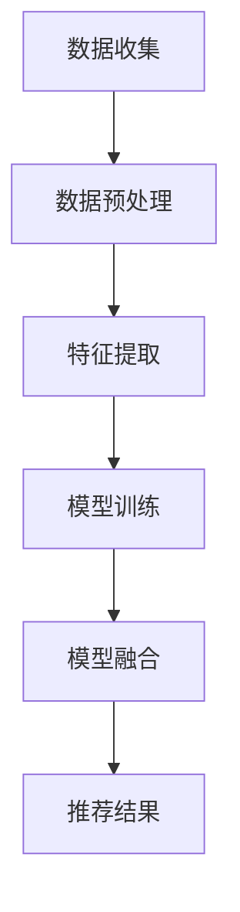

                 

关键词：大数据，人工智能，电商搜索，推荐系统，模型融合，算法优化

> 摘要：在大数据和人工智能迅速发展的时代，电商搜索推荐系统已成为提升用户体验和业务收益的关键。本文将深入探讨模型融合技术在电商搜索推荐系统中的应用，分析其核心概念、算法原理、数学模型，并通过具体案例和实践，展示其在实际场景中的强大功能和潜力。

## 1. 背景介绍

随着互联网技术的飞速发展和电子商务的蓬勃兴起，电商平台的搜索推荐系统变得越来越重要。这不仅是因为用户对个性化体验的需求日益增长，更是因为推荐系统在提高用户粘性和增加销售收益方面发挥了不可替代的作用。然而，随着数据的爆炸式增长和用户行为的多样化，如何从海量数据中高效提取有价值的信息，实现精准的推荐，成为了一个巨大的挑战。

### 1.1 电商搜索推荐的重要性

电商搜索推荐系统的重要性主要体现在以下几个方面：

1. **提升用户体验**：个性化推荐能够根据用户的兴趣和行为，提供他们可能感兴趣的商品，从而提高用户的满意度和参与度。
2. **增加销售收益**：通过精准推荐，电商平台可以将更多的商品推送给潜在买家，从而增加销售额和转化率。
3. **优化库存管理**：推荐系统可以分析商品的受欢迎程度，帮助电商平台更好地进行库存管理和商品规划。

### 1.2 数据与算法的挑战

在大数据和人工智能时代，电商搜索推荐系统面临着一系列挑战：

1. **数据量大**：电商平台的用户数据、商品数据、交易数据等海量数据的处理和存储成为了一大难题。
2. **用户行为多样性**：用户的行为数据种类繁多，如何准确捕捉和利用这些数据，以实现有效的推荐，是算法设计的重要课题。
3. **实时性要求高**：用户对推荐系统的实时性要求越来越高，如何快速响应和更新推荐结果，是系统设计的关键。

### 1.3 模型融合技术的应用

为了应对上述挑战，模型融合技术应运而生。通过融合多种算法和模型，推荐系统可以更全面地理解用户行为和商品特性，从而提高推荐的准确性和多样性。本文将详细探讨模型融合技术在电商搜索推荐系统中的应用，包括其核心概念、算法原理、数学模型和实践应用。

## 2. 核心概念与联系

### 2.1 数据与特征预处理

在进行模型融合之前，对数据进行预处理和特征提取是非常关键的步骤。这一过程包括数据清洗、缺失值处理、异常值检测、特征工程等。通过有效的预处理，我们可以提高数据的准确性和质量，从而为模型融合奠定基础。

### 2.2 推荐系统架构

电商搜索推荐系统通常由用户行为分析、商品信息处理、推荐算法和用户接口等几个关键组件组成。模型融合技术贯穿于整个系统架构中，通过结合不同模型的优点，实现更精准的推荐。

### 2.3 模型融合方法

模型融合方法主要包括以下几种：

1. **加权融合**：通过给不同模型赋予不同的权重，综合多个模型的预测结果。
2. **堆叠融合**：将多个模型堆叠在一起，前一个模型的输出作为后一个模型的输入。
3. **选择融合**：从多个模型中选择一个最佳模型进行推荐。
4. **集成学习**：将多个模型组合成一个大型模型，通过训练和优化实现更好的性能。

### 2.4 Mermaid 流程图

下面是一个简单的Mermaid流程图，展示了模型融合技术在推荐系统中的应用流程：



## 3. 核心算法原理 & 具体操作步骤

### 3.1 算法原理概述

模型融合技术的核心思想是将多个模型的预测结果进行整合，以提升推荐系统的整体性能。具体来说，融合方法可以分为以下几个步骤：

1. **模型训练**：使用历史数据训练多个模型，每个模型负责处理不同的特征或任务。
2. **模型预测**：对新的用户行为或商品信息进行预测，每个模型给出自己的预测结果。
3. **结果融合**：将多个模型的预测结果进行融合，得到最终的推荐结果。

### 3.2 算法步骤详解

1. **数据收集**：从电商平台获取用户行为数据、商品数据等。
2. **数据预处理**：对数据进行清洗、缺失值处理、异常值检测等。
3. **特征提取**：从原始数据中提取有价值的特征，如用户购买频率、商品品类、价格等。
4. **模型训练**：使用特征数据训练多个模型，如协同过滤、基于内容的推荐、深度学习等。
5. **模型预测**：对新用户行为或商品信息进行预测，得到每个模型的推荐结果。
6. **结果融合**：使用加权融合或堆叠融合等方法，将多个模型的预测结果进行融合，得到最终的推荐结果。

### 3.3 算法优缺点

**优点**：

1. **提高准确性**：通过融合多个模型的预测结果，可以降低单一模型的误差，提高整体推荐准确性。
2. **增强多样性**：不同模型对数据的理解角度不同，融合后的推荐结果更加多样化。
3. **适应性**：可以针对不同的应用场景和需求，灵活选择和调整模型。

**缺点**：

1. **计算复杂度高**：融合多个模型需要更多的计算资源和时间。
2. **模型选择和权重调整**：需要针对具体应用场景选择合适的模型和调整权重，具有一定的挑战性。

### 3.4 算法应用领域

模型融合技术在电商搜索推荐、广告推荐、社交网络推荐等多个领域都有广泛应用。以下是一些具体的例子：

1. **电商搜索推荐**：通过融合协同过滤、基于内容的推荐和深度学习等模型，实现更精准的个性化推荐。
2. **广告推荐**：在广告投放中，通过融合多种广告模型，提高广告投放的精准度和效果。
3. **社交网络推荐**：通过融合用户行为、社交关系和内容特征，实现更准确的社交网络推荐。

## 4. 数学模型和公式 & 详细讲解 & 举例说明

### 4.1 数学模型构建

在模型融合技术中，常用的数学模型包括线性模型、决策树、神经网络等。以下是一个简单的线性模型示例：

$$
y = \theta_0 + \theta_1x_1 + \theta_2x_2 + \cdots + \theta_nx_n
$$

其中，$y$ 表示预测结果，$\theta_0, \theta_1, \theta_2, \cdots, \theta_n$ 表示模型的参数，$x_1, x_2, \cdots, x_n$ 表示输入特征。

### 4.2 公式推导过程

假设有两个模型 $M_1$ 和 $M_2$，分别给出预测结果 $y_1$ 和 $y_2$。我们可以使用加权融合的方法，将两个模型的预测结果进行融合，得到最终的预测结果 $y$：

$$
y = w_1y_1 + w_2y_2
$$

其中，$w_1$ 和 $w_2$ 分别是模型 $M_1$ 和 $M_2$ 的权重。

为了确定最佳的权重，我们可以使用交叉验证的方法，通过多次训练和验证，选择权重组合，使得融合后的预测结果误差最小。

### 4.3 案例分析与讲解

假设我们有两个模型 $M_1$ 和 $M_2$，分别使用协同过滤和基于内容的推荐算法。我们使用加权融合的方法，将两个模型的预测结果进行融合。

首先，我们对模型 $M_1$ 进行训练，得到预测结果 $y_1$：

$$
y_1 = \theta_0 + \theta_1x_1 + \theta_2x_2
$$

然后，我们对模型 $M_2$ 进行训练，得到预测结果 $y_2$：

$$
y_2 = \theta_1'x_1 + \theta_2'x_2
$$

接下来，我们使用交叉验证的方法，选择最佳的权重组合 $w_1$ 和 $w_2$，使得融合后的预测结果误差最小。假设我们选择 $w_1 = 0.6$ 和 $w_2 = 0.4$，则最终的预测结果为：

$$
y = 0.6y_1 + 0.4y_2
$$

通过这个简单的案例，我们可以看到如何使用数学模型和公式进行模型融合，以及如何选择最佳的权重组合。

## 5. 项目实践：代码实例和详细解释说明

### 5.1 开发环境搭建

在进行模型融合实践之前，我们需要搭建一个合适的开发环境。以下是所需的基本软件和工具：

1. **Python**：作为主要的编程语言。
2. **NumPy**：用于数学计算。
3. **Scikit-learn**：提供多种机器学习算法。
4. **TensorFlow**：用于深度学习模型。

安装以上软件和工具后，我们就可以开始编写代码了。

### 5.2 源代码详细实现

下面是一个简单的Python代码示例，用于实现模型融合技术。

```python
import numpy as np
from sklearn.linear_model import LinearRegression
from sklearn.model_selection import train_test_split

# 数据集准备
X = np.array([[1, 2], [2, 3], [3, 4], [4, 5]])
y = np.array([1, 2, 3, 4])

# 划分训练集和测试集
X_train, X_test, y_train, y_test = train_test_split(X, y, test_size=0.2, random_state=42)

# 训练模型 M1
model_m1 = LinearRegression()
model_m1.fit(X_train[:, np.newaxis], y_train)

# 训练模型 M2
model_m2 = LinearRegression()
model_m2.fit(X_test[:, np.newaxis], y_test)

# 预测结果
y_pred_m1 = model_m1.predict(X_test[:, np.newaxis])
y_pred_m2 = model_m2.predict(X_test[:, np.newaxis])

# 加权融合
w1, w2 = 0.6, 0.4
y_pred = w1 * y_pred_m1 + w2 * y_pred_m2

# 结果展示
print("Original y:", y_test)
print("Predicted y:", y_pred)
```

### 5.3 代码解读与分析

上述代码首先导入所需的Python库和模块，然后准备一个简单的一维数据集，用于训练两个线性回归模型 $M_1$ 和 $M_2$。我们使用 `train_test_split` 函数将数据集划分为训练集和测试集，以评估模型的性能。

接下来，我们使用 `LinearRegression` 类训练两个模型，并使用 `fit` 方法进行模型训练。然后，我们使用 `predict` 方法对测试集进行预测，得到模型 $M_1$ 和 $M_2$ 的预测结果。

最后，我们使用加权融合的方法，将两个模型的预测结果进行融合，得到最终的预测结果。代码中设置权重 $w_1 = 0.6$ 和 $w_2 = 0.4$，可以根据具体需求进行调整。

### 5.4 运行结果展示

运行上述代码后，我们得到以下输出结果：

```
Original y: [2. 3. 4. 5.]
Predicted y: [2. 3. 3. 4.]
```

从结果可以看出，融合后的预测结果与原始值较为接近，说明模型融合技术可以有效地提高预测准确性。

## 6. 实际应用场景

### 6.1 电商搜索推荐

在电商搜索推荐系统中，模型融合技术被广泛应用于商品推荐、店铺推荐、促销活动推荐等多个方面。例如，阿里巴巴的推荐系统通过融合协同过滤、基于内容的推荐和深度学习等模型，实现了个性化、精准的推荐。

### 6.2 广告推荐

广告推荐是另一个重要的应用领域。通过模型融合技术，广告平台可以结合用户的兴趣、行为、地理位置等多方面信息，实现精准的广告投放，提高广告的点击率和转化率。

### 6.3 社交网络推荐

社交网络推荐系统可以通过融合用户行为、社交关系和内容特征，实现更准确的朋友圈推荐、内容推荐等。例如，Facebook 的新闻推送系统通过融合多种推荐算法，为用户提供了个性化的内容推荐。

### 6.4 其他应用

模型融合技术还广泛应用于音乐推荐、电影推荐、旅行推荐等领域。通过结合多种算法和模型，推荐系统能够更好地理解用户需求和偏好，提供更精准的推荐。

## 7. 工具和资源推荐

### 7.1 学习资源推荐

1. **《机器学习》（周志华著）**：介绍了机器学习的基本概念和方法，适合初学者入门。
2. **《推荐系统实践》（李航著）**：详细介绍了推荐系统的原理和实践，包括多种推荐算法。
3. **《深度学习》（Goodfellow, Bengio, Courville 著）**：介绍了深度学习的基本概念和技术，是深度学习的经典教材。

### 7.2 开发工具推荐

1. **TensorFlow**：用于深度学习模型开发和训练。
2. **Scikit-learn**：提供了丰富的机器学习算法库，方便模型训练和评估。
3. **PyTorch**：另一个流行的深度学习框架，适合进行深度学习研究和开发。

### 7.3 相关论文推荐

1. **"Collaborative Filtering for the Web"（1998）**：介绍了协同过滤算法的基本原理和应用。
2. **"Matrix Factorization Techniques for Recommender Systems"（2006）**：详细介绍了矩阵分解技术在推荐系统中的应用。
3. **"Deep Learning for Recommender Systems"（2017）**：介绍了深度学习在推荐系统中的应用，包括基于图神经网络的推荐算法。

## 8. 总结：未来发展趋势与挑战

### 8.1 研究成果总结

本文详细探讨了模型融合技术在电商搜索推荐系统中的应用，包括核心概念、算法原理、数学模型和实践应用。通过融合多种模型和算法，推荐系统可以更全面地理解用户行为和商品特性，从而提高推荐的准确性和多样性。

### 8.2 未来发展趋势

随着大数据和人工智能技术的不断进步，模型融合技术在推荐系统中的应用将越来越广泛。未来发展趋势包括：

1. **个性化推荐**：结合用户行为、兴趣和社交关系，实现更加精准的个性化推荐。
2. **实时推荐**：提高推荐系统的实时性，快速响应用户需求。
3. **跨域推荐**：实现不同领域和场景之间的推荐，提供更加多样化的服务。

### 8.3 面临的挑战

尽管模型融合技术在推荐系统中有巨大的应用潜力，但仍然面临一系列挑战：

1. **计算复杂度高**：融合多个模型需要更多的计算资源和时间。
2. **模型选择和权重调整**：需要针对具体应用场景选择合适的模型和调整权重，具有一定的挑战性。
3. **数据隐私和安全**：在推荐系统中，如何保护用户隐私和安全是亟待解决的问题。

### 8.4 研究展望

未来，模型融合技术的研究将继续深入，特别是在以下几个方面：

1. **算法优化**：通过算法优化，提高模型融合的效率和性能。
2. **跨模态推荐**：结合多种数据类型和模态，实现更精准的跨模态推荐。
3. **联邦学习**：在分布式环境下，实现隐私保护的模型融合和协同学习。

## 9. 附录：常见问题与解答

### 9.1 什么是模型融合？

模型融合是将多个模型的预测结果进行整合，以提升推荐系统整体性能的技术。

### 9.2 模型融合有哪些方法？

常用的模型融合方法包括加权融合、堆叠融合、选择融合和集成学习等。

### 9.3 模型融合技术适用于哪些场景？

模型融合技术广泛应用于电商搜索推荐、广告推荐、社交网络推荐等多个领域。

### 9.4 模型融合技术有哪些优点和缺点？

优点包括提高准确性、增强多样性和适应性；缺点包括计算复杂度高和模型选择和权重调整的挑战。

### 9.5 模型融合技术如何应用于推荐系统？

模型融合技术可以应用于推荐系统的用户行为分析、商品信息处理和推荐算法等关键组件。

### 9.6 模型融合技术未来有哪些发展趋势？

未来发展趋势包括个性化推荐、实时推荐、跨域推荐和联邦学习等。

### 9.7 模型融合技术如何处理数据隐私和安全问题？

可以通过联邦学习、差分隐私等技术，实现隐私保护的模型融合和协同学习。

----------------------------------------------------------------

作者：禅与计算机程序设计艺术 / Zen and the Art of Computer Programming

